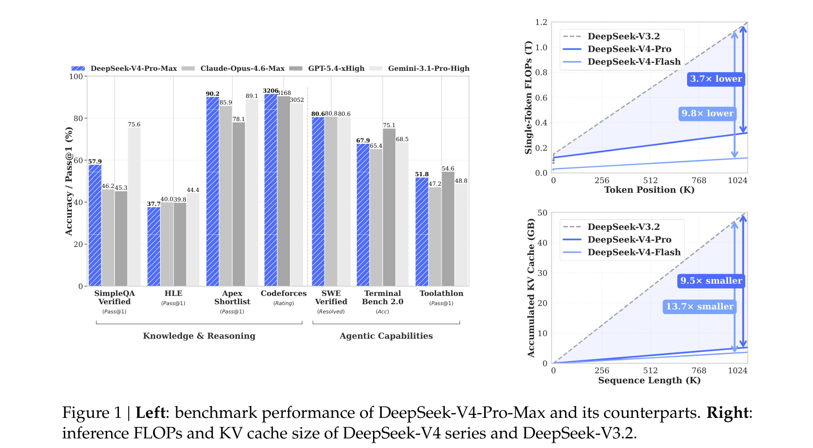
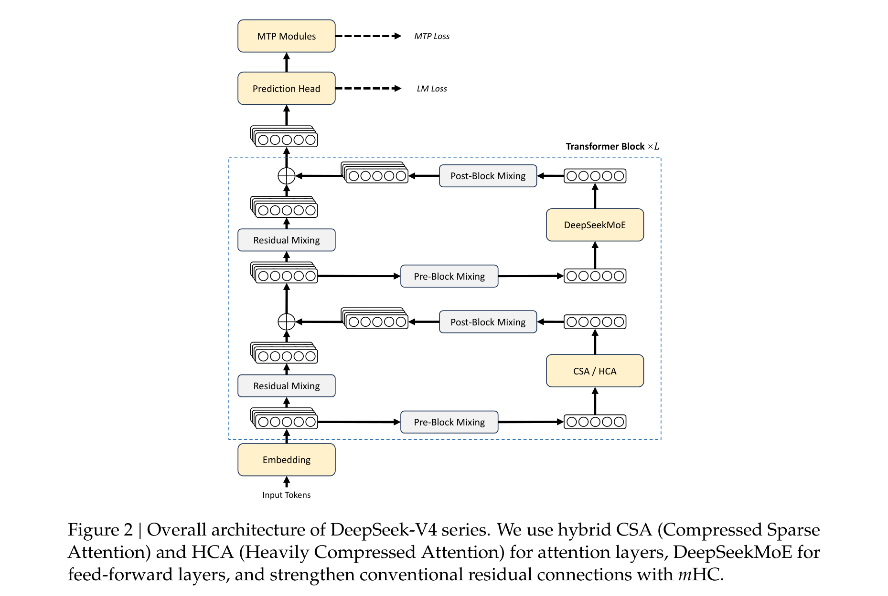
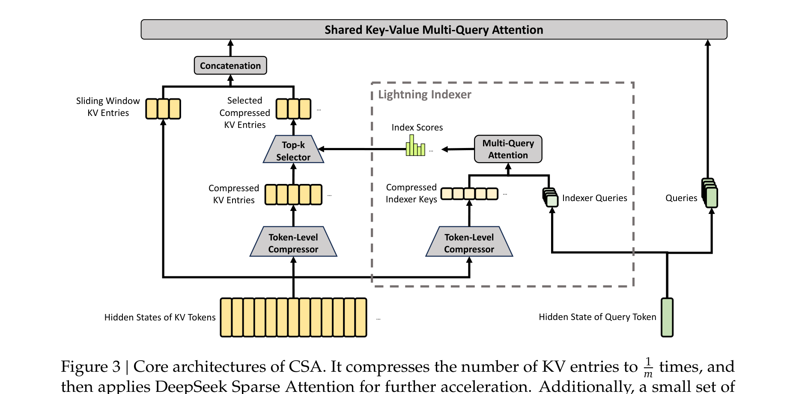
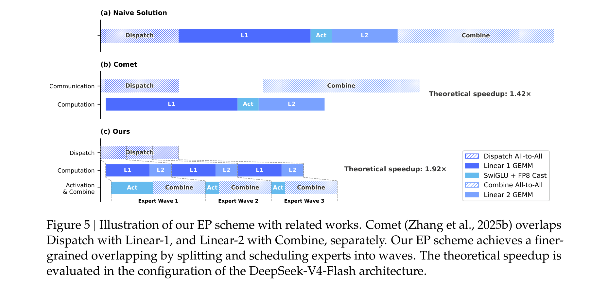
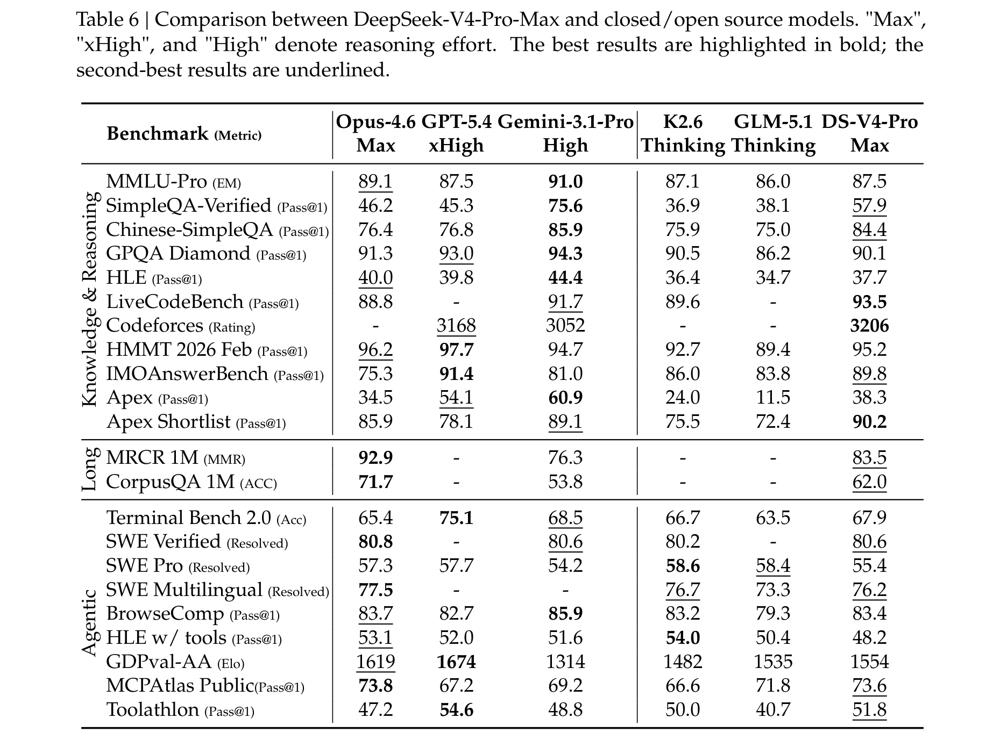
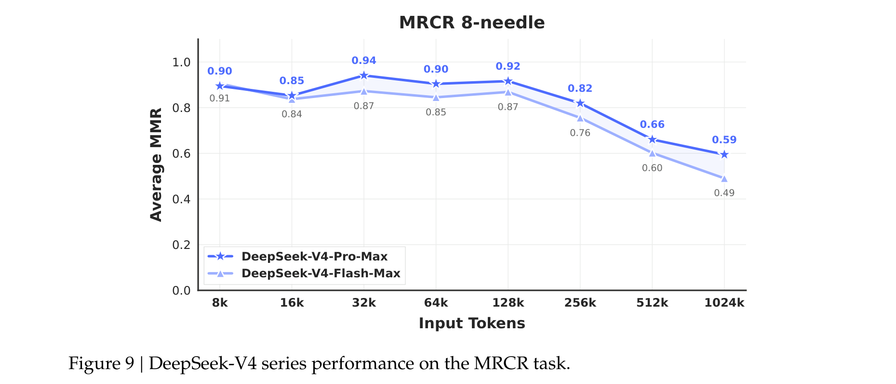

# DeepSeek-V4: Towards Highly Efficient Million-Token Context Intelligence

**Authors:** DeepSeek-AI (research@deepseek.com)
**Date:** 2026 (preview release)
**Paper:** [PDF](https://huggingface.co/deepseek-ai/DeepSeek-V4-Pro/blob/main/DeepSeek_V4.pdf)
**Checkpoints:** [huggingface.co/collections/deepseek-ai/deepseek-v4](https://huggingface.co/collections/deepseek-ai/deepseek-v4)

---

## TL;DR

DeepSeek-V4 introduces two MoE language models — DeepSeek-V4-Pro (1.6T total, 49B activated) and DeepSeek-V4-Flash (284B total, 13B activated) — both natively supporting 1M-token contexts. The key breakthrough is efficiency: through a hybrid attention architecture combining Compressed Sparse Attention (CSA) and Heavily Compressed Attention (HCA), DeepSeek-V4-Pro requires only **27% of the single-token inference FLOPs** and **10% of the KV cache** compared to DeepSeek-V3.2 at 1M context. DeepSeek-V4-Pro-Max (maximum reasoning effort) redefines the open-source state-of-the-art, achieving a Codeforces rating of 3206, 120/120 on PutnamBench formal proofs, and competitive performance with GPT-5.4 and Gemini-3.1-Pro.

---

## Key Figures

### Figure 1: Benchmark Performance and Inference Efficiency

**Left:** DeepSeek-V4-Pro-Max (blue striped) benchmarked against Claude Opus 4.6, GPT-5.4, and Gemini-3.1-Pro across knowledge/reasoning and agentic tasks. It leads on SimpleQA (57.9 vs 46.2 for Opus) and Codeforces (3206), while trailing slightly on GPQA (90.1 vs 94.3 for Gemini) and HLE (37.7 vs 44.4 for Gemini). **Right:** At 1M tokens, DeepSeek-V4-Pro's single-token FLOPs are 3.7x lower than V3.2, and V4-Flash is 9.8x lower. KV cache is 9.5x smaller for V4-Pro and 13.7x smaller for V4-Flash.

### Figure 2: Overall Architecture

Each Transformer block consists of: (1) Pre-Block and Post-Block Mixing via mHC (Manifold-Constrained Hyper-Connections) that replace standard residual connections, (2) CSA or HCA layers for attention (interleaved across the model), and (3) DeepSeekMoE layers for feed-forward computation. The model also includes Multi-Token Prediction (MTP) modules at the top.

### Figure 3: Compressed Sparse Attention (CSA) Architecture

CSA works in two stages: First, a Token-Level Compressor consolidates every m KV entries into one compressed entry (reducing KV cache by 1/m). Then a Lightning Indexer (right) uses compressed indexer keys and low-rank queries to compute index scores, selecting the top-k most relevant compressed entries via a Top-k Selector. These selected entries, combined with a small sliding window of recent uncompressed entries, are passed to the final Shared Key-Value Multi-Query Attention.

### Figure 5: Fine-Grained Expert Parallelism

DeepSeek-V4's Expert Parallelism scheme (bottom, "Ours") achieves 1.92x theoretical speedup over the naive approach by splitting experts into small "waves" and pipelining Dispatch, computation (Linear-1, Activation, Linear-2), and Combine operations. Each wave's communication can start while the previous wave's computation is still running.

### Table 6: Main Benchmark Comparison

DeepSeek-V4-Pro-Max vs. Opus 4.6, GPT-5.4, Gemini-3.1-Pro, K2.6, and GLM-5.1 across knowledge, reasoning, long-context, and agentic benchmarks. Key results: SimpleQA 57.9 (vs Opus 46.2), Codeforces 3206 (vs GPT 3168), MRCR 1M 83.5 (vs Gemini 76.3), Terminal Bench 67.9 (vs GPT 75.1). DeepSeek-V4-Pro-Max is the clear open-source leader but trails frontier proprietary models on several harder benchmarks.

### Figure 9: Long-Context Performance (MRCR 8-Needle)

DeepSeek-V4-Pro-Max maintains strong retrieval accuracy (MMR ≥ 0.82) up to 128K tokens, with graceful degradation to 0.59 at 1M tokens. DeepSeek-V4-Flash-Max follows a similar pattern but drops off more steeply at longer contexts (0.49 at 1M).

---

## Key Novel Ideas

### 1. Hybrid CSA + HCA Attention Architecture

The biggest innovation in DeepSeek-V4 is a hybrid attention system that makes 1M-token contexts practically feasible by dramatically reducing both FLOPs and KV cache.

**The problem:** Standard attention has O(n²) complexity. Even DeepSeek-V3.2's sparse attention (DSA) still stores full KV caches. At 1M tokens, KV cache alone can consume tens of GB.

**The solution:** Two complementary compressed attention mechanisms that are interleaved across layers:

**Compressed Sparse Attention (CSA):** Compresses the KV cache by a factor of m (e.g., m=4), then applies sparse attention on the compressed entries.
- Step 1: Every m consecutive hidden states are compressed into one KV entry using learned compression weights and softmax-weighted pooling (Equations 9-12).
- Step 2: A "Lightning Indexer" quickly identifies the top-k most relevant compressed entries. It uses separate compressed indexer keys and low-rank queries to compute index scores cheaply in FP4 precision.
- Step 3: Standard Multi-Query Attention is performed over only the top-k selected compressed entries plus a small sliding window of recent uncompressed tokens.

**Heavily Compressed Attention (HCA):** Uses a much larger compression ratio m' (e.g., m'=128) but keeps dense attention (no sparsity).
- Every m' hidden states → one compressed KV entry via softmax pooling.
- Dense attention over all compressed entries. Since m'=128, a 1M-token sequence has only ~8K KV entries, making dense attention cheap.
- Also includes a sliding window branch for local dependencies.

**The interleaving pattern:** The first two layers use pure sliding window attention. Then CSA and HCA layers alternate. HCA handles global context cheaply; CSA handles mid-range dependencies with precision.

**Net effect at 1M context (DeepSeek-V4-Pro vs V3.2):**
- Single-token FLOPs: 27% (3.7x reduction)
- KV cache: 10% (9.5x reduction)
- Compared to BF16 GQA8 (a common attention baseline): KV cache reduced to ~2%

### 2. Manifold-Constrained Hyper-Connections (mHC)

Standard residual connections simply add the layer output to the input: x_{l+1} = x_l + F_l(x_l). Hyper-Connections (HC) expand the residual stream by a factor n_hc for more expressive mixing, but they're numerically unstable when stacked deeply.

**mHC's key idea:** Constrain the residual mapping matrix B_l to the manifold of **doubly stochastic matrices** (the Birkhoff polytope):

$$B_l \in \mathcal{M} := \{M \in \mathbb{R}^{n \times n} \mid M\mathbf{1}_n = \mathbf{1}_n, \mathbf{1}_n^T M = \mathbf{1}_n^T, M \geq 0\}.$$

This guarantees the spectral norm ‖B_l‖₂ ≤ 1, making the residual transformation **non-expansive**. Signals can't blow up through deep stacking. The doubly stochastic property ensures the transform preserves the "total mass" of activations.

The three linear mappings A_l (input), B_l (residual), C_l (output) are generated dynamically — they depend on the input — via learned parameter matrices. B_l is projected onto the doubly stochastic manifold using 20 iterations of the Sinkhorn-Knopp algorithm (alternating row and column normalization of exp(B̃_l)). A_l and C_l are constrained to be non-negative via Sigmoid.

**Implementation cost:** Only 6.7% wall-time overhead for the overlapped 1F1B pipeline stage.

### 3. Muon Optimizer for Large-Scale MoE Training

DeepSeek-V4 replaces AdamW with the Muon optimizer for most parameters. Muon performs approximate orthogonalization of the gradient update via Newton-Schulz iterations, which has been shown to improve convergence and training stability.

**DeepSeek-V4's Muon recipe:**
- Uses hybrid Newton-Schulz iterations (Equation 28): 8 aggressive steps with coefficients (3.4445, −4.7750, 2.0315) for fast convergence, then 2 stabilizing steps with (2, −1.5, 0.5).
- Rescales the update RMS by √(max(n,m)) · γ for reutilization of AdamW learning rates.
- AdamW is retained for: embedding, prediction head, mHC static biases/gating factors, and RMSNorm weights.
- The architecture's RMSNorm on attention queries and KV entries avoids exploding logits, eliminating the need for QK-Clip.

**ZeRO strategy for Muon:** Since Muon needs the full gradient matrix (not element-wise), standard ZeRO partitioning doesn't directly apply. They use a knapsack algorithm to assign full parameter matrices to ranks, limiting each rank to ≤5 matrices with ≤10% memory overhead from padding.

### 4. Specialist Training + On-Policy Distillation (OPD)

The post-training pipeline has two stages:

**Stage 1 — Specialist Training:** Train 10+ domain-specific expert models independently. Each expert is fine-tuned on domain data (math, code, agents, instruction following, etc.) followed by GRPO reinforcement learning with domain-specific reward models. Three reasoning effort modes — Non-think, Think High, Think Max — are trained with different length penalties and context windows.

**Stage 2 — On-Policy Distillation (OPD):** Merge all expert capabilities into a single unified model. The key innovation is **full-vocabulary logit distillation**:

$$\mathcal{L}_{\text{OPD}}(\theta) = \sum_{i=1}^{N} w_i \cdot D_{\text{KL}}(\pi_\theta \| \pi_{E_i})$$

where the student generates its own trajectories and is trained to match each teacher's full output distribution via reverse KL. Prior work used single-token KL estimates (sg[log(π_E/π_θ)] as advantage), which causes high gradient variance. Full-vocabulary distillation preserves the complete logit distribution, yielding more stable gradients. The engineering challenge of materializing |V| > 100K logits per token across 10+ teachers is solved by caching teacher hidden states and recomputing logits on-the-fly.

### 5. Generative Reward Model (GRM)

Instead of training a separate scalar reward model for hard-to-verify tasks, DeepSeek-V4 uses the **actor model itself** as the reward model. Rubric-guided RL data is curated, and the model evaluates its own outputs using its reasoning capabilities. This unifies generation and evaluation, requiring only minimal human annotations since the model's internal reasoning provides robust scoring.

### 6. Training Stability: Anticipatory Routing + SwiGLU Clamping

Two practical techniques to prevent loss spikes during training:

**Anticipatory Routing:** The routing network's parameters are decoupled from the backbone by one step: at step t, routing indices use parameters θ_{t−Δt} while features use θ_t. This breaks the cycle where outlier activations cause extreme routing, which causes worse outliers. An automatic detection mechanism activates Anticipatory Routing only during loss spikes (adding ~20% wall-time overhead when active).

**SwiGLU Clamping:** The linear component of SwiGLU is clamped to [−10, 10] and the gate component is capped at 10. This eliminates outliers and stabilizes training, though the theoretical reason why it works isn't fully understood.

---

## Architecture Details

| Parameter | DeepSeek-V4-Flash | DeepSeek-V4-Pro |
|-----------|-------------------|-----------------|
| Transformer layers | 43 | 61 |
| Hidden dimension d | 4096 | 7168 |
| Total parameters | **284B** | **1.6T** |
| Activated parameters | **13B** | **49B** |
| CSA compression rate m | 4 | 4 |
| HCA compression rate m' | 128 | 128 |
| CSA sparse attention top-k | 512 | 1024 |
| Query heads (CSA & HCA) n_h | 64 | 128 |
| Head dimension c | 512 | 512 |
| Query compression dim d_c | 1024 | 1536 |
| Indexer head dim c^I | 128 | 128 |
| Indexer query heads n_h^I | 64 | 64 |
| Output projection groups g | 8 | 16 |
| Sliding window n_win | 128 | 128 |
| MoE experts (shared + routed) | 1 + 256 | 1 + 384 |
| Expert hidden dim | 2048 | 3072 |
| Activated experts per token | 6 | 6 |
| mHC expansion factor n_hc | 4 | 4 |
| Sinkhorn-Knopp iterations | 20 | 20 |
| MTP depth | 1 | 1 |
| Vocabulary size | 128K | 128K |
| Context length | **1M** | **1M** |

---

## Training Pipeline

### Pre-Training Data
- 32T tokens (V4-Flash), 33T tokens (V4-Pro)
- Sources: web, code, math, multilingual, long-document data (scientific papers, technical reports)
- Enhanced filtering to remove auto-generated/templated content
- Agentic data added during mid-training phase

### Pre-Training Schedule
1. **Warm-up with dense attention:** Train on short sequences (4K) with full dense attention for the first 1T tokens.
2. **Introduce sparse attention:** Switch to CSA/HCA sparse attention at 64K sequence length. First warm up the Lightning Indexer in CSA, then enable sparse selection.
3. **Extend context length:** Gradually extend from 4K → 16K → 64K → 1M.
4. **Batch size scheduling:** Increase from small to 75.5M (Flash) / 94.4M (Pro) tokens.
5. **Learning rate:** Cosine schedule, peak 2.7×10⁻⁴ (Flash) / 2.0×10⁻⁴ (Pro), decaying to 1/10th.

### Post-Training
1. **Specialist Training:** 10+ domain experts independently trained via SFT + GRPO RL.
2. **On-Policy Distillation:** Multi-teacher full-vocabulary KL distillation to merge experts.
3. **FP4 QAT:** Quantization-Aware Training for MoE expert weights and CSA indexer QK path. FP4-to-FP8 dequantization is lossless due to FP4's wider dynamic range (E4M3 vs E2M1).

---

## Key Results

### Base Model Comparison (Internal Eval, Table 1)

| Benchmark | DS-V3.2 Base (37B/671B) | DS-V4-Flash Base (13B/284B) | DS-V4-Pro Base (49B/1.6T) |
|-----------|-------------------------|---------------------------|-------------------------|
| MMLU (EM) | 87.8 | 88.7 | **90.1** |
| SimpleQA (EM) | 28.3 | 30.1 | **55.2** |
| MATH (EM) | 60.5 | 57.4 | **64.5** |
| HumanEval (Pass@1) | 62.8 | 69.5 | **76.8** |
| LongBench-V2 (EM) | 40.2 | 44.7 | **51.5** |

V4-Flash-Base already surpasses V3.2-Base despite being much smaller (13B vs 37B activated).

### Post-Trained Model vs. Frontier (Table 6, selected)

| Benchmark | Opus 4.6 Max | GPT-5.4 xHigh | Gemini-3.1 High | DS-V4-Pro Max |
|-----------|-------------|---------------|-----------------|---------------|
| MMLU-Pro | 89.1 | 87.5 | **91.0** | 87.5 |
| SimpleQA-Verified | 46.2 | 45.3 | 75.6 | **57.9** |
| GPQA Diamond | 91.3 | **93.0** | 94.3 | 90.1 |
| HLE | **40.0** | 39.8 | **44.4** | 37.7 |
| Codeforces | — | 3168 | 3052 | **3206** |
| HMMT 2026 | 96.2 | **97.7** | 94.7 | 95.2 |
| MRCR 1M | 92.9 | — | 76.3 | **83.5** |
| Terminal Bench 2.0 | 65.4 | **75.1** | 68.5 | 67.9 |
| SWE Verified | **80.8** | — | 80.6 | 80.6 |

### Formal Math (PutnamBench, Figure 8)
- **Practical regime** (Pass@8, minimal tools): DS-V4-Flash-Max scores **81.00** vs Seed-2.0-Pro 35.50, Gemini-3-Pro 26.50.
- **Frontier regime** (hybrid formal-informal, substantial compute): DeepSeek-V4 achieves **120/120** proof-perfect, matching the best known results.

### Code Agent (Internal R&D Benchmark, Table 8)
| Model | Pass Rate (%) |
|-------|--------------|
| Haiku 4.5 | 13 |
| Sonnet 4.5 | 47 |
| DS-V4-Pro-Max | **67** |
| Opus 4.5 | 70 |
| Opus 4.5 Thinking | 73 |
| Opus 4.6 Thinking | **80** |

### Chinese Writing (vs Gemini-3.1-Pro)
- Functional writing: 62.7% win rate for DeepSeek-V4-Pro.
- Creative writing: 77.5% win rate on writing quality.

### White-Collar Tasks (vs Opus 4.6-Max)
- Overall 53% win / 10% tie / 37% lose for DeepSeek-V4-Pro-Max.
- Strong on Task Completion (98.32 vs 96.68) and Content Quality (87.78 vs 86.52).

---

## Key Takeaways

1. **KV cache compression is the path to million-token contexts.** The hybrid CSA+HCA design reduces KV cache to ~2% of a standard BF16 GQA8 baseline at 1M tokens. This is what makes 1M-token inference practical on existing hardware, not just theoretically possible.

2. **Compression and sparsity serve different roles.** CSA compresses moderately (4x) and then applies sparsity (top-k selection) for mid-range precision. HCA compresses aggressively (128x) but uses dense attention for global context. Combining both gives better results than either alone.

3. **Smaller but better-designed models win.** V4-Flash (13B activated, 284B total) outperforms V3.2 (37B activated, 671B total) on most benchmarks despite being 3x smaller in activated parameters. The architectural innovations (CSA, HCA, mHC, Muon) are individually important.

4. **Doubly stochastic constraints stabilize deep residual streams.** mHC's core insight — constraining the residual mixing matrix to the Birkhoff polytope — guarantees spectral norm ≤ 1, preventing signal blowup across 60+ layers. Naive HC without this constraint is unstable.

5. **Muon optimizer provides meaningful gains at scale.** Faster convergence and improved stability justified the significant engineering effort required to make Muon compatible with ZeRO (knapsack assignment, BF16 gradient sync, hybrid Newton-Schulz). This is one of the first demonstrations of Muon at trillion-parameter MoE scale.

6. **Post-training has shifted from mixed RL to specialist → distillation.** DeepSeek-V4 replaces the mixed RL stage from V3.2 entirely with On-Policy Distillation. Training domain specialists independently and merging via full-vocabulary KL avoids the interference problems of multi-domain RL.

7. **Full-vocabulary distillation matters.** Using single-token KL estimates (the common shortcut) introduces high gradient variance and training instability. Computing the full logit distribution across 128K vocabulary entries for 10+ teachers is expensive but yields more faithful knowledge transfer.

8. **Training stability is still a partly unsolved problem.** Anticipatory Routing and SwiGLU Clamping effectively prevent loss spikes, but the paper explicitly notes their underlying mechanisms aren't fully understood. These are empirical fixes, not principled solutions.

9. **The open-closed gap is closing but persists on the hardest tasks.** V4-Pro-Max leads all open models and matches/exceeds some proprietary models (competitive with GPT-5.2, surpasses Gemini-3.0-Pro on reasoning). But it still trails GPT-5.4 and Gemini-3.1-Pro by a small margin on the most challenging benchmarks (HLE, GPQA, Terminal Bench), suggesting a ~3-6 month lag.

10. **FP4 quantization is lossless when done right.** Because FP4 (E2M1) has wider dynamic range than FP8 (E4M3) at the sub-block level, FP4→FP8 dequantization preserves all scale information. This enables FP4 expert weights during inference/RL rollout with zero quality loss, saving substantial memory and compute.

11. **Infrastructure engineering is a major competitive advantage.** The paper devotes 10 pages to infrastructure: fused MoE mega-kernels (1.5-1.96x speedup), TileLang DSL, batch-invariant deterministic kernels, tensor-level activation checkpointing, contextual parallelism for compressed attention, on-disk KV cache, preemptible rollout services, and DSec sandboxes. This level of systems engineering enables training that wouldn't otherwise be feasible.

---

## What's Open-Sourced

- **Model checkpoints:** DeepSeek-V4-Pro and DeepSeek-V4-Flash available at [huggingface.co/collections/deepseek-ai/deepseek-v4](https://huggingface.co/collections/deepseek-ai/deepseek-v4)
- **Inference code:** Open-source implementation of the hybrid attention architecture at [huggingface.co/deepseek-ai/DeepSeek-V4-Pro/tree/main/inference](https://huggingface.co/deepseek-ai/DeepSeek-V4-Pro/tree/main/inference)
- **MegaMoE kernel:** CUDA-based fused MoE mega-kernel for communication-computation overlap, released as part of DeepGEMM ([github.com/deepseek-ai/DeepGEMM/pull/304](https://github.com/deepseek-ai/DeepGEMM/pull/304))
- **Note:** This is a preview release — the paper notes the architecture is relatively complex due to retaining many "preliminarily validated components and tricks" and future iterations will simplify it.
