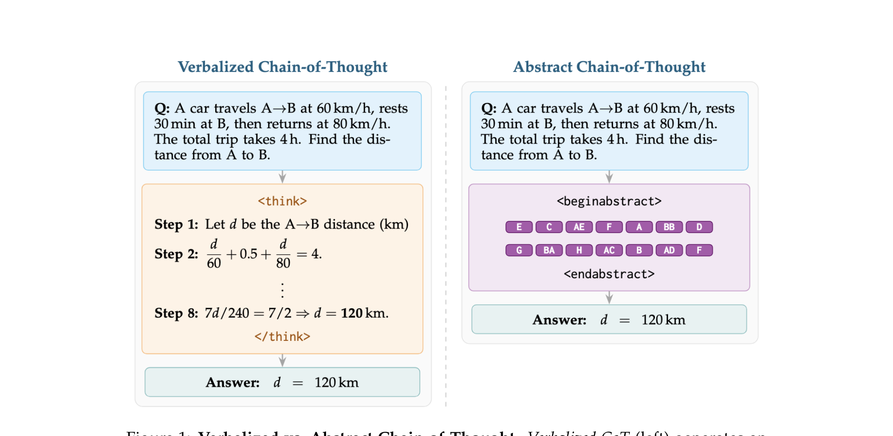
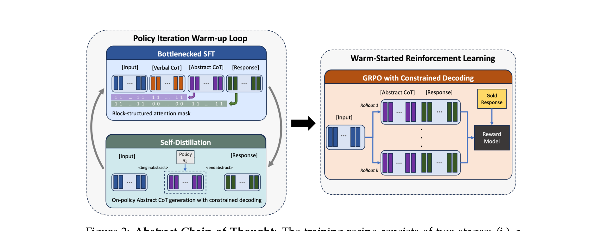
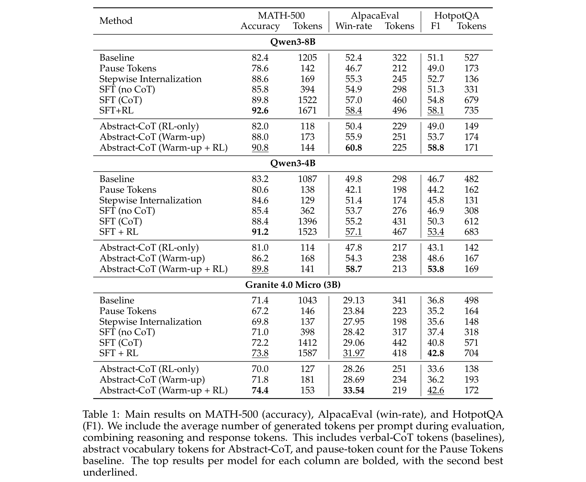
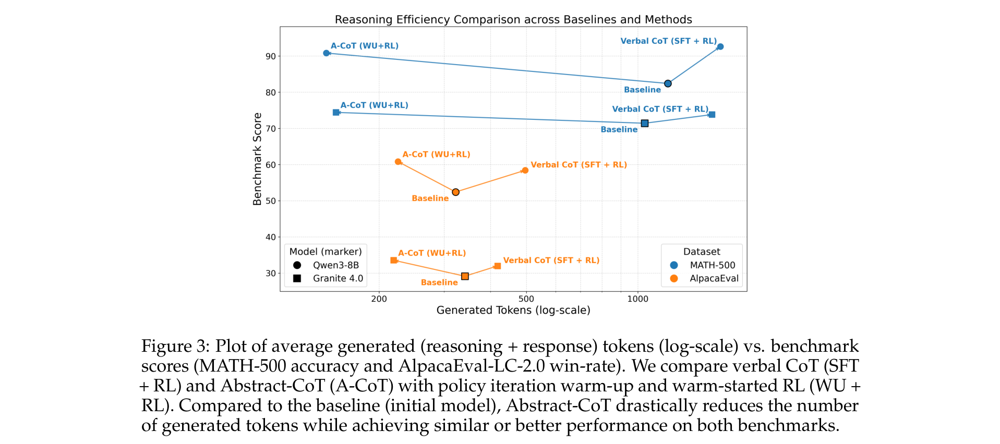
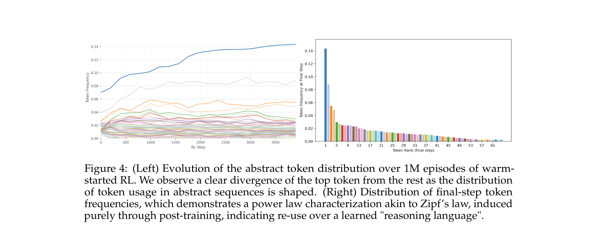
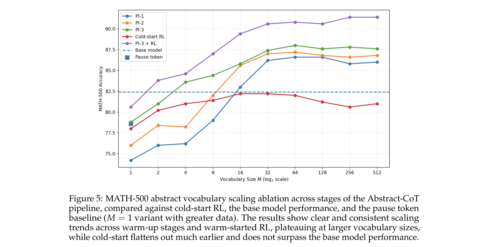

# Thinking Without Words: Efficient Latent Reasoning with Abstract Chain-of-Thought

**Authors:** Keshav Ramji, Tahira Naseem, Ramon Fernandez Astudillo
**Affiliation:** IBM Research AI
**Date:** April 27, 2026
**Paper:** [PDF](https://arxiv.org/abs/2604.22709)

---

## TL;DR

Abstract Chain-of-Thought replaces long verbalized reasoning traces (hundreds of natural language tokens inside `<think>` tags) with a short sequence of tokens from a newly invented "abstract vocabulary" — tokens like `<TOKEN_A>`, `<TOKEN_F>`, `<TOKEN_BA>` that carry no inherent meaning but learn to encode reasoning through a two-stage training recipe. Stage 1 warms up the abstract token embeddings by alternating between bottlenecked SFT (where the answer can only see the abstract tokens, not the verbal CoT) and self-distillation (generating abstract sequences from the prompt alone). Stage 2 applies GRPO with constrained decoding over the abstract vocabulary. The result: up to 11.6x fewer reasoning tokens while matching or exceeding verbalized CoT performance on MATH-500, AlpacaEval, and HotpotQA across Qwen3-8B, Qwen3-4B, and Granite 4.0 Micro.

---

## Key Figures

### Figure 1: Verbalized vs Abstract Chain-of-Thought


The core idea in one image. Left: standard verbalized CoT generates a full natural-language derivation (8 steps) inside `<think>...</think>` tags. Right: Abstract-CoT generates ~14 tokens from a reserved abstract vocabulary inside `<beginabstract>...<endabstract>` tags, then produces the same answer. The abstract tokens are not human-readable but encode the reasoning the model needs to produce the correct answer.

### Figure 2: Training Pipeline


The two-stage training recipe. **Left (Policy Iteration Warm-up Loop):** alternates between (1) Bottlenecked SFT — the model sees [Input, Verbal CoT, Abstract CoT, Response] but the answer can only attend to the abstract tokens (not the verbal CoT), forcing information through the abstract bottleneck; and (2) Self-Distillation — the model generates abstract CoT from the input alone via constrained decoding, then trains on [Input, Abstract CoT, Response]. **Right (Warm-Started RL):** GRPO with constrained decoding generates K rollouts of abstract sequences, scores them with a reward model, and optimizes the policy.

### Table 1: Main Results


Abstract-CoT (Warm-up + RL) matches or exceeds SFT+RL (verbalized CoT) on MATH-500, AlpacaEval, and HotpotQA across all three model families. The key column is "Tokens" — Abstract-CoT uses 144-172 tokens vs 1523-1671 tokens for SFT+RL, a **~10x reduction**. Performance gains are consistent: +2.4 pts on AlpacaEval for Qwen3-8B, +1.6 pts for Qwen3-4B, +1.6 pts for Granite.

### Figure 3: Token Efficiency — Performance vs Generated Tokens


Abstract-CoT (A-CoT WU+RL) achieves similar or better benchmark scores as Verbal CoT (SFT+RL) while using dramatically fewer generated tokens (x-axis is log-scale). On both MATH-500 and AlpacaEval, Abstract-CoT points sit in the upper-left (high performance, few tokens), while Verbal CoT points sit in the upper-right (high performance, many tokens).

### Figure 4: Emergent Power-Law Token Distribution


Left: token usage frequency evolves over 1M RL episodes — one token (`<TOKEN_F>`) dominates, while others find stable niches. Right: the final distribution follows a Zipf-like power law, mirroring natural language frequency distributions. This emergent structure appears purely through post-training — the abstract vocabulary starts with uniform random initialization.

### Figure 5: Vocabulary Size Scaling


MATH-500 accuracy as a function of abstract vocabulary size M (1 to 512). Warm-up stages (PI-1 through PI-3) and warm-started RL (PI-3+RL) show consistent scaling up to M=64, then plateau. Cold-start RL (no warm-up) flatlines below the base model at all sizes, demonstrating the warm-up stage is critical.

---

## Key Novel Ideas

### 1. Abstract Vocabulary as a Discrete Reasoning Language

The central idea: add M new tokens (`<TOKEN_A>` through `<TOKEN_ZZ>`) to the model's vocabulary. These tokens start with random embeddings and carry zero semantic meaning. The model learns to use sequences of these tokens as a "latent scratchpad" — a compressed, non-verbal intermediate representation that mediates between the input question and the final answer.

Formally, an abstract chain-of-thought is a sequence $z = (z_1, \ldots, z_m) \in \mathcal{V}_{\text{abs}}^m$, wrapped as:

```
<beginabstract> z₁ z₂ ... zₘ <endabstract>
```

At inference, the model receives input $x$, generates $\tilde{z}$ under constrained decoding (only abstract tokens allowed between the delimiters), then generates the answer $y$ conditioned on both $x$ and $\tilde{z}$.

The key distinction from continuous latent reasoning (like Coconut): Abstract-CoT stays in the discrete token space. This means it works with standard autoregressive decoding, requires no architectural changes, and the abstract traces can be logged, permuted, and analyzed. The key distinction from CoT compression/distillation: the abstract tokens are not a compressed version of a specific verbal CoT — they learn entirely new reasoning pathways through RL exploration.

### 2. Policy Iteration Warm-Up with Information Bottleneck

The cold-start problem: randomly initialized embeddings can't carry any reasoning information, so the model can't learn from RL exploration (there's nothing useful to reinforce). The warm-up solves this through a clever two-phase loop repeated T times (T=3):

**Phase 1 — Bottlenecked SFT.** The training sequence is $s = [x; c; \tilde{z}; y]$ (prompt, verbal CoT, abstract tokens, answer). A block-structured attention mask $\mathcal{A}$ enforces:
- Abstract tokens attend to: prompt + verbal CoT + preceding abstract tokens
- Answer tokens attend to: prompt + abstract tokens only (NOT the verbal CoT)

This creates an information bottleneck: all reasoning information from the verbal CoT $c$ must flow *through* the abstract tokens $\tilde{z}$ to reach the answer $y$. The Markov structure is:

$$C \to H_{\mathcal{Z}_{\text{abs}}} \to Y \quad \text{(conditioned on X and Z)}$$

By the data processing inequality: $I(C; Y \mid X, Z) \leq I(C; H_{\mathcal{Z}_{\text{abs}}} \mid X, Z)$

This forces the abstract token hidden states to learn useful representations of the verbal CoT.

**Phase 2 — Self-Distillation.** After bottlenecked SFT, the model can produce abstract sequences conditioned on the prompt alone (via constrained decoding). These on-policy sequences are used to create a distillation dataset $\mathcal{D}_{\text{distill}}^{(t)} = \{(x_i, \tilde{z}_i, y_i)\}$ — no verbal CoT needed. Standard causal SFT then trains the model to produce abstract traces from the prompt and generate answers from them.

The loss functions are:

Bottlenecked SFT: $\mathcal{L}_{\text{SFT}}(\theta; x, c, \tilde{z}, y) = -\sum_{j \in (\mathcal{Z}_{\text{abs}} \cup \mathcal{Y})} \log \pi_\theta(s_j \mid s_{<j}; \mathcal{A})$

Self-Distillation: $\mathcal{L}_{\text{Distill}}(\theta; x, \tilde{z}, y) = -\sum_{j \in (\mathcal{Z}_{\text{abs}} \cup \mathcal{Y})} \log \pi_\theta(s_j \mid s_{<j})$

### 3. Warm-Started RL with Constrained Decoding

After warm-up, the abstract embeddings carry useful information but the policy isn't optimized for reward. Stage 2 applies GRPO (the same RL algorithm used by DeepSeek-R1) but with two key modifications:

**Constrained decoding.** During rollouts, the abstract sequence is generated under a regex constraint that forces all tokens between `<beginabstract>` and `<endabstract>` to come from $\mathcal{V}_{\text{abs}}$. This is implemented by masking the logits at each step to only allow abstract tokens (plus `<endabstract>`), with a hard cap at $m_{\text{max}} = 128$ tokens.

**Joint optimization.** The GRPO objective optimizes over *both* the abstract trace and the response:

$$\mathcal{J}(\theta) = \mathbb{E}_x \left[ \frac{1}{K} \sum_{k=1}^K A_k \left( \sum_{t \in \mathcal{Z}_{\text{abs}}} \log \pi_\theta^{\text{abs}}(z_{k,t} \mid x, z_{k,<t}) + \sum_{t \in \mathcal{Y}} \log \pi_\theta(y_{k,t} \mid x, \tilde{z}_k, y_{k,<t}) \right) - \beta \text{KL}(\ldots) \right]$$

The advantages $A_k$ are computed from a generative reward model (gpt-oss-20b, an open variant of GPT-4o), enabling the method to generalize to non-verifiable tasks like instruction following.

### 4. Emergent Abstract Reasoning Language

A surprising finding: the abstract token frequency distribution evolves during RL training from roughly uniform to a Zipf-like power law — the same distribution seen in natural language. Some tokens become high-frequency "function words" of the abstract language (e.g., `<TOKEN_F>` dominates), while others become rare "content words."

Evidence that the abstract tokens carry compositional structure:
- **Permutation sensitivity:** Shuffling the abstract tokens at inference drops MATH-500 from 90.6 to 82.8 (-7.8 pts), comparable to the drop when permuting verbal CoT turns (92.6→81.6, -11.0 pts). Order matters.
- **Truncation resilience:** Truncating Abstract-CoT to 32 tokens drops MATH-500 from 90.6 to 84.6 (-6.0 pts), while truncating Verbal CoT to 32 tokens drops from 92.6 to 80.8 (-11.8 pts). Abstract-CoT degrades more gracefully.

---

## Architecture Details

| Parameter | Value |
|---|---|
| Models tested | Qwen3-8B, Qwen3-4B, Granite 4.0 Micro (3B) |
| Abstract vocabulary size M | 64 (default; ablated from 1 to 512) |
| Max abstract sequence length $m_{\text{max}}$ | 128 tokens |
| Token naming convention | `<TOKEN_A>` through `<TOKEN_Z>`, then `<TOKEN_AA>` through `<TOKEN_ZZ>` |
| Delimiters | `<beginabstract>`, `<endabstract>` |
| Constrained decoding | Regex-guided; only $\mathcal{V}_{\text{abs}} \cup \{\texttt{<endabstract>}\}$ allowed between delimiters |
| Reward model | gpt-oss-20b (generative; open variant of GPT-4o) |

---

## Training Pipeline

### Stage 1: Policy Iteration Warm-Up (3 iterations)

1. **Data:** Dolci-Think-SFT (600K samples) — prompts paired with gold verbal CoT and gold answers (used to develop OLMo 3 Think models)
2. **Iteration 1:** 
   - Bottlenecked SFT with randomly initialized abstract tokens (sample random number of abstract tokens per CoT step, uniform from $\mathcal{V}_{\text{abs}}$)
   - Self-distillation: generate abstract sequences via constrained decoding from prompt alone
3. **Iterations 2-3:**
   - Bottlenecked SFT with on-policy abstract sequences (generated by current policy under constrained decoding)
   - Self-distillation with updated policy
4. **Each phase:** 3 epochs of training
5. **Hardware:** 8× NVIDIA H100 GPUs

### Stage 2: Warm-Started Reinforcement Learning

1. **Data:** Dolci-Think-RL (prompts only, used for OLMo 3 Think RL)
2. **Algorithm:** GRPO with constrained decoding over abstract vocabulary
3. **Reward:** gpt-oss-20b generative reward model
4. **Episodes:** 1M
5. **KL regularization:** Applied to both abstract and response distributions
6. **Hardware:** Up to 32× NVIDIA H100 GPUs

---

## Key Results

### Main Results (Table 1)

**Qwen3-8B:**

| Method | MATH-500 | Tokens | AlpacaEval | Tokens | HotpotQA F1 | Tokens |
|---|---|---|---|---|---|---|
| Baseline (no CoT) | 82.4 | 1205 | 52.4 | 322 | 51.1 | 527 |
| Pause Tokens | 78.6 | 142 | 46.7 | 212 | 49.0 | 173 |
| Stepwise Internalization | 88.6 | 169 | 55.3 | 245 | 52.7 | 136 |
| SFT (CoT) | 89.8 | 1522 | 57.0 | 460 | 54.8 | 679 |
| SFT + RL | **92.6** | 1671 | 58.4 | 496 | **58.1** | 735 |
| Abstract-CoT (Warm-up + RL) | 90.8 | **144** | **60.8** | **225** | **58.8** | **171** |

Token efficiency (compression ratio = verbal CoT tokens / abstract tokens):
- MATH-500: **11.6x** fewer tokens
- AlpacaEval: **2.2x** fewer tokens  
- HotpotQA: **4.3x** fewer tokens

**Qwen3-4B:**

| Method | MATH-500 | Tokens | AlpacaEval | Tokens | HotpotQA F1 | Tokens |
|---|---|---|---|---|---|---|
| SFT + RL | **91.2** | 1523 | 57.1 | 467 | **53.4** | 683 |
| Abstract-CoT (Warm-up + RL) | 89.8 | **141** | **58.7** | **213** | **53.8** | **169** |

**Granite 4.0 Micro (3B):**

| Method | MATH-500 | Tokens | AlpacaEval | Tokens | HotpotQA F1 | Tokens |
|---|---|---|---|---|---|---|
| SFT + RL | **73.8** | 1587 | **31.97** | 418 | **42.8** | 704 |
| Abstract-CoT (Warm-up + RL) | 74.4 | **153** | **33.54** | **219** | **42.6** | **172** |

### Challenging Benchmarks (Table 2, Qwen3-8B only)

| Method | GPQA-Diamond | Tokens | AIME'25 | Tokens |
|---|---|---|---|---|
| SFT + RL | **51.5** | 1382 | **25.6** | 9343 |
| Abstract-CoT (Warm-up + RL) | 50.5 | **174** | 24.4 | **3438** |

Abstract-CoT achieves 2.7x token efficiency on GPQA-Diamond and 7.9x on AIME'25 while nearly matching SFT+RL performance.

---

## Key Takeaways

1. **Discrete abstract tokens can replace verbal CoT without performance loss.** On MATH-500, AlpacaEval, and HotpotQA, Abstract-CoT matches or exceeds verbalized CoT (SFT+RL) while using up to 11.6x fewer reasoning tokens. This is remarkable because the abstract tokens start with zero semantic content.

2. **The warm-up stage is essential — cold-start RL fails.** RL alone with randomly initialized abstract embeddings consistently underperforms the base model. The vocabulary scaling ablation (Figure 5) shows cold-start RL flatlines below the baseline at all vocabulary sizes. The bottlenecked SFT + self-distillation loop provides the necessary initialization for RL to be effective.

3. **The information bottleneck is the key mechanism.** The block-structured attention mask forces answer tokens to attend only to abstract tokens, not the verbal CoT. This creates a discrete information bottleneck that forces the abstract token hidden states to encode reasoning information. By the data processing inequality, the abstract sequence becomes the sole information channel between CoT and answer.

4. **Abstract-CoT actually *improves* AlpacaEval performance.** Across all three models, Abstract-CoT (Warm-up + RL) beats SFT+RL on AlpacaEval (+2.4, +1.6, +1.6 pts respectively). The hypothesis: RL exploration over the abstract vocabulary discovers new reasoning pathways not constrained to the verbal CoT's structure — a potential advantage of non-verbal reasoning.

5. **An emergent Zipf-like distribution forms over the abstract vocabulary.** Despite starting from uniform random initialization, RL training shapes token usage into a power-law distribution. Some tokens become high-frequency "function words" while others become rare "content words." This suggests the model is learning a genuinely compositional abstract language, not just memorizing fixed sequences.

6. **The method generalizes across model families.** Abstract-CoT works on Qwen3-8B, Qwen3-4B, and Granite 4.0 Micro (3B) — architecturally different models with different base capabilities. This suggests the training recipe is general, not model-specific.

7. **Pause tokens don't work as a substitute.** Simply inserting `<pause>` tokens (as in Goyal et al., 2024) performs worse than the baseline in all settings. The key difference: Abstract-CoT's vocabulary provides a richer combinatorial space for the model to learn diverse reasoning patterns, while pause tokens only expand computation time without adding information capacity.

8. **Abstract-CoT degrades more gracefully under truncation.** When both methods are truncated to 32 reasoning tokens, Abstract-CoT loses 6.0 pts (90.6→84.6) while Verbal CoT loses 11.8 pts (92.6→80.8). The abstract representation is more robust to length constraints because it's already learned to compress reasoning into short sequences.

9. **M=64 is the sweet spot for vocabulary size.** The scaling ablation (Figures 5-7) shows performance improves with vocabulary size up to M=64, then plateaus or slightly declines. Larger vocabularies (256, 512) have too many unused tokens, as evidenced by the frequency distribution plots showing long tails of near-zero-frequency tokens.

10. **This is purely a post-training method — no pretraining changes needed.** Abstract-CoT works by extending an existing instruction-tuned model's tokenizer with M new tokens and training only in post-training (SFT + RL). No continued pretraining or architectural modifications are required, making it practical to apply to any existing model.

---

## Limitations

- The abstract traces are not human-interpretable, which may pose challenges for debugging and safety auditing.
- The method requires access to a generative reward model for non-verifiable tasks.
- Evaluated primarily on math, instruction-following, and multi-hop QA; broader task evaluation needed.
- The warm-up stage requires verbal CoT training data, limiting applicability to domains where CoT demonstrations exist.
- Small abstract vocabularies (M < 16) underperform, suggesting a minimum reasoning complexity threshold.

---

## What's Open-Sourced

The paper does not mention releasing code or model checkpoints. Training data comes from publicly available datasets:
- Dolci-Think-SFT-7B ([huggingface.co/datasets/allenai/Dolci-Think-SFT-7B](https://huggingface.co/datasets/allenai/Dolci-Think-SFT-7B))
- Dolci-Think-RL-7B ([huggingface.co/datasets/allenai/Dolci-Think-RL-7B](https://huggingface.co/datasets/allenai/Dolci-Think-RL-7B))
- Granite 4.0 Micro model is available at [huggingface.co/ibm-granite/granite-4.0-micro](https://huggingface.co/ibm-granite/granite-4.0-micro)
