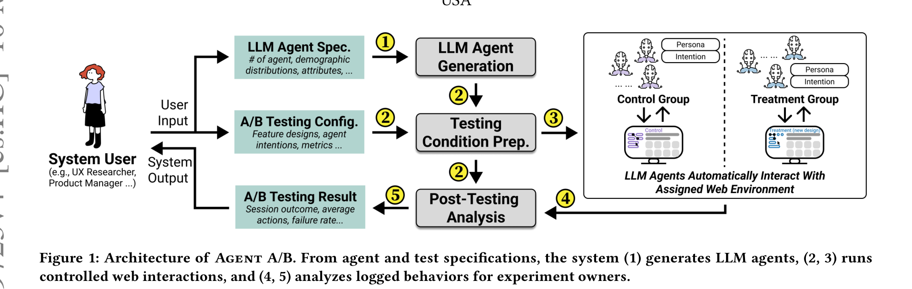
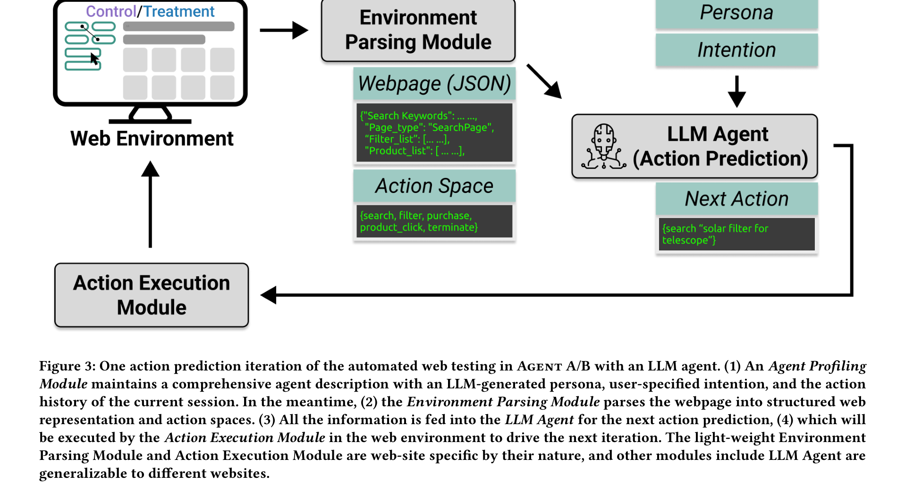
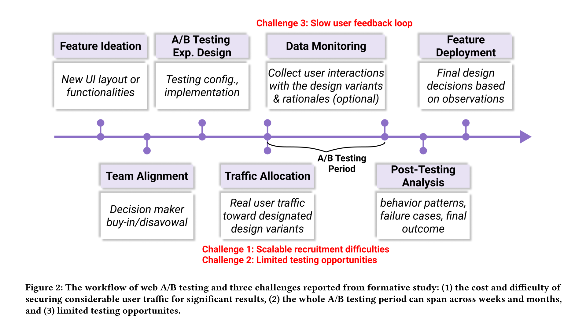
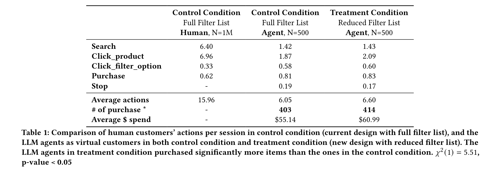
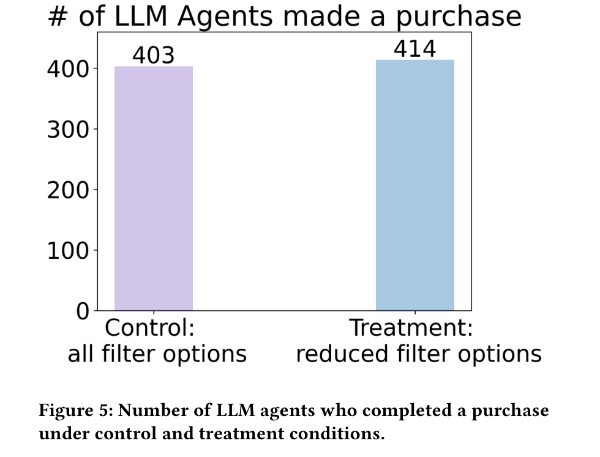
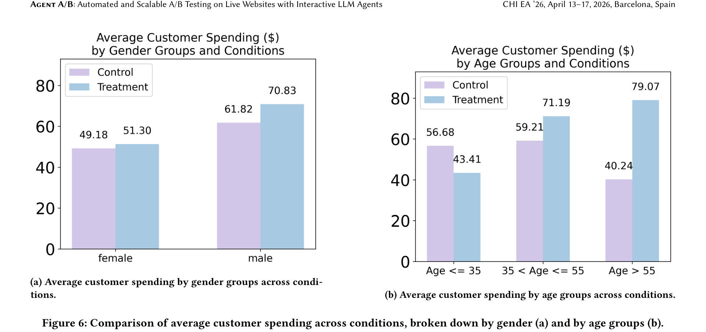
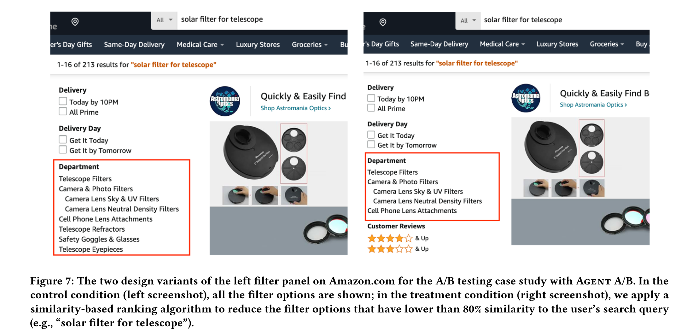

# Agent A/B: Automated and Scalable A/B Testing on Live Websites with Interactive LLM Agents

**Authors:** Yuxuan Lu, Ting-Yao Hsu, Hansu Gu, Limeng Cui, Yaochen Xie, William Headden, Bingsheng Yao, Akash Veeragouni, Jiapeng Liu, Sreyashi Nag, Jessie Wang, Dakuo Wang
**Affiliations:** Northeastern University, Penn State, Amazon
**Date:** March 10, 2026 (CHI EA '26, Barcelona, Spain)
**Paper:** [PDF](https://arxiv.org/pdf/2504.09723)

---

## TL;DR

Agent A/B is a system that replaces (or rather, *complements*) real human users in A/B tests by deploying LLM agents with structured personas to interact with live websites. In a case study on Amazon.com, 1,000 LLM agents (500 per condition) ran a between-subjects A/B test comparing a full filter panel vs. a reduced one. The agents reproduced the directional outcomes of a parallel 2-million-user human experiment -- the reduced filter panel led to more purchases -- at ~$2,925 instead of ~$100,000 and without waiting weeks for real user traffic.

---

## Key Figures

### Figure 1: System Architecture

The end-to-end pipeline. The experiment owner provides three inputs: (1) agent specifications (demographics, persona attributes), (2) A/B testing config (features to test, metrics to track), and (3) two live web variants (control and treatment). Agent A/B then generates LLM agents with personas, assigns them to conditions, runs them autonomously on the live websites, and analyzes the logged behavioral traces.

### Figure 2: Agent-Environment Interaction Loop

The core perceive-decide-act loop. The Environment Parsing Module converts raw web pages into structured JSON (product lists, filters, prices) and defines the action space. The LLM Agent receives this observation plus its persona and intention, then predicts the next action (e.g., "search solar filter for telescope"). The Action Execution Module translates that into browser commands and executes it on the live site, and the loop repeats.

### Figure 3: A/B Testing Workflow Challenges

The seven-stage A/B testing lifecycle identified from the formative study. The three red callouts mark the key pain points Agent A/B addresses: slow feedback loops, scalable recruitment difficulties, and limited testing opportunities. The full cycle from feature ideation to deployment typically takes 3+ months.

### Figure 4: Human vs. Agent Behavioral Comparison

The key comparison table. Humans (N=1M) in the control condition averaged 15.96 actions per session with 6.40 searches. Agents (N=500) averaged 6.05 actions with 1.42 searches -- agents are more goal-directed with fewer exploratory actions. But critically, agents in the treatment condition purchased significantly more (414 vs. 403, chi-squared p=0.03), reproducing the directional finding from the human experiment. Average agent spending trended upward too ($60.99 vs. $55.14), though not statistically significant.

### Figure 5: Purchase Outcomes by Condition

The headline result: 414 out of 500 agents completed a purchase in the treatment condition (reduced filter list) vs. 403 out of 500 in the control condition (full filter list). This is a modest but statistically significant difference (chi-squared = 5.51, p = 0.03), matching the direction observed in the parallel human A/B test with 2 million real users.

### Figure 6: Subgroup Analysis by Demographics

Subgroup patterns emerged that aligned with the human experiment. Older agents (55+) and male agents showed larger spending increases under the treatment condition, while younger agents (<=35) actually decreased spending. This suggests the simplified filter panel helps some demographics more than others -- a finding that would be valuable for targeting decisions, and one the agent simulation surfaced without exposing any real users to risk.

### Figure 7: Control vs. Treatment Filter Panel

The actual UI difference being tested. The control condition (left) shows the full filter panel with all filter categories (Telescope Filters, Camera & Photo Filters, Camera Lens Neutral Density Filters, Cell Phone Lens Attachments, Telescope Refractors, Safety Goggles & Glasses, Telescope Eyepieces). The treatment condition (right) removes filter options with less than 80% similarity to the search query, resulting in a shorter, more relevant list.

---

## Key Novel Ideas

### 1. LLM Agents as Simulated A/B Test Participants

The core idea: instead of waiting for real user traffic (which is expensive, slow, and contested), generate thousands of LLM agents with structured personas and let them interact with live web variants. Each agent gets a persona (age, gender, income, shopping habits, personality) and a task intention (e.g., "find a budget smart speaker under $40 with strong customer reviews"). The agents then autonomously browse, search, filter, click products, and purchase -- all on the real live website, not a simulation or mock.

**Why this matters:** Traditional A/B testing has three big problems (identified via formative interviews with 6 industry practitioners): (1) feature development is slow, so testing comes late; (2) user traffic is scarce and competed over by multiple teams; (3) feedback loops are slow, spanning weeks to months. Agent A/B addresses all three by enabling rapid, parallel, unlimited-scale testing without consuming real user traffic.

**Important caveat the authors emphasize:** This is NOT a replacement for human A/B testing. It's a complement -- a way to do cheap, fast pre-screening before committing real user traffic. The agents simplify exploratory behavior (fewer searches, more direct paths), so they won't catch everything a real user would.

### 2. Persona-Driven Behavioral Diversity

Rather than having all agents behave identically, Agent A/B generates a diverse pool of agents with realistic demographic distributions. The system:
- Lets the experiment owner specify a target demographic distribution (e.g., age 18-24: 15.8%, 25-34: 24.6%, etc., matching real online shoppers)
- Generates rich persona descriptions that include background, shopping habits, professional life, personal style, and financial situation
- Ensures the generated personas are stylistically consistent but diverse (using an example persona as a style reference and sampling from the target distribution)

In the case study, they generated 100,000 agent personas and sampled 1,000. The demographic mix included realistic income brackets ($0-30K: 32.1%, $30-94K: 32.4%, $94K-1M: 35.5%) and gender splits (49.4% male, 50.6% female).

**Why this matters:** This enables subgroup analysis -- you can ask "how do older users respond to this design change?" without recruiting a single older user. The paper shows this works: older and male agents showed different spending patterns than younger and female agents, matching directional patterns from the human experiment.

### 3. Environment Parsing Module: Structured Web Observation

Instead of feeding raw HTML or screenshots to the LLM (which is noisy, expensive, and unreliable), Agent A/B uses a custom JavaScript parsing script that converts web pages into clean, structured JSON. For Amazon, this extracts:
- Page type (search page, product page, etc.)
- Search keywords
- Filter list with current selections
- Product list with titles, prices, ratings, reviews, and brands
- Available actions (search, click product, click filter, purchase, stop)

This is site-specific (you need to write a parser per website), but lightweight. The authors note the parser and action executor are site-specific, while the LLM agent, persona generator, and analysis modules are generalizable.

### 4. Formative Study Grounding

The system design is grounded in a formative study with 6 industry A/B testing practitioners (4 product managers, 1 software dev manager, 1 ML researcher) from e-commerce companies with 1M+ users. The study identified a seven-stage A/B testing lifecycle and three core bottlenecks:
1. **High cost and long timelines** -- features take months to build before testing
2. **Intense competition for user traffic** -- teams serialize experiments on the same interface
3. **High experiment failure rates** -- limited chances to iterate before making one-shot decisions

These directly motivated Agent A/B's design as a low-cost, parallel, rapid-iteration complement.

---

## Architecture Details

| Component | Details |
|---|---|
| **LLM Backend** | Claude 3.5 Sonnet (for agent generation, action prediction, and analysis) |
| **Agent Framework** | UXAgent -- dual-loop architecture (fast loop for perception-planning-action, slow loop for wonder and reflection) |
| **Browser Automation** | ChromeDriver + Selenium WebDriver, headless Chrome |
| **Infrastructure** | Distributed cluster of 16 high-memory compute nodes |
| **Session Cap** | 20 actions max per session |
| **Action Space** | 5 actions: Search, Click Product, Click Filter Option, Purchase, Stop |
| **Agent Pool** | 100,000 personas generated, 1,000 sampled (500 per condition) |
| **Persona Demographics** | Age, gender, income, education, occupation, shopping habits, personality |
| **Web Parsing** | Custom JavaScript extraction per site; outputs structured JSON |
| **Traffic Balancing** | Automated demographic distribution checks with re-splitting |
| **Termination** | Task completion (purchase/stop) or failure (loops, unreachable goals, cap hit) |

---

## Training Pipeline

Agent A/B requires **no training or fine-tuning**. It is purely an inference-time system using a pre-trained LLM (Claude 3.5 Sonnet in the case study). The pipeline is:

1. **Offline: Persona Generation** -- The LLM Agent Generation Module queries Claude to produce diverse personas matching the target demographic distribution. Each persona includes detailed background, shopping habits, and personality traits. Style consistency is maintained via example-based prompting.

2. **Offline: Testing Preparation** -- Agents are split into control and treatment groups. Demographic balance is verified and corrected via re-splitting.

3. **Online: Autonomous Simulation** -- Each agent runs in an isolated headless browser session on the live website. The perceive-decide-act loop runs until task completion or failure. All interactions are logged.

4. **Offline: Post-Testing Analysis** -- Logs are aggregated into outcome metrics (purchase rate, spending), efficiency metrics (actions per session, duration), and behavioral patterns (search usage, filter usage). Stratified analysis by persona demographics is supported.

**Cost:** 1,000 agent simulations using Claude 3.5 Sonnet consumed ~875 million tokens, costing approximately $2,925 and producing ~35 kg of CO2 emissions. Compare this to recruiting 1,000 human participants at ~$100/person = $100,000 (the authors' estimate for typical UX industry studies).

---

## Key Results

### Agent vs. Human Behavioral Alignment

| Metric | Human (Control, N=1M) | Agent (Control, N=500) | Agent (Treatment, N=500) |
|---|---|---|---|
| Search actions/session | 6.40 | 1.42 | 1.43 |
| Click product/session | 6.96 | 1.87 | 2.09 |
| Click filter/session | 0.33 | 0.58 | 0.60 |
| Purchase/session | 0.62 | 0.81 | 0.83 |
| Stop/session | -- | 0.19 | 0.17 |
| Avg actions/session | 15.96 | 6.05 | 6.60 |
| # of purchases | -- | 403 | 414 |
| Avg $ spend | -- | $55.14 | $60.99 |

**Key differences:** Humans are more exploratory (6.4 searches vs 1.4, 7.0 product clicks vs 1.9). Agents are more goal-directed and efficient. But both show comparable purchase rates and similar filter usage patterns.

### Treatment Effect Detection

| Metric | Control (Agent) | Treatment (Agent) | Statistical Significance |
|---|---|---|---|
| Purchases | 403/500 | 414/500 | chi-squared(1) = 5.51, **p = 0.03** |
| Avg spending | $55.14 | $60.99 | Upward trend, not significant |

The reduced filter panel led to more purchases in both the agent simulation and the human experiment, validating directional alignment.

### Subgroup Effects (Agent Simulation)

| Subgroup | Control Spending | Treatment Spending | Direction |
|---|---|---|---|
| Female | $49.18 | $51.30 | Slight increase |
| Male | $61.82 | $70.83 | **Larger increase** |
| Age <=35 | $56.68 | $43.41 | **Decrease** |
| Age 35-55 | $59.21 | $71.19 | **Increase** |
| Age >55 | $40.24 | $79.07 | **Large increase** |

Older and male agents responded more positively to the simplified filter panel. Younger agents showed decreased spending. These patterns aligned directionally with the human experiment, suggesting agent simulations can surface meaningful subgroup differences.

### Cost Comparison

| Method | Participants | Cost | Time | Traffic Required |
|---|---|---|---|---|
| Human A/B Test | 2M users | ~$100K (recruitment equiv.) | Weeks-months | Yes |
| Agent A/B (Agent A/B) | 1,000 agents | **~$2,925** | Hours | **No** |

---

## Key Takeaways

1. **LLM agents can reproduce the directional outcomes of real A/B tests.** The agent simulation correctly identified that the reduced filter panel led to more purchases, matching the 2M-user human experiment. This is the paper's most important empirical claim.

2. **Agents simplify behavior but preserve decision outcomes.** Agents take 6 actions per session vs. humans' 16. They search less, browse fewer products, and take more direct paths. But their purchase decisions and filter usage patterns align with humans, suggesting they capture the "what" of decisions even if they skip the exploratory "how."

3. **Subgroup analysis works out of the box.** By controlling persona demographics, you can stratify results by age, gender, income, etc. without recruiting specific demographics. The paper shows meaningful and directionally-aligned subgroup differences emerged naturally.

4. **The cost reduction is dramatic: ~97% cheaper.** $2,925 for 1,000 agent sessions vs. ~$100,000 for 1,000 human participants. Even accounting for infrastructure costs, this makes rapid iteration affordable.

5. **This is explicitly NOT a replacement for human testing.** The authors repeatedly emphasize this is a complement -- useful for early prototyping, pre-deployment screening, and hypothesis generation. The behavioral differences (less exploration, more goal-directedness) mean agents can't catch everything.

6. **Persona generation at scale is feasible.** They generated 100,000 realistic personas with controlled demographic distributions using a single LLM. The persona quality was good enough to drive meaningfully different behavioral patterns.

7. **The system is agent-framework agnostic.** Agent A/B treats the LLM agent as a plug-and-play component. The case study uses UXAgent, but it could swap in ReAct, Claude computer-use, or any other web agent. Only the Environment Parsing Module and Action Execution Module are site-specific.

8. **Inclusive piloting is a compelling use case.** Hard-to-recruit populations (older adults, users with low digital literacy) are underrepresented in traditional A/B tests but can be simulated via personas. This lets designers check for disparate impact on underserved groups before live deployment.

9. **Formative study grounding adds credibility.** The system design isn't speculative -- it's grounded in interviews with 6 practitioners who manage real A/B tests at scale. The three bottlenecks they identified (cost, traffic scarcity, slow feedback) directly map to Agent A/B's value proposition.

10. **Open questions remain about fidelity boundaries.** The paper shows directional alignment on one e-commerce task. It's unclear how well this generalizes to more nuanced UX decisions (visual design, content tone, interaction micro-patterns), non-shopping domains, or tests where the treatment effect is very small. The authors acknowledge this and suggest future work on broader domain evaluation.

---

## What's Open-Sourced

- **Code:** The authors state "We will release our code upon acceptance of this paper." As of the paper date (March 2026), it appears to be at the CHI EA '26 acceptance stage.
- **Agent personas:** They mention they will open-source the 100,000 generated agent personas.
- **No released checkpoints or datasets** are currently available.
- The system uses **Claude 3.5 Sonnet** as the LLM backend (commercial API, not open-source).
- The UXAgent framework is referenced as prior work [62] from CHI '25.
