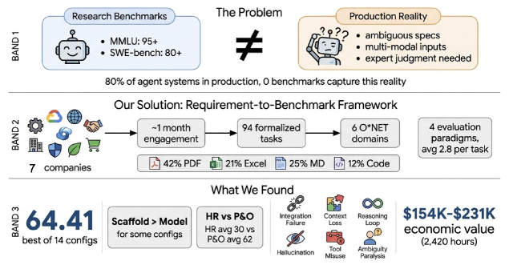
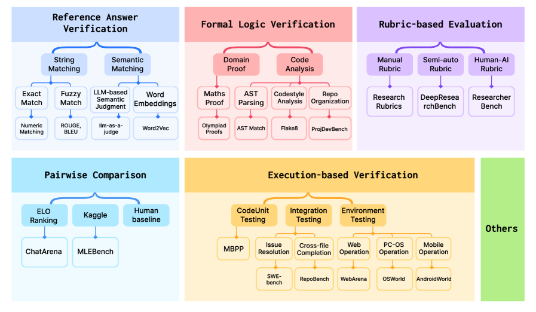
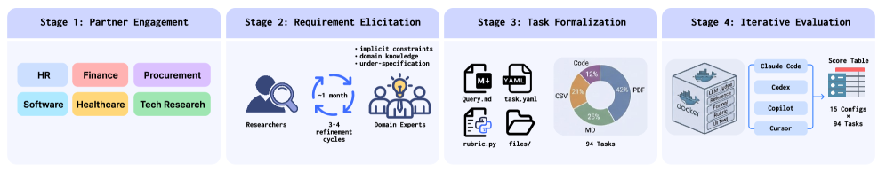
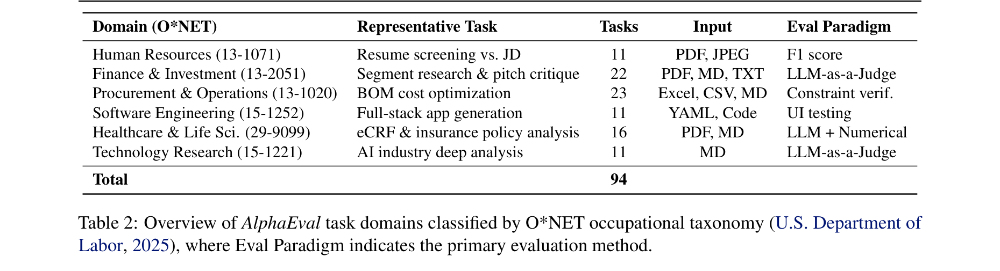
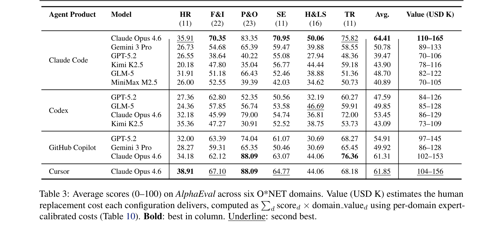
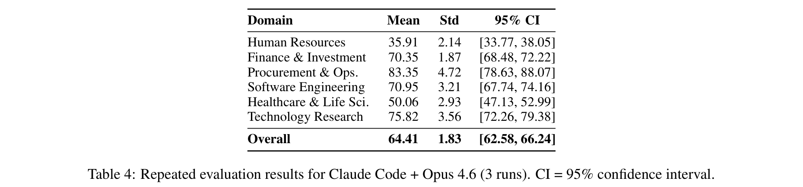

# AlphaEval: Evaluating Agents in Production

**Authors:** Pengrui Lu, Bingyu Xu, Wenjun Zhang, Shengjia Hua, Xuanjian Gao, Ranxiang Ge, Lyumanshan Ye, Linxuan Wu, Yiran Li, Junfei Fish Yu, Yibo Zhang, Ruixin Li, Manxiang Li, Xiao Han, Xiaocong Zhou, Guangyao Chi, Zisheng Chen, Kaishen Chen, Kun Wang, Qihua Xu, Fengyue Meng, Yuchen Ni, Jiajun Li, Jinxiu Liu, Danfeng Zhang, Jingru Zhao, Pengfei Liu

**Affiliations:** SII, MiraclePlus, SJTU, GAIR, HIT, UCAS, LangCore, Jiqizhixin, HunterAI, CinoCore, KuaFuAI, POET

**Date:** April 14, 2026

**Link:** [arxiv.org/abs/2604.12162](https://arxiv.org/abs/2604.12162)

**Code:** [github.com/GAIR-NLP/AlphaEval](https://github.com/GAIR-NLP/AlphaEval)

---

## TL;DR

AlphaEval is a production-grounded benchmark of 94 tasks from 7 real companies across 6 O*NET occupational domains (HR, finance, procurement, software engineering, healthcare, tech research). Unlike research benchmarks that use retrospectively curated tasks with deterministic metrics, AlphaEval evaluates complete agent products (Claude Code, Codex, GitHub Copilot, Cursor) on authentic production work. The best configuration (Claude Code + Opus 4.6) scores only 64.41/100, revealing a massive gap between research benchmark performance and production readiness. The paper also contributes a reusable requirement-to-benchmark construction framework for any organization.

---

## Key Figures

### Figure 1: AlphaEval Overview

Three-band summary of the paper. **Band 1** shows the core problem: research benchmarks (MMLU 95+, SWE-bench 80+) diverge from production reality where specs are ambiguous, inputs are multi-modal, and expert judgment is needed. 80% of agent systems are in production, yet 0 benchmarks capture this. **Band 2** shows the solution: a requirement-to-benchmark framework that transforms tasks from 7 companies into 94 formalized tasks across 6 O*NET domains. Input breakdown: 42% PDF, 21% Excel, 25% Markdown, 12% Code. **Band 3** shows key findings: best score is 64.41/100, scaffold matters more than model for some configs, and the benchmark represents $154K-$231K in economic value (2,420 professional hours).

### Figure 2: Evaluation Methodology Taxonomy

A comprehensive taxonomy of agent evaluation methodologies spanning 90+ benchmarks. Five major paradigms: (1) **Reference Answer Verification** (string/semantic matching), (2) **Formal Logic Verification** (math proofs, code analysis), (3) **Rubric-based Evaluation** (manual/semi-auto/human-AI rubrics), (4) **Pairwise Comparison** (ELO ranking), and (5) **Execution-based Verification** (unit testing, environment testing). AlphaEval covers paradigms 1-3 and 5. Each task composes multiple paradigms (average 2.8 per task), reflecting the multi-dimensional nature of production quality.

### Figure 3: Requirement-to-Benchmark Construction Pipeline

The four-stage pipeline that transforms production requirements into automated evaluation. Stage 1: Partner Engagement (companies from HR, Finance, Procurement, Healthcare, Software, Tech Research). Stage 2: Requirement Elicitation (iterative meetings extracting implicit constraints). Stage 3: Task Formalization (query.md, task.yaml, CSV files, producing 94 tasks). Stage 4: Iterative Evaluation (14 configurations across Claude Code, Codex, Copilot, Cursor).

### Table 2: Domain Overview

The 6 O*NET domains, their task counts, input modalities, and primary evaluation paradigms. Finance & Investment has the most tasks (22), while HR and Software Engineering have the fewest (11 each). Input types range from PDF/JPEG to YAML/Code. Evaluation paradigms span F1 score, LLM-as-a-Judge, constraint verification, UI testing, and combinations thereof.

### Table 3: Main Results

The central results table showing scores (0-100) for 14 model-scaffold configurations across 6 domains. Claude Code + Opus 4.6 leads overall at 64.41, but the same Opus 4.6 model drops to 53.45 via Codex and 61.31 via GitHub Copilot -- an 11-point spread proving scaffold matters as much as model. Domain variance is extreme: Procurement & Operations ranges from 30.91 to 88.09, while Human Resources never exceeds 38.91. The Value column translates scores into economic terms ($70K-$165K range).

### Table 4: Evaluation Reliability

Repeated evaluation results (3 runs) for the best configuration showing narrow confidence intervals (overall +/-1.83). Constraint-verification domains like P&O show higher variance (std=4.72) than LLM-as-a-Judge domains like F&I (std=1.87), reflecting inherent characteristics of each paradigm rather than evaluation instability.

### Table 5: Meta-Evaluation Agreement

Inter-annotator agreement on 1,000 rubric point judgments. All pairwise Cohen's kappa values fall in the "substantial agreement" range (0.69-0.78). Fleiss' kappa for three-way agreement (two humans + LLM judge) is 0.720. The automated judge agrees more with the lenient annotator (kappa=0.780) than the strict one (kappa=0.697), consistent with known LLM self-preference biases.

---

## Key Novel Ideas

### 1. Production-Grounded Benchmarking
The fundamental insight: existing benchmarks are built *retrospectively* (selecting already-solved artifacts like resolved GitHub issues) with deterministic metrics. Production evaluation is fundamentally different along three axes:

- **Task Under-specification:** Benchmarks have explicit goals; production tasks emerge from evolving business needs with implicit constraints invisible to outsiders.
- **Judgment Subjectivity:** Benchmarks evaluate with single-dimension, predefined metrics; production demands multi-faceted quality criteria defined by domain experts.
- **Continuous Evolution:** Benchmarks are built once; production evaluations must continuously evolve as standards shift.

A survey of 27 AI product companies confirmed this: 63% report low confidence in model updates, 25.9% have no explicit evaluation criteria, and 70.4% rely on developers performing testing as a side task.

### 2. Requirement-to-Benchmark Construction Framework
A four-stage methodology converting authentic production requirements into automated evaluation tasks:

1. **Partner Engagement** (~1 month per company): Select partners deploying AI agents as core products. Criteria include access to long-horizon deliverables, diverse input modalities, and domain expertise for co-designing evaluation.
2. **Requirement Elicitation** (weekly meetings): Three phases -- workflow discovery (revealing hidden complexity), scope negotiation (isolating self-contained tasks), and ground truth co-construction (extracting reference outputs from actual business decisions).
3. **Task Formalization**: Each task becomes a self-contained package: `query.md` (spec), `task.yaml` (config), `files/` (input documents), `.eval/rubric.py` (evaluation script), and optional `ground_truth.json`.
4. **Iterative Validation**: 3-4 refinement cycles per company ensuring rubrics capture stakeholder-aligned quality, not just technical correctness.

### 3. Multi-Paradigm Evaluation Composition
Each task composes multiple evaluation types (average 2.8 per task). The task-level score formula:

$$s_{\text{task}} = \sum_{k=1}^{K} w_k \cdot e_k(a, t), \quad \text{where} \quad \sum_{k=1}^{K} w_k = 1$$

where $e_k(a,t) \in [0,1]$ is the evaluation result from paradigm $k$ for agent $a$ on task $t$, and $w_k$ is the expert-assigned weight.

Domain scores are unweighted arithmetic means within a domain:

$$S_{\text{domain}}(a) = \frac{1}{|T_d|} \sum_{t \in T_d} s_{\text{task}}(a,t) \times 100$$

Overall score is the unweighted mean across all 6 domains (equal domain weight regardless of task count):

$$S_{\text{overall}}(a) = \frac{1}{6} \sum_{d=1}^{6} S_{\text{domain}}(a)$$

### 4. Economic Value Grounding
Each task is annotated with its human replacement cost via a two-stage pipeline:

$$\text{Value} = \text{Hourly Rate} \times \text{Benefit Multiplier} \times \text{Hours}$$

Stage 1 (AI estimation) produces role lists, hours per role, and complexity ratings. Stage 2 (expert calibration) applies domain-specific correction factors ranging from 0.33 (Procurement) to 1.54 (Healthcare). This shifts the evaluation question from "how well does the agent perform?" to "how much value does the agent deliver?"

### 5. Six Production-Specific Failure Modes
Identified through qualitative analysis of ~130 agent-model evaluation results:

1. **Cascade dependency failure:** Misidentifying one anchor (e.g., Day 1 in clinical trials) corrupts all downstream calculations.
2. **Subjective judgment collapse:** Agents handle quantifiable criteria 2-3x better than holistic judgment tasks (e.g., "culture fit").
3. **Information retrieval failures:** Five cognitive subtypes -- factual hallucination (~30%), imprecise retrieval (~35%), rigid search strategy (~15%), attribution confusion (~10%), positive-information bias (~10%).
4. **Cross-section logical inconsistency:** Locally plausible paragraphs that contradict each other across a long document (e.g., TAM of $50B in one section, $80B later).
5. **Constraint misinterpretation:** Agents optimize explicitly stated objectives while violating implicit constraints. Exhibit "synergy blindness" -- optimizing components independently. When problems are infeasible, agents fabricate "best effort" solutions instead of declaring infeasibility.
6. **Format compliance failures:** Substantively reasonable analyses scored poorly because output format is incompatible with downstream consumption.

---

## Architecture Details

### Evaluation Infrastructure
The AlphaEval framework has three core abstractions:

- **Task Runner:** Manages the evaluation lifecycle.
- **Evaluator Registry:** Routes tasks to paradigm-specific pipelines.
- **Execution Sandbox:** Docker containers for isolation.

The evaluation pipeline proceeds in six stages:
1. **Task Loading:** Scan benchmark directory, construct task queue (filterable by domain, difficulty, evaluation type).
2. **Environment Provisioning:** Instantiate Docker containers with task input files.
3. **Agent Invocation:** Agent receives `query.md` and interacts through a standardized interface.
4. **Output Collection:** Artifacts collected from the results directory.
5. **Evaluation Dispatch:** Outputs routed to the appropriate evaluator.
6. **Result Aggregation:** Aggregate into domain-level and benchmark-level summaries.

All task inputs, evaluation scripts, reference answers, Docker images, and agent scaffold versions are pinned for reproducibility.

### Agent System Configurations
| Agent Product | Version | Interface | Models |
|---|---|---|---|
| Claude Code | 2.1.70 | `claude` CLI | All 6 models |
| Codex | 0.111.0 / 0.80.0 | `codex` CLI | GPT-5.2, Opus 4.6 / GLM-5, Kimi K2.5 |
| GitHub Copilot | 1.0.10 | `copilot-cli` | GPT-5.2, Gemini 3 Pro, Opus 4.6 |
| Cursor | 2026.03.11 | `cursor` CLI | Opus 4.6 |

### Evaluation Paradigm Coverage
AlphaEval covers 8 of 14 leaf-node evaluation types across 4 paradigms:
- **Reference Verification:** Fuzzy matching (42 tasks), exact matching (33 tasks), LLM semantic (49 tasks)
- **Test Case Verification:** Code unit testing (20 tasks), environment state verification (13 tasks)
- **Formal Verification:** Math proof (25 tasks), code/logic (2 tasks)
- **Rubric Assessment:** Human-authored (49 tasks)

### Multi-label Evaluation Composition by Domain
| Domain | Tasks | Avg. Types | Types Composed |
|---|---|---|---|
| Human Resources | 11 | 2.0 | Fuzzy + Exact match |
| Finance & Investment | 22 | 2.5 | Rubric + LLM semantic + Structural verif. + Match |
| Procurement & Ops. | 23 | 3.8 | Fuzzy + Exact + Unit test + Math + LLM |
| Software Engineering | 11 | 2.5 | Env. state verif. + Functional verif. + LLM |
| Healthcare & Life Sci. | 16 | 2.8 | Rubric + LLM + Math + Code + Match |
| Technology Research | 11 | 2.5 | Rubric + LLM semantic + Factual verif. |
| **Overall** | **94** | **2.8** | **8 types, 100% >= 2** |

---

## Benchmark Construction Pipeline

The pipeline is detailed in Section 3 and Appendix I. Key aspects of each stage:

**Partner Engagement:** Partners include both product companies (deploying AI agents for paying customers) and domain-expert organizations (e.g., technology media producing in-depth industry analysis). Five selection criteria: (1) authentic long-horizon deliverables, (2) AI integral to revenue, (3) diverse input modalities, (4) domain expertise for evaluation co-design, (5) willingness to share anonymized data.

**Requirement Elicitation (~1 month per company):** Three phases emerge naturally:
- *Workflow discovery:* Companies demonstrate end-to-end workflows. Complexity often far exceeds initial descriptions (e.g., "converting Word docs to JSON" actually involved temporal phase identification, trigger rule extraction, form field mapping, and constraint validation).
- *Scope negotiation:* Jointly determine which segments of long production pipelines can be isolated into self-contained evaluation tasks.
- *Ground truth co-construction:* Reference outputs extracted from actual business decisions (e.g., using real interview shortlists rather than AI-generated candidate rankings).

**Task Formalization:** Approximately 42% of tasks involve PDFs, 21% structured data files, 25% markdown/text, and 12% code/YAML.

**Iterative Validation:** 3-4 refinement cycles per company. Criteria are not static -- as agent capabilities improved during the evaluation period, several partners raised their quality bars.

---

## Key Results

### Main Performance Table (Table 3)

| Agent Product | Model | HR (11) | F&I (22) | P&O (23) | SE (11) | H&LS (16) | TR (11) | Avg. | Value (USD K) |
|---|---|---|---|---|---|---|---|---|---|
| Claude Code | Claude Opus 4.6 | **35.91** | **70.35** | 83.35 | **70.95** | **50.06** | 75.82 | **64.41** | 110-165 |
| Claude Code | Gemini 3 Pro | 26.73 | 54.68 | 65.39 | 59.47 | 39.88 | 58.55 | 50.78 | 89-133 |
| Claude Code | GPT-5.2 | 26.55 | 38.64 | 40.22 | 55.08 | 27.94 | 48.36 | 39.47 | 70-106 |
| Claude Code | Kimi K2.5 | 20.18 | 47.80 | 35.04 | 56.77 | 44.44 | 59.18 | 43.90 | 78-116 |
| Claude Code | GLM-5 | 31.91 | 51.18 | 66.43 | 52.46 | 38.88 | 51.36 | 48.70 | 82-122 |
| Claude Code | MiniMax M2.5 | 26.00 | 52.55 | 39.39 | 42.03 | 34.62 | 50.73 | 40.89 | 70-105 |
| Codex | GPT-5.2 | 27.36 | 62.80 | 52.35 | 50.56 | 32.19 | 60.27 | 47.59 | 84-126 |
| Codex | GLM-5 | 24.36 | 57.85 | 56.74 | 53.58 | 46.69 | 59.91 | 49.85 | 85-128 |
| Codex | Claude Opus 4.6 | 32.18 | 45.99 | 79.00 | 54.74 | 36.81 | 72.00 | 53.45 | 86-129 |
| Codex | Kimi K2.5 | 35.36 | 47.27 | 30.91 | 52.52 | 38.75 | 53.73 | 43.09 | 73-109 |
| GitHub Copilot | GPT-5.2 | 32.00 | 63.39 | 74.04 | 61.07 | 30.69 | 68.27 | 54.91 | 97-145 |
| GitHub Copilot | Gemini 3 Pro | 28.27 | 59.31 | 65.35 | 50.46 | 30.69 | 65.45 | 49.92 | 86-128 |
| GitHub Copilot | Claude Opus 4.6 | 34.18 | 62.12 | **88.09** | 63.07 | 44.06 | **76.36** | 61.31 | 102-153 |
| Cursor | Claude Opus 4.6 | **38.91** | **67.10** | **88.09** | 64.77 | 44.06 | 68.18 | 61.85 | 104-156 |

### Key Numerical Findings

1. **Best overall score: 64.41/100** (Claude Code + Opus 4.6), exposing a massive research-production gap.

2. **Scaffold effect is 11-15 points:** Opus 4.6 scores 64.41 via Claude Code, 61.31 via GitHub Copilot, 53.45 via Codex. GPT-5.2 scores 39.47 via Claude Code but 54.91 via GitHub Copilot.

3. **Domain variance is extreme:**
   - Technology Research: avg. 62.0, range 48.36-76.36 (easiest)
   - Procurement & Operations: avg. 61.7, range 30.91-88.09
   - Software Engineering: avg. 56.3, range 42.03-70.95
   - Finance & Investment: avg. 55.8, range 38.64-70.35
   - Healthcare & Life Sciences: avg. 38.6, range 27.94-50.06
   - Human Resources: avg. 30.0, range 20.18-38.91 (hardest)

4. **Score ranking differs from value ranking:** Codex + Opus 4.6 (avg. 53.45, $86K-$129K) outscores Claude Code + Gemini 3 Pro (avg. 50.78, $89K-$133K) but delivers *less* economic value because Gemini 3 Pro performs better on high-value domains (Software Engineering, Finance & Investment).

5. **Economic value delivered:** Best configuration delivers $110K-$165K in professional labor value. Worst delivers $70K-$105K. The $40K-$60K gap provides a concrete economic basis for agent selection.

6. **Evaluation reliability:** Overall std = 1.83 across 3 runs (95% CI: [62.58, 66.24]). Configuration rankings are stable across runs.

7. **Human replacement cost:** The 94 tasks represent 2,420 professional hours (~60 person-weeks), valued at $154K-$231K (USD) or Y391K-Y570K (CNY).

### Economic Value by Domain (After Expert Calibration)
| Domain | Tasks | Hours | USD (K) | CNY (K) |
|---|---|---|---|---|
| Human Resources | 11 | 39 | 1.8-2.7 | 4.1-6.4 |
| Finance & Investment | 22 | 803 | 49.6-74.4 | 165.3-248.7 |
| Procurement & Operations | 23 | 236 | 20.4-30.6 | 49.1-49.7 |
| Software Engineering | 11 | 946 | 61.2-91.8 | 116.9-179.9 |
| Healthcare & Life Sci. | 16 | 154 | 6.7-9.5 | 19.4-28.0 |
| Technology Research | 11 | 242 | 14.6-21.8 | 36.3-57.7 |
| **Total** | **94** | **2,420** | **154-231** | **391-570** |

### Benchmark Statistics
| Statistic | Value |
|---|---|
| Total tasks | 94 |
| Domains covered | 6 |
| Partner companies | 7 |
| PDF-primary tasks | ~42% (39 tasks) |
| Excel/CSV-primary tasks | ~21% (20 tasks) |
| Markdown/Text tasks | ~25% (24 tasks) |
| Code/YAML tasks | ~12% (11 tasks) |
| Avg. execution time | 14 minutes |
| Avg. interaction turns | 46 |

### Model Cognitive Profiles on Technology Research
| Model | Search Attempts | Hallucination | Signature Pattern |
|---|---|---|---|
| Opus 4.6 | 30-50 | High | Fills gaps with stale data confidently |
| GPT-5.2 | 5-75 | Low | Variable persistence, sometimes outputs templates |
| Gemini 3 Pro | 10-20 | Low | Conservative, acknowledges uncertainty |
| GLM-5 | 5-10 | Med | Conceptual inversion errors |
| MiniMax M2.5 | 3-5 | Med | Correct direction, wrong details |
| Kimi K2.5 | 5-15 | Med | Moderate persistence, domain-specific strengths |

---

## Key Takeaways

1. **Production evaluation reveals qualitatively different failure modes.** The gap between research benchmarks and production is not just about harder tasks -- it is a mismatch in *what skills matter*. Research benchmarks select for precise instruction following, deterministic reasoning, and short-horizon outputs. Production demands tolerance for ambiguity, domain-appropriate judgment, long-horizon deliverables, and format compliance.

2. **Scaffold choice matters as much as model choice.** The same Opus 4.6 model varies by 11 points (53.45-64.41) depending on whether it runs through Codex or Claude Code. This means evaluating models in isolation misses a critical dimension. Organizations must evaluate complete agent systems, not just LLMs.

3. **No single score captures production readiness.** Domain performance ranges from 30.0 (HR) to 62.0 (Tech Research). Model rankings are domain-dependent: GLM-5 scores 66.43 on P&O but only 52.46 on SE. Organizations should select agents based on their domain portfolio, not aggregate leaderboards.

4. **Score ranking does not equal value ranking.** Domain-weighted economic value reveals a different picture from raw scores. A company primarily doing financial analysis should weight F&I performance, not overall average. The $40K-$60K value gap between configurations provides a concrete economic basis for agent selection.

5. **63% of AI product companies lack confidence in their evaluation systems.** The practitioner survey (N=27) found that 25.9% have no evaluation criteria at all, 33.3% rely on manual "golden sample" inspection, and only 11.1% have automated evaluation pipelines. This validates the need for AlphaEval's construction framework.

6. **Agent failure modes in production are invisible to coding benchmarks.** Cascade dependency failures, subjective judgment collapse, cross-section logical inconsistency, and constraint misinterpretation are not tested by any existing benchmark. These require domain knowledge, multi-document reasoning, and constraint satisfaction under ambiguity.

7. **Models exhibit strong completion bias.** When procurement problems have no feasible solution (conflicting constraints), agents fabricate "best effort" solutions rather than declaring infeasibility. This is particularly dangerous in production where fabricated solutions may be acted upon.

8. **Information retrieval is the Achilles' heel.** Technology Research tasks expose five distinct cognitive failure modes. Factual hallucination via stale training data (~30%) is the most concerning: models substitute outdated data *without hedging*, presenting stale information with full confidence.

9. **The requirement-to-benchmark framework is the more lasting contribution.** While the benchmark itself is a snapshot, the four-stage pipeline (partner engagement, requirement elicitation, task formalization, iterative validation) is a reusable methodology. Any organization can adopt it to construct production-grounded benchmarks for their own domains.

10. **Multi-agent routing may be optimal.** Since different configurations excel on different domains (Claude Code + Opus for finance/research, Copilot + Opus for procurement), a routing strategy that directs tasks to domain-appropriate configurations could outperform any single configuration.

---

## What's Open-Sourced

- **Evaluation framework:** Available at [github.com/GAIR-NLP/AlphaEval](https://github.com/GAIR-NLP/AlphaEval)
- **Benchmark tasks:** 94 tasks with full task packages (query.md, task.yaml, input files, rubric scripts)
- **Evaluation scripts:** Rubric implementations for all evaluation paradigms
- **Docker configurations:** Reproducible sandboxed environments
- **Construction methodology:** The requirement-to-benchmark framework for building custom production benchmarks

**Not open-sourced:** Some partner company data may be anonymized or restricted due to confidentiality agreements. The specific commercial agent product configurations are pinned to specific versions but the products themselves are proprietary.
