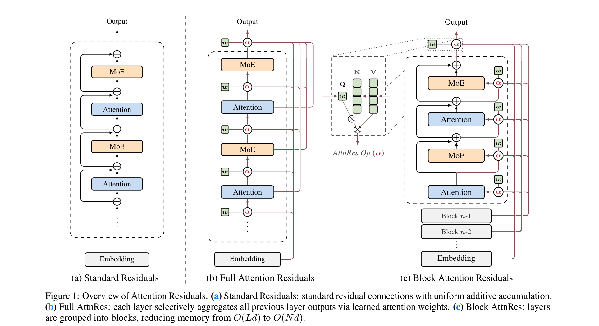
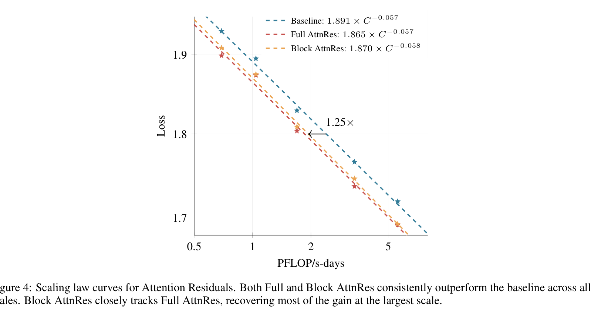
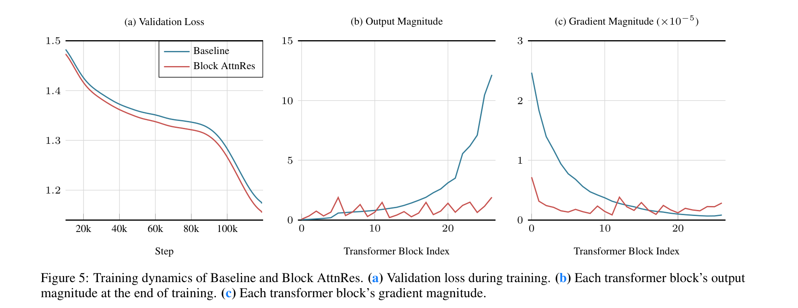
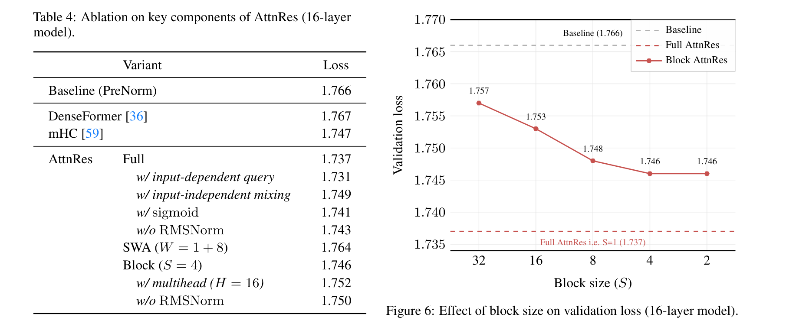
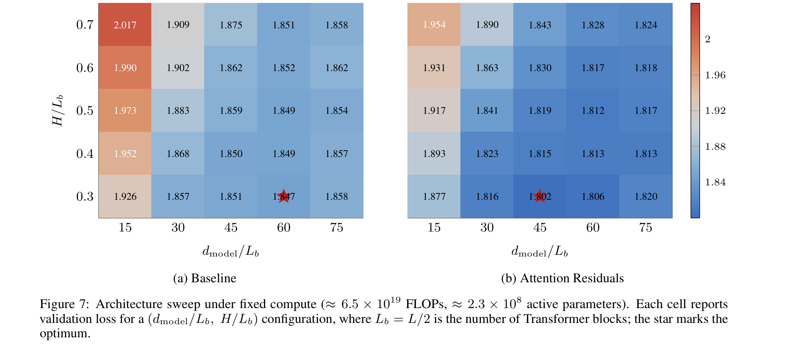
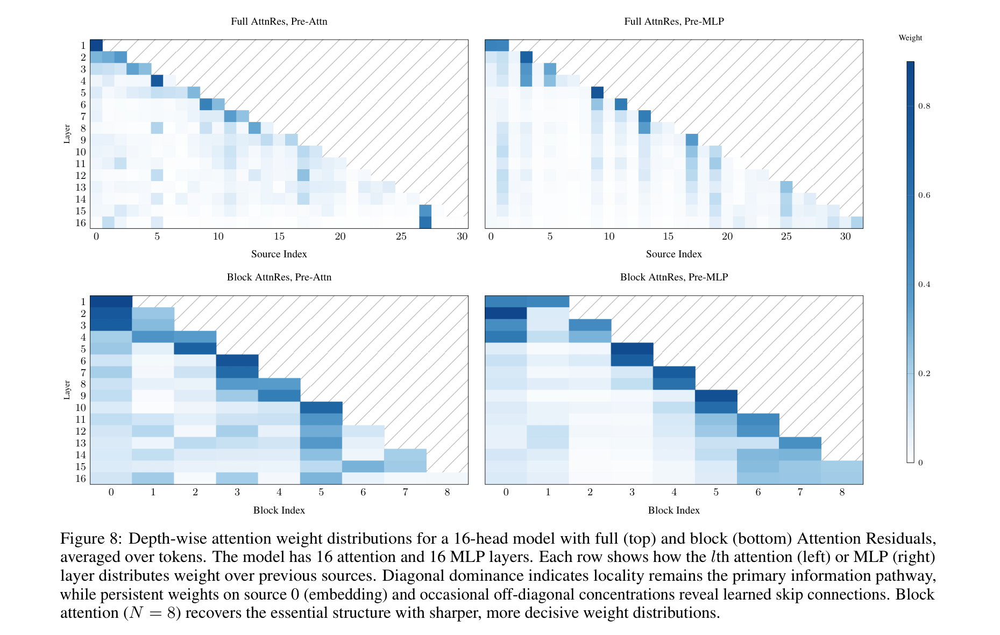
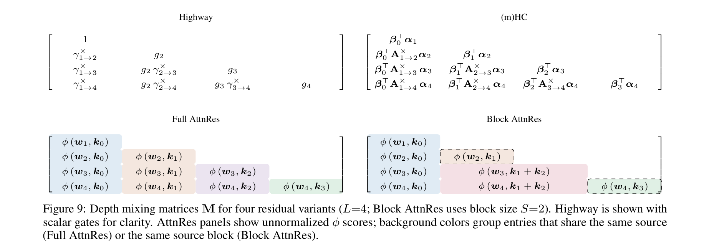

# Attention Residuals

**Authors:** Kimi Team (Moonshot AI) — Guangyu Chen*, Yu Zhang*, Jianlin Su*, et al.
**Date:** 2026
**Paper:** [PDF](https://github.com/MoonshotAI/Attention-Residuals/blob/master/Attention_Residuals.pdf)
**Code:** https://github.com/MoonshotAI/Attention-Residuals

---

## TL;DR

Standard residual connections accumulate all layer outputs with fixed unit weights, causing PreNorm dilution (hidden-state magnitude grows as O(L), progressively burying earlier layers' contributions). Attention Residuals (AttnRes) replaces this with learned softmax attention over depth — each layer selectively aggregates all prior layer outputs via a single pseudo-query vector. Block AttnRes groups layers into ~8 blocks, reducing memory from O(Ld) to O(Nd) while recovering most gains. On a 48B Kimi Linear model trained on 1.4T tokens, AttnRes improves across all benchmarks, with GPQA-Diamond gaining **+7.5 points** and HumanEval **+3.1 points**.

---

## Key Figures

### Figure 1: Architecture Overview — Standard vs Full vs Block AttnRes

The paper's central diagram comparing (a) standard residuals (uniform additive accumulation), (b) Full AttnRes (each layer attends over all prior outputs with learned softmax weights), and (c) Block AttnRes (layers grouped into blocks, attention over block-level representations). Memory reduces from O(Ld) to O(Nd).

### Figure 4: Scaling Law Curves

Both Full and Block AttnRes consistently outperform the baseline across all model sizes (194M–528M active params). At 5.6 PFLOP/s-days, Block AttnRes achieves 1.692 vs Baseline's 1.714 — equivalent to a **1.25× compute advantage**. The gap between Full and Block AttnRes shrinks to just 0.001 at the largest scale.

### Figure 5: Training Dynamics — The Smoking Gun

The most important diagnostic in the paper. (a) AttnRes achieves consistently lower validation loss. (b) **Output magnitude:** baseline grows monotonically from ~1 to ~15 across blocks (compensatory growth from PreNorm dilution), while AttnRes shows a bounded periodic pattern. (c) **Gradient magnitude:** baseline concentrates gradients in earliest blocks; AttnRes distributes them more uniformly.

### Figure 6: Block Size Ablation

Loss degrades gracefully as block size S increases: S=2 (1.746), S=4 (1.746), S=8 (1.748), S=16 (1.753), S=32 (1.757). Full AttnRes (S=1) achieves 1.737. The sweet spot is N ≈ 8 blocks — within 0.01 of Full AttnRes at a fraction of the memory cost.

### Figure 7: Architecture Sweep — AttnRes Favors Deeper, Narrower Models

Under fixed compute, the baseline achieves its optimum at d_model/L_b ≈ 60, while AttnRes shifts it to ≈ 45 — a deeper, narrower network. This confirms that AttnRes lets models actually utilize their depth effectively, changing the optimal depth-width trade-off.

### Figure 8: Learned Depth-Wise Attention Patterns

Reveals how layers allocate attention over prior sources. Key patterns: diagonal dominance (locality preserved), persistent embedding weight (source 0 retains attention throughout), and selective off-diagonal concentrations (learned skip connections). Block AttnRes (bottom) recovers the essential structure of Full AttnRes (top) with sharper, more decisive weights.

### Figure 9: Depth Mixing Matrices — The Unified Framework

The structured-matrix view that unifies all residual variants. Standard residuals = all-ones lower triangular (depth-wise linear attention). Highway = carry-product factored. mHC = product of m×m transitions. Full AttnRes = dense lower triangular (depth-wise softmax attention). This reveals the same linear→softmax progression that revolutionized sequence modeling, now applied to the depth dimension.

---

## Key Novel Ideas

### 1. The Time-Depth Duality — Applying Sequence Attention to Layer Depth

The paper's foundational insight: residual connections over depth are formally analogous to RNN recurrence over time. Both compress all prior information into a single state vector.

- **RNNs over time:** `s_t = s_{t-1} + f(s_{t-1}, x_t)` → replaced by attention (Transformer)
- **Residuals over depth:** `h_l = h_{l-1} + f_l(h_{l-1})` → replaced by AttnRes (this paper)

Just as attention allowed each position to selectively access all prior positions instead of going through a compressed hidden state, AttnRes allows each layer to selectively access all prior layer outputs instead of inheriting a compressed accumulation.

**Why this matters:** Standard residuals give every layer's output weight 1 in the sum. Layer 1 and layer 99 contribute equally to layer 100's input, which is neither principled nor efficient. With AttnRes, layer 100 can attend strongly to layer 1 (if it stored useful information) while ignoring layer 50 (if it didn't).

### 2. Full AttnRes — Softmax Attention Over Depth

For each layer l, define:
- **Query:** `q_l = w_l` (a learned d-dimensional pseudo-query vector, one per layer)
- **Keys:** `k_i = v_i` where `v_0 = h_1` (embedding) and `v_i = f_i(h_i)` for i ≥ 1 (layer outputs)
- **Kernel:** `φ(q, k) = exp(q^T · RMSNorm(k))` with softmax normalization over sources

The input to layer l becomes: `h_l = Σ α_{i→l} · v_i`

**Key design choice: learned query, not input-dependent.** Making the query a fixed per-layer parameter (not a function of `h_{l-1}`) means attention weights can be computed in parallel across all layers within a block, enabling the blockwise optimization. The ablation shows input-dependent queries improve loss by 0.006 (1.731 vs 1.737) but require sequential computation per layer.

**RMSNorm on keys is critical:** Without it, layers with naturally larger outputs dominate the softmax, biasing attention weights regardless of content. This is especially important for Block AttnRes where block representations accumulate many layers.

### 3. Block AttnRes — Practical O(Nd) Approximation

Full AttnRes requires storing all L layer outputs → O(Ld) memory and communication. Block AttnRes solves this:

- **Intra-block:** Standard residual accumulation within each block of S = L/N layers
- **Inter-block:** Softmax attention over N block-level representations + the evolving intra-block partial sum
- Block representation `b_n = Σ_{j ∈ B_n} f_j(h_j)` — sum of all layer outputs in the block

**Memory:** O(Nd) instead of O(Ld). With N ≈ 8 blocks for a 128-layer model, this is a 16× reduction.

**Empirically N ≈ 8 recovers most of the gain.** The ablation (Figure 6) shows loss degrades gracefully: S=2 (1.746), S=4 (1.746), S=8 (1.748), S=16 (1.753), S=32 (1.757), while Full AttnRes (S=1) achieves 1.737. The gap between Block (N≈8) and Full is just 0.001 at the largest scale.

### 4. Two-Phase Inference Strategy

A clever optimization that makes AttnRes inference latency overhead < 2%:

- **Phase 1 (parallel):** Batch all S pseudo-queries within a block and compute inter-block attention against cached block representations in a single matrix multiplication. Returns both outputs and log-sum-exp statistics.
- **Phase 2 (sequential):** For each layer, compute intra-block attention against the evolving partial sum, then merge with Phase 1 results via online softmax.

Phase 1 amortizes the inter-block memory reads across S layers (1 read per block instead of S), while Phase 2's I/O matches standard residual connections. Total per-layer I/O: (N/S + 3)d reads and 2d writes, vs 3d for standard residuals.

### 5. Unified Structured-Matrix Framework

All residual variants can be viewed as a depth mixing matrix **M** ∈ R^{L×L} where M_{i→l} is the weight layer l assigns to layer i's output:

| Method | M Structure | Weight Type | Semiseparable Rank |
|---|---|---|---|
| Standard Residual | All-ones lower triangular | Fixed (=1) | 1 |
| Highway | Carry-product factored | Dynamic (input-dep) | 1 |
| (m)HC | Product of m×m transitions | Dynamic | m |
| Full AttnRes | Dense lower triangular (softmax) | Dynamic (input-dep) | L (full rank) |
| Block AttnRes | Block-structured | Dynamic | N + S |

This reveals that standard residuals perform **depth-wise linear attention** (fixed weights), while AttnRes performs **depth-wise softmax attention** (learned, input-dependent weights). The same linear → softmax transition that revolutionized sequence modeling is now applied to depth.

---

## Architecture Details

**Kimi Linear 48B Configuration:**

| Component | Value |
|---|---|
| Total Parameters | 48B |
| Active Parameters | 3B |
| Architecture | MoE Transformer (Kimi Linear / DeepSeek-V3 style) |
| Transformer Blocks | 27 (54 attention + 54 MLP layers) |
| Attention | Interleaved KDA (Kimi Delta Attention) + MLA |
| Routed Experts | 8 out of 256 + 1 shared |
| AttnRes Blocks | 9 (6 layers per block = 3 attention + 3 MLP) |
| Depth-wise Sources | 10 (9 blocks + token embedding) |
| Added Parameters per Layer | 1 RMSNorm + 1 pseudo-query vector w_l ∈ R^d |
| Pseudo-query Initialization | Zero (so initial weights are uniform = standard residual) |
| Training Data | 1.4T tokens |
| Context Length | 4096 (pre-train) → 32K (extension) |
| Optimizer | Muon |
| LR Schedule | WSD (Warmup-Stable-Decay) |

---

## Training Pipeline

1. **WSD Pre-training (1T tokens):** Standard warmup-stable-decay schedule, 4096 context, 8M global batch size
2. **Mid-training (~400B tokens):** High-quality data annealing following Moonlight recipe
3. **Long-context extension (32K):** Continued training at progressively longer sequences. MLA with NoPE requires no YaRN or temperature rescaling.

**Infrastructure for Block AttnRes:**
- **Cross-stage caching:** Under pipeline parallelism, each rank caches previously received blocks locally. Stage transitions only transmit incremental new blocks, reducing communication by V× (number of virtual stages).
- **Training overhead:** < 4% under pipeline parallelism, negligible without it
- **Inference overhead:** < 2% end-to-end latency

---

## Key Results

### Scaling Laws (5 model sizes, 194M-528M active params)

| Active Params | Baseline Loss | Block AttnRes Loss | Full AttnRes Loss |
|---|---|---|---|
| 194M | 1.931 | 1.909 | **1.899** |
| 241M | 1.895 | 1.875 | **1.869** |
| 296M | 1.829 | 1.809 | **1.804** |
| 436M | 1.766 | 1.746 | **1.737** |
| 528M | 1.719 | 1.693 | **1.692** |

At 5.6 PFLOP/s-days, Block AttnRes achieves 1.692 vs Baseline's 1.714, equivalent to a **1.25× compute advantage**.

### Downstream Benchmarks (48B Kimi Linear, 1.4T tokens)

| Category | Benchmark | Baseline | AttnRes | Delta |
|---|---|---|---|---|
| General | MMLU | 73.5 | **74.6** | +1.1 |
| | MMLU-Pro | **52.2** | **52.2** | 0 |
| | GPQA-Diamond | 36.9 | **44.4** | **+7.5** |
| | BBH | 76.3 | **78.0** | +1.7 |
| | ARC-Challenge | 64.6 | **65.7** | +1.1 |
| | HellaSwag | 83.2 | **83.4** | +0.2 |
| | TriviaQA | 69.9 | **71.8** | +1.9 |
| Math & Code | GSM8K | 81.7 | **82.4** | +0.7 |
| | MGSM | 64.9 | **66.1** | +1.2 |
| | Math | 53.5 | **57.1** | +3.6 |
| | CMath | 84.7 | **85.1** | +0.4 |
| | HumanEval | 59.1 | **62.2** | +3.1 |
| | MBPP | 72.0 | **73.9** | +1.9 |
| Chinese | CMMLU | 82.0 | **82.9** | +0.9 |
| | C-Eval | 79.6 | **82.5** | +2.9 |

Largest gains on **multi-step reasoning** (GPQA-Diamond +7.5, Math +3.6, HumanEval +3.1) — consistent with the hypothesis that selective depth-wise information retrieval benefits compositional tasks.

### Ablation Study (16-head model, 436M active params)

| Variant | Val Loss |
|---|---|
| Baseline (PreNorm) | 1.766 |
| DenseFormer (static cross-layer) | 1.767 |
| mHC (m parallel streams) | 1.747 |
| **Full AttnRes** | **1.737** |
| Block AttnRes (S=4) | 1.746 |
| w/ input-dependent query | 1.731 |
| w/ input-independent mixing (no softmax) | 1.749 |
| w/ sigmoid (instead of softmax) | 1.741 |
| w/ multihead (H=16) | 1.752 |
| w/o RMSNorm | 1.743 / 1.750 |
| SWA (sliding window, W=8) | 1.764 |

---

## Key Takeaways

1. **Standard residuals perform depth-wise linear attention; AttnRes upgrades this to softmax attention.** This is the paper's deepest insight. Through the structured-matrix framework, they show the progression: fixed weights (residual) → learned static weights (DenseFormer) → learned dynamic weights with multiple streams (mHC) → full softmax attention over all sources (AttnRes). Each step brings gains.

2. **The 1.25× compute multiplier is the headline practical result.** Block AttnRes matches a baseline trained with 25% more compute. For a model costing $10M to train, AttnRes saves $2M worth of compute (or equivalently, delivers $2M worth of extra quality for free).

3. **AttnRes solves PreNorm dilution.** The training dynamics analysis (Figure 5) is compelling: baseline output magnitudes grow monotonically across depth (layers forced to compensate for dilution), while AttnRes shows bounded periodic magnitudes. Gradient magnitudes become more uniform across blocks instead of concentrating in early layers.

4. **Softmax > sigmoid for depth-wise attention.** The competitive normalization of softmax (weights sum to 1) forces sharp selection among source layers. Sigmoid allows all weights to be high simultaneously, losing the selective aggregation benefit. This mirrors the softmax vs sigmoid debate in sequence attention.

5. **Multihead attention over depth hurts.** H=16 heads degrade performance (1.752 vs 1.746). The benefit of depth-wise attention is in selecting *which* source layers to emphasize, not *which channels* within those layers. One d-dimensional query per layer is enough.

6. **N ≈ 8 blocks is the sweet spot.** Loss degrades gracefully from Full AttnRes to Block: S=2 (1.746), S=4 (1.746), S=8 (1.748). At the largest scale, Block AttnRes closes to within 0.001 of Full AttnRes. This means only ~8 cross-stage block representations are needed, making it practical for pipeline-parallel training.

7. **Sliding-window attention over depth doesn't work well.** SWA (W=1+8, attending to 8 nearest layers) achieves only 1.764, barely better than the 1.766 baseline. This shows that the value of depth-wise attention comes from long-range skip connections (accessing distant early layers), not just better access to nearby layers.

8. **AttnRes shifts the optimal architecture toward deeper, narrower models.** The architecture sweep (Figure 7) shows the baseline optimal at d_model/L_b ≈ 60, while AttnRes shifts it to ≈ 45 — a narrower model with more depth. This makes sense: AttnRes lets deeper models actually utilize their depth effectively.

9. **Zero initialization is essential.** All pseudo-query vectors must start at zero so initial attention weights are uniform, recovering standard residuals at initialization. This prevents training volatility and ensures the model starts from a known-good configuration before learning to specialize.

10. **The inference overhead is genuinely minimal (< 2%).** The two-phase computation strategy amortizes inter-block attention across S layers within a block. Combined with the fact that pseudo-queries are decoupled from the forward pass, Phase 1 can partially overlap with layer computation. This makes AttnRes a genuine drop-in replacement.

---

## What's Open-Sourced

- **Code:** https://github.com/MoonshotAI/Attention-Residuals
- **Paper:** PDF in the repository
- **Scaling law configurations:** All 5 model sizes with hyperparameters documented in Table 2
- **No pretrained checkpoints released** for the 48B Kimi Linear model
