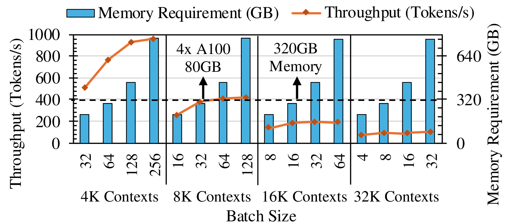
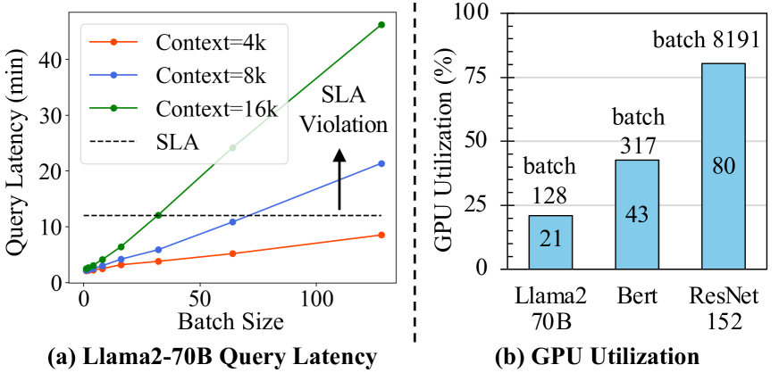
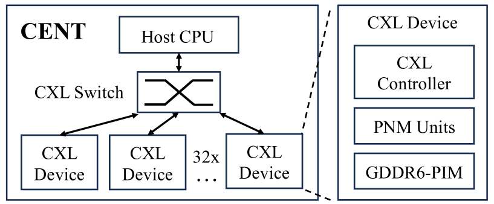
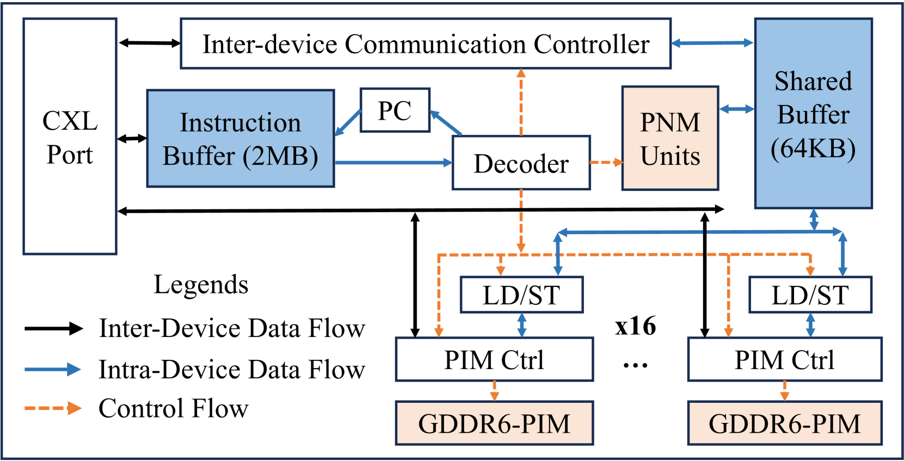
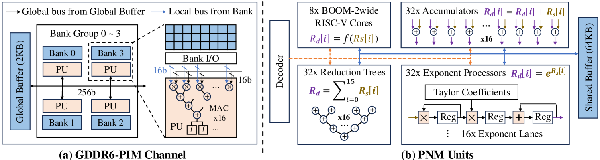
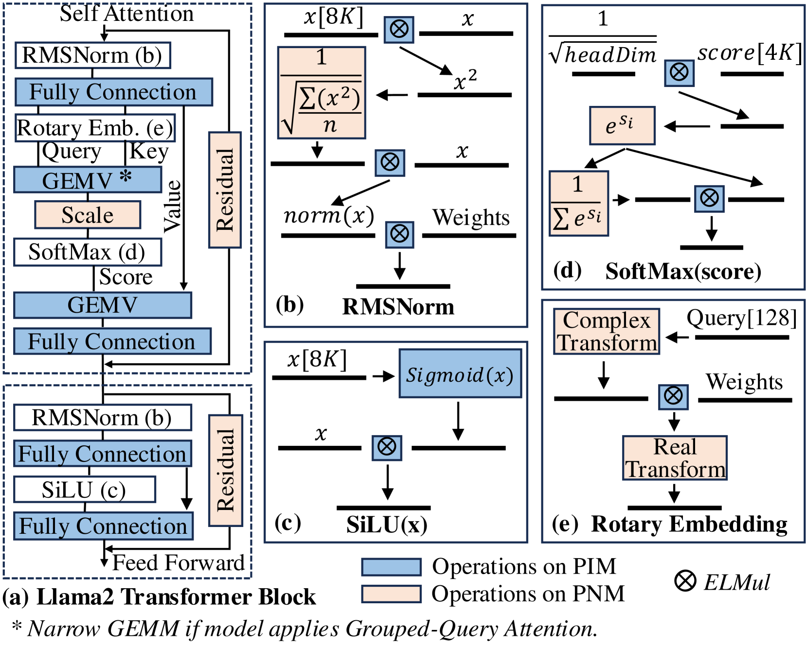
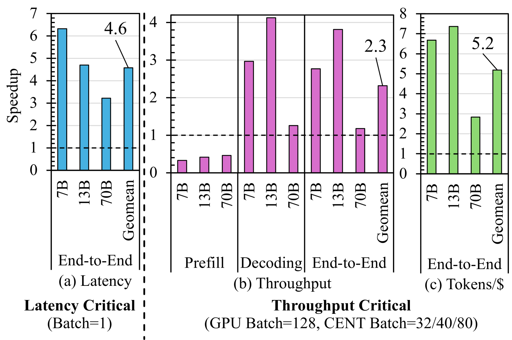
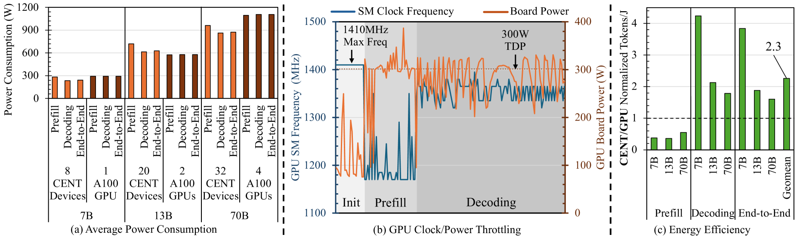

# PIM Is All You Need: A CXL-Enabled GPU-Free System for Large Language Model Inference

**Authors:** Yufeng Gu, Alireza Khadem, Sumanth Umesh, Ning Liang, Xavier Servot, Onur Mutlu, Ravi Iyer, Reetuparna Das

**Affiliations:** University of Michigan, ETH Zurich, Google

**Published:** ASPLOS '25, March 30 - April 3, 2025, Rotterdam, Netherlands

**Link:** [https://arxiv.org/abs/2502.07578](https://arxiv.org/abs/2502.07578)

---

## TL;DR

CENT is a GPU-free system for LLM inference that uses Processing-In-Memory (PIM) chips and Compute Express Link (CXL) interconnect instead of expensive GPUs. It places compute units inside DRAM banks (PIM) and near memory chips (PNM), leveraging the high internal memory bandwidth of DRAM to overcome the memory-bandwidth bottleneck of LLM decoding. Compared to 4x NVIDIA A100 80GB GPUs with maximum supported batch sizes and similar average power, CENT achieves 2.3x higher throughput, consumes 2.9x less energy, and generates 5.2x more tokens per dollar.

---

## Key Figures

### Figure 1: GPU Throughput Saturates at Large Contexts

**What it shows:** Llama2-70B inference throughput on 4x A100 80GB GPUs plateaus once memory requirements exceed 320GB. At 4K context, batch=128 saturates GPU memory. At 32K context, throughput saturates at batch=8. This is the fundamental bottleneck CENT addresses: GPUs have abundant compute but insufficient memory capacity and bandwidth for the memory-bound decoding stage of LLMs.

### Figure 2: GPUs Are Underutilized for LLMs

**What it shows:** (a) Query latency grows linearly with batch size and context length, violating SLA constraints. (b) GPU compute utilization for Llama2-70B is only 21%, compared to 43% for BERT and 80% for ResNet-152. This is because LLM decoding uses matrix-vector multiply (GEMV) operations which have much lower operational intensity than the matrix-matrix multiply (GEMM) operations in BERT/ResNet. Users pay for compute resources that sit idle.

### Figure 4: CENT System Architecture

**What it shows:** The high-level CENT design. A host CPU connects to a CXL switch, which fans out to 32 CXL devices. Each CXL device contains a CXL controller, PNM (Processing-Near-Memory) units, and GDDR6-PIM (Processing-In-Memory) channels. The CXL switch enables both peer-to-peer and collective communication between devices, allowing multiple parallelization strategies (pipeline parallel, tensor parallel, hybrid).

### Figure 5: CXL Device Architecture

**What it shows:** Inside each CXL device, instructions arrive via the CXL port into a 2MB instruction buffer, then get decoded and dispatched to either PNM units or 16 GDDR6-PIM channels. A 64KB shared buffer enables communication between PIM channels and PNM units. The PIM channels handle >99% of arithmetic operations (MAC operations for GEMV), while PNM units handle non-linear operations like Softmax, SiLU, RMSNorm, and Rotary Embedding.

### Figure 7: Hierarchical PIM-PNM Architecture

**What it shows:** (a) Each GDDR6-PIM channel has 4 bank groups of 4 banks each, with a near-bank Processing Unit (PU) in each bank implementing a 16 MAC reduction tree operating on BFloat16 at 1 GHz. (b) PNM units contain 32 accumulators, 32 reduction trees, 32 exponent processors (for Softmax), and 8 BOOM-2wide RISC-V cores for complex operations. This hierarchical split lets MAC-dominant operations run in-memory while flexible RISC-V cores handle edge cases.

### Figure 10: Transformer Block Mapping to PIM/PNM

**What it shows:** How a Llama2 transformer block maps onto PIM (blue) vs PNM (orange) compute units. GEMV operations in fully connected layers, RMSNorm vector dot product, and element-wise multiplications in SiLU/Softmax/Rotary Embedding go to PIM channels. Non-linear operations like square root, division, exponentiation, and vector addition in residual connections go to PNM units (RISC-V cores). This enables end-to-end execution of a transformer block entirely within a CXL device, with no host interaction needed.

### Figure 13: CENT Speedup Over GPUs

**What it shows:** The headline results. (a) Latency-critical (batch=1): CENT achieves 4.6x geomean end-to-end latency speedup. (b) Throughput-critical: GPU achieves 2.5x higher prefill throughput (compute-bound), but CENT achieves 2.5x higher decoding throughput (memory-bound). End-to-end throughput geomean is 2.3x for CENT. (c) Cost efficiency: CENT generates 5.2x more tokens per dollar due to 2.8x lower hardware cost ($14,873 vs $42,128) and higher throughput.

### Figure 15: Power and Energy Efficiency

**What it shows:** (a) One A100 GPU consumes ~8x more power than one CENT device. (b) GPU SM clock frequency throttles during decoding due to low compute utilization, while board power stays near 300W TDP. (c) CENT processes 2.9x more tokens per Joule on average. In the memory-bound decoding stage, CENT is 3.2x more energy efficient; in the compute-bound prefill stage, GPU is 2.4x more efficient due to on-chip SRAM data reuse.

---

## Key Novel Ideas

### 1. GPU-Free LLM Inference via PIM + CXL

The core insight is that LLM inference (especially decoding) is memory-bandwidth-bound, not compute-bound. GPUs have massive compute (1248 TFLOPS for A100) but only 2 TB/s external memory bandwidth. PIM places compute directly inside DRAM banks, achieving 16 TB/s internal bandwidth per GDDR6-based AiM chip, an 8x advantage. CENT exploits this by eliminating GPUs entirely and using CXL 3.0 to scale up the number of PIM-enabled memory devices.

### 2. Hierarchical PIM-PNM Architecture

Rather than using general-purpose near-bank PUs for all operations (which would lower memory density and yield lower throughput), CENT uses a two-tier design:

- **PIM (Processing-In-Memory):** Domain-specific near-bank PUs with 16 MAC reduction trees per bank, operating on BFloat16. These handle GEMV and element-wise multiplication, which constitute >99% of arithmetic operations in a transformer block. Each PU operates at 1 GHz with 32 GFLOPS throughput.

- **PNM (Processing-Near-Memory):** Located near (not inside) memory chips. Contains accumulators, reduction trees, exponent accelerators (using 10th-order Taylor series), and 8 BOOM-2wide RISC-V cores. Handles Softmax, RMSNorm, SiLU, Rotary Embedding, and other non-linear operations.

This split maximizes memory density (critical since PIM reduces density by 25-50%) while maintaining full transformer block execution capability.

### 3. CXL-Based Scalable Network with Custom Communication Primitives

CENT uses CXL 3.0 protocol over PCIe 6.0 physical layer to interconnect devices through a CXL switch. Key custom primitives:

- **SEND_CXL / RECV_CXL:** Non-blocking send, blocking receive for peer-to-peer transfers (used in Pipeline Parallel)
- **BCAST_CXL:** Broadcast to multiple devices via a custom Port Based Routing flit with device ID mask in the H-slot (used in Tensor Parallel broadcast)
- **Multicast:** Selective broadcast to a subset of devices (used in Hybrid TP-PP)
- **Gather:** Multiple senders each execute SEND_CXL while the receiver executes multiple RECV_CXL instructions

CXL.mem offers ~8x lower latency than RDMA and supports up to 4,096 nodes.

### 4. Complete Transformer Block Execution on CXL Device

Unlike GPU-PIM hybrid systems (AttAcc, NeuPIM) that offload prefill to GPUs, CENT executes the entire transformer block -- attention, FFN, normalization, embedding -- on the CXL device without host CPU interaction. This is possible because:

- MAC operations (>99%) run on PIM channels
- Non-linear operations run on PNM RISC-V cores and accelerators
- Grouped-Query Attention is supported by unrolling GEMM to GEMV

### 5. Custom ISA for PIM-PNM Operations

CENT defines a complete instruction set (Tables 2-3 in the paper):

**PIM instructions:** `MAC_ABK` (multiply-accumulate across all banks), `EW_MUL` (element-wise multiply), `AF` (activation function via lookup tables)

**PNM instructions:** `EXP` (exponent via Taylor series), `RED` (reduction), `ACC` (accumulation), `RISCV` (invoke RISC-V core at given PC address)

**Data movement:** `SEND_CXL`, `RECV_CXL`, `BCAST_CXL`, `WR_SBK`/`RD_SBK` (shared buffer to DRAM), `WR_ABK` (write all banks simultaneously), `COPY_BKGB`/`COPY_GBBK` (bank to/from global buffer)

### 6. Three Parallelization Strategies

**Pipeline Parallel (PP):** Each transformer block maps to one pipeline stage on a CXL device. Multiple prompts are processed concurrently across stages. Inter-device data transfer is only 16KB (the embedding vector for Llama2-70B). Optimizes throughput for large user bases.

**Tensor Parallel (TP):** Each transformer block is distributed across all CXL devices. FC layers are split across devices (broadcast input, gather output). Attention and normalization layers stay on a single "master" device. Optimizes latency for real-time applications.

**Hybrid TP-PP:** Balances latency and throughput. For example, 32 devices with TP=8 and PP=4 allocates 8 consecutive devices per pipeline stage. Uses multicast instead of broadcast for communication.

---

## Architecture Details

### CXL Device Specifications (per device)
- 16 memory chips, each with 2 GDDR6-PIM channels (32 PIM channels total)
- 32MB memory per bank, 16 banks per channel = 512MB per channel
- 512GB total memory capacity across 32 devices
- 512 TFLOPS PIM throughput (all devices combined)
- 96 TFLOPS PNM throughput (all devices combined)
- 512 TB/s peak internal bandwidth (all devices combined)
- CXL controller: 7.85 mm^2 at 28nm (estimated 19.0 mm^2 at 7nm), 1.06W total

### PIM Channel Microarchitecture
- 4 bank groups, 4 banks per group
- Each bank has a near-bank PU with 16 MAC tree operating on BFloat16
- 2KB Global Buffer per channel for inter-bank communication
- 32 accumulation registers per PU
- Activation function via lookup tables stored in DRAM
- PU clock: 1 GHz (= t_CCDS = 2*t_CK)
- Throughput: 32 GFLOPS per PIM bank

### PNM Unit Microarchitecture
- 32 accumulators (BFloat16, 256-bit input from Shared Buffer)
- 32 reduction trees
- 32 exponent processors (10th-order Taylor series, 16 parallel lanes)
- 8 BOOM-2wide RISC-V cores with 64KB instruction buffer each

### CXL Port
- Three node categories: Host (H), Local (L), Remote (R)
- Virtual channels for each: Rx (H2L, R2L queues), Tx (L2H, L2R queues)
- Supports read transactions (Request + Data with Response) and write transactions (Request with Data + No Data Response)

### Communication Overhead
- Pipeline Parallel: 16KB embedding vector transfer between stages via peer-to-peer
- Tensor Parallel: 135KB total data transfer per transformer block via broadcast + gather
- CXL transfer latency is negligible compared to PIM and PNM computation latency

---

## Training Pipeline

This paper is about **inference**, not training. CENT is designed exclusively for LLM inference serving. The authors use pre-trained Llama2 models (7B, 13B, 70B) and deploy them on CENT for inference evaluation.

The programming model uses Python APIs to:
1. Specify hardware configuration (number of PIM channels, pipeline stages)
2. Allocate memory and load model parameters according to the mapping strategy
3. An in-house compiler generates CENT arithmetic and data movement instructions from high-level operations (GEMV, LayerNorm, RMSNorm, RoPE, SoftMax, GeLU, SiLU)

---

## Key Results

### CENT vs GPU Baseline (4x NVIDIA A100 80GB)

| Metric | CENT | GPU | CENT Advantage |
|---|---|---|---|
| Hardware | 32 CXL devices | 4 NVIDIA A100 | - |
| Memory | 512GB GDDR6 | 320GB HBM2E | 1.6x capacity |
| Peak Bandwidth | 512 TB/s (internal) | 8 TB/s (external) | 64x |
| Compute | 512+96 TFLOPS | 1248 TFLOPS | 0.49x |
| Hardware Cost | $14,873 | $42,128 | 2.8x cheaper |
| 3-Year Own TCO | $0.73/hour | $1.76/hour | 2.4x cheaper |
| 3-Year Rental TCO | $1.05/hour | $5.45/hour | 5.2x cheaper |

### Latency-Critical Scenario (Batch=1, Tensor Parallel)

| Model | End-to-End Latency Speedup |
|---|---|
| Llama2-7B | 6.3x |
| Llama2-13B | 4.8x |
| Llama2-70B | 3.2x |
| **Geomean** | **4.6x** |

### Throughput-Critical Scenario (GPU Batch=128, CENT Batch=32/40/80)

| Model | Prefill Throughput | Decoding Throughput | End-to-End Throughput |
|---|---|---|---|
| Llama2-7B | 0.40x (GPU wins) | 3.1x | 6.3x |
| Llama2-13B | 0.42x (GPU wins) | 2.4x | 4.6x |
| Llama2-70B | 0.55x (GPU wins) | 2.0x | 2.1x |
| **Geomean** | **0.45x** | **2.5x** | **2.3x** |

GPU wins on prefill (compute-bound GEMM), but prefill is only ~2% of end-to-end time. CENT dominates on decoding (memory-bound GEMV), which determines overall throughput.

### Cost Efficiency

| Model | Tokens/$ Advantage |
|---|---|
| Llama2-7B | 6.8x |
| Llama2-13B | 7.0x |
| Llama2-70B | 2.7x |
| **Geomean** | **5.2x** |

### Long Context Performance (Llama2-70B)

| Context Length | Decoding Throughput Speedup |
|---|---|
| 4K | 1.2x |
| 8K | 1.7x |
| 16K | 2.4x |
| 32K | 3.3x |

CENT's advantage grows with context length because GPUs saturate at smaller batch sizes as KV cache memory grows.

### QoS Comparison (Llama2-70B)
CENT provides 3.4-7.6x lower query latency while achieving similar throughput to the GPU baseline.

### Energy Efficiency

| Stage | CENT vs GPU |
|---|---|
| Prefill | 0.42x (GPU wins, SRAM data reuse) |
| Decoding | 3.2x more efficient |
| End-to-End | **2.9x more efficient** |

CENT consumes 0.6 pJ/bit on MAC_ABK operations, 6.6x more efficient than even HBM2 memory read accesses at 3.97 pJ/bit.

### CENT vs CXL-PNM (Samsung's PNM platform)

| Metric | CENT (24 devices) | CXL-PNM (32 devices) |
|---|---|---|
| TFLOPS | 456 | 262 |
| Mem BW (TB/s) | 384 | 35.2 |
| Throughput (OPT-66B) | **4.5x higher** | 1x baseline |

CENT achieves 4.5x higher throughput because PIM (compute inside DRAM) provides higher bandwidth than PNM (compute near LPDDR5X chips).

### CENT vs GPU-PIM Heterogeneous Systems

| Comparison | CENT Advantage |
|---|---|
| vs AttAcc (8 A100 + 8 HBM-PIM) | 1.8-3.7x more tokens/$ |
| vs NeuPIM (8 A100 + 8 NeuPIM) | 1.8-5.3x more tokens/$ |

CENT's raw throughput is 0.5-1.1x vs AttAcc and 0.7-2.1x vs NeuPIM, but cost efficiency is much better because it eliminates expensive GPUs entirely.

### Scalability (Llama2-70B)
Throughput scales from 0.68 K tokens/s (16 devices) to 5.7 K tokens/s (128 devices) using PP + data-parallel mapping combinations.

### Hardware Cost Breakdown

| Component | Cost |
|---|---|
| Xeon Gold 6430 CPU | $2,128 |
| 512GB GDDR6-PIM (32 devices) | $11,873 |
| 32 CXL Controllers | $381.3 |
| 96-lane 48-port CXL Switch | $490 |
| **Total CENT** | **$14,873** |
| 4x A100 80GB GPUs | $40,000 |
| CPU for GPU system | $2,128 |
| **Total GPU** | **$42,128** |

CXL controller cost at 3M production volume: $11.9 per device (die $3.4, packaging $2.5, NRE amortized $6.0).

---

## Key Takeaways

1. **LLM inference is memory-bandwidth-bound, not compute-bound.** Llama2-70B achieves only 21% GPU compute utilization because decoding uses GEMV (low arithmetic intensity), not GEMM. This means paying for expensive GPU compute that sits idle.

2. **PIM provides 8x more memory bandwidth than GPUs by computing inside DRAM.** GDDR6-PIM achieves 16 TB/s internal bandwidth per chip vs 2 TB/s external bandwidth for A100 with 5 HBM2E stacks. This bandwidth advantage directly translates to decoding speedup.

3. **A hierarchical PIM-PNM design is essential.** Near-bank PIM alone cannot handle all transformer operations (Softmax, RMSNorm, etc.). PNM units with RISC-V cores provide the flexibility needed for non-linear operations while PIM handles the >99% of MAC operations.

4. **CXL 3.0 provides a practical interconnect for scaling PIM devices.** With ~8x lower latency than RDMA and support for up to 4,096 nodes, CXL enables both peer-to-peer and collective communication needed for pipeline-parallel and tensor-parallel LLM distribution.

5. **The entire transformer block can execute on-device without host interaction.** This eliminates the data movement overhead that plagues CPU-accelerator architectures and enables true pipelining across devices.

6. **CENT's advantage grows with model size and context length.** At 32K context, CENT achieves 3.3x decoding speedup vs 1.2x at 4K. This is because longer contexts force GPUs to use smaller batches (memory-limited), widening CENT's bandwidth advantage.

7. **GPU-free does mean GPU loses at prefill.** GPU achieves 2-2.5x higher prefill throughput due to its 2x higher peak compute and efficient on-chip SRAM reuse for GEMM. But prefill is only ~2% of end-to-end time, so this loss is negligible.

8. **The economics are compelling.** CENT hardware costs $14,873 vs $42,128 for GPUs, yielding 5.2x better tokens-per-dollar. The CXL controller adds only ~$12 per device at 3M volume. PIM modules cost ~10x less than equivalent HBM modules.

9. **Energy efficiency comes from eliminating idle compute.** One A100 consumes ~8x more power than one CENT device. GPUs operate near their 300W TDP even during memory-bound decoding, while CENT's power scales with actual compute utilization. The result is 2.9x more tokens per Joule.

10. **Disaggregation is possible for heterogeneous workloads.** For scenarios where prefill has high operational intensity (e.g., long prompts, video understanding), prefill and decoding can be split between GPUs and CENT respectively, combining the strengths of both architectures.

---

## What's Open-Sourced

- **CENT Simulator:** Available at [https://github.com/Yufeng98/CENT/](https://github.com/Yufeng98/CENT/) under MIT License
  - Trace generator for PIM instruction traces
  - AiM simulator (modified Ramulator2) for GDDR6-PIM timing simulation
  - Performance simulator for end-to-end latency/throughput evaluation
  - Power model for CENT energy estimation
  - Figure generation scripts
  - Model mapping implementations (Pipeline Parallel, Tensor Parallel, Hybrid) for Llama2 7B/13B/70B
- **Languages:** C++ (simulator), Python (model mapping, figure generation)
- **Dependencies:** g++11/12/13 or clang++-15, pandas, matplotlib, torch, scipy
- **Reproduction time:** ~24 hours on desktop (8 threads), ~12 hours on server (96 threads)
- **Disk space:** ~100GB for full simulation
- **Note:** Model weights are NOT required for the simulation (only architecture parameters are modeled)
