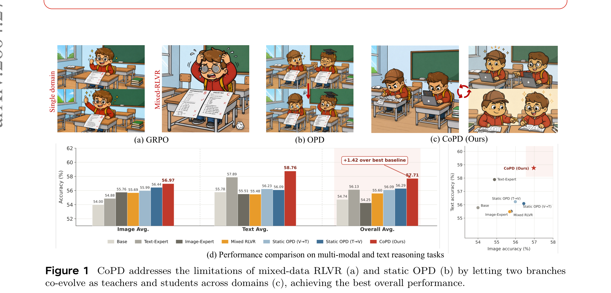
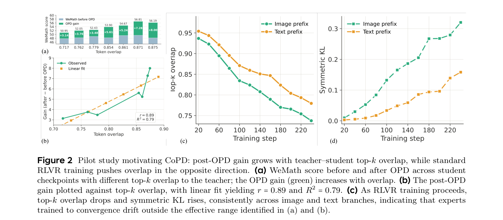
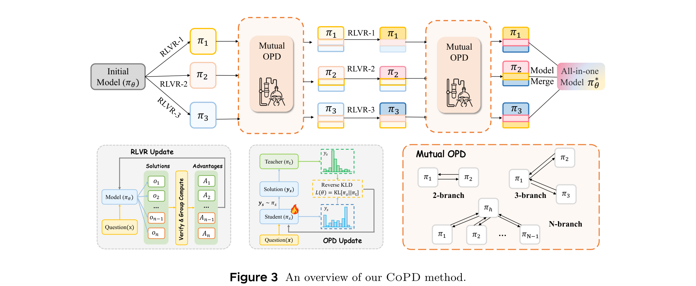
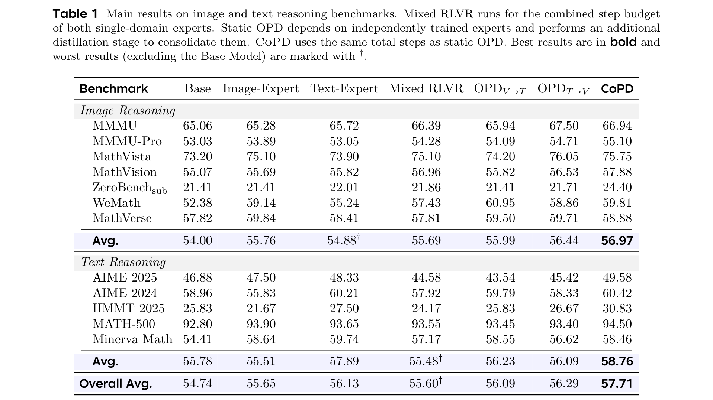
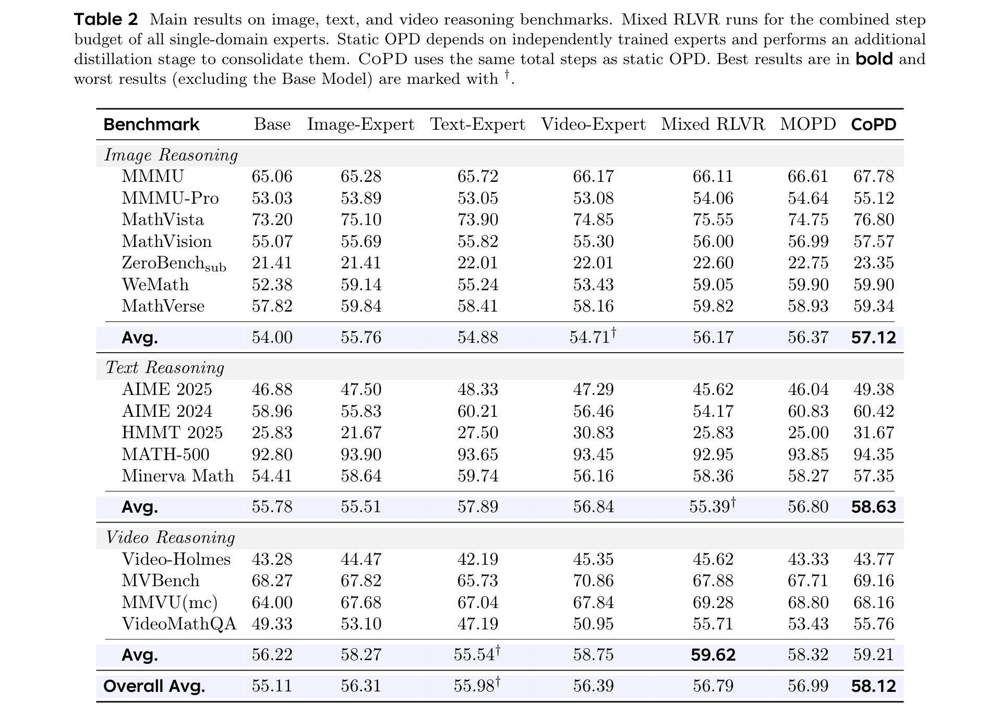
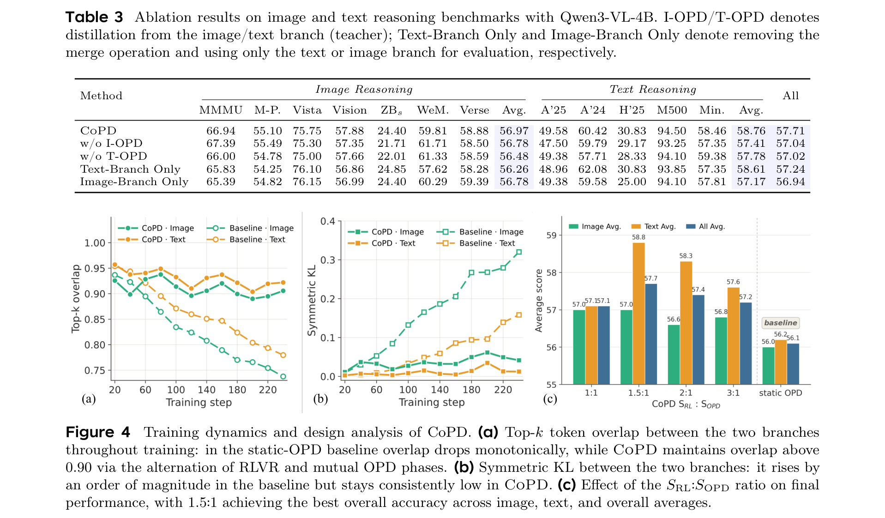

# Co-Evolving Policy Distillation

**Authors:** Naibin Gu\*, Chenxu Yang\*, Qingyi Si\*, Chuanyu Qin, Dingyu Yao, Peng Fu†, Zheng Lin, Weiping Wang, Nan Duan, Jiaqi Wang
**Affiliations:** Institute of Information Engineering (CAS), School of Cyber Security (UCAS), JD.COM
**Date:** April 29, 2026
**Paper:** [PDF](https://arxiv.org/abs/2604.27083)

---

## TL;DR

Training one model on mixed-capability data via RLVR hurts because the gradients for different capabilities conflict (they call this "capability divergence"). The standard fix — train separate domain experts, then distill them into one student — avoids the conflict but fails because the experts have drifted so far from the student that their knowledge can't be effectively absorbed. CoPD solves both problems by training experts in parallel and interleaving mutual on-policy distillation throughout, so they teach each other while their behavioral patterns are still similar enough for the teaching to actually work. On Qwen3-VL-4B, CoPD beats mixed RLVR, static OPD, and even the domain-specific experts themselves across text, image, and video reasoning benchmarks.

---

## Key Figures

### Figure 1: The Three Paradigms and Performance Comparison

Cartoon illustration of the three approaches. (a) **GRPO/Mixed RLVR**: a single model trains on all data — illustrated by one student trying to learn everything at once, producing mediocre results. (b) **Static OPD**: separate experts train to completion, then teach a student — but the teacher's style has diverged so much that the student can't fully absorb the lessons. (c) **CoPD**: two branches co-evolve, alternating between specialization and mutual teaching. Bar chart (d) shows CoPD achieves the best overall accuracy (57.71%), +1.42 over the best baseline. Scatter plot (right) shows CoPD is the only point in the upper-right quadrant — high on both image and text accuracy simultaneously.

### Figure 2: Pilot Study — Why Static OPD Fails

The key motivation experiment. **(a)** WeMath score before and after OPD for students with varying top-k overlap with the teacher. Green bars (OPD gain) clearly grow with overlap. **(b)** The relationship is linear: r = 0.89, R² = 0.79 — more behavioral similarity = more effective distillation. **(c)** As standard RLVR training progresses, top-k overlap between the expert and the shared base drops monotonically — the expert drifts away. **(d)** Symmetric KL rises by an order of magnitude over the same span. Together, (c) and (d) show that by the time experts finish training, they're too far from the student for distillation to work.

### Figure 3: CoPD Method Overview

Top: the alternating training pipeline. Starting from a shared base π₀, K branches run RLVR in parallel, then exchange knowledge via Mutual OPD, then run more RLVR, and repeat. After N cycles, branches are merged into a final all-in-one model. Bottom-left: the RLVR update (standard GRPO). Bottom-center: the OPD update — one branch generates rollouts, the other scores them via reverse KL divergence, producing token-level advantages. Bottom-right: mutual OPD topology — 2-branch is bidirectional; 3-branch uses hub-and-spoke (text branch as hub); N-branch generalizes.

### Table 1: Main Results — Two-Branch (Text + Image)

CoPD achieves the best overall average (57.71) across all methods, including both single-domain experts and all consolidation baselines. Notable: CoPD beats the Image-Expert on image reasoning (56.97 vs. 55.76) and beats the Text-Expert on text reasoning (58.76 vs. 57.89) — the unified model surpasses both specialists. Static OPD in either direction (V→T or T→V) fails to match the source expert: the Text-Expert's 57.89 text score drops to 56.09 in the T→V student.

### Table 2: Three-Branch Results (Text + Image + Video)

CoPD scales to three branches, consolidating text, image, and video reasoning simultaneously. Overall average: CoPD 58.12 vs. MOPD 56.99 vs. Mixed RLVR 56.79. CoPD beats all three domain-specific experts on their respective domains. MOPD notably underperforms the Video-Expert on video (58.32 vs. 58.75), confirming that static multi-teacher distillation struggles as the number of expert branches grows.

### Figure 4: Training Dynamics and Design Analysis

**(a)** Top-k token overlap during training. The static OPD baseline (dotted lines) drops monotonically as experts diverge. CoPD (solid lines) oscillates but stays above 0.90 — each RLVR phase opens a gap, and each mutual OPD phase closes it. **(b)** Symmetric KL: rises by an order of magnitude in the baseline, stays consistently low in CoPD. **(c)** The effect of S_RL:S_OPD ratio on final performance. CoPD consistently outperforms static OPD at all ratios. The sweet spot is 1.5:1 — too much RLVR between OPD phases weakens alignment; too little doesn't create enough new knowledge to transfer.

---

## Key Novel Ideas

### 1. Capability Divergence: A Unified Cost Analysis

The paper frames the two standard post-training paradigms under a single utility equation:

$$U_\mathcal{P} \approx a_\mathcal{P} \cdot X(D_1, D_2) + b_\mathcal{P}$$

where $X(D_1, D_2)$ is the total optimization signal in the combined datasets, $a_\mathcal{P}$ is how effectively the paradigm converts signal into capability, and $b_\mathcal{P} \leq 0$ captures any additional loss.

**Mixed RLVR** sets $a = 1$ but pays a **divergence cost** $b = -\Phi(D_1, D_2)$ — the seesaw effect where improving one capability hurts another because their gradients conflict. No data-mixing ratio can eliminate this cost; it's structural.

**Static OPD** removes the divergence cost ($b = 0$) by training experts in isolation, but the conversion efficiency drops: $a = \eta(\mathcal{O}_\text{low})$, which is positive but small. The reason: experts trained to convergence have drifted far from the student, making OPD's token-level supervision hard to absorb.

**CoPD** achieves $a = \eta(\mathcal{O}_\text{mod})$ where $\mathcal{O}_\text{mod} \gg \mathcal{O}_\text{low}$, with $b = 0$. It keeps absorption efficiency high by maintaining moderate behavioral overlap throughout training, while still removing the divergence cost through capability-separated optimization.

### 2. The Behavioral Consistency Hypothesis and Top-k Token Overlap

The paper's central claim: **OPD is more effective when teacher and student share similar behavioral patterns**, because their on-policy trajectories visit similar states and the teacher's predictions reinforce tokens the student is already likely to produce.

They measure this via **top-k token overlap**:

$$\mathcal{O}_k(\pi_\theta, \pi_T) = \mathbb{E}_{x, y_{<t} \sim \mu_\theta} \left[ \frac{|\text{Top}_k(\pi_\theta(\cdot \mid x, y_{<t})) \cap \text{Top}_k(\pi_T(\cdot \mid x, y_{<t}))|}{k} \right]$$

This is the fraction of the student's top-k predicted tokens that also appear in the teacher's top-k predictions, averaged over states the student actually visits. With $k = 10$.

The pilot study validates this hypothesis with two experiments:
1. **Higher overlap → larger OPD gains:** Correlation r = 0.89, R² = 0.79.
2. **Standard RLVR pushes overlap down:** As training progresses, the expert's top-k overlap with the base model drops monotonically while symmetric KL rises by an order of magnitude. By the time experts finish training, they're precisely in the low-η regime where OPD is least effective.

### 3. The Alternating RLVR + Mutual OPD Design

CoPD's core mechanism alternates between two phases across N training cycles:

**Phase I — Branch-Specific RLVR** (S_RL steps): Each branch independently runs GRPO on its own capability data, using the standard clipped objective:

$$\mathcal{L}_\text{RLVR}^{(k)}(\theta_k) = \mathbb{E}_{x \sim \mathcal{D}_k} \left[ \frac{1}{G} \sum_{i=1}^{G} \frac{1}{|y_i|} \sum_{t=1}^{|y_i|} \min\left(\rho_{i,t}^{(k)} \hat{A}_i^{\text{RL}}, \text{clip}(\rho_{i,t}^{(k)}, 1-\epsilon, 1+\epsilon) \hat{A}_i^{\text{RL}}\right) \right]$$

This deepens each branch's expertise in its own domain, opening up a knowledge gap. The metaphor is "pulling the branches apart" — creating divergent knowledge that's worth transferring.

**Phase II — Mutual OPD** (S_OPD steps): Each branch generates on-policy rollouts on the *other branch's data* and receives token-level supervision from the other branch. Branch k's cross-branch advantage at each token position is:

$$\delta_{i,t}^{(k \leftarrow j)} = \log \pi_{\theta_j}(y_{i,t}^{(k)} \mid x', y_{i,<t}^{(k)}) - \log \pi_{\theta_k}(y_{i,t}^{(k)} \mid x', y_{i,<t}^{(k)})$$

This is the token-level "reverse KLD" — at each position, how much does the teacher's distribution prefer the student's generated token versus the student's own distribution? The cross-branch advantage is $\hat{A}_i^{(k)} = \beta_k \cdot \delta_{i,t}^{(k \leftarrow j)}$, where $\beta_k$ balances the OPD contribution.

Crucially, the distillation is **bidirectional** — both branches simultaneously serve as teacher and student. And RLVR does not pause during OPD; the two objectives are interleaved. This keeps each branch learning on its own domain while absorbing knowledge from the other.

### 4. Hub-and-Spoke Topology for K > 2 Branches

For three or more capabilities, doing full pairwise mutual OPD would be expensive ($K \times (K-1)$ pairs). CoPD instead uses a hub-and-spoke topology: one branch (the text reasoning branch) acts as the hub, and all other branches exchange mutual OPD only with the hub. In their three-branch setting, the text branch serves as hub because image and video reasoning capabilities are both grounded in the underlying LLM's text reasoning.

### 5. Parameter Merging as the Final Step

Because all branches start from the same base model and remain tightly coupled through continuous mutual distillation, their parameters don't diverge drastically. The final unified model is obtained by simple parameter averaging: $\theta^* \leftarrow \text{Merge}(\theta_0, \theta_1, \ldots, \theta_{K-1})$. The ablation shows that even **without merging**, each individual CoPD branch already outperforms all static OPD variants — the co-evolution itself produces well-rounded branches.

---

## Training Pipeline

1. **Base model:** Qwen3-VL-4B-Instruct
2. **Initialization:** All K branches start from the same base model weights
3. **Alternating training cycles** (N cycles):
   - Phase I: S_RL steps of GRPO per branch on its own data (parallel across branches)
   - Phase II: S_OPD steps of mutual OPD per branch (parallel, interleaved with continuing RLVR)
4. **Final merging:** Simple parameter average of all branch weights
5. **Compute budget:** CoPD uses the same total training steps as static OPD (fair comparison)

**Hyperparameters:**
- Learning rate: 1 × 10⁻⁶
- Rollout batch size: 256
- Rollouts per prompt: 8 (Group size G = 8)
- Temperature: 1.0
- Clipping bounds: ε_low = 0.2, ε_high = 0.28
- Max input and output length: 16,384 tokens
- Optimal S_RL : S_OPD ratio: 1.5 : 1
- Framework: EasyVideoR1 (built on verl + EasyR1)

**Training data:**
- Text reasoning: Polaris-Dataset-53K (filtered from DeepScaleR-Preview-Dataset and AReal-boba-Data)
- Image reasoning: MMFineReason-123K
- Video reasoning: 40K samples from OneThinker, VideoChat-R1, Video-R1 (filtered with Qwen3-8B-VL for moderate difficulty)

---

## Key Results

### Two-Branch (Text + Image Reasoning)

| Metric | Base | Image-Expert | Text-Expert | Mixed RLVR | OPD V→T | OPD T→V | **CoPD** |
|---|---|---|---|---|---|---|---|
| **Image Avg.** | 54.00 | 55.76 | 54.88 | 55.69 | 55.99 | 56.44 | **56.97** |
| **Text Avg.** | 55.78 | 55.51 | 57.89 | 55.48 | 56.23 | 56.09 | **58.76** |
| **Overall Avg.** | 54.74 | 55.65 | 56.13 | 55.60 | 56.09 | 56.29 | **57.71** |

CoPD is the only method that beats both domain experts on their respective benchmarks simultaneously. The gap over the best static OPD is +1.42 overall.

### Three-Branch (Text + Image + Video Reasoning)

| Metric | Base | Image-Exp | Text-Exp | Video-Exp | Mixed RLVR | MOPD | **CoPD** |
|---|---|---|---|---|---|---|---|
| **Image Avg.** | 54.00 | 55.76 | 54.88 | 54.71 | 56.17 | 56.37 | **57.12** |
| **Text Avg.** | 55.78 | 55.51 | 57.89 | 56.84 | 55.39 | 56.80 | **58.63** |
| **Video Avg.** | 56.22 | 58.27 | 55.54 | 58.75 | **59.62** | 58.32 | 59.21 |
| **Overall Avg.** | 55.11 | 56.31 | 55.98 | 56.39 | 56.79 | 56.99 | **58.12** |

CoPD beats MOPD by +1.13 overall. MOPD notably fails on video reasoning (58.32 < Video-Expert's 58.75), while CoPD matches or exceeds all three experts.

### Ablation Study

| Ablation | Image Avg. | Text Avg. | Overall |
|---|---|---|---|
| CoPD (full) | 56.97 | 58.76 | 57.71 |
| w/o I-OPD (remove image→text distillation) | 58.50 | 57.41 | 57.04 |
| w/o T-OPD (remove text→image distillation) | 56.48 | 57.78 | 57.02 |
| Text-Branch Only (no merge) | 56.26 | 58.61 | 57.24 |
| Image-Branch Only (no merge) | 56.78 | 57.17 | 56.94 |

Both distillation directions are necessary. Even individual CoPD branches (57.24 and 56.94) beat the best static OPD (56.29), showing that co-evolution itself — not just the final merge — produces stronger models.

---

## Key Takeaways

1. **Capability divergence is structural, not fixable by data mixing.** When different capabilities have different optimal gradient directions, training on mixed data always pays a seesaw cost. No mixing ratio eliminates this.

2. **OPD effectiveness depends linearly on teacher-student behavioral similarity.** Top-k token overlap is a reliable, measurable indicator: r = 0.89 correlation with post-OPD performance gain.

3. **Standard RLVR systematically destroys the conditions for effective distillation.** Training experts to convergence pushes top-k overlap down and symmetric KL up by an order of magnitude — precisely the opposite of what OPD needs.

4. **Distillation should happen during training, not after.** This is CoPD's central design principle: interleave distillation with ongoing learning while the branches are still close enough to absorb each other's knowledge.

5. **The unified model can beat every specialist.** CoPD breaks the "consolidation ceiling" — the assumption that a unified student can't surpass its individual expert teachers. This happens because mutual teaching during training creates a positive feedback loop: improvements in one branch improve the other's next distillation signal.

6. **Bidirectional distillation is essential.** Removing either direction (I-OPD or T-OPD) hurts the corresponding receiving capability. Both branches need to both teach and learn.

7. **The RLVR:OPD ratio has an optimal balance (1.5:1).** Too much RLVR between distillation phases lets branches diverge too far, weakening OPD's absorption efficiency. Too little RLVR doesn't create enough new differentiated knowledge to make distillation informative.

8. **Even without merging, co-evolved branches beat static OPD.** Co-evolution produces well-rounded individual branches, not just a good merge. Each CoPD branch alone (57.24 and 56.94) outperforms all static OPD variants (56.29 best).

9. **Hub-and-spoke is sufficient for K > 2.** Full pairwise distillation is unnecessary. In the three-branch case, using text reasoning as the hub (since all modalities share its foundation) works well and scales linearly.

10. **Part of a broader "Self-Taught RLVR" research program.** CoPD is the "parallel self" variant — parallel selves teaching each other. Combined with RLSD (informed self) and NPO (temporal self), this suggests a family of self-distillation paradigms for LLM post-training where the model learns from different versions of itself rather than from external data.

---

## What's Open-Sourced

Nothing explicitly mentioned — no code, model weights, or datasets released as of the paper date. The implementation is built on the open-source EasyVideoR1 framework (which uses verl and EasyR1), so the infrastructure is publicly available even if the specific CoPD code is not.
