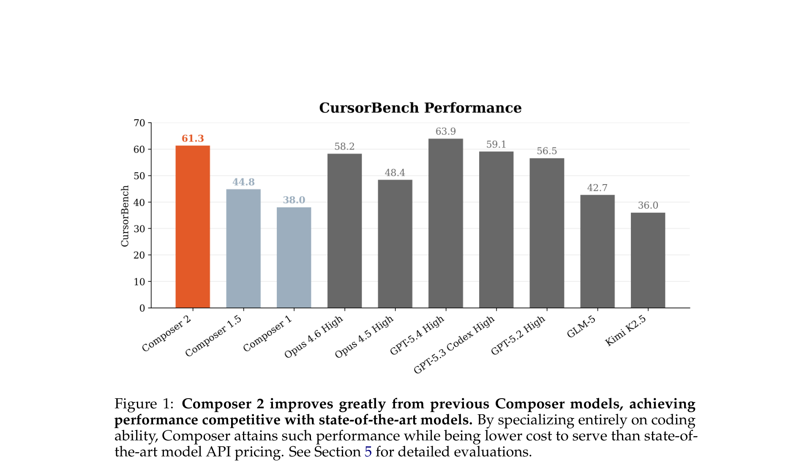
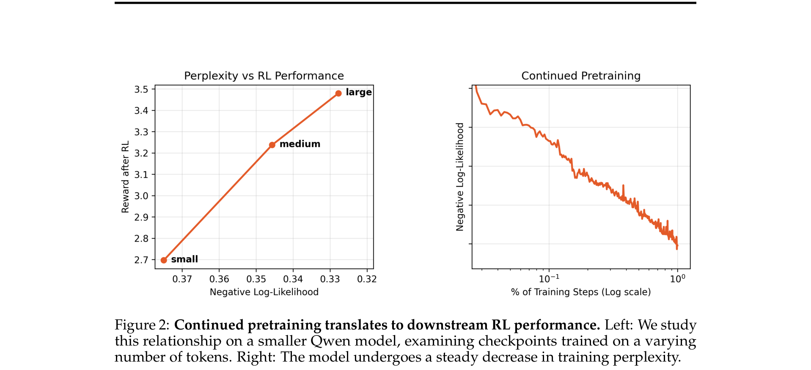
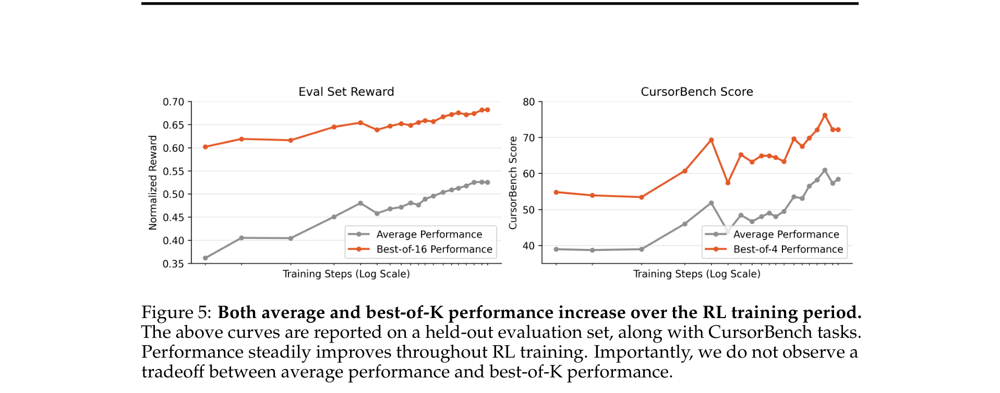
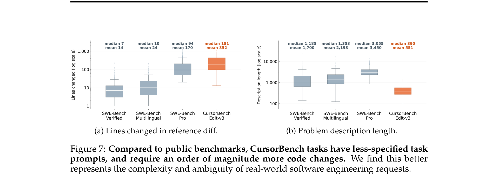
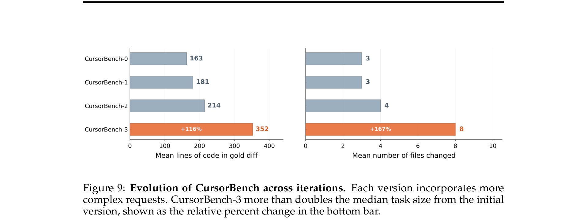
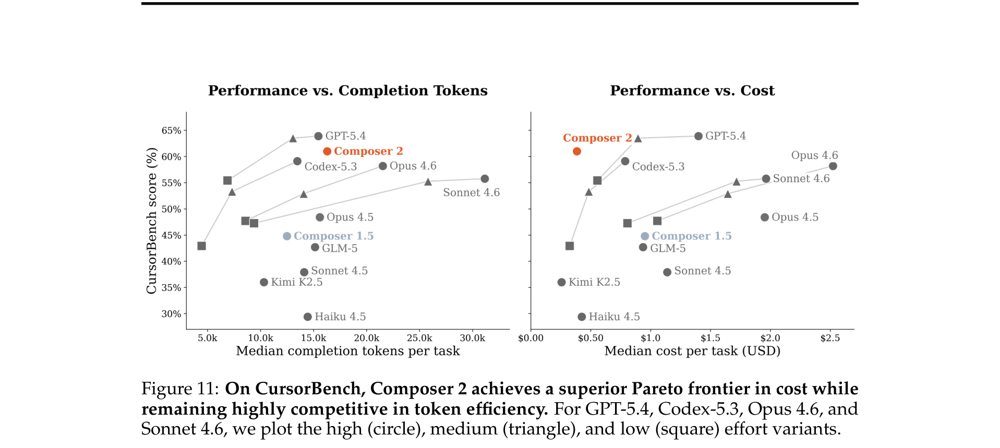
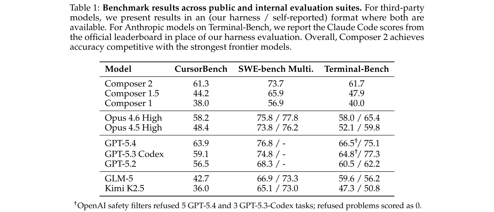

# Composer 2 Technical Report

**Authors:** Cursor Research Team
**Date:** 2025 (exact date not specified)
**Paper:** [PDF](https://cursor.com/resources/Composer2.pdf)

---

## TL;DR

Composer 2 is Cursor's specialized coding model for agentic software engineering, built by continued pretraining on Kimi K2.5 (1.04T params, 32B active MoE) followed by large-scale reinforcement learning in realistic coding environments. It scores 61.3 on CursorBench (their internal real-world software engineering benchmark), 73.7 on SWE-bench Multilingual, and 61.7 on Terminal-Bench — competitive with frontier models like GPT-5.4 and Opus 4.6 while being significantly cheaper to serve.

---

## Key Figures

### Figure 1: CursorBench Performance

Composer 2 scores 61.3 on CursorBench, a 37% relative improvement over Composer 1.5 (44.8) and 61% over Composer 1 (38.0). It is competitive with GPT-5.4 (63.9) and outperforms Opus 4.6 High (58.2), Opus 4.5 High (48.4), and GPT-5.2 High (56.5), while being a domain-specialized model with lower serving cost.

### Figure 2: Continued Pretraining Translates to RL Performance

Left: A clear correlation between continued pretraining compute (small/medium/large) and downstream RL reward — lower negative log-likelihood after pretraining directly predicts higher reward after RL. Right: Training loss decreases log-linearly over continued pretraining steps. This validates the two-phase training strategy.

### Figure 5: RL Training Curves (Average and Best-of-K)

Both average performance and best-of-K performance improve throughout RL training on both the held-out eval set and CursorBench. Crucially, there is **no trade-off** between average and best-of-K — RL is expanding the set of reachable correct solutions, not just concentrating probability mass on known ones.

### Figure 7: CursorBench vs. Public Benchmark Complexity

CursorBench tasks require an **order of magnitude more code changes** than public benchmarks (median 181 lines changed vs. 7-10 for SWE-bench Verified/Multilingual), while having **shorter, more ambiguous prompts** (median 390 chars vs. 1,185-3,055). This mirrors real-world software engineering where developers must synthesize context from sparse bug reports and large codebases.

### Figure 9: CursorBench Evolution

CursorBench has grown in complexity across iterations: CursorBench-3 requires 116% more lines of code and 167% more files changed compared to the initial version. The benchmark is continually refreshed to stay aligned with how developers actually use Cursor.

### Figure 11: Pareto Frontier — Performance vs. Cost

Composer 2 achieves a Pareto-optimal position: its inference cost is comparable to smaller or low-effort variants of frontier models, while its accuracy is competitive with their high-effort configurations. This demonstrates that domain-specialized training can produce models simultaneously more accurate and more cost-effective than general-purpose alternatives.

### Table 1: Benchmark Results

Comprehensive comparison across CursorBench, SWE-bench Multilingual, and Terminal-Bench. Composer 2 achieves 61.3 / 73.7 / 61.7 respectively — competitive with GPT-5.4 (63.9 / 76.8 / 66.5-75.1) while being a far smaller, cheaper model.

---

## Key Novel Ideas

### 1. Continued Pretraining as RL Foundation
Rather than jumping straight to RL from a general-purpose base model, Composer 2 first performs extensive continued pretraining on a code-dominated data mix. This is done in three phases: (1) bulk compute at 32k sequence length, (2) long-context extension to 256k, and (3) a short SFT phase on targeted coding tasks. The key insight is that **cross-entropy loss during pretraining is directly predictive of downstream RL performance** — the more you pretrain, the higher the RL reward ceiling. This makes pretraining a high-leverage investment.

### 2. Asynchronous RL with Train-Test Fidelity
RL training runs in realistic Cursor environments (the same harness deployed in production), eliminating train-test mismatch. The infrastructure is highly asynchronous with independent training and rollout workers. To manage off-policy divergence in this regime, they use: (1) fast weight sync via delta compression to S3, (2) in-flight weight updates during rollouts (PipelineRL-style), and (3) MoE router replay to align training and inference expert selection. The production training job spans 3 GPU regions and 4 CPU regions.

### 3. Self-Summarization for Long-Horizon Coherence
To handle long-horizon tasks, training rollouts can involve **multiple generations chained together with self-summaries** rather than single prompt-response pairs. The final reward is applied to all tokens — good trajectories upweight both the agent actions and the summaries that preserved critical information. Through training, the model learns to compress context efficiently, often self-summarizing multiple times on hard tasks. This consistently reduces errors compared to separate prompt-based compaction while reusing the KV cache.

### 4. Nonlinear Length Penalties for Efficient Behavior
A concave-down length penalty $C_{\text{length}\{k,q\}}(x) = \frac{(1+kx)^{1-q}-1}{k(1-q)}$ is applied to the reward, where $x$ is a weighted combination of thinking tokens, tool calls, message tokens, and turn count. The nonlinearity means easy tasks (few tool calls) are strongly penalized for excess length, while hard tasks (hundreds of iterations) incur diminishing marginal cost per additional step. This teaches the model to be quick on simple requests and thorough on hard ones, and encourages emergent efficient behaviors like parallel tool calls.

### 5. CursorBench: A Living Benchmark from Real Engineering Sessions
CursorBench is an internal evaluation drawn from actual Cursor engineering team sessions. Key differences from public benchmarks:
- **10x more code changes** required (median 181 vs. 7-10 lines)
- **Shorter, more ambiguous prompts** (median 390 chars vs. 1,185+ chars)
- **No data contamination** (tasks from private repos, continually refreshed)
- **Multi-dimensional evaluation** beyond correctness: code quality, readability, execution efficiency, instruction following, interruption handling
- CursorBench is versioned and grows in complexity as agent capabilities improve

### 6. KL Estimator Choice Matters
The paper identifies that the commonly-used $k_3$ KL estimator ($k_3 = (r-1) - \log r$) suffers from **extreme variance blow-up** when the policy diverges from the reference. They instead use the standard $k_1 = -\log r$ estimator, which avoids this pathology while remaining unbiased.

---

## Architecture Details

| Attribute | Value |
|-----------|-------|
| Base model | Kimi K2.5 |
| Architecture | Mixture-of-Experts (MoE) |
| Total parameters | 1.04T |
| Active parameters | 32B |
| Attention | Multi-Head Latent Attention (MLA) |
| Context length | 256k tokens (after long-context extension) |
| Multi-Token Prediction | Trained from scratch with self-distillation |
| Pretraining precision | MXFP8 |
| MoE forward pass | NVFP4 (FP4E2M1, with per-block FP8 + per-token FP32 scales) |
| MoE backward pass | MXFP8 (FP8E4M3 values, FP8E8M0 scales) |
| Hardware | NVIDIA B300s (Blackwell) |
| Parallelism | Context Parallelism (CP) + Expert Parallelism (EP) + FSDP |
| CP/EP config (pretraining) | EP=8, CP=2 |
| CP/EP config (RL) | EP=8, CP=8 |
| Expert dispatch | DeepEP with MXFP8 token quantization |
| Inference partner | Fireworks AI |

---

## Training Pipeline

### Phase 1: Continued Pretraining
1. **Bulk pretraining** at 32k sequence length on a large code-dominated data mix
2. **Long-context extension** to 256k sequence length
3. **Short SFT phase** on targeted coding tasks
4. **Multi-Token Prediction layers** initialized from scratch, trained via self-distillation on the main LM head's exact logit distribution; included and jointly trained in phases 2 and 3

### Phase 2: Reinforcement Learning
1. **Task distribution**: Covers iterate-on-feature, debugging, new feature, refactor, understanding codebase, documentation, testing, code review, optimize, devops, migration, deletion — many absent from public benchmarks
2. **Environment**: Firecracker VMs on Anyrun (Cursor's internal compute platform), with browser, GUI, and full tool access identical to production Cursor
3. **Algorithm**: Policy gradient with multiple samples per prompt, fixed group sizes, single-epoch (no prompt reuse), Adam optimizer, full parameter update
4. **Advantage computation**: Modified GRPO — removes length standardization term to prevent length bias; does not normalize group advantages by their standard deviation
5. **Reward**: Correctness + code quality + succinctness + SE principles + nonlinear length penalty + behavior/communication rewards + product-specific penalties
6. **Curriculum**: Later stages upsample harder problems using heuristics (number of turns, thinking tokens)
7. **Weight sync**: Delta compression, sharded uploads to S3, distributed download across inference clusters in US + Europe
8. **Online eval**: Pinned production backend + Cursor client for each eval job; cross-region weight sync for eval deployments

---

## Key Results

### CursorBench-3

| Model | CursorBench | SWE-bench Multi. | Terminal-Bench |
|-------|------------|-------------------|---------------|
| **Composer 2** | **61.3** | **73.7** | **61.7** |
| Composer 1.5 | 44.2 | 65.9 | 47.9 |
| Composer 1 | 38.0 | 56.9 | 40.0 |
| Opus 4.6 High | 58.2 | 75.8 / 77.8 | 58.0 / 65.4 |
| Opus 4.5 High | 48.4 | 73.8 / 76.2 | 52.1 / 59.8 |
| GPT-5.4 | 63.9 | 76.8 / - | 66.5 / 75.1 |
| GPT-5.3 Codex | 59.1 | 74.8 / - | 64.8 / 77.3 |
| GPT-5.2 | 56.5 | 68.3 / - | 60.5 / 62.2 |
| GLM-5 | 42.7 | 66.9 / 73.3 | 59.6 / 56.2 |
| Kimi K2.5 (base) | 36.0 | 65.1 / 73.0 | 47.3 / 50.8 |

### Key Numbers
- **61% improvement** over Composer 1 on CursorBench
- **37% improvement** over Composer 1.5 on CursorBench
- **70% lift** over base model (Kimi K2.5: 36.0 -> 61.3) on CursorBench
- **73.7%** on SWE-bench Multilingual (7.8% improvement over Composer 1.5)
- **61.7%** on Terminal-Bench (13.8% improvement over Composer 1.5)
- Pareto-optimal cost-performance: competitive with GPT-5.4 High at a fraction of the inference cost

### Base Model Selection (Appendix B)

| Model | FreshBench | State Tracking | Neg. Log-Likelihood |
|-------|-----------|----------------|---------------------|
| DeepSeek V3.2 | 68.9% | 66 | 11.75M |
| **Kimi K2.5** | **83.2%** | 86 | 13.81M |
| GLM-5 | 79.2% | 92 | 14.11M |

Kimi K2.5 was selected for its strong FreshBench (coding knowledge), decent state tracking, and efficiency in Cursor's infrastructure.

---

## Key Takeaways

1. **Domain specialization works**: Starting from a strong general model and specializing it through continued pretraining + RL produces a model competitive with much larger frontier models while being cheaper to serve. This validates the "specialize a generalist" approach over training domain models from scratch.

2. **Continued pretraining is high-leverage for RL**: Cross-entropy loss during pretraining is directly predictive of downstream RL reward. More pretraining compute = higher RL ceiling. The two phases are complementary, not substitutive.

3. **Train-test fidelity is critical**: By training in the exact same harness and environment used in production (same tools, same Cursor client, same Anyrun compute), they minimize the gap between benchmark performance and real-world utility. Public benchmarks often fail to capture this.

4. **Public benchmarks are saturating and contaminated**: SWE-bench Verified was suspended by OpenAI after finding frontier models could generate gold patches from memory. Haiku 4.5 scores 73.3% on SWE-bench Verified (very close to GPT-5's 74.9%) but diverges sharply on broader benchmarks. CursorBench addresses this with private, refreshable, more complex tasks.

5. **RL expands capabilities, not just concentrates them**: Uniquely, their RL training improves both average *and* best-of-K performance simultaneously — the model isn't just getting better at picking known-good paths, it's learning genuinely new solution strategies.

6. **Nonlinear length penalties produce emergent efficiency**: The concave penalty function teaches the model to make parallel tool calls, avoid unnecessary thinking on easy tasks, and invest effort proportionally to problem difficulty — all without explicit supervision for these behaviors.

7. **Self-summarization enables long-horizon coherence**: Training with chained self-summaries (credited by the final reward) teaches the model to compress context effectively, enabling it to work on harder problems that require many turns without losing track of earlier context.

8. **MoE training precision details matter at scale**: Per-tensor scales in NVFP4 caused RL training divergence after ~100 steps due to batch-variant precision and inter-token scale leakage. Switching to per-block + per-token scales was essential. IEEE-compliant FP arithmetic (`__fdiv_rn`) was also critical for NVFP4 — fast approximations caused divergence.

9. **Infrastructure is a first-class research contribution**: The paper devotes significant space to Anyrun (their environment platform), async RL with fault tolerance, delta-compressed weight sync across continents, router replay for MoE alignment, and global sequence packing for balanced DP compute. This infrastructure is what enables training at this scale.

10. **The benchmark must evolve with the model**: CursorBench is versioned and grows in complexity (CursorBench-3 has 116% more code and 167% more files than v0). As models improve, static benchmarks saturate — a living benchmark ensures evaluation remains meaningful.

---

## What's Open-Sourced

- **GPU kernels**: Custom MXFP8 and NVFP4 kernels via ThunderKittens/ParallelKittens (collaboration with Stanford Hazy Research group)
- **Flash Attention 4 backward kernel** for QK 192 / V 128 (DeepSeek shapes) contributed to the public flash-attention repo
- **Blog posts** on MoE kernel optimization and self-summarization technique
- **No model weights released** — Composer 2 is a proprietary model served through Cursor
- **No CursorBench released** — internal evaluation suite drawn from private engineering sessions
