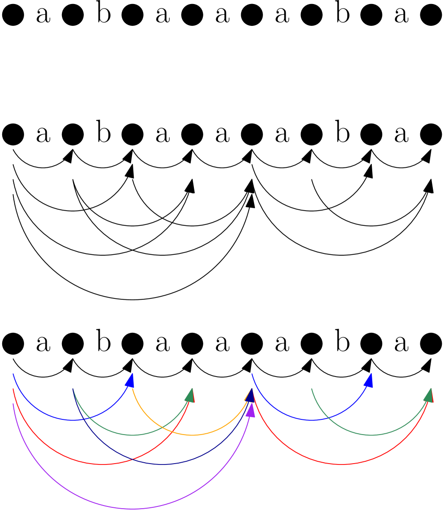
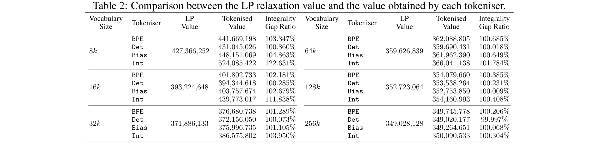
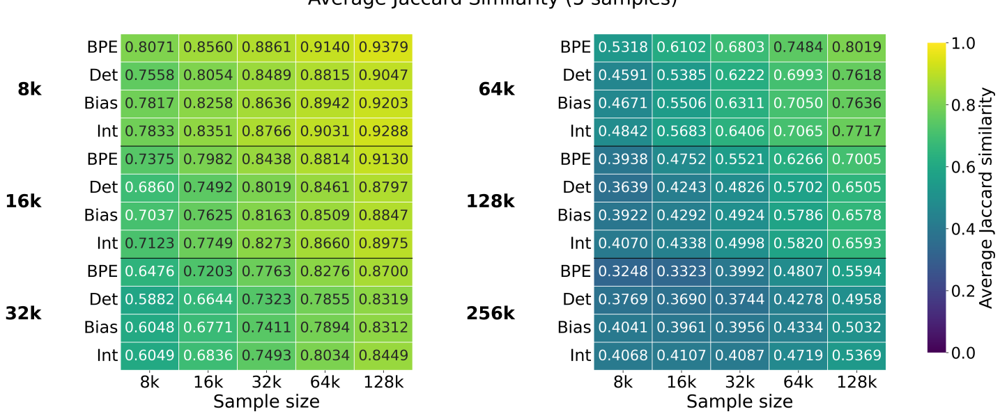
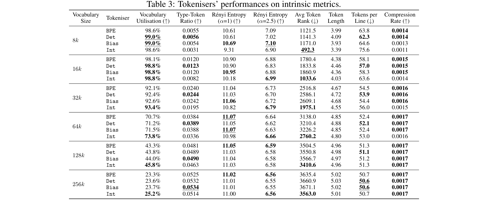
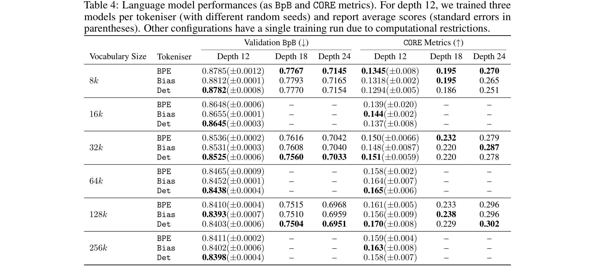
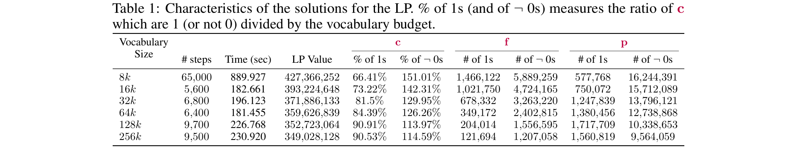

# Tokenisation via Convex Relaxations

**Authors:** Jan Tempus, Philip Whittington, Craig W. Schmidt, Dennis Komm, Tiago Pimentel
**Affiliations:** ETH Zurich, Kensho Technologies
**Date:** May 2025
**Paper:** [PDF](https://arxiv.org/abs/2605.22821)

---

## TL;DR

Current tokenizers like BPE build vocabularies greedily — they pick one token at a time without considering the global picture. This paper reformulates tokenizer construction as a linear program (LP), relaxing the NP-hard integer program into something solvable. The result, called ConvexTok, produces tokenizers that are provably within 1% of optimal compression at common vocabulary sizes, consistently beats BPE on bits-per-byte (BpB), and often improves downstream task performance.

---

## Key Figures

### Figure 1: Tokenisation Graph Construction

This figure shows the core data structure behind ConvexTok. Given a dataset (here, {abaa, aba}), the paper builds a directed acyclic graph (DAG) where each possible token corresponds to a colored edge connecting non-adjacent vertices. Black edges are "byte-edges" (single characters — always free). Colored arcs are "token-edges" (multi-character tokens that cost a slot in the vocabulary budget). Finding the best tokenizer becomes finding the shortest path through this graph, given a budget of K colors you're allowed to use. The bottom sub-figure shows a specific selection of colors (tokens) being activated.

### Table 2: Compression Results and Certified Optimality Gaps

This is the paper's headline result table. The LP value gives a provable lower bound on the best compression any tokenizer can achieve. The "Integrality Gap Ratio" shows how far each tokenizer is from that bound — a ratio of 100% would mean perfectly optimal. Det achieves 100.073% at 32k and essentially hits the bound (99.997%) at 256k. Even BPE is within ~1.3% at 32k. This means the tokenization problem, while NP-hard in theory, is nearly solved in practice.

### Figure 3: Vocabulary Stability Across Training Subsets

These heatmaps show how much each tokenizer's vocabulary changes when trained on different random subsets of the same data. Higher values (yellow) mean more stable. BPE is consistently more stable than all ConvexTok variants. This makes sense: BPE's greedy, frequency-driven approach produces similar results regardless of small data variations, while ConvexTok's global optimization is more sensitive to the specific statistics of each subset. The stability gap narrows at larger vocabulary sizes.

### Table 3: Intrinsic Tokenisation Metrics

This table evaluates tokenizers on classical intrinsic metrics. Key findings: Bias consistently achieves the best vocabulary utilisation (the fraction of vocabulary tokens that actually get used) and compression rate. Int uses fewer tokens than its budget allows (since it only keeps tokens the LP treats as "forced"), which gives it distinctively different characteristics — e.g., at 16k budget, Int only has ~11.7k tokens. BPE often beats ConvexTok on Renyi entropy, suggesting the relationship between compression and entropy is not straightforward.

### Table 4: Language Model Performance (BpB and CORE)

The most important downstream result table. Det consistently achieves the best BpB across all model sizes (depth 12 through 24) and vocabulary sizes. For example, at 32k vocab / depth 18, Det gets 0.7560 BpB vs BPE's 0.7616. On the CORE benchmark (reasoning and common sense tasks), results are more mixed — ConvexTok is competitive but doesn't uniformly dominate. At larger vocabulary sizes (128k, 256k), ConvexTok tends to match or beat BPE on both metrics.

### Table 1: LP Solution Characteristics

This table reveals something surprising about the LP relaxation: even though the problem is NP-hard, the LP's solution is already nearly integral at larger vocabulary sizes. At 256k, 90.53% of the color variables are exactly 1 (meaning the LP has already decided those tokens should be in the vocabulary with no ambiguity). At 8k, only 66.41% are integral, explaining why rounding matters more at small vocabulary sizes. Solve time is relatively stable (~3-4 minutes) except for 8k (~15 minutes), where the tighter budget creates harder trade-offs.

---

## Key Novel Ideas

### 1. Tokenization as a Graph Shortest-Path Problem

The paper's foundational insight is reframing tokenization as a graph problem. For each byte-string in the dataset, they create a node for every position between bytes (plus start and end). Single-byte edges are free; multi-byte edges represent possible tokens and are "colored" by which token they represent.

A tokenizer then corresponds to:
- A **graph-vocabulary**: choosing K colors (tokens) from all possible colors
- A **graph-segmentation**: finding a shortest path from start to end using only free edges and edges of the chosen colors

The compression achieved by the tokenizer equals the length of this shortest path. This reformulation is exact — there's a one-to-one correspondence between graph-vocabularies and traditional vocabularies, and between graph-segmentations and token sequences.

Why this matters: it transforms an abstract combinatorial problem over strings into a structured problem on a DAG, which has a rich theory of efficient algorithms and LP relaxations behind it.

### 2. LP Relaxation with Provable Lower Bounds

From the graph formulation, the paper constructs an integer program (IP) using three sets of variables:
- **f** (free token-instance vector): which single-byte edges are used in the segmentation
- **p** (priced token-instance vector): which multi-byte edges are used
- **c** (priced-color vector): which tokens are in the vocabulary

The key constraints are:
- **Flow conservation** (Pp + Ff = d): the selected edges must form a valid path
- **Color activation** (p - Cc ≤ 0): you can only use an edge if its token is in the vocabulary
- **Budget** (⟨1, c⟩ ≤ K): at most K tokens

The LP relaxation simply changes variables from {0, 1} to [0, 1]. This allows "partial" tokens — a token can be 0.7 in the vocabulary, meaning its edges can carry 70% of a unit of flow. This is solvable in polynomial time, and its optimal value is a provable lower bound on the best any tokenizer can achieve.

Why this matters: for the first time, we can say with certainty how close any tokenizer (including BPE) is to optimal. At 32k vocabulary, BPE is within 1.3% of optimal compression.

### 3. Three Rounding Schemes for Converting LP Solutions to Discrete Tokenizers

Since the LP produces fractional solutions, the paper proposes three schemes to "round" them into actual tokenizers:

- **Deterministic (Det)**: Pick the K colors with the highest LP values. Simple and effective.
- **Biased (Bias)**: Rank colors by their LP value divided by token length. This favors shorter tokens when LP scores are similar, since shorter tokens are more likely to be useful on unseen text.
- **Integral-only (Int)**: Keep only colors that the LP already set to essentially 1 (≥ 0.999). This gives a smaller-than-budget vocabulary but uses only tokens the LP is confident about.

After rounding the color vector **c**, computing the optimal segmentation (the **f** and **p** vectors) is trivial — it's just a shortest-path computation on the graph with the selected colors.

Each scheme has different strengths: Det is best for BpB, Bias is best for intrinsic metrics, and Int is interesting theoretically but underperforms in practice.

### 4. Scalable GPU-Accelerated LP Solving

The LP is enormous — 99.2 million constraints, 106 million variables, and 8.8 million color variables. The paper solves it using the PDLP method in NVIDIA's CuOPT library on a single GH200 GPU. Key optimizations include merging identical subgraphs and adjusting objective coefficients. Despite the scale, solve time is only ~3-4 minutes for most vocabulary sizes (up to ~15 minutes for 8k, where the problem is most constrained).

---

## Architecture Details

ConvexTok is a tokenizer construction method, not a model architecture. However, the key structural parameters are:

| Parameter | Value |
|-----------|-------|
| Training data | ClimbMix400B (curated from Nemotron-ClimbMix) |
| Training documents | 593,920 |
| Pre-tokenization | nanochat regex (splits by words, numbers, punctuation, whitespace) |
| Vocabulary sizes tested | 8k, 16k, 32k, 64k, 128k, 256k (powers of 2) |
| LP solver | PDLP via NVIDIA CuOPT (GPU-accelerated) |
| LP constraints | 99,168,445 total (20M equality, 79M inequality) |
| LP variables | 105,997,943 (79M priced edges, 18M free edges, 8.8M colors) |
| Solver stopping criteria | Primal-dual gap of 10,000 |
| Inference segmentation | Standard shortest-path algorithm (same runtime as UnigramLM/BPE) |

Language models used for evaluation:

| Model Size | Depth | Parameters |
|-----------|-------|------------|
| Small | 12 layers | ~135M |
| Medium | 18 layers | ~350M-1.3B |
| Large | 24 layers | ~3.5B |

All models are GPT-style decoder-only transformers following the nanochat standard with modern architectural upgrades.

---

## Training Pipeline

### Tokenizer Training

1. **Data preparation**: Sample 593,920 documents from ClimbMix400B. Apply pre-tokenization using a regex that splits input into words, numbers, punctuation, and whitespace blocks.

2. **Graph construction**: Build the tokenisation graph from the pre-tokenized data. Each document becomes a sequence of nodes connected by byte-edges (free) and token-edges (priced, colored by the substring they represent).

3. **LP construction**: Convert the graph into an LP with flow constraints, color-activation constraints, and a budget constraint. Merge identical subgraphs to reduce problem size.

4. **LP solving**: Solve using PDLP on a single NVIDIA GH200 GPU. Takes ~4 hours total. The solver finds near-exact fractional solutions.

5. **Rounding**: Apply one of the three rounding schemes (Det, Bias, or Int) to convert the fractional color vector into a discrete vocabulary of K tokens.

6. **Segmentation**: For any input text, use a standard shortest-path algorithm to find the optimal segmentation given the chosen vocabulary. This is the same algorithm used by UnigramLM, so inference cost is identical.

### Language Model Training

- GPT-style decoder-only transformers following nanochat configuration
- Hyperparameters chosen using BPE baseline at 32k vocab, then reused unchanged for ConvexTok variants
- Training on ClimbMix400B
- Depth 12 models: 3 seeds each, others: single run
- Smallest models (135M): ~17 min on 4 GH200s
- Largest models (3.5B): ~199 min on 16 GH200s
- Total compute: ~200 GPU hours across all training runs

---

## Key Results

### Compression and Optimality Gaps (Table 2)

| Vocab Size | LP Lower Bound | BPE (Gap) | Det (Gap) | Bias (Gap) | Int (Gap) |
|-----------|---------------|-----------|-----------|------------|-----------|
| 8k | 427,366,252 | 441.7M (3.35%) | 431.0M (0.86%) | 448.2M (4.86%) | 524.1M (22.6%) |
| 16k | 393,224,648 | 401.8M (2.18%) | 394.3M (0.28%) | 403.8M (2.68%) | 439.8M (11.8%) |
| 32k | 371,886,133 | 376.7M (1.29%) | 372.2M (0.07%) | 376.0M (1.11%) | 386.9M (3.96%) |
| 64k | 359,626,839 | 362.1M (0.68%) | 359.7M (0.02%) | 362.0M (0.65%) | 366.0M (1.78%) |
| 128k | 352,723,064 | 354.1M (0.39%) | 353.5M (0.23%) | 352.8M (0.01%) | 354.2M (0.41%) |
| 256k | 349,028,128 | 349.7M (0.21%) | 349.0M (~0.00%) | 349.3M (0.07%) | 350.1M (0.30%) |

Det achieves near-optimal compression across all vocabulary sizes, reaching essentially 0% gap at 256k.

### Language Model BpB (Table 4, depth 12, 3 seeds)

| Vocab Size | BPE | Bias | Det |
|-----------|------|------|-----|
| 8k | 0.8785 | 0.8812 | **0.8782** |
| 16k | 0.8648 | 0.8655 | **0.8645** |
| 32k | 0.8536 | 0.8531 | **0.8525** |
| 64k | 0.8465 | 0.8452 | **0.8438** |
| 128k | 0.8410 | 0.8393 | **0.8403** |
| 256k | 0.8411 | 0.8402 | **0.8398** |

Det consistently achieves the best BpB. At larger vocabulary sizes (64k+), the advantage grows. At 128k, Bias edges out Det.

### Language Model BpB (Larger Models)

| Config | BPE | Bias | Det |
|--------|------|------|-----|
| 32k, depth 18 | 0.7616 | 0.7608 | **0.7560** |
| 32k, depth 24 | 0.7042 | 0.7040 | **0.7033** |
| 128k, depth 18 | 0.7515 | 0.7510 | **0.7504** |
| 128k, depth 24 | 0.6968 | 0.6959 | **0.6951** |

The BpB advantage of Det is consistent and grows slightly with model size.

### CORE Benchmark (Downstream Tasks)

Results are more mixed. At depth 12, ConvexTok is competitive but doesn't uniformly dominate. At depth 18 and 24:

| Config | BPE | Bias | Det |
|--------|------|------|-----|
| 32k, depth 18 | **0.232** | 0.220 | 0.220 |
| 32k, depth 24 | 0.279 | **0.287** | 0.278 |
| 128k, depth 18 | 0.233 | **0.238** | 0.229 |
| 128k, depth 24 | 0.296 | 0.296 | **0.302** |

At the largest vocabulary sizes (128k, 256k), ConvexTok tends to match or beat BPE on both BpB and CORE for all model depths.

---

## Key Takeaways

1. **Tokenization is nearly solved for compression.** At vocabulary sizes of 32k+, all tested tokenizers (including BPE) are within ~1.3% of the provable optimum. At 256k, Det is essentially at the lower bound. This suggests that improving compression further has diminishing returns — the bigger gains may come from choosing better objectives.

2. **Det is the best all-around ConvexTok variant.** It consistently achieves the best BpB and is competitive on CORE tasks. If you're picking one ConvexTok rounding scheme, Det is the default choice.

3. **Bias wins on intrinsic metrics but not downstream.** Bias achieves the best vocabulary utilization, compression rate, and tokens-per-line, but these advantages don't fully translate to better language modeling. This highlights the gap between intrinsic tokenizer quality and downstream usefulness.

4. **The LP relaxation is surprisingly tight.** At 256k vocabulary, over 90% of the LP's color variables are already integral (exactly 0 or 1). This means the NP-hard integer program is, in practice, very close to its continuous relaxation — the rounding step barely matters at large vocabulary sizes.

5. **BPE is remarkably good for a greedy algorithm.** Despite making only locally optimal decisions, BPE is within 1-3% of the provable optimum. Its main weakness is at small vocabulary sizes (8k), where the greedy choices hurt most.

6. **ConvexTok is less stable than BPE.** When trained on different subsets of the same data, ConvexTok's vocabulary changes more than BPE's. BPE's stability comes from its frequency-driven greedy approach — high-frequency merges are robust to sampling. ConvexTok's global optimization is more sensitive to the data distribution.

7. **Better compression does correlate with better BpB, but the CORE relationship is weaker.** Det achieves the best compression and the best BpB, but CORE task performance doesn't follow as cleanly. This echoes prior work showing that compression is a useful but imperfect proxy for downstream quality.

8. **ConvexTok's advantage grows with vocabulary and model size.** At 256k vocabulary and depth 24, ConvexTok consistently outperforms BPE on both BpB and CORE. Practitioners working with large models and large vocabularies stand to benefit most.

9. **The LP framework is extensible.** The paper formulates tokenization as an LP, but the same framework could optimize for different objectives (Renyi entropy, downstream loss, fairness metrics) with minimal modification. This opens a design space beyond compression.

10. **Training cost is practical.** ConvexTok takes ~4 hours on a single GH200 GPU — comparable to a short model training run. Inference is identical to BPE/UnigramLM (standard shortest-path segmentation). The main bottleneck is the LP size (~100M variables), which requires GPU-accelerated solvers.

---

## What's Open-Sourced

At the time of writing, the paper mentions that "code and trained tokenisers are available" but the repository link is listed as "to be added." No GitHub repository was found via HuggingFace metadata. The paper uses:
- **ClimbMix400B** dataset (from NVIDIA's Nemotron-ClimbMix, available via nanochat with MIT license)
- **NVIDIA CuOPT** LP solver (Apache-2.0 license)
- **nanochat** training framework (MIT license, by Andrej Karpathy)
