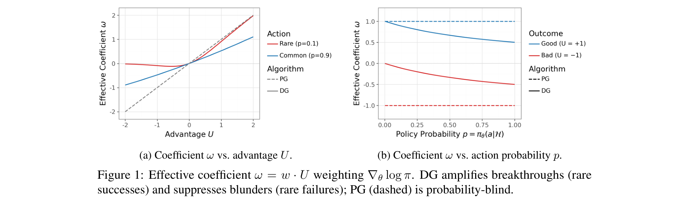
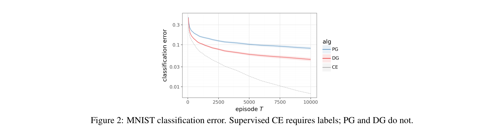
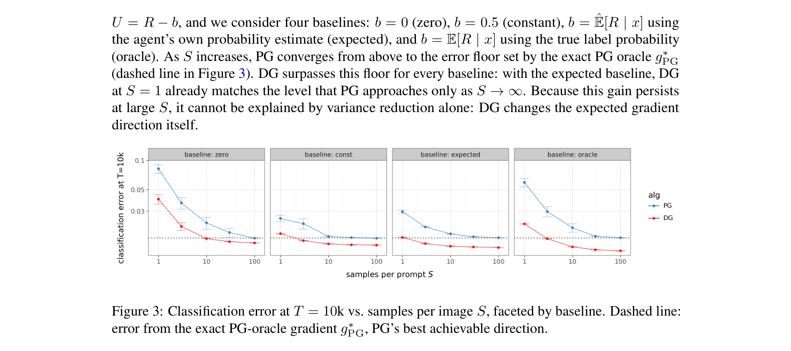
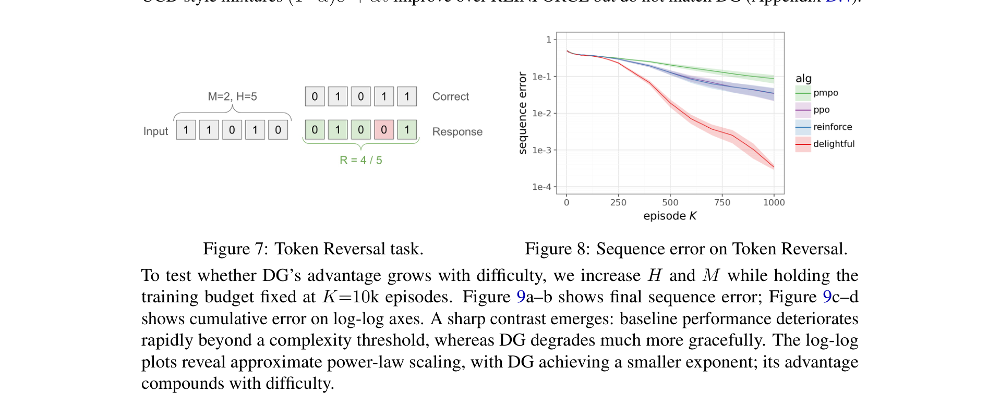
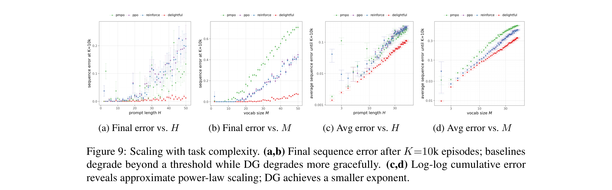
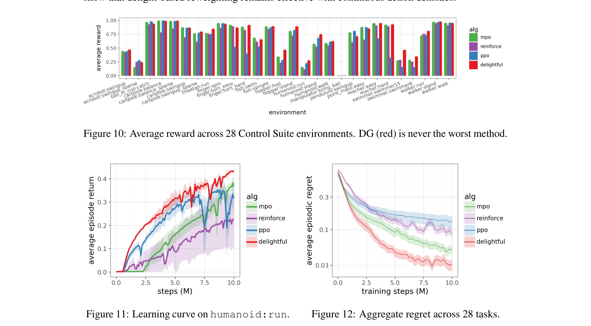

# Delightful Distributed Policy Gradient

**Authors:** Ian Osband (Google DeepMind)
**Date:** March 20, 2026
**Paper:** [PDF](https://arxiv.org/pdf/2603.20521)

---

## TL;DR

When you train a language model with RL using distributed actors (as in RLHF/GRPO), the actors' data is often stale, buggy, or from mismatched inference stacks. Standard policy gradients break under these conditions because *negative learning from surprising data* dominates the update — high-surprisal failures contribute large gradient terms that point in the wrong direction. The Delightful Policy Gradient (DG) fixes this by gating each gradient term with "delight" (advantage x surprisal), suppressing surprising failures and amplifying surprising successes. It needs no behavior probabilities and achieves ~10x lower error on token reversal tasks under combined distributed friction.

---

## Key Figures

### Figure 1: The DG Gate Coefficient

This shows how DG weights gradient updates differently from standard PG. Left: as a function of advantage $U$. Right: as a function of action probability $p$. The key: for rare actions ($p$ near 0) with negative advantage (failures), DG almost completely shuts the gate. For rare actions with positive advantage (successes), DG amplifies the update. Common actions (high $p$) are treated roughly equally by both methods. This asymmetry is why DG works — it only learns from surprising data when that data is good news.

### Figure 2: MNIST Under Staleness

MNIST classification cast as a contextual bandit, with staleness simulated by delaying actor parameters by $D$ steps. Left: learning curves at delay $D$=1000. DG (red) converges well while PG (blue, with exact importance weights) barely improves and REINFORCE (green) fails completely. Right: final error vs. delay. DG stays below 8% error even at $D=1000$, while PG plateaus above 8% at moderate delays. DG does this *without any importance weights*.

### Figures 3-4: Gradient Alignment Over Training

Top row: classification error vs. samples per image at different staleness levels. Bottom row: gradient alignment to both the ideal PG direction and the cross-entropy direction. DG's gradient becomes *more* aligned with the true target as training progresses — a self-reinforcing dynamic where better policies produce cleaner gradients, which in turn produce even better policies. Standard PG's alignment collapses under contamination.

### Figure 8: Token Reversal Results

Token reversal: a transformer must output its input sequence in reverse order. DG converges to near-zero sequence error while PG, PPO, and PMPO stall an order of magnitude higher. This is a realistic proxy for the sequential autoregressive generation used in LLM training — correct trajectories become exponentially rare as sequence length grows.

### Figure 9: Scaling with Task Complexity

As sequence length $H$ and vocabulary size $M$ increase, baselines hit a wall beyond which they completely fail. DG degrades more gracefully, following an approximate power law. At $K=10k$ episodes, DG solves sequences of length $H^* \approx 13$, compared to $\approx 8$ for PMPO, $\approx 5$ for PPO, and $\approx 3.5$ for PG. DG's advantage *compounds* with problem difficulty.

### Figure 10: DeepMind Control Suite

Across 28 continuous-control environments, DG (red) matches or exceeds the best baseline in the majority of tasks, without any task-specific tuning. This shows the method generalizes beyond discrete-action settings to standard continuous-control benchmarks.

---

## Key Novel Ideas

### 1. The Core Problem: Negative Learning from Surprising Data

Here's the fundamental issue. In distributed RL (the kind used to train frontier reasoning models), actors generate data using slightly old or different model weights. When the learner's current policy sees this data, many actions look very unlikely — they have *high surprisal*.

The problem isn't that the data is stale. The problem is that **bad outcomes from unlikely actions dominate the gradient**. Here's why:

- A rare failure (high surprisal, negative advantage) creates a large gradient term because $\nabla_\theta \log \pi(a)$ is big when $\pi(a)$ is small
- But this term points almost perpendicular to the true gradient direction (the paper proves this: each disfavored action's gradient has $O(\delta)$ projection onto the true gradient but $\Theta(1)$ norm)
- These near-orthogonal, large-magnitude terms overwhelm the real signal

Supervised fine-tuning avoids this entirely — it only increases the probability of target actions. Policy gradients must also *decrease* probabilities of bad actions, and that's where contamination strikes.

### 2. Delight: Advantage Times Surprisal

DG's fix is a single multiplication. For each sample $t$, compute three things:

- **Advantage** $U_t$: how much better this action was than expected (+1/2 for success, -1/2 for failure, with a baseline)
- **Action surprisal** $\ell_t = -\log \pi_\theta(A_t \mid \mathcal{H}_t)$: how unlikely this action is under the *learner's current* policy
- **Delight** $\chi_t = U_t \cdot \ell_t$: the product of the two

Then gate each gradient term with a sigmoid on delight:

$$\Delta \theta \propto \sum_{t \in B} \sigma(\chi_t / \eta) \, U_t \, \nabla_\theta \log \pi_\theta(A_t \mid \mathcal{H}_t)$$

where $\sigma(x) = 1/(1 + e^{-x})$ is the sigmoid and $\eta > 0$ is a temperature (set to 1 in all experiments).

What happens in each case:

- **Surprising success** (positive delight): gate opens → the learner says "I wouldn't have done this, but it worked — learn from it!"
- **Surprising failure** (negative delight): gate closes → the learner says "I wouldn't have done this, and it failed — ignore it"
- **Unsurprising action** (small surprisal): gate stays near $\frac{1}{2}$ → roughly normal weighting

The crucial property: delight uses only the *learner's* current policy. It needs no information about which actor generated the data or when.

### 3. Self-Reinforcing Dynamic: Better Policies Produce Cleaner Gradients

The paper proves (Corollary 1) that DG's advantage over PG *grows as the policy improves*. For a K-armed bandit with correct answer $y^*$, contamination rate $\rho$, and policy near-optimality $\pi(y^*) = 1 - \delta$:

$$\frac{\cos(\bar{g}_\text{DG}, \nabla_z J)}{\cos(\bar{g}_\text{PG}, \nabla_z J)} \to \infty \quad \text{as } \delta \to 0$$

In words: as the policy gets better, DG's gradient gets cleaner while PG's gradient stays corrupted. This is because the DG gate suppresses disfavored actions by a factor of at most $\pi(a)^{1/(2\eta)}$ (Lemma 1). As the policy improves, incorrect actions get lower probability, so they're suppressed more aggressively. It's a virtuous cycle.

Standard PG retains constant $\Theta(\rho)$ effective contamination no matter how good the policy is.

### 4. No Sign-Blind Reweighting Can Match DG (Impossibility Result)

Proposition 3 proves something strong: **no reweighting that treats successes and failures the same way can reproduce DG's effect**. This includes exact importance sampling.

Any weight function $f(a)$ that only depends on which action was taken — not on whether the outcome was good or bad — retains $\Theta(\rho)$ effective contamination, same as plain PG:

$$\cos(\bar{g}_f, \nabla_z J) = O(\delta/\rho) \quad \text{for any sign-blind } f$$

Why? Because disfavored actions have gradient vectors with $\Theta(1)$ norm but $O(\delta)$ projection onto the true gradient. No per-action scaling can fix this signal-to-noise ratio. DG escapes by conditioning on the *sign* of the advantage — $\sigma(U \ell / \eta)$ treats positive and negative advantage differently.

---

## Key Results

### MNIST Contextual Bandit (staleness $D=1000$, $K=10k$ steps)

| Method | Classification Error | Uses Behavior Probs? |
|--------|---------------------|---------------------|
| REINFORCE | ~90% (fails) | No |
| PG (exact importance weights) | ~8% | Yes (exact) |
| **DG** | **~2%** | **No** |

DG is 4x better than PG despite PG having access to exact behavior probabilities.

### Token Reversal (M=2, H=10, all four frictions combined)

| Method | Sequence Error at K=10k |
|--------|------------------------|
| PG | ~60% |
| PMPO | ~15% |
| PPO | ~10% |
| **DG** | **~0.3%** |

~10x lower error than every baseline, with the advantage growing under harder conditions.

### Scaling with Sequence Complexity (K=10k episodes)

| Method | Max Length $H^*$ Solved |
|--------|------------------------|
| PG | ~3.5 |
| PPO | ~5 |
| PMPO | ~8 |
| **DG** | **~13** |

---

## Key Takeaways

1. **The real problem in distributed RL is negative learning from surprising data.** High-surprisal failures from stale or buggy actors contribute large, near-orthogonal gradient terms that corrupt the update. Standard PG and importance weighting don't fix the direction — they fix the magnitude of a wrong gradient.

2. **Delight = advantage × surprisal is a simple, powerful filter.** One sigmoid per sample, one extra multiply, no behavior probabilities. Negligible computational cost.

3. **DG gets stronger as the policy improves.** Proven formally (Corollary 1) and validated empirically. The opposite of standard PG, where contamination damage is a constant.

4. **Exact importance sampling can't match DG — proven as an impossibility.** Any sign-blind reweighting retains constant contamination. DG breaks this because its gate depends on the sign of the advantage.

5. **DG's advantage compounds with problem difficulty.** Longer sequences, larger vocabularies, more friction → bigger gap between DG and baselines. This is exactly the regime of frontier LLM training.

6. **DG is a drop-in replacement for standard PG.** No reference policy, no trust region, no behavior probabilities. Replace the sample weight and keep everything else. Compatible with any distributed RL architecture (IMPALA, SEED, etc.).

7. **SFT accidentally solves the same problem.** SFT only applies positive updates, so it never suffers from negative learning on surprising data. DG recovers this property while still supporting reward-based learning.

8. **Experiments are small-scale but the mechanism is provably general.** The author is explicit that token reversal and MNIST are modest. The contribution is identifying the failure mode and proving DG fixes it with matching upper/lower bounds. Frontier-scale testing is future work.

---

## What's Open-Sourced

- **No code released** in this paper
- The method is fully specified by Equation (1) — a single sigmoid gate on delight applied to the standard policy gradient update. Implementation is trivial.
- Companion technical report: Osband (2025), "Delightful Policy Gradient," Google DeepMind TR gdm/lfg-1
