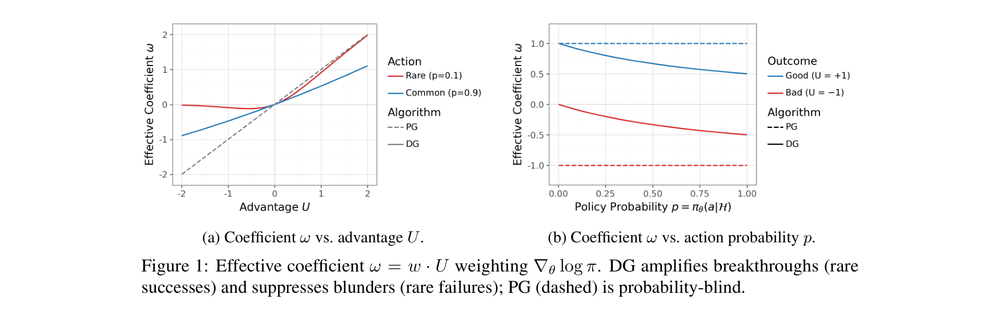
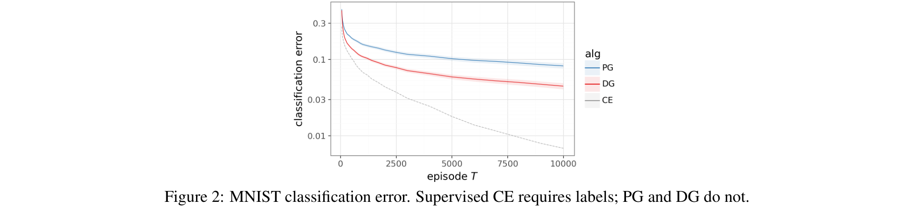
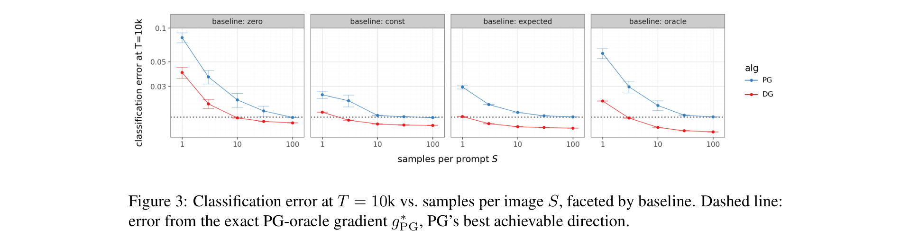
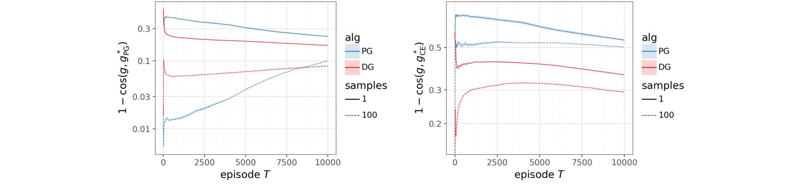
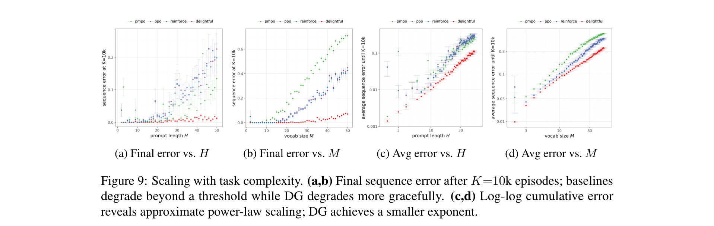
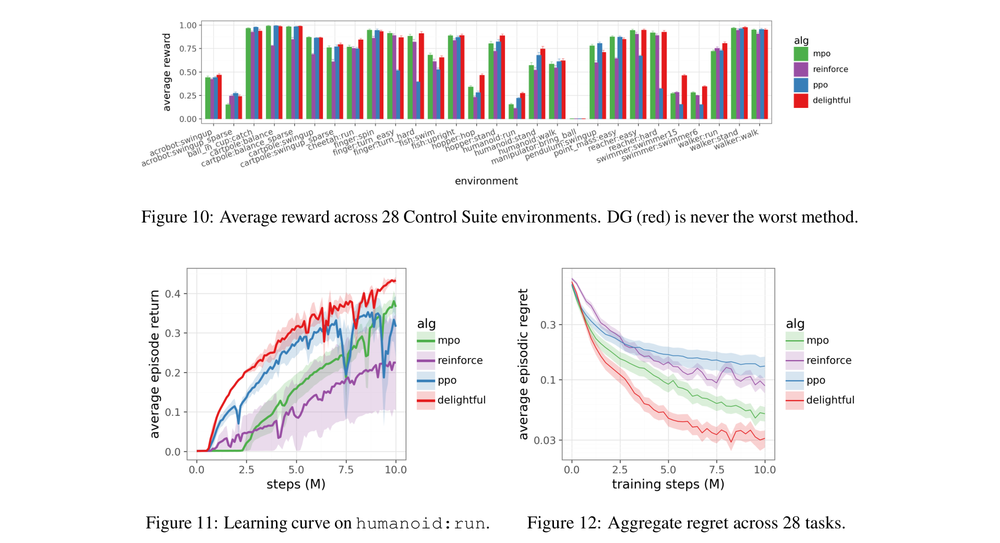
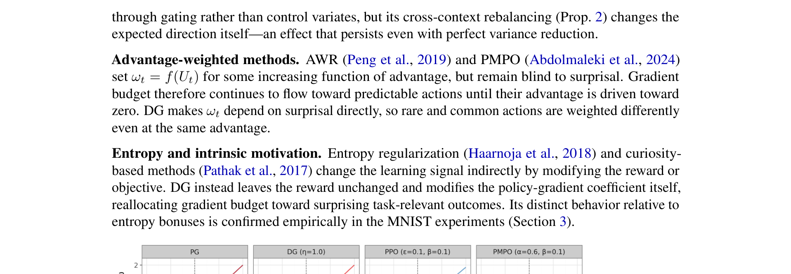

# Delightful Policy Gradient

**Authors:** Ian Osband
**Affiliation:** Google DeepMind
**Date:** March 15, 2026
**Paper:** [PDF](https://arxiv.org/abs/2603.14608v1)

---

## TL;DR

Standard policy gradients weight each sampled action by advantage alone, regardless of how likely that action was. This creates two pathologies: within a context, rare negative-advantage actions inject disproportionate noise; across contexts, the expected gradient over-allocates budget to easy contexts. The Delightful Policy Gradient (DG) fixes both by gating each gradient term with a sigmoid of *delight* — the product of advantage and action surprisal (negative log-probability). DG is a drop-in replacement requiring one sigmoid and one multiply per sample, provably reduces variance and shifts gradient direction toward the cross-entropy oracle, and outperforms REINFORCE, PPO, and advantage-weighted baselines across MNIST, transformer sequence modeling, and continuous control.

---

## Key Figures

### Figure 1: The DG Effective Coefficient

The core intuition visualized. Left: DG amplifies rare actions with positive advantage (*breakthroughs*) while suppressing rare actions with negative advantage (*blunders*). PG (dashed) treats both symmetrically. Right: for a good outcome (U=+1), DG gives nearly full weight regardless of probability; for a bad outcome (U=-1), DG suppresses the gradient when the action is already rare (low p). PG is completely blind to action probability.

### Figure 2: MNIST Diagnostic — DG Closes Half the Gap to Supervised CE

On MNIST as a contextual bandit (agent only sees reward, never labels), DG (red) learns roughly twice as fast as standard PG (blue), closing about half the gap to supervised cross-entropy (gray). The architecture and optimizer are identical — only the gradient weighting differs.

### Figure 3: Not Just Variance Reduction

A critical diagnostic: as samples per image S increases to 100, PG converges to its oracle floor (dashed line), but DG already surpasses this floor at S=1. Because DG beats PG's best achievable direction even with infinite samples, the benefit cannot be explained by variance reduction alone — DG genuinely changes the gradient direction.

### Figure 4: Two Distinct Mechanisms

Left (alignment to PG oracle): DG's advantage shrinks as S increases — this is the within-context variance reduction effect. Right (alignment to CE oracle): DG's advantage *persists* at S=100 — this is the cross-context directional effect. The two mechanisms are cleanly separable.

### Figure 9: Scaling with Task Complexity

On Token Reversal with transformers, DG's advantage compounds with difficulty. As H and M increase, baselines (REINFORCE, PPO, PMPO) degrade sharply beyond a complexity threshold, while DG degrades gracefully. Log-log plots reveal approximate power-law scaling with DG achieving a smaller exponent — its advantage grows as the problem gets harder.

### Figures 10 & 12: Continuous Control — 28 Environments

Top: per-environment average reward across 28 DeepMind Control Suite tasks. DG (red) is never the worst method on any task. Bottom left: humanoid:run learning curve where DG discovers a gait while others plateau. Bottom right: aggregate regret — DG achieves the lowest throughout training. Notably, DG is competitive with highly-tuned MPO and SAC despite using no task-specific tuning.

### Figure 13: Score Weight Comparison Across Methods

A unifying view: all policy gradient methods can be characterized by their effective score weight ω as a function of advantage U and action probability. PG and PMPO are probability-blind (common and rare actions get the same weight). PPO clips both tails through importance ratios. DG uniquely treats rare successes and rare failures asymmetrically — amplifying breakthroughs while suppressing blunders.

---

## Key Novel Ideas

### 1. Delight: The Product of Advantage × Surprisal
The central concept: *delight* χ_t = U_t · ℓ_t, where U_t is the advantage and ℓ_t = -log π_θ(A_t | H_t) is the action surprisal. Delight is large when an unlikely action has high advantage (a *breakthrough*) and strongly negative when an unlikely action has negative advantage (a *blunder*). The gate w_t = σ(χ_t/η) then:
- Opens (w ≈ 1) for breakthroughs — amplifying gradient from rare successes
- Closes (w ≈ 0) for blunders — suppressing noise from rare failures
- Stays near 1/2 for common actions — preserving standard PG behavior for the bulk of the distribution

The multiplicative form χ = U · ℓ is crucial — additive alternatives like UCB-style (1-α)U + αℓ consistently underperform (Appendix B.6).

### 2. Two Provable Mechanisms, Not One
DG improves gradient quality through two distinct, formally characterized mechanisms:

**Mechanism 1 — Within-context variance reduction (Proposition 1):** In a single K-armed bandit context, DG reduces perpendicular variance by exactly w²₋ (the blunder gate value squared). For K=100 at ε=0.5, DG retains only 4% of PG's cosine gap; at ε=0.1, only 1%. This effect vanishes as batch size → ∞.

**Mechanism 2 — Cross-context directional improvement (Proposition 2):** Across multiple contexts, DG shifts the expected gradient direction strictly closer to the supervised cross-entropy oracle, even in the infinite-sample limit. Standard PG weights each context by p_n (probability of success), so easy contexts dominate. DG compresses these weights toward equality, rebalancing gradient budget toward harder contexts. This is *not* variance reduction — it persists with exact gradients.

### 3. The Budget Allocation Pathology of Standard PG
The paper identifies a fundamental but previously unrecognized flaw in standard policy gradients: PG is *myopically optimal* (greedy single-step improvement scales with Σp_n) but *self-reinforcing* — improving an easy context makes its gradient even larger, attracting more budget. DG moves toward the Kelly-criterion-optimal weighting (c_n ∝ 1, equal across contexts), which maximizes long-run compounding (Σlog p_n). This connects to the Kelly criterion from information theory.

### 4. Derivation from Entropy-Regularized Gate Selection
The sigmoid gate isn't ad hoc — it arises from maximizing χw + ηH(w) for each sample, where H(w) = -w log w - (1-w) log(1-w) is binary entropy. The optimal gate is exactly w* = σ(χ/η). The temperature η interpolates between the "hedonic" limit (η → ∞, recovers standard PG) and the "enlightened" limit (η → 0, hard threshold on delight).

---

## Architecture Details

*This is a methods paper proposing a general-purpose policy gradient estimator. Architecture details vary by experiment:*

| Experiment | Architecture | Key Details |
|---|---|---|
| MNIST Bandit | 2-layer MLP, ReLU, width 100 | Adam, lr=10⁻³, B=100, K=10,000 episodes |
| Tabular Bandits | Explicit probability tables | K=100, B=100, α=0.1, normalized steps |
| Token Reversal | Decoder-only Transformer, d=64, 2 layers, 2 heads | 10 parallel actors, 100 episodes/step, Adam |
| Control Suite | Actor-critic MLP, 2×256 hidden | Retrace critic, 4 actors, replay 2×10⁶, 10M steps |

---

## Training Pipeline

DG is a drop-in modification to any on-policy gradient estimator:

1. **Compute standard gradient terms:** g_t = U_t ∇_θ log π_θ(A_t | H_t)
2. **Compute surprisal:** ℓ_t = -log π_θ(A_t | H_t)
3. **Compute delight:** χ_t = U_t · ℓ_t
4. **Apply gate:** w_t = σ(χ_t / η), where η=1 throughout
5. **Gated update:** Δθ ∝ Σ w_t · g_t

For continuous actions: clip log-densities to [-10, 10] before computing delight; optionally whiten χ across dimensions.

**Overhead:** One sigmoid and one multiply per sample. No importance ratios, no trust regions, no additional hyperparameters beyond η (fixed at 1).

---

## Key Results

### MNIST Contextual Bandit
- DG closes roughly **half the gap** between standard PG and supervised cross-entropy
- Gains persist across learning rates (10⁻⁵ to 10⁻²), batch sizes (1 to 1000), and network widths (1 to 2048)
- DG surpasses PG's oracle floor at S=1, confirming directional improvement beyond variance reduction

### Token Reversal (Transformer)
- Default task (H=10, M=2): DG reaches ~10⁻⁴ sequence error at K=1000 vs ~10⁻² for PPO
- Scaling: DG achieves a **smaller scaling exponent** — baselines degrade rapidly beyond complexity thresholds while DG degrades gracefully
- Consistent wins across 8 task variants (copy/flip/reverse × bag-of-tokens/sequential)
- PPO and PMPO cannot match DG despite extensive hyperparameter tuning (Appendix D.1)

### DeepMind Control Suite (28 environments, 10M steps)
- DG is **never the worst method** across all 84 runs (28 envs × 3 seeds)
- Achieves lowest aggregate regret throughout training
- Solves humanoid:run where PPO collapses and all baselines plateau
- Competitive with highly-tuned MPO and SAC despite no task-specific tuning
- Avoids catastrophic failures (PPO collapses on humanoid, REINFORCE fails on hopper:hop)

---

## Key Takeaways

1. **Standard policy gradients have a directional defect, not just a variance problem.** The expected PG direction over-allocates gradient budget to easy contexts/prompts. This is not a finite-sample artifact — it persists with infinite data. DG corrects this by reweighting toward the cross-entropy oracle.

2. **Delight = Advantage × Surprisal is a remarkably effective signal.** The multiplicative interaction between "how good was the outcome" and "how unlikely was the action" captures something neither quantity captures alone. Additive combinations don't work as well.

3. **The method is embarrassingly simple.** One sigmoid, one multiply, no importance ratios, no trust regions, no additional hyperparameters that need tuning. η=1 works across all experiments. This is a rare case where the simplest version of an idea is also the best.

4. **DG's advantage grows with problem difficulty.** On Token Reversal, the gap to baselines widens as sequence length and vocabulary increase. This suggests DG could be particularly valuable for RLHF/RLAIF on large language models where correct outputs are exponentially rare.

5. **Two provably distinct mechanisms.** Within-context variance reduction (vanishes with more samples) and cross-context directional improvement (persists in the infinite-sample limit) are cleanly separable both theoretically and empirically.

6. **PG's budget allocation is myopically optimal but self-reinforcing.** A classifier allocates more gradient to images it already classifies at 99% than ones at 50%. This is optimal for a single step but compounds poorly — the analogy to Kelly criterion vs. myopic betting is insightful.

7. **Robustness without tuning.** DG matches or beats PPO and MPO across 28 continuous control tasks without any task-specific hyperparameter adjustment. PPO's clip parameter and MPO's temperature both need tuning; DG's η=1 is a natural default.

8. **The sigmoid gate has a clean variational derivation.** It's the solution to maximizing χw + ηH(w), connecting DG to entropy-regularized optimization. The softplus potential Ψ_η(χ) = η·softplus(χ/η) saturates for blunders and grows linearly for breakthroughs.

9. **Formal convergence is still open.** The paper characterizes DG's gradient geometry and proves directional improvement, but does not provide formal convergence guarantees. The biased gradient direction could theoretically converge to a different fixed point than standard PG (though optimal policies are stationary points of both).

10. **Directly relevant to RLHF.** The paper explicitly notes that if these trends transfer to large-scale transformer training where correct outputs are rare and long horizons make full-sequence correctness exponentially unlikely, the advantage of rebalancing gradient weight could be substantial. This is exactly the RLHF setting.

---

## What's Open-Sourced

- **No code or checkpoints explicitly released** in the paper. The paper mentions a codebase used for control experiments but does not provide a public link.
