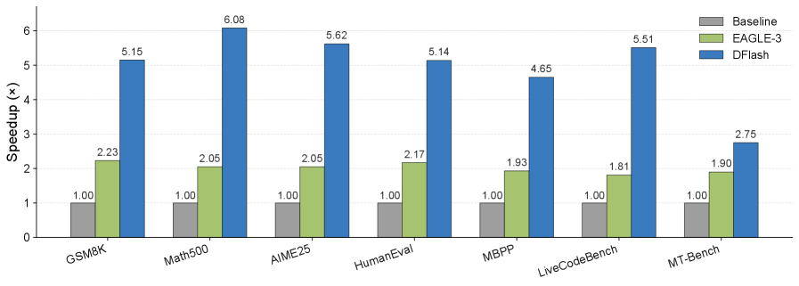
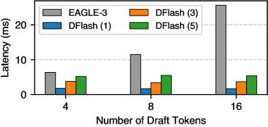
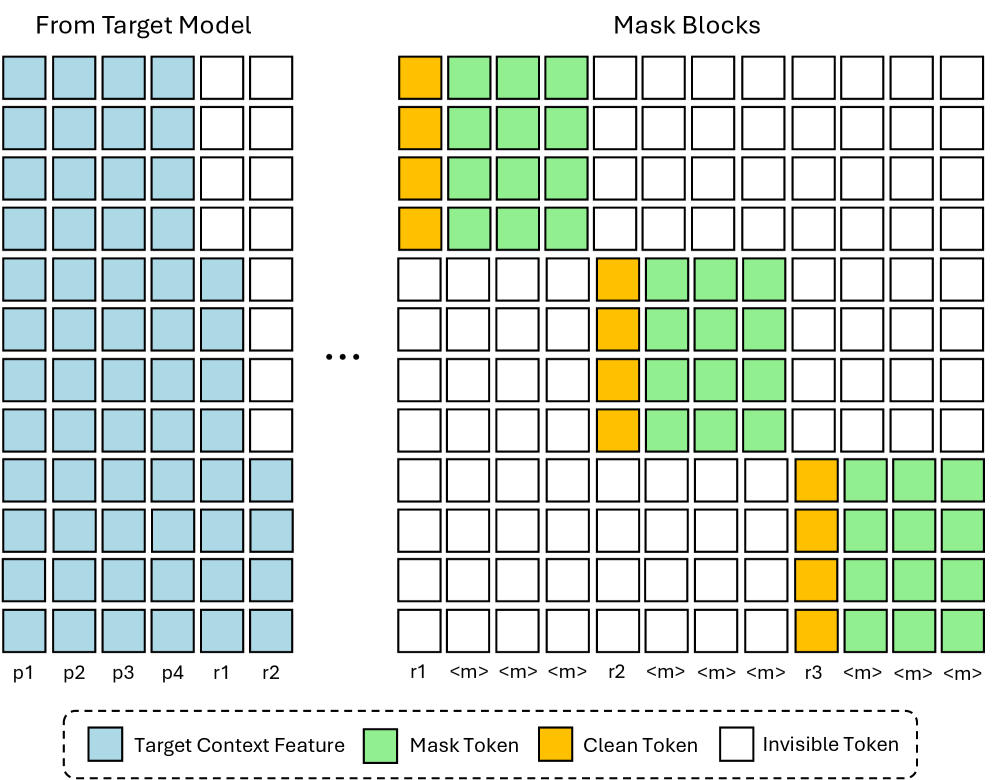
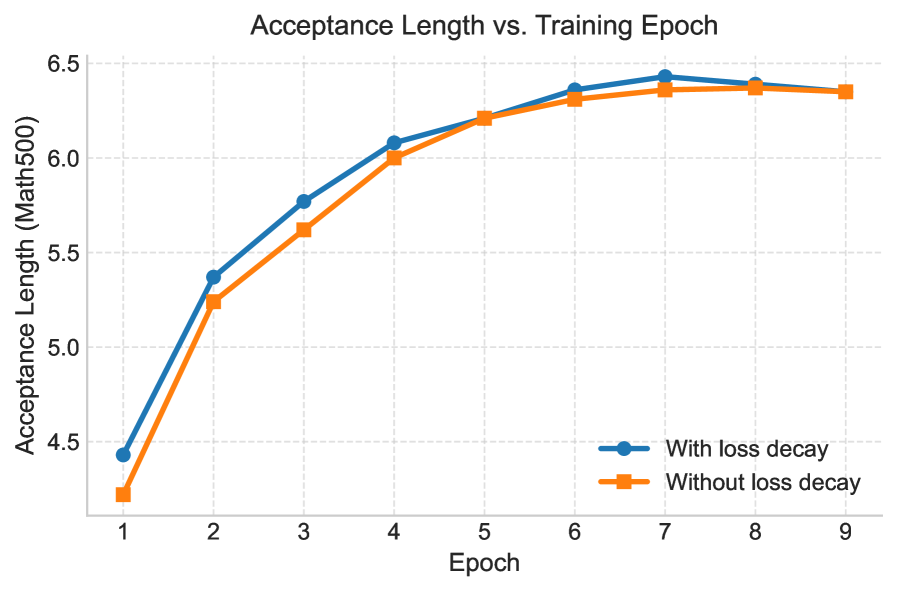

# DFlash: Block Diffusion for Flash Speculative Decoding

**Authors:** Jian Chen, Yesheng Liang, Zhijian Liu (UC San Diego / Z Lab)
**Date:** February 5, 2026
**Link:** [arxiv.org/abs/2602.06036](https://arxiv.org/abs/2602.06036)
**Project Page:** [z-lab.ai/projects/dflash](https://z-lab.ai/projects/dflash)
**Code:** [github.com/z-lab/dflash](https://github.com/z-lab/dflash) (1,366 GitHub stars)
**Models:** [huggingface.co/collections/z-lab/dflash](https://hf.co/collections/z-lab/dflash)

---

## TL;DR

DFlash replaces the autoregressive draft model in speculative decoding with a lightweight block diffusion model that generates all draft tokens in a single forward pass. The draft model is conditioned on hidden features extracted from the target LLM, injected directly into every draft layer's KV cache. This achieves over 6x lossless speedup on Qwen3-8B and up to 2.5x faster than EAGLE-3, the previous state-of-the-art speculative decoding method.

---

## Key Figures

### Figure 1: Speedup Comparison (Qwen3-8B)

End-to-end speedup of DFlash vs. EAGLE-3 vs. autoregressive baseline on Qwen3-8B across seven benchmarks (Transformers backend). DFlash achieves 5.15x on GSM8K, 6.08x on MATH-500, 5.62x on AIME25, 5.14x on HumanEval, 4.65x on MBPP, 5.51x on LiveCodeBench, and 2.75x on MT-Bench. EAGLE-3 maxes out around 2.0-2.2x. The gap is largest on math and code benchmarks where token patterns are more predictable.

### Figure 2: DFlash Inference Architecture

The core design. The target model processes the prompt and produces the first token. Hidden representations from multiple layers of the target model are extracted, concatenated, and projected into a compact "target context feature." This feature is injected into the KV cache of every draft layer. The draft model then takes mask tokens as input and predicts an entire block of tokens in a single forward pass via bidirectional attention. The output goes through the target model's shared LM head for speculative decoding verification.

### Figure 3: Draft Cost Latency Comparison

Drafting latency (ms) for EAGLE-3 (1-layer, autoregressive) vs. DFlash at 1, 3, and 5 layers. At 16 draft tokens, EAGLE-3 takes ~25ms because it must run 16 sequential forward passes. A 5-layer DFlash takes ~5ms because it generates all 16 tokens in one parallel pass. Even with 5x more layers, DFlash is 5x faster at drafting. This is the fundamental advantage: diffusion cost is O(1) in draft length, not O(gamma).

### Figure 4: Training Attention Mask Design

The training-time attention pattern. Left: target context features (blue) from the full clean sequence. Right: multiple masked blocks constructed by randomly sampling anchor tokens (yellow) from the response. Mask tokens (green) mark positions the model must predict. Invisible tokens (white) enforce block isolation -- tokens can attend bidirectionally within their block and to corresponding target context features, but not across blocks. This allows multiple blocks to be trained in a single forward-backward pass using Flex Attention.

### Figure 5: Loss Decay Effect on Convergence

Acceptance length on MATH-500 over training epochs with and without the exponential loss decay. With decay, the model converges faster (reaching ~6.4 acceptance length by epoch 7 vs. ~6.35 at epoch 8 without). The decay weights emphasize earlier positions in a draft block, which matter more because errors at early positions invalidate all subsequent tokens.

---

## Key Novel Ideas

### 1. Diffusion Drafting Instead of Autoregressive Drafting

The core insight: autoregressive drafters must generate tokens one-by-one, so drafting cost grows linearly with the number of draft tokens (T_draft = gamma * t_step). Diffusion drafters generate all gamma tokens in parallel in a single forward pass (T_draft = t_parallel), where t_parallel is largely insensitive to gamma. This decouples draft quality from draft latency.

This means diffusion drafters can use deeper, more expressive architectures (5-8 layers) without paying the latency penalty that would make autoregressive drafters impractical. EAGLE-3 is limited to a single transformer layer because each added layer multiplies latency by gamma.

### 2. KV Injection Conditioning (Not Input Fusion)

Previous methods like EAGLE-3 fuse target model features with draft token embeddings and feed them as **inputs** to the draft model. As the draft model gets deeper, this conditioning signal gets diluted through successive layers.

DFlash injects the target context features directly into the **Key and Value projections of every draft layer's attention**. The features are stored in the draft model's KV cache and reused across iterations. This provides persistent, undiluted conditioning at every layer, enabling acceptance length to scale with depth.

The target context feature is constructed by:
1. Extracting hidden representations from 5 uniformly-spaced layers of the target model (from 2nd layer to 3rd-to-last)
2. Concatenating these hidden states
3. Passing through a lightweight projection layer to fuse cross-layer information

### 3. Random Anchor Sampling for Training

Standard block diffusion training divides the response into fixed blocks and masks random positions. DFlash instead randomly samples "anchor tokens" from the response, uses each as the first position of a block, and masks the remaining block_size - 1 positions.

This directly matches inference behavior: at inference time, the draft model always conditions on a clean token (the bonus token from the previous verification step). Randomizing anchor positions also provides data augmentation -- the model sees more diverse target context features across epochs.

Ablation shows this boosts acceptance length from 4.94 to 5.64 on MATH-500 (Table 9).

### 4. Exponential Loss Decay

Not all token positions within a draft block are equally important. An error at position k invalidates all subsequent positions k+1, k+2, ..., making early positions disproportionately valuable. DFlash weights the cross-entropy loss with:

**w_k = exp(-(k-1) / gamma)**

where gamma controls the decay rate (set to 7 for block size 16, 5 for block size 10, 4 for block size 8). This prioritizes early-position accuracy, accelerating convergence and improving final acceptance length.

### 5. Shared Embedding and LM Head

The draft model shares the token embedding layer and language modeling head with the frozen target model. Only the draft transformer layers are trained. This reduces trainable parameters and keeps the draft model tightly aligned with the target model's representation space. The draft model effectively becomes a "diffusion adapter."

---

## Architecture Details

### Draft Model Configuration
- **Layers:** 5 (default), 8 for Qwen3-Coder. Acceptance length scales with depth but 5 layers gives best speed-quality tradeoff.
- **Block size:** 16 (default), 10 for LLaMA-3.1. All tokens in a block are predicted in one forward pass.
- **Target features:** Hidden states from 5 uniformly-sampled layers of the target model, fused via a lightweight projection.
- **Attention:** Bidirectional within each block. KV cache stores injected target context features.
- **Shared components:** Token embedding + LM head from target model (frozen).
- **Trainable components:** Only the draft transformer layers.

### Inference Pipeline
1. Target model processes prompt (standard prefill), extracts hidden features from selected layers.
2. Hidden features are projected and injected into draft model KV cache.
3. Draft model takes mask tokens + the last verified token as input.
4. Single forward pass through bidirectional attention produces all gamma draft tokens.
5. Target model verifies draft tokens in parallel (standard speculative decoding verification).
6. Accepted tokens are output; process repeats from the first rejected position.

### Why It Works Fundamentally
The speedup formula is:

**eta = L_target / L = L_target * tau / (T_draft + T_verify)**

DFlash wins on both terms:
- **Lower T_draft:** Parallel diffusion (t_parallel) vs. sequential autoregressive (gamma * t_step). At 16 tokens, DFlash (5 layers) is ~5x faster than EAGLE-3 (1 layer) at drafting.
- **Higher tau:** Deeper draft model + KV injection conditioning yields higher acceptance length. DFlash gets tau ~6.5 vs. EAGLE-3's ~3.0-3.5.

---

## Training Pipeline

1. **Data Collection:** ~800K samples from NVIDIA Nemotron Post-Training Dataset V2 + CodeAlpaca. Responses are regenerated by the target model for better alignment.
2. **Feature Extraction:** Pass each clean sequence through the frozen target model. Extract hidden states from 5 uniformly-spaced layers. These can be precomputed offline or computed on-the-fly.
3. **Block Construction:** Randomly sample anchor positions from the response. For each anchor, create a block of size block_size with the anchor as position 0 and mask tokens at positions 1 through block_size-1.
4. **Training:** Cross-entropy loss on masked positions with exponential position-dependent decay weights. Multiple blocks concatenated per sequence with Flex Attention for efficiency.
5. **Optimization:** AdamW, LR 6e-4, gradient clipping 1.0, cosine schedule with 0.04 warmup ratio, 6 epochs. Max sequence length 3072 tokens (4096 for Coder). 512 anchor positions randomly sampled per sequence.
6. **Offline vs. Online:** Offline training precomputes and caches target features (faster training but more storage). Online computes features each step (slower but no storage overhead).

---

## Key Results

### Table 1: Qwen3 Instruct Models (Transformers Backend, Temp=0)

| Model | Method | GSM8K | MATH-500 | AIME25 | HumanEval | MBPP | LCB | MT-Bench | **Avg Speedup** | **Avg tau** |
|-------|--------|-------|----------|--------|-----------|------|-----|----------|-------------|---------|
| Q3-4B | EAGLE-3 (16) | 1.99x | 1.83x | 1.79x | 1.84x | 1.78x | 1.73x | 1.74x | **1.81x** | 3.05 |
| Q3-4B | EAGLE-3 (60) | 2.27x | 2.10x | 2.13x | 2.12x | 2.02x | 1.90x | 2.04x | **2.08x** | 3.48 |
| Q3-4B | **DFlash (16)** | 5.15x | 6.09x | 5.68x | 5.21x | 4.78x | 5.41x | 2.85x | **4.91x** | 6.54 |
| Q3-8B | EAGLE-3 (16) | 1.94x | 1.81x | 1.79x | 1.89x | 1.69x | 1.57x | 1.63x | **1.76x** | 2.96 |
| Q3-8B | EAGLE-3 (60) | 2.23x | 2.05x | 2.05x | 2.17x | 1.93x | 1.81x | 1.90x | **2.02x** | 3.40 |
| Q3-8B | **DFlash (16)** | 5.15x | 6.08x | 5.62x | 5.14x | 4.65x | 5.51x | 2.75x | **4.86x** | 6.49 |

DFlash achieves **2.4x higher speedup than EAGLE-3 (16)** and still beats EAGLE-3 (60) which uses 60-token draft trees with much higher verification cost.

### Table 2: Reasoning Models (Thinking Mode Enabled)

| Model | Temp | GPQA | MATH-500 | AIME25 |
|-------|------|------|----------|--------|
| Q3-4B | 0 | 4.23x (tau=5.23) | 4.59x (tau=5.74) | 4.39x (tau=5.54) |
| Q3-8B | 0 | 4.17x (tau=5.17) | 4.64x (tau=5.82) | 4.51x (tau=5.74) |

Reasoning models maintain high speedups (~4.5x), which is especially valuable given their long generation times.

### Table 3: SGLang Performance (B200 GPU, FA4 Backend)

| Model | Task | Concurrency 1 | Concurrency 8 | Concurrency 32 | Avg tau |
|-------|------|---------------|---------------|-----------------|---------|
| Q3-4B | Math500 | 4.8x | 4.1x | 2.9x | 8.01 |
| Q3-8B | Math500 | **5.1x** | 4.5x | 2.8x | 8.01 |
| Q3-Coder-30B-A3B | HumanEval | 3.5x | 3.2x | 3.1x | 8.09 |

Speedups decrease at higher concurrency (as expected -- GPU becomes compute-bound), but remain substantial even at concurrency 32.

### Table 4: LLaMA-3.1-8B-Instruct (SGLang, Same Training Data as EAGLE-3)

| Method | GSM8K (c=1) | HumanEval (c=1) | Alpaca (c=1) | Avg tau |
|--------|-------------|------------------|--------------|---------|
| EAGLE-3 (10) | 1.6x | 2.0x | 1.5x | 3.49/3.62/3.11 |
| EAGLE-3 (60) | 1.9x | 2.0x | 1.8x | 4.55/4.65/4.07 |
| **DFlash (10)** | **2.4x** | **2.8x** | **2.2x** | 4.32/4.91/3.73 |

On the same training data, DFlash consistently outperforms EAGLE-3 at all concurrency levels. Notably, EAGLE-3 (60) actually **slows down below baseline** at high concurrency (0.5-0.6x at c=32), while DFlash maintains positive speedups (1.4-1.8x).

### Key Ablation Results

| Ablation | Finding |
|----------|---------|
| **Draft layers** (3 vs 5 vs 8) | 5-layer gives best speedup (4.71x); 8-layer has higher tau (6.33) but higher latency |
| **Target features** (3 vs 5 layers) | 5 features consistently better (5.64 vs 5.38 tau on MATH-500) |
| **Block size mismatch** | Models trained at block 16 generalize well to block 8 at inference. Reverse does NOT hold. |
| **Random anchor sampling** | +14% acceptance length vs. standard block division (5.64 vs 4.94 on MATH-500) |
| **Without target features** | Only 2.83-3.73x speedup (vs. 5.15-6.08x with features). Target conditioning is essential. |
| **Loss decay** | Faster convergence and ~0.1 higher final acceptance length |

---

## Key Takeaways

1. **Diffusion models found their niche.** Standalone diffusion LLMs underperform autoregressive models, but as lightweight speculative drafters they outperform all alternatives. The speculative verification guarantee makes draft quality degradation acceptable.

2. **Parallel drafting cost is O(1) in draft length.** This is the fundamental unlock. A 5-layer DFlash generating 16 tokens takes ~5ms. A 1-layer EAGLE-3 generating 16 tokens takes ~25ms. Parallelism beats depth reduction.

3. **KV injection > input fusion for conditioning.** Injecting target features into every layer's KV cache keeps conditioning strong at every depth. Input fusion (EAGLE-3 style) dilutes with depth, capping acceptance length gains from deeper drafters.

4. **The target model already knows the future.** Hidden features from LLM intermediate layers implicitly encode multi-token predictions. DFlash leverages this by treating the drafter as an adapter that "reads" these features, not a standalone predictor.

5. **6x lossless acceleration is a practical milestone.** On production frameworks (SGLang on B200), DFlash achieves 5.1x speedup at concurrency 1. This directly translates to cost savings for reasoning model serving.

6. **Block size generalization is asymmetric.** Train large (block 16), infer small (block 8) works. Train small, infer large does NOT. This enables dynamic block-size scheduling at serving time.

7. **EAGLE-3 degrades at high concurrency.** At concurrency 32, EAGLE-3 (60) drops below baseline (0.5-0.6x) because its tree-based verification is expensive under compute pressure. DFlash maintains 1.4-2.9x even at concurrency 32.

8. **Reasoning models benefit disproportionately.** Long chain-of-thought generation (thinking mode) sees ~4.5x speedup, which matters most where latency is worst.

9. **Training is efficient.** ~800K samples, 6 epochs, shared embeddings, offline feature caching. No costly training-time test like EAGLE-3. Random anchor sampling provides natural data augmentation.

10. **New paradigm for diffusion LLMs.** Instead of competing with autoregressive models end-to-end, diffusion models serve as specialized drafters. Aggressive denoising step reduction (single step!) is fine because verification guarantees quality.

---

## What's Open-Sourced

- **Code:** [github.com/z-lab/dflash](https://github.com/z-lab/dflash) -- Full training and inference code
- **Models:** [huggingface.co/collections/z-lab/dflash](https://hf.co/collections/z-lab/dflash) -- Pretrained draft models for Qwen3-4B, Qwen3-8B, Qwen3-Coder-30B-A3B, and LLaMA-3.1-8B-Instruct
- **SGLang Integration:** Production-grade integration with SGLang inference framework, supporting Spec-v2 scheduling overlap
