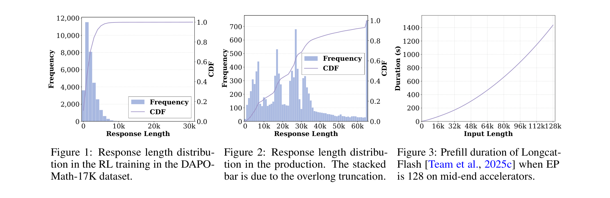
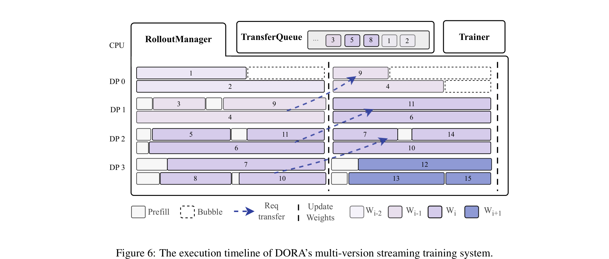
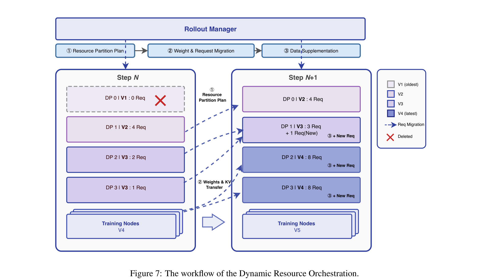
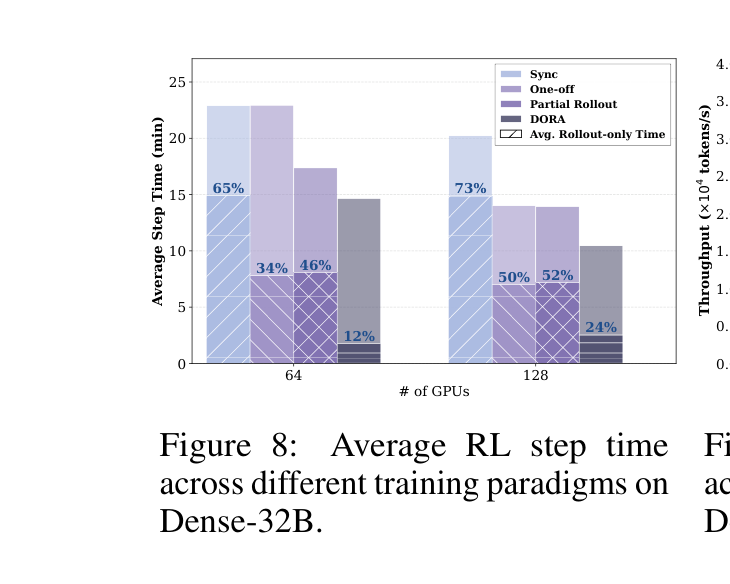
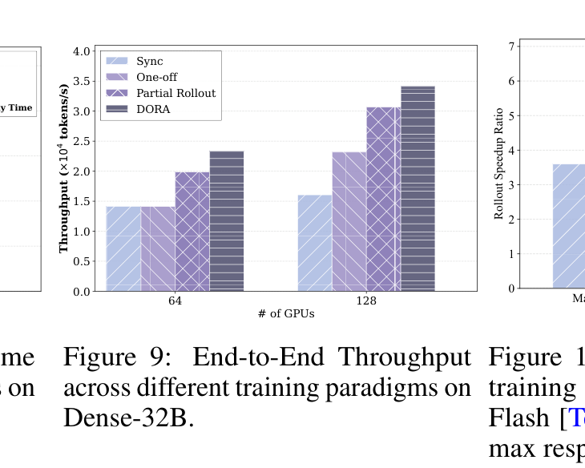
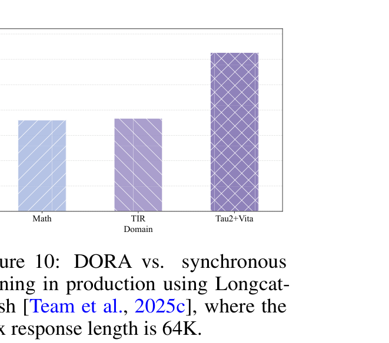
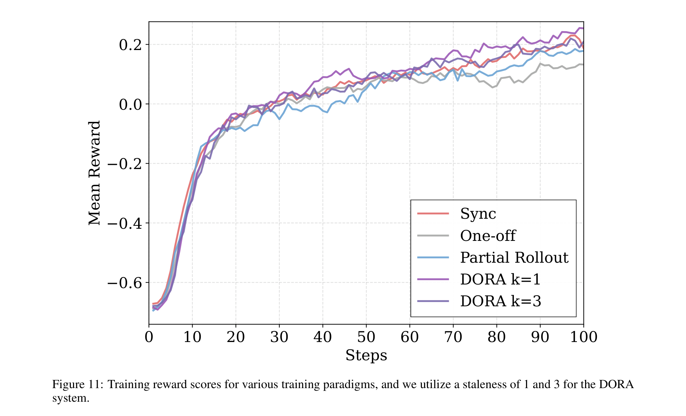

# DORA: A Scalable Asynchronous Reinforcement Learning System for Language Model Training

**Authors:** Tianhao Hu, Xiangcheng Liu, Youshao Xiao, Yang Zheng, Xuan Huang, Jinrui Ding, Yufei Zhang, Tao Liang, Hongyu Zang, Quan Chen, Yueqing Sun, Wenjie Shi, Chao Zhang, Wei Wang, Qi Gu, Yerui Sun, Yucheng Xie, Xunliang Cai (Meituan / LongCat)
**Date:** April 29, 2026
**Paper:** [arXiv:2604.26256](https://arxiv.org/abs/2604.26256)

---

## TL;DR

DORA is a systems paper that solves the biggest efficiency bottleneck in RL training for LLMs: the rollout phase (trajectory generation), which takes 50–80% of total step time. The core problem is *skewed generation* — long-tailed outputs block the entire batch. DORA introduces **multi-version streaming training**, where multiple policy versions run concurrently on rollout instances so long-tailed trajectories don't block training from starting. A dynamic load-balancing orchestrator reshuffles resources across versions, and a KV-Cache reuse trick avoids expensive re-prefilling when migrating requests. Result: **2.12× end-to-end throughput** on open benchmarks and **6.2× rollout speedup** in production on thousands of accelerators — with no convergence degradation.

---

## Key Figures

### Fig. 1–3: The Skewed Generation Problem

The root cause DORA addresses. Left: response lengths in DAPO-Math-17K follow a heavy-tailed distribution — the 99th percentile exceeds the median by 10×+. Center: production distribution is even more skewed (note the long bar at the truncation limit). Right: prefill duration grows super-linearly with input length on LongCat-Flash at EP=128, reaching 1400 seconds at 128K tokens. Together, these show why synchronous RL training is dominated by its longest output: everyone waits for the straggler.

### Fig. 6: DORA System Architecture — Multi-Version Streaming Timeline

The key system diagram. Four DP groups (DP0–DP3) run rollout concurrently. Color shading indicates the policy version (W_{i-2} through W_{i+1}). The critical insight: when training completes a step and pushes new weights, **unfinished long-tailed trajectories (e.g., Trajectory 4, 7) keep running under their original policy version** on dedicated DP groups. Meanwhile, new prompts dispatch under the latest version on other DP groups. The `TransferQueue` streams completed trajectories to the Trainer as they finish, without waiting for stragglers. Dashed arrows show request migration when the Load-Balancing Orchestrator re-partitions resources.

### Fig. 7: Dynamic Resource Orchestration Workflow

When a training step completes (Step N → N+1), the orchestrator executes three operations: (1) **Resource Partition Plan** — reallocates DP groups proportionally to each version's pending request count (here V1 has 0 requests so DP0 is reassigned), (2) **Weight & KV Transfer** — P2P weight transfer to reassigned DP groups with KV-Cache migration to avoid re-prefill, (3) **New Request Injection** — fill the latest version's capacity with fresh prompts. This keeps all GPUs saturated while respecting staleness bounds.

### Fig. 8: Average RL Step Time Comparison

DORA (k=3) achieves 14.67 min per step on 64 GPUs vs. 22.91 min for synchronous — a **1.56× speedup**. The stacked bars show rollout-only time as a percentage: 65% for synchronous, 46% for partial rollout, **12% for DORA**. At 128 GPUs, DORA's rollout-only fraction drops to 24%, achieving **1.93× speedup** over synchronous. The key: long-tailed trajectories no longer block the batch.

### Fig. 9: End-to-End Throughput

Token-level throughput (tokens/s). On 64 GPUs, DORA reaches **23,327 tokens/s** — 1.65× over synchronous (14,143) and 1.17× over partial rollout (19,872). On 128 GPUs: **34,135 tokens/s**, a **2.12× improvement** over synchronous. DORA scales well: throughput increases 1.46× from 64→128 GPUs, while synchronous scales only 1.13×.

### Fig. 10: Production MoE Speedup

On the production 560B MoE model (LongCat-Flash) across 4,096 accelerators with 64K max output tokens, DORA achieves **3.6× rollout speedup** in math and tool-integrated reasoning, and **6.2× in agentic scenarios** (Tau2-bench, Vita). Agentic workloads have the most extreme tail distributions, so they benefit most from DORA's streaming approach.

### Fig. 11: Convergence Parity

The crucial validation: DORA matches synchronous training's convergence. Both DORA k=1 (strict, 1-step staleness) and k=3 (relaxed, 3-step staleness) follow essentially the same reward trajectory as the synchronous baseline over 100 training steps. Partial rollout and one-off also converge but are slower per step. k=3 converges moderately slower per-step than k=1 (the throughput-convergence tradeoff), but both reach the same final reward.

---

## Key Novel Ideas

### 1. Three Algorithmic Constraints for Asynchronous RL

DORA formalizes what it takes for asynchronous RL training to converge correctly. Previous work made ad-hoc tradeoffs; DORA names the constraints explicitly:

- **C1: Intra-trajectory policy consistency.** Every token in a trajectory must be generated by the same policy version. If you switch policies mid-trajectory, the importance ratio `r_{i,t}` in GRPO/PPO becomes undefined — the numerator and denominator reference different behavior policies.
- **C2: Data integrity.** All G responses per prompt must make it to training — you cannot discard long-tailed trajectories. Long CoT outputs are precisely the ones that carry emergent reasoning capabilities; dropping them biases the gradient.
- **C3: Bounded staleness.** The version gap between the generating policy and the current training policy must be bounded by K. Classical theorems in asynchronous optimization prove that unbounded staleness destroys convergence.

Previous approaches sacrifice different constraints: replication-based methods violate C2 (discard excess), partial-rollout methods violate C1 (switch policy mid-trajectory), one-step off-policy satisfies all but doesn't eliminate bubbles. **DORA is the first to satisfy all three while eliminating both intra-node and inter-node bubbles.**

### 2. Multi-Version Streaming Training

Instead of blocking the entire training loop until all rollouts for a step complete, DORA lets **multiple policy versions coexist on rollout instances simultaneously**. Each prompt is tagged with its version upon dispatch. When training finishes a step and pushes new weights, unfinished trajectories keep running under their original version on dedicated DP groups — they don't block the next step.

A **sliding window** of size ≤ K keeps active versions bounded. The window advances only when all trajectories from the oldest version have been collected and consumed for training. This mechanically enforces C3.

The streaming design means completed trajectories flow into a `TransferQueue` continuously, and the Trainer consumes TBS (training batch size) samples as soon as they're available. No synchronous barrier.

### 3. Zero-Re-Prefill KV-Cache Reuse

This is the paper's cleverest algorithmic-systems co-design insight. The observation:

> Because C1 guarantees that all tokens in a trajectory come from the same policy version `w`, the KV-Cache states are **mathematically equivalent** across any physical instance hosting version `w`.

So when the orchestrator migrates a request from one DP group to another (both hosting the same version), it can transfer the KV-Cache directly — no re-prefill needed. This is huge for long-context scenarios: re-prefilling a 128K-token input on MoE architecture can take over 1,400 seconds (Fig. 3). Methods that relax C1 (partial rollout) forfeit this optimization entirely, because mid-trajectory policy switches invalidate the cached states.

The migration is a two-phase process: (1) lightweight RPC forwards request metadata, (2) high-performance collective primitives transfer the KV-Cache (often gigabytes for long contexts).

### 4. Dynamic Load-Balancing Orchestrator

The orchestrator addresses a second-order problem created by multi-version streaming: **resource fragmentation**. As older versions' trajectories complete, the DP groups assigned to them become underutilized, while the newest version may be resource-starved.

Three coordinated operations (Algorithm 1):

1. **Proportional Resource Partitioning:** `DP_w = Round(DP_total × R_w / Σ R_{w'})` — allocate DP groups proportional to each version's active request count. Versions with few remaining requests lose groups; the latest version gains them.

2. **P2P Weight + Request Migration:** When a DP group is reassigned, P2P weight transfer loads the new version, and active requests migrate with their KV-Cache intact (zero re-prefill).

3. **Staleness-Aware Data Supplementation:** New prompts are injected preferentially into the latest version to keep sample freshness high. Legacy versions are backfilled only to saturate idle slots — never over-provisioned.

Three triggers: update-driven (every training step), utilization-based (when KV-Cache pressure spikes), temporal-based (periodic cleanup of orphan requests in legacy versions).

---

## Architecture Details

| Component | Details |
|---|---|
| System architecture | Disaggregated (rollout instances separate from training actors), extensible to colocated |
| RL algorithm | DAPO (GRPO variant), PPO-compatible |
| Rollout engine | vLLM with KV-cache management, paged attention |
| Training engine | Megatron-LM |
| Communication | Torch RPC (control plane), P2P collective primitives (KV-Cache transfer), NCCL 2.28 |
| Model placement | Multi-version: each DP group hosts a single policy version; groups can be reassigned dynamically |
| Staleness control | Sliding window of size K over active policy versions |
| Software stack | CUDA 12.4, PyTorch 2.6.0, vLLM 0.8.5 |

---

## Training Pipeline

**The RL loop with DORA works as follows:**

1. **Dispatch:** The `RolloutManager` dispatches RBS > TBS prompts to rollout instances, tagging each with the current policy version. Over-provisioning ensures training data is ready before rollout completes.

2. **Streaming generation:** Rollout instances generate trajectories using the assigned policy version. Completed trajectories stream into the `TransferQueue` immediately — no waiting for the entire batch.

3. **Non-blocking training:** The `Trainer` consumes TBS samples from the queue as soon as they're available. It runs experience preparation (reward computation, advantage estimation via GRPO) and model training (16 update steps with micro-batch size 512).

4. **Weight synchronization:** After training completes, new weights are pushed to rollout instances. Only at this point does the `RolloutManager` advance the policy version for new dispatches.

5. **Legacy version cleanup:** Unfinished long-tailed trajectories continue generating under their original version. The orchestrator dynamically shrinks their resource allocation as they complete.

6. **Window advancement:** The staleness window slides forward only when all trajectories from the oldest active version have been collected and consumed.

**Experimental configuration:** Prompt batch size 512, 16 responses per prompt → global training batch size 8,192. DAPO-Math-17K dataset, max input 2K tokens, max output 30K tokens. Evaluated on Qwen2.5-32B (dense) and LongCat-Flash (560B MoE).

---

## Key Results

### Open-source benchmark (Qwen2.5-32B, DAPO-Math-17K)

| Paradigm | 64 GPUs Step Time | 128 GPUs Step Time | 64 GPUs Throughput | 128 GPUs Throughput | Satisfies C1–C3 |
|---|---|---|---|---|---|
| Synchronous | 22.91 min | 20.23 min | 14,143 tok/s | 16,070 tok/s | Yes |
| One-step off-policy | 22.94 min | 20.23 min | 14,141 tok/s | 23,290 tok/s | Yes (K=1) |
| Partial rollout | 17.38 min | 13.95 min | 19,872 tok/s | 30,683 tok/s | No (violates C1) |
| **DORA (k=3)** | **14.67 min** | **10.46 min** | **23,327 tok/s** | **34,135 tok/s** | **Yes** |

### Rollout-phase speedup

| Scale | DORA vs Synchronous | DORA vs Partial Rollout |
|---|---|---|
| 64 GPUs | **8.2× rollout speedup** | 4.4× |
| 128 GPUs | **5.9× rollout speedup** | 2.9× |

### Production MoE (LongCat-Flash 560B, 4,096 accelerators)

| Domain | DORA Rollout Speedup vs Synchronous |
|---|---|
| Math | 3.6× |
| Tool-Integrated Reasoning (TIR) | 3.6× |
| Agentic (Tau2-bench + Vita) | **6.2×** |

### System overhead (% of total training time)

| Component | 64 GPUs | 128 GPUs |
|---|---|---|
| Load-Balancing orchestration | 0.414% | 1.519% |
| Request + KV-Cache transfer | 3.627% | 2.123% |
| Memory management (free cache) | 0.019% | 0.027% |
| **Total overhead** | **~4.1%** | **~3.7%** |

### Convergence (100 training steps on 72 GPUs)

Both DORA k=1 and k=3 match the synchronous baseline's final reward. k=3 converges moderately slower *per step* but substantially faster *per wall-clock minute* due to the throughput gain.

---

## Key Takeaways

1. **The rollout phase is the bottleneck, and it's skewed.** Rollout accounts for 50–80% of total RL step time. The 99th-percentile output length can exceed the median by 10×+. In synchronous training, the entire batch waits for the single longest output. This is the core problem.

2. **You need all three constraints (C1, C2, C3) simultaneously.** Previous async methods each sacrifice one: replication drops long outputs (violates C2), partial rollout switches policy mid-trajectory (violates C1), one-step off-policy doesn't eliminate bubbles. DORA is the first to satisfy all three while achieving full bubble elimination.

3. **Multi-version streaming is the key insight.** By letting multiple policy versions coexist on rollout instances, long-tailed trajectories from an old version can finish without blocking training on the new version. The sliding window bounds staleness.

4. **C1 (intra-trajectory consistency) is not just algorithmic — it's a system-level enabler.** Beyond correctness, C1 means KV-Cache states are mathematically equivalent across same-version instances. This enables zero-cost KV-Cache migration during request transfers, which is critical for long-context and MoE workloads where re-prefilling costs 100s–1000s of seconds.

5. **Dynamic orchestration is necessary.** Static resource partitioning across versions leads to fragmentation — old versions with few remaining requests waste their DP groups. Proportional re-partitioning keeps utilization high. The overhead is <2% even at 128 GPUs.

6. **MoE architectures exacerbate the problem.** Expert-parallelism creates workload imbalance in non-MoE layers (Fig. 5), and re-prefill costs are amplified. DORA's production deployment on 560B MoE with EP=128 shows the problem is real at scale and the solution works.

7. **The agentic scenario benefits most.** Agentic workloads (tool use, multi-turn reasoning) have the most extreme tail distributions, yielding 6.2× rollout speedup vs. 3.6× for math. As RL training moves toward agentic and long-context tasks, the skewed-generation problem will worsen and DORA-style solutions become more important.

8. **Scalability is real.** DORA's throughput increases 1.46× from 64→128 GPUs, while synchronous training scales only 1.13×. This is because synchronous training is memory-bound (the straggler problem doesn't improve with more GPUs), while DORA converts the bottleneck from memory-bound generation to compute-bound training.

9. **Convergence parity holds with moderate staleness.** k=3 (up to 3-step staleness) converges nearly identically to k=1, confirming that PPO/GRPO's clipping mechanism provides natural robustness to bounded off-policy data. The staleness bound K is the explicit knob for the throughput–convergence tradeoff.

10. **DORA is in production.** This isn't just a research system — it's been Meituan's default RL training framework since 2025, running on tens of thousands of accelerators for LongCat-series models. The resulting LongCat-Flash-Thinking models achieve competitive performance on complex reasoning benchmarks.

---

## What's Open-Sourced

- **Models:** LongCat-Flash-Thinking, the open-source reasoning models trained with DORA, are available (cited via arXiv:2509.18883, arXiv:2509.01322, arXiv:2601.16725).
- **System:** DORA itself is **not open-sourced** as of the paper's publication. The paper describes the system in sufficient detail for reproduction but does not release code.
- **Baselines:** All baselines were implemented within Meituan's in-house framework. The paper acknowledges not benchmarking against publicly available systems like veRL or AReaL.
