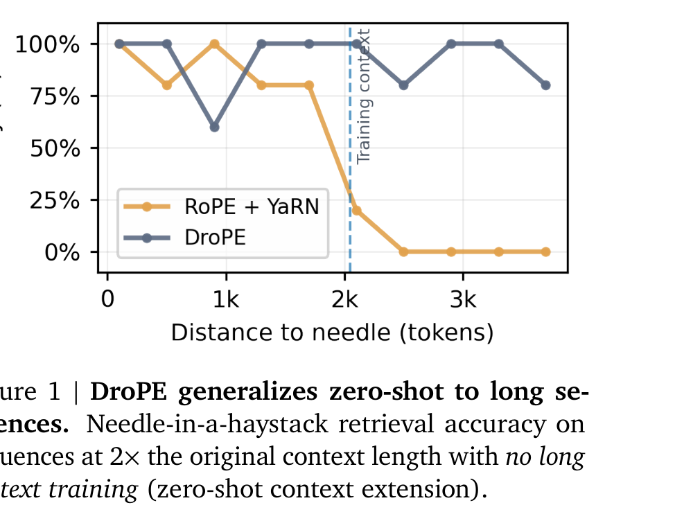
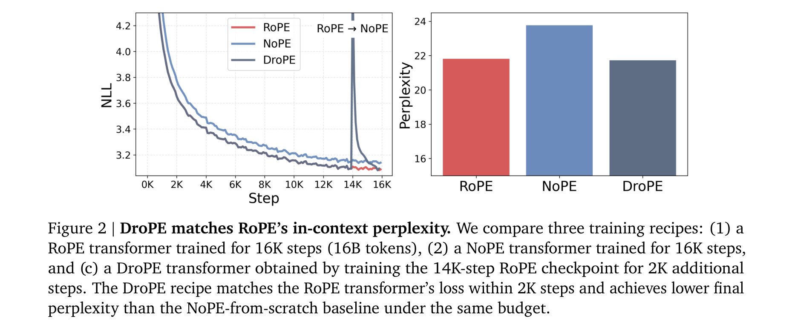
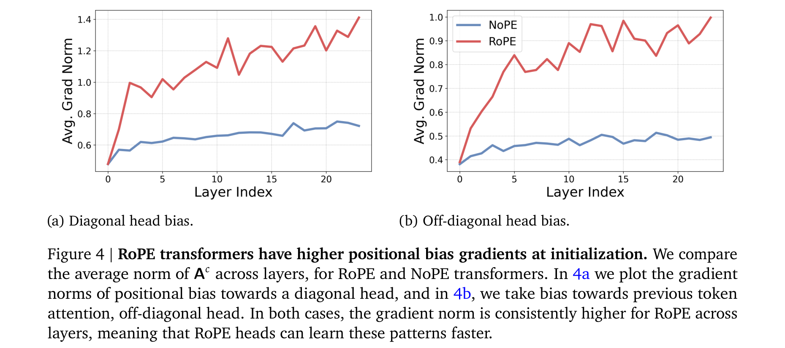
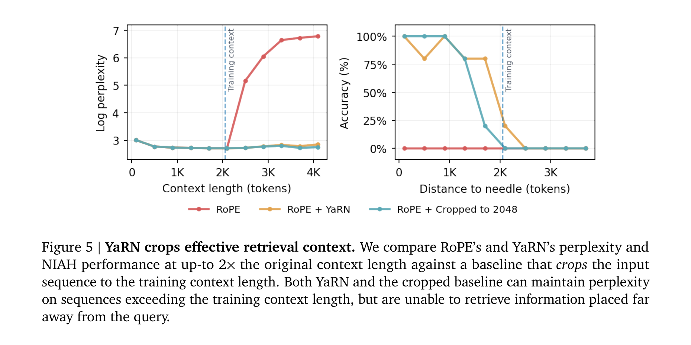
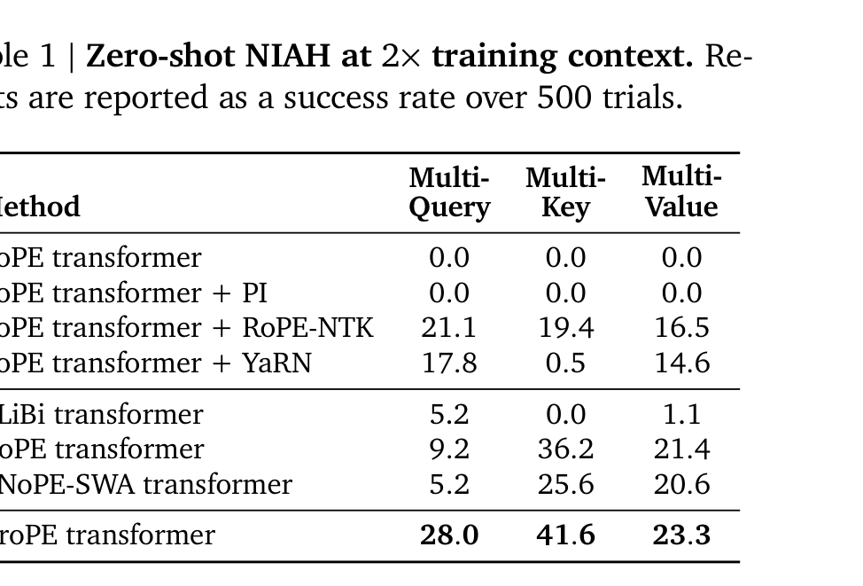
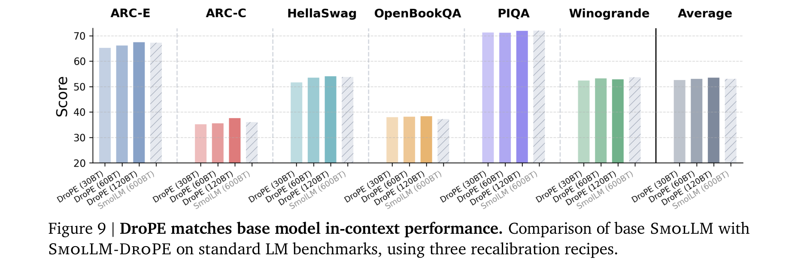
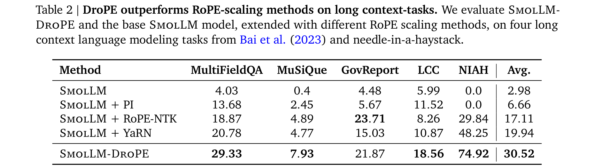
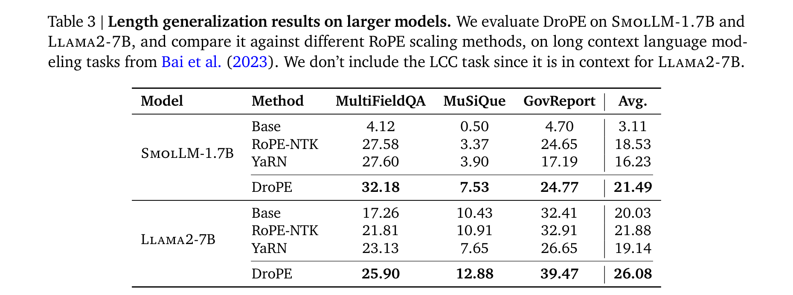

# Extending the Context of Pretrained LLMs by Dropping Their Positional Embeddings

**Authors:** Yoav Gelberg, Koshi Eguchi, Takuya Akiba, Edoardo Cetin
**Affiliations:** Sakana AI, University of Oxford
**Date:** December 13, 2025
**Paper:** [PDF](https://arxiv.org/abs/2512.12167)

---

## TL;DR

DroPE (Dropping Positional Embeddings) is a simple method that removes RoPE positional embeddings from pretrained LLMs after training, followed by a short recalibration phase at the original context length. This enables **zero-shot context extension** — the model generalizes to sequences far beyond its training length without any long-context finetuning. DroPE outperforms all RoPE-scaling methods (PI, RoPE-NTK, YaRN) on needle-in-a-haystack and long-context benchmarks, while preserving in-context performance. It scales from 360M to 7B parameter models pretrained on up to 4 trillion tokens.

---

## Key Figures

### Figure 1: DroPE Generalizes Zero-Shot to Long Sequences

The headline result: on needle-in-a-haystack retrieval at 2x the training context, DroPE maintains ~80-100% accuracy at all distances including beyond the training context boundary. RoPE+YaRN drops to 0% once the needle is placed beyond the training context — it effectively just *crops* the retrieval window rather than extending it.

### Figure 2: DroPE Matches RoPE's In-Context Perplexity

Three training recipes compared: (1) RoPE for 16K steps, (2) NoPE for 16K steps, (3) DroPE (RoPE for 14K steps, then drop PE and recalibrate for 2K steps). DroPE matches RoPE's final in-context perplexity within just 2K recalibration steps, and achieves *lower* perplexity than training NoPE from scratch for the same total budget. This validates the "PE as temporary scaffold" thesis.

### Figure 4: RoPE Enables Faster Positional Bias Learning

At initialization, RoPE transformers have consistently higher gradient norms for attention positional bias compared to NoPE transformers, and the gap widens in deeper layers. This means RoPE heads can develop diagonal (current-token) and off-diagonal (previous-token) attention patterns faster — explaining why RoPE accelerates training convergence but NoPE eventually catches up.

### Figure 5: YaRN Merely Crops Effective Retrieval Context

A damning comparison: YaRN's zero-shot behavior at 2x context is indistinguishable from simply *cropping* the input to the training context length. Both maintain perplexity on longer sequences (left panel), but both completely fail to retrieve information placed far from the query (right panel). This demonstrates that RoPE-scaling methods achieve good perplexity by attending to recent tokens, not by genuinely extending context.

### Table 1: Zero-Shot NIAH at 2x Training Context

DroPE substantially outperforms all baselines on all three RULER NIAH variants (Multi-Query: 28.0, Multi-Key: 41.6, Multi-Value: 23.3). The base RoPE transformer and RoPE+PI score 0.0 on everything. Even specialized architectures like ALiBi (5.2/0.0/1.1) and RNoPE-SWA (5.2/25.6/20.6) lag significantly behind DroPE.

### Figure 9: DroPE Preserves In-Context Performance

SmolLM-DroPE matches the original SmolLM's in-context performance across all six standard LM benchmarks (ARC-E, ARC-C, HellaSwag, OpenBookQA, PIQA, Winogrande). Even the shortest 30B-token recalibration schedule nearly matches, while the 120B schedule slightly *exceeds* the original model's average score.

### Table 2: DroPE Outperforms RoPE-Scaling on Long-Context Tasks

On four LongBench tasks (problems up to 80x the training context), SmolLM-DroPE achieves 30.52 average score — far ahead of SmolLM+YaRN (19.94), SmolLM+RoPE-NTK (17.11), and the base SmolLM (2.98). The NIAH column is particularly striking: 74.92 for DroPE vs. 48.25 for YaRN.

### Table 3: Scaling to Billion-Parameter Models

DroPE scales cleanly to larger models. On SmolLM-1.7B (1T tokens pretraining), DroPE achieves 21.49 avg vs. YaRN's 16.23. On LLaMA2-7B (4T tokens pretraining), DroPE scores 26.08 avg vs. YaRN's 19.14. Recalibration requires only 2% and 0.5% of the original pretraining budget respectively.

---

## Key Novel Ideas

### 1. Positional Embeddings as Temporary Training Scaffolds
The core conceptual contribution: PEs serve a crucial role during training (accelerating convergence) but become a liability at inference time (preventing generalization to unseen lengths). DroPE resolves this by treating PEs as *temporary scaffolds* — use RoPE during pretraining for faster convergence, then remove it and recalibrate briefly. This reframes the role of PEs from a permanent architectural component to a transient optimization aid.

### 2. Three Observations That Motivate DroPE
The method is grounded in three formal observations:

- **Observation 1:** RoPE provides a strong inductive bias that accelerates convergence by enabling faster development of positional attention patterns. NoPE transformers develop these patterns at a *bounded rate* proportional to embedding uniformity at initialization (Theorem 3.4), while RoPE enables non-zero positional bias gradients even on constant input sequences (Proposition 3.3).

- **Observation 2:** RoPE-scaling methods *must* compress low frequencies to keep phases in-distribution. Low frequencies are used by *semantic* attention heads for long-range matching. Compressing them shifts semantic attention at large distances, causing downstream task failures even when perplexity looks fine. This is mathematically inevitable — not a fixable implementation detail.

- **Observation 3:** PEs can be safely removed after pretraining. The model's in-context capabilities are quickly recovered through a short recalibration at the original context length, while gaining zero-shot long-context generalization for free.

### 3. Why RoPE-Scaling Fundamentally Cannot Work Zero-Shot
The paper provides a compelling theoretical argument: in standard RoPE (base b=10,000, d_k=64), at least 5 low frequencies never complete a full cycle within the training context. At extended lengths, these phases go out of distribution. Any scaling method must set γ_m ≤ 1/s for these frequencies, which compresses the phase space and shifts attention weights at large relative distances. This isn't a bug — it's an inherent property of any post-hoc RoPE frequency modification.

### 4. Softmax Temperature Scaling for DroPE Inference
At inference on longer sequences, DroPE applies a simple softmax temperature scaling β* = 1 + c·ln(s), where s is the extension factor. This single scalar (fit by minimizing perplexity on a held-out set) is the only inference-time adaptation needed. The logarithmic relationship means the scaling grows very slowly with extension factor.

### 5. QKNorm for Stable Recalibration
For longer recalibration phases (e.g., on SmolLM), the authors find that adding QKNorm (normalizing queries and keys) after dropping PEs stabilizes training and enables higher learning rates. At the highest LR (10^-3), QKNorm reduces final loss from 6.334 to 2.496. This is not essential for short recalibrations but enables more aggressive, compute-efficient recalibration schedules.

---

## Architecture Details

| Parameter | RoPE Transformer (from scratch) | SmolLM (pretrained) |
|---|---|---|
| Parameters | 494M (358M w/o embeddings) | 362M (315M w/o embeddings) |
| Hidden size | 896 | 960 |
| MLP size | 4864 | 2560 |
| Layers | 24 | 32 |
| Attention heads | 14 | 15 |
| KV heads | 2 | 5 |
| Head dimension | 64 | 64 |
| Activation | SiLU | SiLU |
| RoPE base (pretraining) | 1,000,000 | 10,000 |
| Tokenizer | Qwen2 | GPT2 |
| Precision | bfloat16 | bfloat16 |

---

## Training Pipeline

### Phase 1: Standard RoPE Pretraining
- Train the model normally with RoPE positional embeddings
- For from-scratch experiments: 494M model, 16B tokens on FineWeb, sequence length 1024
- For SmolLM: already pretrained on 600B tokens, sequence length 2048

### Phase 2: DroPE Recalibration
1. **Drop all positional embeddings** — remove RoPE rotations from every attention layer
2. **Continue training at the original context length** — no long-context data needed
3. Training details:
   - From scratch: 2B tokens (2K steps), LR 1×10^-3, warmup 70 steps
   - SmolLM: 30B/60B/120B tokens, LR 1×10^-3, warmup 490 steps
   - SmolLM-1.7B/LLaMA2-7B: 20B tokens recalibration
4. **Optional:** Add QKNorm for longer recalibration to stabilize high-LR training

### Phase 3: Inference
- Apply softmax temperature scaling β* at extended context lengths
- β* = 1 + 0.412·ln(s) for from-scratch model; β* = 1 + 0.103·ln(s) for SmolLM-DroPE
- No other modifications — standard autoregressive decoding

---

## Key Results

### Zero-Shot NIAH at 2x Training Context (from-scratch, 500 trials)

| Method | Multi-Query | Multi-Key | Multi-Value |
|---|---|---|---|
| RoPE transformer | 0.0 | 0.0 | 0.0 |
| RoPE + PI | 0.0 | 0.0 | 0.0 |
| RoPE + RoPE-NTK | 21.1 | 19.4 | 16.5 |
| RoPE + YaRN | 17.8 | 0.5 | 14.6 |
| NoPE transformer | 9.2 | 36.2 | 21.4 |
| **DroPE transformer** | **28.0** | **41.6** | **23.3** |

### LongBench (SmolLM, up to 80x training context)

| Method | MultiFieldQA | MuSiQue | GovReport | LCC | NIAH | Avg |
|---|---|---|---|---|---|---|
| SmolLM (base) | 4.03 | 0.4 | 4.48 | 5.99 | 0.0 | 2.98 |
| + PI | 4.03 | 0.4 | 4.48 | 5.99 | 0.0 | 2.98 |
| + RoPE-NTK | 13.68 | 2.45 | 5.67 | 11.52 | 0.0 | 6.66 |
| + YaRN | 20.78 | 4.77 | 15.03 | 10.87 | 48.25 | 19.94 |
| **SmolLM-DroPE** | **29.33** | **7.93** | **21.87** | **18.56** | **74.92** | **30.52** |

### Scaling to Larger Models (LongBench tasks)

| Model | Method | MultiFieldQA | MuSiQue | GovReport | Avg |
|---|---|---|---|---|---|
| SmolLM-1.7B | Base | 4.12 | 0.50 | 4.70 | 3.11 |
| | YaRN | 27.60 | 3.90 | 17.19 | 16.23 |
| | **DroPE** | **32.18** | **7.53** | **24.77** | **21.49** |
| LLaMA2-7B | Base | 17.26 | 10.43 | 32.41 | 20.03 |
| | YaRN | 23.13 | 7.65 | 26.65 | 19.14 |
| | **DroPE** | **25.90** | **12.88** | **39.47** | **26.08** |

### NIAH at Multiple Extension Factors (SmolLM)

| Method | 2x | 4x | 8x |
|---|---|---|---|
| + RoPE-NTK | 29.84 | 14.37 | 7.19 |
| + YaRN | 48.25 | 25.62 | 12.18 |
| + LongRoPE2 | 44.20 | 26.20 | 16.45 |
| **SmolLM-DroPE** | **74.92** | **55.00** | **52.20** |

### In-Context Performance Preservation (SmolLM-DroPE)

| Model | ARC-E | ARC-C | HellaSwag | OpenBookQA | PIQA | Winogrande | Avg |
|---|---|---|---|---|---|---|---|
| SmolLM-360M | 65.6 | 36.0 | 53.8 | 37.2 | 72.0 | 53.7 | 53.1 |
| SmolLM-360M-DroPE | 67.3 | 37.6 | 53.9 | 38.0 | 71.5 | 52.3 | 53.4 |
| SmolLM-1.7B | 77.50 | 44.0 | 64.10 | 42.60 | 77.30 | 56.00 | 60.25 |
| SmolLM-1.7B-DroPE | 77.70 | 42.9 | 65.90 | 43.00 | 77.10 | 57.10 | 60.62 |

---

## Key Takeaways

1. **Positional embeddings are training aids, not architectural necessities.** RoPE accelerates convergence by providing an inductive bias for learning positional attention patterns, but this bias becomes a hindrance at inference on longer sequences. Treating PE as a temporary scaffold is a paradigm shift.

2. **RoPE-scaling methods fundamentally cannot achieve zero-shot context extension.** The mathematical structure of RoPE guarantees that any frequency rescaling must compress low frequencies, which shifts semantic attention heads at long ranges. This isn't fixable — it's inherent to the approach. YaRN at 2x context behaves identically to just cropping the input.

3. **DroPE recalibration is remarkably efficient.** The model recovers >95% of its original in-context performance after just 0.8% of the pretraining budget (5B tokens for SmolLM). The recalibration happens at the *original* context length — no long-context data or infrastructure needed.

4. **DroPE scales to production-grade models.** Successfully applied to LLaMA2-7B (4T pretraining tokens) with only 20B tokens of recalibration (0.5% of budget), outperforming all RoPE-scaling methods on long-context tasks.

5. **Perplexity is a misleading metric for context extension.** RoPE-scaling methods maintain good perplexity on extended sequences by focusing on recent tokens, but completely fail at retrieving information placed far from the query. This aligns with the "lost in the middle" phenomenon.

6. **NoPE transformers are theoretically expressive but practically slow to train.** Theorem 3.4 shows that attention non-uniformity in NoPE models is bounded by the initial embedding spread, propagating slowly through layers. RoPE circumvents this via explicit rotations that create non-uniform attention even on constant inputs (Proposition 3.3).

7. **The recalibration starting point matters.** Ablation shows that dropping PEs at the very end of pretraining (14K/16K steps) achieves the best perplexity (21.72), while dropping earlier (8K) or never using PEs (NoPE) yields worse results (22.42 and 23.77 respectively). The model should benefit from RoPE's inductive bias for as long as possible.

8. **Softmax temperature scaling is the only inference adaptation needed.** A single scalar β* = 1 + c·ln(s), fit on a held-out set, handles arbitrary extension factors. The logarithmic growth means the correction remains small even at 8x extension.

9. **QKNorm enables aggressive recalibration.** At high learning rates (10^-3), QKNorm prevents loss spikes and gradient explosions during recalibration, reducing final loss from 6.334 to 2.496. This makes recalibration faster and more compute-efficient.

10. **This directly connects to Kazemnejad et al. (2023).** The previous paper (from our other report) showed NoPE outperforms explicit PEs at length generalization on synthetic tasks. DroPE operationalizes this insight for *pretrained* LLMs: use RoPE for training efficiency, then drop it for inference flexibility. The two papers form a coherent narrative about the dispensability of positional encodings.

---

## What's Open-Sourced

- **Code:** Released at [github.com/SakanaAI/DroPE](https://github.com/SakanaAI/DroPE)
- **No pretrained checkpoints explicitly mentioned** as released, though the SmolLM base models are publicly available via HuggingFace.
