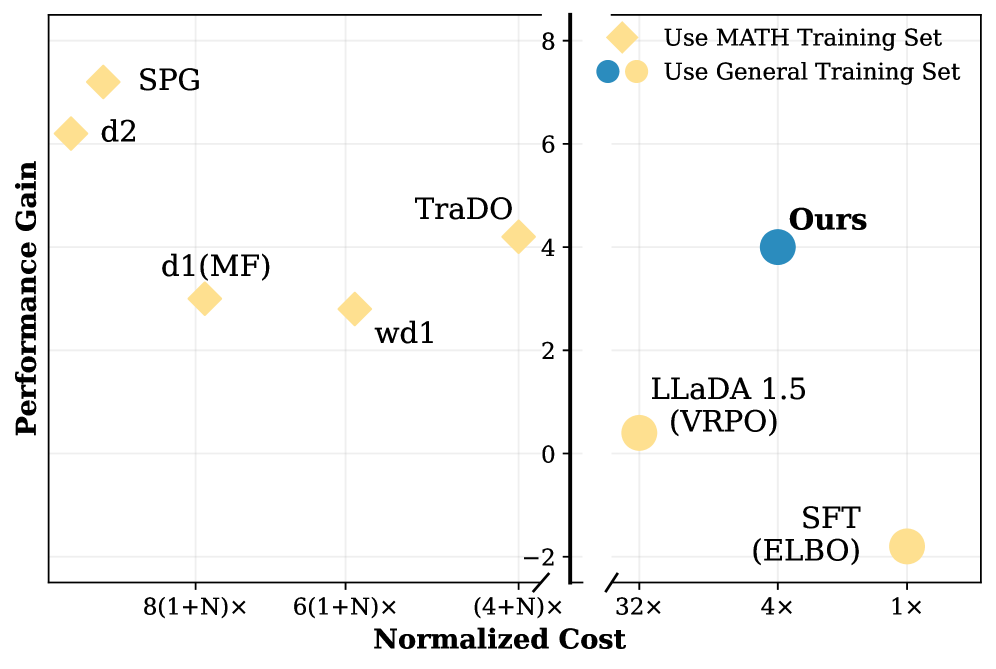
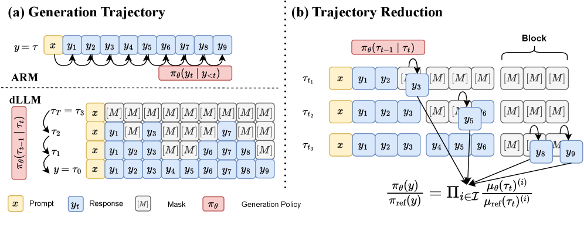
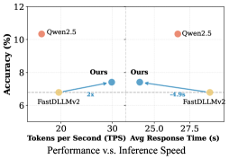

# dTRPO: Trajectory Reduction in Policy Optimization of Diffusion Large Language Models

**Authors:** Lemeng Wu, Changsheng Zhao, Ernie Chang, Mingchen Zhuge, Zechun Liu, Andy Su, Hanxian Huang, Jun Chen, Chong Zhou, Raghuraman Krishnamoorthi, Vikas Chandra, Mohamed Elhoseiny, Wei Wen (Meta AI, KAUST)
**Date:** March 19, 2026
**Paper:** [arXiv:2603.18806](https://arxiv.org/abs/2603.18806)

---

## TL;DR

Diffusion LLMs (dLLMs) generate text by gradually unmasking tokens over many steps, but computing the probability of this multi-step trajectory is expensive — each step normally requires its own forward pass. dTRPO proves two reductions: (1) the *ratio* of trajectory probabilities between the current and reference policy depends only on the *newly unmasked tokens* at each step (schedule coefficients cancel), and (2) you can estimate the full trajectory probability using just one sampled step per block. Together, these allow DPO-style offline preference training with just **4 forward passes per example** — matching autoregressive DPO cost. On 7B dLLMs, this yields gains of up to 9.6% on STEM, 4.3% on coding, and 3.0% on instruction-following.

---

## Key Figures

### Fig. 1: Training Cost vs Performance Gain on MATH

The paper's headline efficiency claim. Left panel: online methods (d2, SPG, TRaDO, d1, wd1) require hundreds of forward passes per example for rollout + probability estimation, scaling as `(1+N)×` to `8(1+N)×`. Right panel: dTRPO (blue dot, "Ours") achieves comparable MATH performance gain at only `4×` cost (4 forward passes — 2 completions × 2 models), matching DPO for ARMs. ELBO-based SFT (`1×`) is cheaper but performs poorly. LLaDA 1.5 (VRPO, `4×`) is comparable in cost but gains much less.

### Fig. 2: ARM vs dLLM Generation + Trajectory Reduction

The core conceptual diagram. (a) Left: ARMs generate tokens sequentially (y₁ → y₂ → ...) with causal conditioning — trajectory probability is a product of token probabilities, computable in one forward pass. dLLMs generate via multi-step unmasking: each step reveals some tokens from a partially masked state. The probability depends on *which tokens are still masked*, making a single forward pass insufficient. (b) Right: dTRPO's key insight. For each block, sample one intermediate masked state, and compute the probability *only* for the newly unmasked tokens (shown in orange). The ratio with the reference policy cancels all schedule-dependent coefficients, leaving a clean product of categorical probability ratios.

### Fig. 4: Inference Speed vs Performance

dTRPO (blue) achieves ~2× speedup over Qwen2.5 ARM baseline at comparable accuracy on GSM8K, and ~4 seconds faster on Arena-Hard. It sits between the Fast-dLLM-v2 backbone and the ARM in accuracy but matches dLLM inference speed. The key: dTRPO improves quality without changing the inference procedure.

---

## Key Novel Ideas

### 1. The Trajectory Probability Problem in dLLMs

In an autoregressive model (ARM), the probability of generating a sequence y = (y₁, ..., y_L) factorizes cleanly:

$$\pi_\theta(\mathbf{y}) = \prod_{t=1}^{L} \pi_\theta(y_t \mid \mathbf{y}_{<t})$$

This can be computed in **one forward pass** because causal attention gives you all conditional probabilities simultaneously.

In a diffusion LLM, text is generated by iteratively unmasking tokens from a fully masked state `[M, M, ..., M]` over T steps. The trajectory probability is:

$$\pi_\theta(\boldsymbol{\tau}) = \prod_{t=1}^{T} \pi_\theta(\boldsymbol{\tau}_{t-1} \mid \boldsymbol{\tau}_t, t)$$

Each factor depends on the *partially masked state* τ_t at that step — not on the final clean sequence. If you forward only the clean output (as in ARMs), you get the wrong conditional. You'd need T forward passes, one per step.

This is the core bottleneck that makes DPO/RLHF expensive for dLLMs. Previous work handled it via expensive online rollouts (d1, TRaDO, d2) or noisy ELBO estimation (LLaDA). dTRPO solves it principally.

### 2. Ratio Reduction (Theorem 3.2) — Schedule Coefficients Cancel

The reverse kernel for dLLMs (Equation 4) mixes schedule-dependent coefficients (involving α_t, the cumulative retention rate) with the learned categorical distribution μ_θ. Computing trajectory probability directly is numerically unstable because these coefficients span different magnitudes.

dTRPO's key theoretical insight: **when you take the ratio between two policies evaluated on the same trajectory, the schedule coefficients cancel exactly:**

$$\frac{\pi_\theta(\boldsymbol{\tau}_{t-1} \mid \boldsymbol{\tau}_t, t)}{\pi_{\text{ref}}(\boldsymbol{\tau}_{t-1} \mid \boldsymbol{\tau}_t, t)} = \prod_{i \in \mathcal{I}_t} \frac{\mu_\theta(\tau_{t-1}^{(i)} \mid \boldsymbol{\tau}_t)}{\mu_{\text{ref}}(\tau_{t-1}^{(i)} \mid \boldsymbol{\tau}_t)}$$

where I_t is the set of *newly unmasked* token positions at step t. The product runs only over tokens that transition from [M] to a real token — not tokens that stay masked or were already unmasked.

**Why this matters:** DPO needs log-ratios `log π_θ(y) / π_ref(y)`, not raw probabilities. This theorem says you can compute the ratio without ever dealing with the messy schedule coefficients. You just need the categorical probabilities μ_θ and μ_ref at the newly-unmasked positions. The ratio is also **independent of the masking schedule** — you can choose any unmasking order without changing the loss form.

### 3. State Reduction (Theorem 3.1) — One Sample Per Block Suffices

For block-wise dLLMs (like Fast-dLLM-v2, which processes T_B steps within each of N_B blocks), the full trajectory probability sums over all T_B steps per block. Theorem 3.1 shows this can be estimated with a **single uniformly sampled step per block**:

$$\log \pi_\theta(\boldsymbol{\tau}) = \sum_{s=1}^{N_B} \mathbb{E}_{t \sim U(1, T_B)} T_B \log \pi_\theta(\boldsymbol{\tau}_{s,t} \mid \boldsymbol{\tau}_{s,t-1}, t)$$

In practice: for each of the N_B blocks, sample one random intermediate state, evaluate one transition, multiply by T_B. This is an unbiased estimator of the full trajectory log-probability. With block attention, all N_B sampled states can be packed into a **single forward pass**.

### 4. The dTRPO Objective — DPO for Diffusion LLMs

Combining both reductions into DPO yields the dTRPO loss:

$$\mathcal{L}_{\text{dTRPO}}(\theta) = -\mathbb{E}_{(\mathbf{y}^+, \mathbf{y}^-)} \log \sigma\left(\lambda T_B \left[S(\mathbf{y}^+; \theta, \text{ref}) - S(\mathbf{y}^-; \theta, \text{ref})\right]\right)$$

where:

$$S(\mathbf{y}; \theta, \text{ref}) = \sum_{s=1}^{N_B} \mathbb{E}_{t \sim U(1, T_B)} \log \left[\prod_{i \in \mathcal{I}_t} \frac{\mu_\theta(\tau_{s,t-1}^{(i)} \mid \boldsymbol{\tau}_{s,t})}{\mu_{\text{ref}}(\tau_{s,t-1}^{(i)} \mid \boldsymbol{\tau}_{s,t})}\right]$$

The practical procedure: for each preference pair (y⁺, y⁻), construct masked intermediate states by unmasking top-k confident tokens, forward once through π_θ and once through π_ref, collect the categorical probabilities at the newly-unmasked positions, compute the ratio. Total: **4 forward passes** (2 completions × 2 models), identical to ARM DPO.

### 5. Inference-Aligned Scheduling

A subtle design choice: the set I_t of which tokens to unmask at each step during training should match the model's inference-time decoding strategy. dTRPO adopts **top-k confidence scheduling**: at each step, unmask the k=10% of remaining masked tokens with the highest model confidence. This violates the strict independence assumption in Theorem 3.1 (token positions aren't truly independent), but the ablations show negligible impact — and matching the inference strategy empirically outperforms random unmasking.

---

## Architecture Details

| Component | Specification |
|---|---|
| Backbone | Fast-dLLM-v2-7B (adapted from Qwen2.5-7B-Instruct) |
| Architecture type | Block-wise diffusion LLM with masked prediction |
| Block size | 32 tokens |
| Steps per block (T_B) | 10 (k=0.1, unmasking 10% per step) |
| N_B (blocks) | Sequence length / 32 |
| Unmasking schedule | Top-k confidence (greedy, k=0.1) |
| Forward passes per training example | 4 (= DPO for ARMs) |
| Inference | Block-by-block autoregressive, greedy decoding, batch 32, max 2048 tokens |

---

## Training Pipeline

1. **Base model:** Fast-dLLM-v2-7B, which is itself adapted from Qwen2.5-7B-Instruct into a block-wise diffusion architecture.

2. **Training data:** 500K preference pairs from SmolTalk2 (instruction-following) + math preference data + code preference data.

3. **dTRPO training (single stage):**
   - Optimizer: AdamW, lr = 5×10⁻⁷, cosine annealing with 10% warmup
   - DPO objective with λ = 0.05
   - Per-device batch size 2, gradient accumulation 8, across 64 A100-80GB GPUs
   - **~5 hours** for 1 epoch
   - Parameter-efficient: only MLP layers and output projection updated (following BFPO); everything else frozen

4. **No online RL stage.** dTRPO is purely offline preference optimization — no rollouts, no reward models, no online sampling.

---

## Key Results

### Main results (Table 2): Zero-shot evaluation on 7B dLLMs

| Model | GPQA | GSM8K | MATH | LCBv6 | MBPP+ | HEval+ | IFEval | ArenaHard | MTBench |
|---|---|---|---|---|---|---|---|---|---|
| Qwen2.5-7B-Instruct (ARM) | 36.36 | 87.87 | 73.06 | 24.42 | 67.5 | 74.4 | 71.38 | 10.43 | 8.08 |
| LLaDA Instruct | 19.19 | 78.47 | 42.48 | 6.07 | 38.1 | 34.1 | 53.23 | — | — |
| LLaDA 1.5 (VRPO) | 19.19 | 79.45 | 43.64 | 6.54 | 37.0 | 39.0 | 59.52 | — | — |
| Dream Instruct | 28.79 | 75.36 | 50.22 | 12.61 | **54.5** | 53.0 | 50.65 | 6.79 | 3.88 |
| Fast-dLLM-v2 | 20.71 | 82.34 | 60.26 | 11.56 | 51.6 | 59.1 | 62.11 | 1.26 | 3.17 |
| Fast-dLLM-v2 + ELBO | 12.63 | 79.98 | 58.48 | 11.56 | 52.4 | 59.1 | 51.02 | 0.17 | 1.01 |
| Fast-dLLM-v2 + DPO w/ MF | 23.74 | 85.37 | 63.20 | 11.00 | 46.3 | 51.8 | 65.62 | 6.02 | 6.48 |
| **Fast-dLLM-v2 + dTRPO** | **30.30** | **85.97** | **64.30** | **15.17** | 51.6 | **63.4** | **65.06** | **7.41** | **6.53** |

### dTRPO gains vs Fast-dLLM-v2 backbone

| Benchmark | Gain |
|---|---|
| GPQA (STEM reasoning) | **+9.59%** |
| MATH | **+4.04%** |
| GSM8K | +3.63% |
| LCBv6 (coding) | **+3.61%** |
| HumanEval+ | **+4.3%** |
| IFEval (instruction-following) | **+2.95%** |
| Arena-Hard | +6.15% |
| MT-Bench | +3.36% |

### Inference efficiency (Table 3)

| Model | GSM8K TPS | GSM8K Time | GSM8K Acc | ArenaHard TPS | ArenaHard Time | ArenaHard Score |
|---|---|---|---|---|---|---|
| Qwen2.5-7B-Instruct | 38.9 | 7.17s | 87.87 | 16.20 | 26.66s | 10.43 |
| Fast-dLLM-v2 | 38.84 | 7.83s | 82.34 | 19.55 | 28.92s | 6.79 |
| dTRPO | 38.80 | 8.52s | 85.97 | **29.87** | **23.98s** | 7.41 |

### Why directly optimizing masked token probability fails (Table 1)

| Objective | GSM8K | LCBv6 | IFEval |
|---|---|---|---|
| max Π μ_θ(ỹ) | 66.26 | 2.37 | 25.69 |
| min ELBO | 79.98 | 11.56 | 51.02 |
| **dTRPO** | **85.97** | **15.17** | **65.06** |

---

## Key Takeaways

1. **The trajectory probability problem is the core bottleneck for dLLM alignment.** ARMs get trajectory probability in one forward pass. dLLMs need T forward passes (one per diffusion step), making DPO/RLHF prohibitively expensive. This paper solves it with two principled reductions, not heuristic approximations.

2. **Ratio Reduction is the deeper insight.** You never need the raw trajectory probability — DPO only needs the ratio π_θ/π_ref. When you take this ratio, the schedule-dependent coefficients (involving α_t, β_t) cancel exactly, leaving only categorical probability ratios over newly unmasked tokens. This is an exact result, not an approximation.

3. **State Reduction makes it practical.** Sampling one random step per block, then multiplying by T_B, gives an unbiased estimator of the full trajectory log-probability. With block attention, all N_B samples fit in a single forward pass. Combined with Ratio Reduction, you get 4 forward passes per training example — identical to ARM DPO.

4. **Directly optimizing masked-token probability is wrong.** Table 1 shows that naively maximizing the model's prediction on randomly masked tokens (as d1 does) gets only 66.26% on GSM8K vs dTRPO's 85.97%. The masked-token probability isn't a grounded estimator of the trajectory probability under the MDP formulation. This is a theoretical point with large practical impact.

5. **dTRPO is purely offline, requiring no rollouts.** Online RL for dLLMs (d1, d2, TRaDO, SPG) requires generating completions + estimating their trajectory probabilities, costing hundreds of forward passes per example. dTRPO uses only offline preference data and 4 forward passes. Training takes ~5 hours on 64 A100s.

6. **The method works for both block-wise and long-block dLLMs.** Ablation on LLaDA (a single-block model where N_B=1) shows dTRPO still gives substantial gains. This means the theory generalizes — it's not specific to block-wise architectures.

7. **Top-k confidence scheduling outperforms random unmasking.** Although Theorem 3.1 assumes token-position independence (which top-k confidence violates), empirically the violation has negligible impact. Matching the inference-time strategy (which also uses top-k confidence) is more important than satisfying the independence assumption exactly.

8. **dLLMs still lag behind their ARM parents.** Qwen2.5-7B-Instruct scores 73.06 MATH; Fast-dLLM-v2 + dTRPO gets 64.30. Converting an ARM to a dLLM loses ~9 points on MATH. The gap is narrower on instruction-following (71.38 vs 65.06 IFEval) and nearly closed on Arena-Hard (10.43 vs 7.41). dTRPO reduces but does not eliminate the ARM→dLLM performance gap.

9. **dLLMs gain inference speed.** On Arena-Hard, dTRPO achieves 29.87 TPS vs ARM's 16.20 TPS — a ~1.9× speedup. This is the fundamental appeal of dLLMs: parallel decoding within each block. dTRPO improves quality without sacrificing this speed advantage.

10. **Estimator stability matters.** A single sample per block works as well as multiple samples (ablation, Fig 3e). The estimator is robust to the choice of projection function (DPO, IPO, RSO, APO all similar; Fig 3b). This is good news for practitioners: the method isn't sensitive to hyperparameter tuning.

---

## What's Open-Sourced

- **Code/Models:** Not explicitly open-sourced at time of publication. The paper does not mention a GitHub repo.
- **Backbone:** Fast-dLLM-v2-7B (the backbone model) has an official checkpoint.
- **Training data:** Uses publicly available datasets: SmolTalk2 preference dataset, math preference data (argilla), code preference data (vezora).
- **Evaluation:** All benchmarks are standard public evaluations (GPQA, GSM8K, MATH, MBPP+, HumanEval+, LCBv6, IFEval, Arena-Hard, MT-Bench).
