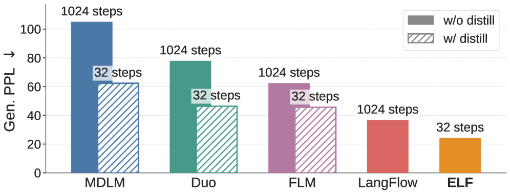
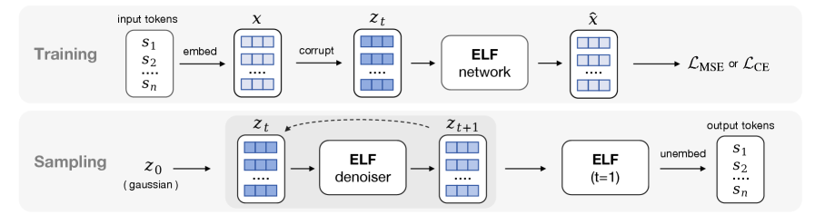
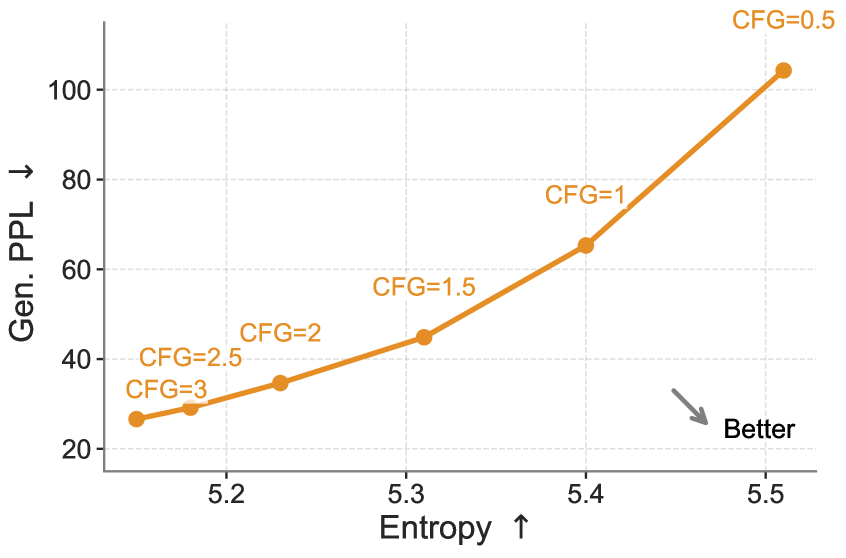
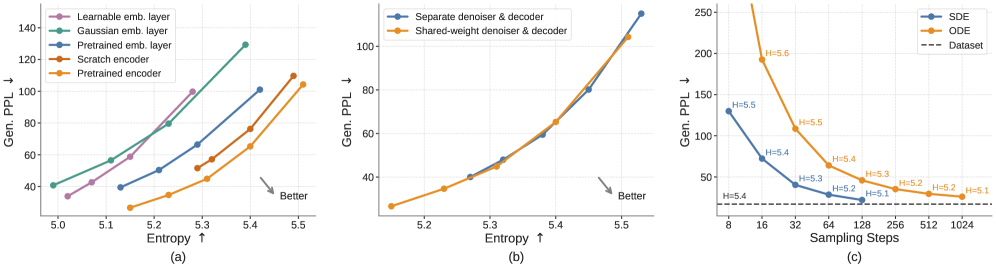
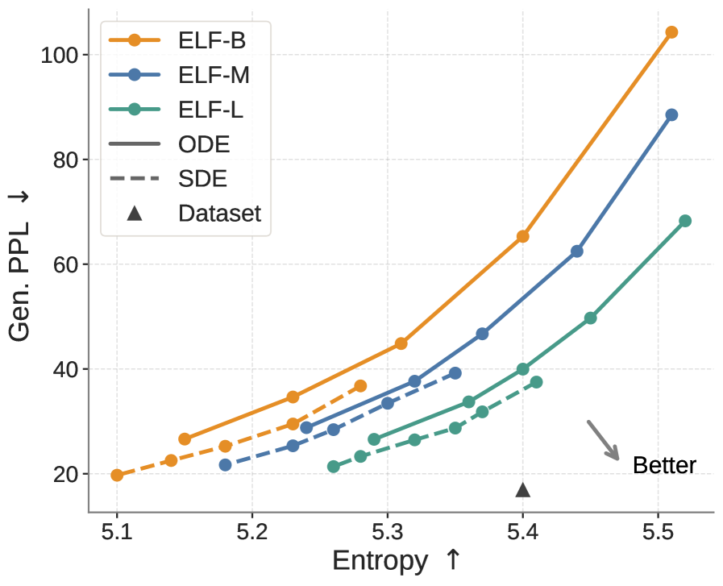
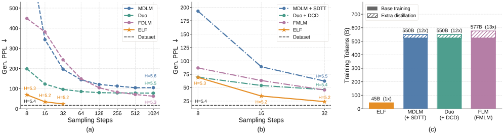

# ELF: Embedded Language Flows

**Authors:** Keya Hu, Linlu Qiu, Yiyang Lu, Hanhong Zhao, Tianhong Li, Yoon Kim, Jacob Andreas, Kaiming He (MIT)
**Date:** May 2026
**Paper:** [arXiv:2605.10938](https://arxiv.org/abs/2605.10938)
**Code:** [github.com/lillian039/ELF](https://github.com/lillian039/ELF)

---

## TL;DR

ELF is a continuous diffusion language model based on Flow Matching that operates almost entirely in continuous embedding space, converting to discrete tokens only at the very last step. Unlike current discrete diffusion LMs (which operate directly on tokens), ELF stays continuous throughout the flow process, which lets it directly borrow powerful techniques from image generation — especially **classifier-free guidance (CFG)**. Result: ELF substantially outperforms both discrete DLMs (MDLM, Duo) and concurrent continuous DLMs (FLM, LangFlow), achieving lower generative perplexity with **fewer sampling steps** (32 vs 1024) and **10× fewer training tokens** (45B vs 500B+), without any distillation.

---

## Key Figures

### Fig. 1: Headline Comparison — ELF vs All DLMs


The paper's main selling point in one chart. Generative perplexity (lower = better) at 1024 and 32 sampling steps for leading discrete DLMs (MDLM, Duo), continuous DLMs (FLM, LangFlow), and ELF. At 32 steps, ELF (rightmost) matches or beats all baselines at 1024 steps. Even distilled variants of MDLM/Duo don't close the gap at 32 steps. ELF achieves this without distillation.

### Fig. 3: ELF Architecture — Training and Sampling


The core design. **Training (top):** tokens s₁...sₙ are embedded into continuous vectors x via a frozen encoder, then corrupted to z_t. The same ELF network predicts x̂ with either MSE loss (for denoising at t<1) or cross-entropy loss (for decoding at t=1). **Sampling (bottom):** start from Gaussian noise z₀, iteratively denoise via the ODE/SDE solver, then at the final step (t=1) switch the network to "decode" mode and unembed to discrete tokens. No separate decoder needed — the same network does both denoising and decoding via weight sharing.

### Fig. 4: CFG Quality–Diversity Tradeoff


CFG is the key lever. As the CFG scale increases, generative perplexity drops (better quality) but entropy also drops (less diversity). The sweet spot depends on the application. This tradeoff is natural in continuous diffusion but hard to achieve in discrete DLMs — one of ELF's structural advantages over the discrete paradigm.

### Fig. 5: Ablations — Embeddings, Decoding, Samplers


Three key design choices ablated: (a) **Embeddings:** pretrained contextual embeddings (T5 encoder) work best; random Gaussians and learnable embeddings are substantially worse. (b) **Decoding:** shared-weight (single network for denoise+decode) matches or beats a separate two-stage pipeline, while being simpler. (c) **Samplers:** SDE sampling is dramatically better than ODE in the few-step regime, achieving lower perplexity at 8-32 steps.

### Fig. 6: Scaling Behavior


ELF scales cleanly. Larger models (105M → 342M → 652M) push the generative-PPL-vs-entropy frontier downward and rightward (better quality at same diversity, or same quality with more diversity). SDE sampling helps at all scales. The curves don't saturate at 652M, suggesting headroom for further scaling.

### Fig. 7: System-Level Comparison on Unconditional Generation


The full system comparison. (a) Gen PPL vs sampling steps: ELF reaches PPL ~24 at 32 steps, while MDLM needs ~1024 steps for the same quality. (b) Even compared to *distilled* models (MDLM+SDTT, Duo+DCD, FMLM), ELF without distillation outperforms them at low step counts. (c) Training tokens: ELF uses ~45B tokens vs 500B+ for baselines — **10× more data-efficient**.

---

## Key Novel Ideas

### 1. Stay Continuous Until the Last Step — No Per-Step Discretization

Most existing continuous DLMs (Diffusion-LM, CDCD, DiffuSeq) add a cross-entropy loss at every diffusion step, forcing the model to produce valid token probabilities at each intermediate state. This ties the continuous trajectory to the discrete token space, limiting the flow dynamics.

ELF takes a different approach: **denoise purely in continuous embedding space for all steps except the last one.** At intermediate steps (t < 1), the model predicts clean continuous embeddings x̂ and is trained with MSE loss against the true embedding x. Only at the final step (t = 1) does the model switch to "decode" mode, applying an unembedding matrix W to the predicted embedding and computing cross-entropy loss against ground-truth tokens.

Why this works: by staying continuous, the flow trajectory has maximal freedom to take the most efficient path from noise to data. Forcing discrete token predictions at every step constrains the intermediate states to be near token embeddings, which adds unnecessary structure to the flow and may slow convergence.

### 2. Shared-Weight Denoiser + Decoder — No Extra Components

In latent diffusion for images, you need a separate VAE decoder to go from latent space back to pixel space. Many continuous DLMs similarly require a separate decoder.

ELF avoids this by observing that **the final step of Flow Matching naturally serves as the decoder.** The same network `net_θ(z_t, t)` that denoises at t < 1 also decodes at t = 1 — it just sees a different "mode" token and applies cross-entropy loss instead of MSE loss. At inference, the unembedding step happens exactly once, at the end.

The training split is 80% MSE (denoising) and 20% CE (decoding), selected by random branching within each batch. A binary "mode" token tells the network which operation to perform.

### 3. x-Prediction Parameterization (Not v-Prediction)

Standard Flow Matching uses v-prediction (predict the velocity field v = x − ε). ELF instead uses **x-prediction** (predict the clean data x directly), converting to velocity via v = (x̂ − z_t) / (1 − t).

Two reasons this matters:
1. **x-prediction works better on high-dimensional embeddings** (768-d per token). This is consistent with findings in the image domain from scalable interpolant transformers.
2. **x-prediction aligns with the decoding objective.** At the final step, the network needs to predict clean embeddings to feed into the unembedding matrix. If the network were trained to predict v, sharing weights with the decode step would require an awkward conversion — and empirically, v-prediction works poorly with shared weights.

### 4. Classifier-Free Guidance for Language, via Self-Conditioning

CFG is the single most important quality lever in image diffusion, but it hasn't worked well for discrete DLMs because it requires extrapolating continuous quantities (scores/velocities), which is undefined for discrete tokens.

ELF's continuous formulation makes CFG trivial:

```
v_cfg(z_t | c) = ω · v(z_t | c) + (1 − ω) · v(z_t | ∅)
```

where c is a conditioning signal, ∅ is null conditioning, and ω is the guidance scale.

For *unconditional* generation (no class labels), ELF uses **self-conditioning** as the conditioning signal c: the model's own prediction x̂' from a previous forward pass. During training, c = x̂' with 50% probability and c = 0 otherwise. This naturally provides the conditional/unconditional pair that CFG requires.

For *conditional* generation (translation, summarization), c additionally includes the clean embeddings of the input sequence, and CFG scales the influence of both.

To avoid the 2× inference cost of standard CFG, ELF adopts **training-time CFG** techniques from image generation — the network directly predicts x_cfg rather than requiring two separate forward passes. This is straightforward because ELF is formulated identically to image-domain flow matching.

### 5. SDE Sampling — Stochastic Beats Deterministic for Language

ELF supports both ODE (deterministic, Euler solver) and SDE (stochastic, inject noise at each step) sampling. The SDE variant substantially outperforms ODE in the few-step regime — at 8 steps, SDE achieves ~40 Gen PPL vs ~80 for ODE.

The intuition: stochastic sampling helps correct errors that accumulate during Euler integration. In the few-step regime (where discretization error is large), injecting noise provides a form of error correction. This is a well-known phenomenon in image diffusion, and it transfers cleanly to ELF because the formulation is the same.

---

## Architecture Details

| Component | Specification |
|---|---|
| Encoder | Frozen pretrained T5-small (35M params), embedding dim 512 |
| Bottleneck | Linear projection from 512 → 128 → hidden_dim |
| ELF-B | 105M params, 12 layers, hidden 768, 12 heads |
| ELF-M | 342M params, 24 layers, hidden 1024, 16 heads |
| ELF-L | 652M params, 32 layers, hidden 1280, 20 heads |
| Training loss split | 80% MSE (denoising), 20% CE (decoding) |
| Optimizer | Muon, lr=0.002, batch size 512 |
| Sequence length | 1024 (unconditional), 128 (translation), 1088 (summarization) |
| Time schedule | Continuous t ∈ [0, 1], linear interpolant (rectified flow) |
| Self-conditioning | 50% probability during training |
| CFG | Self-conditioning CFG scale ω (default 3 for unconditional) |
| Training tokens | ~45B (5 epochs on OpenWebText's 9B tokens) |

---

## Training Pipeline

1. **Embedding:** Tokenize input with T5 tokenizer. Pass through frozen pretrained T5-small encoder to get 512-d contextual embeddings per token. Project to 128-d bottleneck, then up to model hidden dimension.

2. **Training:** For each batch, randomly select "denoise" (80%) or "decode" (20%) mode:
   - **Denoise (t < 1):** Sample t ~ U(0,1), construct z_t = t·x + (1−t)·ε, predict x̂ = net(z_t, t, "denoise"), minimize MSE: `‖(x̂ − z_t)/(1−t) − (x − ε)‖²`.
   - **Decode (t = 1):** Corrupt x to z̃ (near-clean input with some noise), predict x̂ = net(z̃, 1, "decode"), project through unembedding matrix W, minimize cross-entropy against ground-truth tokens.
   
3. **Self-conditioning:** With 50% probability, run a first forward pass to get x̂', then concatenate [z_t, x̂'] as input for the second pass.

4. **Training-time CFG:** The model is trained to directly predict the guided output x_cfg, following techniques from image generation.

5. **Inference:** Start from z₀ ~ N(0, I). Run Euler ODE or SDE solver for T steps. At the final step, switch to "decode" mode, apply unembedding matrix W, argmax to get tokens.

---

## Key Results

### Unconditional generation on OpenWebText (Gen PPL ↓, Entropy ↑)

| Model | Steps | Gen PPL | Training Tokens |
|---|---|---|---|
| MDLM (170M) | 1024 | ~35 | 530B |
| MDLM (170M) | 32 | ~90 | 530B |
| Duo (170M) | 1024 | ~27 | 530B |
| Duo (170M) | 32 | ~55 | 530B |
| FLM (170M) | 1024 | ~30 | 530B |
| LangFlow | 32 | ~50 | — |
| **ELF-B (105M)** | **32** | **~24** | **45B** |
| **ELF-L (652M)** | **32** | **~18** | **45B** |

ELF-B at 32 steps beats all baselines at 1024 steps, using 10× fewer training tokens and having fewer parameters.

### ELF vs distilled models (few-step regime)

ELF without distillation outperforms MDLM+SDTT (distilled), Duo+DCD (distilled), and FMLM (distilled) at ≤32 steps. Distillation doesn't close the gap.

### Conditional generation

| Model | Size | WMT14 De-En BLEU ↑ | XSum R-1 ↑ | XSum R-2 ↑ | XSum R-L ↑ |
|---|---|---|---|---|---|
| AR baseline | 99M | 25.2 | 30.5 | 10.2 | 24.4 |
| MDLM | 99M | 18.4 | 33.4 | 11.6 | 25.8 |
| Duo | 170M | 21.3 | 31.4 | 10.1 | 25.0 |
| E2D2 | 99M | 24.8 | 28.4 | 8.3 | 22.0 |
| CDCD | — | 24.9 | — | — | — |
| **ELF-B** | **105M** | **26.4** | **36.0** | **12.2** | **27.8** |

ELF outperforms all baselines — including autoregressive — on both translation and summarization.

---

## Key Takeaways

1. **Continuous DLMs can beat discrete DLMs.** The conventional wisdom (since MDLM/Duo) was that discrete DLMs are better for language because language is inherently discrete. ELF shows this gap was due to algorithmic design, not a fundamental limitation of continuous representations. The key missing ingredient was proper formulation (Flow Matching, x-prediction) and guidance (CFG).

2. **CFG is the single biggest quality lever.** Without CFG, ELF's advantage over discrete methods would be much smaller. Because ELF operates in continuous space, it can directly use CFG — which is the most important quality technique in image diffusion. Discrete DLMs can't use CFG effectively because it requires extrapolating continuous quantities. This is ELF's structural advantage.

3. **x-prediction is essential for weight sharing.** The shared denoiser-decoder design works because x-prediction naturally outputs clean embeddings — the same format the unembedding matrix W expects. v-prediction requires conversion and breaks the weight-sharing property. This is a subtle but load-bearing design choice.

4. **SDE sampling dramatically helps in the few-step regime.** At 8-32 steps, SDE is 2-3× better than ODE in Gen PPL. The stochastic correction compensates for large Euler discretization errors. This is well-known in image diffusion; the contribution is showing it transfers to language.

5. **10× data efficiency is striking.** ELF trains on ~45B tokens (5 epochs of OWT's 9B) vs 500B+ for MDLM/Duo/FLM. The authors tried training on more data and saw no improvement. This suggests the flow-matching formulation learns the data distribution more efficiently than discrete diffusion — possibly because it can leverage the geometric structure of the embedding space.

6. **Pretrained contextual embeddings beat all alternatives.** Frozen T5 encoder embeddings outperform: T5 token embeddings (non-contextual), Gaussian random embeddings, learnable embeddings, and even an encoder trained from scratch on OWT. The pretrained encoder provides a "structured" continuous space that the flow can navigate efficiently.

7. **No distillation needed.** ELF at 32 steps already beats distilled versions of MDLM and Duo. This is remarkable because distillation is a major engineering effort (train a teacher, then train a student to mimic fewer-step outputs). ELF side-steps this entirely by combining SDE sampling with CFG.

8. **ELF scales cleanly.** The 105M → 342M → 652M size sweep shows consistent improvement in the PPL-entropy frontier. No saturation at 652M — so further scaling is promising. Combined with the data efficiency, this makes ELF a practical architecture to scale.

9. **Conditional generation works out of the box.** Translation (BLEU 26.4 vs 25.2 AR baseline) and summarization (ROUGE-1 36.0 vs 33.4 MDLM) both work well with minimal modifications: prepend clean condition embeddings, add input-condition CFG. The same framework handles both unconditional and conditional tasks.

10. **The minimalist design is the point.** ELF doesn't introduce novel architecture components — it uses a standard Transformer, frozen T5 embeddings, and standard Flow Matching. The contribution is showing that *minimal adaptation* of continuous diffusion to language (just the final-step decode + shared weights + x-prediction) is enough to outperform purpose-built discrete DLMs. This suggests the image-diffusion toolbox transfers to language with remarkably little modification.

---

## What's Open-Sourced

- **Code:** [github.com/lillian039/ELF](https://github.com/lillian039/ELF)
- **Models:** Not explicitly mentioned as released checkpoints, but the code repository likely contains training scripts and configs
- **Training data:** OpenWebText (publicly available), WMT14 De-En (publicly available), XSum (publicly available)
- **Embeddings:** Uses off-the-shelf T5-small encoder (publicly available from HuggingFace)
