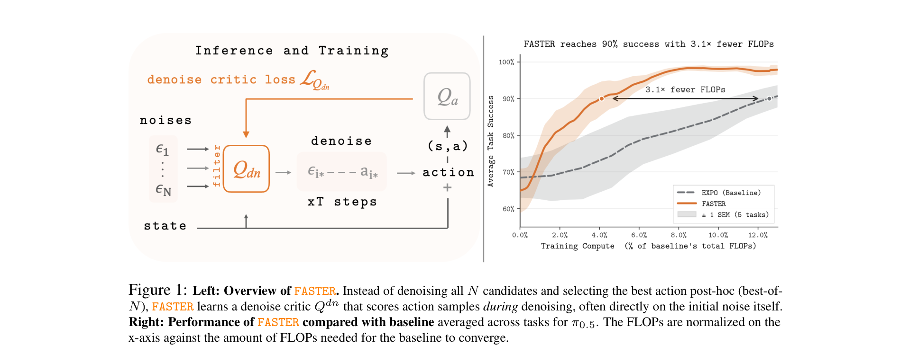
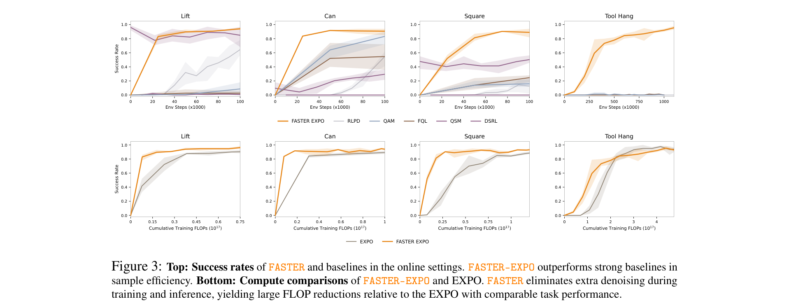
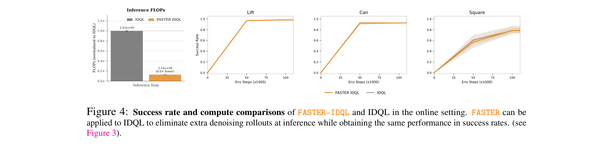
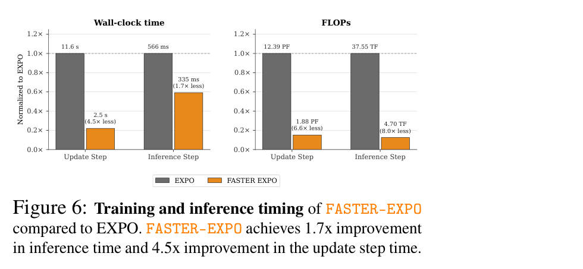
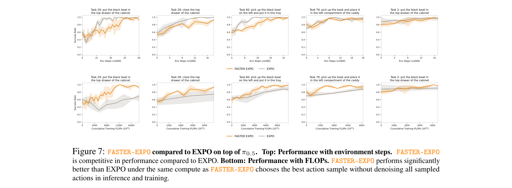

# FASTER: Value-Guided Sampling for Fast RL

**Authors:** Perry Dong\*, Alexander Swerdlow\* (equal contribution), Dorsa Sadigh, Chelsea Finn — Stanford University
**Date:** April 21, 2026
**Paper:** [PDF](https://arxiv.org/abs/2604.19730)
**Code:** [github.com/alexanderswerdlow/faster](https://github.com/alexanderswerdlow/faster)

---

## TL;DR

FASTER is a method that gets the performance benefits of best-of-N sampling (generating multiple action candidates and picking the best) for diffusion-based RL policies **without** the computational cost of denoising all N candidates. It does this by learning a lightweight "denoise critic" that scores random noise seeds *before* denoising, keeping only the best seed and denoising just that one. This reduces inference-time actor cost from O(T·N) to O(T), where T is denoising steps and N is the number of candidates. On a 3.3B-parameter VLA, FASTER achieves 8x fewer FLOPs and 1.7x faster inference with comparable task success rates.

---

## Key Figures

### Figure 1: FASTER Overview and Compute Efficiency

**Left:** Instead of denoising all N noise candidates into actions and then scoring them (best-of-N), FASTER learns a denoise critic Q^dn that scores the raw noise samples directly. Only the top-scoring noise seed gets denoised into an action. **Right:** On the Robomimic benchmark (averaged across tasks for the π₀.₅ VLA), FASTER reaches 90% success with 3.1x fewer training FLOPs than the EXPO baseline.

### Figure 3: Online RL Results on Robomimic

**Top row:** Success rate vs. environment steps for Lift, Can, Square, and Tool Hang tasks. FASTER-EXPO (orange) outperforms all baselines (RLPD, QSM, FQL, QAM, DSRL) in sample efficiency. **Bottom row:** The same results plotted against cumulative training FLOPs — FASTER-EXPO achieves the same performance as EXPO at a fraction of the compute cost because it avoids denoising N candidates during each training step.

### Figure 4: FASTER-IDQL vs. IDQL

**Left:** FASTER-IDQL uses 8x fewer inference FLOPs than IDQL (3.55×10⁸ vs 2.83×10⁹). **Right:** Despite this massive compute reduction, success rates on Lift, Can, and Square are identical within error bars. This confirms the core claim: noise-level filtering recovers best-of-N gains without the cost.

### Figure 6: VLA Training and Inference Timing

When applied to the 3.3B-parameter π₀.₅ VLA, FASTER-EXPO reduces per-step update time by 4.5x (11.6s → 2.5s) and inference latency by 1.7x (566ms → 335ms). In FLOPs, the savings are even larger: 6.6x on the update step and 8.0x on inference, because the 20M-parameter denoise critic is tiny compared to the 3.3B actor.

### Figure 7: VLA Task Performance (LIBERO)

**Top row:** Performance vs. environment steps — FASTER-EXPO matches EXPO on the majority of the 5 held-out libero_90 tasks. **Bottom row:** Performance vs. cumulative FLOPs — FASTER-EXPO is significantly more compute-efficient, achieving similar success rates at a fraction of the training budget.

---

## Key Novel Ideas

### 1. Modeling Action Denoising as a Filtering MDP

The central contribution is reframing the problem of "sample N candidates, denoise all of them, pick the best" into a Markov Decision Process (MDP) where the goal is to **filter out bad candidates early**, before they're fully denoised.

**Why this matters:** In diffusion-based RL (like EXPO or IDQL), the policy generates actions by starting from random noise ε ~ N(0, I) and iteratively denoising it over T steps. Best-of-N sampling generates N such action candidates, denoises all of them, then picks the one with the highest Q-value. This is effective but costs N times as much compute. The key question is: can we identify the best noise seed without denoising all of them?

**The Action Filtering MDP** is defined as follows:
- **States:** s_t = (s, t, C_t, {a_i^(t)}_{i ∈ C_t}) — the environment state s, the current denoising timestep t (counting down from T to 1), the set of surviving candidates C_t, and their partially denoised intermediates.
- **Actions:** For each candidate i ∈ C_t, decide keep (m_{t,i} = 1) or discard (m_{t,i} = 0), with at least one kept. The surviving set becomes C_{t-1} = {i : m_{t,i} = 1}.
- **Transitions:** One denoising step is applied to each surviving candidate.
- **Reward:** Zero for non-terminal steps. At termination (one candidate left or t=1), the reward is Q^a(s, a_{i*}) — the action-level Q-value of the executed action.

This MDP captures the full generality of "filter at any step during denoising." The paper then proves that filtering at just the noise level (t = T, before any denoising) works nearly as well.

### 2. The Denoise Critic Q^dn

Instead of scoring fully denoised actions, FASTER learns a **denoise critic** Q^dn(s, ε) that takes an environment state s and a raw noise sample ε ~ N(0, I) and predicts how good the resulting action will be if that noise is denoised.

**Training:** The denoise critic is trained by simple regression against the action-level critic Q^a:

$$\mathcal{L}_{\text{reg}} = \left\| Q^{dn}(s, \epsilon_{i^*}) - \text{sg}\left[Q^a(s, a_{i^*})\right] \right\|_2^2$$

where:
- N noise candidates {ε_i} are sampled
- i* = arg max_i Q^dn(s, ε_i) picks the best according to the denoise critic
- ε_{i*} is denoised to get a_{i*} = π_θ(s, ε_{i*})
- sg[·] means stop-gradient — we don't backpropagate through the action critic

**Why it works:** The paper finds that the sample variance that makes best-of-N sampling effective is largely determined at the initial noise level. In other words, whether a noise seed will produce a good or bad action is predictable from the noise itself, without actually doing the expensive multi-step denoising. Think of it like a casting director who can tell which actors will perform well from their headshot, without needing to see a full audition.

**Inference procedure:**
1. Sample N noise candidates ε_1, ..., ε_N ~ N(0, I)
2. Score each with the denoise critic: i* = arg max_i Q^dn(s, ε_i)
3. Denoise only the winner: a_{i*} = π_θ(s, ε_{i*})
4. Execute a_{i*}

### 3. Computational Cost Reduction from O(TN) to O(T)

The cost analysis is straightforward. Let T = denoising steps, N = candidates, F_actor and F_critic = FLOPs per forward pass.

**Standard best-of-N:**
$$C_{\text{BoN}} = T \cdot N \cdot F_{\text{actor}} + N \cdot F_{\text{critic}}$$
Denoise all N candidates (T steps each), then score all N with the action critic.

**FASTER:**
$$C_{\text{FASTER}} = N \cdot F_{\text{critic}} + T \cdot F_{\text{actor}}$$
Score N noise samples with the denoise critic (one forward pass each), then denoise only the winner (T steps).

The savings come from eliminating (N−1) full denoising rollouts. When T = N and F_actor = F_critic = F, the cost goes from T(T+1)·F to 2T·F — roughly a T/2x speedup.

For VLAs where the actor (3.3B parameters) is much larger than the denoise critic (20M parameters), the ratio is even more favorable: F_critic ≪ F_actor, so scoring N noise samples is essentially free compared to a single denoising pass. This yields the observed 8x FLOP reduction.

### 4. Modular Design: Works with Any Diffusion-Based RL Method

FASTER is not a standalone RL algorithm — it's a plug-in module that sits on top of existing methods. The paper demonstrates two instantiations:

- **FASTER-EXPO:** Applied to EXPO, an online RL method with a diffusion base policy and a lightweight Gaussian edit policy. The denoise critic filters candidates for the base policy proposal; the edit step is unchanged.
- **FASTER-IDQL:** Applied to IDQL, a batch-online method that uses best-of-N for implicit policy extraction from a diffusion policy. FASTER replaces the expensive full-denoising best-of-N with noise-level filtering.

This modularity is valuable because diffusion-based policies are becoming the dominant policy class in robotics (VLAs, WAMs), and any method that uses best-of-N sampling can benefit.

---

## Architecture Details

| Component | Details |
|-----------|---------|
| **Denoise critic Q^dn** | 3-layer MLP, 256 hidden units (1.4M params for Robomimic; 20M for VLA) |
| **Action critic Q^a** | Same architecture as in base method (EXPO/IDQL) |
| **Denoising steps T** | 10 (EXPO), 100 (IDQL) |
| **Number of candidates N** | 8 |
| **Candidates kept** | 1 (greedy selection at noise level) |
| **Filter temperature** | z-score normalized; greedy (temp=0) at eval time |
| **Discount γ** | 0.99 |
| **UTD ratio** | 20 |
| **Batch size** | 256 (Robomimic), 32 (VLA) |
| **Actor/critic learning rate** | 3×10⁻⁴ / 3×10⁻⁴ |
| **Target update τ** | 0.005 |
| **Edit scale (EXPO)** | 0.15 (Robomimic), 0.2 (VLA) |
| **Expectile (IDQL)** | 0.8 |

---

## Training Pipeline

### 1. Base Policy Setup
Start with a pretrained diffusion policy (from demonstrations for Robomimic, or from the π₀.₅ VLA checkpoint for LIBERO). The base policy π_θ takes a state s and noise ε and denoises it into an action a through T iterative steps.

### 2. Online RL Loop (FASTER-EXPO)
At each environment step:
1. **Sample** N = 8 noise candidates ε_1, ..., ε_8 ~ N(0, I)
2. **Filter** using Q^dn: pick i* = arg max_i Q^dn(s, ε_i)
3. **Denoise** only ε_{i*} through T steps to get a_{i*}
4. **Execute** a_{i*} (or the EXPO edit of a_{i*}) in the environment
5. **Store** transition (s, a, r, s') in replay buffer
6. **Update** both Q^a (action critic, via standard TD learning) and Q^dn (denoise critic, via regression against Q^a), with UTD ratio of 20

### 3. Denoise Critic Training
Q^dn is trained by regressing its predictions against the stop-gradiented action critic:
$$\mathcal{L}_{\text{reg}} = \left\| Q^{dn}(s, \epsilon_{i^*}) - \text{sg}\left[Q^a(s, a_{i^*})\right] \right\|_2^2$$

This propagates outcome information from the action space back to the noise space. The critic learns to predict "this noise seed, when denoised, will produce an action worth X reward."

### 4. VLA Fine-Tuning Protocol
For the VLA experiments:
- Start from the 3.3B-parameter π₀.₅_libero checkpoint (OpenPI)
- Fine-tune entirely online on 5 held-out libero_90 tasks, no offline data
- VLA predicts action chunks over 10 steps, execute entire chunk before replanning
- Optimization at episode level: after each completed episode, run 3 updates on replay minibatches (UTD 10 per update)
- 100K total online training steps

---

## Key Results

### Online RL (Robomimic)

FASTER-EXPO outperforms all baselines across 4 tasks in sample efficiency:

| Method | Lift | Can | Square | Tool Hang |
|--------|------|-----|--------|-----------|
| FASTER-EXPO | **Best** | **Best** | **Best** | **Best** |
| EXPO | Comparable | Comparable | Comparable | Comparable |
| RLPD | Good | Moderate | Moderate | Moderate |
| QSM | Moderate | Moderate | Low | Low |
| QAM | Low | Low | Low | Low |
| FQL | Low | Low | Low | Low |
| DSRL | Moderate | Moderate | Low | Low |

FASTER-EXPO matches or exceeds EXPO's final performance while using significantly fewer FLOPs during training (because it avoids denoising N-1 extra candidates at every training step).

### Batch-Online RL (Robomimic)

In the batch-online setting (pretraining on demonstrations, then continuing online), FASTER-EXPO matches EXPO iteration-for-iteration on Lift, Can, and Square, while requiring substantially fewer FLOPs.

### VLA Results (LIBERO)

Applied to the 3.3B-parameter π₀.₅ VLA:

| Metric | EXPO | FASTER-EXPO | Improvement |
|--------|------|-------------|-------------|
| Update step (wall-clock) | 11.6 s | 2.5 s | **4.5x faster** |
| Inference step (wall-clock) | 566 ms | 335 ms | **1.7x faster** |
| Update step (FLOPs) | 12.39 PF | 1.88 PF | **6.6x fewer** |
| Inference step (FLOPs) | 37.55 TF | 4.70 TF | **8.0x fewer** |
| Task success rate | Baseline | Comparable | ~same |

The massive FLOP savings come from the asymmetry: the 20M denoise critic is 165x smaller than the 3.3B actor, so scoring N noise candidates costs almost nothing compared to a single denoising pass.

### Ablation: Critic Size

| Critic Q^dn size | Can | Square |
|------------------|-----|--------|
| 300K params (0.25x Q^a) | ~same | ~same |
| 689K params (0.5x Q^a) | ~same | ~same |
| 1.4M params (1.0x Q^a) | ~same | ~same |

Performance is robust across all sizes. The denoise critic can be **much smaller** than the action critic without degrading results.

### Ablation: Filtering Step

Filtering at denoising steps t = 0, 1, 3, 5, 7, 9 all yield similar performance. This confirms the core claim: the quality signal is already present in the initial noise, so filtering at t = T (the cheapest option) works just as well as filtering at intermediate steps.

### Ablation: Full MDP vs. Single-Step Filtering

Learning the full multi-step filtering policy (with discount γ = 0.25 to encourage early termination) performs comparably to the simpler single-step filtering at the noise level. The single-step simplification is justified.

### Ablation: Distillation Baseline

An alternative approach — distilling the best-of-N selection into a single policy π'_θ — performs **significantly worse** than FASTER. The gap is attributed to training instability: the distilled policy chases a moving target (the Q-function changes during training), yielding a non-stationary training distribution. FASTER avoids this by operating in noise space, where the filtering problem is more stable.

---

## Key Takeaways

1. **Noise determines action quality.** The most surprising finding is that the quality of a diffusion-generated action is largely predictable from the initial random noise seed alone, before any denoising happens. This is a strong empirical claim about the geometry of diffusion policy noise spaces.

2. **Filter early, save big.** By filtering at the noise level instead of after full denoising, FASTER reduces the actor compute from O(T·N) to O(T) — an N-fold reduction in the dominant cost. For N=8 and T=10, this is roughly a 5x reduction (and 8x in the VLA setting due to critic/actor size asymmetry).

3. **The denoise critic can be tiny.** Performance is stable even when Q^dn is 4x smaller than Q^a (300K vs 1.4M params). In the VLA setting, the 20M-parameter critic is 165x smaller than the 3.3B actor. This means the N noise-level evaluations add negligible overhead.

4. **FASTER is a drop-in module, not a new RL algorithm.** It can be plugged into any diffusion-based RL method that uses best-of-N sampling (EXPO, IDQL, and likely others). This makes it immediately applicable to the growing ecosystem of diffusion-based robot policies.

5. **Distillation is not a substitute.** Training a policy to directly replicate best-of-N selections performs much worse than FASTER's noise-level filtering, because the distillation target is non-stationary. FASTER's key advantage is framing candidate selection as a stable filtering problem in noise space.

6. **VLA-scale applicability is real.** On a 3.3B-parameter VLA (π₀.₅), FASTER achieves 4.5x faster training updates and 1.7x faster inference with comparable task success. This is practically significant for real-world robot deployment where latency and compute budgets are tight.

7. **FASTER improves compute efficiency but not sample efficiency.** The paper is explicit about this limitation: FASTER-EXPO inherits sample efficiency from EXPO. It achieves better sample efficiency than some baselines (like RLPD) because EXPO is already sample-efficient, not because of FASTER itself.

8. **The method is specific to policies with initial noise seeds.** FASTER requires a policy class where the generative process starts from a random seed (diffusion, flow matching). It does not apply to Gaussian policies or other policy classes without this structure. Since diffusion/flow policies dominate VLAs and robotics, this limitation is narrow in practice.

9. **Multiple filtering steps don't help.** The ablation over filtering timesteps (t=0 through t=9) shows flat performance. This means the simplest instantiation — one critic evaluation per noise candidate, zero denoising of rejected candidates — is optimal. No need for staged elimination.

10. **Evaluation uses sparse rewards only.** All Robomimic and LIBERO tasks use binary success/failure rewards. This is the hardest reward setting for RL. FASTER's effectiveness here suggests it would work at least as well with shaped rewards.

---

## What's Open-Sourced

- **Code:** [github.com/alexanderswerdlow/faster](https://github.com/alexanderswerdlow/faster) — full implementation
- No pretrained checkpoints or datasets mentioned as released (experiments use existing Robomimic, LIBERO benchmarks and the OpenPI π₀.₅ checkpoint)
