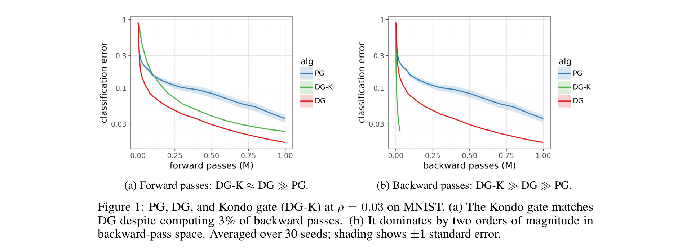
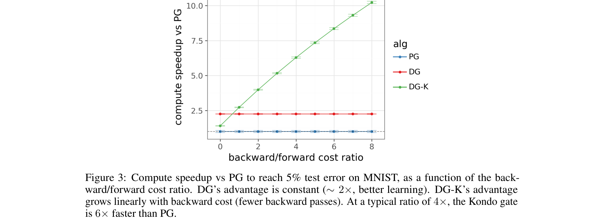
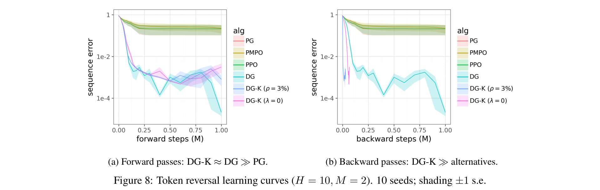
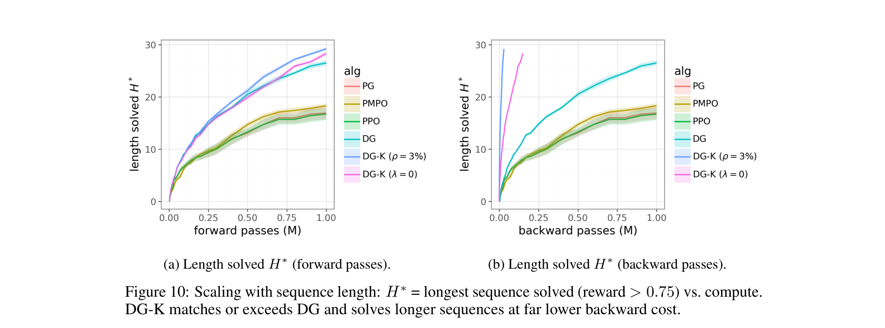

# Does This Gradient Spark Joy?

**Authors:** Ian Osband (Google DeepMind)
**Date:** March 20, 2026
**Paper:** [PDF](https://arxiv.org/pdf/2603.20526)
**Companion to:** [Delightful Distributed Policy Gradient](https://arxiv.org/abs/2603.20521)

---

## TL;DR

Most gradient computations in RL training are wasted — the backward pass is expensive, but most samples teach the model nothing new. This paper introduces the **Kondo gate** (named after Marie Kondo: "keep what sparks joy, discard the rest"), which uses delight (advantage x surprisal) from the cheap forward pass to decide whether to pay for the expensive backward pass. On MNIST at a 3% gate rate, it matches full DG in forward-pass space while using 100x fewer backward passes. On token reversal, DG-K solves sequences of length ~29 in the same backward compute that full DG needs for length ~27. The savings grow as problems get harder.

---

## Key Figures

### Figure 1: The Core Result — Forward vs. Backward Pass Efficiency

This single figure captures the entire paper. Left: when measured by forward passes (wall-clock proxy), DG-K (green) matches full DG (red). Both dominate PG (blue). Right: when measured by backward passes (the expensive part), DG-K dominates by two orders of magnitude — it reaches the same error with ~100x fewer backward passes. The Kondo gate is skipping 97% of backward passes while losing almost nothing.

### Figure 3: Compute Speedup Grows with Backward Cost

Total compute (forward + backward × cost ratio) to reach 5% test error on MNIST. DG's speedup over PG is a flat ~2x (it computes every backward pass). DG-K's speedup grows linearly: at a backward/forward cost ratio of 4x (typical for LLM training), DG-K is 6x faster than PG. At 8x ratio, it's 10x faster. The more expensive backward passes are, the more the Kondo gate saves.

### Figure 8: Token Reversal — Same Quality, Fraction of Backward Compute

On the transformer token-reversal task ($H=10$, $M=2$), DG and DG-K track almost identically in forward-pass space (left). In backward-pass space (right), DG-K collapses into a thin sliver at the left edge — reaching the same error with vastly fewer backward passes. PG, PPO, and PMPO are orders of magnitude worse in both views.

### Figure 10: Scaling — DG-K Wins on Both Axes

Longest sequence solved ($H^*$) vs. compute budget. Left (forward passes): DG-K matches or slightly exceeds full DG, both far ahead of baselines. Right (backward passes): DG-K at $\rho = 3\%$ solves $H^* \approx 29$ using the same backward budget that full DG needs for $H^* \approx 27$. The fixed gate wins on *both* axes simultaneously — best quality per forward pass *and* best quality per backward pass.

---

## Key Novel Ideas

### 1. The Kondo Gate: Skip the Backward Pass When Delight Is Low

The idea is simple. Policy gradient computes a backward pass for every sample. But most samples are uninformative — they either confirm what the model already knows or punish actions it already avoids. These samples have low delight (advantage × surprisal), meaning they're either unsurprising or unsuccessful (or both).

The Kondo gate uses delight as a screening signal. For each sample, it computes:
1. **Forward pass** (cheap): get action probabilities, compute delight $\chi_t = U_t \cdot \ell_t$
2. **Gate decision**: draw $G_t \sim \text{Bernoulli}(\sigma((\chi_t - \lambda)/\eta))$ — higher delight means higher probability of keeping
3. **Backward pass** (expensive): compute gradient *only if* $G_t = 1$

The price $\lambda$ is set adaptively: on each batch, it's the $(1-\rho)$-quantile of delight, so that roughly a fraction $\rho$ of samples get backward passes. Setting $\rho = 1$ recovers full DG; small $\rho$ skips most backward passes.

The update becomes:

$$\Delta \theta \propto \sum_{t \in B} G_t \cdot U_t \, \nabla_\theta \log \pi_\theta(A_t \mid \mathcal{H}_t)$$

This is formally derived from maximizing expected learning value minus compute cost plus an entropy term (Equation 1 in the paper), giving the sigmoid form $w^* = \sigma((\chi - \lambda)/\eta)$.

### 2. Zero-Price Gating Is a Pareto Improvement

At $\lambda = 0$ (the adaptive gate), the Kondo gate keeps all positive-delight samples and skips all negative-delight ones. The paper proves (Proposition 1) that for a K-armed bandit with softmax policy, this is a **Pareto improvement in gradient geometry**:

1. **Direction preserved**: $\mathbb{E}[g_\text{KG}] \propto \nabla_z J$ — the expected gradient still points in the right direction
2. **Perpendicular variance eliminated**: $\text{Var}_\perp(g_\text{KG}) = 0$ — all the noise that doesn't help is gone
3. **Compute reduced**: only $pB$ backward passes instead of $B$ (where $p$ is the probability of the correct action)
4. **PG needs $\Omega(1/p^2)$ backward passes for high cosine similarity; the Kondo gate achieves $\cos = 1$ from $O(\log(1/\delta))$**

In plain English: the gate keeps only the correct-action samples (which carry all the useful signal) and removes incorrect-action samples (which contribute only perpendicular noise). This preserves learning quality while eliminating most gradient computation.

### 3. Delight Is Better Than Simpler Priority Signals

Why use delight (the product of advantage and surprisal) rather than advantage alone, surprisal alone, or an additive mix $\alpha U + (1-\alpha)\ell$?

- **Advantage alone** measures usefulness but ignores rarity. A common success and a rare breakthrough get the same priority, even though the common one teaches nothing new.
- **Surprisal alone** measures rarity but ignores value. It prioritizes surprising failures that the learner already avoids.
- **Additive mix** $\alpha U + (1-\alpha)\ell$ interpolates between these two mistakes. Proposition 2 proves it's *sign-inconsistent*: it can rank a failing rare action above a succeeding common action. The critical threshold $\alpha^* = L/(1+L)$ where $L = \log(p(K-1)/(1-p))$ depends on the policy, requiring tuning.
- **Delight** (the product) targets the *intersection*: samples that are both valuable *and* surprising. Multiplying a positive number by a positive number preserves sign. Adding can flip it. Delight is sign-consistent without tuning.

### 4. The Gambling Pathology: When Delight Fails

The paper honestly identifies the failure mode. In a "gambling" regime — where a suboptimal action has high reward variance — a lucky draw on a bad action looks exactly like a genuine breakthrough: positive advantage, high surprisal, high delight. The gate opens for the wrong reason.

Formally (Proposition 3), for a two-armed bandit where arm 2 has Gaussian reward with noise $\sigma$:
- When $\sigma/\Delta \ll 1$ (low variance relative to gap): $\Pr(U_2 > 0 \mid A=2) \leq \exp(-\Omega(\Delta^2/\sigma^2))$ — false positives are exponentially rare
- When $\sigma/\Delta \gg 1$ (high variance): $\Pr(U_2 > 0 \mid A=2) = \Theta(1)$ — about half the time, the bad arm looks good

No per-sample statistic computed from $(R, \pi)$ can distinguish a genuine breakthrough from a lucky draw. The pathology requires *differential* noise — high variance concentrated on specific actions, not spread across all actions.

### 5. Speculative Decoding for Training

The paper draws an analogy to speculative decoding (used in inference): a cheap draft model screens candidates, and an expensive full model only runs on the ones worth keeping. The Kondo gate is the training counterpart: the cheap forward pass screens samples, and the expensive backward pass only runs on the informative ones.

Because DG tolerates approximate delight (robust to ~50% relative noise in delight estimation), the screening forward pass doesn't need full precision — quantized inference, a distilled model, or cached logits could work. This points toward a "speculative-decoding-for-training" paradigm.

---

## Key Results

### MNIST at $\rho = 0.03$ (3% gate rate)
- DG-K matches DG in forward-pass space (~3% error)
- DG-K uses **100x fewer backward passes** to reach the same error
- At backward/forward cost ratio of 4x: DG-K is **6x faster** than PG in total compute

### Token Reversal ($H=10$, $M=2$)

| Method | Final Error (fwd passes) | Final Error (bwd passes) |
|--------|-------------------------|-------------------------|
| PG | ~0.6 | ~0.6 |
| PPO | ~0.3 | ~0.3 |
| PMPO | ~0.1 | ~0.1 |
| DG | ~1e-4 | ~1e-4 |
| **DG-K ($\rho$=3%)** | **~1e-4** | **~1e-4 (at ~3% bwd budget)** |

### Scaling: Longest Sequence Solved $H^*$ (at 1M compute budget)

| Method | $H^*$ (forward) | $H^*$ (backward) |
|--------|-----------------|------------------|
| PG | ~5 | ~5 |
| PPO | ~8 | ~8 |
| PMPO | ~12 | ~12 |
| DG | ~27 | ~27 |
| **DG-K ($\rho$=3%)** | **~29** | **~29** |

DG-K matches or exceeds DG on both axes — it wins in quality per forward pass *and* quality per backward pass.

---

## Key Takeaways

1. **Most backward passes in RL training are wasted.** The forward pass already tells you whether a sample will teach the model anything useful. Delight (advantage × surprisal) is a cheap, effective signal for this decision.

2. **The Kondo gate achieves a Pareto improvement.** At zero price ($\lambda = 0$), it preserves the gradient direction, eliminates perpendicular noise, and reduces backward passes to $pB$ instead of $B$. This is not an approximation — it's provably better in direction and cheaper in compute.

3. **Savings grow with problem difficulty.** As sequences get longer and correct trajectories become rarer, more samples are uninformative. The gate's value increases precisely when compute matters most.

4. **Delight beats additive priority signals.** The product of advantage and surprisal is sign-consistent without tuning. Additive mixes $\alpha U + (1-\alpha)\ell$ require regime-dependent $\alpha$ and can mis-rank samples.

5. **Approximate delight is good enough.** DG tolerates ~50% relative noise in delight estimation; DG-K degrades earlier but still works with substantial noise. This enables cheap forward passes (quantized, distilled, cached) for screening.

6. **The gambling pathology is real but narrow.** When reward variance is high *and concentrated on specific actions* ($\sigma/\Delta \gg 1$), delight can't distinguish lucky draws from breakthroughs. Under homoskedastic (equal) noise, DG and PG degrade together smoothly.

7. **This is speculative decoding for training.** Just as speculative decoding uses a cheap draft model to skip expensive inference steps, the Kondo gate uses a cheap forward pass to skip expensive backward passes. The paradigm is: screen cheaply, compute expensively only when it matters.

8. **The fixed gate ($\rho = 3\%$) vs. adaptive gate ($\lambda = 0$) tradeoff matters.** The adaptive gate is safer — it works across all problem difficulties without tuning. The fixed gate gives larger savings when tuned per task but can be too aggressive at large vocabulary sizes.

---

## What's Open-Sourced

- **No code released** in this paper
- The algorithm is specified in Algorithm 1 (page 2) and requires minimal implementation: compute delight from the forward pass, set $\lambda$ as a quantile, sample a Bernoulli gate, skip backward pass when gate is 0
- Companion papers: [8] Osband 2025 (DG formulation), [9] Osband 2026 (distributed DG)
