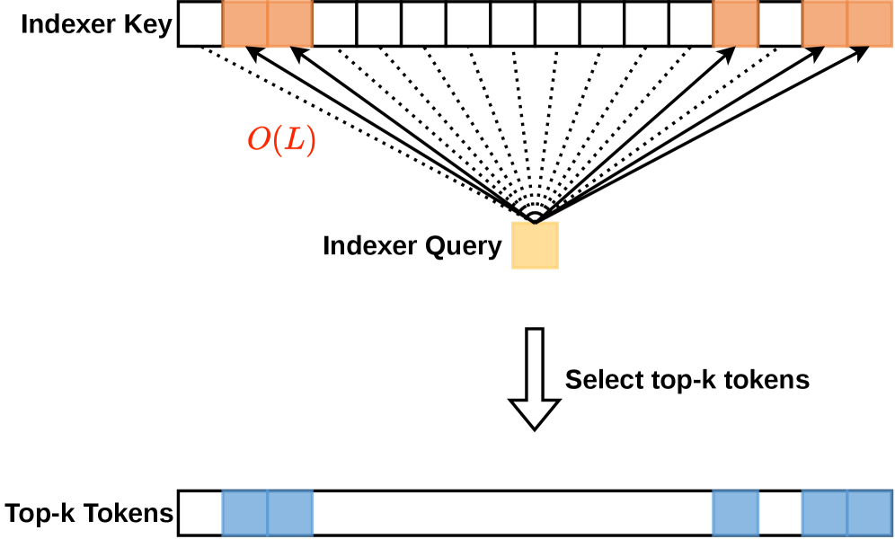
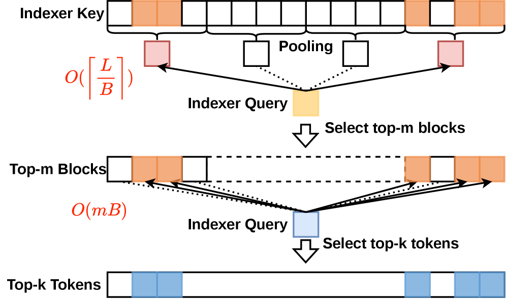
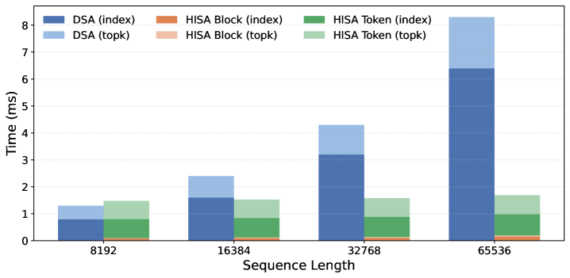
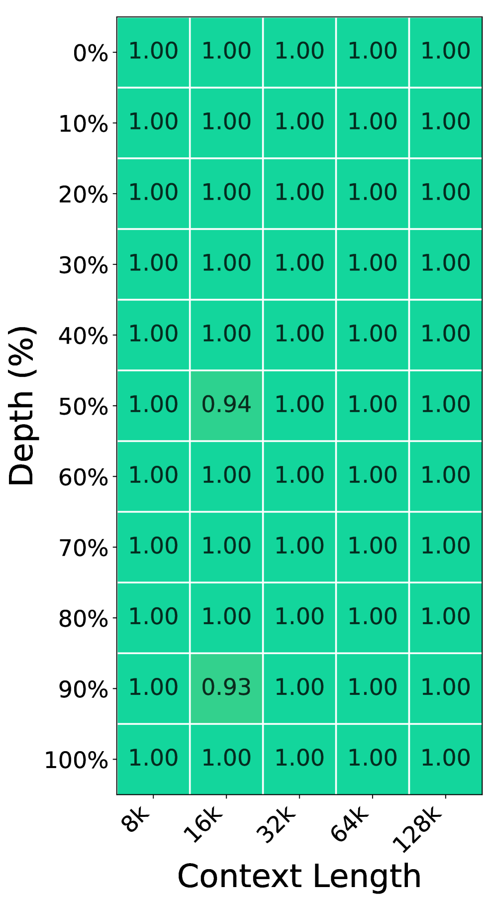
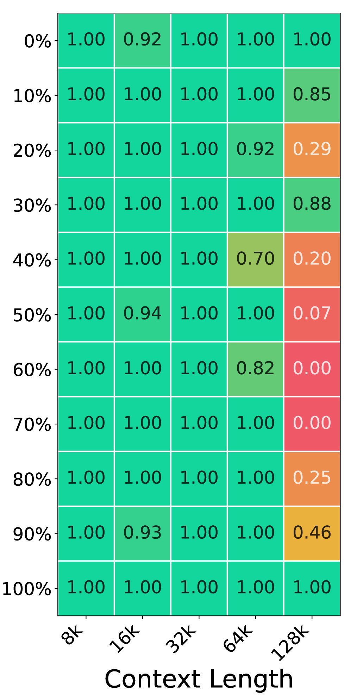
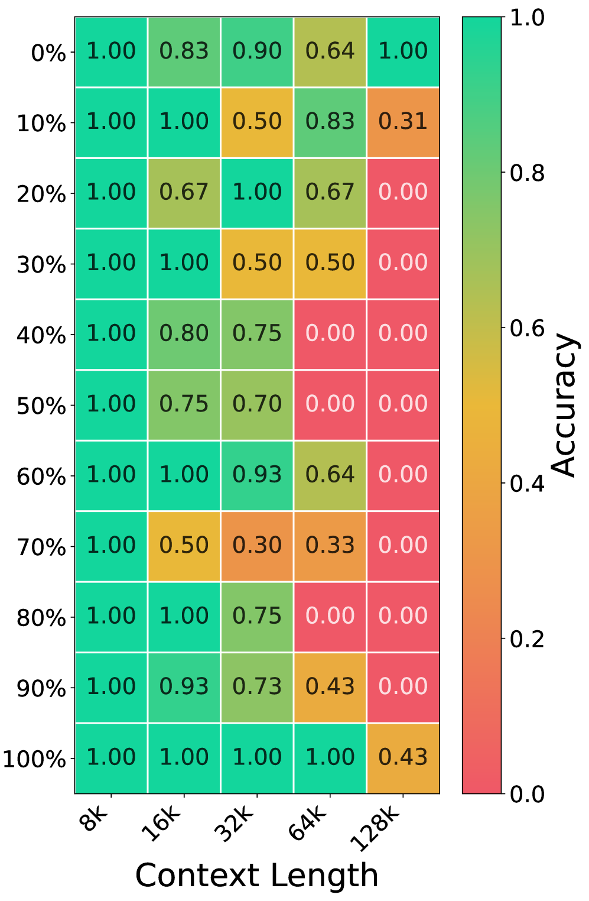
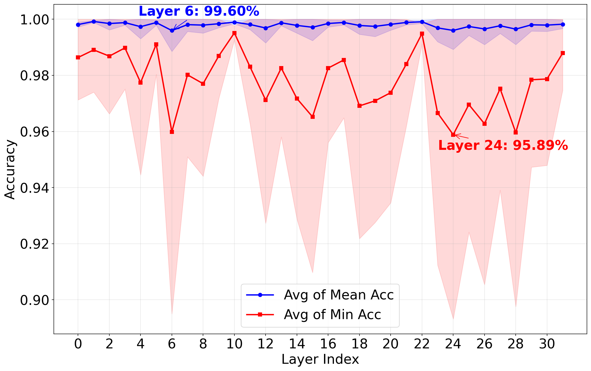
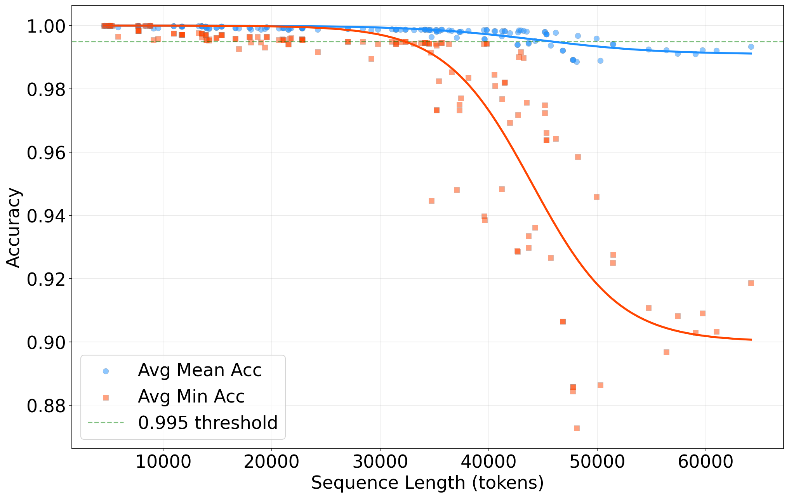
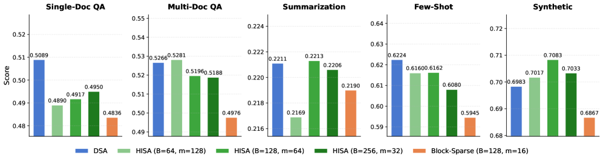

# HISA: Efficient Hierarchical Indexing for Fine-Grained Sparse Attention

**Authors:** Yufei Xu, Fanxu Meng, Fan Jiang, Yuxuan Wang, Ruijie Zhou, Jiexi Wu, Zhixin Pan, Zhaohui Wang, Xiaojuan Tang, Wenjie Pei, Tongxuan Liu, Di Yin, Xing Sun, Muhan Zhang

**Date:** March 30, 2026

**Affiliation:** Peking University

**Paper:** [PDF](https://arxiv.org/abs/2603.28458)

---

## TL;DR

Modern token-level sparse attention systems (like DeepSeek Sparse Attention) use a lightweight "indexer" to score every token in the context and pick the top-k most relevant ones. The problem: this indexer still has to scan the entire prefix for every query, which scales quadratically with context length. HISA fixes this by adding a cheap block-level pre-filter that eliminates most of the context before the expensive token-level scoring runs. The result is 2-4x faster indexing at 32K-128K contexts, with >99% of the same tokens selected as the original — and zero retraining needed.

---

## Key Figures

### Figure 1: DSA vs. HISA Indexing Architecture

#### (a) Original DSA: Flat Token Scan

The original DSA indexer works by having each query score **every single token** in the prefix (O(L) per query). It then picks the top-k highest-scoring tokens. This is simple and accurate, but the cost grows linearly with context length per query — and quadratically per layer when summed over all queries.

#### (b) HISA: Hierarchical Block-to-Token Search

HISA restructures this into two stages. First, it scores **pooled block summaries** (O(L/B) per query) to find the most promising regions. Then it runs the original token-level scorer **only inside those surviving blocks** (O(mB) per query). The output is identical in format — a per-query set of k token indices — so the downstream Sparse MLA operator needs zero modification.

### Figure 2: Kernel-Level Speedup

This bar chart shows the raw GPU kernel latency of the indexer at different context lengths (8K to 128K). HISA's advantage grows with context length: roughly 2x at 32K and 4x at 128K. The chart breaks down HISA's cost into its three sub-stages (block scoring, block filtering, token refinement), showing that the token refinement stage is bounded by mB=8192 tokens regardless of total context length.

### Figure 3: Needle-in-a-Haystack Results

#### (a) Original DSA

#### (b) HISA

#### (c) Block-Sparse Baseline

These heatmaps show retrieval accuracy across context lengths (x-axis: 4K-128K) and needle insertion depths (y-axis: 0%-100%). DSA achieves near-perfect recall everywhere. HISA closely matches it. The Block-Sparse baseline — which skips the token-level refinement stage — shows severe degradation at 64K-128K contexts, especially for needles placed in the middle of the context. This demonstrates why token-level selection matters: even when the right blocks are chosen, attending to all tokens within a block wastes budget on irrelevant ones.

### Figure 4a: IoU Across Layers

Mean IoU stays above 99% across all 32 layers. The minimum IoU (red line) dips lower at certain layers (e.g., layer 24 at ~95.9%), suggesting these layers have more diffuse attention patterns where the block pooling approximation is slightly less faithful.

### Figure 4b: IoU Across Context Lengths

Mean IoU remains above 99% even at the longest tested contexts. The minimum IoU (lower bound) stays above 90%, reflecting occasional boundary cases where an important token sits in a block whose mean-pooled representative doesn't stand out enough.

### Figure 5: Hyperparameter Sensitivity

All three HISA configurations (varying block size B and block count m, but same candidate pool mB=8192) closely track the original DSA across all five LongBench task categories. Block-Sparse consistently underperforms, with the largest gaps on Single-Doc QA (-1.1%) and Few-Shot (-2.2%).

---

## Key Novel Ideas

### 1. The Indexer Bottleneck Insight

The paper identifies a subtle but important problem that others had overlooked. In token-level sparse attention systems like DeepSeek-V3.2 and GLM-5, the **downstream attention** is already sparse and efficient — it only computes over the selected k tokens. But the **indexer** that decides *which* k tokens to attend to still has to look at every single token in the prefix. This means the indexer reintroduces the exact O(L^2) scaling that sparse attention was supposed to eliminate.

As context windows push from 32K toward 128K or 1M tokens, the indexer transitions from a cheap side-computation into the dominant cost. The paper frames this as a "search-path optimization" problem: can you get the same search result while taking a shorter search path?

### 2. Two-Stage Hierarchical Indexing

HISA replaces the flat scan with a coarse-to-fine hierarchy:

**Stage 1 — Block-Level Coarse Filter:**
- Partition the prefix into contiguous blocks of size B (e.g., 128 tokens)
- Compute a mean-pooled representative vector for each block from its indexing keys:

  $\tilde{\mathbf{k}}_b^I = \text{MeanPool}(\{\mathbf{k}_s^I \mid s \in \mathcal{B}_b\})$

- Score each block representative using the same query representations and gating weights as DSA:

  $J_{t,b} = \sum_{j=1}^{H^I} w_{t,j}^I \cdot \text{ReLU}((\mathbf{q}_{t,j}^I)^\top \tilde{\mathbf{k}}_b^I)$

- Keep the top-m blocks, plus always include the first block and last two blocks (for system prompts and recent tokens)

**Stage 2 — Token-Level Refinement:**
- Run the original DSA token-level scorer, but only on the tokens inside the surviving m blocks (at most mB tokens instead of L)
- Select the final top-k tokens from this reduced pool

The key insight is that the block scoring in Stage 1 reuses the exact same query representations and scoring formula as the original indexer — just applied to pooled keys instead of individual token keys. This is why no retraining is needed.

### 3. Training-Free Drop-In Replacement

HISA's output is the **exact same data structure** as DSA's output: a per-query set of k token indices. The downstream Sparse MLA operator sees no difference. This means:
- No retraining or fine-tuning required
- No changes to the attention mechanism
- No changes to the KV cache layout
- The pooled block keys can be incrementally maintained alongside the KV cache with negligible overhead

This "drop-in" property is practically important — it means any system already running DSA can swap in HISA without modifying anything else in the serving stack.

### 4. Forced Block Inclusion for Boundary Handling

HISA always forces the first block and the last two blocks into the candidate set, regardless of their scores. This serves two purposes:
- The first block typically contains system prompts and other globally important context
- The last blocks contain the most recent tokens, which are almost always relevant
- It simplifies boundary handling during batched prefill with packed sequences of varying lengths, where a single block may straddle two sequences

---

## Architecture Details

HISA is not a new model architecture — it's a **modification to the indexer component** within existing token-level sparse attention systems. The key hyperparameters are:

| Parameter | Symbol | Default | Description |
|-----------|--------|---------|-------------|
| Block size | B | 128 | Number of contiguous tokens per block |
| Block budget | m | 64 | Number of blocks retained after coarse filter |
| Token budget | k | 2048 | Final number of tokens selected per query |
| Candidate pool | mB | 8192 | Total tokens scored in Stage 2 |
| Indexing heads | H^I | (from DSA) | Number of lightweight indexing heads |
| Query chunk size | — | 1024 | Queries processed together in a chunk |

**Feasibility constraint:** mB >= k must hold (the candidate pool must be large enough to select k tokens from).

**Complexity comparison:**

| Method | Per-query cost | Per-layer cost |
|--------|---------------|----------------|
| Original DSA | O(L) | O(L^2) |
| HISA | O(L/B + mB) | O(L^2/B + LmB) |

When m << L/B (most blocks are pruned) and B << L (blocks are much smaller than context), HISA's cost is substantially lower.

---

## Training Pipeline

HISA does **not** involve any training. It is a purely inference-time replacement for the indexer module in existing sparse attention systems.

The experiments were conducted by:
1. Taking a pre-trained DeepSeek-V3.2 model (or DeepSeek-V2-Lite for ablations)
2. Directly replacing the DSA indexer with the HISA indexer at inference time
3. Running evaluation benchmarks without any fine-tuning

The pooled block keys are computed incrementally: as new tokens are added to the KV cache, their indexing keys are incorporated into the running mean of their respective block. This adds negligible overhead to the existing KV cache management.

The GPU kernels for both stages are implemented in TileLang, a composable tile-based programming model for GPU kernels.

---

## Key Results

### Kernel-Level Speedup

| Context Length | DSA Latency | HISA Latency | Speedup |
|---------------|-------------|--------------|---------|
| 32K | — | — | ~2x |
| 64K | — | — | ~3x |
| 128K | — | — | ~4x |

Config: query chunk=1024, B=128, m=64, k=2048. Measured on TileLang GPU kernels.

### Needle-in-a-Haystack (DeepSeek-V3.2, 4K-128K)

| Method | Performance |
|--------|------------|
| DSA (original) | Near-perfect across all positions/lengths |
| HISA | Closely matches DSA; marginal degradation at extreme lengths |
| Block-Sparse | Significant failures at 64K-128K, especially mid-context needles |

### LongBench (DeepSeek-V3.2)

| Method | Single-Doc QA | Multi-Doc QA | Summarization | Few-Shot | Synthetic |
|--------|--------------|-------------|---------------|----------|-----------|
| DSA (original) | ~0.498 | ~0.527 | ~0.222 | ~0.616 | ~0.770 |
| HISA (B=128, m=64) | ~0.495 | ~0.520 | ~0.520 | ~0.614 | ~0.770 |
| Block-Sparse (B=128, m=16) | ~0.484 | ~0.510 | ~0.214 | ~0.489 | ~0.685 |

HISA scores stay within ~2% of DSA on all tasks. Block-Sparse shows larger gaps, particularly on Few-Shot (-2.2%) and Single-Doc QA (-1.1%).

### Selection Consistency (IoU)

| Metric | Value |
|--------|-------|
| Mean IoU (across all layers) | >99% |
| Minimum IoU (worst case per query) | >90% |

Measured on DeepSeek-V2-Lite with LongBench inputs. The >99% mean IoU means HISA almost always selects the exact same tokens as the original exhaustive indexer.

---

## Key Takeaways

1. **The indexer is the new bottleneck.** In token-level sparse attention systems, the downstream attention is already efficient. The indexer — which must scan the entire prefix to decide which tokens to attend to — reintroduces O(L^2) scaling and becomes the dominant cost at long contexts.

2. **Coarse-to-fine search is remarkably effective.** Mean-pooling over blocks of 128 tokens produces a representative vector that is good enough to identify the right regions >99% of the time. This is because attention is highly non-uniform: most blocks are completely irrelevant to any given query.

3. **Token-level refinement is essential.** Block-Sparse methods (which skip Stage 2) show clear quality degradation, especially on retrieval tasks at long contexts. The ability to prune low-relevance tokens *within* relevant blocks is what preserves quality.

4. **No retraining needed.** HISA achieves its results as a pure inference-time swap. This is possible because it reuses the exact same query representations and scoring formula as the original DSA indexer — just applied to pooled keys first. The downstream operator is completely untouched.

5. **The speedup grows with context length.** At 32K, HISA is ~2x faster; at 128K, ~4x. This scaling behavior follows directly from the complexity analysis: the flat scan's O(L^2) cost grows faster than HISA's O(L^2/B + LmB).

6. **The B=128, m=64 configuration is a good default.** The hyperparameter sensitivity study shows all three tested configurations (same mB=8192, different B/m splits) perform similarly, but B=128, m=64 offers the best overall balance across task types.

7. **Forced inclusion of first/last blocks is a practical design choice.** Always keeping the first block (system prompts) and last two blocks (recent context) avoids common failure modes and simplifies batched inference with packed sequences.

8. **The ~10% IoU floor reflects a real limitation.** When a block straddles a semantic boundary (e.g., topic shift), the mean-pooled vector can fail to represent an important outlier token. The authors suggest overlapping blocks, adaptive boundaries, or max-pooling as potential mitigations.

9. **Kernel speedup != end-to-end speedup.** The paper is transparent that these are indexer-only measurements. In a full serving system, other components (Sparse MLA, KV cache loading, inter-layer communication) also contribute to latency. However, as contexts grow longer, the indexer's share of total cost increases, making HISA increasingly impactful.

10. **This is analogous to IVF in vector search.** The coarse-to-fine strategy mirrors inverted file indexing (IVF) used in billion-scale approximate nearest-neighbor search (e.g., FAISS). But unlike ANN methods that approximate the attention itself, HISA only approximates the *search path* — the actual attention computation over the selected tokens remains exact.

---

## What's Open-Sourced

The paper references TileLang GPU kernel implementations, with the DSA reference implementation available at the [TileLang examples repository](https://github.com/tile-ai/tilelang/tree/main/examples/deepseek_v32). No dedicated HISA code repository or model checkpoints were released at the time of publication.
