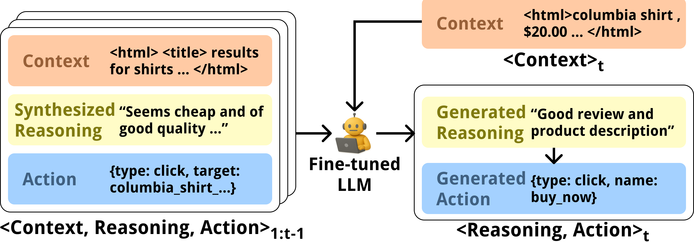
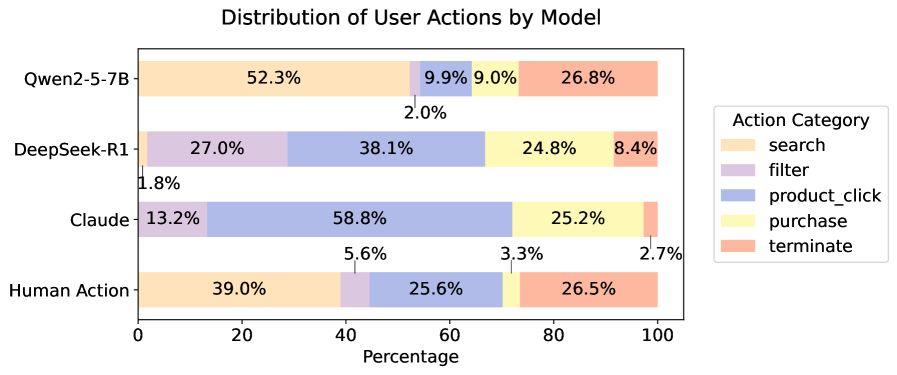
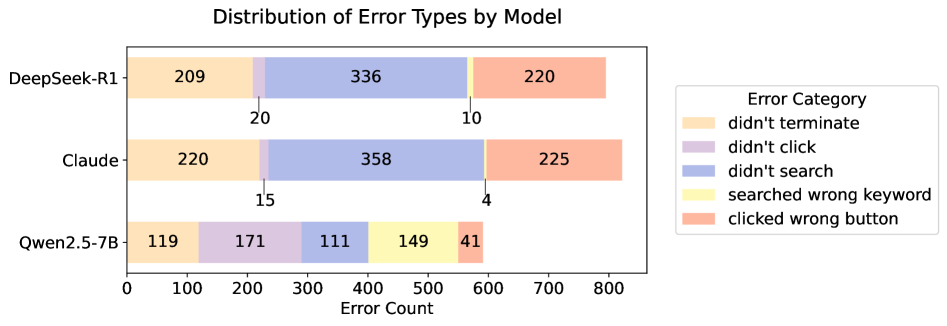
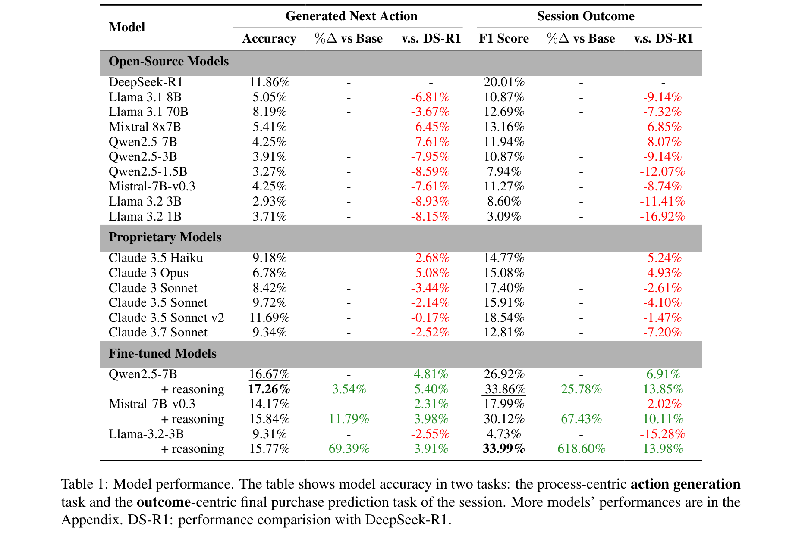

# Can LLM Agents Simulate Multi-Turn Human Behavior? Evidence from Real Online Customer Behavior Data

**Authors:** Yuxuan Lu, Jing Huang, Yan Han, Bingsheng Yao, Sisong Bei, Jiri Gesi, Yaochen Xie, Zheshen (Jessie) Wang, Qi He, Dakuo Wang
**Affiliations:** Amazon, Northeastern University
**Date:** March 26, 2025 (v7)
**Paper:** [PDF](https://arxiv.org/abs/2503.20749)

---

## TL;DR

This paper asks a fundamental question: Can LLMs actually predict what a specific real human will do next when shopping online? The answer is sobering. Using 31,865 real shopping sessions (230,965 actions) from a major e-commerce platform, the best prompt-based LLM (DeepSeek-R1) achieves only **11.86% accuracy** at predicting the next user action. Fine-tuning Qwen2.5-7B on real click-through data with synthesized reasoning traces raises this to **17.26%** -- a significant improvement but still meaning the model is wrong ~83% of the time. This paper establishes the first rigorous benchmark for action-level human behavior simulation, provides the data pipeline for the subsequent Shop-R1 paper, and reveals that LLMs are far more "believable" than they are "accurate."

---

## Key Figures

### Figure 1: Task Overview

The next action prediction task. At each step, the model receives the current webpage context (simplified HTML) and the full history of previous ⟨context, reasoning, action⟩ tuples. It must predict the next reasoning and action. Since real-world data has no ground-truth reasoning, the authors synthesize reasoning traces using Claude 3.5 Sonnet to create ⟨context, action, reasoning⟩ triplets for training.

### Figure 2: Action Distribution Comparison

The most revealing figure. Real humans (left) rarely use filters and rely heavily on iterative search (averaging 2.82 searches per session -- 7x more than filter actions). In contrast, prompt-based LLMs like Claude and DeepSeek-R1 overuse filters, rarely revise search queries, and produce disproportionately high purchase rates. Fine-tuned models (right) much more closely match the human distribution. This explains why LLMs seem "believable" (they complete tasks) but aren't "accurate" (they don't match how real humans actually behave).

### Figure 3: Error Type Analysis

Error decomposition across three models. The dominant failure mode for prompt-based models (Claude, DeepSeek-R1) is "Didn't terminate" -- they continue shopping or purchase when the real human would have closed the browser. This aligns with the hypothesis that LLMs are trained to complete tasks, not to quit when a real user would. Fine-tuned Qwen2.5-7B has a more balanced error profile and better captures termination behavior.

### Figure 4: Main Results Table

The comprehensive results table. Three sections: open-source models (prompt-based), proprietary models (prompt-based), and fine-tuned models. Key numbers: DeepSeek-R1 at 11.86% action accuracy, Claude 3.5 Sonnet v2 at 11.69%. Fine-tuned Qwen2.5-7B with reasoning traces reaches 17.26% (+5.4% over DeepSeek-R1, p < 10⁻¹⁰). For session outcome prediction (purchase vs. terminate), fine-tuned Llama-3.2-3B with reasoning achieves 33.99% F1, and Qwen2.5-7B 33.86% F1 (+13.85% over prompt baselines).

---

## Key Novel Ideas

### 1. First Quantitative, Process-Centric Benchmark for Human Behavior Simulation

Prior work evaluated LLM agents on either:
- **Subjective believability** -- "do human raters think it looks realistic?" (Park et al., 2023)
- **Outcome-centric accuracy** -- "did the agent complete the task?" (WebArena, WebShop)

This paper introduces **process-centric, action-level accuracy** -- "did the agent predict the exact next action the human actually took?" This is a much harder bar. You don't just need to reach the goal; you need to follow the specific path the human took.

**Dataset:** 31,865 sessions from 3,526 users on a major e-commerce platform, containing 230,965 user actions. Each action is a ⟨context, action⟩ pair where context is simplified HTML and action is click/type_and_submit/terminate with specific targets.

**Why this matters:** If LLM agents are being used for UX testing (UXAgent), A/B testing (Agent A/B), and user modeling, the field needs to know how accurately they reproduce *actual* human behavior, not just whether they seem plausible. This paper provides that ground truth.

### 2. Synthesized Reasoning Traces Improve Action Prediction

Real-world click-through data has actions (what the user did) but no reasoning (why they did it). The authors use Claude 3.5 Sonnet to generate reasoning traces for each action, guided by the context and action pair.

**Key result from ablation:**
- Qwen2.5-7B without reasoning: 16.67% action accuracy, 26.92% F1
- Qwen2.5-7B **with reasoning**: 17.26% action accuracy (+3.54%), 33.86% F1 (+25.78%)
- Llama-3.2-3B without reasoning: 15.84% action accuracy, 30.12% F1
- Llama-3.2-3B **with reasoning**: 15.77% action accuracy (-0.44%), 33.99% F1 (+67.43%)

Reasoning traces consistently improve session outcome prediction (F1) by 25-600%+ across models. The effect on action accuracy is more mixed -- some models improve, others are flat. But for F1, the gains are universal and large.

**Why it works:** Reasoning traces provide "intermediate supervision" that helps the model understand *why* an action makes sense in context. This is analogous to chain-of-thought improving math performance -- the model learns not just the answer but the reasoning process.

### 3. LLMs Are "Believable" But Not "Accurate" -- And These Are Different Things

The paper's most important conceptual contribution is distinguishing:
- **Believability**: "Does it seem like a human?" (subjective, qualitative)
- **Accuracy**: "Does it match what the actual human did?" (objective, quantitative)

Existing LLM agents score high on believability but only 11.86% on accuracy. The specific misalignments are:
- LLMs **over-purchase**: They're trained to complete tasks, so they buy more than real humans
- LLMs **under-search**: They stick with initial queries instead of iterating like humans do
- LLMs **over-filter**: They use filters excessively, while real humans prefer search refinement
- LLMs **under-terminate**: They don't quit when real humans would close the browser

These biases likely come from training on web agent benchmarks (WebShop, WebArena) that reward task completion, not behavioral fidelity.

---

## Architecture Details

| Component | Details |
|---|---|
| **Task** | Next action prediction in multi-turn shopping sessions |
| **Dataset** | 31,865 sessions, 3,526 users, 230,965 actions |
| **Outcomes** | 4,432 purchase actions, 27,433 termination actions |
| **Action space** | 3 types: click, type_and_submit, terminate |
| **Context format** | Simplified HTML (scripts/CSS/visual-only removed) |
| **Element identification** | Hierarchical natural language names (e.g., columbia_shirt.view_product) |
| **Reasoning synthesis** | Claude 3.5 Sonnet with think-aloud examples as ICL |
| **Fine-tuned models** | Qwen 2.5 (0.5B, 1.5B, 3B, 7B), Llama 3.2 (1B, 3B), Mistral 7B |
| **Prompt baselines** | DeepSeek-R1, Claude (3.5 Haiku/Opus/Sonnet), Llama 3.1 (8B/70B) |
| **Max context** | 40K tokens |
| **Training** | 1 epoch, lr=2e-5, cosine scheduler, FSDP on 64 H200 GPUs |
| **Compute** | ~3,700 H200 GPU hours total |

---

## Training Pipeline

1. **Data collection**: Real shopping sessions from a major e-commerce platform. Users opted in to data collection. Data anonymized.

2. **Context construction**: Raw HTML → simplified HTML (remove scripts, CSS, visual-only elements). Interactable elements get hierarchical natural language names.

3. **Reasoning synthesis**: For each ⟨context, action⟩ pair, Claude 3.5 Sonnet generates a reasoning trace explaining why the user would take that action. Real think-aloud shopping sessions are used as in-context examples.

4. **Training format**: Full session (context, reasoning, action sequence) concatenated as single input. Loss computed only on reasoning + action tokens (context tokens masked).

5. **Fine-tuning**: Standard SFT for 1 epoch on 64 H200 GPUs with FSDP. ~3 hours per job.

6. **Inference**: Autoregressive -- model receives ground-truth history, generates reasoning, then generates action.

---

## Key Results

### Prompt-Based Models (Action Accuracy / Session Outcome F1)

| Model | Action Accuracy | F1 Score |
|---|---|---|
| DeepSeek-R1 | **11.86%** | **20.01%** |
| Claude 3.5 Sonnet v2 | 11.69% | 18.84% |
| Claude 3.5 Haiku | 9.18% | 14.77% |
| Llama 3.1 70B | 8.19% | 12.69% |
| Llama 3.1 8B | 5.05% | 10.87% |
| Qwen2.5-7B (ICL) | 4.25% | 11.94% |

### Fine-Tuned Models (Action Accuracy / Session Outcome F1)

| Model | Action Accuracy | F1 Score | vs. DS-R1 (Acc) | vs. DS-R1 (F1) |
|---|---|---|---|---|
| Qwen2.5-7B + reasoning | **17.26%** | 33.86% | +5.40% | +13.85% |
| Qwen2.5-7B (no reasoning) | 16.67% | 26.92% | +4.81% | +6.91% |
| Mistral-7B + reasoning | 15.77% | 33.99% | +3.91% | +13.98% |
| Llama-3.2-3B + reasoning | 15.77% | 33.99% | +3.91% | +13.98% |
| Qwen2.5-3B + reasoning | 15.77% | 33.99% | +3.91% | +13.98% |

All fine-tuned models significantly outperform their own ICL variants (p < 10⁻⁵, McNemar's test).

### Reasoning Trace Ablation

| Model | With Reasoning (Acc / F1) | Without Reasoning (Acc / F1) | Δ Acc | Δ F1 |
|---|---|---|---|---|
| Qwen2.5-7B | 17.26% / 33.86% | 16.67% / 26.92% | +3.54% | +25.78% |
| Mistral-7B-v0.3 | 14.17% / 17.99% | 14.25% / 11.27% | -0.56% | +59.5% |
| Llama-3.2-3B | 15.84% / 30.12% | 11.79% / 3.98% | +34.3% | +656.8% |
| Llama-3.2-1B | 9.31% / 4.73% | 15.77% / 33.99% | negative | huge gain |

Reasoning traces provide the largest gains on session outcome prediction (F1), with more modest/mixed effects on action accuracy.

---

## Key Takeaways

1. **Out-of-the-box LLMs achieve only ~12% accuracy at predicting real human shopping actions.** This is the paper's headline finding. DeepSeek-R1 (the best) gets 11.86%. This means if you use an LLM agent for A/B testing or UX simulation without fine-tuning, ~88% of the agent's actions don't match what a real human would do.

2. **Fine-tuning on real click-through data raises accuracy to ~17%.** A +5.4% absolute improvement (p < 10⁻¹⁰). Still only correct 1 in 6 times, but the improvement is consistent and statistically significant across all models.

3. **Reasoning traces dramatically improve session outcome prediction.** F1 for purchase-vs-terminate classification jumps by 25-600% with reasoning traces. This suggests that explicit reasoning helps the model understand the decision dynamics that determine whether a session ends in purchase or abandonment.

4. **LLMs over-purchase and under-terminate relative to real humans.** The most consistent behavioral misalignment: LLMs are biased toward completing tasks (buying) rather than abandoning sessions (closing browser). This likely comes from web agent benchmarks that reward task completion.

5. **LLMs under-search and over-filter relative to real humans.** Real humans iterate through search queries (2.82 searches/session), correcting typos and refining keywords. LLMs tend to stick with the initial query and use filters instead. This is a qualitative behavioral difference that fine-tuning partially corrects.

6. **"Believable" ≠ "Accurate" -- and the gap is large.** Prior work showed LLM agents are "believable." This paper shows they are only ~12% accurate. These are different metrics, and the gap should inform how we use LLM agents in downstream applications.

7. **Larger models perform better at behavior simulation.** Consistent scaling: 7B models outperform 3B, which outperform 1B, both in ICL and fine-tuned settings. DeepSeek-R1 (reasoning-focused) outperforms same-size instruction-tuned models.

8. **This paper establishes the data pipeline for Shop-R1.** The dataset, task formulation, action space, reasoning synthesis approach, and SFT baseline are all reused in Shop-R1, which then adds RL on top. The 16.76% SFT accuracy here becomes Shop-R1's SFT baseline that RL improves to 27.72%.

9. **The dataset is proprietary and cannot be released.** A significant limitation: the entire evaluation uses data from a major e-commerce platform that cannot be shared. This means nobody can independently reproduce the results or directly compare against them.

10. **Irrational human behavior is a fundamental challenge.** The paper acknowledges that some human actions are semi-random, include typos, or reflect subconscious decisions that even the same person wouldn't replicate. A model that's "more rational" than the human could score low on action accuracy while actually being a better decision-maker. Future metrics should distinguish rational mismatches from irrational ones.

---

## What's Open-Sourced

- **Dataset: NOT released** (proprietary, from a major e-commerce platform). Users opted into a beta testing feature for data collection.
- **Code: NOT mentioned** as being released.
- **Models: NOT released** (fine-tuned versions of open-source models on proprietary data).
- **Reasoning synthesis pipeline:** Described in detail (using Claude 3.5 Sonnet with think-aloud examples), but no code released.
- **Simplified HTML format:** Described in the paper and can be reconstructed from the description.
- The paper references **OPeRA** (Wang et al., 2025) as a related public dataset for shopping behavior evaluation.
