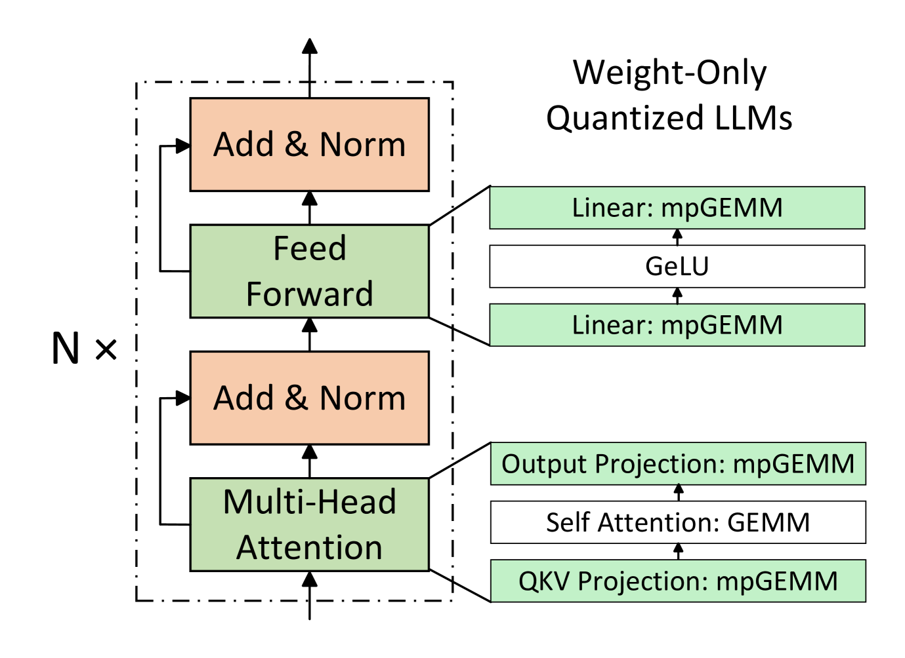
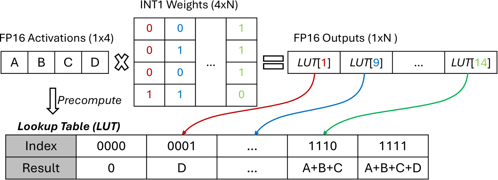
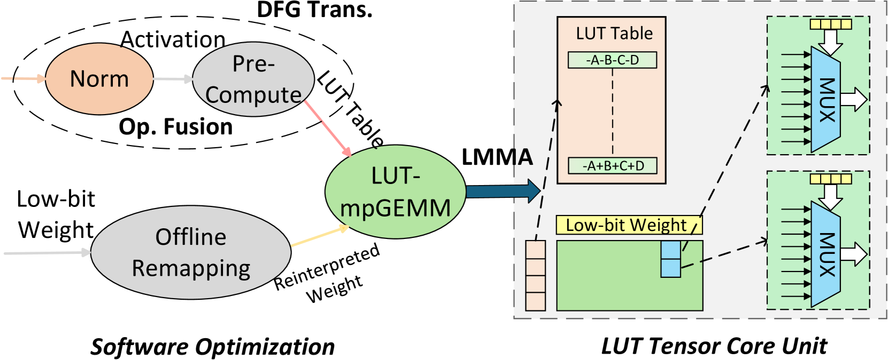
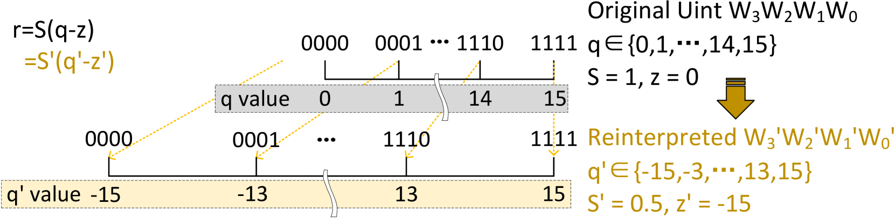
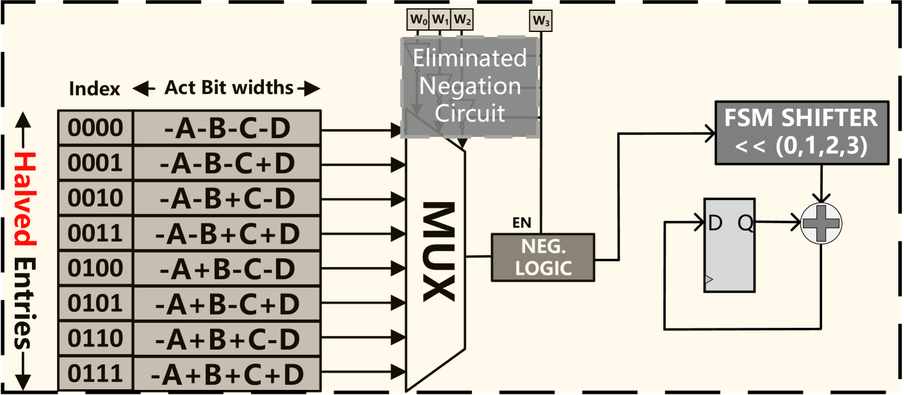
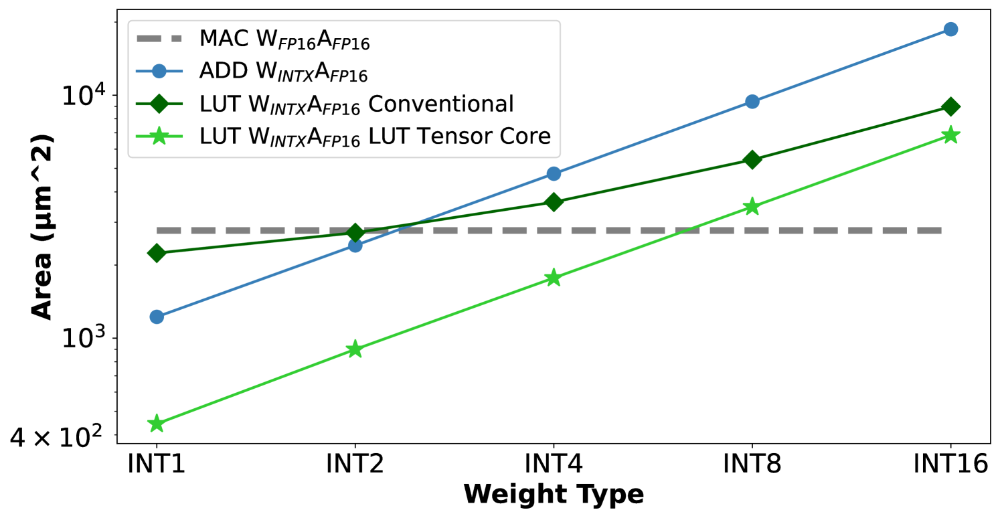
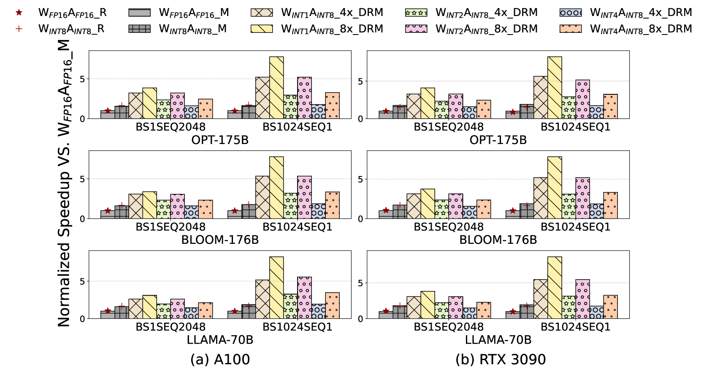
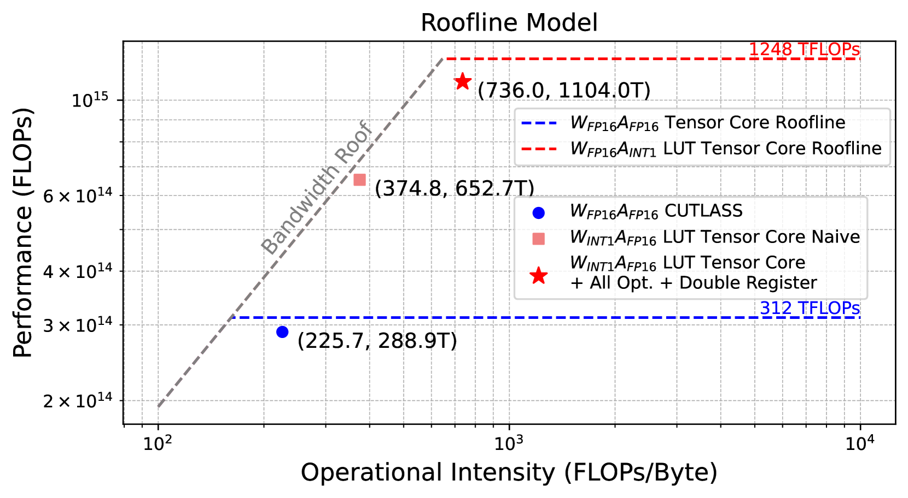

# LUT Tensor Core: Lookup Table Enables Efficient Low-Bit LLM Inference Acceleration

- **Authors:** Zhiwen Mo*, Lei Wang*, Jianyu Wei*, Zhichen Zeng*, Shijie Cao (corresponding), Lingxiao Ma, Naifeng Jing, Ting Cao, Jilong Xue, Fan Yang, Mao Yang
- **Affiliations:** Imperial College London, Peking University, USTC, University of Washington, Shanghai Jiao Tong University, Microsoft Research
- **Venue:** ISCA 2025 (52nd Annual International Symposium on Computer Architecture)
- **Date:** August 12, 2024 (preprint); June 2025 (conference)
- **Link:** [https://arxiv.org/abs/2408.06003](https://arxiv.org/abs/2408.06003)
- **Code:** [https://github.com/microsoft/T-MAC/tree/LUTTensorCore_ISCA25](https://github.com/microsoft/T-MAC/tree/LUTTensorCore_ISCA25)

---

## TL;DR

LUT Tensor Core is a software-hardware co-design that replaces multiply-accumulate (MAC) operations in low-bit LLM inference with lookup table (LUT) operations. Current GPUs cannot natively perform mixed-precision matrix multiplication (e.g., INT2 weights x FP16 activations), forcing costly dequantization. LUT Tensor Core precomputes all possible dot products into a table, then retrieves results via cheap lookups, achieving 4-6x power/area reduction over conventional Tensor Cores and up to 5.51x end-to-end inference speedup on BitNet/LLAMA models.

---

## Key Figures

### Figure 1: The Mixed-Precision GEMM Problem in LLM Inference

Decoder-only transformer blocks in LLMs. The key operations -- QKV projection, output projection, and feed-forward layers -- are all GEMM operations. With weight quantization, these become mixed-precision GEMMs (mpGEMM), where low-bit weights (INT1/2/4) are multiplied with high-precision activations (FP16/INT8). Current hardware does not natively support this mismatch.

### Figure 2: How LUT-Based mpGEMM Works

A concrete example of LUT-based mpGEMM for FP16 activations and INT1 weights. Given a 1x4 activation vector [A,B,C,D] and a 4xN INT1 weight matrix, you precompute all 2^4 = 16 possible dot products (e.g., index 0001 = D, index 1110 = A+B+C). Each output element is a single table lookup instead of 4 multiply-adds. The table is reused across all N weight columns, amortizing the precomputation cost.

### Figure 3: LUT Tensor Core Workflow

The full system design. Software handles two optimizations: (1) operator fusion merges table precomputation with the preceding normalization layer to eliminate extra memory traffic; (2) offline weight reinterpretation maps {0,1} to {-1,1}, enabling table symmetrization that halves storage. The hardware side provides MUX-based lookup units with bit-serial support for flexible precision. The compilation stack generates LMMA instructions for tile-based scheduling.

### Figure 4: Weight Reinterpretation for Table Symmetry

The key insight that halves table size. By reinterpreting 4-bit unsigned integers from {0,...,15} to symmetric {-15,-13,...,13,15}, the lookup table becomes an odd function: LUT[index] = -LUT[bitwise-NOT(index)]. This means you only need to store half the entries (2^(K-1) instead of 2^K) and use a simple negation based on the sign bit.

### Figure 5: Optimized LUT Unit with Bit-Serial Design

The hardware design for a single LUT processing element. The halved table (8 entries instead of 16 for K=4) feeds into a MUX. The sign bit (W3) controls a negation logic block. A bit-serial FSM shifter processes multi-bit weights one bit at a time, enabling support for INT1/2/4 weights with the same circuit. This is significantly simpler than a conventional MAC unit.

### Figure 6: Area Scaling -- LUT Tensor Core vs. Conventional Designs

Area comparison of MAC, ADD (bit-serial addition), conventional LUT, and LUT Tensor Core designs across different weight bit-widths. The conventional LUT design (dark green diamonds) actually loses its area advantage above 2-bit weights due to table storage overhead. LUT Tensor Core (light green stars) stays below the MAC baseline (dashed gray) up to 6-bit weights, thanks to the software-hardware co-design that offloads table overhead.

### Figure 7: End-to-End LLM Inference Speedups

Speedup of LUT Tensor Core over conventional FP16 Tensor Cores on OPT-175B, BLOOM-176B, and LLAMA2-70B. The "DRM" (Double Register Modeling) configurations at 4x and 8x array sizes show up to 8.2x speedup for W_INT1 models, while occupying only 38.3% of the conventional Tensor Core area. Even 1-bit weights with INT8 activations show substantial gains.

### Figure 8: Roofline Analysis

Roofline chart comparing conventional W_FP16 A_FP16 and LUT-based W_INT1 A_FP16 Tensor Cores on A100 memory system. The naive LUT implementation (orange square) is memory-bound. Through weight reinterpretation (halving table size), elongated tiling (better data reuse), and thread block swizzling (higher L2 hit rate), the optimized LUT Tensor Core (red star) reaches near the ridge point with 1104 TFLOPs -- 3.8x higher than the CUTLASS baseline at 288.9 TFLOPs.

---

## Key Novel Ideas

### 1. LUT-Based Mixed-Precision GEMM (mpGEMM)

The core idea replaces multiplication in matrix multiply with table lookups. For a dot product of K activation elements with K weight bits:

- Precompute all 2^K possible dot product results into a lookup table
- Each dot product becomes a single table lookup indexed by the K-bit weight

This works because low-bit weights have very few distinct values. For K=4 with 1-bit weights, there are only 16 possible dot products.

### 2. Table Symmetrization via Weight Reinterpretation

The paper's most elegant contribution. By remapping quantized weights from unsigned {0, 1, ..., 2^K - 1} to signed symmetric form {-(2^K - 1), ..., -1, 1, ..., 2^K - 1}:

r_w = s_w(q_w - z_w) = s'_w(q'_w - z'_w)

where q'_w = 2*q_w - (2^K - 1), s'_w = s_w/2, z'_w = 2*z_w + 1 - 2^K.

This creates an odd-function symmetry in the lookup table:

LUT[W3 W2 W1 W0] = -LUT[~(W3 W2 W1 W0)]

Result: table size drops from 2^K to 2^(K-1) entries. For K=4, this means 8 entries instead of 16. This halves the MUX size, halves the broadcasting bandwidth, and halves the register storage -- all with zero accuracy loss because the transformation is mathematically equivalent.

### 3. DFG Transformation and Operator Fusion for Table Precompute

Conventional LUT hardware places a precompute unit next to each LUT unit, causing massive redundancy. For a [4096, 12288] x [12288, 12288] GEMM in OPT-175B with array size N=4, each table is redundantly computed 12288/4 = 3072 times.

LUT Tensor Core splits precomputation into an independent operator in the dataflow graph (DFG). This enables one-time precomputation that broadcasts to all LUT units. The precompute operator is then fused with the preceding element-wise operator (e.g., LayerNorm), reducing the overhead from 16-24% down to ~2.5%.

### 4. Table Quantization

For high-precision activations (FP16), the precomputed table entries are quantized to INT8. This is more effective than traditional activation quantization because it operates on the dot products (groups of 8 entries for K=4), enabling finer-grained quantization. Experiments show negligible accuracy degradation: WikiText-2 perplexity only changes from 7.68 to 7.69 for LLAMA2-7B W_INT2.

### 5. Elongated Tiling Shape (M2N64K4)

Conventional GPU Tensor Cores use roughly square tiles (e.g., M8N4K16 for A100 INT8). LUT-based Tensor Cores need a fundamentally different shape:

- K must be small (K=4 is optimal): Table size grows exponentially as 2^(K-1)
- N must be large (N=64 or 128): Each table entry is broadcast to N MUX units for reuse
- M should be small (M=2): Minimizes total table storage (M x 2^(K-1) entries)

The total table size is: M x 2^(K-1) x LUT_BIT

The optimal M2N64K4 configuration yields an elongated tile where the overall bit-width approximates a square: M dimension = 2 x 16 = 32 bits, N dimension = 64 x 1 = 64 bits.

### 6. LMMA Instruction Set

A new instruction format extending GPU MMA instructions:

    lmma_{M}{N}{K}{A_dtype}{W_dtype}{Accum_dtype}{O_dtype}

Each LMMA instruction is scheduled to a warp and computes:
O[M,N] = A[M,K] x W[N,K] + Accum[M,N]

This enables integration with existing tile-based DNN compilers (TVM, Roller, Welder) for end-to-end LLM compilation.

---

## Architecture Details

### Microarchitecture

The LUT-based Tensor Core consists of:

1. **Tables**: M lookup tables, each with 2^(K-1) entries (after symmetrization). Entries are precomputed dot products stored at INT8 precision (after table quantization).

2. **MUX-based Processing Elements (PEs)**: M x N PEs arranged in a grid. Each PE contains a multiplexer that selects a table entry based on the K-bit weight index. The sign bit (MSB of weight) controls a negation logic block.

3. **Bit-serial FSM**: Processes W_BIT weight bits over W_BIT cycles. A shift-and-accumulate circuit handles multi-bit weights (INT2, INT4) by iterating bit-by-bit through the same single-bit LUT circuit.

4. **Table broadcasting**: Each of the M tables broadcasts its 2^(K-1) entries to N MUX units along the N dimension ("table shared parallelism"). Each set of K-bit grouped binary weights broadcasts to M MUX units along the M dimension ("query shared parallelism").

### Integration with GPU Architecture

LUT Tensor Core replaces the MAC-based Tensor Core within each SM (Streaming Multiprocessor) of an NVIDIA GPU. The existing CUDA Cores handle table precomputation (fused with previous operators). The LMMA instructions are exposed through the same warp-level programming model.

In the Accel-Sim evaluation, the LUT Tensor Core occupies only 14.3-16% of the area of an A100 FP16 Tensor Core, enabling fitting 4-8x more LUT Tensor Cores in the same chip area.

---

## Training Pipeline

This paper focuses exclusively on **inference acceleration**. The authors note that while LUT Tensor Core's mpGEMM approach applies to the forward pass of low-bit training, the backward pass requires higher-precision computation for gradients and optimizer states, which is not compatible with the current LUT design. Extending to training is listed as future work.

The weight quantization itself uses existing methods:
- **Post-training quantization (PTQ)**: 4-bit (GPTQ, AWQ)
- **Quantization-aware training (QAT)**: 2-bit (BitDistiller)
- **Training from scratch**: 1-bit / 1.58-bit (BitNet)

---

## Key Results

### Hardware PPA (Power, Performance, Area) at Dot Product Level

| Configuration | Compute Density (TFLOPs/mm^2) | Power Consumption |
|---|---|---|
| MAC W_FP16 A_FP16 | 3.39 | Baseline |
| ADD W_INT1 A_FP16 | ~20 | Lower than MAC |
| LUT W_INT1 A_FP16 | 61.55 | Lowest |
| LUT W_INT1 A_FP8 | ~120 | Lowest |

LUT-based approach achieves **18x higher compute density** than conventional MAC at W_INT1 A_FP16.

### Tensor Core Level (M x N x K = 512 array)

At the Tensor Core level with optimized M2N64K4 tiling:
- **4-6x reduction** in both power and area compared to MAC-based Tensor Core
- Optimal across all 12 tested precision combinations (except W_INT8 A_INT4)

### End-to-End LLM Inference (Table 1 -- Overall Comparison)

| Config | Model | Latency (BS1 SEQ2048) | Latency (BS1024 SEQ1) | TC Area/SM | Compute Density | Energy Efficiency |
|---|---|---|---|---|---|---|
| A100 FP16 TC | LLAMA 3B W_FP16 | 106.71ms | 41.15ms | 0.975mm^2 | 2.96 TFLOPs/mm^2 | 2.98 TFLOPs/W |
| A100 INT8 TC | BitNet 3B W_INT2 A_INT8 | 67.06ms | 21.70ms | 0.312mm^2 | 17.73 TOPs/mm^2 | 19.94 TOPs/W |
| A100-LUT-4x | BitNet 3B W_INT2 A_INT8 | 42.49ms | 11.41ms | 0.187mm^2 | 61.84 TOPs/mm^2 | 33.32 TOPs/W |
| A100-LUT-8x | BitNet 3B W_INT2 A_INT8 | 38.02ms | 7.47ms | 0.373mm^2 | 61.95 TOPs/mm^2 | 33.65 TOPs/W |
| H100-LUT-8x | BitNet 3B W_INT2 A_FP8 | 23.48ms | 5.97ms | 0.909mm^2 | 25.40 TFLOPs/mm^2 | 17.32 TFLOPs/W |

Key findings:
- **5.51x speedup** over A100 FP16 for BitNet inference (BS1024 SEQ1)
- **20.9x higher compute density** and **11.2x better energy efficiency**
- Area is only **38.3%** of conventional FP16 Tensor Core at 8x scaling
- **2.02x area efficiency** improvement over H100 FP8 Tensor Core

### Comparison with Prior LUT Software (LUT-GEMM)

| Operation | LUT Tensor Core Speedup over LUT-GEMM |
|---|---|
| GEMV (batch=1 decoding) | up to 1.42x |
| GEMM (large batch) | up to 72.2x |

LUT-GEMM software actually performs several dozen times *slower* than cuBLAS in GEMM mode due to register spillage and bank conflicts on GPUs. LUT Tensor Core eliminates these issues with custom hardware.

### Comparison with Prior LUT Hardware (UNPU)

| Design | Normalized Compute Intensity | Normalized Power Efficiency |
|---|---|---|
| UNPU (DSE Enabled) | 1x | 1x |
| + Weight Reinterpretation | 1.317x | 1.301x |
| + Negation Circuit Elimination | 1.351x | 1.347x |
| + DFG Trans. + Kernel Fusion = LUT Tensor Core | 1.440x | 1.442x |

Each software optimization contributes measurable gains. The full stack achieves **1.44x improvement** in both compute density and energy efficiency over the SOTA LUT accelerator.

### Table Quantization Accuracy (LLAMA2-7B W_INT2)

| Config | WikiText2 PPL | MMLU 5-shot | Zero-shot Avg |
|---|---|---|---|
| LLAMA2-7B W_FP16 A_FP16 | 5.47 | 45.3 | 62.7 |
| LLAMA2-7B W_INT2 A_FP16 | 7.68 | 30.5 | 56.4 |
| LLAMA2-7B W_INT2 A_LUT_INT8 | 7.69 | 30.61 | 56.5 |

INT8 table quantization introduces **negligible accuracy loss** (perplexity increases by only 0.01). Zero-shot accuracy actually slightly improves, possibly due to regularization effects of quantization.

### Operator Fusion Overhead Reduction

| Model | Config | Without Fusion Overhead | With Fusion Overhead |
|---|---|---|---|
| LLAMA2-70B | BS1 SEQ4096 | +8.42% (37.60ms vs 34.68ms) | +2.80% (35.65ms vs 34.68ms) |
| BLOOM-176B | BS1024 SEQ1 | +24.1% (26.05ms vs 20.99ms) | +1.52% (21.31ms vs 20.99ms) |

Fusing table precomputation with the preceding operator reduces overhead from 16-24% down to ~2.5%.

---

## Key Takeaways

1. **The fundamental insight**: When weights are low-bit (1-4 bits), the number of possible dot product results is small enough to enumerate in a lookup table. This replaces expensive multiply-accumulate with cheap table lookups -- a paradigm shift from arithmetic to memory-indexed computation.

2. **Software-hardware co-design is essential**: A naive LUT hardware implementation actually loses its advantage above 2-bit weights. Only by offloading table precomputation and storage optimization to software does the approach scale. This is the central lesson of the paper.

3. **Table symmetrization is free performance**: The {0,1} to {-1,1} weight reinterpretation is a mathematical identity transformation that halves all hardware costs (table size, MUX size, broadcasting bandwidth) with zero accuracy impact. It contributes ~30% of the total improvement over prior LUT hardware.

4. **Operator fusion makes precomputation viable**: Without fusion, table precomputation adds 16-24% overhead. With fusion into the preceding element-wise operator, overhead drops to ~2.5%. The DFG transformation that enables this is a compiler optimization, not a hardware change.

5. **Elongated tiling is counterintuitive but correct**: Conventional Tensor Cores use roughly square tiles. LUT Tensor Cores need extremely elongated M2N64K4 tiles because table size grows exponentially with K but linearly with N. This maximizes table reuse across the N dimension.

6. **LUT Tensor Core enables area-efficient scaling**: Because a single LUT Tensor Core is 4-6x smaller than a MAC Tensor Core, you can pack 4-8x more of them in the same chip area. This converts area savings directly into throughput gains.

7. **Existing software LUT approaches are bottlenecked by hardware**: LUT-GEMM on A100 GPUs actually underperforms dequantization (CUTLASS) in GEMM mode due to register spillage and shared memory bank conflicts. Custom hardware eliminates these issues entirely.

8. **INT8 table quantization is surprisingly lossless**: Quantizing the precomputed table entries from FP16 to INT8 adds only 0.01 perplexity on LLAMA2-7B. This further halves the table entry width, compounding the savings from symmetrization.

9. **The compilation stack is a key differentiator**: Unlike prior LUT accelerators (UNPU, Ant, Mokey, FIGNA), LUT Tensor Core provides a full compilation stack built on TVM/Roller/Welder. This enables end-to-end LLM execution, not just isolated kernel benchmarks.

10. **Future directions are promising**: KV cache quantization (2-4 bit) in long-context attention creates natural mpGEMM workloads. Combining LUT with sparsity (e.g., 2:4 structured sparsity) could yield further multiplicative gains. Extending to FP weights by treating mantissa/sign as table indices and exponent as shifter inputs is outlined but not yet implemented.

---

## What's Open-Sourced

- **Code**: Available at [https://github.com/microsoft/T-MAC/tree/LUTTensorCore_ISCA25](https://github.com/microsoft/T-MAC/tree/LUTTensorCore_ISCA25) (branch of the T-MAC project)
- **Hardware design**: Verilog implementations synthesized with Synopsys Design Compiler on TSMC 28nm (not clear if the RTL itself is public)
- **Tile-based simulator**: The end-to-end GPU simulator achieving 5.21% mean absolute error against real hardware is mentioned as planned for future open-source release
- **Models/Weights**: Uses existing open-source models (LLAMA-2, OPT, BLOOM, BitNet)
