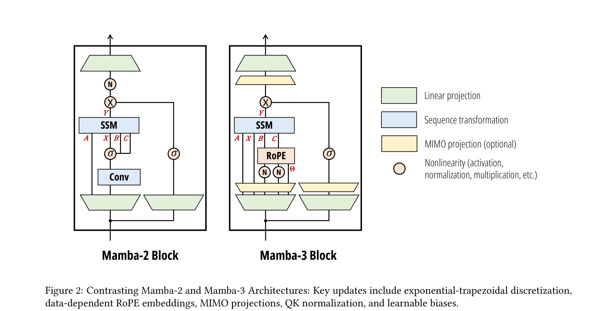
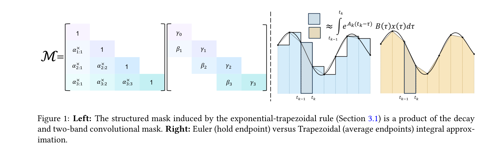
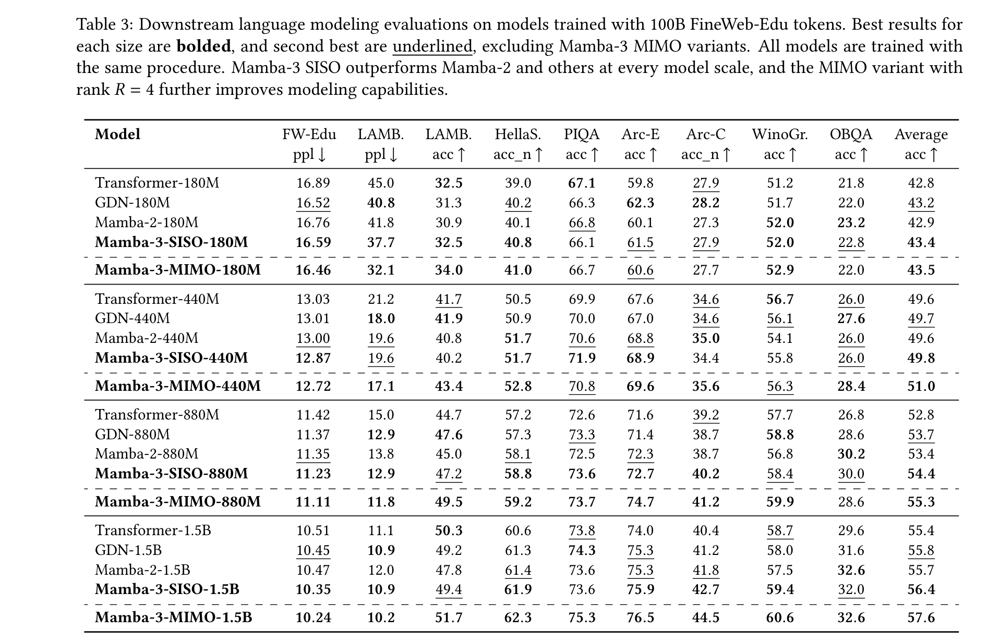
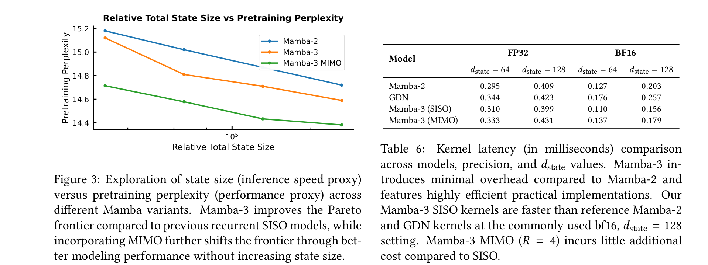
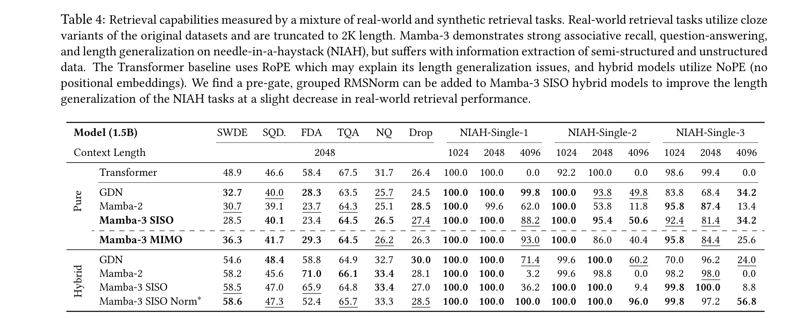
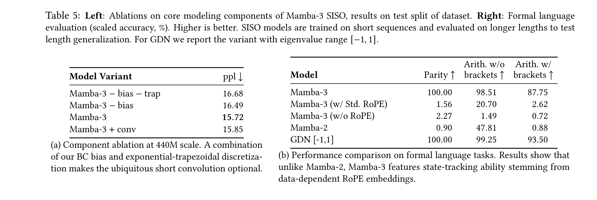
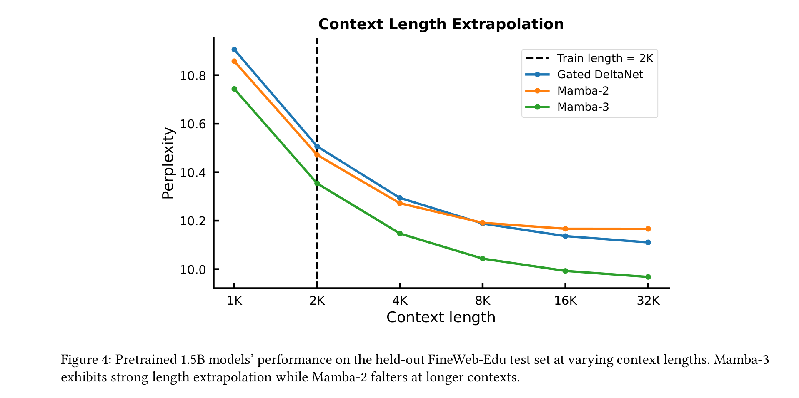
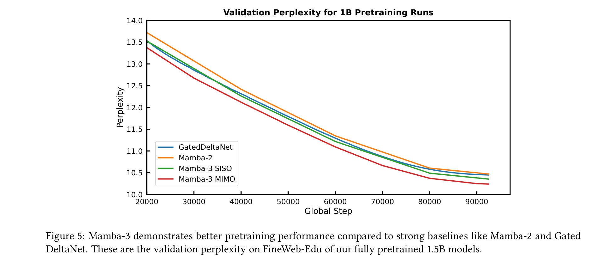

# Mamba-3: Improved Sequence Modeling using State Space Principles

**Authors:** Aakash Lahoti*, Kevin Y. Li*, Berlin Chen*, Caitlin Wang*, Aviv Bick, J. Zico Kolter, Tri Dao, Albert Gu
**Affiliations:** Carnegie Mellon University, Princeton University, Together AI, Cartesia AI
**Date:** March 16, 2026
**Paper:** [PDF](https://arxiv.org/abs/2603.15569)

---

## TL;DR

Mamba-3 introduces three core improvements to SSM-based sequence models guided by state space theory: (1) exponential-trapezoidal discretization for more expressive dynamics, (2) complex-valued state spaces that enable state tracking via data-dependent RoPE, and (3) a multi-input multi-output (MIMO) formulation that increases hardware utilization during decoding without increasing latency. At 1.5B scale, Mamba-3 (MIMO) improves downstream accuracy by +1.8 points over the next best linear model (Gated DeltaNet), matches Mamba-2's perplexity at half the state size, and advances the Pareto frontier between inference efficiency and model quality.

---

## Key Figures

### Figure 2: Mamba-2 vs Mamba-3 Architecture

The key architectural changes at a glance: Mamba-3 replaces the external short convolution with an implicit convolution from exponential-trapezoidal discretization, adds data-dependent RoPE embeddings (for complex-valued state), adds BC normalization and learnable biases, and optionally adds MIMO projections. The Conv block from Mamba-2 is completely removed.

### Figure 1: Exponential-Trapezoidal Structured Mask

Left: The mask induced by exponential-trapezoidal discretization is a product of a decay matrix and a two-band convolutional mask (with weights β, γ). Right: visual comparison of Euler (hold endpoint) vs Trapezoidal (average endpoints) integral approximation — the trapezoidal rule provides a second-order accurate approximation vs. first-order for Euler, yielding more expressive dynamics.

### Table 3: Downstream Language Modeling Results

The comprehensive comparison across 4 scales (180M, 440M, 880M, 1.5B). At every scale, Mamba-3 SISO outperforms Mamba-2 and GDN, and the MIMO variant further improves. At 1.5B: Mamba-3 MIMO achieves 57.6 avg accuracy vs. Mamba-2's 55.7, GDN's 55.8, and Transformer's 55.4. Notably, Mamba-3 does this **without the short causal convolution** that was considered essential for prior linear models.

### Figure 3: Pareto Frontier — State Size vs Perplexity

The key efficiency result: Mamba-3 with state size 64 matches Mamba-2 with state size 128, meaning **the same language modeling quality at half the state size** (and thus faster inference). MIMO further shifts the frontier down by improving perplexity without increasing state size. Table 6 shows kernel latency: Mamba-3 SISO is faster than both Mamba-2 and GDN at d_state=128.

### Table 4: Retrieval Capabilities

Mamba-3 is competitive on associative recall tasks (TQA, SQuAD) but struggles on semi-structured extraction (SWDE, FDA) — a fundamental limitation of fixed-size state. On synthetic NIAH, Mamba-3 MIMO achieves perfect 100% at 1024 and 2048, with strong length generalization to 4096 (25.6-40.4%). Hybrid models (5:1 linear:attention ratio) significantly improve real-world retrieval while keeping most efficiency benefits.

### Table 5: Ablations and State-Tracking

Left: BC bias + exponential-trapezoidal synergize to eliminate the need for short convolutions (removing conv only drops ppl from 15.72 to 15.85). Right: Mamba-3 **solves Parity (100%) and Modular Arithmetic (98.5/87.8%)** — tasks that Mamba-2 and standard RoPE models completely fail on. This is enabled by the data-dependent RoPE (complex-valued state), which permits rotational dynamics that real-valued SSMs cannot represent.

### Figure 4: Context Length Extrapolation

Mamba-3 shows strong length extrapolation — perplexity continues to improve smoothly up to 32K tokens (16x the 2K training context), while Mamba-2 falters beyond 4K. GDN also extrapolates well but starts from a higher perplexity baseline.

### Figure 5: Pretraining Validation Curves

Training dynamics for 1.5B models: Mamba-3 MIMO maintains a consistent perplexity advantage throughout training over Mamba-3 SISO, which in turn beats both GDN and Mamba-2. The gap is established early and maintained throughout the 100B token training run.

---

## Key Novel Ideas

### 1. Exponential-Trapezoidal Discretization
The paper derives a principled discretization framework for time-varying SSMs by first separating the exponential dynamics (state transition) from the state-input integral, then applying different approximation schemes to the integral. This yields:

- **Exponential-Euler** (what Mamba-1/2 actually use): first-order, holds the right endpoint constant → `h_t = α_t h_{t-1} + γ_t B_t x_t`
- **Exponential-Trapezoidal** (new in Mamba-3): second-order, data-dependent convex combination of both endpoints → `h_t = α_t h_{t-1} + β_t B_{t-1} x_{t-1} + γ_t B_t x_t`

The trapezoidal rule introduces a 3-term recurrence (involving both x_t and x_{t-1}), which is equivalent to applying a width-2 convolution on the state-input *within* the recurrence. This is key because it makes the external short convolution (used in Mamba-1/2 and GDN) redundant — the convolution is now implicit in the discretization. The trapezoidal parameter λ_t ∈ [0,1] is data-dependent, learned as σ(u_t).

### 2. Complex-Valued State via Data-Dependent RoPE
Prior SSMs (Mamba-1/2) restricted the state transition to real scalars, which provably limits expressivity — real diagonal transitions can only solve tasks in the solvable group regime TC⁰ (e.g., they cannot solve parity). Mamba-3 introduces complex-valued state transitions:

`ḣ(t) = Diag(A(t) + iθ(t)) h(t) + (B(t) + iB̂(t)) x(t)`

The key insight is that under exponential-Euler discretization, this complex SSM is equivalent to a **real SSM with block-diagonal 2×2 rotation matrices** as transitions (Proposition 2). Furthermore, Proposition 3 shows this is equivalent to applying **data-dependent rotary embeddings** to the B and C projections — analogous to how standard RoPE applies data-independent rotations to Q and K in attention. This establishes a formal connection between complex SSMs and RoPE, implemented efficiently via the existing "RoPE trick."

### 3. Multi-Input, Multi-Output (MIMO) SSM
Standard SSMs are SISO: each head has scalar input x_t and computes state update via outer product B_t x_t^T. MIMO expands the input to a vector x_t ∈ R^R (rank R), making B_t x_t^T a matrix-matrix product. This:

- Increases **arithmetic intensity** from ~2.5 ops/byte (SISO) to Θ(R) ops/byte (MIMO), making better use of GPU tensor cores during the memory-bound decode phase
- Increases decode FLOPs by R× but incurs only marginal latency increase (memory traffic barely changes)
- Achieves a **better model at the same decode speed** — MIMO with R=4 gives +1.2 avg accuracy points over SISO at 1.5B scale

The training cost increase is kept to R× (not R²×) by reducing chunk size proportionally and exploiting the SISO algorithm as a black box.

### 4. Removing the Short Convolution
A surprising empirical finding: the combination of (a) exponential-trapezoidal discretization (which introduces an implicit width-2 convolution inside the recurrence) and (b) B,C biases (which add data-independent components similar to convolutions) makes the explicit short causal convolution — a standard component in Mamba, GDN, and most modern linear models — completely unnecessary. This simplifies the architecture and removes a layer that was previously considered essential.

---

## Architecture Details

| Parameter | Mamba-3 (1.5B) |
|---|---|
| Architecture | Llama-style: alternating Mamba-3 + SwiGLU blocks, pre-norm |
| Model dimension | 2048 |
| State size (d_state) | 128 |
| Head dimension | 64 |
| Expand factor | 2 |
| Layers | 24 |
| Tokenizer | Llama-3.1 |
| Training precision | bfloat16 |
| Discretization | Exponential-trapezoidal (λ_t learned, data-dependent) |
| State-transition A | Complex-valued (real scalar + rotation via data-dependent RoPE) |
| Short convolution | **Removed** (replaced by implicit convolution from discretization + bias) |
| BC Normalization | RMSNorm on B, C projections |
| B, C Biases | Learnable, head-specific, channel-wise, initialized to 1.0 |
| MIMO rank R (optional) | 4 |
| MIMO MLP dim (1.5B) | 3824 (vs 4096 for SISO, to match parameter count) |

---

## Training Pipeline

1. **Data:** FineWeb-Edu dataset, 100B tokens for all models at all scales
2. **Context length:** 2K tokens
3. **Procedure:** Standard autoregressive language modeling, following Mamba-2/Dao & Gu (2024) Section D.2 training protocol
4. **Model sizes:** 180M, 440M, 880M, 1.5B (parameter-matched across architectures)
5. **MIMO parameter matching:** MLP inner dimension reduced to compensate for MIMO projection parameters (e.g., 4096 → 3824 at 1.5B)
6. **Evaluation:** LM Evaluation Harness — LAMBADA, HellaSwag, PIQA, ARC-E/C, WinoGrande, OpenBookQA
7. **Kernels:** Custom Triton kernels for forward pass, CuTe DSL for decode; released publicly

---

## Key Results

### Downstream Language Modeling (1.5B scale, 100B tokens)

| Model | FW-Edu ppl↓ | LAMB. ppl↓ | HellaS. | PIQA | Arc-E | Arc-C | WinoGr. | OBQA | Avg↑ |
|---|---|---|---|---|---|---|---|---|---|
| Transformer | 10.51 | 11.1 | 50.3 | 60.6 | 73.8 | 74.0 | 40.4 | 58.7 | 29.6 | 55.4 |
| GDN | 10.45 | 10.9 | 49.2 | 61.3 | 74.3 | 75.3 | 41.2 | 58.0 | 31.6 | 55.8 |
| Mamba-2 | 10.47 | 12.0 | 47.8 | 61.4 | 73.6 | 75.3 | 41.8 | 57.5 | 32.6 | 55.7 |
| **Mamba-3 SISO** | **10.35** | 10.9 | 49.4 | 61.9 | 73.6 | 75.9 | 42.7 | 59.4 | 32.0 | 56.4 |
| **Mamba-3 MIMO** | **10.24** | 10.2 | 51.7 | 62.3 | 75.3 | 76.5 | 44.5 | 60.6 | 32.6 | **57.6** |

### State-Tracking (Formal Language Tasks)

| Model | Parity | Arith. w/o brackets | Arith. w/ brackets |
|---|---|---|---|
| Mamba-3 | **100.0** | **98.51** | **87.75** |
| Mamba-3 (w/ Std. RoPE) | 1.56 | 20.70 | 2.62 |
| Mamba-2 | 0.90 | 47.81 | 0.88 |
| GDN [-1,1] | **100.0** | 99.25 | 93.50 |

### Inference Latency (H100, 1.5B models, d_state=128, BF16)

| Model | Decode latency (ms) |
|---|---|
| Mamba-2 | 0.203 |
| GDN | 0.257 |
| **Mamba-3 (SISO)** | **0.156** |
| Mamba-3 (MIMO R=4) | 0.179 |

### Pareto Frontier (440M, Chinchilla-optimal)

| Model | State 16 ppl | State 32 ppl | State 64 ppl | State 128 ppl |
|---|---|---|---|---|
| Mamba-2 | 15.22 | 14.96 | 14.73 | 14.41 |
| Mamba-3 SISO | 15.07 | 14.73 | 14.52 | 14.36 |
| Mamba-3 MIMO | 14.90 | 14.62 | 14.44 | — |

---

## Key Takeaways

1. **All three innovations arise from the SSM perspective, not from attention/linear-attention frameworks.** Exponential-trapezoidal discretization comes from ODE numerical methods; complex-valued state comes from classical SSM theory; MIMO comes from signal processing. The paper argues these insights are not obvious from associative memory or test-time training viewpoints.

2. **Mamba-3 at state size 64 = Mamba-2 at state size 128.** This is the headline efficiency result. Same perplexity, half the state, faster inference. The Pareto frontier shifts down significantly.

3. **The short convolution is dead.** The explicit causal convolution used in Mamba-1/2, GDN, and most modern linear models is made redundant by the combination of exponential-trapezoidal discretization (implicit width-2 convolution) and B,C biases. This is validated by ablation: removing conv only increases perplexity by 0.13 in the full Mamba-3 setup.

4. **Complex-valued state unlocks state tracking.** Mamba-3 is the first modern selective SSM to reintroduce complex state transitions for language, solving Parity (100%) and Modular Arithmetic — tasks provably impossible for real-valued diagonal SSMs. The implementation cost is minimal via the "RoPE trick."

5. **Data-dependent RoPE ≠ standard RoPE.** Standard RoPE uses fixed frequency schedules; Mamba-3's data-dependent RoPE has angles θ_t that vary with input. Without data-dependent RoPE, Mamba-3 drops to 1.56% on Parity (from 100%). This is the first theoretically motivated use of data-dependent RoPE.

6. **MIMO is an inference efficiency technique, not a quality technique.** MIMO increases arithmetic intensity from ~2.5 to ~Θ(R) ops/byte, converting idle hardware into useful computation. It happens to also improve quality (+1.2 points avg) because the extra FLOPs enable more expressive state updates, but the primary motivation is hardware utilization.

7. **Retrieval remains the fundamental limitation of linear models.** Mamba-3 (pure) significantly underperforms Transformers on real-world retrieval tasks requiring extraction from semi-structured data (SWDE: 28.5 vs 48.9, FDA: 29.3 vs 58.4). Hybrid architectures (5:1 linear:attention) close most of this gap while preserving efficiency.

8. **Strong context length extrapolation.** Mamba-3 maintains improving perplexity up to 32K tokens (16× training length), while Mamba-2 degrades beyond 4K. This is likely related to the complex-valued state and data-dependent RoPE providing more robust positional representation.

9. **Training throughput trade-off is real.** MIMO kernels are ~2× slower for prefill compared to SISO (Table 7: 19.44s vs 16.22s for 16K tokens), though decode latency is comparable. Training is at most R× slower. This is an explicit trade-off of training compute for better inference-time models.

10. **BC normalization (QKNorm equivalent for SSMs) replaces post-gate RMSNorm.** Adding RMSNorm to B and C projections stabilizes training and allows removal of the post-gate normalization layer. However, for hybrid models, the removed normalization may need to be reintroduced for NIAH length generalization (Table 9).

---

## What's Open-Sourced

- **Code:** Released at [github.com/state-spaces/mamba](https://github.com/state-spaces/mamba)
- **Fast kernels:** Triton (forward/prefill) and CuTe DSL (decode) kernels for Mamba-3 SISO and MIMO
- **No pretrained checkpoints mentioned** as released in the paper
