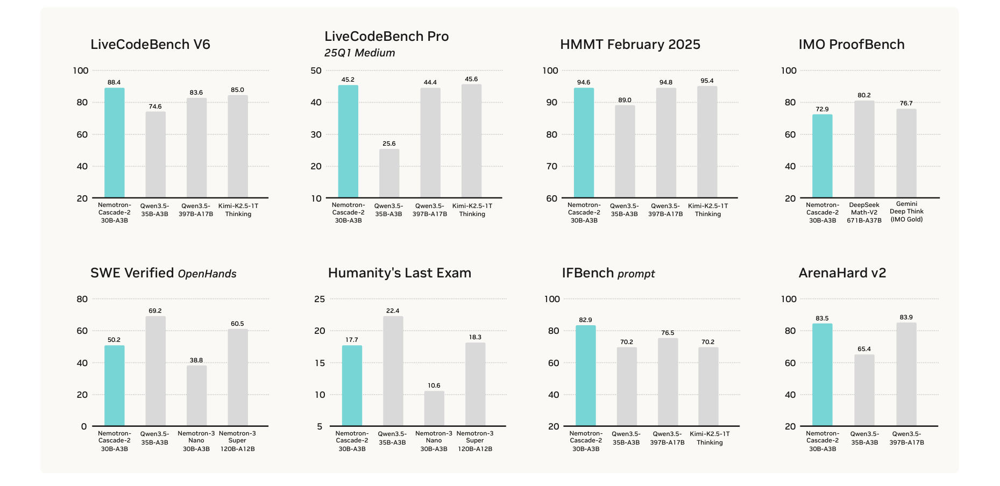
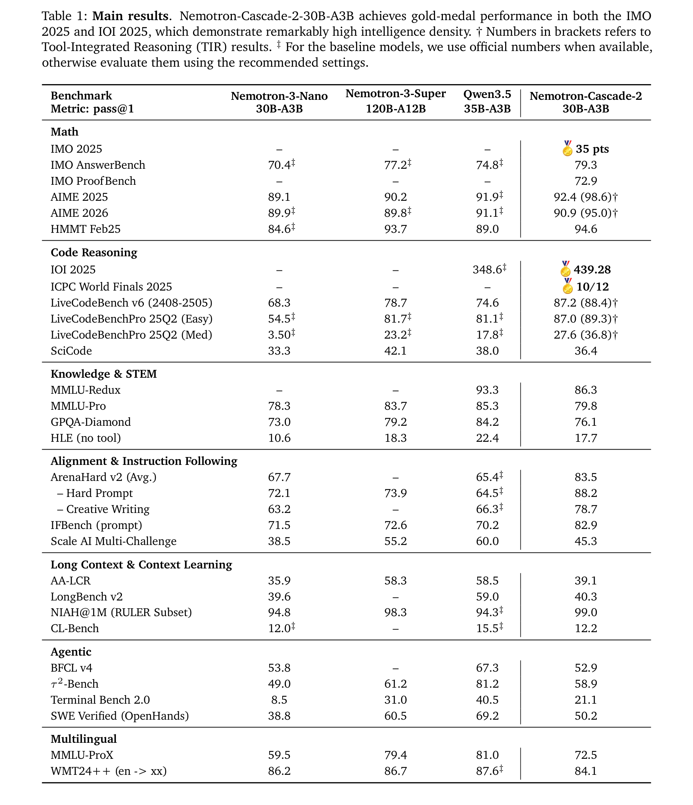
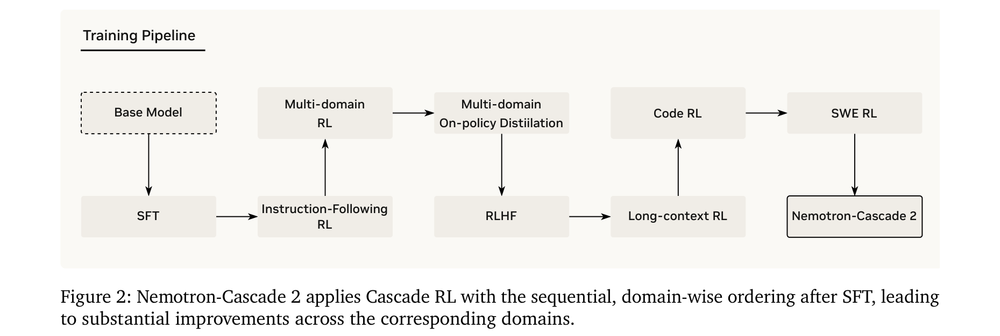
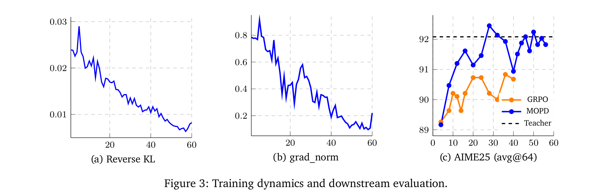
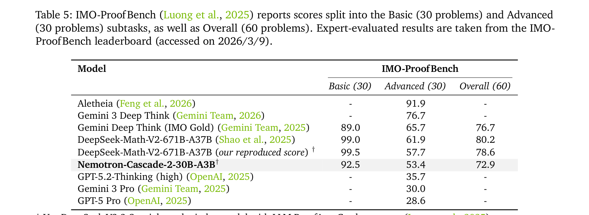
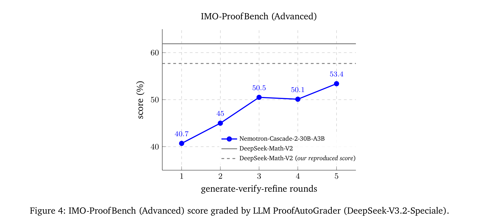
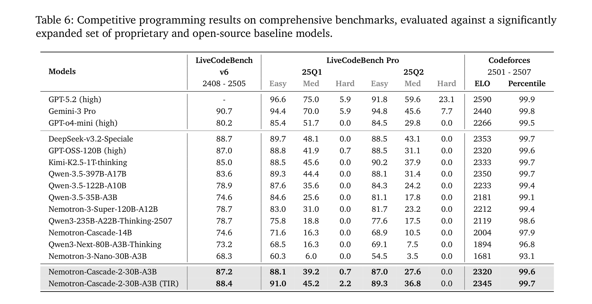

# Nemotron-Cascade 2: Post-Training LLMs with Cascade RL and Multi-Domain On-Policy Distillation

**Authors:** Zhuolin Yang*, Zihan Liu*, Yang Chen*, Wenliang Dai*, Boxin Wang*, Sheng-Chieh Lin, Chankyu Lee, Yangyi Chen, Dongfu Jiang, Jiafan He, Renjie Pi, Grace Lam, Nayeon Lee, Alexander Bukharin, Mohammad Shoeybi, Bryan Catanzaro, Wei Ping
**Affiliations:** NVIDIA
**Date:** March 16, 2026
**Paper:** [PDF](https://research.nvidia.com/labs/nemotron/files/Nemotron-Cascade-2.pdf)

---

## TL;DR

Nemotron-Cascade 2 is an open 30B MoE model with only 3B activated parameters that achieves gold-medal-level performance on IMO 2025 (35/42 pts), IOI 2025 (439.28/600), and ICPC World Finals 2025 (10/12 problems), making it only the second open-weight LLM after DeepSeek-V3.2-Speciale to reach this level. The key innovations are (1) **Cascade RL** — sequential, domain-wise RL training that avoids catastrophic forgetting, (2) **Multi-domain On-Policy Distillation (MOPD)** — a stabilization stage that distills from the best intermediate teacher checkpoints per domain, recovering regressions from specialized RL stages, and (3) a comprehensive 7-stage post-training pipeline spanning IF-RL, multi-domain RL, MOPD, RLHF, long-context RL, code RL, and SWE RL.

---

## Key Figures

### Headline Benchmark Results

Nemotron-Cascade-2-30B-A3B matches or exceeds models with 20× more parameters across math (HMMT 94.6%), code (LiveCodeBench 88.4%), reasoning (IMO ProofBench 72.9%), alignment (ArenaHard 83.5%), and software engineering (SWE Verified 50.2%). Notably competitive with Qwen3.5-35B-A3B on most benchmarks despite being a smaller MoE.

### Table 1: Comprehensive Main Results

The complete evaluation spanning math, code reasoning, knowledge/STEM, alignment, instruction following, long context, agentic tasks, and multilingual benchmarks. Gold medal results on IMO 2025 (35 pts), IOI 2025 (439.28), and ICPC World Finals (10/12). Achieves 92.4 on AIME 2025 (with TIR: 98.6), 87.2 on LiveCodeBench v6, and 82.9 on IFBench.

### Figure 2: Cascade RL Training Pipeline

The 7-stage post-training pipeline: Base Model → SFT → IF-RL → Multi-domain RL → MOPD → RLHF → Long-context RL → Code RL → SWE RL → Nemotron-Cascade 2. Each RL stage focuses on a specific domain, with MOPD serving as the critical stabilization point in the middle of the cascade.

### Figure 3: MOPD Training Dynamics — MOPD vs GRPO

MOPD converges dramatically faster and reaches higher performance than GRPO. On AIME25 (avg@64): MOPD reaches 92.0 (teacher-level performance) within 30 steps, while GRPO only reaches 91.0 after 50+ steps. The reverse KL converges smoothly toward 0, and the gradient norm spike during warmup is critical for stability.

### Table 5: IMO-ProofBench Results

Nemotron-Cascade-2-30B-A3B achieves 72.9 overall on IMO-ProofBench (92.5 Basic, 53.4 Advanced), placing within 8 points of DeepSeek-Math-V2-671B-A37B (80.2) despite using 10× fewer active parameters. Significantly outperforms GPT-5 Pro (28.6) and Gemini 3 Pro (30.0) on the Advanced split.

### Figure 4: IMO-ProofBench Test-Time Scaling

Increasing test-time compute through generate-verify-refine rounds steadily improves Advanced scores from 40.7 (round 1) to 53.4 (round 5), narrowing the gap to DeepSeek-Math-V2. The model's reproduced DeepSeek-Math-V2 score (50.1 at round 3) is lower than official reports, suggesting grading methodology differences.

### Table 6: Competitive Coding Benchmark Results

With Tool-Integrated Reasoning (TIR), Nemotron-Cascade-2 achieves LiveCodeBench v6: 88.4, LiveCodeBench Pro 25Q2 Med: 45.2, and Codeforces ELO: 2345 (99.7 percentile). Matches or exceeds models 3-10× larger including DeepSeek-v3.2-Speciale, GPT-OSS-120B, and Qwen3.5-397B-A17B. Notably achieves >0% on the "Hard" split of LiveCodeBench Pro 25Q2 (2.2 with TIR), where most open models score 0.0.

---

## Key Novel Ideas

### 1. Cascade RL — Sequential Domain-Wise RL Training
Rather than training RL on all domains simultaneously, Cascade RL trains them sequentially, one domain at a time. This has three advantages:
- **Resistant to catastrophic forgetting** — domain-specific stages rarely degrade earlier domains and may even improve them
- **Tailored hyperparameters** — each domain gets optimized RL configuration (learning rate, response length, reward function)
- **Compute efficiency** — uniform response lengths and verification costs within each domain reduce idle GPU time

The ordering follows a key principle: **minimize inter-domain interference**. IF-RL comes first (it can hurt alignment but RLHF later recovers that). MOPD stabilizes in the middle. RLHF refines alignment. Long-context, Code, and SWE RL are specialized final stages.

### 2. Multi-Domain On-Policy Distillation (MOPD)
The critical innovation: after multiple Cascade RL stages, performance regressions accumulate across domains. MOPD recovers these by:
1. **Selecting the best checkpoint per domain** from the Cascade RL pipeline (e.g., the SFT checkpoint is the math teacher because SFT data was meticulously curated for math)
2. **Sampling responses from the student** (on-policy), then computing token-level distillation advantage: `a_t = log π^teacher(y_t|s_t) - log π^train(y_t|s_t)`
3. **Optimizing with truncated importance weighting** to handle train-inference mismatch

MOPD is dramatically more sample-efficient than GRPO: on AIME25, it reaches teacher-level performance (92.0) in 30 steps vs. GRPO's 91.0 in 50+ steps. On ArenaHard, MOPD reaches 85.5 Hard Prompt in 52 steps vs. RLHF's 80.7 in 160 steps.

### 3. IF-RL as the Foundation Stage
A key ordering insight: Instruction-Following RL comes *first* in the Cascade, not after RLHF as in Nemotron-Cascade 1. Rationale:
- IF-RL can hurt alignment (ArenaHard), but RLHF later recovers this
- An early IF-RL model with strong instruction adherence serves as a better teacher for subsequent MOPD
- IF-RL is trained exclusively in thinking mode without a reward model, achieving SOTA 83.13% on IFBench

### 4. Execution-Based Agentic SWE RL
For software engineering, the model is trained directly within agentic OpenHands environments with execution-based rewards. Each episode is a full SWE-bench issue: the agent browses files, edits code, runs tests, and receives binary reward from compilation/test results. Key details:
- 256K token context, up to 200 interaction turns
- 64 rollouts per prompt, batch size 1024
- Instances where all 16 rollouts pass (too easy) or none pass (too hard) are filtered out
- This end-to-end RL within the agentic scaffold enables direct optimization of multi-turn problem-solving trajectories

---

## Architecture Details

| Parameter | Value |
|---|---|
| Architecture | 30B MoE (Mixture of Experts) |
| Activated parameters | 3B |
| Base model | Nemotron-3-Nano-30B-A3B-Base |
| Thinking mode | `<think>` / `</think>` tags |
| Non-thinking mode | Empty `<think></think>` block |
| Tool calling | `<tool_call>` / `</tool_call>` tags |
| Max context | 1M tokens (after long-context RL) |
| SFT packed sequence length | 256K |

---

## Training Pipeline

### Stage 1: Supervised Fine-Tuning (SFT)
- Multi-domain SFT covering math (4.6M samples), code reasoning (5.2M traces), science (2.7M), long context (234K), general chat (11.3M+), instruction following (1.3M), safety (4K), agentic (822K conversational + 514K SWE), and terminal (490K)
- Packed into 256K sequences, trained for ~1.5 epochs (33K steps)
- Teacher models: GPT-OSS-120B, DeepSeek-V3.2-Speciale, Qwen3-235B variants

### Stage 2: IF-RL (Instruction-Following RL)
- ~180 steps with dynamic filtering, thinking mode only
- Overlong penalty for responses exceeding max length
- SOTA 83.13% on IFBench

### Stage 3: Multi-domain RL
- MCQA (55%), agentic tool calling (30%), structured output (15%)
- ~70 steps, batch size 128, 16 rollouts per prompt

### Stage 4: MOPD (Multi-domain On-Policy Distillation)
- 3 domain teachers: math (SFT checkpoint), RLHF (RLHF checkpoint), multi-domain (IF-RL + multi-domain checkpoint)
- 4 rollouts, batch 512, ~52 steps to convergence
- Truncated importance weighting: ε_low=0.5, ε_high=2.0

### Stage 5: RLHF
- GenRM (generative reward model) based on Qwen3-235B-A22B-Thinking
- Thinking mode only, ~30 steps
- Entropy loss coefficient: 0, KL coefficient: 0.03

### Stage 6: Long-context RL
- Input up to 32K tokens, response up to 49K tokens
- LLM judge: Qwen3-235B-A22B-Instruct-2507
- ~30 steps

### Stage 7: Code RL
- Only 3.5K high-difficulty prompts (filtered for problems GPT-OSS-120B cannot solve perfectly)
- 118K max response, 16 rollouts, strict binary reward
- Asynchronous verification: 2,048 code executions per step across 384 CPU cores in 427.2 seconds

### Stage 8: SWE RL
- Agentless RL (40-50 steps) + Execution-based agentic RL (16 prompts × 64 rollouts)
- OpenHands scaffold, up to 256K context, 200 turns

All RL stages use GRPO with on-policy training (importance sampling ratio exactly 1), no KL divergence term (simplified to REINFORCE with group-normalized rewards).

---

## Key Results

### Competition Results

| Competition | Score | Medal |
|---|---|---|
| **IMO 2025** | 35/42 (5 of 6 problems) | **Gold** |
| **IOI 2025** | 439.28/600 | **Gold** |
| **ICPC World Finals 2025** | 10/12 problems | **Gold (#4 placement)** |

### Math Benchmarks

| Benchmark | NC2-30B-A3B | Qwen3.5-35B-A3B | Nemotron-3-Super-120B |
|---|---|---|---|
| AIME 2025 | 92.4 (98.6 TIR) | 91.9 | 90.2 |
| AIME 2026 | 90.9 (95.0 TIR) | 91.1 | 89.8 |
| HMMT Feb25 | 94.6 | 89.0 | 93.7 |
| IMO-ProofBench | 72.9 | — | — |

### Code Benchmarks

| Benchmark | NC2-30B-A3B | NC2 (TIR) | Qwen3.5-35B-A3B |
|---|---|---|---|
| LiveCodeBench v6 | 87.2 | 88.4 | 74.6 |
| LiveCodeBenchPro 25Q2 Med | 39.2 | 45.2 | 17.8 |
| Codeforces ELO | 2320 | 2345 | 2333 |
| SciCode | 36.4 | — | 38.0 |

### Alignment & Instruction Following

| Benchmark | NC2-30B-A3B | Qwen3.5-35B-A3B |
|---|---|---|
| ArenaHard v2 (Avg) | 83.5 | 65.4 |
| IFBench (prompt) | 82.9 | 70.2 |
| Scale AI Multi-Challenge | 45.3 | 60.0 |

### Agentic Tasks

| Benchmark | NC2-30B-A3B | Qwen3.5-35B-A3B |
|---|---|---|
| BFCL v4 | 52.9 | 67.3 |
| τ²-Bench | 58.9 | 81.2 |
| Terminal Bench 2.0 | 21.1 | 40.5 |
| SWE Verified (OpenHands) | 50.2 | 69.2 |

---

## Key Takeaways

1. **Cascade RL scales multi-domain post-training effectively.** Sequential, domain-wise RL training avoids the catastrophic forgetting and reward signal conflicts that plague joint multi-domain RL. Each domain stage gets tailored hyperparameters, data, and compute allocation.

2. **MOPD is the key stabilization mechanism.** Multi-domain On-Policy Distillation recovers regressions accumulated during the Cascade RL stages by distilling from the best intermediate checkpoint per domain. It converges in ~3× fewer steps than GRPO while reaching higher performance.

3. **A 3B-active-parameter model can achieve gold-medal-level Olympiad results.** Nemotron-Cascade 2 is the second open model (after DeepSeek-V3.2-Speciale-671B-A37B) to achieve gold on both IMO and IOI, despite having 20× fewer parameters. This demonstrates that post-training recipe quality dominates model size at this point.

4. **IF-RL should come before RLHF, not after.** Placing instruction-following RL first creates a strong foundation for subsequent stages. Though it temporarily hurts alignment, RLHF later recovers this. Training IF-RL in thinking mode only (without a reward model) yields higher accuracy than with a reward model.

5. **High-difficulty-only Code RL data is critical.** Filtering to just 3.5K problems where GPT-OSS-120B fails (rather than using the full dataset) dramatically improves code performance. Hard problems paired with strong test cases drive the most learning.

6. **Execution-based agentic RL works for SWE.** Training directly within OpenHands environments with execution rewards (compilation + test pass) enables end-to-end optimization of multi-turn agent trajectories. The train-test alignment (same scaffold, same context management) is crucial for transfer.

7. **The model underperforms on knowledge-intensive and agentic tasks.** Compared to Qwen3.5-35B-A3B, Nemotron-Cascade 2 lags significantly on BFCL v4 (52.9 vs 67.3), τ²-Bench (58.9 vs 81.2), Terminal Bench (21.1 vs 40.5), and Scale AI Multi-Challenge (45.3 vs 60.0). The authors attribute this to weaker knowledge-intensive pretraining, highlighting that post-training RL cannot fully compensate for pretraining gaps.

8. **MOPD provides dense token-level signal vs. GRPO's sparse sequence-level reward.** This is why MOPD is more sample-efficient. Every generated token gets a distillation advantage signal (log-probability difference from teacher), whereas GRPO only provides a single reward per sequence.

9. **Test-time scaling substantially boosts proof and coding results.** IMO-ProofBench Advanced improves from 40.7 to 53.4 over 5 rounds of generate-verify-refine. Tool-Integrated Reasoning (Python executor) boosts LiveCodeBench v6 from 87.2 to 88.4, and LiveCodeBenchPro Med from 39.2 to 45.2.

10. **The RL pipeline is surprisingly short.** Each Cascade RL stage runs for only 22-180 steps. The entire post-training pipeline from SFT to final model is perhaps ~500 total RL optimization steps across all stages, yet produces gold-medal-level capabilities.

---

## What's Open-Sourced

- **Model checkpoint:** [Nemotron-Cascade-2-30B-A3B](https://huggingface.co/nvidia/Nemotron-Cascade-2-30B-A3B) on HuggingFace
- **SFT data:** [Nemotron-Cascade-2-SFT-Data](https://huggingface.co/nvidia/Nemotron-Cascade-2-SFT-Data) — collection of SFT datasets
- **RL data:** [Nemotron-Cascade-2-RL-Data](https://huggingface.co/nvidia/Nemotron-Cascade-2-RL-Data) — collection of RL datasets
- **Training framework:** Nemo-RL repository (NVIDIA)
- **IMO solutions:** Full model-generated proofs for all 6 IMO 2025 problems with human expert commentary included in the paper appendix
