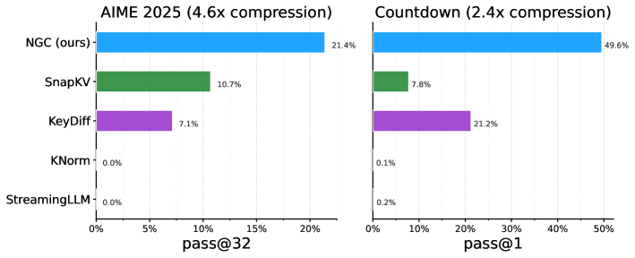
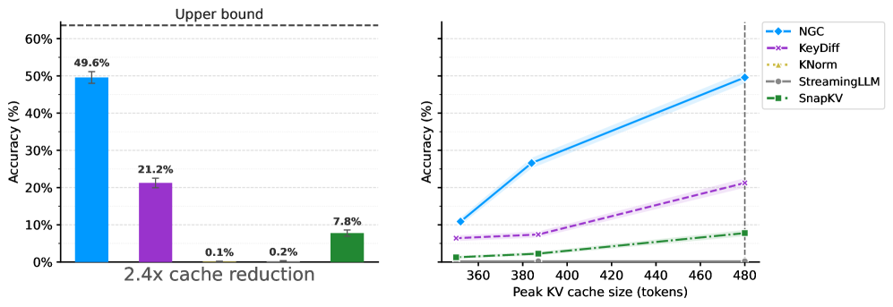
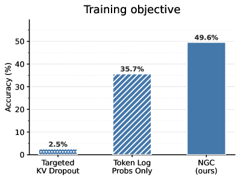
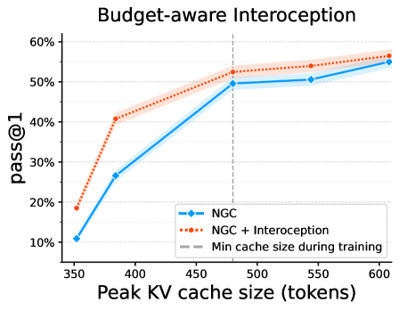
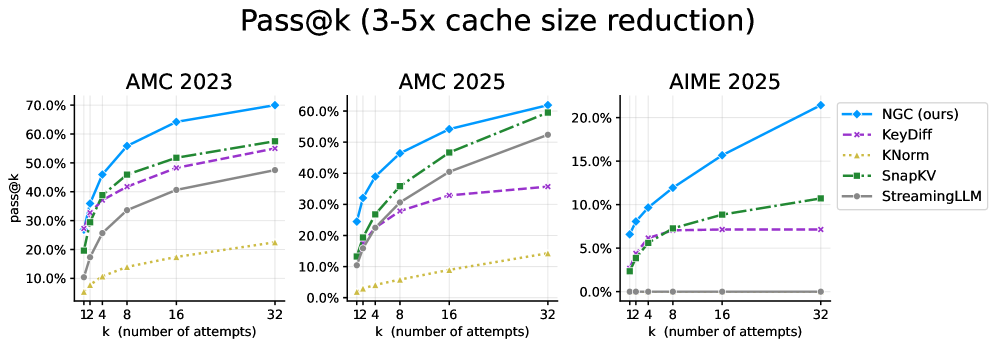
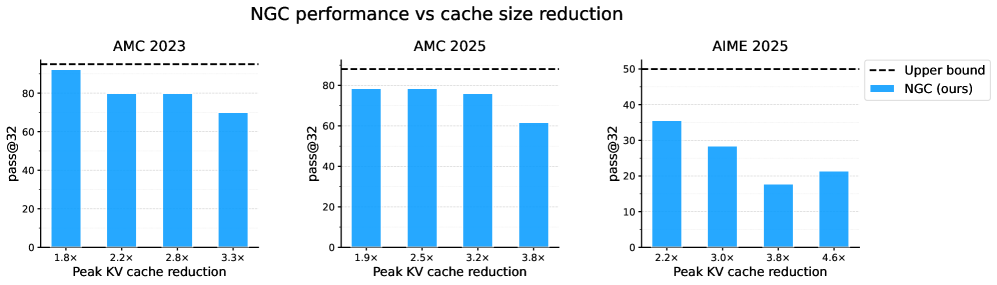

# Neural Garbage Collection: Learning to Forget while Learning to Reason

**Authors:** Michael Y. Li, Jubayer Ibn Hamid, Emily B. Fox, Noah D. Goodman — Stanford University
**Date:** April 20, 2026
**Paper:** [PDF](https://arxiv.org/abs/2604.18002)

---

## TL;DR

Neural Garbage Collection (NGC) teaches a language model to **jointly learn to reason and manage its own KV cache** using the same reinforcement learning framework (RLVR/GRPO) that trains reasoning. The model periodically pauses, scores its KV cache entries using its own attention mechanism, samples which entries to evict via Gumbel-top-k, and continues reasoning with the pruned cache. Both token generation and cache eviction are treated as discrete actions optimized by a single outcome-based task reward — no auxiliary losses, no teacher models, no heuristics. On Countdown, NGC achieves 49.6% accuracy vs 21.2% for the best heuristic baseline at 2.4x cache compression; on AMC and AIME math benchmarks, NGC maintains strong accuracy at 2-3x cache reduction while all heuristic baselines are inconsistent or collapse.

---

## Key Figures

### Figure 1: NGC vs. Baselines on AIME and Countdown


At comparable cache compression levels, NGC (blue) achieves 21.4% pass@32 on AIME 2025 (4.6x compression) — double the next-best method SnapKV (10.7%). On Countdown (2.4x compression), NGC reaches 49.6% pass@1, more than doubling KeyDiff (21.2%). KNorm and StreamingLLM essentially fail (≤0.2%).

### Figure 3: Countdown Main Results and Pareto Frontier


**Left:** At 2.4x cache reduction, NGC (49.6%) vs. the upper bound (dashed line, ~63%, no eviction). The gap shows the cost of compression, but NGC preserves most of the performance. **Right:** NGC Pareto-dominates all baselines across the entire range of cache sizes, and degrades gracefully as the cache gets smaller.

### Figure 4: Ablation — End-to-End Training is Essential


Three variants: (1) **Targeted KV Dropout** (expose model to eviction during training but don't fix off-policy log-probs) — collapses to 2.5%. (2) **Token Log Probs Only** (use replay masks to fix off-policy log-probs, but drop the eviction policy gradient) — reaches 35.7%. (3) **Full NGC** (replay masks + eviction policy gradient) — 49.6%. Both components are necessary.

### Figure 6: Budget-Aware Interoception


When the eviction rate is included in the prompt (orange, "NGC + Interoception"), the model generalizes better to unseen, more aggressive eviction rates — especially below the minimum cache size seen during training (dashed line). This suggests models can develop meta-awareness of their own computational constraints.

### Figure 7: Math Reasoning (AMC, AIME) at 3-5x Compression


NGC (blue) consistently outperforms all baselines across AMC 2023, AMC 2025, and AIME 2025 at 3-5x cache compression. Heuristic baselines are inconsistent across tasks — SnapKV fails on Countdown but works decently on AMC, while StreamingLLM occasionally works but is unpredictable. NGC is the only method that works reliably across all tasks.

### Figure 8: NGC Accuracy vs. Cache Reduction


At moderate compression (1.8-2.5x), NGC comes close to the no-eviction upper bound (dashed lines) on all three math benchmarks. Performance degrades gracefully at higher compression. On AMC 2023, NGC retains ~70% pass@32 even at 3.3x compression (vs ~95% upper bound).

---

## Key Novel Ideas

### 1. Cache Eviction as a First-Class RL Action

The central idea of NGC is to treat KV cache eviction decisions as **discrete actions in the same policy** as token generation, optimized by the same outcome-based reward signal.

**Why this is different from prior work:** Existing KV cache management approaches fall into two categories: (a) heuristic rules (SnapKV, StreamingLLM, KeyDiff, KNorm) that evict based on fixed proxy criteria like attention weights or recency, and (b) learned compression methods that use auxiliary objectives like distillation or KL divergence from a teacher. NGC does neither — it uses the same binary correctness reward that trains reasoning to also train eviction. There are no auxiliary losses, no teacher models, no separate training stages.

**Why this works:** RLVR already treats token generation as a discrete sampling problem optimized via policy gradients. Eviction is also a discrete decision (which cache entries to keep). So eviction naturally fits into the same framework. The key equation is the joint objective:

$$\mathcal{L} = \mathcal{L}_{\text{token}} + \mathcal{L}_{\text{mem}}$$

where both terms share the **same** group-normalized advantage Â_i (computed from the task reward). There's no separate eviction reward — the correctness of the final answer trains both what the model says and what it forgets.

### 2. Grow-Then-Evict Dynamics for Bounded Memory

NGC introduces a simple but powerful scheduling mechanism: every δ tokens, the model evicts an ε fraction of its KV cache entries. Between eviction rounds, the cache grows normally.

**Steady-state property:** Under these dynamics, the maximum cache size converges to a constant:

$$C^* = L \cdot \frac{\delta}{\epsilon}$$

where L is the number of transformer layers, δ is the eviction cadence (tokens between evictions), and ε is the eviction rate. This is independent of the total number of reasoning tokens generated. A model can reason indefinitely within a fixed memory budget.

For example, with δ = 256 tokens between evictions and ε = 0.5 (50% eviction rate), the per-layer steady-state cache size is 512 entries, regardless of whether the model generates 1K or 100K reasoning tokens.

### 3. Attention-Based Scoring + Gumbel-Top-K Sampling

At each eviction round, the model needs to decide which cache entries to keep. NGC reuses the model's own attention mechanism — no new parameters.

**Scoring:** For each layer ℓ, compute attention weights from the w most recent queries to all prefix keys, average across heads and queries to get a scalar importance score per key:

$$\psi_t = \frac{1}{H \cdot w} \sum_{h=1}^H \sum_{q=1}^w A_{q,t}^{(\ell,h)}$$

This uses w = 5, so scoring adds negligible cost.

**Block-level coarsening:** Individual key-level eviction creates severe credit assignment problems. NGC groups consecutive keys into blocks of size b = 32 and evicts at block granularity. This reduces the action space, improves credit assignment (semantically coherent sub-computations tend to span contiguous token blocks), and aligns with paged KV cache systems like vLLM.

**Gumbel-top-k sampling:** Instead of deterministic top-k (which isn't differentiable and doesn't produce log-probabilities), NGC uses the Gumbel-top-k trick: add i.i.d. Gumbel noise to block logits and keep the K largest perturbed values. This is parallelizable and admits a closed-form log-probability:

$$\log p(\boldsymbol{\sigma} \mid \mathbf{s}) = \sum_{j=1}^K \left[s_{\sigma_j} - \log \sum_{t \notin \{\sigma_1, \ldots, \sigma_{j-1}\}} \exp(s_t)\right]$$

The exact log-probabilities are essential for unbiased policy gradient estimates. At test time, Gumbel noise is dropped and deterministic top-k is used.

### 4. Replay Attention Masks for Correct Off-Policy Training

Standard RLVR assumes the model attends to all previous tokens when computing log-probabilities during training. NGC breaks this assumption — after eviction, some tokens are no longer visible.

**The solution:** During the training forward pass, NGC constructs per-layer 2D attention masks that replicate the exact visibility pattern from the rollout. Each layer gets a different mask because each layer makes independent eviction decisions. Standard 1D key-side masks are insufficient because eviction breaks the monotonicity of visibility — a key evicted at round r is visible before r but invisible after.

**Critical implementation detail:** The queries and keys used for eviction scoring must be **recomputed** during the replay pass (not cached from rollout) so they remain on the autograd graph. Otherwise, the eviction policy gradient L_mem would have no path to the model parameters.

This replay mechanism adds zero cost beyond the standard RLVR forward pass — only a small binary mask per layer per eviction round needs to be stored.

### 5. Budget-Aware Interoception

A simple but effective trick: append the eviction rate to the prompt during training:

```
<eviction_rate>50%</eviction_rate>
```

This gives the model meta-awareness of its memory constraints. The model learns to adapt its reasoning strategy to the available budget — reasoning more concisely when the budget is tight. The interoceptive model matches or exceeds standard NGC across all training-distribution eviction rates and generalizes better to unseen, more aggressive rates.

### 6. Meta-Tokens for Information Consolidation

NGC can be extended with a special **meta-token** (ĝ) emitted via constrained decoding immediately before eviction rounds. After the surrounding cache entries are evicted, ĝ's key-value representation becomes a channel through which information from evicted tokens can persist. The optimization pressure teaches the model to route useful information through ĝ — a form of learned gist compression that emerges from task reward alone, without a separate compression objective.

---

## Training Pipeline

### 1. Base Model
DeepSeek-R1-Distill-Qwen-1.5B — a small reasoning model distilled from DeepSeek-R1.

### 2. RL Training with Eviction Curriculum
- **Optimizer:** Dr. GRPO (a variant of GRPO)
- **Reward:** Binary task correctness (1 = correct answer, 0 = wrong)
- **Eviction curriculum:** Staircase schedule that starts with mild eviction and gradually increases. Retention rate follows a piecewise linear schedule with smooth transitions between stages (Equation 6, α = 0.6).
- **Countdown:** 250 training steps, 32 prompts/step, 16 rollouts/prompt, δ = 256, max completion 1024 tokens.
- **DAPO-17k:** 469 training steps, 256 prompts/step, 8 rollouts/prompt, δ = 350, max completion 1050 tokens.

### 3. Test-Time Inference
- Replace Gumbel-top-k with deterministic top-k
- For math tasks: top_p = 0.95, temperature 0.6, max completion 3850 tokens

---

## Key Results

### Countdown (Controlled Study)

| Method | Accuracy (pass@1) | Peak Cache Reduction |
|--------|-------------------|---------------------|
| No eviction (upper bound) | ~63% | 1.0x |
| **NGC (ours)** | **49.6%** | **2.4x** |
| KeyDiff | 21.2% | 2.4x |
| SnapKV | 7.8% | 2.4x |
| StreamingLLM | 0.2% | 2.4x |
| KNorm | 0.1% | 2.4x |

NGC more than doubles the accuracy of the best baseline.

### Mathematical Reasoning (pass@32, 3-5x compression)

| Method | AMC 2023 | AMC 2025 | AIME 2025 |
|--------|----------|----------|-----------|
| **NGC (ours)** | **~70%** | **~62%** | **~21.4%** |
| KeyDiff | ~43% | ~40% | ~7.1% |
| SnapKV | ~40% | ~20% | ~10.7% |
| StreamingLLM | ~42% | ~58% | ~0% |
| KNorm | ~12% | ~3% | ~0% |

### NGC vs. Cache Reduction (pass@32)

| Compression | AMC 2023 | AMC 2025 | AIME 2025 |
|-------------|----------|----------|-----------|
| 1.8-1.9x | ~92% | ~79% | ~35% |
| 2.2-2.5x | ~80% | ~79% | ~28% |
| 2.8-3.2x | ~79% | ~79% | ~18% |
| 3.3-4.6x | ~69% | ~63% | ~15% |
| Upper bound | ~95% | ~80% | ~50% |

At moderate compression (2-3x), NGC comes close to the no-eviction ceiling.

### Ablation: Training Components

| Variant | Countdown Accuracy |
|---------|-------------------|
| Targeted KV Dropout (no replay masks, no L_mem) | 2.5% |
| Token Log Probs Only (replay masks, no L_mem) | 35.7% |
| **Full NGC (replay masks + L_mem)** | **49.6%** |

Both correct off-policy handling (replay masks) and the eviction policy gradient (L_mem) are essential.

---

## Key Takeaways

1. **Efficiency can be a learned capability, not just an engineered one.** NGC demonstrates that a model can learn to manage its own memory from the same reward signal that teaches it to reason. This inverts the usual tradeoff: instead of efficiency being traded against capability, the model gets both from the same optimization.

2. **Eviction fits naturally into the RLVR framework.** Since both token generation and cache eviction are discrete decisions, they can share the same policy gradient objective. The Gumbel-top-k trick makes subset sampling tractable with exact log-probabilities, and the same group-normalized advantages train both action types.

3. **Heuristic eviction baselines are fragile and task-dependent.** SnapKV works on AMC but fails on Countdown. StreamingLLM works on some AMC problems but gives 0% on AIME. KeyDiff is decent but inconsistent. No single heuristic works reliably across tasks. NGC works everywhere because it adapts what to remember to each task via learning.

4. **Both replay masks and the eviction policy gradient are necessary.** The ablation is clean: without replay masks (Targeted KV Dropout), training is unstable and collapses. With replay masks but without L_mem (Token Log Probs Only), performance is reasonable but leaves 14 percentage points on the table. Full NGC needs both.

5. **Steady-state memory is a powerful property.** The grow-then-evict dynamic guarantees the cache converges to C* = L·δ/ε regardless of reasoning length. This means a model could, in principle, reason indefinitely within a fixed memory budget — a property that growing-cache models fundamentally lack.

6. **Budget-aware interoception helps generalization.** Simply including the eviction rate in the prompt lets the model adapt its behavior to different memory constraints. This is essentially "prompt-based meta-cognition" — telling the model about its own resource limits so it can plan accordingly.

7. **Block-level eviction beats token-level.** Grouping contiguous tokens into blocks (b=32) before eviction decisions reduces the action space and improves credit assignment. Adjacent tokens in a chain-of-thought tend to form semantic units (sub-computations), so block-level decisions are better aligned with the structure of reasoning.

8. **The approach is architecture-agnostic.** NGC requires no modification to the base transformer. It reuses the model's existing attention mechanism for scoring, introduces no new parameters (φ = θ), and works as a post-training procedure. It could, in principle, be applied to any transformer-based reasoning model.

9. **Current scale is limited but the idea is general.** All experiments use a 1.5B model. The authors frame NGC as a "first step" — the framework naturally extends to larger models where KV cache costs are even more acute (the paper notes 1M-token contexts as a key motivation). The 2-3x cache reduction demonstrated here would translate to substantial savings at scale.

10. **Meta-tokens provide a path to consolidation, not just deletion.** The meta-token extension shows that NGC can go beyond forgetting — the model can learn to compress information from evicted tokens into special entries that persist in the cache, yielding gist-like behavior without a separate compression objective.

---

## What's Open-Sourced

No code or checkpoints appear to have been publicly released at the time of writing. The paper describes a custom fork of HuggingFace's Qwen2 implementation and TRL's GRPOTrainer, but no repository link is provided.
