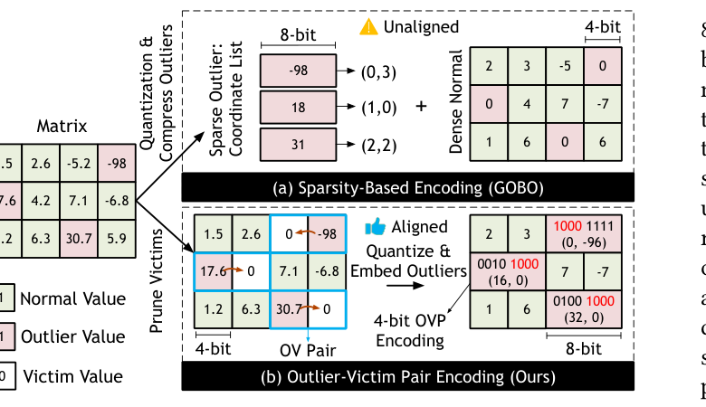
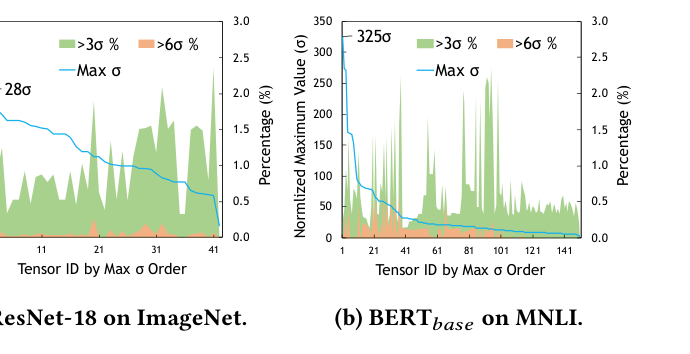
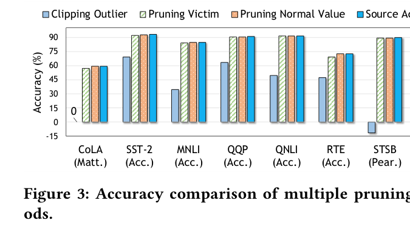
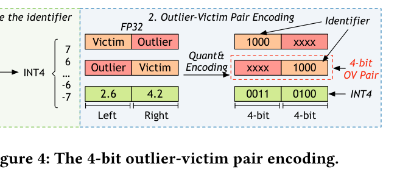
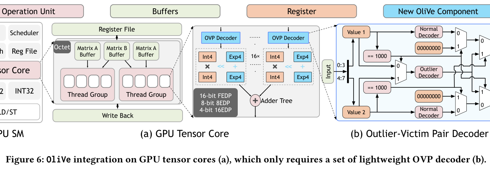
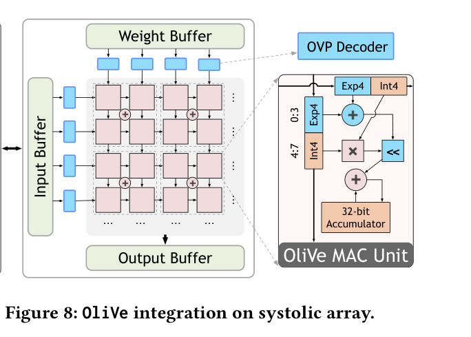
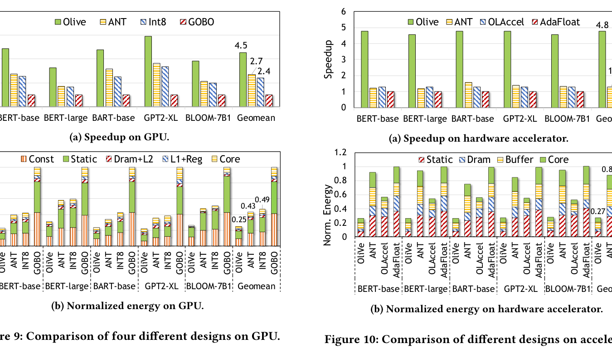

# OliVe: Accelerating Large Language Models via Hardware-friendly Outlier-Victim Pair Quantization

**Authors:** Cong Guo*, Jiaming Tang*, Weiming Hu, Jingwen Leng, Chen Zhang, Fan Yang, Yunxin Liu, Minyi Guo, Yuhao Zhu

**Affiliations:** Shanghai Jiao Tong University, Microsoft Research, Tsinghua University AIR, University of Rochester

**Published:** ISCA 2023 (50th Annual International Symposium on Computer Architecture), June 17-21, 2023, Orlando, FL

**Link:** [arxiv.org/abs/2304.07493](https://arxiv.org/abs/2304.07493) | [DOI: 10.1145/3579371.3589038](https://doi.org/10.1145/3579371.3589038)

---

## TL;DR

OliVe is an algorithm/architecture co-design that solves the outlier problem in LLM quantization by pairing each outlier with its neighboring normal value (the "victim"), sacrificing that victim to make room for a higher-precision outlier representation. This outlier-victim pair (OVP) encoding is memory-aligned and hardware-friendly, unlike prior sparsity-based approaches that require complex global indexing. OliVe pushes 4-bit post-training quantization to near-original accuracy on BERT, BART, GPT-2 XL, BLOOM-7B1, and OPT-6.7B, while achieving 4.5x speedup and 4.0x energy reduction over the GOBO accelerator on GPU.

---

## Key Figures

### Figure 1: Encoding Comparison -- Sparsity vs. OVP



**(a) Sparsity-based encoding (GOBO):** Outliers are extracted into a sparse coordinate list (e.g., value -98 at position (0,3)). Normal values fill a dense low-precision matrix. This requires unaligned memory access and a global coordination controller to decode outlier positions.

**(b) OVP encoding (OliVe):** Outliers stay in-place. The adjacent normal value (the "victim") is zeroed out and replaced with a special identifier bit pattern. The outlier uses the victim's bits plus its own for higher-precision representation. The result is an aligned 8-bit unit (two 4-bit values) that can be decoded locally with no global index.

**Why it matters:** Memory alignment is critical for hardware efficiency. Sparsity-based approaches like GOBO can only decompress at the DRAM level and are incompatible with GPU on-chip memory subsystems. OVP encoding works at every level of the memory hierarchy.

---

### Figure 2: Outlier Severity in CNNs vs. Transformers



**Left:** ResNet-18 (CNN) -- maximum normalized outlier magnitude is about 28 sigma. **Right:** BERT-base (Transformer) -- maximum normalized outlier magnitude reaches 325 sigma, over 10x larger.

The green bars show the percentage of values exceeding 3 sigma (typically < 0.5%), and the blue line tracks the maximum value per tensor normalized by standard deviation. Transformers have far more extreme outliers than CNNs. This is why standard quantization works well for CNNs (outliers can be clipped and recovered via retraining) but fails catastrophically for Transformers. At the 4-bit level, you simply cannot represent both normal values and 325-sigma outliers in the same fixed-point format.

---

### Figure 3: Pruning Victims vs. Clipping Outliers



This is the key motivating experiment. On BERT-base across 8 GLUE tasks:

- **Clipping outliers** (blue, leftmost bars): Catastrophic accuracy drops. On STSB, accuracy goes negative. On MNLI, it drops from ~85% to ~35%.
- **Pruning random normal values** (orange): Near-zero accuracy loss across all tasks.
- **Pruning victims** (green, values adjacent to outliers): Also near-zero accuracy loss, nearly identical to random pruning.

The insight: outliers matter enormously for model accuracy, but the normal values sitting next to them are not special. Sacrificing those neighbors costs almost nothing. This is why the outlier-victim pair approach works.

---

### Figure 4: OVP Encoding Detail



Three pair types after encoding:

1. **Normal-Normal pair:** Both values quantized to int4 normally. Example: (2.6, 4.2) becomes (0011, 0100).
2. **Left outlier (O-V pair):** The outlier occupies the left position. The right position is set to the identifier `1000`. The outlier is quantized with the abfloat data type using 4 bits.
3. **Right outlier (V-O pair):** The identifier `1000` goes in the left position. The outlier in the right position is quantized with abfloat.

The identifier `1000` in int4 normally represents -8. OliVe removes -8 from the valid range (narrowing int4 to [-7, 7]) and repurposes that bit pattern as the outlier flag. The decoder reads 1 byte (two 4-bit values), checks for the identifier, and routes to either normal or outlier decoding. No global index needed.

---

### Figure 6: GPU Tensor Core Integration



**(a)** Shows the GPU SM architecture with tensor cores. Each tensor core has two octets, each with 8 FEDPs (four-element dot products). For 4-bit computation, each FEDP becomes a 16EDP (16-element dot product). OliVe adds lightweight OVP decoders before the 16EDP units.

**(b)** The OVP decoder reads one byte (two 4-bit values), checks if either is the outlier identifier `1000`, then routes to the appropriate normal or outlier decoder. The output is a unified exponent-integer pair that feeds into the existing multiply-accumulate pipeline. A 16x adder tree accumulates results. The entire decoder is only 13.53 um^2 per 4-bit unit at 22nm.

---

### Figure 8: Systolic Array Integration



OliVe decoders are placed only along the borders of the systolic array (input buffer to PE array boundary). For an n x m array, this requires only n + m decoders instead of n x m. Each PE gets an extra shifter and adder to handle the exponent-integer pair format. The OliVe MAC unit computes: `<a,b> x <c,d> = <a+c, b*d>` where a,c are exponents and b,d are integers. Results accumulate into int32.

---

### Figures 9 & 10: Performance and Energy Results



**Left column -- GPU results:**
- *Speedup:* OliVe achieves 4.5x over GOBO, 2.7x over int8, and 2.4x over ANT on average. GOBO is slowest because it only quantizes weights (still computing in FP16).
- *Energy:* OliVe achieves 4.0x energy reduction over GOBO, 2.3x over int8, 2.0x over ANT.

**Right column -- Systolic array accelerator results:**
- *Speedup:* OliVe achieves 4.8x over AdaFloat, 3.8x over OLAccel, 3.7x over ANT.
- *Energy:* OliVe achieves 3.7x over AdaFloat, 2.1x over OLAccel, 3.3x over ANT.

OliVe's advantage is consistent across models of different sizes (BERT-base through BLOOM-7B1), unlike GOBO which degrades with larger models.

---

## Key Novel Ideas

### 1. Outlier-Victim Pair (OVP) Concept

The central insight: in Transformer LLMs, outliers are extremely important (clipping them destroys accuracy), but the normal values physically adjacent to them in memory are not special. By analyzing pair statistics across BERT-base, BERT-large, GPT-2 XL, and OPT-6.7B:

| Pair Type | Normal-Normal | Outlier-Normal | Outlier-Outlier |
|---|---|---|---|
| BERT-base | 99.12% | 0.84% | 0.04% |
| BERT-large | 99.24% | 0.71% | 0.05% |
| GPT2-XL | 98.80% | 1.14% | 0.06% |
| OPT-6.7B | 99.33% | 0.64% | 0.03% |

Outlier-outlier pairs are vanishingly rare (< 0.06%), so the scheme almost never needs to sacrifice a genuine outlier. The approach resembles pruning, but instead of removing unimportant weights globally, it only removes the specific normal values that happen to sit next to outliers.

### 2. Globally Identical, Locally Distinguishable Encoding

OVP encoding maintains memory alignment by keeping every pair as exactly 1 byte (two 4-bit values). The decoder distinguishes outlier pairs from normal pairs using a special identifier bit pattern (`1000` for 4-bit), which is repurposed from the least-used value in the data type's range. No global sparse index is needed. This is the key architectural advantage over GOBO (coordinate lists), OLAccel (coordinate lists), BiScaled-DNN (block sparse indices), and DRQ (binary bitmap).

### 3. Adaptive Biased Float (Abfloat) Data Type

For outlier values, OliVe introduces abfloat -- a fixed-point representation with an adaptive exponent bias. The key equation:

```
real_value = sign x (1 << mb + mantissa) << (exponent + bias)
```

where `mb` is the mantissa bit width. The bias shifts the representable range upward so it does not overlap with normal values. For example, with int4 normal values covering [-7, 7], E2M1 abfloat with bias=2 covers {12, ..., 96}. This avoids wasting encoding space on values that normal quantization already handles.

The E2M1 configuration (2 exponent bits, 1 mantissa bit) was selected empirically by measuring rounding error on the largest outliers across BERT-base, BERT-large, BART-base, and GPT2-XL. E2M1 consistently produced the lowest error.

### 4. MSE-Based Threshold Selection

The outlier threshold is determined automatically by minimizing mean squared error (MSE). Starting from 3 sigma as the initial guess, the algorithm searches for the optimal threshold. A smaller threshold means more outlier-victim pairs (potentially lower MSE for the outliers), but also increases the risk of outlier-outlier pairs (where one outlier must be sacrificed). The framework balances these competing effects.

---

## Architecture Details

### Hardware Integration

OliVe is designed for two major accelerator architectures:

**GPU Tensor Core (Turing architecture):**
- 68 SMs, 544 tensor cores total, 139,264 4-bit multipliers
- OVP decoders placed before each 16EDP unit
- Each decoder: reads 1 byte, outputs exponent-integer pairs
- Requires adding a shifter + adder per 16EDP
- New instruction: `mmaovp.s32.ovpi4.ovpf4.s32.s4` replaces `mma.s32.s4.s4.s32`

**Systolic Array:**
- Decoders placed only at array borders (n+m decoders for n x m array, vs n x m for GPU)
- Extra adder per 4 PEs supports 8-bit computation via 4-PE composition
- Standard output-stationary dataflow preserved

### Mixed Precision Support

8-bit computation uses four 4-bit PEs:

```
x * y = <4, h_x> * <4, h_y> + <4, h_x> * <0, l_y> + <0, l_x> * <4, h_y> + <0, l_x> * <0, l_y>
```

where h and l are the high and low 4-bit halves. This works identically for int8 and 8-bit abfloat (E4M3 with adaptive bias).

### Area Overhead

| Component | Per-unit Area | Count (GPU) | Total Area | % of GPU Die |
|---|---|---|---|---|
| 4-bit Decoder | 13.53 um^2 | 139,264 | 1.88 mm^2 | 0.250% |
| 8-bit Decoder | 18.00 um^2 | 69,632 | 1.25 mm^2 | 0.166% |

Total GPU overhead: 0.42% of the RTX 2080 Ti die (754 mm^2). For the systolic array, decoder overhead is 2.2% (4-bit) and 1.5% (8-bit) of core area.

---

## Training Pipeline

OliVe is a **post-training quantization (PTQ)** method. No retraining is required. The pipeline:

1. **Distribution Analysis:** Collect tensor statistics (mean, standard deviation) from one batch of training data.
2. **Threshold Selection:** Starting from 3 sigma, search for the optimal outlier threshold by minimizing MSE.
3. **Pair Classification:** Group consecutive value pairs and classify as normal-normal, outlier-normal, or outlier-outlier.
4. **OVP Encoding:** For outlier-normal pairs, zero the victim, set the identifier, and quantize the outlier with abfloat. For outlier-outlier pairs, keep the larger outlier, sacrifice the smaller.
5. **Data Type Selection:** Choose between int4, flint4, or int8 for normal values based on tensor distribution (following ANT framework).

For quantization-aware training (QAT), the scale factor can alternatively be learned via straight-through estimator (STE), but PTQ is the primary target since retraining billion-parameter models is expensive.

---

## Key Results

### GLUE Benchmark (BERT-base, 4-bit PTQ)

| Method | Bits | Type | CoLA | SST-2 | MNLI | QQP | MRPC |
|---|---|---|---|---|---|---|---|
| BERT-base | 32 | FP32 | 59.60 | 93.35 | 84.94 | 90.91 | 87.75 |
| **OliVe** | **4** | **PTQ** | **59.30** | **92.43** | **84.10** | **90.36** | **87.99** |
| ANT | 4 | QAT | 53.91 | 92.43 | 83.45 | - | - |
| ANT | 4 | PTQ | 42.90 | 90.48 | 73.36 | 78.04 | 68.87 |
| Outlier Supp. | 4 | QAT | 50.56 | 91.86 | 83.05 | 90.33 | 84.31 |
| Outlier Supp. | 6 | PTQ | 54.40 | 91.86 | 82.02 | 88.94 | 83.33 |
| Q8BERT | 8 | QAT | 58.48 | 92.24 | - | - | - |

OliVe's 4-bit PTQ outperforms all prior methods, including 6-bit PTQ and even 4-bit/8-bit QAT results. Less than 1% accuracy drop from FP32 on all 8 GLUE datasets.

### SQuAD (4-bit PTQ)

| Method | Bits | SQuAD v1.1 | SQuAD v2.0 |
|---|---|---|---|
| BERT-base | 32 | 88.28/80.82 | 77.34/73.60 |
| **OliVe** | **4** | **86.38/78.16** | **75.90/72.08** |
| Outlier Supp. | 6 | 84.48/75.53 | 74.69/70.55 |
| BART-base | 32 | 91.63/84.79 | 80.82/77.41 |
| **OliVe** | **4** | **88.15/79.87** | **77.37/73.69** |
| Outlier Supp. | 6 | 83.68/75.34 | 74.44/70.36 |

OliVe's 4-bit outperforms Outlier Suppression's 6-bit on both models and both datasets.

### Large Language Models (Perplexity, lower is better)

| Method | GPT2-XL Wiki | GPT2-XL C4 | BLOOM-7B1 Wiki | BLOOM-7B1 C4 | OPT-6.7B Wiki | OPT-6.7B C4 |
|---|---|---|---|---|---|---|
| FP32 | 17.48 | 16.30 | 13.05 | 14.94 | 22.14 | 10.63 |
| int8 | 18.29 | 17.35 | 14.04 | 16.18 | 37.45 | 74.30 |
| **8-bit OliVe** | **17.49** | **16.37** | **13.13** | **15.04** | **22.34** | **10.73** |
| int4 | 1E+4 | 9E+3 | 3E+6 | 9E+6 | 5E+2 | 1E+2 |
| 4-bit ANT | 27.79 | 27.35 | 23.22 | 27.36 | 4E+4 | 4E+4 |
| **4-bit OliVe** | **19.11** | **18.08** | **15.16** | **17.18** | **55.44** | **32.41** |

Standard int8 completely fails on OPT-6.7B (perplexity explodes to 37-74). OliVe's 8-bit is essentially lossless. Standard int4 produces nonsense (perplexity in the thousands to millions). OliVe's 4-bit remains usable, though OPT-6.7B at 4-bit still shows notable degradation.

### Hardware Performance Summary

| Comparison | GPU Speedup | GPU Energy | Accel Speedup | Accel Energy |
|---|---|---|---|---|
| OliVe vs GOBO | 4.5x | 4.0x | - | - |
| OliVe vs int8 | 2.7x | 2.3x | - | - |
| OliVe vs ANT | 2.4x | 2.0x | 3.7x | 3.3x |
| OliVe vs OLAccel | - | - | 3.8x | 2.1x |
| OliVe vs AdaFloat | - | - | 4.8x | 3.7x |

---

## Key Takeaways

1. **Outliers in Transformers are 10x more extreme than in CNNs.** Maximum values reach 325 sigma vs 28 sigma. This is why quantization approaches that work for CNNs fail for LLMs.

2. **Clipping outliers is catastrophic; pruning their neighbors is free.** Removing < 1% of outliers destroys BERT accuracy (e.g., MNLI drops from 85% to 35%). Removing the same number of adjacent normal values costs < 0.1% accuracy.

3. **Outlier-outlier pairs are vanishingly rare (< 0.06%).** In well-trained LLMs, outliers are dispersed, not clustered. This makes the OVP scheme work: almost every outlier has a normal neighbor to sacrifice.

4. **Memory alignment is the key to hardware efficiency.** Prior outlier-aware methods (GOBO, OLAccel, DRQ, BiScaled-DNN) all require unaligned memory access due to sparse indexing. OVP encoding is naturally aligned at the byte boundary, compatible with existing GPU and TPU memory subsystems.

5. **Local decoding beats global coordination.** GOBO's outlier controller adds 55% overhead to PE area. OLAccel's adds 71%. OliVe's decoder is 0.42% of the GPU die. The difference comes from eliminating the global sparse index.

6. **OliVe achieves the first 4-bit W+A PTQ for Transformers with < 1% accuracy loss.** Prior work needed either higher precision (6-8 bit) or retraining (QAT). OliVe's 4-bit PTQ even beats Outlier Suppression's 6-bit PTQ and most 4-bit QAT results.

7. **The abfloat data type avoids wasting encoding space.** By adding a bias to the exponent, outlier representation skips the range already covered by normal values. This is simpler than AdaptivFloat (which optimizes bias per layer) but effective because it only needs to cover values above the normal threshold.

8. **Standard int8 fails on large models (6.7B+).** OPT-6.7B shows that standard int8 quantization produces unacceptable perplexity (37-74 vs 10-22 for FP32). OliVe's outlier-aware 8-bit is essentially lossless on the same model.

9. **OliVe's performance gains are consistent across model sizes.** Unlike GOBO (which degrades on larger models because of FP16 computation and weight-only quantization), OliVe quantizes both weights and activations, maintaining consistent speedups from BERT-base to BLOOM-7B1.

10. **The design is a drop-in replacement.** OliVe maintains the existing GPU programming interface. Replacing the standard MMA instruction with the `mmaovp` instruction is the only software change needed.

---

## What's Open-Sourced

The paper references the ANT framework's open-source implementation at [github.com/clevercool/ANT_Micro22](https://github.com/clevercool/ANT_Micro22), which OliVe builds upon. The paper's own implementation details include:

- **Quantization framework:** Implemented in PyTorch
- **Hardware decoder:** Implemented in Verilog RTL, synthesized with Synopsys Design Compiler using 22nm TSMC technology
- **GPU simulation:** Extended GPGPU-Sim 4.0 and AccelSim with NVIDIA 2080 Ti configuration
- **Accelerator simulation:** Extended DnnWeaver cycle-level simulator (following BitFusion and ANT approach)

The paper does not explicitly mention an open-source release of the OliVe-specific code, but it builds on existing open-source tools (GPGPU-Sim, AccelSim, CUTLASS, BitFusion, DnnWeaver).
