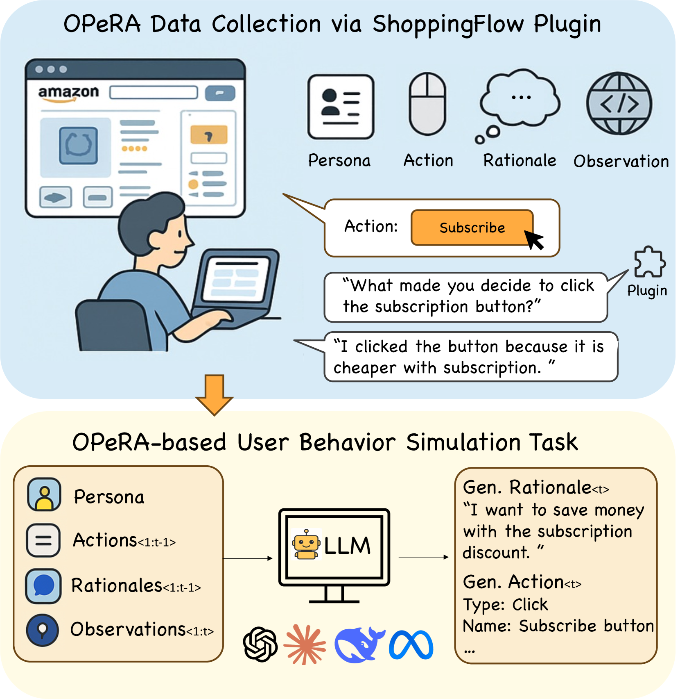
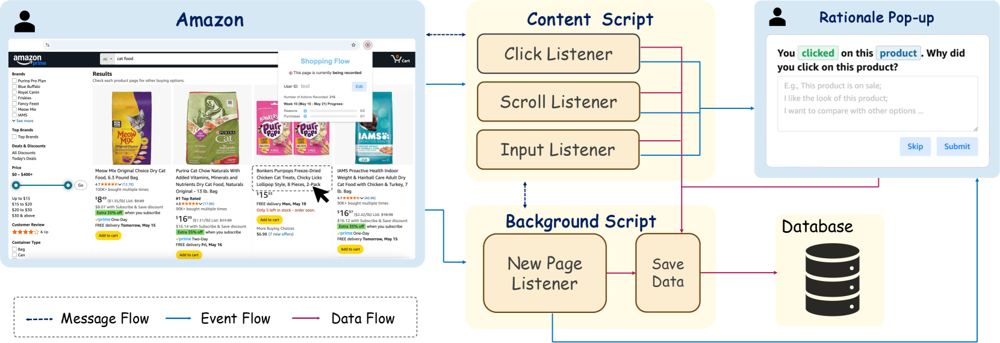
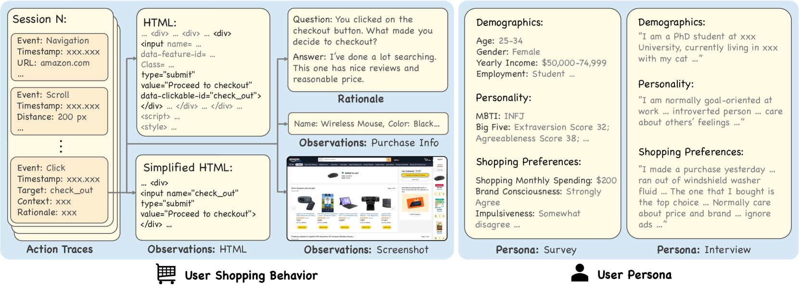

# OPeRA: A Dataset of Observation, Persona, Rationale, and Action for Evaluating LLMs on Human Online Shopping Behavior Simulation

**Authors:** Ziyi Wang, Yuxuan Lu, Wenbo Li, Amirali Amini, Bo Sun, Yakov Bart, Weimin Lyu, Jiri Gesi, Tian Wang, Jing Huang, Yu Su, Upol Ehsan, Malihe Alikhani, Toby Jia-Jun Li, Lydia Chilton, Dakuo Wang
**Institutions:** Northeastern University, USC, Stony Brook University, Ohio State University, University of Notre Dame, Columbia University
**Date:** June 5, 2025
**Paper:** [PDF](https://arxiv.org/abs/2506.05606)

---

## TL;DR

OPeRA is the first public dataset that captures all four pieces of information needed to evaluate whether LLMs can truly mimic a specific person's online shopping behavior: what the user sees (observation), who the user is (persona), what they do (action), and why they do it (rationale). The dataset was collected from 51 real Amazon shoppers over four weeks using a custom Chrome plugin, producing 692 sessions and ~29K action-observation pairs. Benchmarking four frontier LLMs reveals that even the best model (GPT-4.1) only achieves 22% exact-match accuracy on predicting a user's next action, showing that personalized behavior simulation remains a wide-open problem.

---

## Key Figures

### Figure 1: OPeRA Overview and Simulation Task

The top half shows how data is collected: a real user shops on Amazon, the ShoppingFlow Chrome plugin records their actions, captures the web page context, and randomly pops up a question asking "why did you do that?" to collect rationales. The bottom half shows the downstream task: given a user's persona, action history, past rationales, and current page observation, an LLM must predict the next action and rationale — essentially acting as a "digital twin" of the shopper.

### Figure 2: ShoppingFlow Plugin Architecture

The custom Chrome extension has two components: a Content Script that listens for click, scroll, and input events on the Amazon page, and a Background Script that detects page-level events (navigation, reloads) and handles data upload. When certain action types are detected, a rationale pop-up appears (with 8% probability) asking the user to explain why they just did what they did. All data flows to a database (Amazon S3).

### Figure 3: Dataset Components in Detail

A concrete example of one data point. A single session includes timestamped action traces (navigation, scroll, click), paired with observations (full HTML, simplified HTML, screenshot, and product info). Rationales are natural language explanations ("I'm done with searching, this one has nice reviews and reasonable price"). Personas come from both a structured survey (demographics, Big Five personality, MBTI, shopping style inventory) and a semi-structured interview with open-ended responses.

---

## Key Novel Ideas

### 1. First Public Dataset With All Four Pillars: Observation + Persona + Rationale + Action

Prior datasets for user behavior modeling typically capture only one or two of these dimensions. Recommendation datasets (Amazon Review, Taobao, YOOCHOOSE) record purchase/click actions but have no web context, no user personas, and no rationale. Web agent benchmarks (Mind2Web, WebArena, WebShop) have observations but use annotator-generated or synthetic actions — they don't reflect real users' messy, non-linear browsing behavior.

OPeRA is the first dataset to combine all four:
- **O**bservation: full HTML + simplified HTML + screenshot of the page at each action step
- **Pe**rsona: detailed user profiles from survey (demographics, shopping preferences, Big Five personality, MBTI) and optional interview
- **R**ationale: self-reported "just-in-time" explanations of why the user took an action, triggered randomly during natural shopping
- **A**ction: fine-grained web interactions (click, input, scroll, navigate, tab switch) with timestamps and CSS selectors

This combination allows researchers to evaluate not just *what* an LLM predicts but whether its reasoning matches the *why* behind a real person's decisions.

### 2. Just-in-Time Rationale Collection via Random Pop-ups

A key design challenge: how do you collect the reasoning behind someone's shopping actions without disrupting their natural behavior? OPeRA solves this with an 8% trigger probability — the Chrome plugin randomly pops up a context-aware question (e.g., "You clicked on the search button. Why did you make this search?") after certain action types. The questions are tailored to the specific action type (different wording for adding to cart vs. clicking a filter vs. scrolling).

This approach is smart because:
- It collects rationale *in the moment*, not retrospectively (which would suffer from recall bias)
- The 8% rate is low enough to not annoy users or change their behavior
- The context-aware question design yields more specific answers than generic "why did you do that?"

The result: 604 rationale annotations in OPeRA-full, 207 in OPeRA-filtered.

### 3. Dual-Granularity Action Space

OPeRA provides actions at two levels of granularity:
- **Basic actions**: the raw event type (click, scroll, input, navigate, tab activate) with CSS selectors and timestamps
- **Semantic actions**: a simplified action space with three high-level types (click, input, terminate), where clicks are further categorized into 13 semantic subtypes (review, search, product_option, product_link, purchase, nav_bar, filter, etc.)

The semantic layer maps raw CSS selectors to human-interpretable categories. For example, a click on a specific `
` with class `a-star-4` gets labeled as a "review" click type with semantic ID `review.star_rating`. This abstraction makes the dataset usable for LLM-based simulation (where models reason over text) while still preserving the raw data for other research.

### 4. Rich, Multi-Source Persona Profiles

The persona collection goes well beyond basic demographics. Each user's profile includes:
- **Demographics**: age, gender, education, occupation, income, residence, self-description
- **Shopping preferences**: frequency, Amazon Prime membership, 12 Likert-scale items covering seasonality, ad trust, review engagement, delivery influence, and an 8-item Consumer Styles Inventory (brand loyalty, price consciousness, perfectionism, impulsiveness, confusion by overchoice, brand consciousness, recreational consciousness, novelty-seeking)
- **Personality**: full 50-item Big Five Inventory + self-reported MBTI
- **Interview** (optional): 20-minute semi-structured interview about daily life, work, and shopping habits — producing rich, unstructured narrative text

This design is grounded in consumer behavior literature showing that personality traits and shopping styles correlate with online purchasing patterns.

---

## Data Collection Pipeline

### Phase 1: Recruitment
84 participants recruited via snowball sampling. Inclusion criteria: frequent Amazon customers who planned to make at least one purchase in the coming weeks. Based in the U.S., 18+, English speakers.

### Phase 2: Persona Collection
- Online survey covering demographics, shopping preferences (12 Likert-scale items), and personality (50-item Big Five + MBTI)
- Optional 20-minute semi-structured interview about personal background and shopping habits

### Phase 3: Behavior Collection (4 weeks)
- Participants install ShoppingFlow Chrome plugin and shop naturally on Amazon
- Plugin automatically captures: clicks (with CSS selectors), scrolls (with positions), text inputs, page navigations, tab switches
- Each action paired with: full HTML, simplified HTML (via custom parser with semantic IDs), and screenshots
- Rationale pop-ups triggered at 8% probability for certain action types

### Phase 4: Post-Processing
- PII removal: plugin configured to skip login/checkout/account pages; automated script masks names, addresses, zip codes; manual review
- Purchase inference: "purchase" actions inferred from clicks on "proceed to checkout"/"buy now"/"set subscription" buttons
- Session segmentation: two-step strategy using 78-minute time threshold (99th percentile of inter-action gaps) + purchase signal boundaries
- Filtering: sessions with <5 actions removed; clicks on non-interactive areas removed; Amazon Rufus interactions removed

### Output
| Metric | OPeRA-full | OPeRA-filtered |
|---|---|---|
| Users | 51 | 51 |
| Sessions | 692 | 527 |
| Action-Observation Pairs | 28,904 | 5,856 |
| Rationale Annotations | 604 | 207 |

---

## Key Results

### Next Action Prediction (OPeRA-test: 15 users, 90 sessions, 902 action instances)

| Model | Action Gen. Accuracy | Action Type Macro F1 | Action Type Weighted F1 | Click Type Weighted F1 | Session Outcome Accuracy | Session Outcome Weighted F1 |
|---|---|---|---|---|---|---|
| **GPT-4.1** | 21.51% | 48.78% | 85.04% | 44.47% | 38.89% | 47.54% |
| GPT-4.1 w/o persona | **22.06%** | 45.55% | 82.32% | 43.45% | **55.55%** | **58.47%** |
| GPT-4.1 w/o rationale | 21.28% | 34.93% | 83.13% | 42.63% | 53.33% | 51.17% |
| **DeepSeek-R1** | 14.75% | 27.37% | 81.99% | 35.12% | 51.11% | 46.36% |
| DeepSeek-R1 w/o persona | 15.52% | 27.43% | 81.72% | 33.86% | 56.67% | 48.86% |
| DeepSeek-R1 w/o rationale | 15.74% | 27.16% | 81.66% | 32.65% | 53.33% | 47.92% |
| **Claude-3.7-Sonnet** | 10.75% | 31.58% | 83.41% | 27.27% | 52.22% | 43.52% |
| Claude-3.7 w/o persona | 10.75% | 25.33% | 82.28% | 22.76% | 50.00% | 43.10% |
| Claude-3.7 w/o rationale | 10.08% | 26.06% | 81.08% | 20.29% | 47.78% | 43.10% |
| **Llama-3.3-70B** | 8.31% | 24.29% | 80.69% | 19.99% | 34.44% | 36.64% |
| Llama-3.3 w/o persona | 8.31% | 23.69% | 78.59% | 18.59% | 28.89% | 33.21% |
| Llama-3.3 w/o rationale | 8.76% | 23.60% | 80.23% | 19.22% | 31.11% | 34.19% |

### Action Type Distribution in OPeRA-filtered

| Action Type | Count | Percentage |
|---|---|---|
| Click | 5,051 | 86.3% |
| Text Input | 597 | 10.2% |
| Terminate | 208 | 3.6% |

### Click Subtype Distribution (Top 5)

| Click Type | Count | Percentage |
|---|---|---|
| Review | 1,052 | 20.8% |
| Search | 763 | 15.1% |
| Product Option | 700 | 13.9% |
| Product Link | 537 | 10.6% |
| Other | 449 | 8.9% |

---

## Key Takeaways

1. **The best model only gets 22% exact-match accuracy on next-action prediction.** GPT-4.1 leads, but even it can only predict the exact next action (correct click target or correct input text) about one in five times. This shows that simulating a *specific* person's shopping behavior at the action level is far from solved.

2. **High-level action type prediction is much easier than exact action prediction.** All models achieve >80% weighted F1 on action type classification (click vs. input vs. terminate), because clicks dominate at 86% of actions. But predicting *what* to click on is where models fail — click type weighted F1 drops to 19-44%.

3. **Rationale history consistently helps.** Removing historical rationale from the input hurts performance across most models and metrics, especially on session outcome prediction. This validates the paper's core thesis: knowing *why* a user did something in the past helps predict *what* they'll do next.

4. **Persona information has a nuanced effect.** Persona generally helps with action type and click type prediction (it provides priors about shopping style), but counterintuitively, adding persona sometimes *hurts* exact-match accuracy. The authors hypothesize that current models can't deeply integrate persona into step-level decisions — they may get distracted by persona details rather than helped by them.

5. **Model size and context length matter significantly.** GPT-4.1 (with its large context window) substantially outperforms DeepSeek-R1 and Claude-3.7, which in turn outperform Llama-3.3-70B. Shopping sessions with full HTML observations can be very long, and models that can process more context handle this better.

6. **Session outcome prediction is surprisingly hard.** Even predicting the binary outcome of a session — does the user purchase something or not? — tops out around 58% weighted F1. Users' purchase decisions depend on complex internal reasoning that current models can't capture from persona + interaction history alone.

7. **Real user behavior is fundamentally different from annotator behavior.** Existing web agent benchmarks use annotator-generated traces where people take the shortest, most direct path. Real shoppers browse non-linearly: they compare products, read reviews, go back, check carts, and make decisions through complex multi-step flows. This makes OPeRA uniquely valuable.

8. **The just-in-time rationale collection design is worth replicating.** Collecting rationales through random pop-ups during natural shopping (rather than retrospectively or by annotators) produces authentic explanations tied to the actual moment of decision. The 8% trigger rate balances data collection with minimal disruption.

9. **Screenshots were collected but not used in experiments.** The dataset includes screenshots at every action step, but the current benchmarks only use text (HTML). This leaves a clear opportunity for multimodal models to potentially close the gap by leveraging visual layout and salience cues.

10. **The simplified HTML with semantic IDs is a practical contribution.** The custom web parser that reduces full Amazon HTML to clean, semantically-labeled elements (e.g., `search_result.product_name`, `refinements.colors.red`) makes the data tractable for LLMs without losing the functional structure of the page.

---

## What's Open-Sourced

- **OPeRA dataset**: Available on HuggingFace at [NEU-HAI/OPeRA](https://huggingface.co/datasets/NEU-HAI/OPeRA)
  - Includes: user personas (survey + interview), action traces with timestamps and CSS selectors, simplified HTML observations, rationale annotations, and purchase information
- **No model checkpoints released** (all experiments are zero-shot prompting of existing LLMs)
- **Prompt templates** for next action prediction are provided in the paper's appendix
