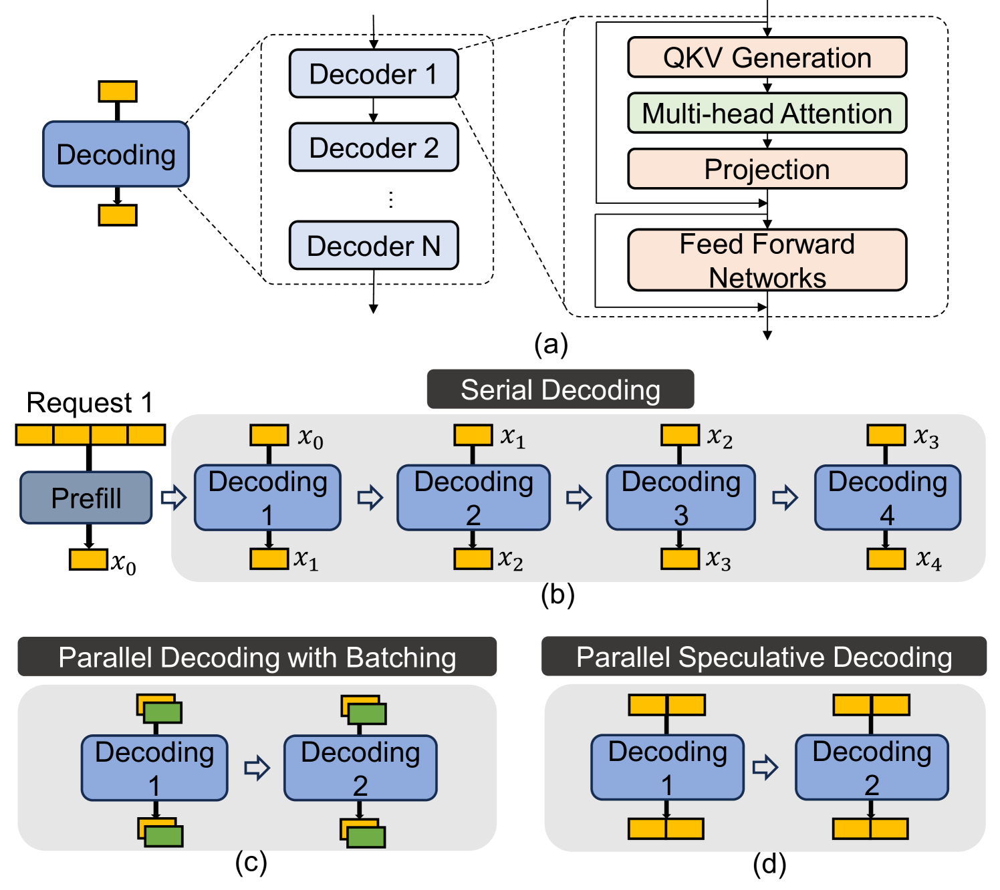
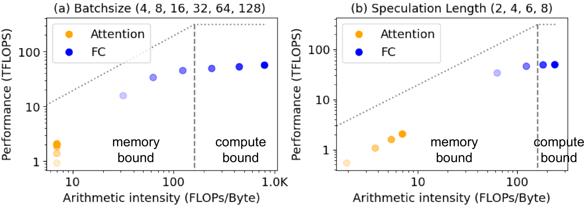
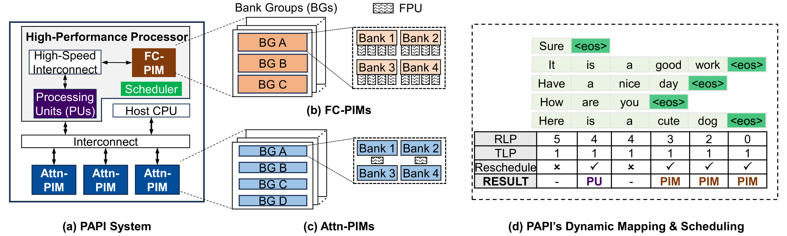
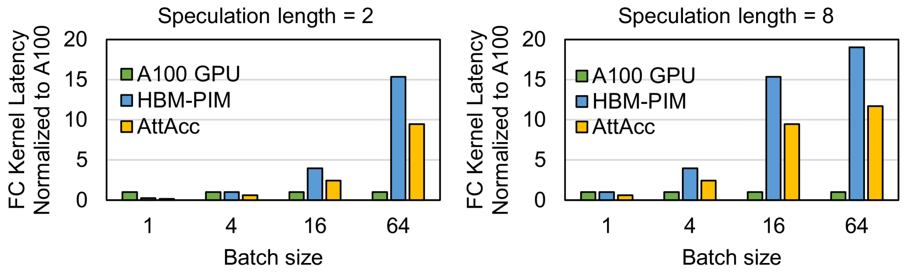
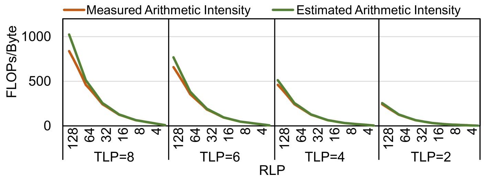
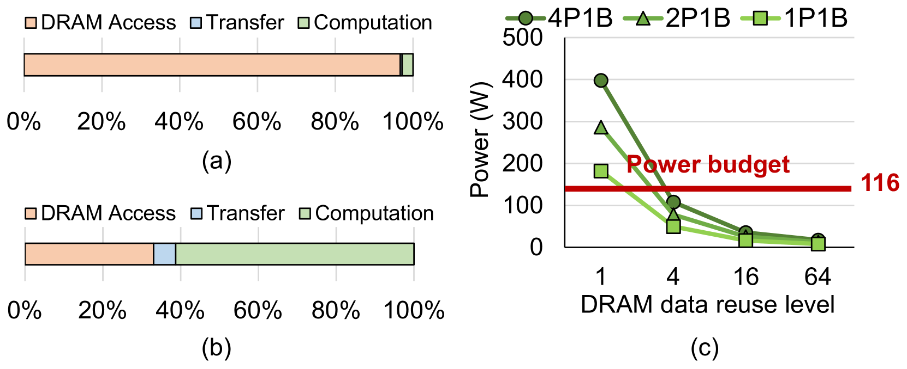
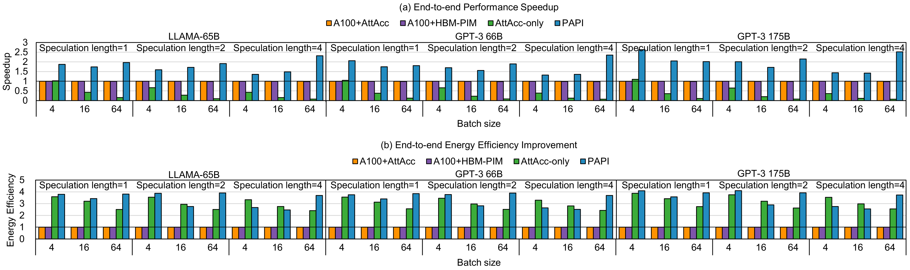

# PAPI: Exploiting Dynamic Parallelism in Large Language Model Decoding with a Processing-In-Memory-Enabled Computing System

**Authors:** Yintao He, Haiyu Mao, Christina Giannoula, Mohammad Sadrosadati, Juan Gomez-Luna, Huawei Li, Xiaowei Li, Ying Wang, Onur Mutlu

**Affiliations:** SKLP / Institute of Computing Technology (CAS), University of Chinese Academy of Sciences, King's College London, ETH Zurich, University of Toronto, Vector Institute, NVIDIA

**Date:** February 2025 (v2: 27 Feb 2025)

**Venue:** ASPLOS 2025

**Link:** [https://arxiv.org/abs/2502.15470](https://arxiv.org/abs/2502.15470)

---

## TL;DR

PAPI is a heterogeneous hardware architecture that combines GPU processing units (PUs) with two specialized types of Processing-In-Memory (PIM) units -- FC-PIM and Attn-PIM -- to accelerate LLM decoding. The key insight is that LLM decoding kernels dynamically shift between compute-bound and memory-bound as batch size and speculation length change at runtime, so static kernel-to-hardware mapping is suboptimal. PAPI introduces an online arithmetic-intensity estimator that dynamically schedules fully-connected (FC) kernels to either GPUs or PIM units at each decoding step, achieving 1.8x speedup and 3.4x energy efficiency improvement over the best prior heterogeneous accelerator.

---

## Key Figures

### Figure 1: LLM Decoding Overview


An LLM decoder has four kernel types: QKV generation, multi-head attention, projection, and feed-forward networks. These split into two categories: fully-connected (FC) layers (orange) and multi-head attention (green). All kernels are general matrix-vector multiplications (GEMVs). Part (b) shows serial decoding (one token per iteration). Parts (c) and (d) show the two parallelism techniques -- batching (multiple requests processed together, increasing Request-Level Parallelism / RLP) and speculative decoding (multiple tokens per request, increasing Token-Level Parallelism / TLP). Both increase parallelism, which changes whether kernels are compute-bound or memory-bound.

### Figure 2: Roofline Analysis -- Why Kernels Change Character


This is the central motivation figure. Using the roofline model on an A100 GPU for OPT-30B: (a) As batch size increases from 4 to 128, FC kernels move from memory-bound to compute-bound (crossing the roofline ridge), while attention kernels stay memory-bound regardless of batch size. (b) As speculation length increases from 2 to 8, FC kernels become compute-bound at length >= 6, while attention remains memory-bound. The key takeaway: FC and attention kernels have fundamentally different and dynamically changing computational profiles, so they need different hardware and dynamic scheduling.

### Figure 5: PAPI System Architecture


The full PAPI system has three main components: (a) A high-performance processor with Processing Units (GPU tensor cores), FC-PIM memory units connected via high-speed NVLink, a hardware scheduler, and a host CPU. Physically separate Attn-PIM units connect via PCIe/CXL. (b) FC-PIM uses 4 FPUs per bank (4P1B config) with 3 bank groups -- optimized for higher computation throughput. (c) Attn-PIM uses 1 FPU per 2 banks (1P2B config) with 4 bank groups -- optimized for higher memory capacity. (d) Dynamic scheduling example: as requests finish (RLP drops, TLP stays at 1), the scheduler detects the shift from compute-bound to memory-bound and reschedules FC kernels from PUs to PIM.

### Figure 4: Why Static Mapping Fails


FC kernel latency (normalized to A100 GPU) across three hardware platforms at different batch sizes and speculation lengths. At low parallelism (batch=1), PIM architectures (HBM-PIM, AttAcc) are faster than the A100 GPU. But at high parallelism (batch >= 16), the A100 GPU is dramatically faster. Since parallelism varies at runtime, no single static assignment works -- the hardware choice must be dynamic.

### Figure 6: Arithmetic Intensity Estimation Accuracy


PAPI estimates FC kernel arithmetic intensity as AI = RLP x TLP (Equation 2 in the paper). This plot compares estimated vs. measured arithmetic intensity for GPT-3 66B across various RLP and TLP configurations. The estimates closely match reality across the board. At very high RLP (e.g., 128), estimated values are slightly above actual values because they exceed the hardware's theoretical peak -- but this does not affect the scheduling decision (correctly identified as compute-bound).

### Figure 7: PIM Energy Breakdown and Design Space


(a) Without data reuse, DRAM access dominates PIM energy at 96.7%. (b) With 64x data reuse (from batching), DRAM access drops to 33.1% and computation becomes significant. (c) Power consumption vs. DRAM data reuse level for different FPU-per-bank configs (1P1B, 2P1B, 4P1B). The 116W HBM3 power budget (red line) constrains how many FPUs per bank are feasible. At data reuse >= 4, the 4P1B config fits within the power budget, which is why PAPI uses 4P1B for FC-PIM. Attn-PIM uses 1P2B because attention has no data reuse benefit.

### Figure 8: End-to-End Performance (Creative Writing)


End-to-end performance across LLaMA-65B, GPT-3 66B, and GPT-3 175B on the Dolly creative-writing dataset. PAPI consistently outperforms all baselines across batch sizes (4, 16, 64) and speculation lengths (1, 2, 4). Average speedups: 1.8x over A100+AttAcc, 1.9x over A100+HBM-PIM, 11.1x over AttAcc-only. Energy efficiency gains: 3.4x over A100+AttAcc on average.

---

## Key Novel Ideas

### 1. Dynamic Kernel Characterization at Runtime

Prior PIM-based LLM accelerators use **static** scheduling: they permanently assign FC kernels to one type of hardware and attention kernels to another. PAPI observes that this is wrong because the same FC kernel can be compute-bound or memory-bound depending on the current batch size (RLP) and speculation length (TLP), both of which change dynamically at runtime.

Three reasons parallelism changes dynamically:
- **SLO limits:** Different latency SLOs dictate different maximum batch sizes (e.g., a 30ms SLO on DGX A100 limits initial RLP to 22).
- **Memory capacity:** KV cache for longer sequences forces smaller batches (640 GB HBM can house 282 requests at length 128 but only 18 at length 2048).
- **Dynamic batching:** Mixed continuous batching adds/removes requests mid-batch, so runtime RLP varies as individual requests finish.

### 2. Simple Arithmetic Intensity Estimator

PAPI uses a lightweight formula to decide kernel placement:

**Arithmetic Intensity (AI) of an FC kernel:**

```
AI = #FLOPs / #Bytes = (RLP x TLP x h^2 x 2) / ((2 x RLP x TLP x h + h^2) x 2)
```

Since the hidden dimension h is very large in modern LLMs (e.g., h = 12288 for GPT-3 175B), this simplifies to:

```
AI ~ RLP x TLP
```

This means the scheduler only needs to multiply two integers (current batch size and speculation length) and compare against a threshold alpha to decide whether to run FC on GPU or PIM. The threshold alpha is determined offline via iterative evaluation. This is remarkably low-overhead -- no profiling, no simulation, just one multiply and one compare.

### 3. Hybrid PIM Architecture with Two Specialized PIM Types

Prior work uses a single PIM design for all memory-bound kernels. PAPI observes that FC and attention kernels have very different needs even when both are memory-bound:

- **FC-PIM (4P1B):** 4 floating-point units per DRAM bank, 3 bank groups, 96 banks per HBM die. Optimized for higher computation throughput. Connected to GPU via high-speed NVLink (for large weight parameter transfers).
- **Attn-PIM (1P2B):** 1 floating-point unit per 2 DRAM banks, 4 bank groups. Optimized for larger memory capacity (KV caches grow with sequence length). Connected via PCIe/CXL (smaller data transfers). Physically disaggregated to allow flexible scaling.

The design choices are driven by HBM3 constraints:
- **Power budget:** 116W per 16GB HBM3 cube. At data reuse >= 4 (typical for batched FC), 4P1B stays within budget.
- **Area constraint:** 121 mm^2 per HBM die. With bank area = 0.83 mm^2 and FPU area = 0.1025 mm^2, the 4P1B config allows max 97 banks per die (PAPI uses 96).

### 4. Token-Level Dynamic Rescheduling

The scheduler does not just decide once at the start. It re-evaluates at every decoding iteration using a four-step process:

1. Gather output tokens and count how many requests finished (emitted `<eos>`).
2. Update RLP by subtracting finished requests.
3. Compute estimated AI = RLP x TLP.
4. Compare against threshold alpha. If the kernel switched from compute-bound to memory-bound (or vice versa), reschedule FC from PUs to FC-PIM (or vice versa).

When FC moves to PIM, the FC-PIM memory units store the weight parameters. When FC moves back to GPU, FC-PIM memory serves as regular main memory for the PUs.

---

## Architecture Details

### System Components

| Component | Role | Interconnect |
|---|---|---|
| Host CPU | Sends instructions, runs scheduling logic | -- |
| Processing Units (PUs) | GPU tensor cores for compute-bound FC kernels | NVLink to FC-PIM |
| FC-PIM units | 4P1B PIM for memory-bound FC kernels; also serves as main memory for PUs | NVLink to PUs |
| Attn-PIM units | 1P2B PIM for attention kernels (always memory-bound) | PCIe/CXL |
| Hardware Scheduler | Monitors RLP/TLP, computes AI, triggers rescheduling | On-chip |

### FC-PIM Design (4P1B)

- 4 FPUs per DRAM bank at 666 MHz
- 96 banks per HBM die, 3 bank groups
- Data reuse: activated DRAM row is read once and used for multiple FC computations (up to 64x reuse), dramatically reducing DRAM access energy from 96.7% to 33.1% of total
- Area: m(0.1025 x 4 + 0.83) <= 121 mm^2 --> max 97 banks

### Attn-PIM Design (1P2B)

- 1 FPU shared across 2 DRAM banks at 666 MHz, with 20.8 MB/s per-bank bandwidth
- 4 bank groups per HBM die
- Disaggregated (physically separate from GPU) to accommodate growing KV cache needs
- Uses 1P2B instead of 1P1B because 1P1B exceeds power budget at speculation length = 1 (where attention has no data reuse)

### Data Partitioning

- **Attention:** Each attention head assigned to a separate HBM device. K^T matrix is column-wise partitioned at pseudo-channel and bank-group levels, row-wise at bank and multiplier levels. V matrix is row-wise at pseudo-channel/bank-group, column-wise at bank/multiplier.
- **FC kernel:** Large weight matrix divided into 2D blocks across HBM devices at pseudo-channel, bank-group, and bank levels.

### System Integration

- **FC-PIM to GPU:** NVLink (high bandwidth needed for large weight parameters)
- **Attn-PIM to system:** PCIe or CXL (sufficient for small Q-vector transfers). PCIe supports up to 32 devices per bus; CXL scales to 4,096 devices.

---

## Evaluation Setup

### Hardware Configurations Compared

| System | GPU | PIM | Notes |
|---|---|---|---|
| **A100+AttAcc** (baseline) | 6x NVIDIA A100 (80GB) | AttAcc PIM (1P1B) | State-of-the-art heterogeneous |
| **A100+HBM-PIM** | 6x NVIDIA A100 (80GB) | Samsung HBM-PIM (1P2B) | Commercial PIM |
| **AttAcc-only** | None | AttAcc PIM (1P1B) | PIM-only baseline |
| **PAPI** | 6x A100 (60GB*) | FC-PIM (4P1B) + Attn-PIM (1P2B) | Proposed system |

*PAPI uses 60GB GPU memory (not 80GB) because 12GB per GPU is allocated to FC-PIM. Each system has 90 HBM devices total (30 for FC, 60 for attention) for fair comparison.

### Models and Datasets

- **Models:** LLaMA-65B, GPT-3 66B, GPT-3 175B (all FP16)
- **Dataset:** Dolly (creative-writing and general-qa tasks)
- **Parallelism settings:** Batch sizes 4, 16, 64; speculation lengths 1, 2, 4
- **Simulator:** Ramulator 2.0 (HBM-based PIM simulator) + AttAcc

---

## Key Results

### End-to-End Speedup (Creative Writing Dataset)

| Metric | vs. A100+AttAcc | vs. A100+HBM-PIM | vs. AttAcc-only |
|---|---|---|---|
| **Average Speedup** | **1.8x** | **1.9x** | **11.1x** |
| **Peak Speedup** | ~3x | ~3x | ~15x |

### End-to-End Speedup (General QA Dataset)

| Metric | vs. A100+AttAcc | vs. A100+HBM-PIM | vs. AttAcc-only |
|---|---|---|---|
| **Average Speedup** | **1.7x** | **1.7x** | **8.1x** |

Speedups on general-qa are lower than creative-writing because creative-writing has longer outputs, making the decoding phase (where PAPI helps) a larger fraction of total execution.

### Energy Efficiency

| Dataset | vs. A100+AttAcc | vs. AttAcc-only |
|---|---|---|
| Creative-writing | **3.4x** | **1.15x** |
| General-qa | **3.1x** | **1.01x** |

PAPI improves energy efficiency by offloading FC kernels from power-hungry GPU cores to energy-efficient PIM cores (DRAM data reuse reduces the dominant DRAM access energy).

### Sensitivity Analysis (LLaMA-65B, Creative Writing)

**Varying RLP (batch size 4-128, speculation length = 1):**
- PAPI achieves 1.5x average speedup over A100+AttAcc and 3.0x over AttAcc-only.
- At low RLP (batch=4), AttAcc-only beats A100+AttAcc because PIM is faster for memory-bound FC. But as RLP increases, AttAcc-only degrades sharply because PIM cannot handle compute-bound FC. PAPI is best at all RLP values.

**Varying TLP (speculation length 1-8, batch size = 4):**
- PAPI speedup over A100+AttAcc decreases as TLP grows, because higher TLP makes more FC kernels compute-bound, which PAPI correctly offloads to GPU (converging toward A100+AttAcc behavior).

### PIM-Only Analysis (Decoding Phase Only)

PIM-only PAPI (with FC-PIM + Attn-PIM but no GPU) achieves **2.3x** average speedup over AttAcc-only, demonstrating the value of the hybrid PIM design alone.

### Execution Time Breakdown (LLaMA-65B, batch=4, speculation=4)

| Component | AttAcc-only | PIM-only PAPI |
|---|---|---|
| FC layer | ~8 ms (dominates) | ~2.8 ms (**2.9x faster**) |
| Attention layer | ~0.5 ms | ~0.85 ms (1.7x slower*) |
| Communication | ~0.2 ms | ~1.1 ms (28.2% of total) |

*Attn-PIM is 1.7x slower than AttAcc's 1P1B on attention because PAPI uses 1P2B to stay within power budget. But FC kernels dominate total execution time, so the net effect is a large overall speedup.

---

## Key Takeaways

1. **LLM decoding parallelism is dynamic, not static.** Batch size and speculation length change at runtime due to SLO constraints, memory limits, and dynamic batching. Any static assignment of kernels to hardware units is fundamentally suboptimal.

2. **FC and attention kernels need different hardware.** Even when both are memory-bound, FC has ~4.5x higher arithmetic intensity than attention (31.7 vs. 7.0 FLOPs/Byte at batch=4, speculation=8). They need PIM units with different FPU-to-bank ratios.

3. **Arithmetic intensity of FC layers can be estimated as RLP x TLP.** This is because the hidden dimension h is so large that the weight matrix dominates memory traffic. The estimator is accurate and has negligible overhead (one multiply + one compare).

4. **Data reuse in PIM is the key to enabling more FPUs per bank.** Without batching, DRAM access is 96.7% of PIM energy. With 64x data reuse, it drops to 33.1%, freeing power and energy budget for more computation units (4 FPUs per bank).

5. **Disaggregated Attn-PIM enables flexible scaling.** By physically separating attention PIM from the GPU, PAPI can scale memory capacity for KV caches independently. CXL can theoretically connect up to 4,096 Attn-PIM devices.

6. **Communication is the next bottleneck.** At 28.2% of decoding time in PIM-only PAPI, inter-device communication is significant. Future work should explore faster interconnects or communication-computation overlap.

7. **PAPI is robust across models and workloads.** The 1.8x speedup holds across LLaMA-65B, GPT-3 66B, and GPT-3 175B on both creative-writing (longer outputs) and general-qa (shorter outputs) tasks.

8. **Energy efficiency gains are even larger than speedup gains.** PAPI achieves 3.4x energy efficiency improvement over A100+AttAcc, because PIM processing cores are far more energy-efficient than GPU cores for memory-bound operations.

9. **The approach naturally extends to Mixture-of-Experts (MoE).** FC-PIM can exploit sparsity in MoE by storing weight slices from different experts in the same DRAM bank, reducing idle FPUs and data movement.

10. **HBM power and area constraints tightly bound PIM design.** The 116W power budget and 121 mm^2 area limit per HBM die are hard constraints that directly determine the maximum FPU count (96 banks for 4P1B, fewer for higher FPU counts).

---

## What's Open-Sourced

The paper does not mention any open-source code, hardware designs, or simulation scripts. The evaluation uses a modified version of the Ramulator 2.0 open-source HBM simulator and the AttAcc simulator from prior work. Ramulator 2.0 is available at its original repository, but PAPI-specific modifications do not appear to be released.
