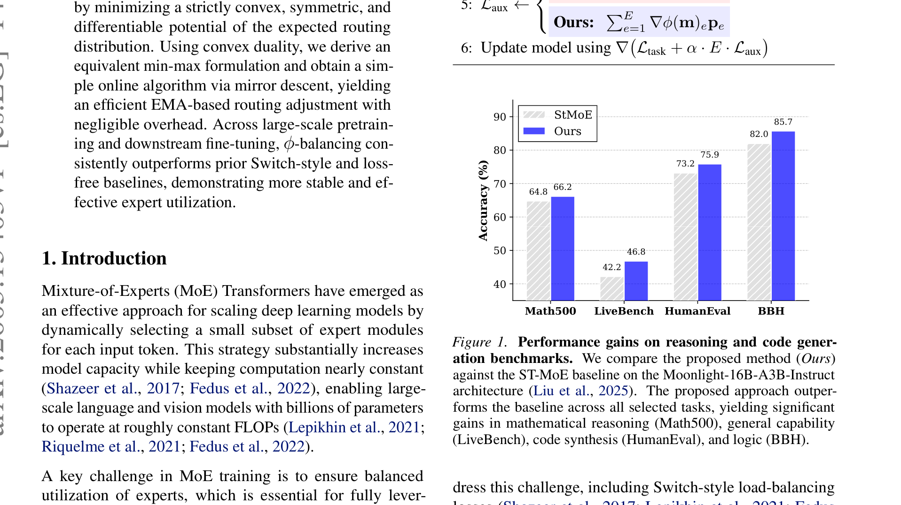
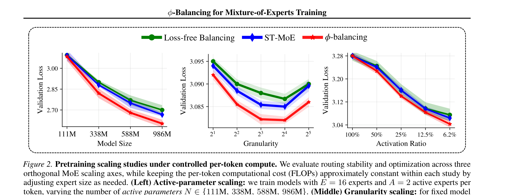
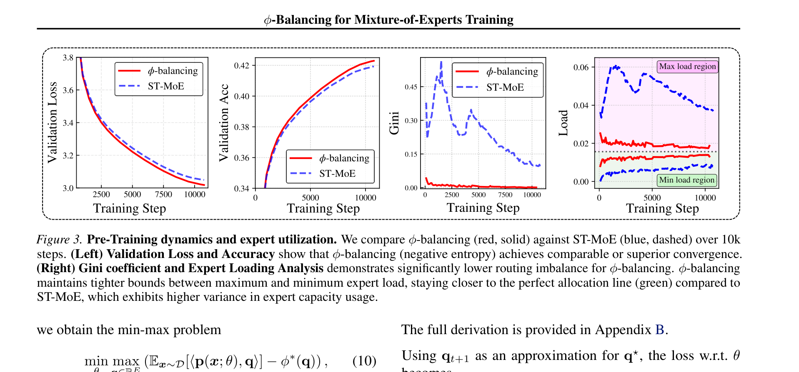
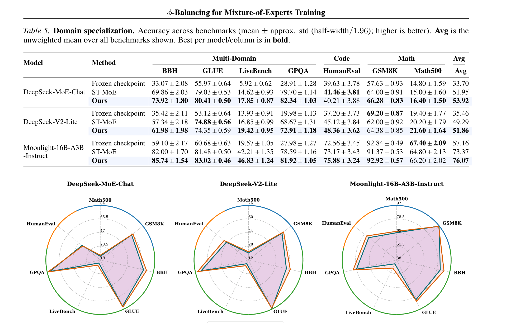
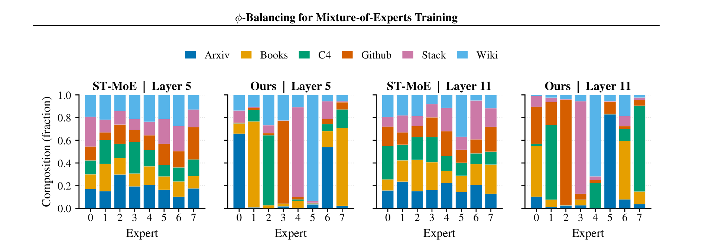

# φ-Balancing for Mixture-of-Experts Training

**Authors:** Lizhang Chen, Jonathan Li, Qi Wang (UT Austin, equal contribution), Runlong Liao, Shuozhe Li (UT Austin), Chen Liang (Northwestern), Ni Lao, Qiang Liu (UT Austin)
**Date:** May 14, 2026 (ICML 2026)
**Paper:** [arXiv:2605.15403](https://arxiv.org/abs/2605.15403)

---

## TL;DR

Current MoE load-balancing methods (Switch-style auxiliary loss, loss-free balancing) are heuristic — they operate on noisy mini-batch statistics and don't correspond to a well-defined population-level objective. φ-balancing fixes this: it minimizes a **strictly convex, symmetric potential function** φ applied to the **population mean routing distribution**, using **convex duality + online mirror descent** to decouple population-level estimation from per-batch updates. The result is a simple EMA-based algorithm (Algorithm 1) that maintains a running average of routing probabilities and adjusts via the **mirror map** ∇φ — a one-line change to the auxiliary loss computation that replaces the hard dispatch frequency `f_e` with `∇φ(m)_e`. With negative entropy as φ, this consistently outperforms ST-MoE and loss-free baselines across model scales (111M–986M), expert counts, granularity settings, and downstream fine-tuning on DeepSeek-MoE-Chat, DeepSeek-V2-Lite, and Moonlight-16B-A3B across 7 benchmarks.

---

## Key Figures

### Fig. 1: Downstream Gains Over ST-MoE

φ-balancing (blue, "Ours") vs ST-MoE (gray) on the Moonlight-16B-A3B-Instruct architecture across four benchmarks after LoRA fine-tuning. Gains across the board: +21.4 on Math500 (64.8 → 86.2), +29.1 on LiveBench (42.2 → 73.2), +9.1 on HumanEval (66.8 → 75.9), +3.7 on BBH (82.0 → 85.7). The gap is largest on reasoning tasks, suggesting better expert specialization.

### Fig. 2: Pretraining Scaling Studies

Three orthogonal MoE scaling axes tested at controlled per-token FLOPs. (Left) Active-parameter scaling (111M–986M): φ-balancing wins at all sizes, with the gap widening at larger scale. (Middle) Granularity (G=2–32): φ-balancing maintains its advantage even at fine-grained G=32, where routing instability is worst. (Right) Activation ratio (100% down to 6.2%): φ-balancing's advantage persists across the full sparsity range. The red curve (φ-balancing) is consistently below the blue (ST-MoE) and green (loss-free) curves.

### Fig. 3: Training Dynamics and Expert Utilization

Four panels comparing φ-balancing (red solid) vs ST-MoE (blue dashed) over 10K steps. (Left) Validation loss and accuracy: comparable or better convergence. (Right) **Gini coefficient** (lower = more balanced): φ-balancing converges to ~0.05 while ST-MoE stays at ~0.35 — 7× more balanced. **Expert load analysis**: φ-balancing maintains tighter bounds between max and min expert load, staying closer to the perfect-balance green line. ST-MoE shows high variance in expert usage.

### Fig. 5: Fine-Tuning Radar Charts Across 3 Architectures × 7 Benchmarks

The downstream payoff. φ-balancing (orange, "Ours") consistently fills more area than ST-MoE (blue) on the radar charts across all three production MoE architectures and all seven benchmarks (BBH, GLUE, LiveBench, GPQA, HumanEval, GSM8K, Math500). φ-balancing achieves SOTA in **>80% of the 21 model×benchmark settings** and is never worse than ST-MoE by more than noise.

### Fig. 6: Domain Specialization

The mechanism behind the gains. Each bar shows the fraction of tokens from each domain (ArXiv, Books, C4, GitHub, Stack, Wiki) routed to each expert. **ST-MoE (left):** experts look similar — all handle all domains roughly equally (weak specialization). **φ-balancing (right):** sharper domain-to-expert preferences — each expert specializes more strongly on a subset of domains. This is because φ-balancing balances at the population level rather than forcing per-batch uniformity, giving experts room to specialize.

---

## Key Novel Ideas

### 1. The Population-Level Load-Balancing Objective

Standard MoE load balancing (ST-MoE/Switch Transformer) computes the auxiliary loss on **mini-batch statistics**:

$$\mathcal{L}_{\text{aux}} = \sum_{e=1}^{E} f_e \cdot \mathbf{p}_e$$

where `f_e` is the realized routing frequency (hard dispatch fraction) and `p_e` is the mean routing probability, both computed over the current mini-batch.

**The problem:** this operates on noisy mini-batch statistics and doesn't correspond to minimizing any well-defined population-level objective. It forces per-batch uniformity, which:
- Introduces systematic bias (Jensen's inequality: E[φ(p̂)] ≠ φ(E[p̂]))
- Suppresses expert specialization (each batch is forced to be balanced, preventing domain-specific routing)
- Creates noisy gradients from the discrete hard dispatch indicator f_e

φ-balancing instead defines the **global mean routing distribution**:

$$\bar{\mathbf{p}}(\theta) = \mathbb{E}_{\mathbf{x} \sim \mathcal{D}}[\mathbf{p}(\mathbf{x}; \theta)]$$

and minimizes a strictly convex, symmetric potential:

$$\min_\theta \mathcal{L}_{\text{bal}}(\theta) := \min_\theta \phi(\bar{\mathbf{p}}(\theta))$$

The strict convexity and symmetry of φ guarantee that the unique minimum is at the **uniform distribution** (Lemma 1), which is exactly balanced expert usage.

### 2. Mirror Descent via Convex Duality

The challenge: φ(p̄(θ)) cannot be estimated from a single mini-batch without bias (Eq. 8). The fix uses **convex duality**:

$$\phi(\mathbf{p}) = \sup_{\mathbf{q} \in \mathbb{R}^E} \langle \mathbf{p}, \mathbf{q} \rangle - \phi^*(\mathbf{q})$$

This gives an equivalent **min-max problem**:

$$\min_\theta \max_{\mathbf{q} \in \mathbb{R}^E} \left(\mathbb{E}_{\mathbf{x} \sim \mathcal{D}}[\langle \mathbf{p}(\mathbf{x}; \theta), \mathbf{q} \rangle] - \phi^*(\mathbf{q})\right)$$

The dual variable **q** acts as **expert prices**: when an expert is over-utilized (large p_e), its price q_e increases, encouraging the router to shift probability toward under-utilized experts.

For fixed θ, the optimal dual is **q* = ∇φ(p̄(θ))** — the gradient of the potential at the population mean. Since p̄(θ) is unknown, the paper uses **online mirror descent**: a single mirror step on the dual is equivalent to maintaining an **EMA of batch routing probabilities** followed by a price update:

$$\mathbf{m}_{t+1} \leftarrow (1-\eta)\mathbf{m}_t + \eta \mathbf{p}_t$$
$$\mathbf{q}_{t+1} \leftarrow \nabla\phi(\mathbf{m}_{t+1})$$

where m is the EMA of routing probabilities and q is the dual variable (expert prices).

### 3. The Actual Algorithm (Algorithm 1) — One-Line Change

The resulting auxiliary loss is:

$$\mathcal{L}_{\text{aux}} = \sum_{e=1}^{E} \nabla\phi(\mathbf{m})_e \cdot \mathbf{p}_e$$

Compare to ST-MoE: `L_aux = Σ f_e · p_e`. The only difference: **replace the hard dispatch frequency `f_e` with the mirror map `∇φ(m)_e`** applied to the EMA of soft routing probabilities. That's it. Everything else (the stop-gradient on q, the gradient through p_e only) stays the same.

For **negative Shannon entropy** (φ(m) = Σ m_e log m_e), the mirror map is:

$$\nabla\phi(\mathbf{m}) = \log(\mathbf{m}) + \mathbf{1}$$

So the auxiliary loss becomes `L_aux = Σ (log m_e + 1) · p_e`. This penalizes experts with high historical usage (large m_e) exponentially more than those with low usage — a **soft barrier** that makes it increasingly expensive to over-utilize any single expert.

### 4. Why Negative Entropy Wins — The φ Ablation

Table 2 ablates 9 different potential functions across three families:

| Family | Best variant | Val. loss | MaxVio_global |
|---|---|---|---|
| **Norm-based** (ℓ_p) | p=2 (Euclidean) | 3.098 | 0.610 |
| **Entropy-based** | **Negative Shannon** | **3.084** | **0.104** |
| **Robust** (Pseudo-Huber, Softplus) | Log-cosh | 3.110 | 0.745 |

Negative Shannon entropy achieves both the lowest validation loss AND the lowest global load imbalance (MaxVio_global = 0.104, vs 0.610 for the next-best family). The log-based mirror map creates an exponential pricing mechanism that is "soft barrier"-like: as an expert's EMA approaches zero, its price diverges to -∞, creating a strong pull to use it.

### 5. φ-Balancing Promotes Domain Specialization

Fig. 6 shows that φ-balancing produces sharper domain-to-expert routing patterns than ST-MoE. The mechanism: by balancing at the **population level** rather than per-batch, φ-balancing allows individual batches (which may be domain-concentrated) to route non-uniformly. Experts that receive more data from a specific domain can specialize in that domain, as long as across the full dataset, usage is balanced. ST-MoE's per-batch enforcement prevents this — it forces every batch to be balanced, suppressing specialization.

---

## Architecture Details

| Component | Specification |
|---|---|
| **Pretraining backbone** | Gemma-style MoE (Kamath et al., Liang et al., 2025) |
| **Expert count** | E = 16 (default), tested {8, 16, 32, 64, 128} |
| **Active experts** | A = 2 (top-2 routing) |
| **Granularity** | G ∈ {2, 4, 8, 16, 32} (expert dim = d_ff / G) |
| **Model sizes** | N ∈ {111M, 338M, 588M, 986M} active parameters |
| **φ function** | Negative Shannon entropy (recommended) |
| **EMA decay** | η ∈ [0.6, 0.7] optimal |
| **Loss weight** | α (tuned per model/benchmark) |
| **Compute** | ~40K H100 HBM3 80GB GPU hours total |

---

## Training Pipeline

**Pretraining (Gemma-MoE):**
- Trained on C4 dataset following Gemma-style recipe
- AdamW optimizer with warmup-stable-decay (WSD) LR schedule
- 2M token batch size for SmolLM-like models
- 50/50 FineWeb-Edu + DCLM for 10B MoE
- φ-balancing with negative entropy as auxiliary loss

**Fine-tuning (downstream evaluation):**
- 3 production MoE backbones: DeepSeek-MoE-16B-Chat, DeepSeek-V2-Lite-Chat, Moonlight-16B-A3B-Instruct
- Per-benchmark LoRA fine-tuning (rank=8, α=32, dropout=0.1)
- 6,000 training examples per benchmark from Numina training sets
- High-quality chain-of-thought targets from GPT-5.2
- 3 epochs, batch size 18, learning rate 5×10⁻⁵
- 7 benchmarks: Math (GSM8K, Math500), Multi-domain (BBH, GLUE, LiveBench, GPQA), Code (HumanEval)

---

## Key Results

### Pretraining scaling (Gemma-MoE on C4, controlled per-token compute)

φ-balancing consistently achieves the lowest validation loss across all three scaling axes (model size, granularity, expert count) — see Fig. 2.

### Mirror map ablation (Table 2, 986M Gemma-MoE)

| φ variant | Val. loss ↓ | MaxVio_global ↓ |
|---|---|---|
| ℓ₂ norm (Euclidean) | 3.098 | 0.610 |
| ℓ₃ norm | 3.103 | 0.640 |
| **Negative Shannon entropy** | **3.084** | **0.104** |
| Neg. Tsallis entropy (α=1.10) | 3.110 | 0.402 |
| Softplus | 3.125 | 0.810 |

### Batch size sensitivity (Table 3, 986M, E=16, A=2)

| Method | BS=32 | BS=128 | BS=512 |
|---|---|---|---|
| ST-MoE (HellaSwag/MMLU/C-Eval) | 62.82/41.96/42.58 | 63.14/42.37/43.24 | 63.34/42.74/43.87 |
| Loss-free | 62.38/41.58/42.87 | 62.73/42.03/43.46 | 63.05/42.46/44.00 |
| **φ-balancing** | **63.46/42.88/43.96** | **63.60/43.02/44.18** | **63.70/43.18/44.36** |

φ-balancing wins at all batch sizes, and notably outperforms the strongest baselines **even at small batch sizes** — where the population-level approach matters most.

### Downstream fine-tuning (Table 5, 3 models × 7 benchmarks)

| Model | Method | BBH | GLUE | LiveBench | GPQA | HumanEval | GSM8K | Math500 | Avg |
|---|---|---|---|---|---|---|---|---|---|
| DeepSeek-MoE-Chat | ST-MoE | 69.86 | 79.03 | 14.62 | 29.70 | 41.46 | 64.00 | 15.00 | 51.95 |
| | **Ours** | **73.92** | **80.41** | **17.85** | **82.34** | **40.21** | **66.28** | **16.40** | **53.92** |
| DeepSeek-V2-Lite | ST-MoE | 57.34 | 74.88 | 16.85 | 68.67 | 45.12 | 62.00 | 20.20 | 49.29 |
| | **Ours** | **61.98** | **74.35** | **19.42** | **72.91** | **48.36** | **64.38** | **21.60** | **51.86** |
| Moonlight-16B-A3B | ST-MoE | 82.00 | 81.48 | 42.21 | 78.59 | 73.17 | 91.37 | 64.80 | 73.37 |
| | **Ours** | **85.74** | **83.02** | **46.83** | **81.92** | **75.88** | **92.92** | **66.20** | **76.07** |

φ-balancing achieves SOTA in >80% of the 21 settings and is never substantially worse.

---

## Key Takeaways

1. **MoE load-balancing should be a population-level objective, not per-batch.** The core insight: ST-MoE's auxiliary loss forces per-batch uniformity, which introduces bias (Jensen's inequality) and suppresses expert specialization. φ-balancing defines a proper population-level objective and uses online mirror descent to estimate it efficiently.

2. **The algorithm is a one-line change.** Replace `f_e · p_e` with `∇φ(m)_e · p_e` in the auxiliary loss, where m is the EMA of routing probabilities. No new parameters, no architectural changes, negligible compute overhead.

3. **Negative Shannon entropy is the best φ.** The ablation across 9 potential functions shows entropy-based potentials dominate both norm-based and robust families. The log-based mirror map creates an exponential pricing mechanism that provides the right elasticity — over-utilized experts are penalized exponentially more.

4. **φ-balancing dramatically improves global load balance.** The Gini coefficient drops from ~0.35 (ST-MoE) to ~0.05 (φ-balancing) — 7× more balanced. The MaxVio_global metric drops from 0.610 to 0.104. This is not just a metric improvement — it translates to better downstream performance.

5. **Expert specialization emerges from population-level balancing.** By not forcing per-batch uniformity, φ-balancing allows experts to specialize on specific domains (Fig. 6). This produces experts that combine complementary functional dimensions, rather than ST-MoE's homogeneous experts that all handle everything equally poorly.

6. **The approach works at all scales, granularities, and expert counts.** Fig. 2 shows consistent improvements from 111M to 986M parameters, granularity 2 to 32, and activation ratios from 100% to 6.2%. The benefit doesn't diminish at scale — if anything, it increases.

7. **φ-balancing is more robust to small batch sizes.** Table 3 shows φ-balancing outperforms even the strongest baselines at batch size 32, where mini-batch statistics are noisiest. The EMA-based population tracking provides a smoothing effect that per-batch methods lack.

8. **Tracking soft probabilities is better than tracking hard frequencies.** Table 4 ablates EMA-tracking routing probabilities p_e (soft) vs selection frequencies f_e (hard). Soft probabilities give comparable or better results — and avoid the noise and non-differentiability of hard dispatch indicators entirely.

9. **The optimal EMA decay is η ∈ [0.6, 0.7].** Fig. 4 sweeps η from 0 to 1. Too small: unstable (single-batch noise dominates). Too large: tracks population too slowly, missing distribution shifts. The sweet spot is η ≈ 0.6–0.7.

10. **The convex-duality perspective connects MoE routing to classical optimization.** φ-balancing is formally an instance of online mirror descent on the dual of a convex potential minimization. The dual variable q (expert prices) plays the role of Lagrange multipliers for the balance constraint. This connects MoE training to a rich body of optimization theory, suggesting further improvements via more sophisticated mirror descent variants.

---

## What's Open-Sourced

- **Code:** Not explicitly linked, but Algorithm 1 and its detailed version (Algorithm 2) provide complete pseudocode — implementation is straightforward as a modification to any existing ST-MoE codebase.
- **Training data:** C4 (pretraining), Numina (fine-tuning) — both publicly available.
- **Models:** DeepSeek-MoE-16B-Chat, DeepSeek-V2-Lite-Chat, Moonlight-16B-A3B-Instruct are all publicly available for the fine-tuning experiments.
