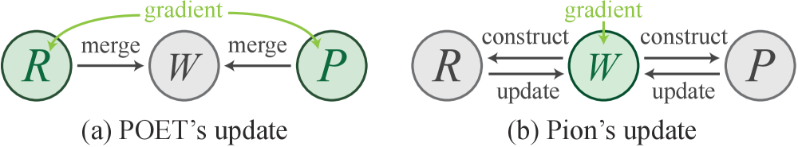
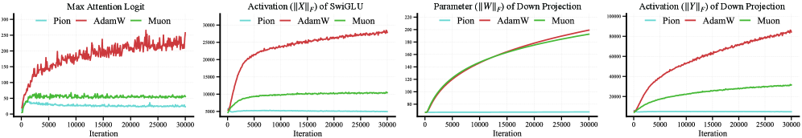
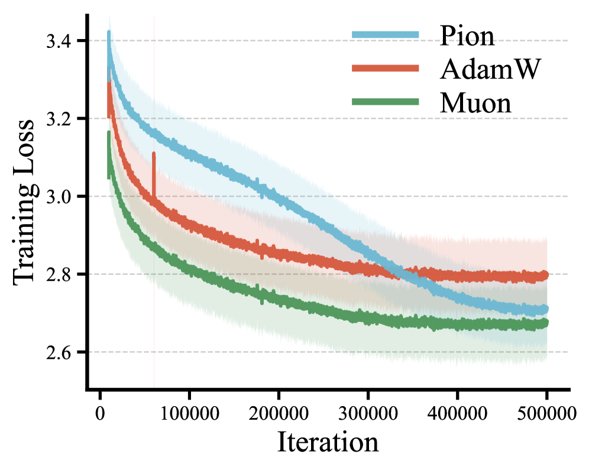
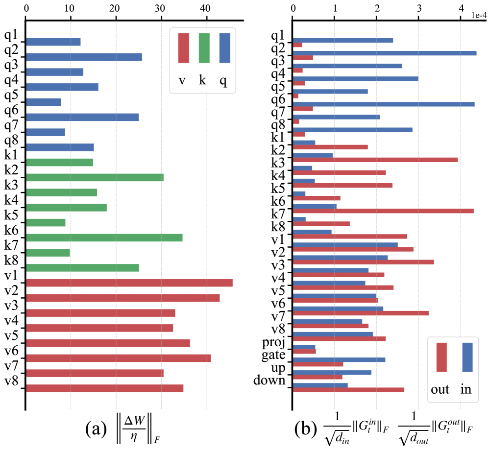
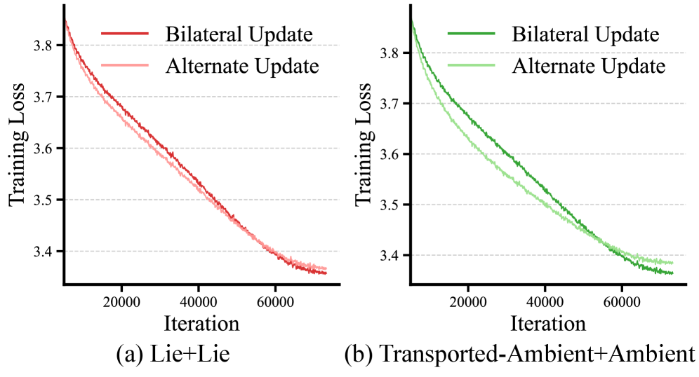

# Pion: A Spectrum-Preserving Optimizer via Orthogonal Equivalence Transformation

**Authors:** Kexuan Shi, Hanxuan Li (CUHK, equal contribution), Zeju Qiu (CUHK/MPI), Yandong Wen (Westlake), Simon Buchholz (MPI), Weiyang Liu (CUHK, corresponding)
**Date:** May 2026
**Paper:** [arXiv:2605.12492](https://arxiv.org/abs/2605.12492)
**Code:** [github.com/Sphere-AI-Lab/pion](https://github.com/Sphere-AI-Lab/pion)
**Project page:** [spherelab.ai/pion](https://spherelab.ai/pion)

---

## TL;DR

Pion is a new optimizer that updates weight matrices by applying **left and right orthogonal transformations** instead of adding gradient-based steps. Because orthogonal transformations preserve singular values, every weight matrix keeps its entire singular-value spectrum fixed throughout training — the optimizer can only *rotate* the row and column subspaces, never rescale them. This makes spectral norm control free (no separate clipping/decay needed), enables normalization-free training, and achieves better generalization than AdamW and Muon on pretraining, SFT, and RLVR benchmarks. The name stands for **P**OET-**i**nduced **o**ptimizer with **n**o reparameterization.

---

## Key Figures

### Fig. 1: POET vs Pion — Key Conceptual Difference


The ancestor (POET) reparameterizes each weight as `W = R·W₀·P` where R, P are trainable orthogonal matrices and W₀ is frozen. Gradients flow through R and P, then get merged into W after training. **Pion inverts this:** it starts from `W_t = I·W_t·I` (identity is the neutral element of the orthogonal group) and updates the identity factors directly on the Lie group — constructing R_t and P_t from the gradient, then applying `W_{t+1} = R_t·W_t·P_t`. No reparameterization, no auxiliary parameters.

### Fig. 8: Training Stability — Pion vs AdamW vs Muon (1.3B, 54B tokens)


The most visually striking result. Four stability indicators tracked over 400K iterations of 1.3B pretraining: (a) max attention logit, (b) SwiGLU activation norm, (c) down-projection weight norm, (d) down-projection output norm. **AdamW (red) drifts upward on all four** — attention logits reach 300+, activations 25K+. **Muon (green) is better but still trends upward.** **Pion (blue) is essentially flat on all four indicators** — near-constant throughout training. This is the visual signature of spectrum preservation: if singular values don't change, norms can't grow.

### Fig. 11: Training Loss at 1.3B Scale (LLaMA, 54B tokens)


Pion (blue) converges to a comparable final loss as Muon (green) — both substantially below AdamW (red). The shaded bands show loss variance across training. Pion's band is noticeably narrower, indicating more stable optimization dynamics. The gap between Muon and Pion in final loss is small (~0.013), but Pion wins on downstream benchmarks by 1.35 points average (47.69 vs 46.34).

### Fig. 2: Update Heterogeneity Before RMS Control


The diagnosis that motivates the RMS-controlled scaling (§2.4.1). (a) Left: per-matrix normalized update magnitude `‖(1/η)ΔW‖_F` varies by 10× across identically-sized matrices in the same layer — this is the heterogeneity problem. (b) Right: the bilateral rotation angles (in-side vs out-side) are imbalanced for many matrices. The fix: normalize the Lie-algebra gradients and apply a per-weight coefficient α that equalizes RMS(ΔW/η) across all matrices.

### Fig. 5: Alternate Update Matches Bilateral Update


Alternate update (applying in-side and out-side transformations on alternating steps instead of both every step) loses only 0.23% in final loss compared to bilateral — cutting the per-step computation roughly in half. This validates the practical computational efficiency of Pion.

---

## Key Novel Ideas

### 1. Orthogonal Equivalence Transformation as an Optimization Primitive

Standard optimizers (Adam, SGD, Muon) update weights **additively**: `W_{t+1} = W_t - η·update`. Pion updates weights **multiplicatively** via orthogonal transformations:

```
W_{t+1} = exp(-η G^out_t) · W_t · exp(-η G^in_t)
```

where:
- `G^in_t = W_t^T G_t - (W_t^T G_t)^T` — the input-side skew-symmetric Lie algebra element
- `G^out_t = G_t W_t^T - (G_t W_t^T)^T` — the output-side skew-symmetric Lie algebra element
- `exp(·)` is the matrix exponential, mapping skew-symmetric matrices to orthogonal matrices
- `G_t = ∇_W L` is the standard gradient

The construction works in three steps:
1. **Chain rule to the identity factors:** compute `G_t W_t^T` (output-side) and `W_t^T G_t` (input-side).
2. **Project to skew-symmetric (Lie algebra):** `A ← A - A^T` makes the matrix skew-symmetric, which is the tangent space of the orthogonal group.
3. **Map to the orthogonal group via matrix exponential:** `exp(skew-symmetric) = orthogonal matrix`.

Since `R_t = exp(-η G^out_t)` and `P_t = exp(-η G^in_t)` are both orthogonal, the transformation `W_{t+1} = R_t W_t P_t` preserves all singular values of `W_t`. The optimizer can rotate the row and column subspaces but cannot change the spectral norm.

### 2. Automatic μP Compatibility

MuP requires two spectral conditions:
- **Forward:** `‖W‖₂ = Θ(√(d_out/d_in))`
- **Update:** `‖ΔW‖₂ = Θ(√(d_out/d_in))`

Muon satisfies the update condition naturally (orthogonalized updates) but needs extra work for the forward condition (spectral clipping/decay). **Pion satisfies the forward condition for free** — singular values never change, so if initialization satisfies it, it holds forever. The update condition is achieved by normalizing the spectral norms of `G^in_t` and `G^out_t`.

This is the exact inverse of Muon's situation: Muon satisfies update-stability and needs to work for parameter-stability; Pion satisfies parameter-stability and needs to work for update-stability.

### 3. Scale-Consistent Rotational Updates

The naive Pion update has two problems: (a) update magnitudes `‖(1/η)ΔW‖_F` vary widely across matrices of the same size, and (b) the in-side and out-side rotation angles are imbalanced. The fix:

```
α_t = c·√(d_out·d_in) / (‖ΔW/η‖_F + ε)

where ΔW/η ≈ -G^out_t W_t - W_t G^in_t  (first-order approximation)
```

This per-weight scaling coefficient `α_t` ensures `RMS(ΔW/η) ≈ const` across all matrices. This is analogous to the RMS scaling used in Muon-family optimizers (Su's Beyond-MuP series applies the same principle).

### 4. Lie Algebra Momentum

Momentum in Pion requires care because the weight trajectory lives on a curved manifold (the iso-spectral set). Three options explored:

| Momentum type | Where accumulated | Transport needed? | Memory | Quality |
|---|---|---|---|---|
| Ambient-space | Full gradient G_t | No (biased) | Lowest | Worst |
| Transported ambient | Full gradient G_t | Yes (via reusing R_t, P_t) | Same | Medium |
| **Lie algebra** | In-side G^in_t and out-side G^out_t separately | No (same tangent space) | 2× square matrices | **Best** |

Lie algebra momentum accumulates directly in the skew-symmetric space, avoiding the tangent-space mismatch problem. Both first-order (m) and second-order (v) momentum work best in the Lie algebra. The final Pion uses Adam-style updates in the Lie algebra:

```
m^in_t = β₁ m^in_{t-1} + (1-β₁) G^in_t
v^in_t = β₂ v^in_{t-1} + (1-β₂) (G^in_t ⊙ G^in_t)
A^in_t = -m^in_t / (√v^in_t + ε)
```

(and similarly for the out-side). This is Adam but operating in Lie algebra coordinates rather than Euclidean space.

### 5. Second-Order Exponential Approximation

Computing `exp(A)` exactly is expensive. Pion uses a truncated power series:

```
exp(A) ≈ I + ηαA + ½(ηαA)²
```

This second-order approximation suffices because: (a) η is small so ‖ηαA‖ is small, and (b) Pion always starts from the identity matrix (not from a previous orthogonal matrix), so errors don't compound across iterations — unlike standard Lie group optimization where exp approximation errors accumulate.

### 6. Normalization-Free Training

The most dramatic stability demonstration: **remove all RMSNorm layers** from a 60M model and train. AdamW and Muon both produce NaNs (gradient overflow). **Pion trains to convergence.** This is because spectrum preservation inherently bounds the spectral norm of every layer, preventing the signal amplification that causes explosions without normalization. It suggests Pion could partially replace architectural scale-control mechanisms.

### 7. Ultra-Deep Training

At 200-layer depth (60M model), Pion maintains the most uniform layer-wise Jacobian norm profile. AdamW shows sharp Jacobian-norm drops in middle layers; Muon decays steadily with depth. Pion preserves balanced expressivity across all layers — the Jacobian deviation from identity is roughly constant through the 200-layer stack.

---

## Architecture Details

| Component | Specification |
|---|---|
| Update rule | `W_{t+1} = ℰ₂(A^out_t, α_t) · W_t · ℰ₂(A^in_t, α_t)` where ℰ₂(A,α) = I + ηαA + ½(ηαA)² |
| Momentum | Lie algebra, Adam-style: β₁=0.95, β₂=0.999 |
| RMS scaling | `α_t = c·√(d_out·d_in) / (‖A^out W + W A^in‖_F + ε)` |
| Alternate update | In-side on odd steps, out-side on even steps (optional, ~half compute) |
| Exp approximation | 2nd-order truncated power series |
| Applies to | All linear-layer weight matrices; biases/embeddings/norms use Adam |
| Computational overhead | O((d_out + d_in)/B) relative to forward/backward — small when batch-token count B is large |

---

## Training Pipeline

**Pretraining experiments:**
- 60M LLaMA for ablations: C4 dataset, 9.6B tokens, seq length 256
- 1.3B LLaMA for main results: C4, 54B tokens (2× Chinchilla-optimal), T5-base tokenizer, seq length 256, ~400K iterations

**SFT experiments:**
- Qwen2.5-1.5B and Llama-3.2-3B, full-parameter finetuning
- MetaMathQA (math) and Magicoder-Evol-Instruct-110K (code)
- LLaMA-Factory framework
- Evaluated on ID (GSM8K, HumanEval) and OOD (ARC, WinoGrande, PIQA, HellaSwag)

**RLVR experiments:**
- Qwen3-1.7B and DeepSeek-R1-Distill-Qwen-1.5B
- GRPO algorithm, DeepMath training data
- VeRL framework
- Evaluated on AIME24, AIME25, AMC23, Minerva Math, OlympiadBench

---

## Key Results

### Pretraining (LLaMA-1.3B, 54B tokens on C4)

| Method | ARC-C | ARC-E | BoolQ | HellaSwag | PIQA | SciQ | TriviaQA | WinoGrande | Avg | Val Loss |
|---|---|---|---|---|---|---|---|---|---|---|
| AdamW | 25.94 | 45.96 | 46.30 | 45.10 | 71.27 | 70.80 | 1.06 | 51.46 | 44.74 | 2.7700 |
| Muon | 25.34 | 47.94 | 51.56 | 46.70 | 72.20 | 71.60 | 1.64 | 53.75 | 46.34 | 2.7225 |
| **Pion** | **26.79** | **49.41** | **57.58** | **47.34** | 71.27 | **73.40** | **2.17** | 53.59 | **47.69** | 2.7350 |

Pion wins 6/8 benchmarks. Average: Pion 47.69 > Muon 46.34 > AdamW 44.74. BoolQ gain is dramatic: +11.28 over AdamW, +6.02 over Muon.

### SFT (full-parameter finetuning)

| Method | Qwen2.5-1.5B Math ID | Math OOD | Code ID | Code OOD | Llama-3.2-3B Math ID | Math OOD | Code ID | Code OOD |
|---|---|---|---|---|---|---|---|---|
| AdamW | 65.88 | 62.13 | 51.83 | 62.64 | 59.87 | 60.86 | 46.95 | 58.64 |
| Muon | 65.27 | 61.22 | 50.00 | 62.41 | 57.77 | 61.20 | 46.34 | 58.88 |
| **Pion** | 65.76 | **62.16** | **53.05** | **63.21** | **58.83** | 60.44 | **47.19** | **59.74** |

Pion achieves the best stability-plasticity tradeoff — strongest code ID/OOD and comparable math, with better OOD preservation.

### RLVR (GRPO on DeepMath)

| Method | Qwen3-1.7B Avg | DeepSeek-R1-Distill-Qwen-1.5B Avg |
|---|---|---|
| AdamW | 34.82 | 35.97 |
| Muon | 32.08 | 37.32 |
| **Pion** | **36.12** | **38.32** |

Pion wins on both models. On Qwen3-1.7B, it beats AdamW by +1.30 and Muon by +4.04. On DeepSeek-R1-Distill, it beats Muon by +1.00 and AdamW by +2.35. The authors note RLVR dynamics naturally preserve spectral structure, making Pion a well-suited inductive bias.

---

## Key Takeaways

1. **Multiplicative (orthogonal) updates are a viable alternative to additive updates.** Pion demonstrates that you can train LLMs by rotating weight matrices instead of adding to them. The singular-value spectrum stays fixed — the optimizer only changes what directions the weights point, not their magnitudes.

2. **Spectrum preservation gives training stability for free.** All four stability indicators (attention logits, activation norms, weight norms, output norms) are essentially flat across 400K iterations with Pion. With AdamW they grow continuously; with Muon they grow more slowly but still grow. This is the visual proof that spectral drift is a real problem and that preventing it solves it cleanly.

3. **Pion and Muon are complementary inverses for μP.** Muon natively satisfies the update spectral condition `‖ΔW‖₂ = Θ(√(d_out/d_in))` but needs extra work for the forward condition. Pion natively satisfies the forward condition `‖W‖₂ = Θ(√(d_out/d_in))` but needs extra work for the update condition. They approach the same goal from opposite ends.

4. **Normalization layers can be dropped with a spectrum-preserving optimizer.** Pion trains a 60M model to convergence with all RMSNorm layers removed — both AdamW and Muon produce NaNs. This is the strongest evidence that spectral norm control at the optimizer level can substitute for architectural scale control.

5. **Lie algebra momentum is the right geometric choice.** Accumulating momentum in the Lie algebra (skew-symmetric matrix space) outperforms both ambient-space and transported-ambient-space variants. The intuition: the Lie algebra is a fixed linear space (the tangent space at the identity), so momentum vectors from different iterations are directly comparable without transport.

6. **Scale-consistent rotational updates are essential.** The naive Pion update has 10× heterogeneity in update magnitudes across identically-sized matrices. The RMS-controlled scaling fix (α_t per weight) is critical — without it, training is unstable at large learning rates. This parallels the lesson from Su's Beyond MuP series: consistent update scales across parameters matter.

7. **Alternate update is nearly free.** Applying in-side and out-side rotations on alternating steps (instead of both every step) loses only 0.23% in final loss while halving the per-step optimizer overhead. This makes Pion practical for large-scale training.

8. **Second-order exp approximation suffices.** Unlike standard Lie group optimization where exp approximation errors compound, Pion always starts from the identity matrix — so errors are first-order in η and don't accumulate. This is a structural advantage of the "no reparameterization" design.

9. **Pion is especially strong for RLVR.** The +4.04 average-point gain over Muon on Qwen3-1.7B RLVR is large. The paper's hypothesis: RLVR dynamics naturally preserve spectral structure of pretrained weights, so an optimizer that explicitly maintains this structure provides a well-matched inductive bias.

10. **Ultra-deep training benefits most.** At 200 layers, Pion maintains uniform Jacobian norms across all layers — no expressivity degradation in the middle. AdamW and Muon both show Jacobian-norm decay with depth. This suggests Pion's greatest advantage may be at extreme depth, where spectral drift causes the most damage.

---

## Connection to Beyond MuP Series

Pion is directly related to Su's "Beyond MuP" framework in your repo:

- **Part 4 (Parameter Stability):** Su's Post Clip / Pre Decay controls `‖W‖₂` throughout training by projecting or decaying singular values. Pion achieves the same goal *by construction* — singular values never move, so no post-hoc intervention is needed. Pion is the ultimate "parameter stability" guarantee.
- **Part 2 (Steepest Descent → Muon):** Muon is steepest descent under `‖ΔW‖₂ ≤ η√(d_out/d_in)`. Pion doesn't do steepest descent in the additive sense — it does steepest descent on the iso-spectral manifold. Different constraint set, different optimization geometry, same stability goal.
- **Spectral weight decay vs Pion:** Su's Pre Decay under spectral norm shrinks the top singular value each step. Pion doesn't need to shrink anything — all singular values are invariant. Pre Decay is a corrective mechanism; Pion is a preventive mechanism.

---

## What's Open-Sourced

- **Code:** [github.com/Sphere-AI-Lab/pion](https://github.com/Sphere-AI-Lab/pion) — full optimizer implementation
- **Project page:** [spherelab.ai/pion](https://spherelab.ai/pion)
- **Models:** Not explicitly released as checkpoints
- **Training data:** C4 (pretraining), MetaMathQA + Magicoder (SFT), DeepMath (RLVR) — all publicly available
