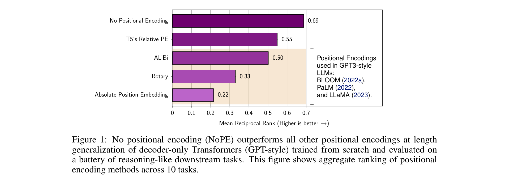
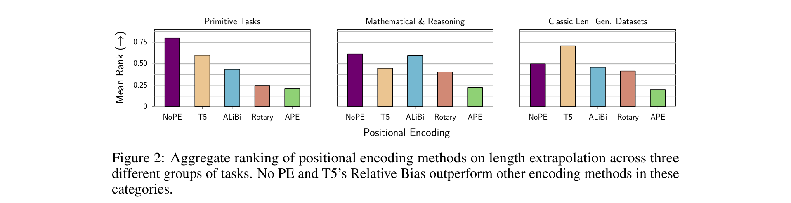
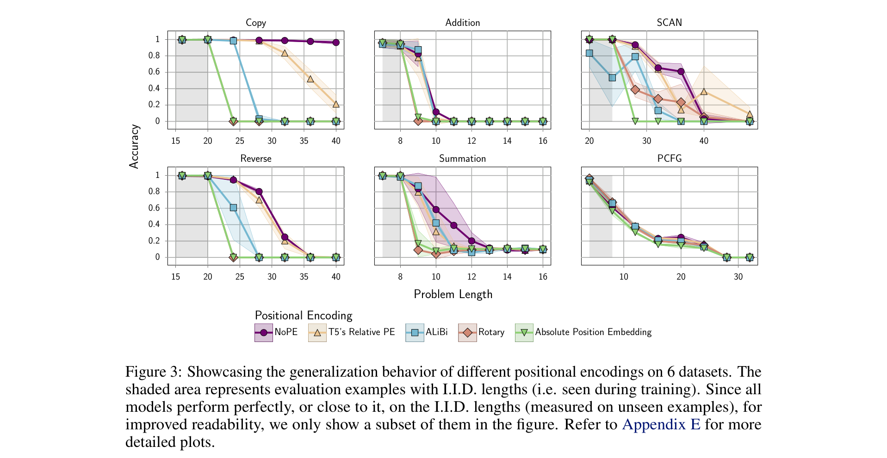
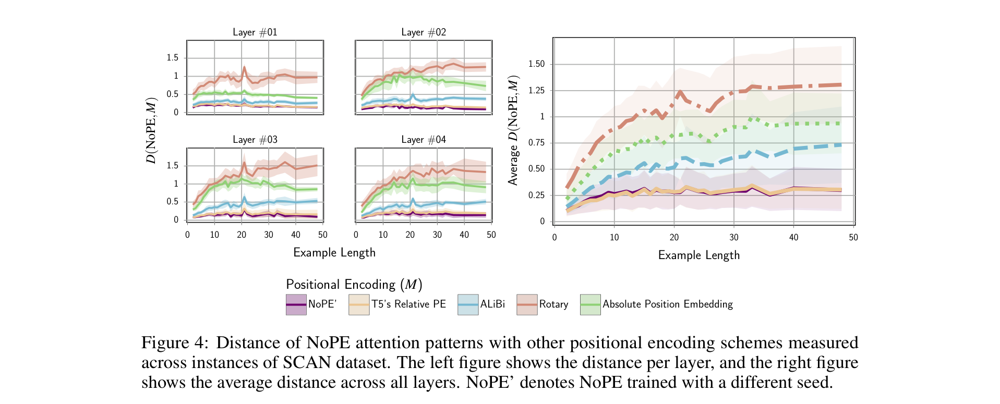
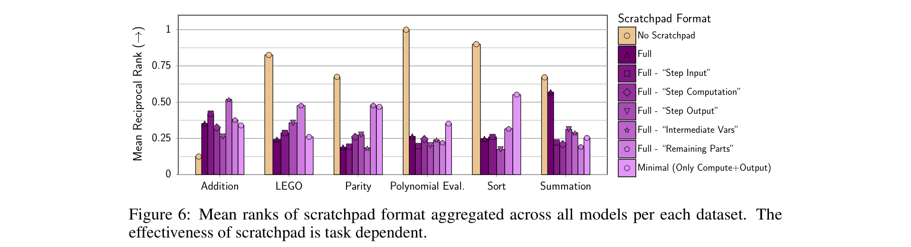
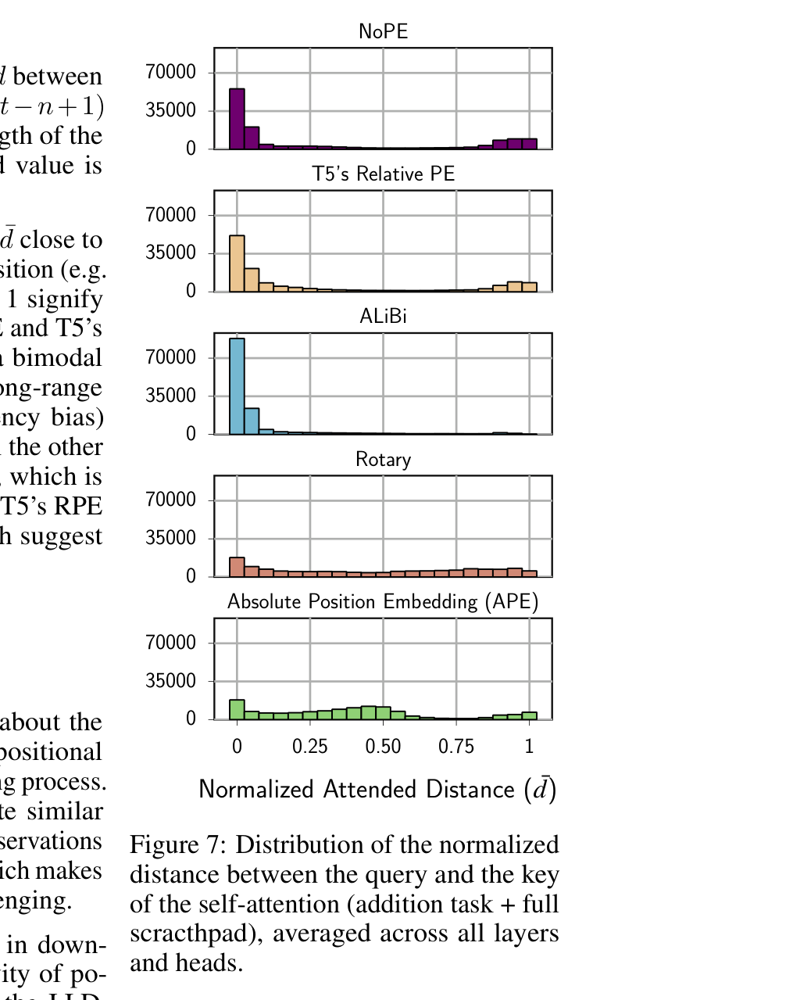

# The Impact of Positional Encoding on Length Generalization in Transformers

**Authors:** Amirhossein Kazemnejad, Inkit Padhi, Karthikeyan Natesan Ramamurthy, Payel Das, Siva Reddy
**Affiliations:** Mila/McGill University, IBM Research, Facebook CIFAR AI Chair, ServiceNow Research
**Date:** NeurIPS 2023 (arXiv: May 2023, revised Nov 2023)
**Paper:** [PDF](https://arxiv.org/abs/2305.19466)

---

## TL;DR

This paper conducts a systematic empirical study comparing five positional encoding (PE) schemes — APE, T5's Relative PE, ALiBi, Rotary, and No Positional Encoding (NoPE) — on decoder-only Transformers for length generalization across 10 reasoning/math tasks. The surprising finding: **removing positional encoding entirely (NoPE) outperforms all explicit PE methods** at generalizing to longer sequences, achieving a mean reciprocal rank of 0.69 vs. 0.55 for T5's Relative PE (the best explicit PE). The authors prove theoretically that NoPE can implicitly learn both absolute and relative position representations, and show empirically that it converges to attention patterns resembling T5's Relative PE.

---

## Key Figures

### Figure 1: Aggregate Ranking of Positional Encodings

The headline result: NoPE achieves the highest mean reciprocal rank (0.69) across all 10 tasks, beating T5's Relative PE (0.55), ALiBi (0.50), Rotary (0.33), and APE (0.22). Notably, the PE methods used in major LLMs (BLOOM uses ALiBi, PaLM/LLaMA use Rotary) perform poorly at length generalization.

### Figure 2: Ranking Across Task Categories

NoPE and T5's Relative PE consistently outperform other encoding methods across all three task categories: primitive tasks (Copy, Reverse), mathematical & reasoning tasks (Addition, Sorting, etc.), and classic length generalization datasets (SCAN, PCFG).

### Figure 3: Generalization Curves Across Tasks

Accuracy as a function of sequence length for different PE methods on 6 representative tasks. The shaded region shows in-distribution lengths (seen during training). All methods achieve near-perfect in-distribution accuracy, but diverge sharply at extrapolation. NoPE (purple) and T5's Relative PE (orange triangles) maintain accuracy at longer lengths far better than Rotary, ALiBi, or APE.

### Figure 4: NoPE Attention Patterns Resemble T5's Relative PE

Using Jensen-Shannon divergence to compare attention distributions, this figure shows that NoPE's learned attention patterns are closest to T5's Relative PE and most distant from APE and Rotary. This holds across all layers and lengths, suggesting that **SGD naturally learns a relative positional encoding scheme when no explicit PE is provided**.

### Figure 6: Scratchpad Format Impact

Scratchpad (chain-of-thought) effectiveness is highly task-dependent. It helps only for Addition, while other tasks show marginal or no benefit. The scratchpad format matters significantly — removing certain components (Step Input, Computation, etc.) has varying effects across tasks.

### Figure 7: Attention Distance Distributions

The distribution of normalized query-key attention distances reveals fundamental differences between PEs. NoPE and T5's Relative PE both exhibit a **bimodal distribution** — attending to both nearby and distant tokens. ALiBi strongly favors short-range attention (recency bias). Rotary and APE produce more uniform or diffuse distributions. The bimodal pattern correlates with superior length generalization.

---

## Key Novel Ideas

### 1. NoPE Outperforms All Explicit PEs at Length Generalization
The most counterintuitive finding: simply removing positional encoding from decoder-only Transformers yields the best length generalization on downstream tasks. NoPE achieves this **without any computational overhead** — it doesn't compute additional terms in the attention mechanism (unlike T5's Relative Bias or ALiBi, which add bias terms to attention scores). Press et al. (2022) reported that T5's Relative Bias can make training and inference ~2x slower than APE.

### 2. Theoretical Proofs that NoPE Can Learn Both Absolute and Relative PE
The paper provides constructive proofs (Theorems 1 and 2) showing:
- **Theorem 1 (Absolute Encoding):** The first layer of a NoPE Transformer can recover absolute positions [1, ..., T+1] in the hidden state using the causal attention mask and a `<bos>` token. The key insight is that uniform attention over a causally-masked sequence produces 1/t at position t, which the feedforward layer can transform into absolute position.
- **Theorem 2 (Relative Encoding):** Given absolute positions in H^(1), subsequent layers can implement relative PE by constructing query/key matrices that make the attention dot product depend on the relative distance (t - i) between positions.

### 3. NoPE Empirically Converges to Relative PE (T5-style)
Using Jensen-Shannon divergence to compare attention head distributions, the authors quantitatively show that NoPE's learned attention patterns most closely resemble T5's Relative PE — not APE, ALiBi, or Rotary. This provides empirical evidence that SGD naturally discovers relative positional encoding when none is explicitly provided.

### 4. Rotary Behaves More Like APE Than Relative PEs
Despite being classified as a "relative" positional encoding, Rotary's generalization behavior and attention patterns are more similar to APE than to T5's Relative PE. This challenges the common assumption that Rotary provides the benefits of relative encoding.

### 5. Bimodal Attention Distribution as a Key to Length Generalization
The attention distance analysis reveals that the best-performing PEs (NoPE, T5's Relative PE) both learn a bimodal attention distribution — attending to both local context and distant tokens. ALiBi's recency bias prevents long-range attention, while Rotary/APE produce unfocused distributions.

### 6. Scratchpad is Not a Universal Fix for Length Generalization
The scratchpad/chain-of-thought approach, while helpful for addition, does not consistently improve length generalization across tasks. Its format has a non-trivial impact — different components (step input, computation, output, variable updates, remaining input) contribute differently depending on the task.

---

## Architecture Details

| Parameter | Value |
|---|---|
| Architecture | Decoder-only Transformer (GPT-style) |
| Model size | "base" config (~107M parameters) |
| Model dimension | 768 |
| Number of layers | 12 |
| Attention heads | 12 |
| Optimizer | AdamW |
| Learning rate | 3e-5 |
| Weight decay | 0.05 |
| Batch size | 64 |
| LR scheduler | Polynomial |
| Warmup | 6% of training steps |
| Training steps | 40K |
| Decoding | Greedy (no sampling) |
| Dropout | 0.1 |
| APE variant | Sinusoidal (non-parametric) |

For 1.3B scale experiments:

| Parameter | Value |
|---|---|
| Model dimension | 1024 |
| Key/Value dimension | 128 |
| FFN dimension | 16,384 |
| Layers | 24 |
| Attention heads | 32 |
| Context length | 1024 tokens |
| Training data | 30B tokens (StarCoder subset) |
| Data mix | 40% Python, 25% Java, 25% JS, 5% GitHub issues, 5% commits |

---

## Training Pipeline

1. **Task-specific training from scratch:** All ~107M models are trained from scratch on each task individually (not pretrained language models), using the autoregressive language modeling objective.
2. **Data generation:** For each task, 100K training examples and 10K test examples are sampled. Training examples have length ≤ L (default L=20), test examples have length in [1, 2L].
3. **Evaluation:** Exact-match accuracy on each instance, measured at each length bucket to track generalization.
4. **Three seeds per configuration:** Each dataset-PE pair is trained with 3 different random seeds; results are aggregated.
5. **Scratchpad experiments:** Separately trained models with scratchpad/CoT prompting on mathematical tasks, using L=8 threshold (to avoid OOM from long scratchpad sequences).
6. **1.3B scale experiments (post-submission):** Three 1.3B parameter models (ALiBi, Rotary, NoPE) pretrained on StarCoder code data with 1024 context length, evaluated on language modeling perplexity at various context sizes.

Total compute: ~870 individual training runs across all experiments, each taking 6-15 hours on single NVIDIA V100/A100 GPUs.

---

## Key Results

### Aggregate Ranking (Mean Reciprocal Rank across 10 tasks)

| PE Method | MRR |
|---|---|
| **NoPE** | **0.69** |
| T5's Relative PE | 0.55 |
| ALiBi | 0.50 |
| Rotary | 0.33 |
| APE | 0.22 |

### Key Task-Level Observations

- **Copy/Reverse:** NoPE and T5's Relative PE maintain near-perfect accuracy up to 2x training length; Rotary/APE fail immediately at extrapolation lengths.
- **Addition:** T5's Relative PE slightly edges out NoPE; both dramatically outperform others.
- **SCAN:** NoPE achieves ~80% accuracy even at 2x length; ALiBi and APE drop to near 0%.
- **Summation/PCFG:** All methods struggle, but NoPE/T5 degrade most gracefully.

### 1.3B Scale Results

- In-distribution: All PEs achieve similar perplexity.
- Out-of-distribution: Rotary perplexity **explodes** at lengths beyond training.
- NoPE and ALiBi generalize to ~1.8x training context size; ALiBi is more stable at larger sizes but NoPE shows better downstream task performance at small scale.

---

## Key Takeaways

1. **Explicit positional encodings hurt length generalization.** The most commonly used PEs in modern LLMs (Rotary in LLaMA/PaLM, ALiBi in BLOOM) are among the worst for generalizing to longer sequences on downstream tasks.

2. **No PE is the best PE (for length generalization).** NoPE achieves the best aggregate performance while being computationally cheaper — it computes no additional terms in the attention mechanism.

3. **Perplexity is a misleading metric for PE evaluation.** PEs may look equivalent on language modeling perplexity but diverge dramatically on downstream task accuracy at longer lengths. This has significant implications for how new PEs are typically evaluated.

4. **Decoder-only Transformers implicitly encode position** through the causal attention mask. Unlike encoders (which become bag-of-words models without PE), decoders have an inherent ordering signal from the triangular mask.

5. **NoPE learns relative position encoding via SGD.** Both theoretically and empirically, NoPE converges to attention patterns that resemble T5's Relative PE — the best-performing explicit PE method.

6. **The bimodal attention pattern (local + global) is key.** The top-performing PEs (NoPE, T5) attend to both nearby and distant tokens, while weaker PEs either over-focus locally (ALiBi) or attend too uniformly (Rotary, APE).

7. **Rotary is effectively an absolute PE** in terms of length generalization behavior, despite its theoretical formulation as a relative encoding. At 1.3B scale, Rotary's perplexity explodes beyond the training context.

8. **Scratchpad/CoT is not a silver bullet for length generalization.** It is task-dependent (only reliably helps for addition) and format-dependent. Having a PE with robust generalization is more important than relying on scratchpad alone.

9. **T5's Relative PE is the best explicit PE choice** if you must use one — it consistently outperforms ALiBi, Rotary, and APE at extrapolation, though it comes with ~2x computational overhead.

10. **These results hold across diverse task types:** primitive (Copy, Reverse), mathematical (Addition, Sorting, Summation, Polynomial Eval, Parity, LEGO), and classic benchmarks (SCAN, PCFG) — giving confidence that the findings are general.

---

## What's Open-Sourced

- **Code:** Released at [github.com/McGill-NLP/length-generalization](https://github.com/McGill-NLP/length-generalization)
- **Reproducibility:** Every reported number is linked to deterministic source code (up to GPU stochasticity). A Singularity container is also planned for full environment reproducibility.
- **No pretrained checkpoints released** (models are trained from scratch per-task, so checkpoints are experiment-specific).
