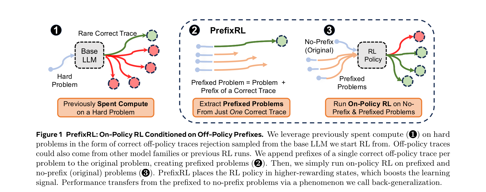
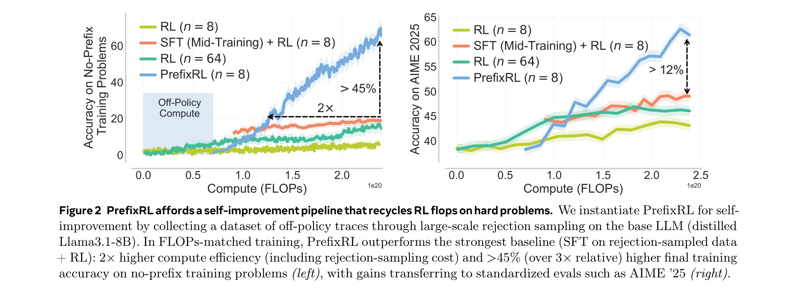
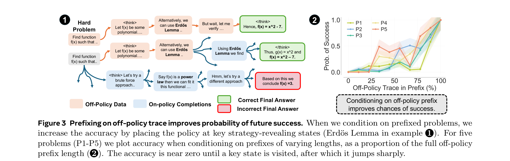
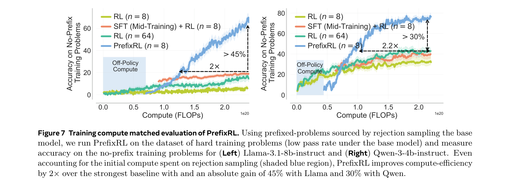
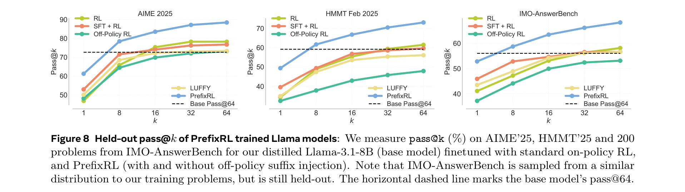
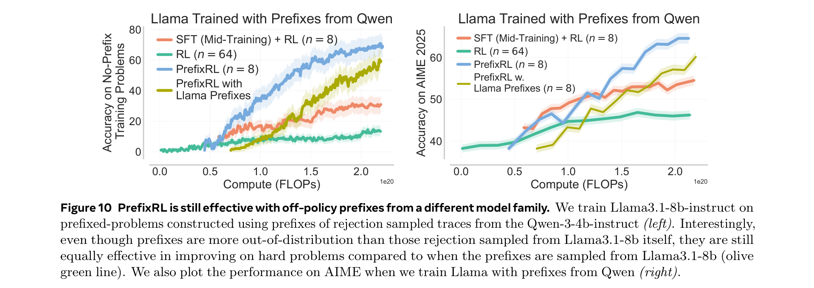
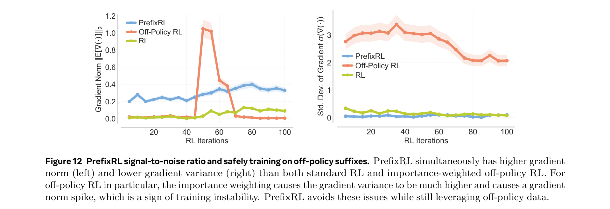

# Reuse Your FLOPs: Scaling RL on Hard Problems by Conditioning on Very Off-Policy Prefixes

**Authors:** Amrith Setlur (Meta/CMU), Zijian Wang (Meta), Andrew Cohen (Meta), Paria Rashidinejad (Meta/USC), Sang Michael Xie (Meta)
**Date:** February 4, 2026
**Paper:** [arXiv:2601.18795](https://arxiv.org/abs/2601.18795)

---

## TL;DR

Standard on-policy RL for LLM reasoning stalls on hard problems because the model almost never generates a correct trace — so gradients vanish and compute is wasted. PrefixRL reuses previously-generated correct traces (from rejection sampling or prior runs) not as supervision targets but as **prefixes**: it concatenates the beginning of a correct off-policy trace to the original problem and runs on-policy RL on this easier "prefixed problem." This avoids the instabilities of SFT or importance-weighted off-policy RL while placing the policy in states where it's more likely to succeed. A surprising emergent property: **back-generalization** — training *only* on prefixed problems still improves performance on the original (un-prefixed) problems, with learned strategies often differing from those in the prefix. On hard math reasoning, PrefixRL reaches the same reward **2× faster** than the strongest SFT+RL baseline and increases final accuracy by **>45%**.

---

## Key Figures

### Fig. 1: PrefixRL System Overview

The three-step pipeline: (1) Previously spent compute on hard problems (rejection sampling, prior RL runs) produces a dataset D_off of rare correct off-policy traces. (2) PrefixRL creates "prefixed problems" by extracting the first h tokens of a correct trace and appending it to the original problem. (3) On-policy RL runs jointly on both the original (no-prefix) and prefixed problems. Gradients are always masked on the off-policy prefix tokens — the model only learns from its own completions. Performance transfers from prefixed to original problems via back-generalization.

### Fig. 2: Self-Improvement Pipeline — Compute Efficiency

The headline numbers. Left: training accuracy on no-prefix (original) hard problems. PrefixRL (n=8 samples) is **2× more compute-efficient** than SFT+RL (the strongest baseline) and achieves **>45% higher final accuracy**, even after accounting for the initial rejection-sampling cost (blue shaded region). Standard RL with n=8 and n=64 stalls. Right: on held-out AIME 2025, PrefixRL improves accuracy by **>12%** absolute over baselines in compute-matched comparison.

### Fig. 3: Prefixing Improves Success Probability

Why prefixing works, illustrated on a math problem. Left (1): the off-policy trace reveals "Erdős Lemma" as a key strategy. On-policy completions explore different strategies (brute force, power law, etc.) — most fail. Right (2): for five hard problems (P1-P5), as the prefix length increases (x-axis = % of the full off-policy trace included), the on-policy success probability jumps sharply from near-zero to high values. The critical observation: accuracy is near zero until a key strategy-revealing state is visited, after which it jumps. This makes the RL signal non-zero, breaking the stalling regime.

### Fig. 7: Compute-Matched Training Curves

PrefixRL on Llama-3.1-8B-Instruct (left) and Qwen3-4B-Instruct (right). Both show the same pattern: PrefixRL reaches the same training accuracy as the best baseline in roughly half the compute, and surpasses it by >45% (Llama) and >30% (Qwen) at convergence. Standard RL (n=8) barely moves; even n=64 lags far behind PrefixRL.

### Fig. 8: Held-Out pass@k Results (Llama)

PrefixRL (blue) consistently beats all baselines at every k on three held-out benchmarks: AIME '25, HMMT Feb '25, and IMO-AnswerBench. The gap generally **widens as k increases** — on AIME '25, PrefixRL leads by +18 at k=8 and +28 at k=64. This means PrefixRL improves both the mean performance (pass@1) and the tail of the search distribution (pass@k), indicating that it explores more promising subspaces rather than just sharpening existing strategies.

### Fig. 10: Cross-Model Prefixes (Llama with Qwen Prefixes)

PrefixRL is flexible: Llama-3.1-8B-Instruct trained with prefixes extracted from Qwen3-4B-Instruct rejection sampling (teal line) performs comparably to PrefixRL with same-model prefixes (blue line) on both training accuracy (left) and AIME '25 (right). This demonstrates the method works even when off-policy traces come from a completely different model family and training dataset.

### Fig. 12: Gradient Signal-to-Noise Ratio

The systems-level explanation for PrefixRL's stability. Left: expected gradient norm over training. PrefixRL maintains a higher, stabler gradient norm than both standard RL (which has vanishing gradients on hard problems) and off-policy RL (which has a massive spike from importance weighting, then crashes). Right: gradient standard deviation. Off-policy RL has extreme variance (spike to 3+); PrefixRL stays below 0.5 throughout. PrefixRL simultaneously has **higher signal and lower noise** — the best of both worlds.

---

## Key Novel Ideas

### 1. Conditioning on Prefixes Instead of Supervising on Full Traces

The core insight: off-policy correct traces on hard problems are **very off-policy** — they have near-zero probability under the current RL policy. Using them directly causes problems:

- **SFT (supervised fine-tuning) on off-policy data:** boosts pass@1 initially, then causes entropy collapse. The model memorizes the traces instead of learning the underlying strategies. Subsequent RL is hurt because the model has lost its ability to explore.
- **Off-policy RL (importance weighting):** theoretically correct but practically unstable. Token-level importance weights `π_t(token) / π₀(token)` can be tiny (e.g., 10⁻³) since the traces are so off-policy, causing either biased gradients (with clipping) or extreme variance (without).

PrefixRL's alternative: **don't train on the trace at all.** Instead, take the *beginning* of a correct trace (the "prefix"), append it to the original problem, and let the model complete it on-policy. Gradients are masked on the prefix tokens — the model only learns from the tokens it generated itself. This is standard on-policy RL, just on a modified problem.

The key property: by conditioning on the prefix, the model starts in a state that's closer to the solution. The RL signal (reward, advantage) is no longer zero — the model can now sometimes solve the problem, producing non-zero gradients.

### 2. The PrefixRL Objective (Equation 3.1)

The training objective is simple — just standard RL on two problem sets simultaneously:

$$\max_\pi \left( \sum_{x_{\text{pre}} \in \mathcal{D}_{\text{pre}}} \mathbb{E}_{y \sim \pi(\cdot | x_{\text{pre}})}[r(x_{\text{pre}}, y)] + \sum_{x \in \mathcal{D}} \mathbb{E}_{y \sim \pi(\cdot | x)}[r(x, y)] \right)$$

where D_pre are the "prefixed problems" (original problem + off-policy prefix) and D are the original "no-prefix" problems. The reward function r(x, y) checks whether the final answer is correct. For prefixed problems, the prefix is part of the prompt — the model just sees a longer context that happens to contain the beginning of a solution.

Three subtle properties:
- **No new algorithmic machinery.** This is standard REINFORCE on a mixture of problem types. Any RL algorithm works.
- **Gradients are masked on the prefix.** The model doesn't learn to imitate the prefix — it learns to complete it correctly.
- **Prefixed problems are easier.** The model has a higher chance of getting the right answer when given a running start, so gradients are non-zero more often.

### 3. Theoretical Guarantees: Objective Consistency and Sample Efficiency

Su provides two formal results (Theorems 3.2 and 3.3):

**Objective consistency (Theorem 3.2):** If the off-policy prefixes come from correct traces generated by a realizable policy μ (i.e., some policy in the model class can generate them), then maximizing the PrefixRL objective also maximizes the standard RL objective J(π) on no-prefix problems. In other words, PrefixRL doesn't bias the optimization — the same optimal policy is found.

**Sample efficiency (Theorem 3.3):** For PrefixRL instantiated with Natural Policy Gradient (NPG), the suboptimality gap decomposes into:
$$\max_\pi J(\pi) - J(\hat{\pi}_T) \leq O\left(\sqrt{\frac{\text{KL}(\mu \| \pi_0)}{T}} + \sqrt{\frac{1}{N}} \cdot \log\left(\frac{T|\mathcal{F}|}{\delta}\right)\right)$$

The first term is an optimization term that converges at 1/√T. The constant depends only on the KL between the base policy and the behavior policy generating the traces — not on 1/p_x (the inverse pass rate on hard problems), which is what standard RL depends on. For rejection-sampled traces with at most R attempts, this KL is O(log R), so the dependence on problem difficulty only grows logarithmically.

**Worst-case separation (Proposition 3.4):** There exist reward functions and base LLMs where PrefixRL-NPG converges in polynomial (in H) samples, while standard NPG needs exponential (in H) samples. This happens when correct traces are exponentially rare but can be gradually discovered by extending prefixes.

### 4. Back-Generalization — The Surprise

The most striking empirical finding: **training only on prefixed problems substantially improves performance on the original (no-prefix) problems that were never trained on.**

This is surprising because there's a severe train/test mismatch: the model trains on problems with a "running start" but is evaluated cold. Yet performance transfers. Three observations about back-generalization:

**(a) It's a form of generalization via shared parameters.** The model's weights are updated during training on prefixed problems, and those same weights are used for no-prefix inference. Since the prefixed and no-prefix versions of the same problem share the same task structure (just different starting points), the strategies learned on prefixed versions transfer.

**(b) The model doesn't just imitate the prefix.** Figure 5 shows that strategy keywords appear in no-prefix responses even though the model was never trained on no-prefix problems. Moreover, the model can *unlearn* strategies present in the prefix and *discover new ones* — e.g., it reduces usage of "Erdős-Gallai" (the prefix strategy) and increases usage of "Dirichlet Theorem" (a better strategy) over training.

**(c) Back-generalization can be stronger than standard generalization.** In an in-context-learning setup (Section 4.3), PrefixRL on problem P1 conditioned on P3's solution trace improves both P2 and P3 performance more than running RL directly on P3 — when P2 and P3 share a strategy. This suggests the prefix creates a "backtrack" state that visits solution-relevant representations more efficiently than direct on-policy exploration.

### 5. Self-Improvement Loop

The practical instantiation: PrefixRL enables a **self-improvement loop** where the model bootstraps off its own previously-spent inference compute:

1. **Collect D_off:** Run large-scale rejection sampling on the base model π₀ to get one correct trace per hard problem. If pass@512 ≈ 0, this is expensive — but it's a one-time cost.
2. **Create prefixed problems:** For each problem, cut 3 prefixed variants from the correct trace at random cut-points between 40% and 80% of the trace tokens.
3. **Run PrefixRL:** Standard on-policy RL (REINFORCE with group-relative advantages) on the mixture of 3k prefixed + 1k no-prefix problems.
4. **Evaluate:** On both training problems (no-prefix) and held-out benchmarks.

The compute accounting is favorable: even after including the rejection-sampling cost in the total FLOP budget, PrefixRL reaches the same accuracy as SFT+RL in **half the compute** and surpasses it by a large margin at convergence.

---

## Training Pipeline

**Models:** Llama-3.1-8B-Instruct (distilled on OpenThoughtsV3 before experiments since it's not natively a thinking model) and Qwen3-4B-Instruct.

**Training data:** 1K hard problems from DAPO (Yu et al., 2025) + OMNI-MATH levels 6-8 (Gao et al., 2024). Selected so that pass@512 of the base model is zero.

**Off-policy dataset D_off:** One correct trace per problem via rejection sampling on π₀. Three prefixed variants per problem (cut at 40-80% of trace). Total: 3K prefixed + 1K no-prefix problems.

**RL algorithm:** REINFORCE with group-relative advantages (GRPO-style). n=8 on-policy samples per problem per batch. Gradients masked on prefix tokens.

**Evaluation:** AIME 2025, HMMT Feb 2025, IMO-AnswerBench. All evaluation is on no-prefix (original) problems. pass@k reported as Mean@k (average over 32 or 64 sampled responses).

---

## Key Results

### Compute-matched training accuracy on hard problems (no-prefix)

| Method | Final Accuracy (Llama) | Final Accuracy (Qwen) |
|---|---|---|
| RL (n=8) | ~15% | ~20% |
| RL (n=64) | ~35% | ~40% |
| SFT + RL (n=8) | ~40% | ~50% |
| **PrefixRL (n=8)** | **~65%** | **~70%** |

### Held-out benchmarks — pass@1 (Llama-3.1-8B)

| Method | AIME '25 | HMMT Feb '25 | IMO-AnswerBench |
|---|---|---|---|
| Base (distilled Llama) | 38.2 | 29.2 | — |
| RL | — | — | — |
| SFT + RL | 49.3 | — | — |
| Off-Policy RL | — | — | — |
| LUFFY | ~50 | ~45 | ~40 |
| **PrefixRL** | **61.3** | **49.4** | **~55** |

On AIME '25, PrefixRL improves pass@1 from 38.2 (base) to 61.3, a **+23 absolute point gain**.

### pass@k widening gap (AIME '25, Llama)

| k | SFT+RL | PrefixRL | Δ |
|---|---|---|---|
| 1 | ~50 | ~61 | **+11** |
| 8 | ~68 | ~86 | **+18** |
| 64 | ~78 | ~90+ | **+12+** |

PrefixRL improves both the mean (pass@1) and the tail (pass@64).

### Cross-model prefixes (Llama with Qwen prefixes)

PrefixRL with Qwen-sourced prefixes achieves similar compute-efficiency gains and accuracy on both training problems and AIME '25 as same-model prefixes, demonstrating flexibility to the off-policy source.

---

## Key Takeaways

1. **The core problem with RL on hard problems is vanishing signal.** When pass@k ≈ 0, all n on-policy samples fail, advantages are zero, gradients are zero, and training stalls. This is the "stalling regime." Throwing more samples (n=64) helps only a little because the problem is exponentially rare success, not variance.

2. **PrefixRL breaks the stalling regime by placing the policy in reachable states.** Off-policy prefixes teleport the model part-way through a solution, making the remaining problem solvable. This creates non-zero advantages and non-zero gradients, unblocking training.

3. **Conditioning ≠ supervising.** PrefixRL never trains the model to produce the off-policy tokens. It only trains on the model's own completions after the prefix. This avoids both SFT's entropy collapse and off-policy RL's importance-weight instability.

4. **Back-generalization is the most surprising finding.** Training only on prefixed problems improves no-prefix performance. The model doesn't just learn to complete prefixes — it internalizes strategies that transfer to cold-start problem-solving. This is generalization via shared parameters across problem variants, and it's empirically stronger than standard RL generalization.

5. **The model can discover strategies beyond what's in the prefix.** PrefixRL doesn't just amplify the prefix strategy — it can also suppress suboptimal strategies in the prefix and discover better ones. This means the prefix is a scaffold for exploration, not a template for imitation.

6. **PrefixRL is 2× more compute-efficient than SFT+RL** on hard problems, even after accounting for the initial rejection-sampling cost to produce D_off. The final accuracy is also higher by >45% relative.

7. **Gains transfer to held-out benchmarks.** AIME '25 pass@1 improves by +12% absolute over the strongest baseline (compute-matched). HMMT and IMO-AnswerBench also improve. This is notable because the model only trains on DAPO + OMNI-MATH problems, not on competition-math specifically.

8. **PrefixRL's gradients have higher signal-to-noise ratio.** Figure 12 shows PrefixRL simultaneously has higher expected gradient norm and lower gradient variance than both standard RL and off-policy RL. This is because (a) prefixed problems have non-zero advantages more often (higher signal), and (b) the model generates shorter, more focused traces when given a running start (lower variance).

9. **Cross-model prefixes work.** Llama trained with Qwen-sourced prefixes performs comparably to Llama with its own prefixes. This means you can source off-policy traces from any available model, not just the model you're training — enabling a practical self-improvement ecosystem.

10. **PrefixRL preserves entropy better than SFT+RL.** Figure 11 shows SFT collapses token-level entropy to near zero, while PrefixRL maintains entropy at levels comparable to pure RL. This preserves the model's ability to explore during the RL phase.

---

## What's Open-Sourced

- **Code/Models:** Not explicitly released at time of publication. No GitHub link in the metadata.
- **Training data:** Uses publicly available DAPO-Math (Yu et al., 2025) and OMNI-MATH (Gao et al., 2024).
- **Base models:** Llama-3.1-8B-Instruct (publicly available), Qwen3-4B-Instruct (publicly available).
- **Method:** Fully described — the algorithm is simple (standard REINFORCE on a mixture of prefixed + no-prefix problems), so reimplementation is straightforward.
