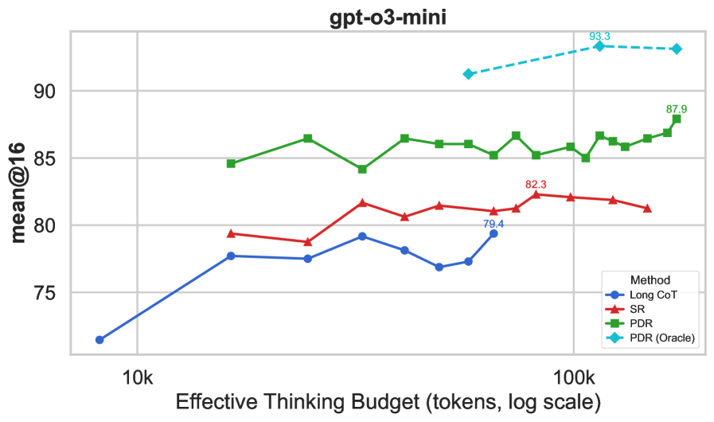
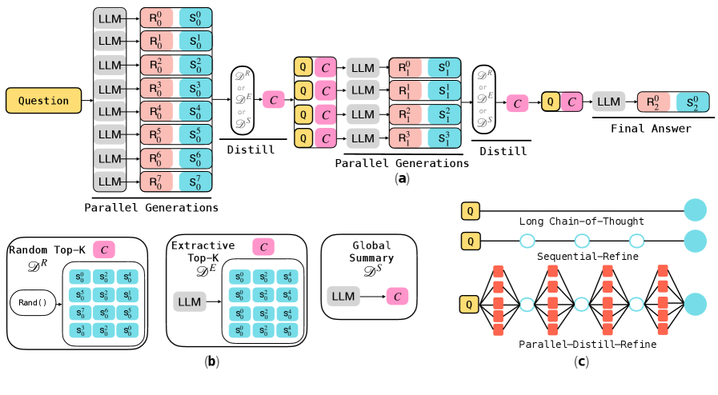
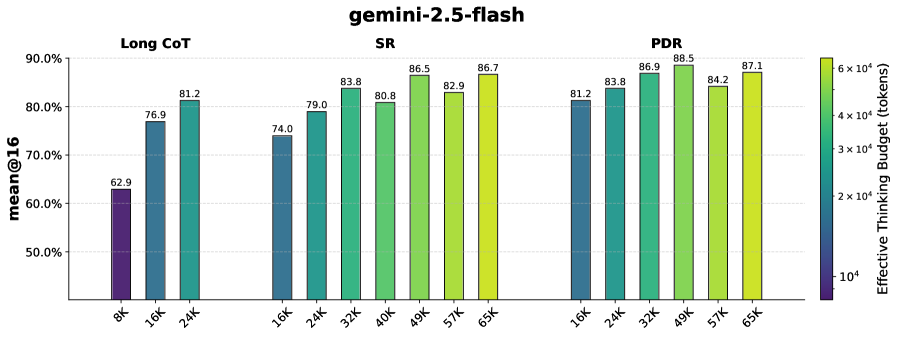
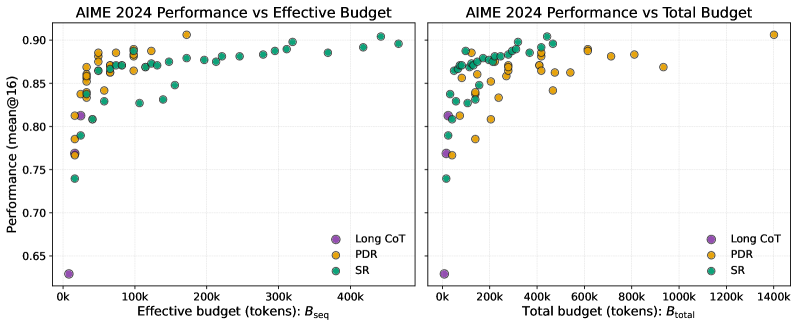
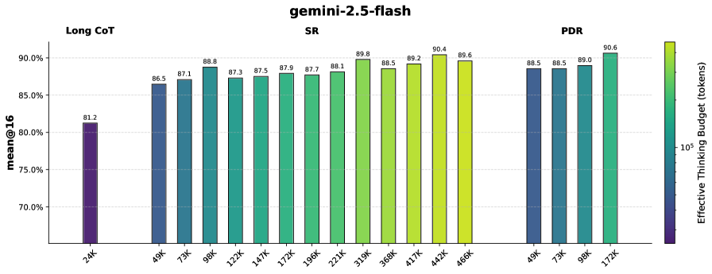
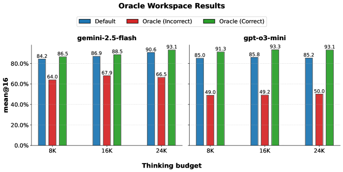

# Rethinking Thinking Tokens: LLMs as Improvement Operators

**Authors:** Lovish Madaan, Aniket Didolkar, Suchin Gururangan, John Quan, Ruan Silva, Ruslan Salakhutdinov, Manzil Zaheer, Sanjeev Arora, Anirudh Goyal
**Affiliations:** Meta Superintelligence Labs, University College London, Mila/University of Montreal, Anthropic, Princeton University
**Date:** October 1, 2025
**Paper:** [PDF](https://arxiv.org/abs/2510.01123)

---

## TL;DR

Long chain-of-thought (CoT) reasoning improves accuracy but inflates context length, compute cost, and latency. This paper asks: can we get *better* accuracy with *shorter* context per call by treating the LLM as an "improvement operator" that iteratively refines its answers? They propose two inference strategies -- Sequential Refinement (SR, iteratively improve one answer) and Parallel-Distill-Refine (PDR, generate multiple drafts in parallel, distill into a compact summary, then refine). PDR beats long CoT by +11% on AIME 2024 and +9% on AIME 2025 while incurring lower latency, by converting parallel compute into accuracy without growing per-call context. They also show that training an 8B model with "operator-consistent RL" (training on the same iterative interface used at inference) further shifts the Pareto frontier.

---

## Key Figures

### Figure 1: Accuracy vs. Sequential Budget (Latency Proxy)

The headline result for o3-mini. The x-axis is the sequential token budget B_seq (a proxy for latency -- tokens along the accepted path). PDR (green) dominates the Pareto frontier: it achieves higher accuracy than Long CoT (blue) at the same or lower latency. SR (red) also beats Long CoT but at higher latency. The dashed Oracle-PDR curve shows the upper bound if distillation were perfect.

### Figure 2: PDR Architecture and Inference Regimes

The core contribution visualized. (a) The PDR pipeline: in each round, M parallel drafts are generated, then distilled into a compact workspace C via one of the schemes in (b), then a refinement step produces the seed for the next round. (b) Three distillation strategies: Random top-k, Extractive top-k, and Global Summary. (c) Three inference regimes compared: Long CoT (one long trace), SR (sequential short rounds), and PDR (parallel drafts → distill → refine per round). The key insight: PDR increases total compute via parallelism without increasing per-call context.

### Figure 3: Iterative Improvement Beats Long CoT (Gemini 2.5 Flash)

Bar charts showing accuracy on AIME 2024 for gemini-2.5-flash. Left: Long CoT at various thinking budgets. Middle: SR with increasing rounds. Right: PDR configurations. At matched sequential budgets, both SR and PDR consistently outperform Long CoT, with PDR yielding the largest gains.

### Figure 4: B_seq vs. B_total Pareto Frontiers

All configurations plotted on two axes for gemini-2.5-flash. Left: accuracy vs. B_seq (latency). PDR forms the Pareto frontier -- it gets the best accuracy for a given latency. Right: accuracy vs. B_total (total compute). SR forms the Pareto frontier here because it has no wasted parallel drafts. This illustrates the core tradeoff: PDR wins on latency, SR wins on total compute.

### Figure 5: Token-Matched Comparison at 24K Thinking Budget

At a fixed total budget of 442K tokens, SR achieves 90.4% accuracy but with B_seq = 442K (high latency). PDR achieves 90.6% accuracy with B_seq = only 172K -- a **2.57x reduction in latency** for the same accuracy by converting parallel compute into useful signal.

### Figure 6: Anchoring Bias from Oracle Workspace Analysis

Oracle analysis revealing how workspace quality affects refinement. When only correct candidates are admitted to the workspace (Oracle-Correct), accuracy improves. When only incorrect candidates are admitted (Oracle-Incorrect), accuracy drops sharply -- especially for o3-mini, indicating weaker self-verification. This demonstrates that the model has a strong anchoring bias: it trusts whatever is in the workspace. Better verification = better PDR.

---

## Key Novel Ideas

### 1. LLMs as Improvement Operators: A Unified Framework

The paper reframes LLM inference as an iterative improvement operator with explicit budgets. Given an artifact s_t and a compact workspace C_t, the model proposes:

$$s_{t+1} \leftarrow \mathcal{M}_\theta(x, s_t, C_t)$$

followed by a compression step:

$$C_{t+1} \leftarrow \mathcal{D}(x, s_{t+1}), \quad |C_{t+1}| \leq \kappa$$

where $\kappa$ bounds the workspace size. This read-write-compress cycle keeps context bounded while allowing arbitrarily many iterations.

**Two budget axes:**
- **B_seq** (sequential budget): tokens along the accepted path = latency proxy
- **B_total** (total budget): all tokens including discarded parallel branches = compute/cost proxy

The key insight: standard long CoT conflates these two. If you want deeper reasoning, you must also accept higher latency and longer context. PDR decouples them: you can increase B_total (via parallelism) without increasing B_seq.

### 2. Sequential Refinement (SR)

The simplest instantiation: set C_t = ∅ and iteratively improve a single artifact:

$$s_{t+1} \leftarrow \mathcal{M}_\theta(x, s_t, \varnothing), \quad t = 0, \ldots, R-1$$

Each round, the model sees only the previous answer (not the full history) and tries to improve it. A variant adds an error-analysis step between rounds: the model first identifies flaws, then generates a revised solution. This variant helps o3-mini (+2-5% on AIME) but not gemini-2.5-flash.

**Why it works:** Even without a persistent workspace, each new round benefits from a fresh context window -- the model can notice errors it missed when generating the original answer, because it's now reading the answer as "input" rather than having generated it autoregressively.

### 3. Parallel-Distill-Refine (PDR)

The full pipeline per round r:

1. **Parallel**: Generate M_r drafts conditioned on the current workspace:
$$S^{(r)} = \{s_i^{(r)} \leftarrow \mathcal{M}_\theta(x, C^{(r-1)})\}_{i=1}^{M_r}$$

2. **Distill**: Compress all drafts into a bounded workspace:
$$C^{(r)} \leftarrow \mathcal{D}(x, S^{(r)}), \quad |C^{(r)}| \leq \kappa$$

3. **Refine**: Generate the next artifact conditioned on this workspace (the last round's output is the final answer).

The workspace is **non-persistent** -- it's freshly synthesized each round, not appended. This prevents unbounded context growth and long-context failure modes.

**Distillation strategies tested:**
- **Global summary**: LLM summarizes all drafts into agreements, contradictions, open subgoals
- **Per-sample top-k**: Each downstream branch selects its own best k candidates
- **Shared top-k**: A single set of k best candidates shared across all next-round generations
- **Random-k**: k candidates sampled uniformly (diversity injection)

Global summary and per-sample top-k consistently perform best, especially at higher budgets.

**Why PDR beats Long CoT:** Long CoT must do exploration *and* exploitation within a single, growing context. PDR separates them: exploration happens in parallel (many short drafts), then distillation performs exploitation (keeping only the best evidence). The next round starts fresh with a clean context containing accumulated wisdom.

### 4. Operator-Consistent RL Training

Standard RL for reasoning LLMs optimizes a single long trace. But if inference uses PDR (multiple short passes with workspaces), there's a train-test mismatch. The paper fixes this by mixing two training modes 50/50:

**Mode A (standard):** Sample a long trajectory, optimize with CISPO (a variant of GRPO with asymmetric clipping) + SFT on positive rollouts.

**Mode B (operator rollouts):** Execute one round of PDR during training:
1. Generate M parallel drafts
2. Distill to workspace C
3. Refine conditioned on (x, C)
4. Reward the final answer

The combined objective:
$$\mathcal{J}_{\text{train}}(\theta) = \frac{1}{2}\mathcal{J}_{\text{trace}}(\theta) + \frac{1}{2}\mathcal{J}_{\text{op}}(\theta)$$

**Why one round during training?** Rolling out multiple PDR rounds would be expensive and unstable for RL. One round captures the key interface (read workspace → generate → get reward) while controlling cost. At inference, the trained model can run multiple rounds.

---

## Architecture Details

| Component | Details |
|---|---|
| **Models tested (frozen)** | o3-mini (medium reasoning), gemini-2.5-flash |
| **Model trained** | 8B dense, Llama-3-style architecture |
| **SFT warm-start** | GPT-OSS-120B synthetic traces, 8B tokens (~4 epochs) |
| **SFT data** | Polaris-53K (math) + DeepCoder (code) |
| **RL algorithm** | CISPO + SFT loss (α=0.1) |
| **RL data** | Polaris-53K, decontaminated against AIME/MATH-500 |
| **Thinking budgets** | 8,192 / 16,384 / 24,576 tokens per call |
| **Solution buffer** | 2,048 additional tokens for final answer |
| **PDR configurations** | g=[8], g=[16,8], g=[16,8,4] with k=2 or k=4 candidates |
| **Temperature** | 1.0, top-p = 1.0 |
| **RL generations per prompt** | 32, batch size 32, global batch 1024 |
| **Evaluation** | AIME 2024, AIME 2025 (mean@16) |

---

## Training Pipeline

1. **SFT warm-start**: Use GPT-OSS-120B to generate synthetic reasoning traces for math (Polaris-53K) and code (DeepCoder). Fine-tune the 8B model on 8B tokens (~4 epochs).

2. **Baseline RL**: Train with CISPO objective (GRPO + asymmetric clipping from DAPO). Use sympy and math-verify for automated reward (±1). Thinking budget forced to 16,384 tokens max. 32 rollouts per prompt, 4 gradient updates per rollout step.

3. **Operator-consistent RL**: Same as baseline, but each mini-batch is split 50/50:
   - Half: standard long-trace optimization (Mode A)
   - Half: PDR one-round rollout (Mode B) -- 4 parallel drafts, distill to workspace, refine with reward on final answer
   - Input prompt length increased from 2,048 to 10,240 to accommodate workspace

4. **Continual PDR RL**: Take the baseline RL checkpoint and continue training with the operator-consistent objective. This yields the best results.

---

## Key Results

### Frozen Models: SR and PDR vs. Long CoT

**AIME 2024 (gemini-2.5-flash, thinking budget 24K):**

| Method | Accuracy | B_seq |
|---|---|---|
| Long CoT | 86.3% | 26K |
| SR (6 rounds) | 88.75% | ~156K |
| PDR g=[16,8,4], per-sample top-2 | **90.63%** | ~172K |

**AIME 2024 (o3-mini, thinking budget 16K, B_seq ≈ 49K):**

| Method | Accuracy |
|---|---|
| Long CoT | 76.9% |
| SR | 81.5% |
| PDR | **86.7%** (+9.8 pts) |

**Latency comparison at matched accuracy:**
At B_total = 442K tokens, PDR achieves 90.6% with B_seq = 172K. SR needs B_seq = 442K for the same accuracy. **PDR is 2.57x faster at equal accuracy.**

### Trained 8B Model: Operator-Consistent RL

| Model | AIME 2024 (Long CoT / PDR) | AIME 2025 (Long CoT / PDR) |
|---|---|---|
| 8B SFT | 47.5 / 62.9 | 35.0 / 47.5 |
| 8B Baseline RL | 67.5 / 75.8 | 59.6 / 65.8 |
| 8B PDR RL | 69.6 / 79.2 | 57.5 / 67.5 |
| **8B Continual PDR RL** | **70.0 / 80.8** | **61.3 / 70.4** |

Continual PDR RL gives +5.0 pts on AIME 2024 and +4.6 pts on AIME 2025 over baseline RL when using PDR inference.

### Distillation Strategy Comparison (gemini-2.5-flash, g=[16,8,4], k=2)

| Budget | Global Summary | Per-sample top-k | Shared top-k | Random-k |
|---|---|---|---|---|
| 8K | 83.1 / 66.9 | 83.8 / 71.9 | 84.2 / 70.2 | 83.3 / 66.7 |
| 16K | 86.5 / 84.4 | 86.9 / 84.0 | 86.5 / 83.8 | 86.3 / 80.6 |
| 24K | 88.8 / 87.7 | **90.6 / 85.0** | 87.7 / 85.4 | 88.1 / 79.6 |

(Format: AIME 2024 / AIME 2025)

Per-sample top-k and global summary consistently win. Random-k underperforms by 2-8 points.

---

## Key Takeaways

1. **Long CoT conflates reasoning depth with context length.** PDR decouples them: you can reason deeply (many total tokens) while keeping each individual call short. This is the paper's central insight, and the budget framework (B_seq vs. B_total) makes it precise.

2. **PDR dominates the latency-accuracy Pareto frontier.** At matched B_seq (latency), PDR consistently beats both Long CoT and SR. The gains are substantial: +9.8 percentage points on AIME 2024 for o3-mini at 49K B_seq.

3. **SR dominates the compute-accuracy Pareto frontier.** When total tokens matter (not just latency), SR is more efficient because it has no wasted parallel branches. The right choice depends on whether you're optimizing for latency or cost.

4. **Non-persistent, round-wise workspaces prevent long-context failure.** Instead of appending all prior attempts (which recreates the long-context problem), each round re-synthesizes a fresh bounded summary. This is both theoretically motivated (randomized space-bounded computation) and empirically better.

5. **Anchoring bias is the key failure mode.** The oracle analysis shows that admitting incorrect candidates to the workspace causes large accuracy drops, especially for o3-mini. Models trust workspace content and struggle to overcome wrong evidence. Better self-verification directly translates to better PDR performance.

6. **Gemini-2.5-flash has stronger self-verification than o3-mini.** The accuracy gap between Oracle-Correct and Oracle-Incorrect is smaller for gemini-2.5-flash, meaning it's better at recovering from wrong workspace content. This also means gemini-2.5-flash shows smaller gains from SR→PDR (it already self-corrects well in single-pass).

7. **Operator-consistent RL closes the train-test gap.** Training on the same read-workspace-→-generate-→-reward interface used at inference improves PDR performance by ~5% on AIME. The key design choice: only one PDR round during training (for stability), but multiple rounds at inference.

8. **Error analysis helps some models but not others.** Adding an explicit error-analysis step between SR rounds helps o3-mini (+2-5% on AIME) but doesn't help gemini-2.5-flash. This suggests gemini already performs implicit error analysis in its thinking tokens.

9. **This connects to a rich theory.** The bounded-workspace iteration framework maps to randomized space-bounded computation in complexity theory, which can solve problems far larger than its working memory (e.g., graph connectivity on graphs that don't fit in memory). This provides theoretical grounding for why short-context iteration can be surprisingly powerful.

10. **The meta-skills that make iteration work are identifiable:** verification (detect errors), refinement (fix errors), compression (bounded summaries), and diversification (avoid consensus collapse). Training these skills directly is a promising future direction.

---

## What's Open-Sourced

- **No code, models, or datasets are released.**
- No GitHub repository is linked.
- The paper provides detailed prompt templates in Appendix B for both SR and PDR.
- The training setup (hyperparameters, data sources) is described in Appendix B.3.
- The evaluation uses AIME 2024/2025 problems (publicly available from Art of Problem Solving).
- API models used (o3-mini, gemini-2.5-flash) are commercially available.
