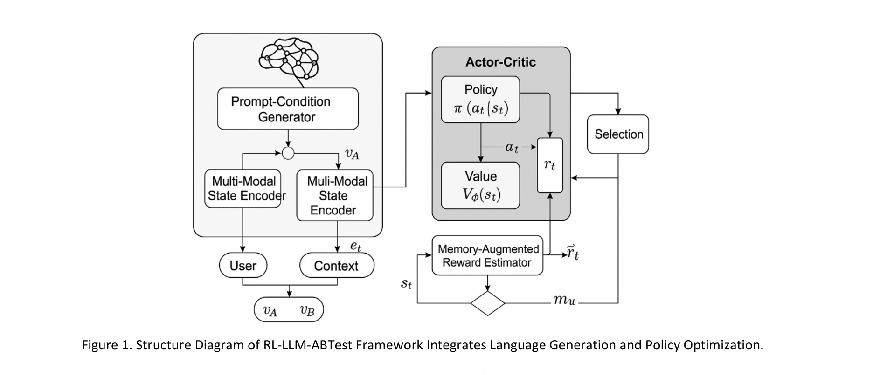
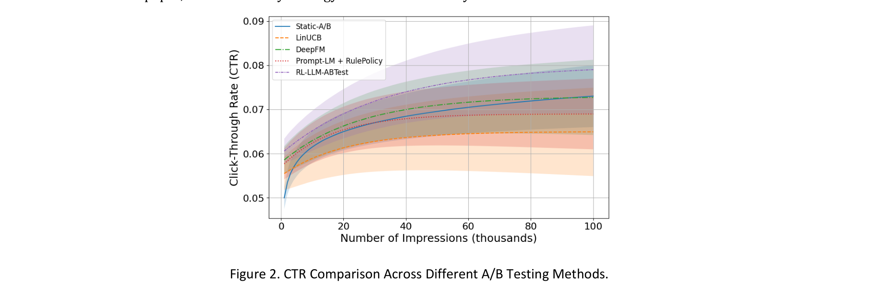
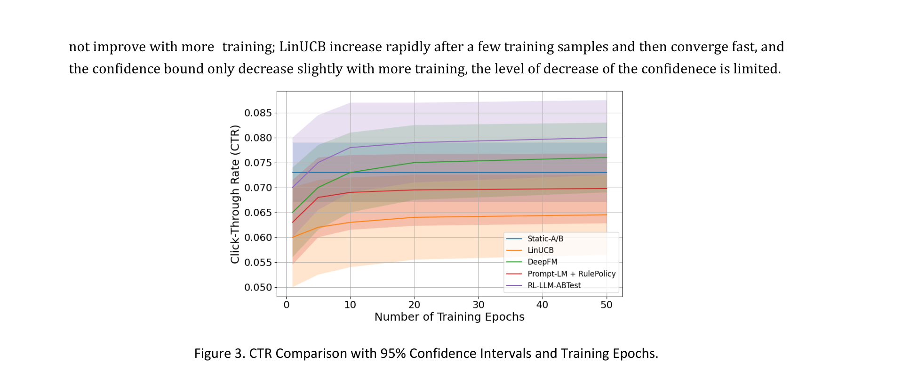

# A Reinforcement-Learning-Enhanced LLM Framework for Automated A/B Testing in Personalized Marketing

**Authors:** Haoyang Feng (Duke University), Yanjun Dai (Brandeis University), Yuan Gao (Boston University)
**Date:** June 2025
**Paper:** [PDF](https://arxiv.org/abs/2506.06316)

---

## TL;DR

This paper proposes RL-LLM-ABTest, a framework that replaces static A/B testing with dynamic, personalized content delivery using an RL-trained Actor-Critic policy on top of an LLM content generator. Instead of randomly assigning users to variant A or B and waiting for statistical significance, the system uses an LLM to *generate* personalized A/B content variants per user, then an Actor-Critic policy decides *which variant to show each user in real-time* based on user profile and context. A Memory-Augmented Reward Estimator captures long-term preference drift via GRU-based memory. Evaluated on the Criteo 1TB Display Advertising dataset (283M training instances), RL-LLM-ABTest achieves the highest CTR with the smallest confidence interval across 100K impressions, outperforming static A/B, LinUCB, DeepFM, and Prompt-LM+RulePolicy baselines.

---

## Key Figures

### Figure 1: System Architecture

The RL-LLM-ABTest framework has two main parts. **Left:** The Prompt-Conditioned Generator (LLM) takes user portrait and context features, generates personalized A/B content variants (v_A, v_B). Multi-modal state encoders embed user, context, and content into a fused state s_t. **Right:** The Actor-Critic module takes this state, outputs a policy π(a_t|s_t) selecting variant A or B, receives immediate reward r_t (click/conversion), and a Memory-Augmented Reward Estimator (GRU-based) produces an adjusted reward r̃_t that accounts for long-term preference drift via memory m_u.

### Figure 2: CTR Comparison Across Methods

Click-through rate (CTR) vs. number of impressions for five methods. RL-LLM-ABTest (red) maintains the highest CTR with the smallest confidence band throughout the entire range (0-100K impressions). Static A/B plateaus early. LinUCB rises fast but then dips due to over-exploration. DeepFM and Prompt-LM+RulePolicy grow moderately. RL-LLM-ABTest's narrower confidence interval indicates both higher performance and greater stability.

### Figure 3: CTR with Confidence Intervals Over Training

CTR vs. training epochs with 95% confidence intervals. RL-LLM-ABTest not only achieves the highest CTR at every training stage but also has the narrowest confidence band, indicating it continues to optimize effectively over long-term training while maintaining result stability. Other methods either plateau (Static-A/B), converge fast with limited gains (LinUCB), or grow moderately (DeepFM, Prompt-LM+RulePolicy).

---

## Key Novel Ideas

### 1. Dynamic Personalized A/B Testing via RL Policy

Traditional A/B testing randomly assigns users to a fixed variant (A or B) and waits for statistical significance. This is static, slow, and doesn't personalize. RL-LLM-ABTest makes three changes:

1. **Content generation**: Instead of pre-designed A/B variants, an instruction-tuned LLM generates personalized content variants conditioned on each user's profile and context:
$$v_k = \mathcal{M}_{LLM}(p | \theta_{LLM}), \quad k \in \{A, B\}$$
where $p = g(u, c)$ is a combined prompt from user portrait $u$ and context features $c$.

2. **Prompt optimization**: The generation prompt is optimized to maximize user response:
$$\max_{\theta_p} \mathbb{E}_{v_k \sim \mathcal{M}_{LLM}(p_{\theta_p})} [r(v_k, u)]$$
where $r(v_k, u)$ is the user's response strength to content $v_k$.

3. **Real-time policy selection**: An Actor-Critic policy dynamically decides which variant to show each user, adapting in real-time based on feedback.

### 2. Multi-Modal State Encoding

The state representation fuses three signal sources:
$$s_t = f_{fusion}(MLP[u_t; c_t; e_t^A; e_t^B])$$

where $e_t^A = Embed(v_A)$ and $e_t^B = Embed(v_B)$ are embeddings of the LLM-generated content (via Transformer embedder or [CLS] token), $u_t$ is the user portrait embedding, and $c_t$ is the context embedding. These are fused by a 3-layer MLP into state $s_t \in \mathbb{R}^{d_s}$.

This state captures not just who the user is and what context they're in, but also the quality of the specific content variants being considered -- making the policy content-aware.

### 3. Memory-Augmented Reward Estimator

Standard RL uses immediate reward (click/no-click). But in marketing, user preferences drift over time, and content interventions may have delayed effects (a coupon seen today may drive a purchase days later). The Memory-Augmented Reward Estimator addresses this with a GRU-based memory:

$$m_u^{(t)} = GRU(m_u^{(t-1)}, [s_t, a_t, m_u])$$

The adjusted reward incorporates this memory:
$$\tilde{r}_t = f_r(s_t, a_t, m_u)$$

And the cumulative return with memory enhancement:
$$R_t = \sum_{k=0}^{T} \gamma^k \tilde{r}_{t+k}$$

This lets the policy learn from long-term behavioral patterns, not just immediate clicks.

### 4. Actor-Critic with PPO for Content Selection

The policy uses PPO (Proximal Policy Optimization) for stable training:

$$\mathcal{L}_{actor} = \mathbb{E}_t[\min(r_t(\theta) \cdot \hat{A}_t, \text{clip}(r_t(\theta), 1-\epsilon, 1+\epsilon) \cdot \hat{A}_t)]$$

where $r_t(\theta) = \frac{\pi_\theta(a_t|s_t)}{\pi_{\theta_{old}}(a_t|s_t)}$ and $\hat{A}_t = R_t - V_\phi(s_t)$.

The critic minimizes TD error:
$$\mathcal{L}_{critic}(\phi) = \mathbb{E}_t[(V_\phi(s_t) - R_t)^2]$$

The action space is simple: $\mathcal{A} = \{A, B\}$ -- choose variant A or B.

---

## Architecture Details

| Component | Details |
|---|---|
| **LLM** | Instruction-tuned language model (not specified which) |
| **State encoder** | 3-layer MLP fusing user, context, and content embeddings |
| **Policy (Actor)** | Neural network outputting π(a_t\|s_t) over {A, B} |
| **Value (Critic)** | Neural network estimating V_φ(s_t) |
| **Memory** | GRU-based per-user memory m_u |
| **Reward** | Click-through rate (CTR) as immediate feedback |
| **RL algorithm** | PPO (Proximal Policy Optimization) |
| **Learning rate** | 3 × 10⁻⁴ (Actor-Critic) |
| **Discount factor** | γ = 0.99 |
| **Dataset** | Criteo 1TB Display Advertising Challenge |
| **Training data** | ~14M instances (5% sample of 283M) |
| **Test data** | 6M instances |

---

## Training Pipeline

1. **Data preparation**: Sample 5% (~14M entries) from Criteo 1TB dataset. Filter valid ad impressions with non-null click and context fields. Construct user status embeddings from browsing and ad history.

2. **Content generation**: LLM generates personalized A/B content variants for each user-context pair. Content representations are extracted via Transformer embedder.

3. **State construction**: User portrait, context, and content embeddings are fused via MLP into state s_t.

4. **RL training**: Actor-Critic with PPO. Each episode: observe state → select A or B → receive click/no-click reward → update memory → compute memory-augmented return → update policy.

5. **Prompt optimization**: Dynamic prompts (conditioned on user portrait and context) outperform static templates by 7.3% on CTR.

---

## Key Results

### CTR Comparison (Criteo 1TB Dataset)

| Method | CTR Performance | Stability |
|---|---|---|
| Static-A/B | Plateaus early (~0.06) | Wide CI |
| LinUCB | Fast rise then dips (~0.065) | Moderate CI, unstable |
| DeepFM | Moderate growth (~0.075) | Moderate CI |
| Prompt-LM + RulePolicy | Moderate growth (~0.075) | Moderate CI |
| **RL-LLM-ABTest** | **Highest throughout (~0.085)** | **Narrowest CI** |

RL-LLM-ABTest achieves the highest CTR at every impression count (0-100K) with the smallest confidence interval. It also maintains the highest CTR across all training epochs.

### Ablation Results

- **Removing Prompt-Conditioned Generator** → significant CTR drop (static templates instead of personalized content)
- **Removing Actor-Critic** → obvious rigidity and inefficiency (manual rule-based delivery instead of adaptive policy)
- **Dynamic vs. static prompts** → +7.3% CTR improvement from personalized prompts

---

## Key Takeaways

1. **This reframes A/B testing as a real-time decision problem, not a statistical experiment.** Instead of randomly assigning users and waiting for significance, the system actively *optimizes* which variant to show each user. This is closer to contextual bandits than traditional A/B testing.

2. **LLM content generation + RL content selection is a powerful combo.** The LLM generates personalized variants (content creation), and the RL policy decides which to show (content selection). Neither component alone matches their combination.

3. **Memory-augmented rewards capture long-term preference drift.** The GRU-based memory addresses a real problem in marketing: user preferences change over time, and interventions have delayed effects. Standard RL with immediate rewards misses these dynamics.

4. **Dynamic prompts outperform static templates by 7.3%.** Personalizing the LLM prompt based on user portrait and context generates more engaging content than generic templates. This is a practical finding for any LLM-based content generation system.

5. **The paper is light on specific numbers.** Results are shown primarily as CTR curves in figures rather than precise tables with statistical tests. The exact CTR values at specific impression counts are not reported numerically. This makes it hard to quantify the exact improvement margin.

6. **The action space is extremely simple (A or B).** Unlike Shop-R1 (which predicts complex web interactions) or Agent A/B (which navigates live websites), the RL agent here just picks between two options. The intelligence comes from the content generation and state representation, not the action complexity.

7. **The Criteo dataset is a reasonable but indirect evaluation.** Criteo logs real ad impressions, but the paper simulates A/B testing on this data -- the content variants are generated post-hoc, not shown to real users. This makes the evaluation more of a simulation than a real-world deployment.

8. **The paper occupies a different niche from Agent A/B and SimAB.** Agent A/B and SimAB simulate human users to *predict* A/B test outcomes. RL-LLM-ABTest *replaces* static A/B testing with a dynamic personalized policy. It's not about predicting which variant wins -- it's about dynamically adapting which variant to show each individual user.

---

## What's Open-Sourced

- **No code, models, or data are released.**
- The evaluation uses the **Criteo 1TB Display Advertising Challenge** dataset, which is publicly available.
- The specific LLM used for content generation is not named.
- Hyperparameters for the Actor-Critic are provided (lr=3e-4, γ=0.99).
