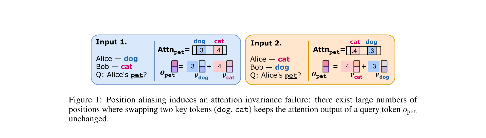
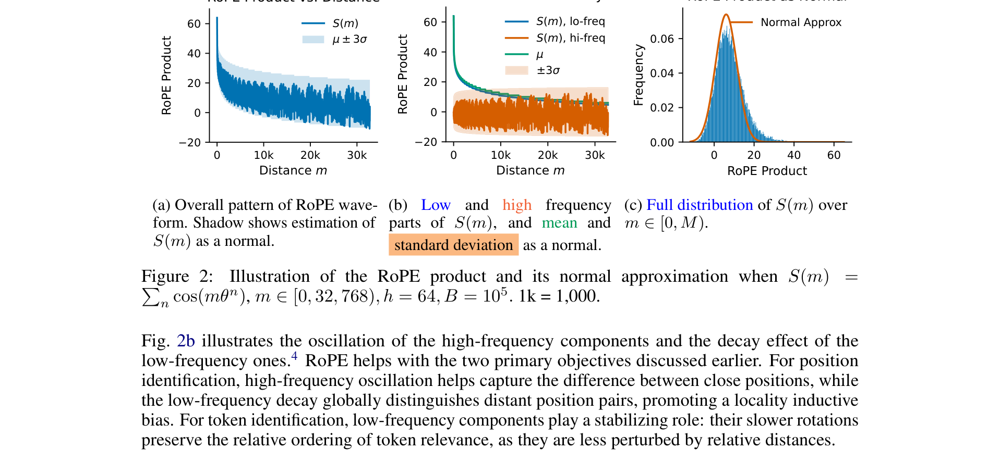
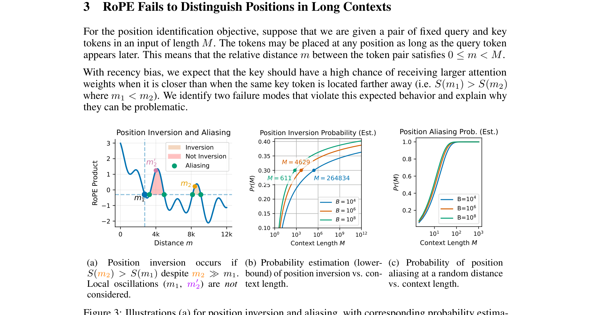
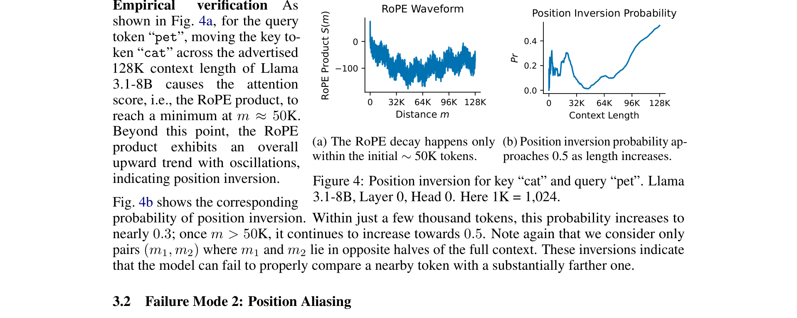
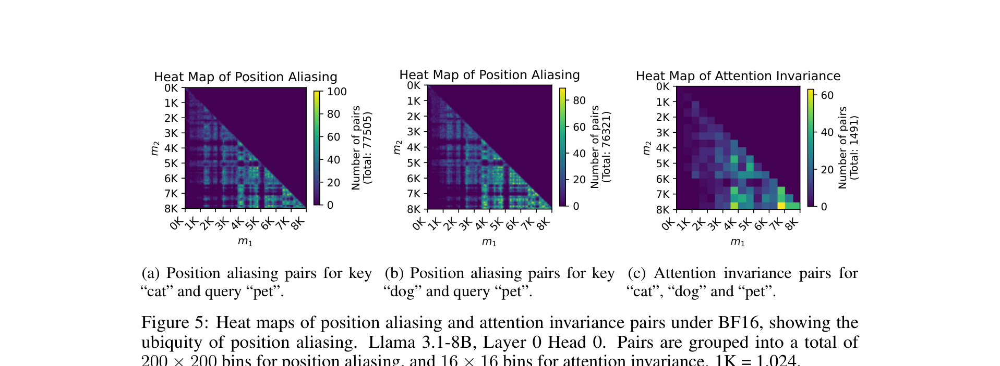
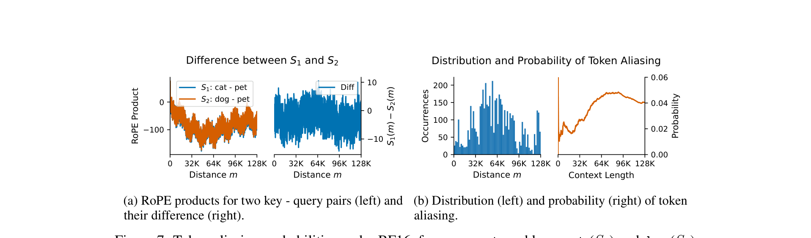
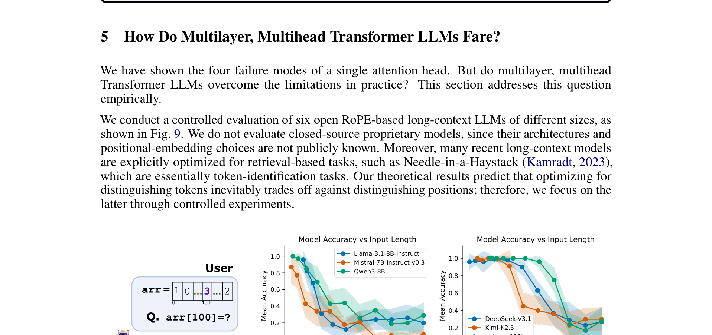

# RoPE Distinguishes Neither Positions Nor Tokens in Long Contexts, Provably

**Authors:** Yufeng Du (UIUC), Phillip Harris (U Bonn), Minyang Tian (UIUC), Eliu A Huerta (Argonne), Srikanth Ronanki, Subendhu Rongali, Aram Galstyan (Amazon AGI), Hao Peng (UIUC, corresponding)
**Date:** May 15, 2026
**Paper:** [arXiv:2605.15514](https://arxiv.org/abs/2605.15514)

---

## TL;DR

This paper proves that RoPE — the positional encoding used in essentially every modern LLM — has **intrinsic, provable limitations** in long contexts that cannot be fixed by engineering. As context length grows, RoPE loses both its **locality bias** (ability to favor nearby positions) and its **token-relevance consistency** (ability to maintain relative ranking of attention scores). Specifically, four failure modes are identified: **position inversion** (a farther token gets higher attention than a closer one, approaching 50% probability), **position aliasing** (two different positions produce identical attention scores), **token inversion** (relative token ranking flips at different positions), and **token aliasing** (different tokens get the same attention score). Adjusting the RoPE base trades off position-distinguishing against token-distinguishing — you cannot improve both at once. Empirically, 6 real LLMs (7B to 100B+) fail at a simple array-indexing task starting from just **4K tokens** — a length well within their claimed context windows.

---

## Key Figures

### Fig. 1: Position Aliasing Causes Attention Invariance

The paper's motivating example. "Alice — dog, Bob — cat, Q: Alice's pet?" If the key tokens "dog" and "cat" are at positions that form an *aliasing pair*, swapping them doesn't change the attention output at all — the model literally cannot distinguish which token is where. This happens because the RoPE products at those two distances are identical within numerical precision. At 8K context with BF16, there are already **75K** such aliasing pairs and **1,491** attention-invariance cases.

### Fig. 2: The Key Insight — RoPE Product as a Normal Random Variable

The theoretical foundation of the paper. (a) The RoPE product S(m) = Σ aₙ cos(mθⁿ + φₙ) oscillates rapidly and decays with distance m. (b) Decomposition: low-frequency terms provide the decaying mean (orange); high-frequency terms provide the oscillation (blue). The ±3σ band (green) captures the variance. (c) S(m) over the full context is well-approximated by a normal distribution N(μ_M, σ²_M) — this is the Central Limit Theorem applied to a sum of cosines at different frequencies. As M grows, the **mean decays** (less locality bias) but the **variance increases** (more unpredictability).

### Fig. 3: Position Inversion and Aliasing vs Context Length

(a) Illustration: position inversion means S(m₂) > S(m₁) despite m₂ >> m₁ — a farther token gets higher attention. (b) The probability of position inversion grows with context length M and approaches 0.5 (random chance) as M log B → ∞ (Theorem 1). (c) The probability of a random distance having an aliasing pair converges to 1 exponentially fast (Theorem 2). Increasing RoPE base B slows these trends but cannot eliminate them.

### Fig. 4: Position Inversion in Llama 3.1-8B (128K Context)

Empirical verification on Llama 3.1-8B, Layer 0, Head 0, for query "pet" and key "cat". (a) The RoPE product decays for the first ~50K tokens, then oscillates around zero — at this point, position provides no useful signal. (b) The corresponding position inversion probability reaches ~0.3 by just a few thousand tokens and continues climbing toward 0.5. Within the advertised 128K context window, RoPE's locality bias is effectively random for distant positions.

### Fig. 5: Position Aliasing Heatmaps in Llama 3.1-8B at 8K Context

Even at just 8K context (well within Llama's claimed 128K), position aliasing is ubiquitous. (a, b) For keys "cat" and "dog" with query "pet", nearly every distance m₁ is involved in at least one aliasing pair (m₁, m₂) — totals: 77,565 and 76,321 pairs respectively. (c) Attention invariance: 1,491 pairs where swapping the two key tokens produces identical attention output. The aliasing appears *regardless of positional proximity* — it's not limited to edge cases.

### Fig. 7: Token Inversion and Token Aliasing

(a) Token inversion: S₁(0) > S₂(0) (key₁ is more relevant at distance 0) but S₁(m) < S₂(m) at some distance m — the ranking flips. (b) Token aliasing probability: S₁(m) = S₂(m) at some positions, meaning the model cannot distinguish the two keys at those distances. The probability increases with M and *decreases* with B — the opposite direction from position aliasing. This creates the fundamental tradeoff.

### Fig. 9: Real LLMs Fail at Indexing by 4K Tokens

The empirical punchline. Six open RoPE-based LLMs (Llama-3.1-8B, Mistral-7B, Qwen3-8B, DeepSeek-V3.1, Kimi-K2.5, gpt-oss-120b) are tested on a simple task: "given arr = [1, 0, 3, ...], what is arr[100]?" — with only 4 distinct integers (random-guess accuracy = 25%). All models start near-perfect at short lengths but **drop to near-random by 4K-8K tokens**. This is not a retrieval task — it tests pure position identification, which our theory predicts RoPE fundamentally fails at in long contexts.

---

## Key Novel Ideas

### 1. The RoPE Product Is a Normal Random Variable (Remark 2.1)

This is the paper's key insight. The RoPE product between a query q and key k at relative distance m is:

$$S(m) = S_{\mathbf{q},\mathbf{k}}(m) = \sum_{n=0}^{h-1} a_n \cos(m\theta^n + \phi_n)$$

where h = d/2 is the number of frequency pairs, θ = B^(-1/h) is the angular frequency base, aₙ > 0 are amplitudes (determined by q and k norms), and φₙ are phases. This is a sum of h cosines at different frequencies.

**The CLT-based insight:** If the distance m is drawn uniformly from [A, M] with M − A large, the high-frequency cosines oscillate rapidly and behave like independent random variables. By the Central Limit Theorem, S(m) is approximately normal:

$$\tilde{S} = \tilde{S}_{[A,M)}(\mathbf{q}, \mathbf{k}) \sim \mathcal{N}(\mu_M(\mathbf{q}, \mathbf{k}), \sigma_M^2(\mathbf{q}, \mathbf{k}))$$

where the **mean** μ_M is determined by the low-frequency terms (which provide the decaying trend = locality bias) and the **variance** σ²_M is determined by the high-frequency terms (which provide the oscillation = unpredictability). As M grows, μ_M shrinks and σ_M² grows — the signal-to-noise ratio degrades.

**Why this matters:** it converts questions about RoPE's long-context behavior into questions about normal random variables, which have well-known tail bounds. All four failure modes follow directly.

### 2. Four Failure Modes — Formalized as Theorems

| Failure Mode | Definition | Indicator | As M ↑ | As B ↑ |
|---|---|---|---|---|
| **Position Inversion** | m₁ < m₂ but S(m₁) < S(m₂) | P(inversion) → 1/2 | ↑ (worse) | ↑ (worse) |
| **Position Aliasing** | S(m₁) = S(m₂) for m₁ ≠ m₂ | P(∃ alias) → 1 exp. fast | ↑ (worse) | ↑ (worse) |
| **Token Inversion** | S₁(0) > S₂(0) but S₁(m) < S₂(m) | P(inversion) → 1/2 | ↑ (worse) | ↓ (better) |
| **Token Aliasing** | S₁(m) = S₂(m) for different keys | P(∃ alias) grows | ↑ (worse) | ↓ (better) |

The critical insight is the **B column**: position failures get worse with larger B, token failures get better. **This means the RoPE base B is a tradeoff knob between position identification and token identification — you cannot optimize both simultaneously.**

### Theorem 1 (Position Inversion)

> *The probability lower bound of position inversion increases with context length M and RoPE base B. The probability approaches 1/2 as M log B → ∞.*

Proof sketch: model the RoPE products at two distances m₁ ∈ [0, M/2) and m₂ ∈ [M/2, M) as normal variables. Their difference is also normal. The probability that S(m₁) < S(m₂) depends on the ratio of the mean difference to the standard deviation. As M grows, σ grows faster than the mean difference shrinks, so the probability converges to 0.5.

### Theorem 2 (Position Aliasing)

> *The probability that a random distance admits an aliasing pair converges to 1 exponentially fast. The total number of aliasing pairs increases with both M and B.*

The difference between RoPE products at two positions is a zero-mean normal; its absolute value falling below the datatype resolution ε gives an aliasing event. With BF16 (7 explicit fraction bits, ε ≈ 2^(-7)√h), this happens frequently.

### Theorem 3 (Token Inversion)

> *The probability lower bound for token inversion increases with M, approaching 1/2 as M → Θ(B). In contrast, the lower bound decreases with the RoPE base B.*

This is the reverse direction from Theorem 1: larger B helps distinguish tokens but hurts position identification.

### Theorem 4 (Token Aliasing)

> *The number of token aliasing positions increases with M and decreases with B. For a sufficiently long context of length M, it is bounded by Θ(2^(-f) √(hM)).*

At BF16 with h=64 and M=32K: up to 5% of positions exhibit token aliasing — 1.6K positions where the model cannot distinguish two different key tokens.

### 3. The RoPE Base Tradeoff — Fundamental, Not Engineering

Table 1 in the paper summarizes: increasing B (a common practice in long-context models) helps token inversion and token aliasing (both ↓) but **worsens** position inversion and position aliasing (both ↑). There is no value of B that resolves all four failure modes. This is not a hyperparameter-tuning problem — it's a structural limitation.

The practical implication: models that increase B to extend context length (common practice) are trading position identification for token identification. They can tell *which token* something is more reliably, but they lose track of *where* it is. This may explain the "Lost in the Middle" phenomenon.

### 4. Multi-Head, Multi-Layer Doesn't Fix It

Section 5 tests whether real multi-head, multi-layer models overcome the single-head theoretical limitations. Six LLMs (7B to 100B+) are tested on an array-indexing task where the model must identify the value at position k in a list of just 4 distinct integers. All models drop to near-random accuracy (≈25%) by 4K-8K tokens — **far below their claimed context windows** (most claim 128K+).

The task is deliberately simple: it only tests *position identification*, not retrieval or reasoning. The fact that even 100B+ models fail at 4K tokens on a 4-way multiple-choice task is strong empirical evidence that the theoretical limitations persist in practice.

---

## Key Results

### Single-head theoretical predictions (verified on Llama 3.1-8B, Layer 0, Head 0)

| Failure Mode | Measured at 8K context |
|---|---|
| Position aliasing pairs | **75K+** pairs (for "cat"/"pet") |
| Attention invariance cases | **1,491** (swapping keys doesn't change output) |
| Position inversion probability | **~0.3** at few-thousand tokens, rising to **~0.5** |
| Token aliasing positions | **~150** within 8K context |

### Multi-model empirical results (array-indexing task, position identification)

| Model | Size | Claimed Context | Length at 25% Accuracy (random) |
|---|---|---|---|
| Llama-3.1-8B-Instruct | 8B | 128K | **~4K tokens** |
| Mistral-7B-Instruct-v0.3 | 7B | 32K | **~4K tokens** |
| Qwen3-8B | 8B | 128K | **~8K tokens** |
| DeepSeek-V3.1 | 671B | 128K | **~8K tokens** |
| Kimi-K2.5 | 1T+ | 128K | **~8K tokens** |
| gpt-oss-120b | 120B | 128K | **~8K tokens** |

All models fail at a tiny fraction of their claimed context length. The task has only 4 answer choices, so 25% is random guessing. Even the largest models (DeepSeek-V3.1, Kimi-K2.5, gpt-oss-120b) collapse by 8K.

---

## Key Takeaways

1. **RoPE has intrinsic, provable limitations in long contexts.** This is not an engineering or training-data issue. The mathematical structure of RoPE (sum of cosines at different frequencies) causes its attention scores to become unpredictable as context grows. The CLT-based normal approximation is the formal tool that makes this precise.

2. **Position inversion approaches coin-flip probability.** At long context, the chance that a farther token gets higher attention than a closer one approaches 50% — RoPE's locality bias becomes effectively random. This is Theorem 1, the most impactful result.

3. **Position aliasing is already massive at 8K tokens.** Over 75K pairs of distances produce identical attention scores at 8K context in BF16. This means the model literally cannot distinguish those positions. Swapping tokens at aliasing positions changes nothing about the attention output.

4. **The RoPE base B creates an impossible tradeoff.** Increasing B (common for long-context models) helps distinguish tokens but hurts position identification. Decreasing B does the reverse. There is no sweet spot — the tradeoff is fundamental.

5. **Real LLMs fail at position identification by 4K tokens.** All 6 tested models (7B to 100B+) drop to random accuracy on a simple array-indexing task by 4K-8K tokens — well within their claimed context windows. Multi-head, multi-layer architectures don't rescue the fundamental limitation.

6. **"Lost in the Middle" may be a RoPE problem, not a training problem.** The paper provides a mechanistic explanation: as distance from the query grows, the RoPE product enters the high-variance regime where position inversion and aliasing dominate. Information in the middle of long contexts is at positions where RoPE provides the least reliable signal.

7. **Length-extension techniques don't fix this.** RoPE scaling (NTK, YaRN, etc.) effectively increases B, which trades position identification for token identification. The paper shows on Llama 3.1 (which uses RoPE scaling) that all four failure modes persist.

8. **BF16 precision makes aliasing worse.** Token and position aliasing depend on the datatype resolution. BF16 has only 7 explicit fraction bits, so differences smaller than ~2^(-7) are rounded to zero — creating false aliases. FP32 would help but not eliminate the issue.

9. **The paper's conclusion is that fundamentally new positional mechanisms are needed.** The authors explicitly state that "context length cannot be effectively extended without addressing the two objectives" and that "fundamentally new approaches to positional mechanisms better suited to long-context language modeling" may be needed.

10. **The normal-approximation framework is independently useful.** Treating the RoPE product as a normal random variable (Remark 2.1) is a powerful analytical tool. Any future analysis of RoPE-like positional encodings can use this framework to derive bounds on failure probabilities.

---

## What's Open-Sourced

- **Code/Data:** Not explicitly mentioned. The indexing task is simple to reproduce (a Python list of 4 integers).
- **Models evaluated:** All are publicly available (Llama-3.1-8B, Mistral-7B, Qwen3-8B, DeepSeek-V3.1, Kimi-K2.5, gpt-oss-120b).
- **The theoretical framework** (CLT-based normal approximation of the RoPE product) is the main open contribution — it enables anyone to compute failure probabilities for their specific model configuration (d, B, M, datatype).
