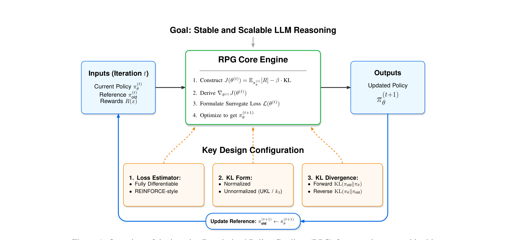
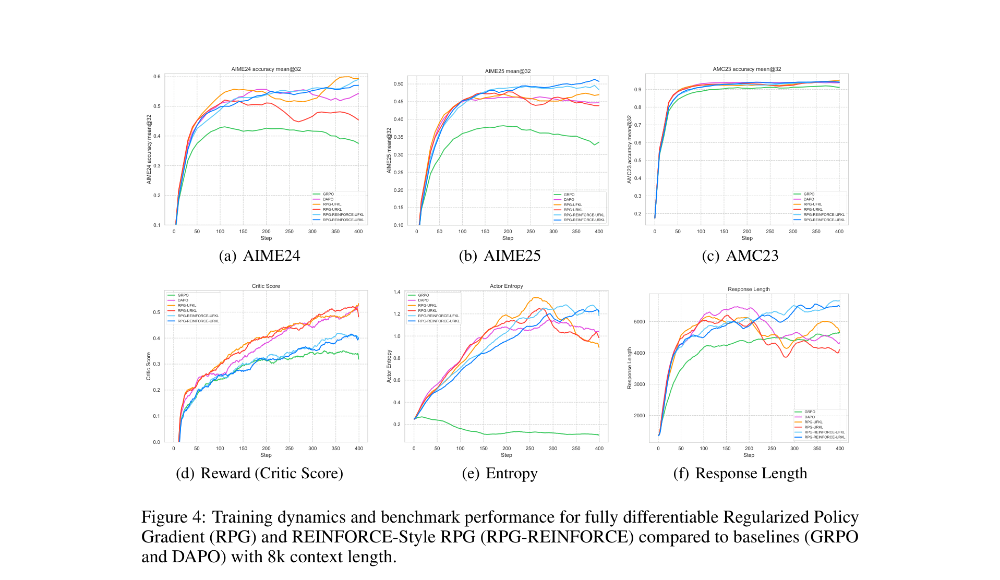
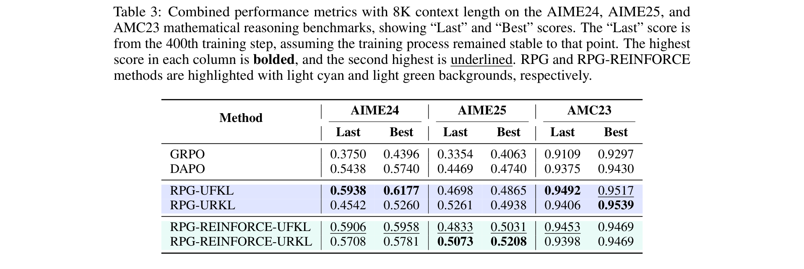

# On the Design of KL-Regularized Policy Gradient Algorithms for LLM Reasoning

**Authors:** Yifan Zhang (Princeton/UCLA), Yifeng Liu (UCLA), Huizhuo Yuan (UCLA), Yang Yuan, Quanquan Gu (UCLA), Andrew Chi-Chih Yao (Tsinghua)
**Date:** Published at ICLR 2026
**Paper:** [arXiv:2505.17508](https://arxiv.org/abs/2505.17508)
**Code:** [github.com/complex-reasoning/RPG](https://github.com/complex-reasoning/RPG)

---

## TL;DR

This paper systematically derives what the *correct* surrogate loss functions should be for KL-regularized policy gradient methods in LLM reasoning, under off-policy sampling. The key finding is that GRPO's KL penalty is missing an importance weight, making it an incorrect estimator of the intended objective. The paper introduces **RPG** (Regularized Policy Gradient), a unified framework covering forward/reverse KL, normalized/unnormalized forms, and fully-differentiable vs REINFORCE-style losses. Combined with **RPG-Style Clip** (dual-clip importance sampling) and iterative reference updates, RPG-REINFORCE achieves +6 absolute points over DAPO on AIME24/25, and **52% on AIME25 with 8K context** — beating Qwen3-4B-Instruct (47%).

---

## Key Figures

### Fig. 1: RPG Framework Overview

The RPG Core Engine at each iteration takes the current policy π_θ, a reference policy π_old, and rewards R(x), then: (1) constructs the KL-regularized objective J(θ) = E[R] − β·KL, (2) derives the off-policy gradient, (3) formulates a surrogate loss, (4) optimizes. Three design axes configure the engine: the **loss estimator type** (fully differentiable vs REINFORCE-style with stop-gradient), the **KL form** (normalized vs unnormalized / k₃), and the **KL direction** (forward vs reverse). The reference policy is iteratively updated (π_old ← π_θ) to avoid over-regularization toward the initial checkpoint.

### Fig. 4: Training Dynamics and Benchmark Performance (8K Context)

Six-panel view comparing RPG variants (orange/green) against GRPO (red) and DAPO (blue) with 8K context length over 400 training steps. Top row: accuracy on AIME24 (a), AIME25 (b), AMC23 (c) — RPG-REINFORCE-URKL (dark blue) achieves the highest AIME25 accuracy (~52%). Bottom row: training dynamics — reward (d), entropy (e), response length (f). Key observation: RPG methods maintain higher entropy than DAPO throughout training, which correlates with better exploration and final accuracy. GRPO is the most unstable, with visible oscillations in all metrics.

### Table 3: 8K Context Results

The headline numbers. With 8K context, RPG-REINFORCE-URKL achieves **best 52.08% on AIME25** vs DAPO's 47.40% and GRPO's 40.63%. On AIME24, RPG-UFKL leads at **61.77% best**, vs DAPO's 57.40%. RPG methods (both fully differentiable and REINFORCE-style) dominate across all three benchmarks.

---

## Key Novel Ideas

### 1. The GRPO KL Bug: Missing Importance Weight

This is the paper's most practically impactful finding. GRPO uses the k₃ estimator for KL regularization:

$$k_3\left(\frac{\pi_{\text{ref}}(o_{i,t} | h_{i,t})}{\pi_\theta(o_{i,t} | h_{i,t})}\right) = \frac{\pi_{\text{ref}}}{\pi_\theta} - \log\frac{\pi_{\text{ref}}}{\pi_\theta} - 1$$

GRPO evaluates this on tokens sampled from π_old (the sampling policy from the previous step), but **the k₃ term is subtracted directly without an importance weight**. If the KL penalty is meant to approximate β · UKL(π_θ ∥ π_ref), then off-policy estimation requires multiplying by w(x) = π_θ(x) / π_old(x):

$$\widehat{\text{KL}}_{\text{corrected}}(h_{i,t}; \theta) = \mathbb{E}_{o_{i,t} \sim \pi_{\text{old}}} \left[ w_{i,t} \cdot k_3\left(\frac{\pi_{\text{ref}}}{\pi_\theta}\right) \right]$$

Without this weight, **the gradient of GRPO's objective does not match the gradient of the intended KL-regularized objective**. This explains some of GRPO's training instability — the KL penalty gradient is biased.

### 2. k₃ Estimator = Unnormalized KL (Exact Equality)

The paper proves (Appendix D) that the k₃ estimator used in GRPO is *exactly* the unnormalized KL divergence:

$$\mathbb{E}_{x \sim \pi_\theta}\left[k_3\left(\frac{\pi_{\text{old}}(x)}{\pi_\theta(x)}\right)\right] = \text{UKL}(\pi_\theta \| \pi_{\text{old}})$$

This is not an approximation — it's an identity. This means GRPO was always implicitly using unnormalized KL (not standard KL as often assumed), which has a mass-correction term that pushes π_θ to match not just the *shape* but also the *total mass* of π_old. The paper makes this explicit and derives the correct off-policy gradient.

### 3. The RPG Unified Framework

RPG derives **correct** surrogate losses for all combinations of:

| Axis | Options |
|---|---|
| KL direction | Forward KL(π_old ∥ π_θ) vs Reverse KL(π_θ ∥ π_old) |
| Normalization | Normalized (KL) vs Unnormalized (UKL) |
| Loss type | Fully differentiable vs REINFORCE-style (with stop-gradient) |

The key result is **Table 1** (main text): for off-policy sampling from π̃_old = π_old / Z_old, the correct surrogate losses are:

- **UFKL (Unnormalized Forward KL):** L = Z_old · E[-w(x)R(x) + β(w(x) − log w(x) − 1)]
- **URKL (Unnormalized Reverse KL):** L = Z_old · E[-w(x)R(x) + β(w(x) log w(x) − w(x))]

where w(x) = π_θ(x) / π_old(x) is the importance weight. These losses satisfy ∇L = −∇J exactly.

**Proposition 4.1** then proves that the REINFORCE-style versions (using stop-gradient) yield the same gradients as the fully differentiable versions. This means you can use whichever is easier to implement — they're gradient-equivalent.

### 4. RPG-Style Clip: Dual-Clip for Off-Policy REINFORCE

Large importance ratios w(x) cause high variance. RPG-Style Clip adapts the Dual-Clip method:

- Clip w into [1 − ε₁, 1 + ε₂] for positive advantages
- Impose a lower bound c for negative advantages (prevents the policy from being *pushed toward* bad outputs)

$$\mathcal{L}^{\text{RPG-Clip}} = \begin{cases} \max(-w\hat{A}, -\text{clip}(w, 1-\varepsilon_1, 1+\varepsilon_2)\hat{A}), & \hat{A} \geq 0 \\ \min(\max(-w\hat{A}, -\text{clip}(w)\hat{A}), -c\hat{A}), & \hat{A} < 0 \end{cases}$$

where  is the *regularized advantage* that includes both reward and KL terms (e.g., Â_URKL = (R − b) − β log w). This is the critical piece that makes RPG-REINFORCE work at scale — without it, off-policy REINFORCE is too unstable.

### 5. Iterative Reference Updates

Instead of fixing π_ref to the SFT model forever (which over-constrains), RPG periodically sets π_old ← π_θ every K steps, or when a moving average of token-level KL exceeds a target κ. This realizes a practical trust-region without the rigidity of a fixed anchor, and is key to achieving large accuracy gains during training.

### 6. Memory Efficiency: Only One Model in GPU Memory

A practical advantage: RPG pre-computes log-probabilities from π_old for the sampled data and stores them. During the training step, only π_θ needs to be in GPU memory. This is **faster and more memory-efficient** than GRPO, which typically requires two models (π_θ and π_ref) active during optimization.

---

## Training Pipeline

1. **Base model:** Qwen3-4B or Qwen2.5-7B-Instruct
2. **Training data:** DAPO-Math-17K (13.9K English math problems)
3. **RL algorithm:** RPG-REINFORCE with URKL or UFKL regularization + RPG-Style Clip
4. **Framework:** veRL with vLLM for inference
5. **Clipping:** (ε₁, ε₂) = (0.2, 0.28) for RPG and DAPO; (0.2, 0.2) for GRPO
6. **Dynamic sampling:** Oversamples hard prompts, filters near-perfect/near-zero accuracy prompts (from DAPO)
7. **Overlong punishment:** Penalty in reward shaping for verbose outputs (from DAPO)
8. **Reference updates:** Iterative (π_old ← π_θ) every K steps or when token-level KL exceeds κ
9. **Evaluation:** Mean@32 (average accuracy over 32 sampled responses) on AIME24, AIME25, AMC23
10. **Context lengths:** Experiments at 2K, 4K, and 8K

---

## Key Results

### Main results (Table 3): 8K context, Qwen3-4B, DAPO-Math-17K

| Method | AIME24 Last | AIME24 Best | AIME25 Last | AIME25 Best | AMC23 Last | AMC23 Best |
|---|---|---|---|---|---|---|
| GRPO | 37.50 | 43.96 | 33.54 | 40.63 | 91.09 | 92.97 |
| DAPO | 54.38 | 57.40 | 44.69 | 47.40 | 93.75 | 94.30 |
| **RPG-UFKL** | **59.38** | **61.77** | 46.98 | 48.65 | **94.92** | **95.17** |
| RPG-URKL | 45.42 | 52.60 | 52.61 | 49.38 | 94.06 | **95.39** |
| RPG-REINFORCE-UFKL | 59.06 | 59.58 | 48.33 | 50.31 | 94.53 | 94.69 |
| **RPG-REINFORCE-URKL** | 57.08 | 57.81 | **50.73** | **52.08** | 93.98 | 94.69 |

### Key deltas vs DAPO (8K context)

| Benchmark | DAPO Best | RPG Best | Δ |
|---|---|---|---|
| AIME24 | 57.40% | **61.77%** (RPG-UFKL) | **+4.37** |
| AIME25 | 47.40% | **52.08%** (RPG-REINFORCE-URKL) | **+4.68** |
| AMC23 | 94.30% | **95.39%** (RPG-URKL) | +1.09 |

### Comparison to Qwen3-4B-Instruct (8K context, AIME25)

| Model | AIME25 |
|---|---|
| Qwen3-4B-Instruct | 47% |
| **RPG-REINFORCE-URKL** | **52%** |

---

## Key Takeaways

1. **GRPO's KL penalty has a missing importance weight.** Under off-policy sampling, the k₃ KL term in GRPO should be multiplied by w(x) = π_θ / π_old. Without it, the gradient is biased. This is not a minor issue — it affects training stability and is likely one reason GRPO shows more volatility than RPG in practice.

2. **k₃ = unnormalized KL (exactly).** The k₃ estimator (y − log y − 1) that GRPO and others use is not an approximation of KL — it's exactly the unnormalized KL. This means every system using k₃ is implicitly doing UKL regularization, including the mass-correction term. The paper makes this explicit.

3. **REINFORCE-style losses (with stop-gradient) are gradient-equivalent to fully differentiable surrogates.** Proposition 4.1 proves this. In practice, the REINFORCE-style variants work as well or better, and they're simpler to implement because you only need to compute the weight inside a stop-gradient — no need to differentiate through the importance ratio.

4. **RPG-REINFORCE with RPG-Style Clip is the best variant at scale.** Across all experiments, the REINFORCE-style RPG with dual-clip importance sampling dominates. This is somewhat surprising — REINFORCE is often dismissed as high-variance. The dual-clip mechanism tames the variance while the KL-correct objective provides the right gradient direction.

5. **Forward KL wins on AIME24, Reverse KL wins on AIME25.** RPG-UFKL achieves the best AIME24 score (61.77%), while RPG-REINFORCE-URKL achieves the best AIME25 score (52.08%). The difference is: forward KL encourages π_θ to cover the support of π_old (mode-covering / zero-forcing), while reverse KL encourages π_θ to concentrate where π_old has mass (mode-seeking). Different benchmarks may favor different exploration strategies.

6. **Iterative reference updates are critical.** Fixing π_ref to the SFT model over-constrains the policy — it can't deviate enough to learn new reasoning patterns. Periodically updating π_old ← π_θ implements a practical trust-region that allows cumulative departure from the initial model while keeping each step small.

7. **Only one model needed in GPU memory.** RPG pre-computes π_old log-probs and stores them, so only π_θ is active during training. GRPO needs both π_θ and π_ref loaded simultaneously. This is a real practical advantage at scale.

8. **RPG maintains higher entropy than DAPO.** Figure 4(e) shows RPG methods maintain higher actor entropy throughout training. DAPO's "higher-and-clip-higher" strategy substantially reduces entropy. Higher entropy = more exploration, which correlates with better final accuracy on hard math benchmarks. This suggests DAPO may be too aggressive in entropy reduction.

9. **52% on AIME25 from a 4B base model is remarkable.** RPG-REINFORCE-URKL, trained on Qwen3-4B with only 13.9K math problems, surpasses the official Qwen3-4B-Instruct (47%) which was trained with the full post-training pipeline including DPO and multi-stage RL. This validates that getting the *algorithmic fundamentals right* (correct KL, correct importance weights, correct clipping) matters more than scale of training data or number of pipeline stages.

10. **The connection to Natural Policy Gradient.** RPG's KL-regularized update can be viewed as a second-order-like update: the reward provides a first-order signal, and the KL regularization provides curvature. NPG is a special case of RPG with linear reward approximation and quadratic KL approximation. This theoretical connection suggests RPG inherits some of NPG's favorable convergence properties.

---

## What's Open-Sourced

- **Code:** [github.com/complex-reasoning/RPG](https://github.com/complex-reasoning/RPG) — implementation using the veRL framework
- **Models:** Not explicitly released, but the training recipe and hyperparameters are fully specified
- **Training data:** DAPO-Math-17K is publicly available
- **Baselines:** GRPO, DAPO, REINFORCE++ reimplemented in the same framework for fair comparison
