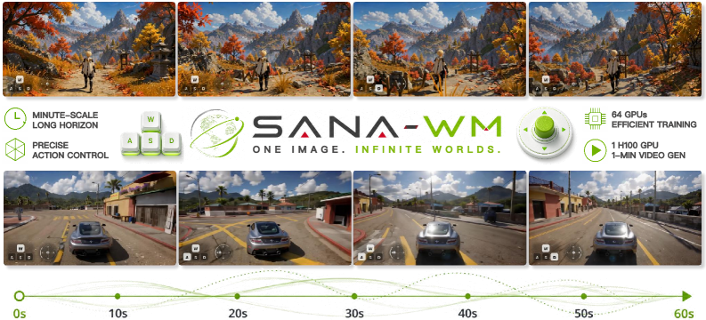
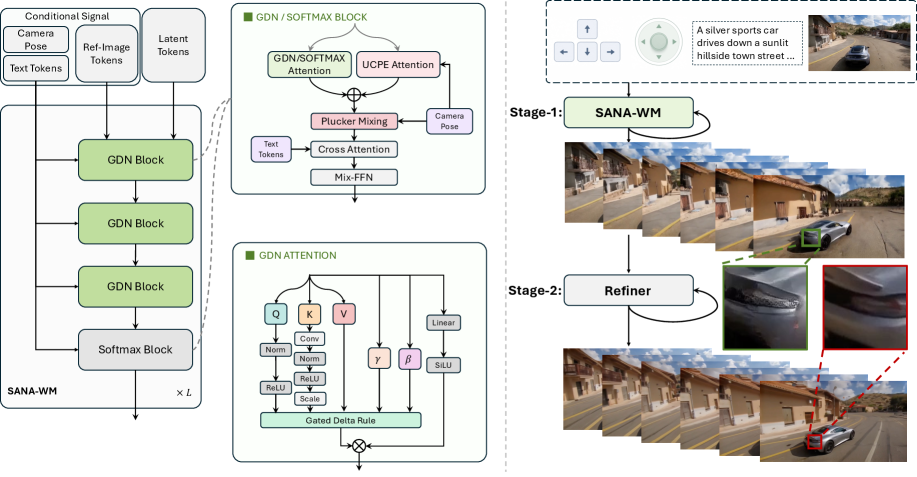
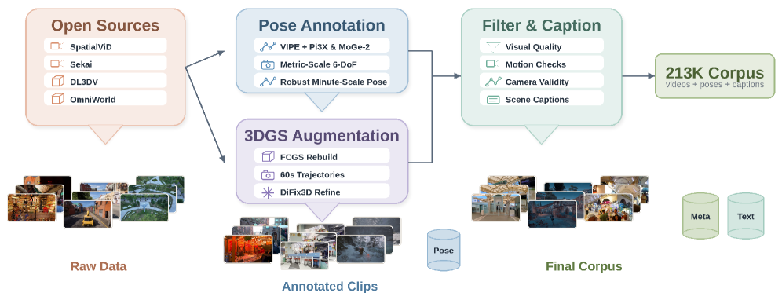
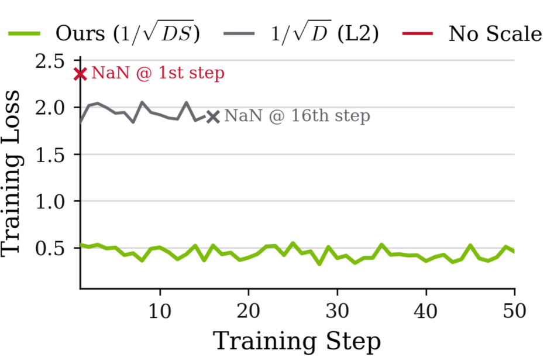
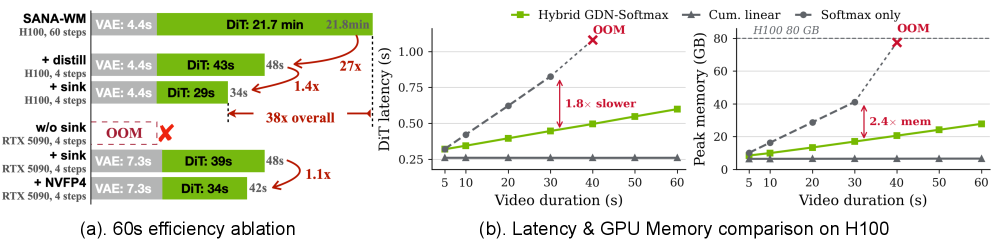

# SANA-WM: Efficient Minute-Scale World Modeling with Hybrid Linear Diffusion Transformer

**Authors:** Haozhe Liu, Yuyang Zhao, Tian Ye, Junsong Chen, Jincheng Yu, Tong He, Song Han, Enze Xie (NVIDIA)
**Date:** May 2026
**Paper:** [arXiv:2605.15178](https://arxiv.org/abs/2605.15178)

---

## TL;DR

SANA-WM is a 2.6B-parameter open-source world model that generates **1-minute 720p videos with precise 6-DoF camera control** — trained on only **213K video clips in 15 days on 64 H100s**. The core innovation is a **hybrid GDN/softmax attention** backbone that keeps memory constant for minute-scale sequences, paired with **dual-branch camera conditioning** (latent-rate UCPE + raw-frame Plücker mixing) for precise trajectory following. With a second-stage long-video refiner, SANA-WM matches the visual quality of 14B+ industrial baselines (LingBot-World) while running on a **single GPU** at **36× higher throughput**. A distilled variant generates a 60s 720p clip in **34 seconds on a single RTX 5090**.

---

## Key Figures

### Fig. 1: Teaser — Minute-Scale 720p World Model

SANA-WM generates a 60-second 720p video from a first frame + text + 6-DoF camera trajectory. The frames shown span from 5s to 55s, maintaining scene identity and viewpoint consistency across the full minute. The model is 2.6B parameters and runs on a single GPU.

### Fig. 2: Architecture — Hybrid GDN/Softmax DiT + Dual Camera Control

Left: the backbone interleaves 15 frame-wise Gated DeltaNet (GDN) blocks with 5 softmax attention blocks (at layers 3, 7, 11, 15, 19). GDN blocks maintain a D×D recurrent state updated per latent frame — constant memory regardless of video length. Softmax blocks provide periodic exact long-range recall. Right: the two-stage pipeline — Stage 1 generates the minute-scale video; Stage 2 refiner (17B LTX-2 with LoRA adapters) improves visual fidelity. Camera control enters via UCPE (latent-frame rate) and Plücker mixing (raw-frame rate).

### Fig. 3: Data Pipeline — 213K Clips from Public Videos

The data pipeline: open-source video sources → pose annotation (VIPE + Pi3X/MoGe-2 for metric-scale depth) → 3DGS augmentation for static scenes → filtering + captioning → 213K clips. The total is modest by industry standards — LingBot-World likely uses orders-of-magnitude more data.

### Fig. 6: GDN Key Scaling — Stability Ablation

The frame-wise GDN stabilization. Without scaling, GDN produces NaN at step 1. With L₂ scaling (1/√D, the standard token-wise approach), NaN at step 16. With the paper's 1/√(D·S) scaling, stable convergence. The extra 1/√S factor accounts for the spatial tokens aggregated per frame — without it, the transition matrix M_t becomes expansive and the recurrent state explodes.

### Fig. 7: Efficiency Scaling — Recurrent vs Softmax at Minute Scale

(a) Deployment efficiency path: from 60-step H100 autoregressive (5.4 min) through 4-step distillation (1.3 min), attention-sink deployment (65s), to NVFP4 quantization on RTX 5090 (**34s**). (b) Memory and latency scaling with video duration: recurrent/linear variants (GDN, cumulative linear) grow slowly; all-softmax OOMs at 60s. The hybrid architecture captures the best of both — softmax-quality recall at GDN-friendly memory cost.

---

## Key Novel Ideas

### 1. Frame-Wise Gated DeltaNet (GDN) for Video Diffusion

Standard attention is O(L²) in sequence length — prohibitive for minute-scale 720p video (961 latent frames × spatial tokens). SANA-WM replaces most attention layers with **frame-wise GDN**, a recurrent layer that maintains a D×D state matrix updated once per latent frame:

$$\mathbf{S}_t = \mathbf{S}_{t-1} \mathbf{M}_t + \mathbf{U}_t$$

where:
- `S_t ∈ ℝ^(D×D)` — the recurrent state (constant-size, independent of video length)
- `M_t = γ_t(I − K̂_t β_t K̂_t^T)` — transition matrix with decay gate γ_t and update gates β_t
- `U_t = V_t β_t K̂_t^T` — additive update from the current frame's values and keys
- `O_t = S_t Q̂_t` — output tokens for frame t

The key insight: token-wise GDN scans one token per step; frame-wise GDN scans all S spatial tokens per step but only recurs once per latent frame. Memory stays D×D regardless of the number of frames.

### Algebraic Stabilization (the 1/√(D·S) fix)

The transition matrix M_t must be non-expansive (spectral norm ≤ 1). With RMS-normalized keys and update gates β ∈ [0,1]:

$$\hat{\mathbf{K}}_t = \bar{\mathbf{K}}_t \cdot \frac{1}{\sqrt{D \cdot S}}$$

The 1/√D factor matches standard token-wise GDN; the extra 1/√S averages over spatial tokens to prevent the aggregated key energy tr(A_t) from exceeding 1. Without 1/√S, λ_max(A_t) ≤ tr(A_t) = O(S), making M_t expansive and causing NaN (Fig. 6).

### 2. Hybrid GDN/Softmax Architecture

15 GDN blocks handle most layers (cheap, constant memory). 5 softmax attention blocks at layers {3, 7, 11, 15, 19} provide exact long-range recall — important for scene persistence and revisit memory. At inference, GDN blocks use recurrent mode (constant memory); softmax blocks use attention sinks + local windows to keep their memory constant too.

The progressive training ablation (Table 3) shows this hybrid raises VBench Total from 0.839 to 0.853 compared to all-linear-attention, with minimal memory increase (5.4 → 5.7 GB).

### 3. Dual-Branch Camera Control

Precise 6-DoF camera control requires conditioning at two rates — the latent-frame rate (coarse trajectory structure) and the raw-frame rate (fine intra-stride motion).

**Coarse branch — Ray-Local UCPE:** For each latent token, unproject the pixel to a world-space ray, construct a ray-local basis, and apply the ray-local transform D_{t,s} to geometric channels of Q/K/V. This is applied to the camera branch's own QKV projections, sharing GDN gates with the main branch.

**Fine branch — Raw-Frame Plücker Mixing:** Each latent token summarizes 8 raw frames. Compute pixel-wise Plücker ray coordinates for all 8 raw frames (6 channels × 8 = 48 channels), 3D-patch-embed them, and add via zero-initialized projection after each self-attention output. This recovers fine camera motion lost by VAE temporal compression.

The ablation (Table 4): UCPE-only gives CamMC 0.2453; adding Plücker mixing improves to **0.2047** — 17% better trajectory following.

### 4. Two-Stage Long-Video Refiner

Stage 1 generates the minute-scale video under efficiency constraints (2.6B model). Stage 2 applies a 17B refiner (LTX-2 with rank-384 LoRA adapters) to improve visual fidelity. The refiner uses **truncated-σ flow matching**: perturb the stage-1 latent with σ_start = 0.9 noise, then denoise toward the high-fidelity target.

Key detail: directly finetuning the distilled few-step refiner was unstable. Instead, train LoRA on the multi-step LTX-2 base model, then zero-shot merge into the distilled model — transferring the long-video behavior while preserving the 3-step inference schedule.

The refiner improves VBench Overall from 79.29 → 80.62 (Simple) and 79.60 → 81.89 (Hard), matching LingBot-World (81.82/81.89). It also reduces temporal drift: ΔIQ drops from 3.79 → 1.17 (Simple) and 3.09 → 0.31 (Hard).

### 5. Robust Metric-Scale Pose Annotation Pipeline

Camera-controllable world modeling needs 6-DoF poses with metric scale. The paper replaces VIPE's depth backend with Pi3X (long-sequence-consistent depth) + MoGe-2 (per-frame metric scale), and adds per-frame intrinsic optimization. For static-scene datasets (DL3DV), they fit 3D Gaussian Splatting reconstructions, render diverse minute-long camera paths, and refine with DiFix3D. Total: 213K clips from 7 sources.

---

## Architecture Details

| Component | Specification |
|---|---|
| **Backbone** | 20 transformer blocks, d_model=2240, 20 heads |
| **Attention mix** | 15 frame-wise GDN + 5 softmax (at layers 3, 7, 11, 15, 19) |
| **VAE** | LTX2-VAE, 128 latent channels, 8× temporal + 32×32 spatial compression |
| **Parameters** | Stage 1: 2.6B; Stage 2 refiner: 17B (LTX-2 base + rank-384 LoRA) |
| **Camera control** | Dual-branch: UCPE (latent-frame, ray-local) + Plücker mixing (raw-frame, 48ch) |
| **Video format** | 720p, 16 FPS, 961 frames (60 seconds) |
| **GDN key scaling** | 1/√(D·S) for frame-wise stability |
| **Inference variants** | Bidirectional (offline), chunk-causal AR (sequential), distilled 4-step AR |

---

## Training Pipeline

**4-stage progressive training:**

| Stage | Duration | Resolution | Content |
|---|---|---|---|
| 1. VAE Adaptation | 50K steps | — | Replace VAE with LTX2, re-init patchify/output layers |
| 2. Hybrid Architecture | Short clips | 720p | Adapt to 15-GDN/5-softmax; stabilize on short sequences |
| 3. Minute Extension + Camera | 961 frames | 720p | Scale to 60s; add dual-branch camera control |
| 4. AR Fine-tuning + Distillation | — | 720p | Chunk-causal variant; self-forcing distillation to 4 steps |

**Training compute:** 64 H100 GPUs × 15 days. Context-parallel (CP) training shards latent sequences along time. Custom fused Triton kernels for GDN scan and gate operations.

**Data:** 213K clips total (Table 1) — 158K from SpatialVID-HQ (10s), 15K synthetic from 3DGS-rendered DL3DV (60s), 19K from MiraData (60s), plus smaller sources.

---

## Key Results

### Main benchmark (60-second 1-minute world model benchmark, Table 2)

**Simple Trajectories:**

| Method | Params | Res | GPUs | RotErr↓ | TransErr↓ | CamMC↓ | VBench Overall↑ | Memory | Throughput |
|---|---|---|---|---|---|---|---|---|---|
| Infinite-World | 1.3B | 480p | 1 | 16.55° | 1.98 | 2.08 | 79.18 | 53.5 GB | 5.9 v/hr |
| LingBot-World | 14B+14B | 480p | 8 | 10.47° | 2.01 | 2.05 | 81.82 | 454 GB | 0.6 v/hr |
| HY-WorldPlay | 8B | 480p | 8 | 17.89° | 2.36 | 2.45 | 68.82 | 216 GB | 1.1 v/hr |
| Matrix-Game 3.0 | 5B | 720p | 8 | 12.96° | 1.83 | 1.92 | 78.53 | 106 GB | 3.1 v/hr |
| **SANA-WM** | 2.6B | 720p | **1** | 7.59° | 1.59 | 1.63 | 79.29 | **51 GB** | **24.1 v/hr** |
| **SANA-WM + refiner** | 2.6B+17B | 720p | **1** | **4.50°** | **1.39** | **1.41** | **80.62** | 75 GB | **22.0 v/hr** |

Key deltas:
- **Best camera control by a large margin:** RotErr 4.50° vs next-best 10.47° (LingBot-World)
- **Comparable quality:** VBench 80.62 vs LingBot-World 81.82
- **36× higher throughput:** 22.0 vs 0.6 videos/hour (vs LingBot-World)
- **6× less memory:** 75 GB vs 454 GB

### Efficiency deployment path (60s 720p on single GPU)

| Variant | GPU | Steps | Latency | Memory |
|---|---|---|---|---|
| Bidirectional (H100) | H100 | 60 | 5.4 min | 51 GB |
| AR chunk-causal (H100) | H100 | 60 | ~3.2 min | ~51 GB |
| Distilled AR (H100) | H100 | 4 | 1.3 min | ~51 GB |
| Distilled + attn-sink (H100) | H100 | 4 | 65s | constant mem |
| **Distilled + NVFP4 (RTX 5090)** | **RTX 5090** | **4** | **34s** | reduced |

### Progressive training ablation (VBench-I2V, 5s clips)

| Model | Attention | Tokenizer | Total↑ | Memory↓ | Latency↓ |
|---|---|---|---|---|---|
| SANA-Video baseline | Cumulative linear | Wan 2.1 / 480p | 0.838 | 8.9 GB | 1267 ms |
| + LTX2 VAE | Cumulative linear | LTX2 / 720p | 0.839 | **5.4 GB** | **372 ms** |
| **+ Hybrid GDN/softmax** | GDN + softmax | LTX2 / 720p | **0.853** | 5.7 GB | 433 ms |

LTX2 VAE: quality-neutral but **3.4× faster** and **1.6× less memory**. Hybrid attention: +1.4 VBench Total points.

---

## Key Takeaways

1. **Minute-scale 720p world modeling is now single-GPU accessible.** SANA-WM generates 60s 720p videos on one H100 (51 GB), or 34 seconds on an RTX 5090 with NVFP4 quantization. Prior baselines need 8 GPUs and 454 GB. This is the first truly practical-cost minute-scale world model.

2. **Frame-wise GDN is the key efficiency enabler.** By upgrading from token-wise to frame-wise recurrence, GDN processes all spatial tokens per frame but recurs only once per frame. The D×D state matrix stays constant regardless of video length, while softmax attention OOMs at 60s.

3. **The 1/√(D·S) key scaling is essential.** Standard token-wise GDN key normalization (1/√D) causes NaN when applied frame-wise because the aggregated spatial-token key energy grows with S. The extra 1/√S factor keeps the transition matrix non-expansive.

4. **Hybrid architecture > pure recurrent.** Replacing every 4th GDN block with softmax attention lifts VBench by 1.4 points — softmax provides exact long-range recall that GDN's decaying recurrent state can't match for scene persistence and revisit consistency.

5. **Dual-rate camera conditioning solves the VAE-stride problem.** The LTX2 VAE compresses 8 raw frames into 1 latent frame, averaging out fine camera motion. Plücker mixing at raw-frame rate recovers this motion, improving CamMC by 17% over UCPE-only.

6. **The long-video refiner is non-trivial to adapt.** Naively applying the stock LTX-2 refiner to 60s sequences degrades quality (VBench 71.37 vs 80.62 for the adapted version). The LoRA-on-base → merge-into-distilled trick is key: train long-video adaptation on the multi-step model for stability, then zero-shot transfer to the distilled inference schedule.

7. **213K clips is surprisingly few for minute-scale modeling.** Most world-model systems use much larger proprietary datasets. SANA-WM's quality at this data scale comes from the combination of high-compression tokenizer (LTX2), metric-scale pose annotation (Pi3X + MoGe-2), and 3DGS augmentation for static scenes.

8. **Camera control accuracy is SANA-WM's strongest dimension.** RotErr 4.50° vs 10.47° for the next-best baseline — 2.3× better. The dual-branch conditioning + metric-scale training data + native minute-scale training (not short-video distillation) all contribute.

9. **Attention sinks keep softmax memory constant at deployment.** For chunk-causal inference, the first latent frame serves as an attention sink with local window attention on softmax layers only. This makes per-chunk memory and latency constant regardless of rollout length — essential for streaming deployment.

10. **The efficiency gap with industrial baselines is dramatic.** SANA-WM achieves comparable quality to LingBot-World (14B+14B, 8 GPUs, 0.6 v/hr) at 22.0 v/hr on 1 GPU — **36× higher throughput** and **6× less memory**. This validates the efficiency-first design philosophy: accessible compute constraints force better architecture choices.

---

## What's Open-Sourced

- **Models:** The paper describes SANA-WM as "open-source" with plans to release models
- **Benchmark:** The 1-minute world-model benchmark (80 scenes × 2 trajectories) is described in detail and presumably will be released
- **Code:** No GitHub link at time of publication, but the paper describes open-sourcing as intended
- **Data pipeline:** Built on publicly available video sources (SpatialVID-HQ, DL3DV, MiraData, etc.) with metric-pose annotation from open tools (VIPE, Pi3X, MoGe-2)
