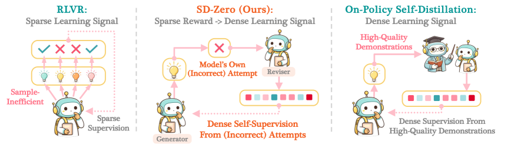
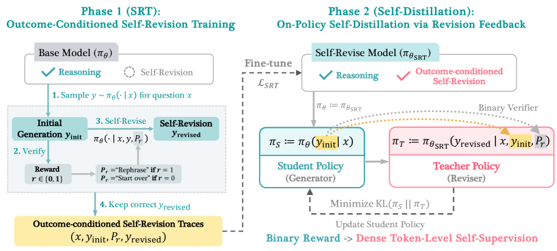
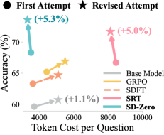
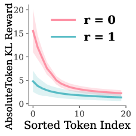
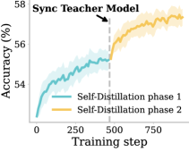
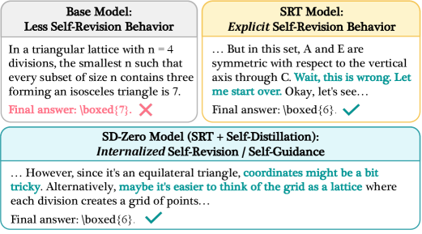

# Self-Distillation Zero: Self-Revision Turns Binary Rewards into Dense Supervision

**Authors:** Yinghui He, Simran Kaur, Adithya Bhaskar, Yongjin Yang, Jiarui Liu, Narutatsu Ri, Liam Fowl, Abhishek Panigrahi, Danqi Chen, Sanjeev Arora
**Institutions:** Princeton University, University of Toronto, Carnegie Mellon University
**Date:** April 13, 2026
**Paper:** [PDF](https://arxiv.org/abs/2604.12002)

---

## TL;DR

SD-Zero trains a single model to play two roles: a **generator** (produces answers) and a **reviser** (fixes wrong answers given the binary reward). The reviser then acts as a teacher, providing dense token-level supervision to the generator via on-policy self-distillation — effectively converting a sparse binary reward (right/wrong) into rich per-token feedback without any external teacher or gold solutions. On math and code benchmarks, SD-Zero improves Qwen3-4B by +10.5% and Olmo-3-7B by +10.4% over base models, outperforming GRPO, RFT, and SDFT under the same training budget.

---

## Key Figures

### Figure 1: SD-Zero High-Level Overview

The key idea in one picture: standard RL (RLVR) uses sparse binary rewards, distillation uses dense token-level supervision from an external teacher. SD-Zero gets the best of both — dense token-level self-supervision from only a binary reward, using the model's own revision capability as the "teacher."

### Figure 2: Full Pipeline Detail

Phase 1 (SRT): The base model generates answers, incorrect ones get a "start over" prompt, and the model revises them. Successful revisions become training data (6K traces). Phase 2 (Self-Distillation): The SRT model is frozen as a "teacher reviser." A student generator produces on-policy responses, the teacher conditions on those responses + binary reward, and the student minimizes KL divergence to the teacher's token distributions.

### Figure 3: Self-Revision Capability and Token Efficiency

SRT unlocks strong self-revision (+5.3% from revising its own answers) while the base model barely benefits (+1.1%). SD-Zero then produces responses that are 2x shorter than SRT while achieving higher accuracy — it has internalized the revision behavior into more direct, efficient generation.

### Figure 4: Token-Level KL Reward Distribution

The reviser's feedback is highly localized. For incorrect responses (r=0, pink), the KL divergence concentrates on a few tokens (the "mistake" tokens). For correct responses (r=1, blue), KL is flat and low (just rephrase, don't change much). This shows the reviser automatically identifies *which* tokens to fix from just a binary signal.

### Figure 6: Iterative Self-Evolution via Teacher Synchronization

After one epoch of self-distillation, performance plateaus (~54%). Synchronizing the teacher with the improved student and continuing training yields an immediate +3% jump with no signs of saturation. This suggests SD-Zero can iterate: each round of self-distillation improves the revision capability, which becomes a better teacher for the next round.

### Figure 7: Reasoning Evolution Across Training

Qualitative evolution: the base model has "late self-revision behavior" (long wrong attempts, then backtracking). After SRT, the model shows "explicit self-revision." After SD-Zero, the model has "internalized self-revision" — more proactive and concise reasoning with fewer dead-end explorations.

---

## Key Novel Ideas

### 1. Turning Binary Rewards into Dense Self-Supervision

The central insight: a model that can *revise* its own answers, conditioned on whether they were right or wrong, implicitly knows which tokens need fixing. This revision capability converts a binary reward into dense per-token supervision.

Concretely, the reviser sees: (question, initial attempt, binary reward) and produces revised token distributions. The KL divergence between the generator's distribution and the reviser's distribution at each token position acts as a dense reward signal — high KL at tokens that need changing, low KL at tokens that are fine.

The self-distillation loss:

$$\mathcal{L}_{\text{Self-Distillation}}(\theta) = \mathbb{E}_{(x,a) \sim \mathcal{D}} \mathbb{E}_{y \sim \pi_\theta(\cdot|x)} \sum_{t=1}^{|y|} D_{KL}(\pi_\theta(\cdot|x, y_{<t}) \| \pi_{\theta_{SRT}}(\cdot|x, y, P_r, y_{<t}))$$

The student (generator) π_θ produces a response y, the teacher (reviser) π_θ_SRT conditions on the *entire* response y plus the reward prompt P_r, and the student learns to match the teacher's token distributions.

### 2. Two-Phase Training: SRT then Self-Distillation

**Phase 1 — Self-Revision Training (SRT):** Train the model on 6K self-generated revision traces. For each question, sample multiple attempts, prompt the model to revise incorrect ones ("Wait, this response is not correct, let me start over.") and rephrase correct ones ("Let me rephrase the above solution."). Keep only successful revisions. The loss combines revision and generation objectives:

$$\mathcal{L}_{SRT}(\theta) = \mathcal{L}_{revision}(\theta) + \mathcal{L}_{generation}(\theta)$$

This teaches the model both to revise (conditioned on attempt + reward) and to generate (from scratch).

**Phase 2 — Self-Distillation:** Freeze the SRT model as teacher. The student generates on-policy, the teacher provides token-level revision feedback, and the student minimizes KL to internalize the revision behavior. This halves response length while improving accuracy.

Why two phases? SRT alone produces very long responses (the model learns to explicitly self-revise within its output). Self-distillation compresses this: the model learns to generate more "proactive" reasoning from the start, without needing explicit backtracking.

### 3. Token-Level Self-Localization

Even though the reviser only receives a binary reward (0 or 1), its token-level feedback is highly localized. For incorrect responses, the top 20 tokens by KL divergence capture most of the signal — these are the tokens where the reasoning went wrong. For correct responses, KL is uniformly low (just minor rephrasing).

This emergent property means the model automatically learns *where* mistakes happen, not just *that* they happened. It's a form of credit assignment that RL methods like GRPO struggle with.

### 4. Iterative Self-Evolution via Teacher Synchronization

Self-distillation also improves the model's revision capability (not just generation). After one epoch, the improved model can serve as a better teacher for the next round. Teacher synchronization yields +3% with no saturation, suggesting multiple rounds could stack gains.

This creates a virtuous cycle: better generation → better revision → better teaching → better generation.

---

## Training Pipeline

### Phase 1: Self-Revision Training (SRT)
- Sample 8 responses per question from base model (temperature 0.7)
- For incorrect responses: prompt model to revise ("Wait, this is not correct, let me start over")
- For correct responses: prompt model to rephrase ("Let me rephrase the above solution")
- Keep only traces where revision is correct → ~6K traces from 15K questions
- Fine-tune on combined revision + generation loss for 2 epochs

### Phase 2: Self-Distillation
- Freeze SRT model as teacher (reviser)
- Initialize student from SRT checkpoint
- For each question: student generates 1 response, verify with binary reward
- Teacher conditions on (question, student response, reward) to produce token distributions
- Student minimizes KL divergence to teacher at each token position
- Train for 1 epoch on 15K questions
- Optional: synchronize teacher with updated student and repeat

### Data
- **Math**: 15K competition/olympiad problems from OpenR1-Math
- **Code**: 7.5K C++ + 7.5K Python from Codeforces
- **Models**: Qwen3-4B-Instruct, Olmo-3-7B-Instruct
- **Evaluation**: avg@8 across 8 benchmarks (AIME24/25, HMMT25, AMOBench, OpenR1, MATH, Codeforces, LiveCodeBench)

---

## Key Results

### Main Results (avg@8 across 8 benchmarks)

| Method | Qwen3-4B Avg | Olmo-3-7B Avg |
|---|---|---|
| Base model | 49.8 | 41.1 |
| SFT (DeepSeek-R1 solutions) | 50.0 | 42.4 |
| RFT (filtered self-generations) | 54.3 | 46.7 |
| GRPO (binary reward) | 53.1 | 44.8 |
| SDFT (self-distillation w/ gold solutions) | 51.2 | 43.4 |
| SRT (Phase 1 only) | 57.6 | 50.3 |
| **SD-Zero (Phase 1 + 2)** | **60.3** | **51.5** |

### Selected Benchmark Highlights (Qwen3-4B)

| Benchmark | Base | GRPO | SD-Zero | Δ vs Base |
|---|---|---|---|---|
| AIME24 | 59.6 | 62.5 | **68.3** | +8.7 |
| AIME25 | 45.8 | 50.0 | **60.0** | +14.2 |
| HMMT25 | 26.7 | 30.4 | **45.4** | +18.7 |
| LiveCodeBench | 61.8 | 62.6 | **82.6** | +20.8 |

### Token Efficiency
- SRT model: ~4,500 tokens/question average
- SD-Zero model: ~2,200 tokens/question average (2x shorter)
- Base model: ~2,800 tokens/question average

---

## Key Takeaways

1. **Binary rewards contain more information than you'd think.** A model that can revise its own wrong answers (conditioned on knowing they're wrong) implicitly localizes errors at the token level. SD-Zero exploits this: the reviser's token distributions become a dense supervision signal from just a 0/1 reward.

2. **SRT alone (Phase 1) already beats all baselines.** Training on just 6K self-revision traces outperforms RFT (15K examples), GRPO (15K questions × multiple rollouts), and even SFT on DeepSeek-R1 gold solutions. The key is that revision traces pair incorrect attempts with corrections, teaching the model to learn from its own mistakes.

3. **Self-distillation halves response length while improving accuracy.** SRT produces long, meandering responses with explicit backtracking. Self-distillation compresses this into proactive, direct reasoning — the model internalizes "think before you write" rather than "write, then fix."

4. **Only 1 response per question needed in Phase 2.** GRPO needs groups of rollouts to estimate advantages. SD-Zero's self-distillation needs only a single on-policy response per question — the teacher provides dense token-level feedback on that single attempt. This makes it highly sample-efficient.

5. **No external teacher or gold solutions required.** Unlike SDFT (which needs high-quality demonstrations) or standard distillation (which needs a stronger model), SD-Zero uses only the model itself and binary rewards. This makes it applicable wherever you can verify correctness.

6. **Iterative self-evolution works and doesn't saturate.** After one epoch, syncing the teacher with the improved student gives +3% more with no signs of plateauing. This suggests SD-Zero could be run for multiple rounds, each building on the previous.

7. **Token-level self-localization is an emergent property.** The reviser isn't explicitly trained to identify mistake tokens. It learns this implicitly — incorrect responses get concentrated KL on a few critical tokens, correct responses get flat, low KL everywhere. This is a form of automatic credit assignment.

8. **Correctness filtering of revision traces matters.** Keeping only revisions that actually correct the answer (rather than all revision attempts) is important for SRT quality. Failed revision attempts would teach the model bad revision patterns.

9. **SD-Zero doesn't just sharpen the distribution.** Pass@8 also improves substantially, unlike GRPO which often improves pass@1 at the expense of diversity. SD-Zero genuinely improves the model's reasoning capability, not just its greedy output.

10. **The "rephrase correct answers" trick is subtle but important.** Training the reviser to also rephrase correct answers (producing shorter versions) helps the self-distillation phase produce more concise outputs, and prevents the reviser from always assuming the input is wrong.

---

## What's Open-Sourced

- **Not yet released** at time of publication. The paper does not mention any code or model releases, but the method is fully specified and reproducible from the paper.
