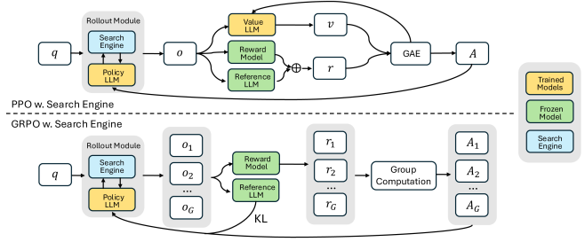
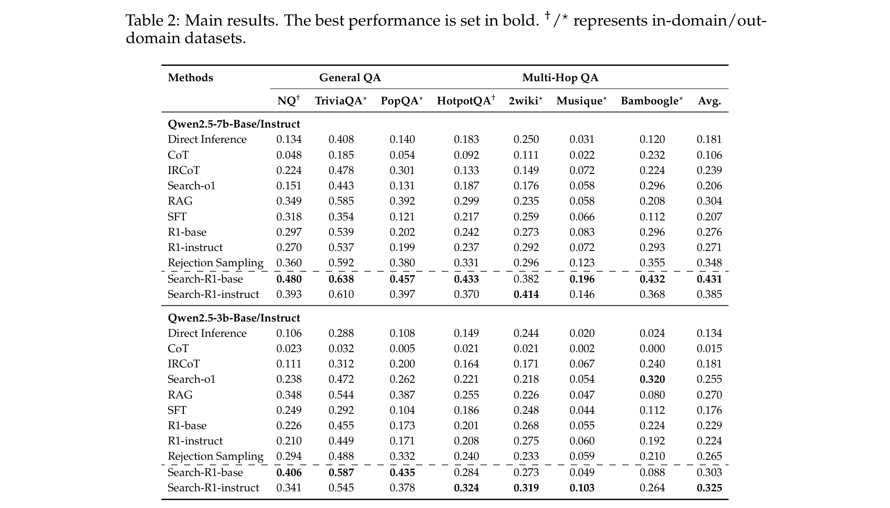
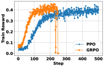
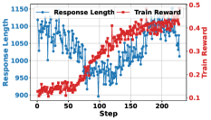
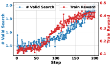
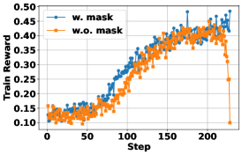

# Search-R1: Training LLMs to Reason and Leverage Search Engines with Reinforcement Learning

**Authors:** Bowen Jin, Hansi Zeng, Zhenrui Yue (UIUC), Jinsung Yoon, Sercan O. Arik (Google Cloud AI Research), Dong Wang (UIUC), Hamed Zamani (UMass Amherst), Jiawei Han (UIUC)
**Date:** March 12, 2025
**Venue:** COLM 2025
**Paper:** [PDF](https://arxiv.org/abs/2503.09516)
**Code:** [github.com/PeterGriffinJin/Search-R1](https://github.com/PeterGriffinJin/Search-R1) (4,585 GitHub stars)

---

## TL;DR

Search-R1 trains LLMs to autonomously issue search queries during step-by-step reasoning using only reinforcement learning (no supervised trajectories needed). The key trick is treating the search engine as part of the RL environment: the LLM generates reasoning + search queries, the environment executes the search and returns results, and a simple "was the final answer correct?" reward drives learning. With a critical innovation — masking retrieved tokens from the RL loss — Search-R1 improves Qwen2.5-7B by 24% and Qwen2.5-3B by 20% over RAG baselines on seven QA benchmarks.

---

## Key Figures

### Figure 1: Method Overview — PPO and GRPO with Search Engine

The top half shows PPO with a search engine: during rollout, the Policy LLM and Search Engine together produce an output sequence `o`. This goes to a Value LLM (for advantage estimation via GAE), a Reward Model (exact match on the final answer), and a Reference LLM (for KL regularization). The bottom half shows GRPO: instead of a value function, it samples G outputs per question and computes advantages from the relative rewards within each group. In both cases, the Search Engine is a frozen component of the environment — it's never trained, only queried.

### Table 2: Main Results on Seven QA Datasets

Search-R1 consistently outperforms all baselines across both in-domain (NQ, HotpotQA) and out-of-domain (TriviaQA, PopQA, 2Wiki, Musique, Bamboogle) datasets. The 7B model shows the largest gains. Search-R1-base on Qwen2.5-7B averages 0.432, versus 0.349 for the best non-RL baseline (RAG at 0.349). Even training from a base model (no instruction tuning) works.

### Figure 2a: PPO vs GRPO Training Dynamics

GRPO (orange) converges faster but collapses after ~270 steps. PPO (blue) is slower to start but remains stable throughout training. Both reach similar peak rewards (~0.45), but PPO is more reliable — an important practical finding for anyone implementing search-augmented RL.

### Figure 2c: Response Length Dynamics

A fascinating pattern: response length first *drops* sharply (steps 0-100) as the model learns to cut filler words, then *rises* (steps 100+) as it learns to call the search engine and incorporate retrieved passages. The reward (red) tracks the second phase closely — the model gets better precisely when it starts searching more.

### Figure 2d: Valid Search Calls Over Training

The model learns to call the search engine more frequently as training progresses. This is entirely emergent — no process reward or explicit "you should search" signal is given. The outcome reward alone is sufficient for the model to discover that searching leads to better answers.

### Figure 3: Retrieved Token Loss Masking Ablation (7B)

With loss masking (blue), training reward climbs steadily. Without masking (orange), training is noticeably less stable and reaches a lower final reward. This ablation validates that masking retrieved tokens from the policy gradient is critical for stable search-augmented RL.

---

## Key Novel Ideas

### 1. Search Engine as RL Environment

The central idea is to treat the search engine as part of the reinforcement learning *environment* rather than as a tool the model is *supervised* to use.

In standard RAG, you retrieve once based on the user query, prepend the results, and generate. In tool-use training (like Toolformer), you need supervised examples of correct search trajectories. Search-R1 does neither. Instead:

- The LLM generates tokens freely during rollout.
- When it generates `<search>query</search>`, the environment pauses generation, runs the search, and injects the results as `<information>...</information>`.
- The LLM resumes generating, now with retrieved context in its input.
- This can repeat up to B times (the "action budget," set to 4).
- At the end, only the final answer is checked for correctness.

The RL objective is:

$$\max_{\pi_\theta} \mathbb{E}_{x \sim \mathcal{D}, y \sim \pi_\theta(\cdot | x; \mathcal{R})} [r_\phi(x, y)] - \beta \mathbb{D}_{KL}[\pi_\theta(y|x;\mathcal{R}) || \pi_{ref}(y|x;\mathcal{R})]$$

where $\pi_\theta(\cdot|x;\mathcal{R})$ means the output is generated by both the LLM and the search engine $\mathcal{R}$ interleaved together. The key difference from standard RL for LLMs: the rollout sequence `y` contains both LLM-generated tokens and search-engine-provided tokens.

### 2. Retrieved Token Loss Masking

This is the most important technical contribution. In the rollout sequence, some tokens are generated by the LLM (reasoning, queries, answers) and some are injected by the search engine (retrieved passages). If you naively compute the policy gradient over *all* tokens, the optimizer tries to make the LLM better at "predicting" the retrieved passages — which makes no sense, since those tokens came from an external source.

Search-R1 introduces a masking indicator $I(y_t)$:
- $I(y_t) = 1$ if $y_t$ was generated by the LLM
- $I(y_t) = 0$ if $y_t$ was a retrieved token

The loss is computed only over LLM-generated tokens. This applies to:
- The policy gradient loss (PPO clipped objective or GRPO group objective)
- The KL divergence regularization term
- The normalization denominator

Ablations show this is not optional — without masking, training reward is lower and less stable (Table 4 shows consistent drops across all 7 benchmarks).

### 3. Multi-Turn Interleaved Reasoning and Search

The model doesn't just search once. It can do up to B rounds (default B=4) of:
1. **Think** (wrapped in `<think>...</think>`)
2. **Search** (wrapped in `<search>...</search>`)
3. **Read results** (wrapped in `<information>...</information>`)
4. **Think again** with new information
5. **Answer** (wrapped in `<answer>...</answer>`)

If the model produces an invalid action (neither a search call nor an answer), the system appends "My action is not correct. Let me rethink." — a simple self-correction nudge.

The model learns entirely through RL when to search, what to search for, and when it has enough information to answer. No demonstration trajectories are needed.

### 4. Outcome-Only Reward (No Process Supervision)

The reward is simply exact match between the predicted answer and the gold answer:

$$r_\phi(x, y) = EM(a_{pred}, a_{gold})$$

No format rewards, no search-quality rewards, no intermediate step rewards. This is surprising because it means the reward is extremely sparse — the model gets no signal about whether its search queries were good, whether it used the results well, or whether its reasoning was sound. It only knows if the final answer was right or wrong. Yet this is sufficient for the model to learn effective search behavior.

---

## Architecture Details

| Component | Choice |
|---|---|
| Base LLMs | Qwen2.5-3B, Qwen2.5-7B, Qwen2.5-14B (Base and Instruct variants) |
| RL algorithms | PPO (default), GRPO |
| Search engine / retriever | E5 embedding model over 2018 Wikipedia dump |
| Retrieved passages per query | 3 (top-k) |
| Max action budget (B) | 4 search calls per question |
| Max sequence length | 4,096 tokens |
| Max response length | 500 tokens |
| Max retrieved content length | 500 tokens per retrieval |
| Reward function | Exact match (binary: 0 or 1) |
| Training data | Merged NQ + HotpotQA training sets |
| Evaluation | 7 QA datasets (2 in-domain, 5 out-of-domain) |

### PPO Hyperparameters

| Parameter | Value |
|---|---|
| Policy LR | 1e-6 |
| Value LR | 1e-5 |
| Training steps | 500 |
| Policy warmup ratio | 0.285 |
| Value warmup ratio | 0.015 |
| GAE λ | 1.0 |
| GAE γ | 1.0 |
| Batch size | 512 |
| Mini-batch size | 256 |
| KL coefficient β | 0.001 |
| Clip ratio ε | 0.2 |

### GRPO Hyperparameters

| Parameter | Value |
|---|---|
| Group size G | 5 |
| KL coefficient β | 0.001 |
| Clip ratio ε | 0.2 |

---

## Training Pipeline

1. **Start with a pretrained LLM** (Qwen2.5-3B or 7B, either Base or Instruct variant).
2. **No SFT stage.** Search-R1 goes straight to RL, similar to DeepSeek-R1-Zero. The only "instruction" is the system template telling the model about the `<think>`, `<search>`, and `<answer>` tags.
3. **RL training for 500 steps** using PPO (or GRPO). Each step:
   - Sample a batch of questions from the merged NQ+HotpotQA training set.
   - Roll out the LLM with interleaved search (up to 4 search calls per question).
   - Compute exact-match reward on the final answer.
   - Compute policy gradient with retrieved token masking.
   - Update the policy LLM (and value LLM for PPO).
4. **Infrastructure:** 8x H100 GPUs on a single node. vLLM for efficient rollouts. FSDP with CPU offloading and gradient checkpointing for memory efficiency.
5. **Checkpoint selection:** Save every 100 steps. If training diverges (GRPO is prone to this), use the last stable checkpoint. Otherwise, use the final checkpoint.

---

## Key Results

### Main Results (Table 2) — Qwen2.5-7B

| Method | NQ | TriviaQA | PopQA | HotpotQA | 2Wiki | Musique | Bamboogle | Avg |
|---|---|---|---|---|---|---|---|---|
| Direct Inference | 0.134 | 0.408 | 0.140 | 0.163 | 0.250 | 0.031 | 0.180 | 0.181 |
| CoT | 0.098 | 0.185 | 0.066 | 0.092 | 0.111 | 0.023 | 0.120 | 0.126 |
| RAG | 0.349 | 0.354 | 0.121 | 0.217 | 0.339 | 0.066 | 0.112 | 0.237 |
| SFT | 0.318 | 0.354 | 0.121 | 0.217 | 0.339 | 0.066 | 0.112 | 0.237 |
| R1-base (no search) | 0.267 | 0.378 | 0.202 | 0.242 | 0.273 | 0.083 | 0.176 | 0.231 |
| R1-instruct (no search) | 0.270 | 0.537 | 0.199 | 0.217 | 0.292 | 0.072 | 0.069 | 0.271 |
| Rejection Sampling | 0.340 | 0.592 | 0.380 | 0.331 | 0.296 | 0.123 | 0.575 | 0.348 |
| **Search-R1-base** | **0.400** | 0.456 | **0.487** | **0.433** | **0.382** | **0.186** | **0.432** | **0.431** |
| **Search-R1-instruct** | 0.393 | **0.610** | 0.397 | 0.370 | **0.414** | 0.146 | 0.368 | 0.385 |

### Main Results — Qwen2.5-3B

| Method | NQ | TriviaQA | PopQA | HotpotQA | 2Wiki | Musique | Bamboogle | Avg |
|---|---|---|---|---|---|---|---|---|
| RAG | 0.348 | 0.344 | 0.307 | 0.235 | 0.146 | 0.044 | 0.112 | 0.219 |
| R1-base (no search) | 0.210 | 0.449 | 0.173 | 0.194 | 0.275 | 0.060 | 0.142 | 0.214 |
| **Search-R1-base** | **0.404** | **0.547** | **0.435** | **0.324** | **0.339** | **0.100** | **0.368** | **0.360** |
| **Search-R1-instruct** | 0.341 | 0.545 | 0.379 | 0.424 | 0.325 | 0.089 | 0.268 | 0.339 |

### PPO vs GRPO (Table 3)

| Method | NQ | TriviaQA | PopQA | HotpotQA | 2Wiki | Musique | Bamboogle | Avg |
|---|---|---|---|---|---|---|---|---|
| 7B-base PPO | **0.400** | 0.456 | **0.487** | **0.433** | 0.382 | **0.186** | 0.432 | **0.397** |
| 7B-base GRPO | 0.380 | **0.503** | 0.385 | 0.410 | **0.410** | 0.146 | **0.456** | 0.384 |
| 7B-instruct PPO | **0.393** | **0.610** | **0.397** | 0.370 | **0.414** | **0.146** | 0.368 | **0.385** |
| 7B-instruct GRPO | 0.370 | 0.582 | 0.363 | **0.380** | 0.367 | 0.121 | **0.384** | 0.367 |

PPO slightly outperforms GRPO on average and is more stable, despite GRPO converging faster.

---

## Key Takeaways

1. **RL alone can teach LLMs to search effectively.** No supervised search trajectories, no demonstrations, no process rewards. A binary "right/wrong" outcome reward is enough for the model to learn when to search, what queries to issue, and how to use the results. This is a strong extension of the DeepSeek-R1-Zero finding to the tool-use domain.

2. **Retrieved token masking is essential, not optional.** Without masking, the RL optimizer tries to increase the probability of retrieved tokens under the policy — tokens the model didn't generate and can't control. This destabilizes training and consistently hurts final performance across all 7 datasets.

3. **PPO beats GRPO for stability in search-augmented RL.** GRPO converges faster (no critic warm-up) but collapses after extended training. PPO is slower but stable. For practitioners: if you can afford the extra value function, PPO is the safer choice here.

4. **Base models catch up to instruct models under RL.** Instruct models start higher and converge faster, but after 500 steps of RL training, base models reach comparable final performance. This means instruction tuning is a useful initialization but not a requirement for search-augmented reasoning.

5. **Larger models benefit more from learning to search.** The 7B model shows a much larger performance gap over baselines than the 3B model. The paper also reports 14B results (Appendix C) showing further gains. Learning to effectively leverage retrieved information appears to be a capability that scales with model size.

6. **Response length dynamics reveal a two-phase learning process.** Phase 1 (first ~100 steps): the model gets shorter as it cuts filler. Phase 2 (after ~100 steps): the model gets longer as it learns to search and incorporate results. This "compress then expand" pattern is a useful diagnostic for whether search behavior is emerging.

7. **Top-k=3 retrieved passages is the sweet spot.** Top-k=1 has low recall (missing information), top-k=5 introduces noise that both hurts inference quality and discourages the model from trusting retrieved content during RL training.

8. **Out-of-domain generalization is strong.** Training only on NQ + HotpotQA, Search-R1 improves on 5 completely unseen datasets (TriviaQA, PopQA, 2WikiMultiHopQA, Musique, Bamboogle). The search skill transfers across QA domains.

9. **The framework is modular and RL-algorithm-agnostic.** Both PPO and GRPO work with the same search-engine-in-the-loop architecture. The retrieved token masking applies identically to both. This means future RL algorithms can be plugged in without rearchitecting the system.

10. **Search-R1 beats rejection sampling by a large margin.** Rejection sampling (generate 5 candidates with search, keep the ones that are correct, fine-tune on them) is a strong SFT-based baseline. Search-R1 still outperforms it by 24% (7B) on average, showing that on-policy RL exploration finds better strategies than distilling from fixed trajectories.

---

## What's Open-Sourced

- **Code:** Full training and evaluation code at [github.com/PeterGriffinJin/Search-R1](https://github.com/PeterGriffinJin/Search-R1) (4,585 stars)
- **Model checkpoints:** Available (mentioned in abstract; hosted on the GitHub repo)
- **Training data:** Uses publicly available datasets (NQ, HotpotQA) and Wikipedia 2018 dump
- **Retriever:** Uses the publicly available E5 embedding model
