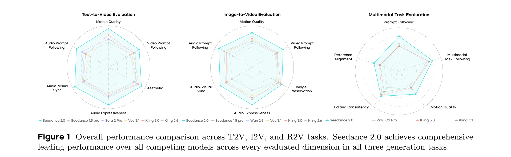
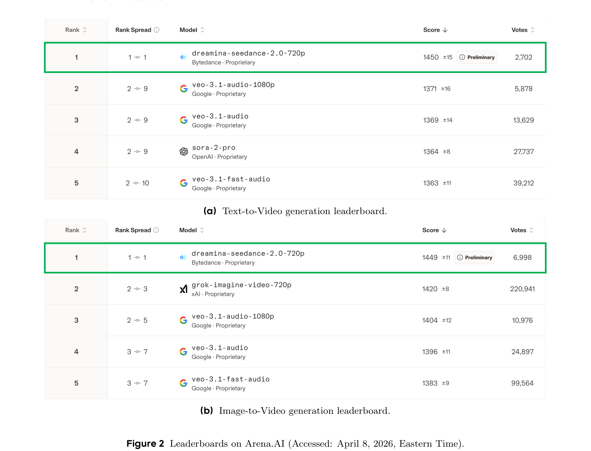
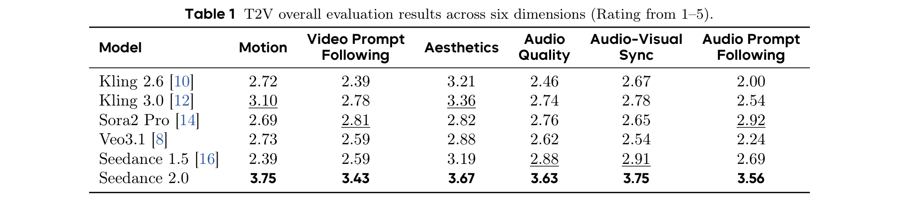
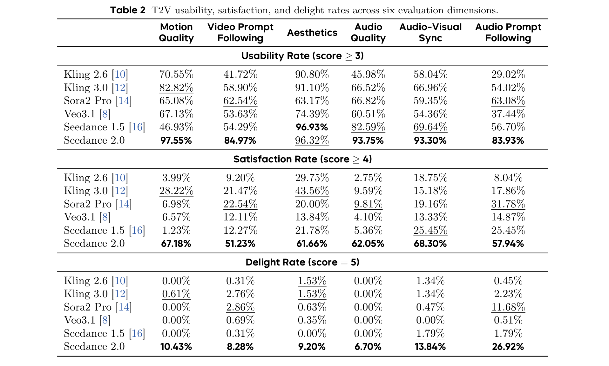
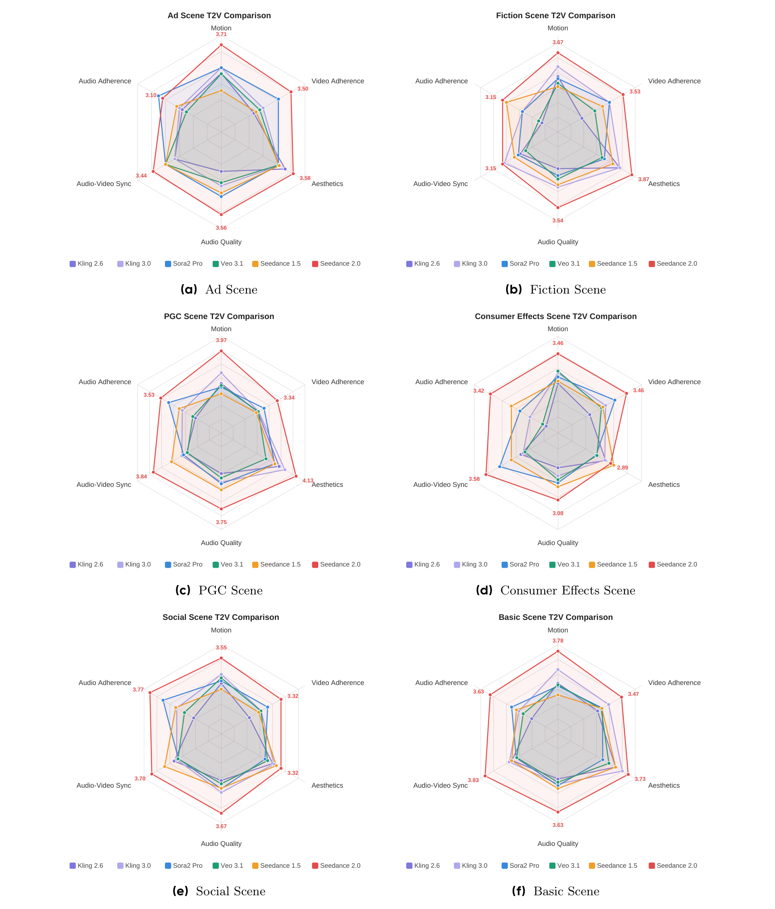
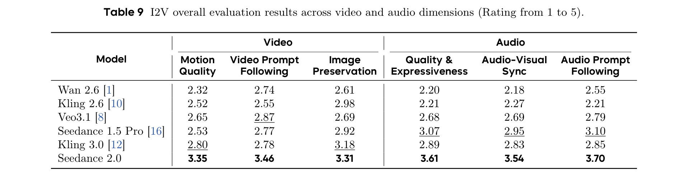
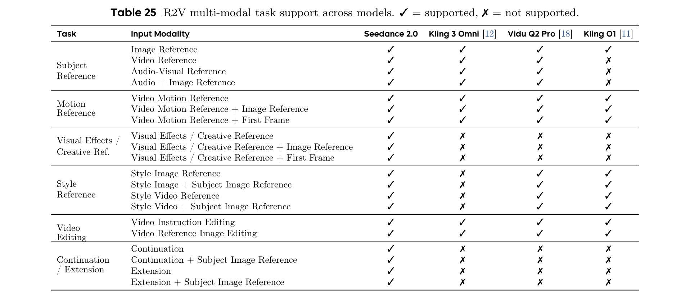
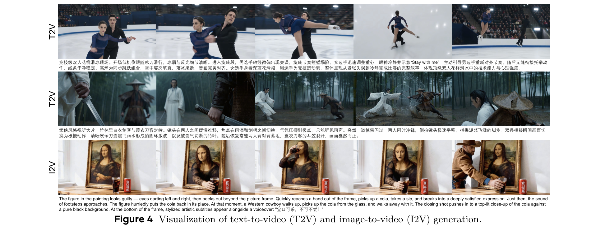

# Seedance 2.0: Advancing Video Generation for World Complexity

- **Authors**: Team Seedance (ByteDance Seed) -- 149+ contributors
- **Date**: April 15, 2026
- **Link**: [arxiv.org/abs/2604.14148](https://arxiv.org/abs/2604.14148)
- **Available at**: [Doubao](https://www.doubao.com/chat/create-video), [Jimeng](https://jimeng.jianying.com/ai-tool/video/generate), [Volcano Engine](https://www.volcengine.com/experience/ark?mode=vision&modelId=doubao-seedance-2-0-260128&tab=GenVideo)

---

## TL;DR

Seedance 2.0 is ByteDance's native multi-modal audio-video generation model. It accepts text, image, video, and audio inputs and generates 4-15 second videos at 480p/720p with synchronized binaural audio. It ranks #1 on both the Arena.AI Text-to-Video and Image-to-Video leaderboards (Elo 1450/1449), and leads across all six evaluation dimensions (motion quality, prompt following, aesthetics, audio quality, audio-visual sync, audio prompt following) on their internal SeedVideoBench 2.0, beating Kling 3.0, Sora 2 Pro, Veo 3.1, and Seedance 1.5.

---

## Key Figures

### Figure 1: Overall Performance Radar Charts (T2V, I2V, R2V)

Seedance 2.0 (red line) forms the outermost polygon on all three radar charts -- Text-to-Video, Image-to-Video, and Multimodal Task (Reference-to-Video). Every competing model (Seedance 1.5 Pro, Sora 2 Pro, Veo 3.1, Kling 3.0, Kling 2.6) is enclosed within its contour. The gap is most pronounced on audio dimensions, where competitors cluster near the center.

### Figure 2: Arena.AI Leaderboards

Seedance 2.0 ranks #1 on both Arena.AI leaderboards (accessed April 8, 2026). On Text-to-Video, its Elo score is 1450 (+/-15), leading second-place Veo 3.1-audio-1080p by 79 points. On Image-to-Video, its Elo is 1449 (+/-11), leading grok-imagine-video-720p by 29 points. Notably it achieves this at only 720p resolution, beating 1080p competitors. The Rank Spread of 1-1 on both boards indicates consistently top-ranked performance.

### Table 1: T2V Overall Results

Seedance 2.0 scores first on all six dimensions. The biggest absolute score is 3.75 on Motion Quality and Audio-Visual Sync. The average improvement over Seedance 1.5 is +0.86 points. The model is the only one above 3.4 on every dimension, and the only one above 3.5 on all audio dimensions.

### Table 2: T2V Usability, Satisfaction, and Delight Rates

This table reveals the practical quality gap. At the "usable" threshold (score >= 3), Seedance 2.0 reaches 97.55% on motion quality. At "satisfaction" (score >= 4), it hits 67.18% on motion vs. the next-best 28.22% (Kling 3.0). At the "delight" level (score = 5), Seedance 2.0 produces 10.43% delightful motion outputs, while no competitor exceeds 0.61%. On audio prompt following delight, Seedance 2.0 reaches 26.92% vs. 11.68% for Sora 2 Pro.

### Figure 3: T2V Performance Across Six Scenarios

Seedance 2.0 leads across all six production scenarios. The advantage is most consistent in PGC (professional-generated content) scenes where aesthetics reaches 4.13 and motion 3.97. The model is strong even in challenging Consumer Effects scenes where motion (3.46) and audio adherence (3.42) stay competitive. The Social and Basic scene charts show the most balanced profiles.

### Table 9: I2V Overall Results

On Image-to-Video, Seedance 2.0 ranks first on all six dimensions, scoring 3.31-3.70. No competitor exceeds 3.18 on any dimension. Audio prompt following (3.70) is Seedance 2.0's highest I2V score. The three video dimensions cluster at 3.31-3.46. The gap is widest on audio quality & expressiveness: 3.61 vs. the runner-up's 3.07 (Seedance 1.5 Pro).

### Table 25: R2V Multi-Modal Task Support

Seedance 2.0 supports 20 of 22 input modality combinations -- the broadest of any model. Seven tasks are exclusive to Seedance 2.0: all three visual effects / creative reference variants, and all four continuation / extension variants. Kling 3 Omni supports 9/22, Vidu Q2 Pro 13/22, and Kling O1 only 10/22.

### Figure 4: Visualization Examples

Row 1 (T2V): Figure skating scene with synchronized take-offs, mid-air rotations, and precise landings -- demonstrating physically plausible complex human motion. Row 2 (T2V): Wuxia-style cinematic sequence with dynamic swordplay in bamboo forest, showing multi-shot narrative capability. Row 3 (I2V): Mona Lisa animation from a reference painting -- the figure reaches out of the frame, picks up a cola, drinks it -- demonstrating creative image-to-video generation with object interaction.

---

## Key Novel Ideas

### 1. Native Multi-Modal Audio-Video Joint Generation
Seedance 2.0 is described as a "native multi-modal audio-video generation model." Unlike systems that generate video first and add audio separately, this model jointly generates synchronized video and audio from a unified architecture. It accepts four input modalities simultaneously: text, image, video, and audio. This allows it to produce binaural (dual-channel) audio with precise temporal alignment to visual actions.

### 2. Unified Architecture for All Modalities
The model uses "a unified, highly efficient, and large-scale architecture for multi-modal audio-video joint generation." Rather than separate models for T2V, I2V, and R2V tasks, a single architecture handles all generation modes including:
- Text-to-Video (T2V)
- Image-to-Video (I2V)
- Reference-to-Video (R2V) with 20 of 22 modality combinations
- Video editing, continuation, and extension

### 3. SeedVideoBench 2.0 Evaluation Framework
The paper introduces an upgraded evaluation methodology that goes beyond traditional metrics like FVD or CLIPScore. The benchmark splits evaluation into:
- **Objective track**: Automated pipelines for motion stability
- **Subjective track**: Blind expert review for aesthetics
- **Realism study**: Evaluators distinguish AI output from real video

It adds three new evaluation axes:
- **Multimodal Task Following**: Measures instruction-following accuracy across reference, editing, extension, and combination scenarios with dozens of fine-grained task types
- **Narrative Quality**: Evaluates cinematographic language, plot design, and stylistic aesthetics
- **Consistency**: Captures reference alignment and editing consistency

### 4. Binaural Audio with Multi-Track Output
The audio generation module produces simultaneous multi-track output: background audio, ambient sound effects, and character narration -- all with precise temporal alignment to the visual rhythm. It supports binaural (stereo) sound, which is unusual for video generation models. The model handles Chinese dialects (Sichuan, Northeastern, Cantonese), opera, singing, rap, and multilingual speech.

### 5. Seedance 2.0 Fast
An accelerated variant designed for low-latency scenarios. The paper mentions it but does not provide detailed architecture or latency numbers.

---

## Architecture Details

The paper is primarily an evaluation and capability report. It does **not** disclose detailed architecture, model size, training methodology, or loss functions. Key known facts:

- **Output resolution**: 480p and 720p natively
- **Duration**: 4 to 15 seconds of audio-video
- **Multi-modal inputs**: Up to 3 video clips, 9 images, and 3 audio clips as reference
- **Model ID**: doubao-seedance-2-0-260128
- **Release date**: Early February 2026 (in China)
- **Predecessor**: Seedance 1.0, 1.5 Pro (joint audio-video generation foundation)

The paper references the broader ByteDance Seed ecosystem:
- Seedance video generation series
- Seedream image generation and editing series
- Seed-VL multimodal vision-language models
- Mogao (omni foundation model for interleaved multi-modal generation)
- Rewarddance (reward scaling in visual generation)
- Dancegrpo (group policy optimization for visual generation)

---

## Training Pipeline

**Not disclosed.** The paper focuses entirely on evaluation results and capabilities. No training details, data composition, loss functions, or compute requirements are provided. The paper references several prior ByteDance works on reward-based training (Rewarddance, Dancegrpo) that may inform the training approach, but does not confirm their use.

---

## Key Results

### Arena.AI Rankings (April 8, 2026)
| Task | Rank | Elo Score | Lead over #2 |
|------|------|-----------|-------------|
| Text-to-Video | #1 | 1450 (+/-15) | +79 over Veo 3.1-audio-1080p |
| Image-to-Video | #1 | 1449 (+/-11) | +29 over grok-imagine-video-720p |

### T2V Overall Evaluation (SeedVideoBench 2.0, 1-5 scale)
| Model | Motion | Video Prompt Following | Aesthetics | Audio Quality | Audio-Visual Sync | Audio Prompt Following |
|-------|--------|----------------------|------------|---------------|-------------------|---------------------|
| Kling 2.6 | 2.72 | 2.39 | 3.21 | 2.46 | 2.67 | 2.00 |
| Kling 3.0 | 3.10 | 2.78 | 3.36 | 2.74 | 2.78 | 2.54 |
| Sora 2 Pro | 2.69 | 2.81 | 2.82 | 2.76 | 2.65 | 2.92 |
| Veo 3.1 | 2.73 | 2.59 | 2.88 | 2.62 | 2.54 | 2.24 |
| Seedance 1.5 | 2.39 | 2.59 | 3.19 | 2.88 | 2.91 | 2.69 |
| **Seedance 2.0** | **3.75** | **3.43** | **3.67** | **3.63** | **3.75** | **3.56** |

Seedance 2.0 is the only model above 3.4 on every dimension. Average improvement over Seedance 1.5: +0.86 points.

### T2V Fine-Grained Motion Quality
- Ranks first on 29 of 30 fine-grained categories (scoring 3.29-4.43)
- Top scores: Multi-entity feature match (4.43), Framing/Composition (4.25), Editing Rhythm (4.21)
- Biggest improvement over Seedance 1.5: Physical feedback (+1.77), Natural phenomena (+1.78), Intense sports motion (+1.79)

### T2V Usability Rates (score >= 3)
| Dimension | Seedance 2.0 | Best Competitor |
|-----------|-------------|----------------|
| Motion Quality | 97.55% | 82.82% (Kling 3.0) |
| Audio Quality | 93.75% | 96.93% (Seedance 1.5) |
| Audio Prompt Following | 83.93% | 63.08% (Sora 2 Pro) |

### I2V Overall Evaluation (1-5 scale)
| Model | Motion Quality | Video Prompt Following | Image Preservation | Audio Quality & Expressiveness | Audio-Visual Sync | Audio Prompt Following |
|-------|---------------|----------------------|-------------------|-------------------------------|-------------------|---------------------|
| **Seedance 2.0** | **3.35** | **3.46** | **3.31** | **3.61** | **3.54** | **3.70** |
| Kling 3.0 | 2.80 | 2.78 | 3.18 | 2.89 | 2.83 | 2.85 |
| Seedance 1.5 Pro | 2.53 | 2.77 | 2.92 | 3.07 | 2.95 | 3.10 |

### R2V Overall Evaluation
| Model | Multimodal Task Following (1-3) | Editing Consistency (1-5) | Reference Alignment (1-5) | Motion Quality (1-5) | Prompt Following (1-5) |
|-------|-------------------------------|-------------------------|-------------------------|---------------------|---------------------|
| **Seedance 2.0** | **2.50** | **3.54** | **3.03** | **3.24** | **2.52** |
| Kling 3.0 | 2.32 | 3.37 | 2.37 | 2.36 | 1.95 |
| Vidu Q2 Pro | 2.13 | 2.29 | 1.79 | 2.38 | 2.08 |

### R2V Task Support
- Seedance 2.0: 20/22 modality combinations supported
- 7 tasks exclusive to Seedance 2.0 (visual effects/creative reference + continuation/extension variants)
- Only model supporting video continuation

---

## Key Takeaways

1. **First joint audio-video model to top Arena.AI on both T2V and I2V.** Seedance 2.0 ranks #1 with Elo scores of 1450 and 1449 respectively, at only 720p resolution, beating competitors running at 1080p. This suggests motion dynamics and audio-visual coherence matter more to users than raw resolution.

2. **Audio is the decisive differentiator.** On T2V, competitors struggle most on audio dimensions -- most stay below 2.9 while Seedance 2.0 exceeds 3.5 on all three audio metrics. The audio prompt following delight rate (26.92%) is 2.3x the next-best model (Sora 2 Pro at 11.68%). Binaural multi-track audio generation is a genuine step beyond what competitors offer.

3. **Massive improvement in motion quality over predecessors.** Seedance 1.5 scored poorly on physical feedback (1.69) and natural phenomena (2.00). Seedance 2.0 jumps to 3.46 and 3.78 respectively -- roughly doubling these scores. Motion stability and physics compliance are now competitive with real-world footage in many scenarios.

4. **Broadest multi-modal task coverage in the industry.** With 20/22 supported input modality combinations and 7 exclusive tasks (visual effects reference, creative reference, continuation, extension), Seedance 2.0 is the most versatile reference-based video generation model evaluated.

5. **Video continuation and extension are still early.** Video continuation is only supported by Seedance 2.0, and video extension is its weakest R2V task (1.93 task following vs. 2.78 for Veo 3.1). Issues remain with color consistency, multi-subject omission, and subject duplication during continuation.

6. **No architecture or training details disclosed.** This is fundamentally an evaluation paper. There are no model sizes, architecture diagrams, loss functions, training data descriptions, or compute requirements. The technical recipe remains proprietary.

7. **SeedVideoBench 2.0 is a serious evaluation framework.** The benchmark combines objective automated metrics, blind subjective expert review, and realism studies. It covers 30 fine-grained categories per dimension across 6 production scenarios. The three-tier rating system (usability/satisfaction/delight) provides more nuanced quality assessment than simple mean scores.

8. **Text rendering and creative text are improved but still challenging.** Creative text scores went from 1.86 to 3.43, and short text from 2.00 to 3.57. These are large improvements, but text generation in video remains imperfect across all models -- no competitor exceeds 3.0 on creative text.

9. **Chinese language audio is a particular strength.** Chinese dialect/accent, conversation, variety show voice, and opera are all among the top audio subcategories. The model handles Sichuan, Northeastern, and Cantonese dialects accurately. For non-Chinese languages, Spanish (AQ 4.14) and English (AQ 4.00) lead.

10. **Safety is acknowledged but not detailed.** The paper mentions a "structured safety assessment framework" but provides no specifics on red-teaming, content filtering, watermarking, or bias mitigation.

---

## What's Open-Sourced

**Nothing.** No model weights, code, training data, or evaluation benchmark code is released. The model is available as a proprietary service through:
- Doubao (doubao.com/chat/create-video)
- Jimeng (jimeng.jianying.com/ai-tool/video/generate)
- Volcano Engine API (model ID: doubao-seedance-2-0-260128)

The evaluation benchmark (SeedVideoBench 2.0) is also not publicly released.
