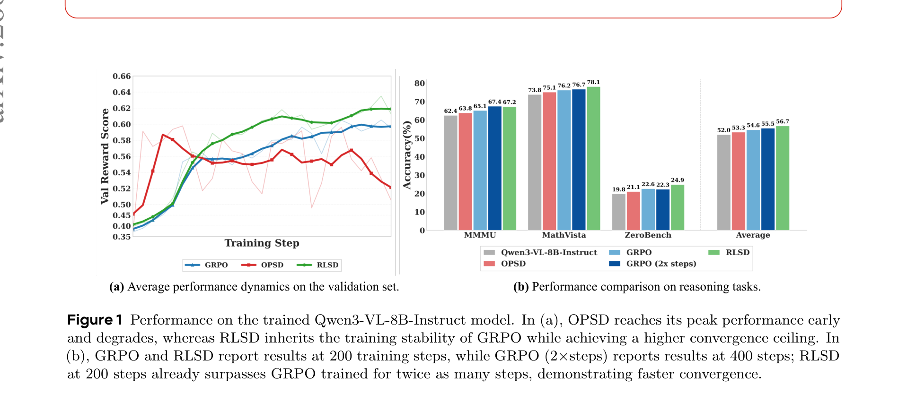
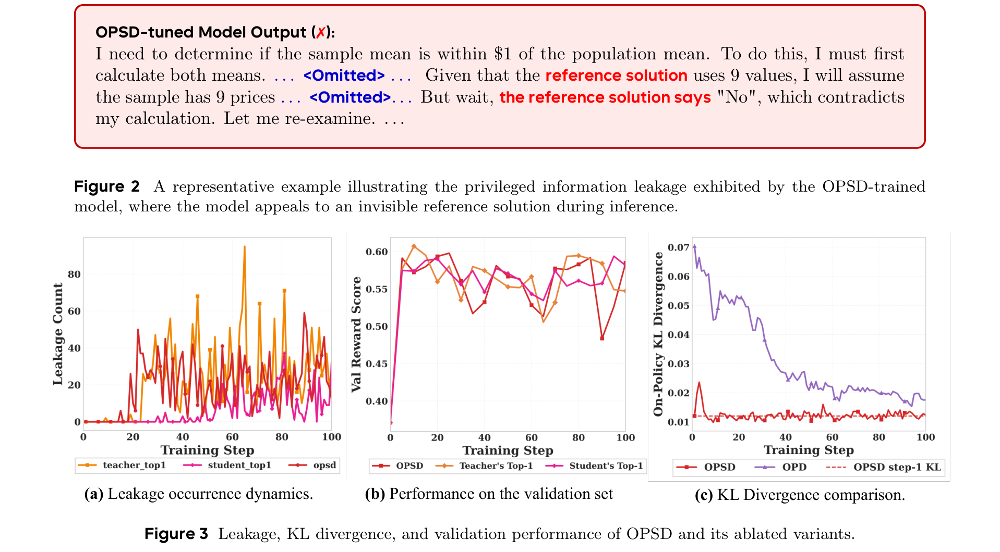
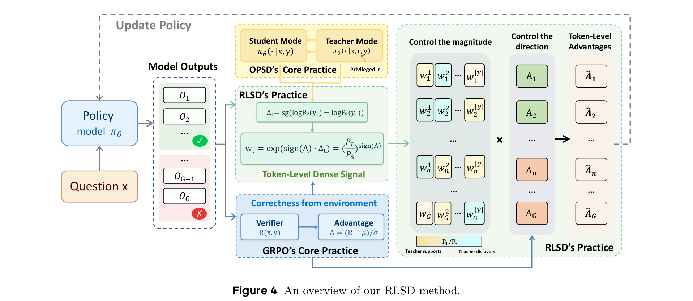
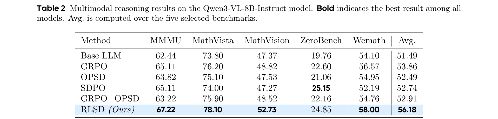
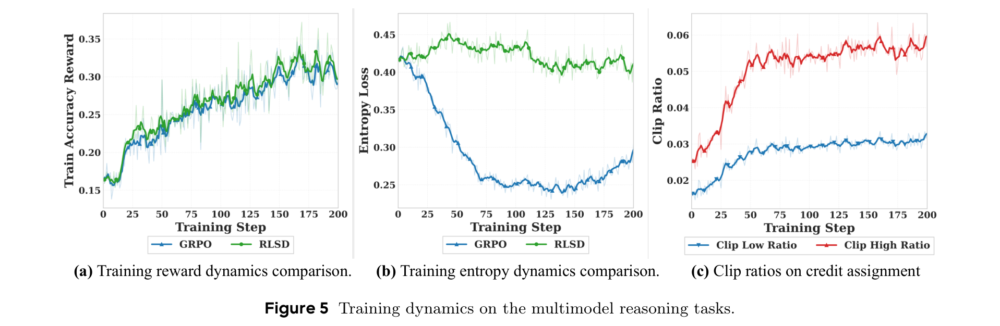
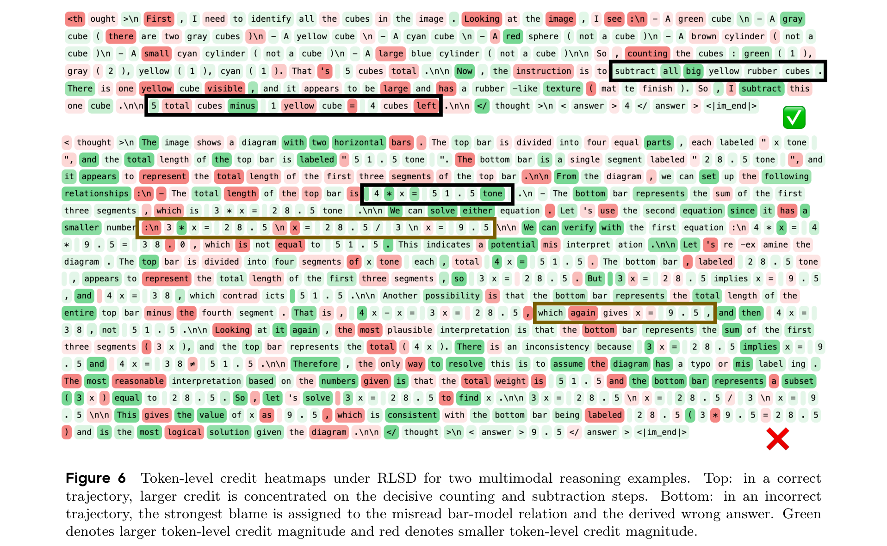

# Self-Distilled RLVR

**Authors:** Chenxu Yang, Chuanyu Qin, Qingyi Si, Minghui Chen, Naibin Gu, Dingyu Yao, Zheng Lin, Weiping Wang, Jiaqi Wang, Nan Duan
**Affiliations:** Chinese Academy of Sciences, JD.COM
**Date:** April 3, 2026
**Paper:** [PDF](https://arxiv.org/pdf/2604.03128)

---

## TL;DR

GRPO (the standard RL method for training reasoning models) gives every token in a response the same reward — it can't tell which tokens were the crucial reasoning steps and which were filler. On-policy self-distillation (OPSD) tries to fix this by having the model act as its own teacher (conditioned on privileged info like the answer), but this causes **information leakage** — the model starts referencing answers it shouldn't have access to, and performance collapses after initial gains. RLSD fixes both problems by splitting the job: the environment reward (correct/incorrect) controls the **direction** of each update (reinforce or penalize), while the self-distillation signal controls the **magnitude** (which tokens get more credit). On Qwen3-VL-8B-Instruct, RLSD beats GRPO by 2.32% and the base model by 4.69% across five multimodal reasoning benchmarks.

---

## Key Figures

### Figure 1: Performance Overview

Left: validation reward over training. OPSD (red) peaks early then degrades — the classic "early gains, late collapse" pattern. GRPO (blue) is stable but converges to a lower ceiling. RLSD (green) inherits GRPO's stability while reaching a higher ceiling. Right: benchmark comparison. RLSD (red bars) leads on all five benchmarks, with the largest gains on MathVista (+1.9%) and MathVision (+3.91%) where fine-grained token-level credit matters most.

### Figures 2-3: Why OPSD Fails — Leakage Diagnostics

Top: an actual model output after OPSD training where the model says "Given that the reference solution uses 9 values" and "the reference solution says No" — referencing an invisible answer it shouldn't know about. Bottom-left: leakage frequency increases monotonically over training. Bottom-middle: validation performance peaks at step ~15 then collapses, matching the leakage onset. Bottom-right: KL divergence between teacher and student stagnates under OPSD but steadily decreases under OPD, confirming there's an irreducible gap the student can never close.

### Figure 4: RLSD Architecture

The key diagram. The model runs in two modes: "student" (sees question only) and "teacher" (sees question + privileged answer). RLSD computes the log-probability difference $\Delta_t$ between teacher and student for each token (the "evidence ratio"). The environment verifier provides a binary correct/incorrect signal, which becomes the sequence-level advantage $A$. The per-token advantage is then $\hat{A}_t = A \cdot \text{clip}(w_t)$ where $w_t = (P_T/P_S)^{\text{sign}(A)}$. The direction (reinforce or penalize) comes from the environment; the magnitude (how much credit each token gets) comes from the teacher-student discrepancy.

### Table 2: Main Results

RLSD achieves 56.18% average accuracy across five multimodal benchmarks (4K setting), outperforming GRPO (53.86%), OPSD (52.49%), SDPO (52.74%), and GRPO+OPSD (52.91%). The base model scores 51.49%. RLSD is the only method that improves on every single benchmark compared to GRPO.

### Figure 5: Training Dynamics

Left: RLSD (green) reaches higher training reward than GRPO (blue) and converges faster. Middle: GRPO suffers rapid entropy collapse (the model becomes overly confident too fast), while RLSD maintains higher entropy by selectively strengthening critical tokens instead of uniformly suppressing alternatives. Right: the credit clipping mechanism is actively engaged, with clip ratios stabilizing around 3-6%.

### Figure 6: Token-Level Credit Heatmaps

Two real examples showing how RLSD redistributes credit. Top (correct answer): green = high credit. The model assigns the most credit to the decisive counting step ("5 cubes total") and the subtraction step ("I subtract this one cube"), not the generic narration ("Looking at the image, I see..."). Bottom (wrong answer): red = high blame. The model concentrates blame on the specific misread ("3x = 28.5") and the wrong conclusion ("x = 9.5"), while neutral setup tokens get small penalties.

---

## Key Novel Ideas

### 1. Why Self-Distillation Fails: The Information Asymmetry Problem

The paper's most important contribution is explaining *why* on-policy self-distillation (OPSD) breaks down. The explanation is clean and formal.

In OPSD, the same model plays two roles:
- **Student**: sees only the question $x$, produces $P_S(\cdot \mid x, y_{<t})$
- **Teacher**: sees the question $x$ AND a reference answer $r$, produces $P_T(\cdot \mid x, r, y_{<t})$

The training objective is: make the student's distribution match the teacher's distribution. But here's the fundamental problem: **the teacher's distribution depends on $r$, which the student can never see at test time.**

Theorem 1 (KL Decomposition) formalizes this:

$$\mathcal{L}_\text{OPSD} = \mathcal{L}^* + I(Y_t; R \mid X, Y_{<t})$$

where $\mathcal{L}^*$ is the ideal objective (matching the *marginal* teacher distribution averaged over all possible $r$) and $I(Y_t; R \mid X, Y_{<t})$ is the conditional mutual information between the current token and the privileged information.

In plain English: the OPSD loss contains an irreducible gap $I(Y_t; R \mid X, Y_{<t}) > 0$ that the student can never eliminate, no matter how much it trains. This gap is determined entirely by the teacher's distributions and is independent of the student's parameters $\theta$.

What happens in practice: the optimizer keeps trying to minimize this loss, and the only way the student can reduce the gap is by encoding $x \to r$ correlations into its parameters — effectively memorizing which answers go with which questions. This is the mathematical origin of the "privileged information leakage" shown in Figure 2.

### 2. Two-Phase Training Collapse

The paper identifies a precise two-phase dynamic that explains OPSD's "early gains, late collapse":

**Phase 1 (beneficial):** Early in training, the student $P_S$ is far from the teacher's marginal $\bar{P}_T$. The gradient is dominated by the beneficial component $g^*(\theta)$ that drives marginal matching. The student rapidly improves.

**Phase 2 (pathological):** As $P_S$ approaches $\bar{P}_T$, the beneficial component $\|g^*\|$ shrinks toward zero. But the deviation component $\|\delta(\theta; r)\|$ — the part that encodes $x \to r$ correlations — remains bounded away from zero (its variance is proportional to $I(Y_t; R \mid X, Y_{<t})$, which is $\theta$-independent). So the deviation *dominates*, driving the model to memorize privileged information rather than learn genuine reasoning.

Formally (Proposition 1): the per-sample gradient decomposes as

$$g(\theta; r) = \underbrace{g^*(\theta)}_{\text{marginal matching}} + \underbrace{\delta(\theta; r)}_{\text{r-specific deviation}}$$

where $\mathbb{E}_r[\delta] = 0$ but $\mathbb{E}_r[\|\delta\|^2] = \sum_v \text{Var}_r[P_T(v \mid r)] \cdot \|\nabla_\theta \log P_S(v)\|^2 > 0$.

### 3. The RLSD Fix: Direction from Environment, Magnitude from Teacher

RLSD's key insight: **the directional signal and the magnitude signal have asymmetric requirements.** The direction (should we reinforce or penalize this trajectory?) must be reliable — a wrong direction actively harms the model. The magnitude (how much credit does each token deserve?) benefits from being dense and fine-grained, even if slightly noisy.

RLSD separates these:

**Direction**: comes from the environment reward $R(x, y) \in \{0, 1\}$, converted to a group-relative advantage $A^{(i)} = (R - \mu_G) / \sigma_G$. This is the standard GRPO signal — sparse but reliable.

**Magnitude**: comes from the "privileged information gain" per token:

$$\Delta_t = \text{sg}(\log P_T(y_t) - \log P_S(y_t))$$

This measures how much the privileged info $r$ changes the model's belief about token $y_t$. The `sg` (stop-gradient) ensures this is purely a weighting signal, not a gradient pathway for leakage.

**Combined token-level advantage:**

$$w_t = \exp(\text{sign}(A) \cdot \Delta_t) = \left(\frac{P_T(y_t)}{P_S(y_t)}\right)^{\text{sign}(A)}$$

$$\hat{A}_t = A \cdot \text{clip}(w_t, 1 - \epsilon_w, 1 + \epsilon_w)$$

The $\text{sign}(A)$ exponent is elegant:
- When $A > 0$ (correct answer): $w_t = P_T/P_S$. Tokens the teacher supports more than the student get higher credit. These are the tokens aligned with the correct reasoning.
- When $A < 0$ (wrong answer): $w_t = P_S/P_T$. The ratio is inverted. Tokens the teacher *disfavors* get more blame — these are likely where the reasoning went wrong.

The clipping (analogous to PPO's importance ratio clipping) bounds the maximum influence of any single token.

### 4. Bayesian Interpretation of the Evidence Ratio

The ratio $P_T(y_t) / P_S(y_t)$ has a natural Bayesian reading:

- $P_S(y_t)$ is the model's **prior** belief about token $y_t$ (based only on the question)
- $P_T(y_t)$ is the model's **posterior** belief (after seeing the privileged answer $r$)
- The ratio is an **evidence ratio**: how much does the privileged information revise the model's belief?

Under mild assumptions, this ratio equals the Bayesian belief update $P(r \mid x, y_{\leq t}) / P(r \mid x, y_{<t})$ — the degree to which generating $y_t$ increases the posterior probability that the trajectory is consistent with the correct answer $r$ (Theorem 4 in Appendix A.5).

### 5. RLSD Is Provably Immune to Leakage

The paper proves (Appendix A.6) that RLSD is structurally immune to privileged information leakage. The key: the teacher's privileged evaluation $P_T(y_t \mid r)$ enters only through the *magnitude* of $\hat{A}_t$ (via the stop-gradiented $\Delta_t$), never through the *direction*. Since the direction is anchored exclusively to the environment reward, the model cannot be rewarded for encoding $x \to r$ correlations — there is no gradient pathway through which memorizing the answer would reduce the loss.

---

## Architecture Details

| Attribute | Value |
|-----------|-------|
| Base model | Qwen3-VL-8B-Instruct |
| Training data | MMFineReason-123K (filtered from 1.8M) |
| Data filtering | Keep only samples where model fails all 4 rollout attempts |
| Max context length | 8192 (prompt 4096 + response 4096) |
| Group size $G$ | 8 rollouts per question |
| Batch size | 256 |
| Learning rate | $1 \times 10^{-6}$ |
| Clipping $\epsilon_\text{low}$, $\epsilon_\text{high}$ | 0.2, 0.28 |
| Credit clip $\epsilon_w$ | 0.2 |
| Mixing coefficient $\lambda$ | 0.5 → 0 (linearly decayed over 50 steps) |
| Teacher sync | Every 10 training steps, frozen between syncs |
| Privileged info | Ground-truth answer only (no reasoning trace) |
| Hardware | 4 nodes × 8 NVIDIA H200 140GB GPUs |

---

## Training Pipeline

1. **Data filtering**: From MMFineReason-1.8M, keep only examples where Qwen3-VL-4B-Thinking fails all 4 attempts. This yields 123K hard examples.
2. **On-policy rollout**: For each question, sample $G=8$ responses from the current policy.
3. **Environment reward**: Binary verifier scores each response (correct/incorrect). Compute group-relative advantage $A^{(i)} = (R - \mu_G) / \sigma_G$.
4. **Teacher forward pass**: Run one additional forward pass per response with the model conditioned on $(x, r, y)$ to get teacher logits. This is the only extra cost.
5. **Token-level credit**: Compute $\Delta_t = \text{sg}(\log P_T(y_t) - \log P_S(y_t))$ and $w_t = (P_T/P_S)^{\text{sign}(A)}$.
6. **Clipped advantage**: $\hat{A}_t = A \cdot ((1-\lambda) + \lambda \cdot \text{clip}(w_t, 1-\epsilon_w, 1+\epsilon_w))$, where $\lambda$ anneals from 0.5 to 0 over 50 steps.
7. **Policy update**: Standard GRPO update using $\hat{A}_t$ instead of the uniform $A$.

The $\lambda$ annealing means RLSD starts as a 50-50 mix of GRPO (uniform advantage) and credit-reweighted advantage, gradually shifting to full credit assignment. This avoids instability at the start when the teacher signal is noisy.

---

## Key Results

### Multimodal Reasoning (Qwen3-VL-8B-Instruct, 4K max length)

| Method | MMMU | MathVista | MathVision | ZeroBench | WeMath | **Avg.** |
|--------|------|-----------|------------|-----------|--------|---------|
| Base LLM | 62.44 | 73.80 | 47.37 | 19.76 | 54.10 | 51.49 |
| GRPO | 65.11 | 76.20 | 48.82 | 22.60 | 56.57 | 53.86 |
| OPSD | 63.82 | 75.10 | 47.53 | 21.06 | 54.95 | 52.49 |
| SDPO | 65.11 | 74.00 | 47.27 | **25.15** | 52.19 | 52.74 |
| GRPO+OPSD | 63.22 | 75.90 | 48.52 | 22.16 | 54.76 | 52.91 |
| **RLSD** | **67.22** | **78.10** | **52.73** | 24.85 | **58.00** | **56.18** |

RLSD outperforms GRPO by **+2.32%** average accuracy and the base LLM by **+4.69%**. The biggest gains are on MathVista (+1.9 over GRPO) and MathVision (+3.91 over GRPO) — tasks where fine-grained token-level credit assignment matters most because correct reasoning chains are long.

### Key Comparisons
- **RLSD vs OPSD**: RLSD beats OPSD by 3.69% average. OPSD's leakage problem is real — it actually *underperforms* GRPO.
- **RLSD vs GRPO+OPSD**: Simply combining GRPO and OPSD losses (with tuned weighting) scores 52.91% — worse than GRPO alone (53.86%). Mixing doesn't fix the leakage; you need RLSD's structural separation.
- **RLSD uses less privileged info than OPSD**: OPSD requires full verified reasoning traces. RLSD needs only the final ground-truth answer.

---

## Key Takeaways

1. **Self-distillation fails because of an irreducible information gap.** When the teacher sees privileged info $r$ that the student can't access, the OPSD objective contains a permanent residual $I(Y_t; R \mid X, Y_{<t}) > 0$ independent of $\theta$. The optimizer can't eliminate it, so it instead drives the model to memorize $x \to r$ correlations. This is the formal explanation for "privileged information leakage."

2. **Direction and magnitude have asymmetric reliability requirements.** The direction signal (reinforce or penalize) must be reliable because a wrong direction actively harms learning. The magnitude signal (per-token credit) can be noisier because it only modulates *how much* each token contributes. RLSD exploits this asymmetry: reliable direction from the verifier, dense magnitude from self-distillation.

3. **The evidence ratio $P_T/P_S$ is a natural, free credit signal.** It tells you how much the privileged information revises the model's belief about each token. Tokens where the answer strongly changes the model's prediction are the decisive reasoning steps. This costs only one extra forward pass — negligible compared to rollout generation.

4. **Stop-gradient is essential.** The teacher's log-probabilities must be detached ($\text{sg}$) so $\Delta_t$ acts purely as a weighting signal. Without stop-gradient, the privileged info enters the gradient direction and leakage returns.

5. **Entropy collapse is a real problem with GRPO.** Figure 5(b) shows GRPO's entropy drops rapidly — the model becomes overconfident too quickly. RLSD maintains higher entropy because it selectively strengthens critical tokens rather than uniformly pushing all tokens toward the same answer.

6. **Simply mixing GRPO + OPSD doesn't work.** GRPO+OPSD (linear combination of both losses) scores *worse* than GRPO alone. The leakage from the OPSD component contaminates the gradient even when mixed with a clean GRPO signal. RLSD's structural separation is necessary.

7. **The $\lambda$ annealing matters.** Starting with a mix of uniform and credit-reweighted advantage ($\lambda = 0.5 \to 0$) avoids instability when the teacher signal is noisy early in training. This is a practical detail that likely matters for reproduction.

8. **RLSD needs only the final answer, not reasoning traces.** Unlike OPSD (which requires verified reasoning traces), RLSD only needs the ground-truth answer as privileged info. This is much cheaper to obtain and avoids the question of reasoning trace quality.

---

## What's Open-Sourced

- **No code or models explicitly released** as of paper publication
- Implementation is based on VERL and EasyR1 frameworks (both publicly available)
- The training data (MMFineReason-123K) is derived from the publicly available MMFineReason-1.8M corpus via difficulty-based filtering
- The method is a drop-in replacement for the uniform advantage in GRPO — no auxiliary losses, models, or architectures needed
