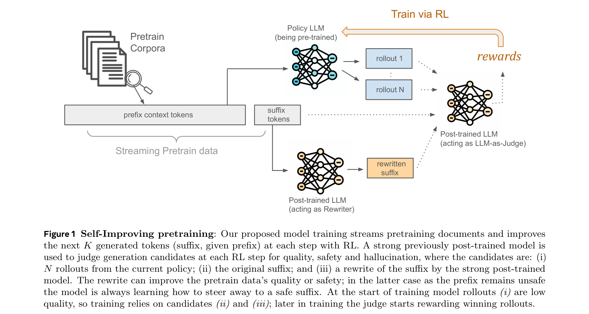
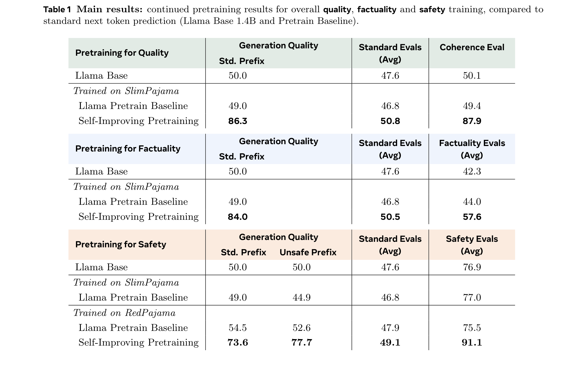
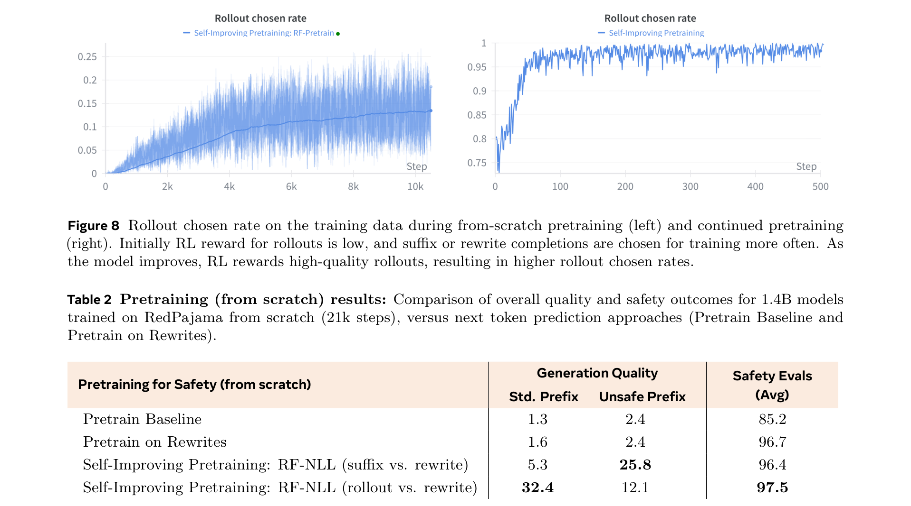
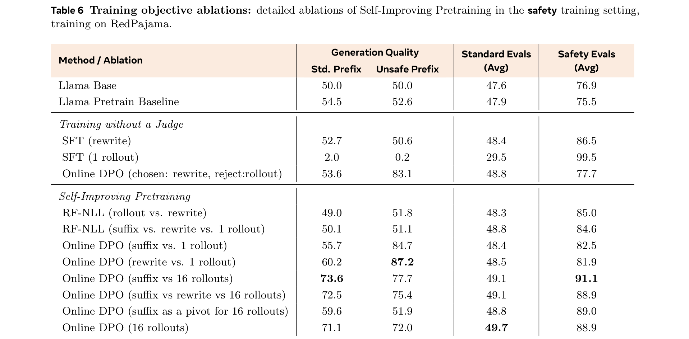
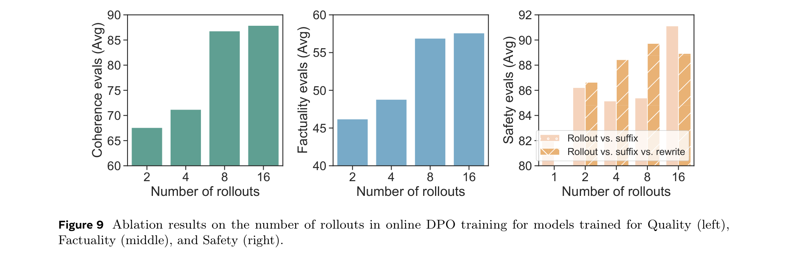

# Self-Improving Pretraining: Using Post-Trained Models to Pretrain Better Models

**Authors:** Ellen Xiaoqing Tan*, Jack Lanchantin*, Shehzaad Dhuliawala, Danwei Li, Thao Nguyen, Jing Xu, Ping Yu, Ilia Kulikov, Sainbayar Sukhbaatar, Jason Weston, Xian Li*, Olga Golovneva* (*Equal contribution)
**Institution:** FAIR at Meta
**Date:** April 5, 2026
**Paper:** [PDF](https://arxiv.org/abs/2601.21343)

---

## TL;DR

Instead of the standard "pretrain on next-token prediction, then fix problems in post-training" pipeline, this paper uses an already-trained strong model to improve pretraining itself. The strong model acts as both a **rewriter** (cleaning up low-quality or unsafe training data on the fly) and a **judge** (scoring rollouts from the model being trained via RL). This "self-improving" loop yields 86.3% win rate over standard pretraining in generation quality, 36.2% relative improvement in factuality, and 18.5% relative improvement in safety — all baked into the pretrained model before any post-training happens.

---

## Key Figures

### Figure 1: Self-Improving Pretraining Architecture

The core idea: streaming pretraining data is split into prefix (context) and suffix (target). The policy model (being pretrained) generates N rollouts of length 128 tokens. A strong post-trained model acts as both a **rewriter** (producing an improved suffix) and a **judge** (scoring the rollouts, original suffix, and rewrite for quality, safety, and factuality). The best-scoring completion becomes the training signal via online DPO or reward-filtered NLL. Early in training, the original/rewritten suffixes win; later, the model's own rollouts start winning.

### Table 1: Main Results (Continual Pretraining)

The headline numbers across three optimization targets. For **quality**: generation win rate jumps from 50.0 (baseline) to 86.3, coherence from 50.1 to 87.9. For **factuality**: factuality evals improve from 42.3 to 57.6 (36.2% relative). For **safety**: safety evals jump from 76.9 to 91.1 (18.5% relative), with generation quality on unsafe prefixes going from 50.0 to 77.7. Standard reasoning benchmarks also improve in all three cases.

### Figure 8: Rollout Chosen Rate + Table 2: From-Scratch Results

Two key findings in one. **Left/right plots**: Early in training, the judge picks the original suffix or rewrite as the best completion (rollout chosen rate is near 0). As the policy improves, the judge increasingly picks the model's own rollouts (rate rises to ~25% from-scratch, ~95% continual). This confirms the intended curriculum: learn from rewrites first, then from your own best outputs. **Table 2**: From-scratch pretraining results show even more dramatic gains — generation quality win rate goes from 1.3 (baseline) to 32.4, while safety improves from 85.2 to 97.5.

### Table 6: Training Objective Ablations

The ablation that proves every component matters. SFT on rewrites alone gives marginal quality gains. SFT on a single rollout (without a judge) causes model collapse — quality drops to 2.0/0.2. Online DPO with rewrite-as-chosen and rollout-as-rejected helps somewhat (83.1 on unsafe prefixes). But the full method with a judge + 16 rollouts gives the best results: 73.6 quality on standard prefixes and 91.1 safety. The jump from 1 rollout to 16 rollouts with online DPO is substantial.

### Figure 9: Scaling with Number of Rollouts

More rollouts = better results across all three objectives. Coherence evals go from ~60 (2 rollouts) to ~88 (16 rollouts). Factuality evals go from ~44 to ~57. Safety evals show consistent improvement from 1 to 16 rollouts. The authors did not experiment past 16 rollouts due to compute cost, but trends suggest further gains are likely.

---

## Key Novel Ideas

### 1. Pretraining as Sequence Generation, Not Next-Token Prediction

The fundamental shift: instead of predicting one token at a time during pretraining, the model generates entire sequences (chunks of N=128 tokens) and gets judged on the whole sequence. This is called "prefix-conditioned suffix generation."

The streaming pretraining data is split into chunks. For each chunk (the "suffix"), the model has seen all previous chunks (the "prefix") as context. The model generates a candidate completion of the suffix, and this completion is evaluated holistically — for quality, safety, and factuality — rather than token-by-token against the ground truth.

Why this matters: at deployment time, models generate sequences, not individual tokens. Training on sequence-level objectives aligns the training signal with actual use. It also means the model doesn't have to learn to reproduce low-quality or unsafe text just because it appears in the training data.

### 2. Post-Trained Models as Pretraining Supervisors (The Self-Improving Loop)

The key insight: a previously trained model (one that has already gone through pretraining + post-training) contains knowledge about quality, safety, and factuality that was expensive to acquire. This knowledge can be "recycled" to provide a better training signal for the next generation of models.

The post-trained model serves two roles:

**As a Rewriter**: Given a prefix and suffix from the training data, the rewriter produces an improved version of the suffix. If the suffix is unsafe, the rewriter steers it toward safety while keeping the prefix unchanged. If the suffix is high-quality, the rewriter copies it verbatim. This is crucial — the model still sees unsafe prefixes (so it learns to handle them), but learns to produce safe continuations.

**As a Judge**: The judge scores candidate completions (original suffix, rewrite, and K rollouts from the policy) on quality, safety, and factuality using separate prompts. These scores become rewards for RL training.

The "self-improving" part: because each generation of pretrained models can be post-trained and then used to supervise the next pretraining run, this creates an iterative improvement cycle. The paper demonstrates one iteration of this cycle.

### 3. Curriculum from Rewrites to Rollouts

A natural curriculum emerges without being explicitly programmed. Early in training, the policy model's rollouts are terrible, so the judge almost always picks the original suffix or the rewrite as the better completion. The model learns from these external references. As the policy improves, its rollouts become competitive and the judge starts picking them. Eventually, most chosen completions are the model's own high-quality rollouts.

This is visible in Figure 8: the rollout chosen rate starts near 0 and gradually increases. The transition from "learning from expert demonstrations" to "learning from your own best outputs" happens automatically based on quality.

### 4. GRPO-Trained Judge and Rewriter (Not Just Prompting)

For the safety experiments, the authors don't just prompt a large model — they fine-tune a Llama3.1-8B-Instruct model using GRPO to be a specialized judge and rewriter. Key design choices:

**Judge training**: Trained simultaneously on quality and safety tasks using GRPO with synthetic data. The judge learns to generate Chain-of-Thought reasoning before making judgments, which makes it more robust. Safety is easier to learn (plateaus at 0.94 reward by step 100), while quality takes longer.

**Rewriter training**: The rewriter is trained with an asymmetric reward:
- For safe suffixes: reward 1.0 only if the rewrite exactly matches the original (i.e., "don't change what's already good")
- For unsafe suffixes: reward is the average of the judge's quality and safety scores on the rewrite

This design ensures the rewriter is a conservative editor — it only changes what needs changing.

### 5. Online DPO Over Multiple Candidates (Not Just Pairs)

The paper uses online DPO (Direct Preference Optimization) with up to 16 rollouts plus the original suffix and rewrite — far more candidates than the standard 2 in vanilla DPO. All pairwise comparisons among candidates are run, rewards are averaged to get pointwise scores, and the highest-scoring becomes "chosen" while the lowest becomes "rejected."

This is possible because DPO is off-policy (unlike GRPO), meaning it can learn from sequences not generated by the current policy — like the original suffix or the rewrite. This is essential for the method since early in training, the most useful training signals come from the suffix/rewrite, not from the policy's own rollouts.

---

## Training Pipeline

### Models
- **Policy model**: Llama2 1.4B (both continual pretraining from checkpoint and from-scratch)
- **Judge/Rewriter**: Llama3.1-8B-Instruct (fine-tuned via GRPO) or GPT-OSS-120B (prompted)
- **Chunk size**: N = 128 tokens

### Data
- **SlimPajama (SP)**: Cleaner, more aggressively filtered version of RedPajama — used for quality and factuality experiments
- **RedPajama (RP)**: Includes unsafe content — used for safety experiments (257K samples filtered for unsafe content)
- Non-overlapping splits for policy, judge, and rewriter training

### Training Hyperparameters
| Setting | Continual Pretraining | From-Scratch |
|---|---|---|
| Steps | 2,000 | 21,000 |
| Learning rate | 5e-6 (cosine) | 5e-4 (cosine) |
| Warmup steps | 100 | 2,000 |
| Batch size | 256 | 256 |
| Rollouts per prompt | 16 | 1 |
| Rollout temperature | 1.0 | 1.0 |
| GPUs | 64 | 64 |
| Max sequence length | 2,048 | 2,048 |
| Generated suffix length | 128 | 128 |

### Judge/Rewriter Training (GRPO)
- Batch size: 256, 16 generations per prompt
- Temperature: 0.6, top_p: 0.6
- 500 steps, 64 GPUs, lr: 2e-7 (constant)
- Max prompt: 3,584 tokens, max generation: 512 tokens (judge) / 128 tokens (rewriter)

---

## Key Results

### Continual Pretraining (Table 1)

| Optimization Target | Gen. Quality (Std. Prefix) | Gen. Quality (Unsafe Prefix) | Standard Evals | Target Metric |
|---|---|---|---|---|
| **Quality** | 86.3 (vs 50.0 baseline) | — | 50.8 (vs 47.6) | Coherence: 87.9 |
| **Factuality** | 84.0 | — | 50.5 (vs 47.6) | Factuality: 57.6 (vs 42.3) |
| **Safety** | 73.6 | 77.7 (vs 50.0) | 49.1 (vs 47.6) | Safety: 91.1 (vs 76.9) |

### From-Scratch Pretraining (Table 2)

| Method | Gen. Quality (Std.) | Gen. Quality (Unsafe) | Safety Evals |
|---|---|---|---|
| Pretrain Baseline (NTP) | 1.3 | 2.4 | 85.2 |
| Pretrain on Rewrites | 1.6 | 2.4 | 96.7 |
| Self-Improving: RF-NLL (suffix vs. rewrite) | 5.3 | 25.8 | 96.4 |
| Self-Improving: RF-NLL (rollout vs. rewrite) | **32.4** | 12.1 | **97.5** |

### Judge Choice (Table 7)

| Judge | Gen. Quality | Standard Evals | Coherence |
|---|---|---|---|
| Fine-tuned Llama3 8B | 72.1 | 49.6 | 72.7 |
| GPT-OSS-120B (prompted) | **84.3** | **51.1** | **86.8** |

---

## Key Takeaways

1. **Fixing problems at pretraining time is better than fixing them at post-training time.** The core thesis is validated: baking safety, factuality, and quality into the pretraining objective produces models that are fundamentally better, not just superficially aligned. Safety evals jump from 76.9 to 91.1 — a level that would be hard to achieve through post-training alone on a model that learned unsafe patterns during pretraining.

2. **SFT on rollouts without a judge causes model collapse.** Training on the model's own single rollout (without quality filtering) is catastrophic — quality drops to near zero. This is the expected "model collapse" phenomenon. The judge is essential: it selects among multiple candidates, ensuring the model only learns from high-quality outputs.

3. **More rollouts = consistently better results.** Going from 2 to 16 rollouts improves coherence from ~60 to ~88, factuality from ~44 to ~57, and safety from ~82 to ~91. The trend doesn't saturate, suggesting that 32 or 64 rollouts could yield further gains (at higher compute cost).

4. **Online DPO substantially outperforms RF-NLL.** Reward-filtered NLL (just training on the best completion) improves safety but not quality. Online DPO (training on chosen vs. rejected pairs) gives much larger gains in generation quality — from 50.0 to 73.6 on standard prefixes. The contrastive signal from seeing what's bad alongside what's good matters.

5. **The rewriter's asymmetric design is clever.** Training the rewriter to copy safe suffixes exactly (reward 1.0 for exact match) while freely rewriting unsafe ones prevents the rewriter from unnecessarily modifying good data. This preserves training data quality while steering away from unsafe content.

6. **A fine-tuned 8B judge is competitive with a prompted 120B judge.** The fine-tuned Llama3 8B judge achieves 72.1 generation quality vs. 84.3 for GPT-OSS-120B — a gap, but not a chasm. This means you don't necessarily need a massive model as your judge, especially if compute is a constraint.

7. **The curriculum from rewrites to rollouts emerges naturally.** No explicit scheduling is needed. The judge automatically shifts from preferring external references (suffix, rewrite) to preferring the model's own rollouts as training progresses. This is elegant because it means the method adapts to the policy's current capability level without manual tuning.

8. **From-scratch pretraining shows even larger relative gains.** Generation quality win rate goes from 1.3 to 32.4 (a 25x improvement) when training from scratch, vs. 50.0 to 86.3 in the continual setting. This suggests the method is most impactful when used early in training, before bad patterns get deeply embedded.

9. **Optimizing for one axis doesn't transfer to others.** Table 24 (appendix) shows that optimizing for safety doesn't improve factuality, and vice versa. If you want both, you need to include both in the reward signal. The framework supports this by summing rewards from different judge prompts.

10. **The method is slower than standard pretraining but bets on compute scaling.** Generating K rollouts + running judge inference is significantly more expensive than next-token prediction. The authors argue this is the right tradeoff as we hit "data walls" — when more data doesn't help, better training signals become the bottleneck.

---

## What's Open-Sourced

- **No model checkpoints or code released.** The paper is from FAIR at Meta but does not mention any public release of models, datasets, or training code.
- The judge/rewriter prompts are fully specified in the paper (Figures 2-4), making reproduction possible with access to comparable base models.
