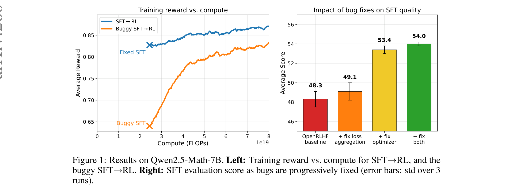
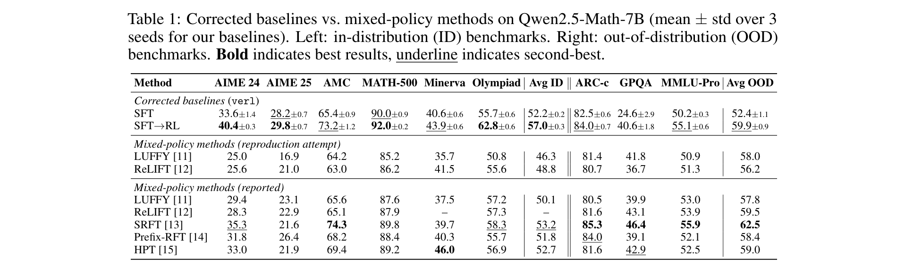
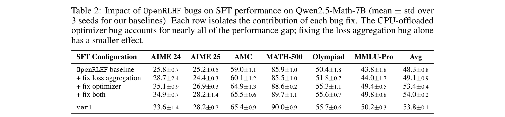
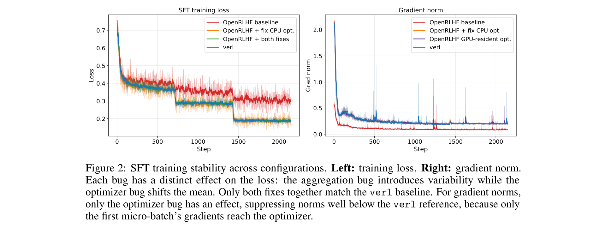
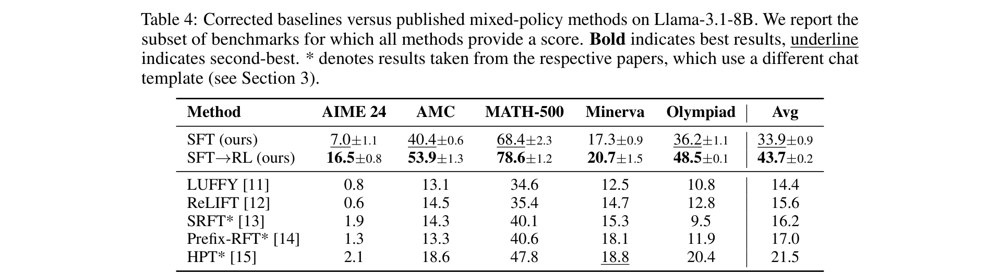
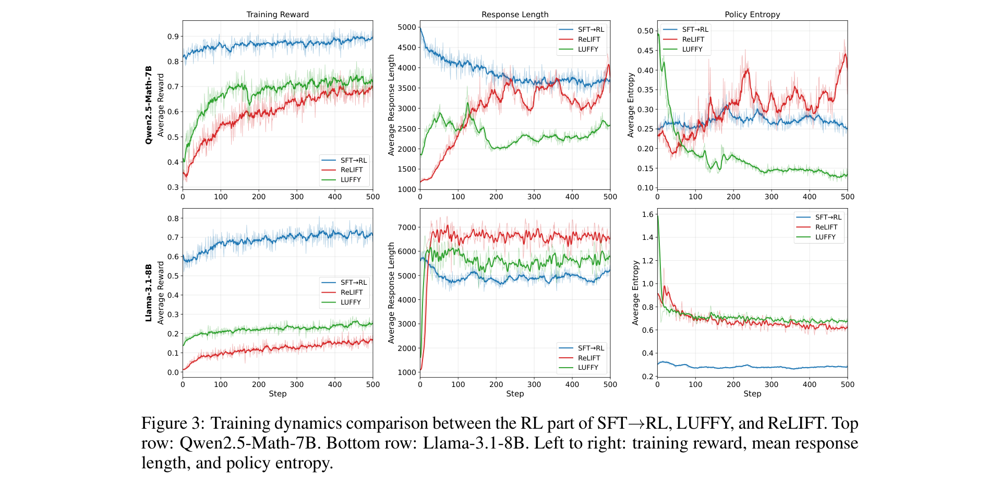

# SFT-then-RL Outperforms Mixed-Policy Methods for LLM Reasoning

**Authors:** Alexis Limozin (ETH Zurich / EPFL), Eduard Durech, Torsten Hoefler (ETH Zurich), Imanol Schlag (ETH Zurich), Valentina Pyatkin (Allen Institute for AI)
**Date:** April 26, 2026
**Paper:** [PDF](https://arxiv.org/abs/2604.23747)
**Code:** [github.com/alek6kun/sft_then_rl](https://github.com/alek6kun/sft_then_rl)

---

## TL;DR

Numerous recent papers claim that "mixed-policy" methods (which interleave SFT and RL during training) outperform the standard SFT-then-RL pipeline. This paper shows those claims rest on a faulty baseline: two bugs in widely-used frameworks (DeepSpeed and OpenRLHF) silently degrade SFT quality by up to 5.7 points. Once fixed, plain SFT-then-RL surpasses *every* published mixed-policy method by +3.8 points on Qwen2.5-Math-7B and +22.2 points on Llama-3.1-8B, while using fewer FLOPs. Even just 50 RL steps after corrected SFT beats all mixed-policy methods on in-distribution math benchmarks.

---

## Key Figures

### Figure 1: The Core Finding — Bug Fixes Recover SFT Performance

**Left:** Training reward over compute for SFT→RL with correct vs buggy SFT. The corrected pipeline (blue) starts higher and stays higher — the buggy SFT (orange) wastes compute catching up. **Right:** Progressive bug fixing. The OpenRLHF baseline scores 48.3; fixing the loss aggregation bug alone adds +0.8 (49.1); fixing the optimizer bug alone adds +5.1 (53.4); fixing both reaches 54.0, matching the independently implemented `verl` baseline (53.8). The optimizer bug accounts for most of the gap.

### Table 1: Corrected SFT→RL vs All Mixed-Policy Methods

On in-distribution math benchmarks (left columns), corrected SFT→RL averages 57.0 — surpassing the best mixed-policy method (SRFT at 53.2) by +3.8 points. On out-of-distribution benchmarks (right columns), SFT→RL averages 59.9, second only to SRFT at 62.5. Critically: the reproduction attempts of LUFFY and ReLIFT (using bug-free frameworks) yield 58.0 and 56.2, below corrected SFT→RL's 59.9.

### Table 2: Bug Decomposition

Isolating each bug's contribution. The CPU-offloaded optimizer bug alone accounts for +5.1 points (48.3→53.4). The loss aggregation bug adds +0.8 on top. Together they close the 5.7-point gap to the independently implemented `verl` baseline.

### Figure 2: SFT Training Stability

**Left:** Training loss curves. The buggy OpenRLHF baseline (red) has shifted mean *and* high variability. Fixing the optimizer corrects the mean; fixing loss aggregation reduces variability. Both fixes together match `verl` (green). **Right:** Gradient norms. The buggy configuration reports suppressed norms because only the first micro-batch's gradients reach the optimizer.

### Table 4: Llama-3.1-8B Results — Even Larger Gap

On Llama-3.1-8B, the corrected SFT→RL baseline (43.7 average) outperforms *every* mixed-policy method by at least +22.2 points. The closest competitor is HPT at 21.5. Even corrected SFT alone (33.9) beats all mixed-policy results (+12.4 points). Llama has less math pretraining, making the SFT bootstrap even more critical.

### Figure 3: Training Dynamics — Why SFT-then-RL is More Efficient

**Top row (Qwen):** SFT→RL's RL phase starts above 80% reward because SFT has already injected math knowledge. Mixed-policy methods (LUFFY, ReLIFT) never reach this level. **Bottom row (Llama):** The gap is even starker — SFT→RL starts at ~60% while mixed-policy methods hover near 0-30%. The key insight: SFT provides a strong initialization with dense reward signal, while mixed-policy methods must simultaneously learn and explore, diluting both signals.

---

## Key Novel Ideas

### 1. Two Silent Bugs in Widely-Used SFT Frameworks

This paper's primary contribution is not a new method — it's the discovery and documentation of two bugs that systematically deflated SFT baselines in numerous published papers.

**Bug 1: CPU-Offloaded Optimizer Bug in DeepSpeed.** When using DeepSpeed ZeRO Stage 2 with CPU-offloaded Adam (a common memory optimization), a bug in the gradient accumulation routine causes only the *first* micro-batch's gradients to reach the optimizer. The offloading code copies gradients to CPU inside an `else` branch that only executes when `micro_step_id == 0`. Intermediate micro-batches accumulate gradients on GPU correctly but never trigger a copy. The optimizer therefore sees only 1/N-th of the gradient information (where N is the number of gradient accumulation steps).

**Impact:** This bug affects *any* framework using DeepSpeed ZeRO Stage 1 or 2 with an offloaded optimizer — including TRL, OpenRLHF, and Llama-Factory. The fix was introduced in DeepSpeed PR #6550 (September 2024) and has been merged upstream.

**Bug 2: Loss Aggregation Bug in OpenRLHF.** The standard SFT cross-entropy loss averages over all response tokens in a batch. But during gradient accumulation with distributed training, OpenRLHF computes a *mean of per-mini-batch means* instead of the true per-token mean. Since mini-batches contain different numbers of response tokens (prompts and responses vary in length), this weights each mini-batch equally regardless of token count, distorting the gradient. The same distortion arises across distributed data-parallel ranks.

**Impact:** This bug is present in OpenRLHF, Llama-Factory, and early versions of `verl`. `verl` fixed it in November 2025. The fix requires aggregating token-level loss *sums and counts* across all ranks and mini-batches before dividing.

**Combined impact on Qwen2.5-Math-7B:** SFT average score drops from 54.0 (both fixed) to 48.3 (both buggy) — a **5.7-point deflation**. Since mixed-policy methods use DeepSpeed/OpenRLHF/Llama-Factory for their SFT baselines but implement their own mixed-policy stages (often in `verl`), they compare against deflated baselines while their own methods are unaffected.

### 2. The Sequential Pipeline Is More Compute-Efficient Than Mixed-Policy

Beyond bugs, the paper makes a structural argument: SFT-then-RL cleanly separates two objectives:
1. **SFT**: Bootstrap the model into a regime where it reliably generates correct solutions (dense reward signal)
2. **RL**: Refine the already-capable policy toward higher-reward reasoning strategies

Mixed-policy methods try to do both simultaneously, but early in training the model can't produce correct solutions, so the RL signal is extremely sparse — it's diluted by on-policy rollouts that carry little to no reward. The off-policy demonstrations provide some supervision, but it's mixed with the weak RL signal.

Evidence:
- SFT→RL's RL phase starts at ~80% training reward on Qwen (SFT has already taught math)
- LUFFY and ReLIFT never reach this level even after 500 steps
- On Llama (less math pretraining), the gap is even larger: SFT→RL starts at ~60%, mixed-policy methods at ~0-30%

### 3. Just 50 RL Steps After Corrected SFT Beats All Mixed-Policy Methods

A truncated SFT→RL variant with only 50 RL steps (instead of 500) achieves 55.6 average on in-distribution math benchmarks — still **+2.4 points ahead** of the best mixed-policy method (SRFT at 53.2). This truncated pipeline requires only 3.63×10¹⁹ FLOPs, fewer than LUFFY (6.65×10¹⁹) or ReLIFT (8.76×10¹⁹). SFT is cheap relative to RL because it processes tokens without multiple rollouts.

---

## Training Pipeline

### SFT Stage
- **Dataset:** OpenR1-Math-46k-8192 (length-filtered subset of OpenR1-Math-220k; prompts from NuminaMath 1.5, reasoning traces from DeepSeek-R1)
- **Model:** Qwen2.5-Math-7B (extended context to 16,384, RoPE theta 10K→40K)
- **Framework:** `verl` (bug-free; independently validated against PyTorch FSDP)
- **Optimizer:** AdamW
- **Hardware:** 8× NVIDIA H100 GPUs (SFT), up to 32× H100 GPUs (RL)
- **Also tested on:** Llama-3.1-8B

### RL Stage
- **Algorithm:** GRPO with 8 rollouts per prompt
- **Reward:** Math-Verify (rule-based verifier)
- **Steps:** 500 (default) or 50 (truncated variant)
- **Temperature:** 0.6
- **Max response length:** 8,192 tokens

---

## Key Results

### Qwen2.5-Math-7B — In-Distribution Math (Table 1)

| Method | AIME 24 | AIME 25 | AMC | MATH-500 | Minerva | Olympiad | Avg ID |
|---|---|---|---|---|---|---|---|
| SFT (corrected) | 33.6 | 28.2 | 65.4 | 90.0 | 40.6 | 55.7 | 52.2 |
| **SFT→RL (corrected)** | **40.4** | **29.8** | **73.2** | **92.0** | **43.9** | **62.8** | **57.0** |
| LUFFY (reported) | 29.4 | 23.1 | 65.6 | 87.6 | 37.5 | 57.2 | 50.1 |
| ReLIFT (reported) | 28.3 | 22.9 | 65.1 | 87.9 | — | 57.3 | — |
| SRFT (reported) | 35.3 | 21.6 | **74.3** | 89.8 | 39.7 | 58.3 | **53.2** |

### Qwen2.5-Math-7B — Out-of-Distribution (Table 1)

| Method | ARC-c | GPQA | MMLU-Pro | Avg OOD |
|---|---|---|---|---|
| SFT→RL (corrected) | 84.0 | 40.6 | 55.1 | 59.9 |
| SRFT (reported) | 85.3 | 55.9 | — | **62.5** |
| LUFFY (reported) | 80.5 | 39.9 | 53.0 | 57.8 |

### Llama-3.1-8B (Table 4)

| Method | AIME 24 | AMC | MATH-500 | Minerva | Olympiad | Avg |
|---|---|---|---|---|---|---|
| SFT (corrected) | 7.0 | 40.4 | 68.4 | 17.3 | 36.2 | 33.9 |
| **SFT→RL (corrected)** | **16.5** | **53.9** | **78.6** | **20.7** | **48.5** | **43.7** |
| HPT (best mixed-policy) | 2.1 | 18.6 | 47.8 | 18.8 | 20.4 | 21.5 |

### Compute Efficiency (Table 6)

| Method | FLOPs (×10¹⁹) |
|---|---|
| SFT→RL (50 steps) | 3.63 |
| LUFFY | 6.65 |
| ReLIFT | 8.76 |

---

## Key Takeaways

1. **Silent bugs in DeepSpeed and OpenRLHF systematically deflated SFT baselines across multiple published papers.** The CPU-offloaded optimizer bug (only first micro-batch's gradients reach the optimizer) accounts for ~5 of the 5.7-point gap; the loss aggregation bug adds ~0.8 more. Together they deflate SFT performance enough to make mixed-policy methods appear beneficial.

2. **The bugs affect TRL, OpenRLHF, Llama-Factory, and any DeepSpeed ZeRO Stage 1/2 pipeline with CPU offloading.** These are arguably the most widely used open-source training frameworks for LLM post-training. The fix has been merged to DeepSpeed but OpenRLHF and Llama-Factory have not yet been patched (at time of writing).

3. **Once bugs are fixed, plain SFT→RL beats every published mixed-policy method.** On Qwen2.5-Math-7B in-distribution tasks: +3.8 points over the best mixed-policy method. On Llama-3.1-8B: +22.2 points. This is not a marginal difference.

4. **SFT provides a fundamentally better initialization for RL than simultaneous training.** The training dynamics (Figure 3) tell the whole story: SFT→RL's RL phase starts at ~80% reward (Qwen) or ~60% (Llama) because SFT has already taught the model to solve problems. Mixed-policy methods start near 0-30% and struggle to climb because the RL signal is too sparse early in training.

5. **Just 50 RL steps after corrected SFT outperforms all mixed-policy methods on math benchmarks, with fewer FLOPs.** The truncated pipeline uses 3.63×10¹⁹ FLOPs vs 6.65-8.76×10¹⁹ for LUFFY/ReLIFT. SFT is cheap (no rollouts), and the strong initialization means RL converges fast.

6. **The Llama results are particularly instructive.** Llama has minimal math in pretraining, making the SFT bootstrap critical. Mixed-policy methods fail because they can't simultaneously learn math and do RL — the model can't produce correct solutions, so there's nothing to reinforce. SFT→RL separates these two objectives cleanly.

7. **Hyperparameter choices also inflate apparent mixed-policy gains.** SRFT uses a 10x lower learning rate and 2x larger batch size for SFT, producing a weaker baseline. Switching to LUFFY/ReLIFT hyperparameters recovers 5.5 points. The perceived gains from mixed-policy methods are partly bugs and partly suboptimal SFT hyperparameters.

8. **Cross-framework validation is essential for ML research.** These bugs were invisible within any single framework. They were only discovered by comparing OpenRLHF SFT against an independently implemented `verl` baseline. The paper's message: always validate results across at least two independent implementations.

9. **Mixed-policy methods might still add value on top of a corrected baseline — but this hasn't been tested.** The paper invalidates comparisons against deflated baselines but doesn't preclude that LUFFY or ReLIFT could improve a correctly-trained SFT checkpoint. None of the mixed-policy papers test this setup.

10. **The RL phase shortens response length while maintaining accuracy.** SFT→RL on Qwen starts at ~5K tokens (inherited from verbose DeepSeek-R1 demonstrations) and converges to ~3.7K as RL prunes unnecessary verbosity while retaining problem-solving capability. Mixed-policy methods show gradually increasing lengths, which the authors attribute to developing reasoning from a weaker starting point.

---

## Limitations

- Focused on mathematical reasoning with Qwen2.5-Math-7B and Llama-3.1-8B; other domains (code, general reasoning) may differ.
- Does not test mixed-policy methods on top of a corrected SFT baseline — leaves open whether they could add marginal value.
- Could not fully verify ReLIFT and HPT's SFT setup (ReLIFT uses Llama-Factory without releasing exact config; HPT doesn't detail SFT).

---

## What's Open-Sourced

- **Code:** [github.com/alek6kun/sft_then_rl](https://github.com/alek6kun/sft_then_rl)
- **DeepSpeed bug fix:** Merged upstream as [DeepSpeed PR #6550](https://github.com/deepspeedai/DeepSpeed/pull/6550)
- **OpenRLHF fix:** Pull request submitted (not yet merged at time of writing)
- **Training data:** Uses publicly available OpenR1-Math-46k-8192 and NuminaMath 1.5
