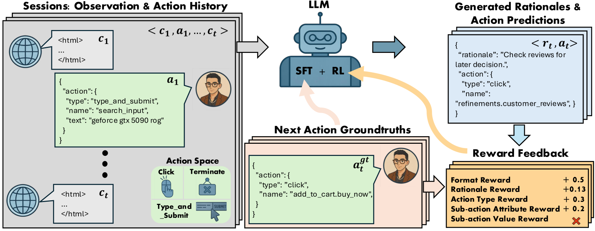
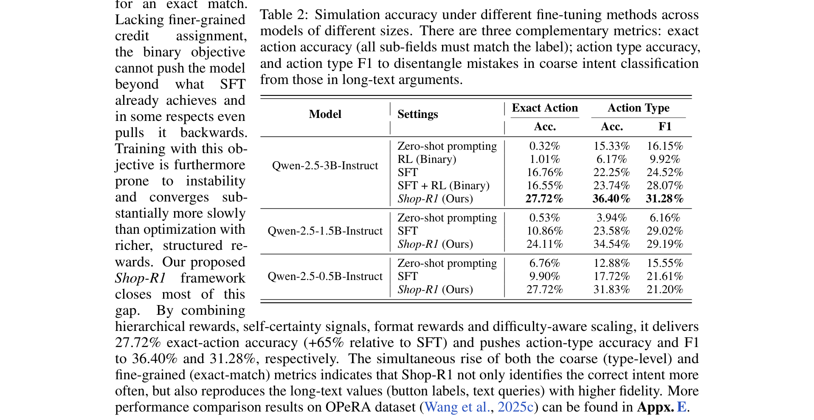
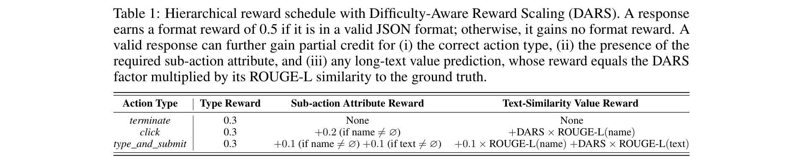
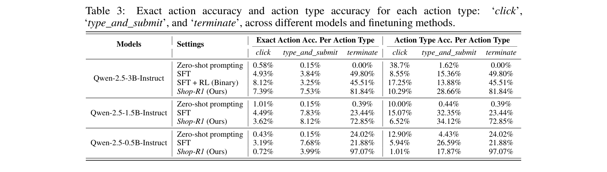
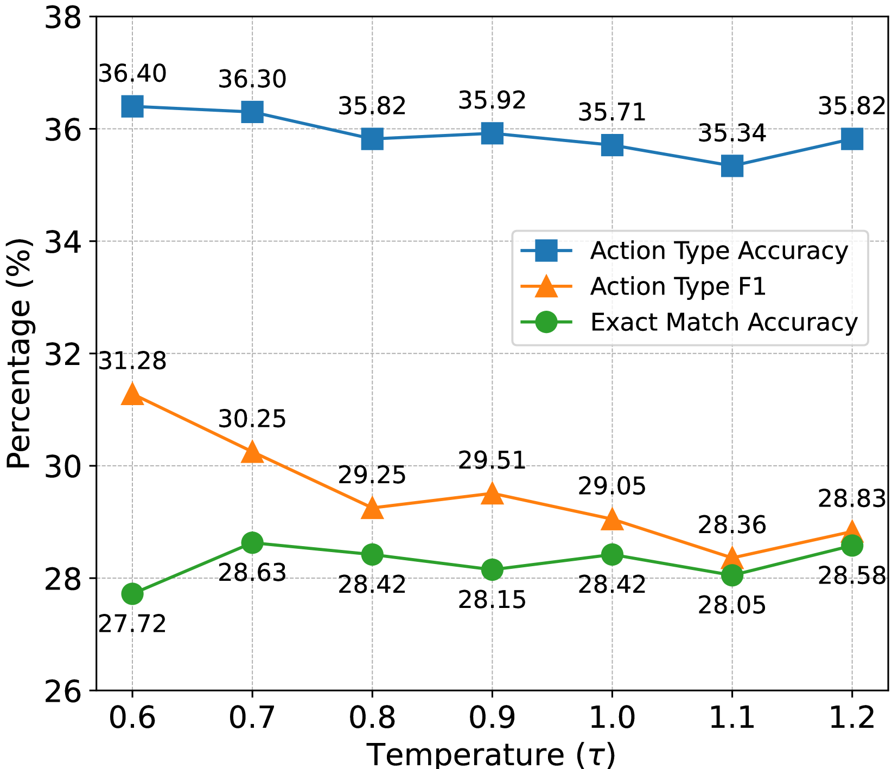

# Shop-R1: Rewarding LLMs to Simulate Human Behavior in Online Shopping via Reinforcement Learning

**Authors:** Yimeng Zhang, Tian Wang, Jiri Gesi, Ziyi Wang, Yuxuan Lu, Jiacheng Lin, Sinong Zhan, Vianne Gao, Ruochen Jiao, Junze Liu, Kun Qian, Yuxin Tang, Ran Xue, Houyu Zhang, Qingjun Cui, Yufan Guo, Dakuo Wang
**Affiliations:** Michigan State University, Store Foundation AI (Amazon), Northeastern University, UIUC, Northwestern University
**Date:** July 23, 2025 (Published at ICLR 2026)
**Paper:** [PDF](https://arxiv.org/pdf/2507.17842)

---

## TL;DR

Shop-R1 is the first RL framework for training LLMs to simulate real human shopping behavior (not just complete tasks). It decomposes each prediction step into rationale generation (why the user acts) and action prediction (what the user does), with separate reward signals for each. A hierarchical reward scheme with difficulty-aware scaling prevents reward hacking (where the model spams easy "terminate" actions). On a proprietary dataset of 52K real shopping sessions, Shop-R1 achieves 27.72% exact-match action accuracy on a Qwen-2.5-3B model -- a 65% relative improvement over SFT alone (16.76%).

---

## Key Figures

### Figure 1: Framework Overview

The full Shop-R1 pipeline. Left: the input consists of session observations (simplified HTML of web pages) and action history. The LLM (trained with SFT + RL) predicts both a rationale (why the user would take this action) and the next action in structured JSON format. Right: four reward signals evaluate the output -- format reward (+0.5 for valid JSON), rationale reward (self-certainty via KL divergence), action type reward (+0.3 for correct type), and sub-action attribute/value rewards (+0.2 each, scaled by difficulty).

### Figure 2: Main Results Table

The key results across three model sizes (Qwen-2.5-3B, 1.5B, 0.5B). Shop-R1 (27.72% exact-match on 3B) dramatically outperforms zero-shot (0.32%), RL with binary rewards only (1.01%), SFT (16.76%), and SFT + binary RL (16.55%). The gap between SFT and Shop-R1 (+65% relative) demonstrates that structured RL rewards unlock capabilities that supervised learning alone cannot.

### Figure 3: Reward Schedule

The hierarchical reward design. A valid JSON response earns a base format reward of 0.5. Correct action type earns 0.3. For complex actions (click, type_and_submit), additional rewards scale with difficulty: the sub-action attribute earns 0.2 if correct, and the value earns DARS * ROUGE-L (where DARS=1000 amplifies hard long-text predictions). The "terminate" action has no sub-actions, so it can never earn more than 0.8 total -- making reward hacking via terminate unprofitable.

### Figure 4: Per-Action Breakdown

Accuracy decomposed by action type. Zero-shot can sometimes guess the right action *type* (38.7% for click) but almost never gets the exact target right (0.58%). Shop-R1 achieves 23.93% exact-match on click, 27.66% on type_and_submit, and 69.86% on terminate for the 3B model. The smaller 0.5B model achieves high headline accuracy (27.72%) but cheats by over-predicting terminate (97.07% exact) while failing on harder actions.

### Figure 5: Temperature Ablation

Temperature 0.6-0.7 is the sweet spot. Action type accuracy stays flat across temperatures (~36%). F1 declines steadily as temperature rises (31.28% → 28.36%). Exact-match peaks at τ=0.7 (28.63%) -- a small amount of stochasticity helps escape local optima for long-text generation, but too much corrupts fine-grained fields.

---

## Key Novel Ideas

### 1. RL for Human Behavior *Simulation* (Not Task Completion)

Most prior web-agent RL work trains models to *complete tasks* (e.g., "buy a jacket" on WebArena). Shop-R1 instead trains models to *replicate what a real human actually did* -- matching the exact sequence of clicks, searches, and terminations from real shopping sessions. This is a fundamentally different objective: task completion rewards any successful path, while behavior simulation rewards only the specific path the human took.

**Why this matters:** Behavior simulation is harder but more useful for UX research, A/B testing, and user modeling. If you just want task completion, any working strategy is fine. If you want to understand *how real users behave*, the model must match human decision patterns, not just outcomes.

### 2. Two-Stage Decomposition: Rationale + Action

Each prediction step outputs two things in a structured JSON:
- **Rationale** (r_t): A natural language explanation of why the user would take this action
- **Action** (a_t): The structured action (type + sub-action details)

Each gets its own reward signal. This decomposition is important because:
- Rationales improve action quality (the model "thinks before acting")
- Rationales make the simulation interpretable (researchers can read *why*)
- Rationale and action quality require fundamentally different reward types

### 3. Self-Certainty Reward for Rationales

There's no ground-truth for rationales (you can't know exactly why a real user clicked something). Shop-R1 solves this with a **self-certainty score** -- the KL divergence between the model's output distribution and a uniform distribution, averaged over all tokens in the rationale:

$$s(r_t | q_t) = \frac{1}{N|V|} \sum_{j=1}^{N} \sum_{i=1}^{|V|} p_{ij} \log\left(\frac{p_{ij}}{U_i}\right)$$

where $p_{ij}$ is the predicted probability of token $i$ at position $j$, and $U_i = 1/|V|$ is uniform over vocabulary $V$.

**Intuition:** When the model is confident about its rationale (high self-certainty), the output distribution is peaked and far from uniform. When it's uncertain or hallucinating, the distribution is flat. By rewarding high self-certainty, the model learns to generate rationales it's confident about -- which empirically correlates with better action predictions.

**Why not use an external reward model?** Getting ground-truth rationales for shopping behavior is nearly impossible. Self-reported rationales from users are noisy and incomplete. Self-certainty provides a supervision-free signal that's cheap to compute.

### 4. Hierarchical Reward with Difficulty-Aware Scaling (DARS)

The action reward has three levels:
1. **Format reward** (0.5): Is the output valid JSON?
2. **Action type reward** (0.3): Is the high-level action correct (click/type_and_submit/terminate)?
3. **Sub-action rewards**: Is the specific button/query correct?

For sub-actions, the reward is:
- **Attribute correctness** (0.2): Did the model predict the right field (e.g., "name" for a click target)?
- **Value correctness** (DARS × ROUGE-L): How close is the predicted value to the ground truth?

The **DARS factor** (default 1000) massively amplifies the value reward for hard long-text predictions. This makes the total reward for correctly predicting a complex click (with the right button label) much higher than the reward for predicting "terminate."

**Why this prevents reward hacking:** Without DARS, the model quickly learns that "terminate" is the easiest way to score points (correct type = 0.3, no sub-actions to get wrong). With DARS, a correctly predicted click earns 0.5 + 0.3 + 0.2 + 1000 × ROUGE-L, which is potentially much more than terminate's maximum of 0.8. The model is incentivized to attempt hard actions because the payoff is orders of magnitude higher.

### 5. The Critical Role of SFT Cold-Start

A key finding: RL alone (without SFT) completely fails. Even with all the structured rewards, training from scratch with RL reaches only 4.63% exact-match. SFT provides the model with:
- The structural pattern (context → rationale → action)
- The format of long-text outputs (button labels, search queries)
- Initial behavioral priors from Claude-generated rationales

RL then refines these priors beyond what the teacher model (Claude 3.5 Sonnet) could achieve through distillation alone. This is the SFT → RL pipeline that DeepSeek-R1 established for math reasoning, now applied to behavior simulation.

---

## Architecture Details

| Component | Details |
|---|---|
| **Base model** | Qwen-2.5-3B-Instruct (also tested 1.5B, 0.5B) |
| **RL algorithm** | GRPO (Group Relative Policy Optimization) |
| **Framework** | verl (Volcengine RL framework) |
| **Dataset** | SHOP-CART: 52,137 real shopping sessions from a major e-commerce platform |
| **Rationale source** | Claude 3.5 Sonnet via Amazon Bedrock (for SFT cold-start only) |
| **Observation format** | Simplified HTML (scripts/styles/user data removed) |
| **Action space** | 3 types: click, type_and_submit, terminate |
| **Max context** | 32K tokens |
| **SFT training** | 4 epochs, lr=2e-5 |
| **RL training** | 500 steps, lr=1e-7 |
| **RL batch size** | Global batch 64 |
| **DARS factor** | 1000 (default) |
| **Self-certainty weight** | α=0.005 |
| **KL penalty weight** | β=0.001 |
| **ROUGE-L threshold** | 0.75 (sub-action value reward only above this) |
| **Hardware** | NVIDIA A100 80GB GPUs |

---

## Training Pipeline

1. **Data preparation**: 52,137 real shopping sessions. Each action is enriched with a rationale generated by Claude 3.5 Sonnet. For SFT, full sessions are used. For RL, sessions are split into individual ⟨context, action⟩ pairs.

2. **SFT cold-start**: Train on ⟨context, rationale, action⟩ triplets for 4 epochs. The model learns the structural pattern and output format.

3. **RL training (Shop-R1)**: Using GRPO, optimize the combined objective:
$$\max_{\pi_\theta} \mathbb{E}_{r,a \sim \pi_\theta(q)} \left[ v(a) + \alpha \cdot s(r) - \beta \cdot \text{KL}(\pi_\theta \| \pi_{\text{ref}}) \right]$$
where $v(a)$ is the hierarchical action reward, $s(r)$ is the self-certainty reward, and the KL term prevents the policy from drifting too far from the SFT checkpoint.

4. **Reward computation per rollout**:
   - Format: +0.5 if valid JSON, else 0
   - Self-certainty: α × KL(output distribution ∥ uniform)
   - Action type: +0.3 if correct
   - Sub-action attribute: +0.2 if correct
   - Sub-action value: DARS × ROUGE-L (if ROUGE-L > 0.75)

---

## Key Results

### Main Comparison (Qwen-2.5-3B-Instruct)

| Method | Exact Action Acc. | Action Type Acc. | Action Type F1 |
|---|---|---|---|
| Zero-shot prompting | 0.32% | 15.33% | 16.15% |
| RL (Binary) | 1.01% | 6.17% | 9.92% |
| SFT | 16.76% | 22.25% | 24.52% |
| SFT + RL (Binary) | 16.55% | 23.74% | 28.07% |
| **Shop-R1 (Ours)** | **27.72%** | **36.40%** | **31.28%** |

Shop-R1 improves over SFT by **+65% relative** on exact-match accuracy.

### Per-Action Type Breakdown (Qwen-2.5-3B, Shop-R1)

| Action Type | Exact Acc. | Type Acc. |
|---|---|---|
| click | 23.93% | 43.80% |
| type_and_submit | 27.66% | 30.54% |
| terminate | 69.86% | 69.86% |

### Model Scaling

| Model Size | Exact Acc. (SFT) | Exact Acc. (Shop-R1) | Relative Gain |
|---|---|---|---|
| Qwen-2.5-0.5B | 9.90% | 27.72% | +180% |
| Qwen-2.5-1.5B | 10.86% | 24.11% | +122% |
| Qwen-2.5-3B | 16.76% | 27.72% | +65% |

Note: The 0.5B model achieves the same headline accuracy as 3B but cheats by over-predicting terminate (97.07% exact on terminate, near 0% on click/type_and_submit).

### Ablation Study

| Configuration | Exact Acc. | Type Acc. | Type F1 |
|---|---|---|---|
| Full Shop-R1 | **27.72%** | **36.40%** | **31.28%** |
| − SFT cold-start | 4.63% | 11.27% | 11.27% |
| − Format reward | 2.87% | 5.76% | 5.47% |
| − Self-certainty reward | 26.95% | 35.33% | 29.83% |
| − DARS scaling | 27.13% | 18.17% | 11.49% |
| − Hierarchical → Binary reward | 26.98% | 17.27% | 12.18% |

**Key findings:**
- Removing SFT is catastrophic (27.72% → 4.63%)
- Removing format reward is even worse (27.72% → 2.87%)
- Self-certainty contributes modestly to exact-match (+0.8%)
- DARS and hierarchical rewards are critical for balanced action-type distribution (F1 drops from 31.28% to ~11% without them)

### Context Ablation

| Context | Exact Acc. | Type Acc. | Type F1 |
|---|---|---|---|
| Whole-session (full HTML history) | **27.72%** | **36.40%** | **31.28%** |
| Latest-step only | 14.74% | 31.83% | 21.20% |

Providing full session context nearly doubles exact-match accuracy. The model needs the HTML structure to name the exact UI elements.

---

## Key Takeaways

1. **RL for behavior simulation (not task completion) is viable and effective.** Shop-R1 is the first to apply RL to the problem of replicating real human shopping behavior, achieving +65% over SFT. The key insight: behavior simulation requires matching specific human decisions, not just finding any working path.

2. **SFT is a non-negotiable prerequisite for RL.** Without the SFT cold-start, even with all structured rewards, RL alone reaches only 4.63%. The SFT stage teaches the model the output format, action structure, and basic behavioral patterns that RL then refines.

3. **Format rewards are surprisingly critical.** Removing the binary format reward (is the output valid JSON?) collapses performance to 2.87%. If the model can't produce parseable output, no other reward signal can propagate. This is a practical lesson for any RL-for-generation system.

4. **Difficulty-aware reward scaling (DARS) solves reward hacking.** Without DARS, the model learns to spam "terminate" because it's the easiest way to earn rewards. With DARS=1000, correctly predicting a complex click or search query is orders of magnitude more rewarding than predicting terminate, so the model is incentivized to attempt hard actions.

5. **Self-certainty is a useful supervision-free signal for rationales.** Using the KL divergence between the model's output distribution and uniform provides a cheap, ground-truth-free reward for rationale quality. It contributes modestly (+0.8% exact-match) but consistently.

6. **Smaller models cheat via reward hacking even with DARS.** The 0.5B model achieves the same headline accuracy as 3B (27.72%) but does so by predicting "terminate" 97% of the time. Only the 3B model distributes its improvements evenly across all action types. Larger backbones are needed for genuine behavioral diversity.

7. **Full session context is critical for fine-grained accuracy.** Providing only the latest observation (vs. full session HTML history) cuts exact-match accuracy nearly in half (27.72% → 14.74%). The model needs to see the HTML structure to correctly identify specific UI elements like button labels.

8. **The rationale → action decomposition is well-motivated.** Generating a rationale before the action forces the model to "think" about why the user would act, which empirically improves action accuracy. This is the behavior-simulation analog of chain-of-thought for math.

9. **ROUGE-L with a threshold is a practical reward for long-text outputs.** Exact match is too sparse for long-text sub-actions (button labels, search queries). ROUGE-L with a 0.75 threshold provides partial credit while filtering out low-quality matches.

10. **27.72% exact-match is useful but far from solved.** The model correctly predicts the exact next action (including specific button/query) only about 1 in 4 times. This is dramatically better than baselines but highlights how hard realistic behavior simulation is -- especially for diverse, long-text actions like specific product searches.

---

## What's Open-Sourced

- **Code and model checkpoints:** "Will be released upon paper acceptance" (paper is accepted at ICLR 2026, so release is expected)
- **Dataset:** SHOP-CART, a proprietary corpus of 52,137 real shopping sessions from a major e-commerce platform -- likely not publicly available
- **Related public dataset:** The paper references OPeRA (Wang et al., 2025) as an alternative evaluation dataset with additional results in the appendix
- **Prompts:** The system prompt (Appendix A) and rationale synthesis prompt (Appendix B) are provided in the paper
