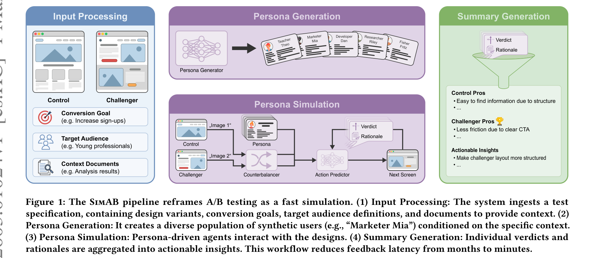
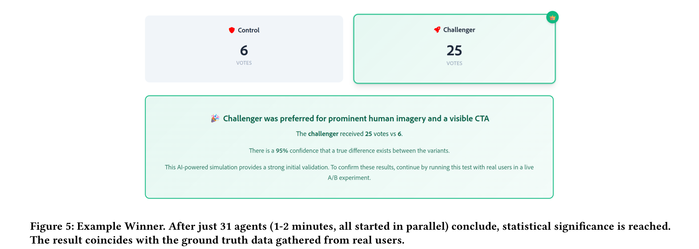
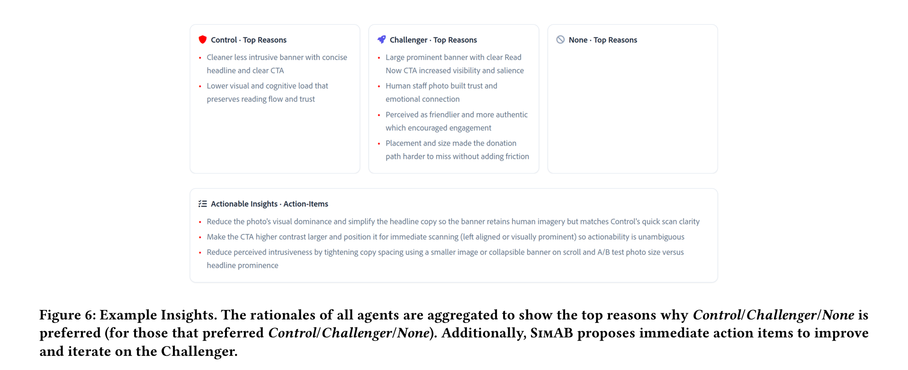
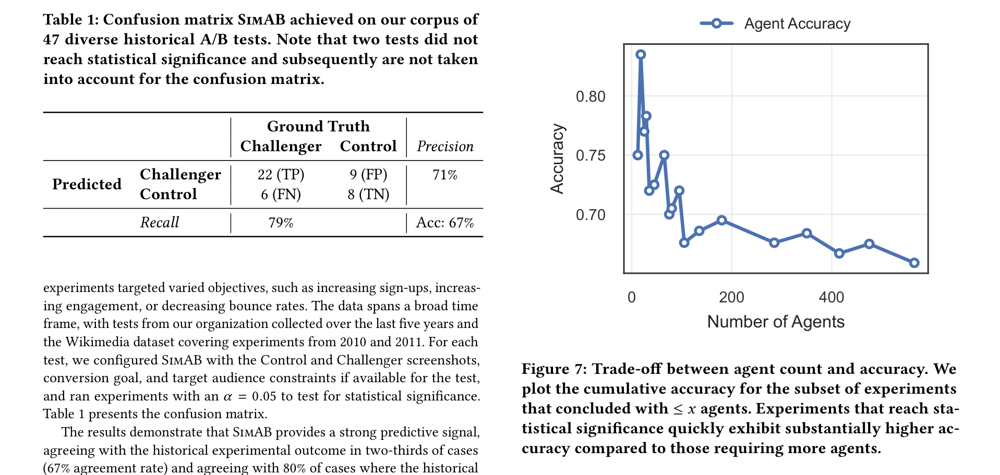
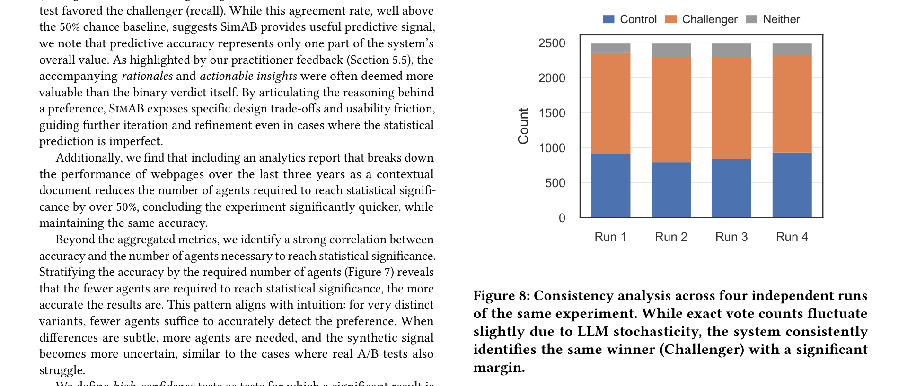
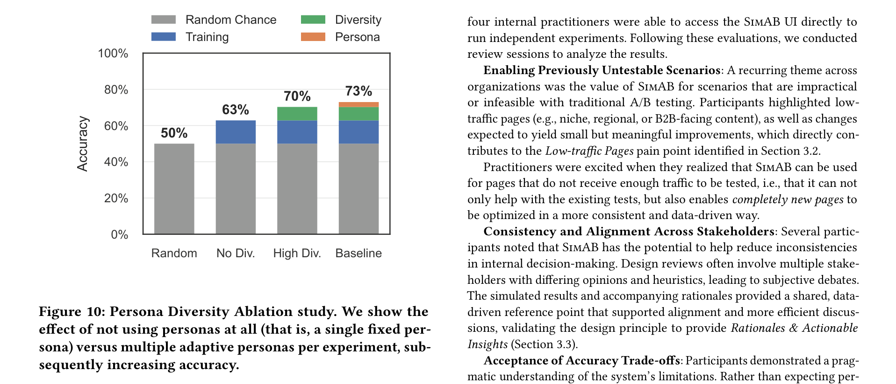
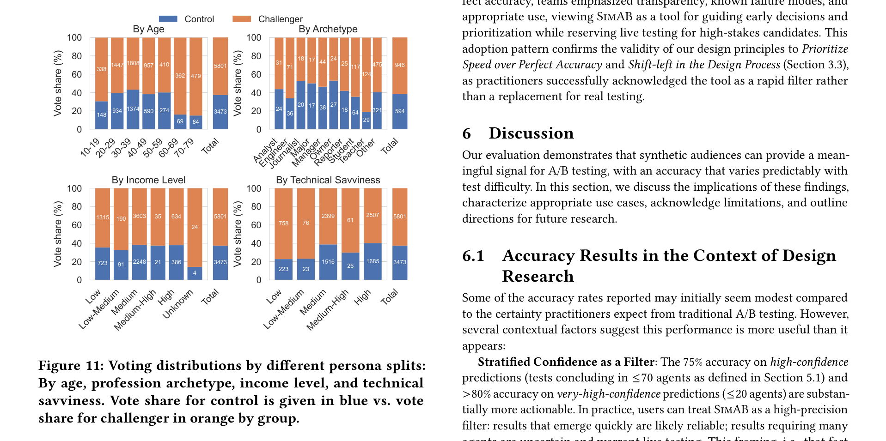

# SimAB: Simulating A/B Tests with Persona-Conditioned AI Agents for Rapid Design Evaluation

**Authors:** Tim Rieder (ETH Zurich), Marian Schneider (ETH Zurich), Mario Truss, Vitaly Tsaplin, Alina Rublea, Sinem Dere, Francisco Chicharro Sanz, Tobias Reiss, Mustafa Doga Dogan (all Adobe)
**Date:** March 1, 2026
**Paper:** [PDF](https://arxiv.org/abs/2603.01024)

---

## TL;DR

SimAB replaces months of real-user A/B testing with minutes of LLM agent simulation. It generates diverse synthetic personas, shows each one screenshots of a Control and Challenger design, collects their preference vote and rationale, then aggregates the results with early stopping. Evaluated against 47 historical A/B tests with known outcomes, SimAB achieves 67% overall accuracy (correctly predicting which variant won), rising to 75% for high-confidence tests and >80% for very-high-confidence tests. Unlike Agent A/B (which has agents *interact* with live websites), SimAB operates purely on static screenshots -- making it faster, cheaper, and applicable even before a design is implemented.

---

## Key Figures

### Figure 1: The SimAB Pipeline

The four-stage pipeline: (1) **Input Processing** takes Control/Challenger screenshots, a conversion goal, optional target audience specs, and context documents. (2) **Persona Generation** creates a diverse population of synthetic users (e.g., "Marketer Mia") conditioned on the website content and audience specification. (3) **Persona Simulation** deploys each persona as an AI agent that views both variants and states its preference with a rationale. (4) **Summary Generation** aggregates individual verdicts into actionable insights -- top reasons for each side, plus concrete improvement suggestions.

### Figure 2: Example Winner Output

After just 31 agents (1-2 minutes of wall-clock time, all running in parallel), SimAB reaches statistical significance and correctly identifies the Challenger (Wikipedia donation banner with prominent human imagery and visible CTA) as the winner -- matching the ground truth from a real historical A/B test. This demonstrates the "fast feedback" design principle in action.

### Figure 3: Example Actionable Insights

Beyond a binary winner, SimAB aggregates all agent rationales into structured insights. For each side (Control/Challenger/None), it surfaces the top 3-5 reasons driving preferences. It then proposes concrete action items -- here suggesting reducing the photo's visual dominance, making the CTA larger, and tightening copy spacing. Practitioners in the formative study rated these rationales as often *more valuable than the verdict itself*.

### Figure 4: Accuracy Results and Confusion Matrix

**Left:** The confusion matrix on 47 historical A/B tests (2 didn't reach significance, leaving 45 for the matrix). SimAB correctly predicted 22 true Challenger wins and 8 true Control wins, for 67% overall accuracy, 71% precision, and 79% recall. **Right:** Accuracy vs. number of agents -- tests that reach significance quickly (fewer agents) are more accurate (~80%), while tests requiring many agents (subtle differences) are harder, dropping accuracy. This mirrors real A/B testing, where large-effect-size tests are easier to call.

### Figure 5: Consistency Across Runs

Four independent runs of the same experiment produce slightly different vote counts (due to LLM stochasticity), but all four consistently identify the same winner (Challenger) with a significant margin. The Challenger preference rate ranged from 56% to 62%, confirming reproducibility.

### Figure 6: Persona Diversity Matters

Ablation study comparing four conditions: random chance (50%), no diversity (single fixed persona for all agents: 63%), high diversity (de-duplication with embedding similarity threshold: 70%), and the baseline batched generation (73%). Removing personas entirely drops accuracy by 10 percentage points. Interestingly, extreme diversity enforcement (High Div.) slightly underperforms the default batched approach, suggesting that the natural diversity from batch generation already strikes a good balance.

### Figure 7: Voting Distributions by Persona Demographics

Different persona segments vote differently. By age, older personas (60-79) lean more toward the Challenger than younger ones (10-19). By archetype, Teachers and Students show distinct patterns from Managers and Engineers. By technical savviness, low-tech personas differ markedly from high-tech ones. For three of four splits, at least one group's distribution is statistically significantly different from the others, confirming that persona conditioning produces meaningfully different behavioral responses -- not just random noise.

---

## Key Novel Ideas

### 1. Screenshot-Based Preference Elicitation (Not Interaction)

SimAB's key architectural choice: agents don't *interact* with websites. They look at screenshots and state a preference. This is fundamentally different from Agent A/B (which deploys agents on live websites) or web-agent benchmarks (which test task completion).

**Why this matters:** Screenshots can be generated from mockups, prototypes, or even design tools -- you don't need a functioning website. This shifts testing from the end of the development cycle ("build it, then test it") to the beginning ("sketch it, then test it"). The authors call this "shift-left in the design process."

**The trade-off:** SimAB can't capture interaction dynamics (page load speed, hover behavior, multi-step flows). It captures *visual preference*, not *behavioral outcomes*. But practitioners in the formative study said this trade-off is worth it: getting fast, directional feedback early beats getting precise feedback late.

For multi-page flows, SimAB supports scrolling simulation (the agent can request to scroll and see more of the page) and multi-screenshot sequences (e.g., showing the full checkout flow as a series of images).

### 2. Persona-Conditioned Evaluation with 13 Attributes

Each simulated user is represented by 13 attributes across four categories:

1. **Demographics** (4): Name, age range, occupation, income level, education, location
2. **Psychographics** (4): Interests, goals, pain points, technical savviness
3. **Behavioral** (2): Online behavior patterns, typical browsing context
4. **Task-specific** (3): Specific tasks they'd perform, circumstances of their visit

Personas are generated by GPT-5-mini-2025-08-07, conditioned on the actual variant screenshots and any target audience specification provided by the user. This means the personas are tailored to the specific website being tested, not generic.

**Why 13 attributes?** The ablation study shows personas matter a lot: removing them drops accuracy by 10 percentage points (from 73% to 63%). Having diverse personas is important, but the paper finds that extreme diversity enforcement (de-duplicating via embedding similarity) doesn't help beyond what natural batch-level diversity provides.

### 3. Counterbalancing and Neutral Naming for Bias Mitigation

LLMs have well-documented position bias (preferring the first-presented option) and naming bias (the label "Challenger" might sound more innovative). SimAB addresses both:

- **Counterbalancing:** Alternates which variant is shown as "Image 1" vs. "Image 2" across agents
- **Neutral naming:** Labels variants as "Image 1" and "Image 2" instead of "Control" and "Challenger"

The paper validates these with a clever test: they run SimAB with *identical* images for both variants (so there should be no preference). Results:

| Counterbalancing | Neutral Names | Control Votes | Challenger Votes | p-value |
|---|---|---|---|---|
| No | No | 126 | 749 | 0.0000 |
| No | Yes | 52 | 887 | 0.0000 |
| Yes | No | 442 | 434 | 0.8131 |
| **Yes** | **Yes** | **460** | **469** | **0.7930** |

Without counterbalancing, bias is catastrophic (6:1 ratio). With both mitigations enabled, the 4-vote difference across 4,756 evaluations is statistically negligible (p=0.984). Counterbalancing is the critical factor; neutral naming helps somewhat but is secondary.

### 4. Early Stopping via Asymptotic Confidence Sequences

SimAB doesn't run a fixed number of agents. It uses asymptotic confidence sequences to test whether the aggregate preference is significantly different from chance after each batch. If the synthetic consensus reaches a significance threshold (alpha=0.05), the experiment stops early.

**Why this matters:** 60% of tests reach significance within 70 agents (a "high-confidence" test), and these are the most accurate (75% accuracy). Very-high-confidence tests that converge within 20 agents exceed 80% accuracy. The practical implication: fast-converging results are reliable; slow-converging results should be treated as uncertain -- exactly the framing practitioners said they wanted.

The authors acknowledge that asymptotic confidence sequences assume independence between samples, which is technically violated since personas within a batch share context. But empirically, the approach works well as a heuristic for early stopping.

### 5. RAG Pipeline for Contextual Documents

Users can optionally provide additional documents (analytics reports, past experiment results, domain knowledge) to inform both persona generation and simulation. SimAB uses a retrieval-augmented generation pipeline:
- Textual documents are chunked and embedded
- Tabular data gets a two-stage treatment: an LLM generates SQL queries against the data, retrieves results, then summarizes them as textual chunks
- During persona generation and simulation, the top-k most relevant chunks are retrieved via embedding similarity
- Optional enhancements: HyDE (Hypothetical Document Embeddings) query expansion and cross-encoder re-ranking

The paper finds that including an analytics report (e.g., page performance over the last 3 years) as a contextual document reduces the number of agents required to reach significance by over 50%, while maintaining accuracy.

---

## Architecture Details

| Component | Details |
|---|---|
| **Persona generation model** | GPT-5-mini-2025-08-07 |
| **Persona simulation model** | GPT-5-2025-08-07 (multimodal, processes screenshots) |
| **Summary generation model** | Not specified (likely same as simulation) |
| **Persona attributes** | 13 attributes across demographics, psychographics, behavioral, task-specific |
| **Batch size** | 5-10 personas per batch |
| **Concurrency** | Up to 200 concurrent agent requests |
| **Typical runtime** | 1-5 minutes with early stopping |
| **Significance threshold** | alpha = 0.05, asymptotic confidence sequences |
| **Bias mitigation** | Counterbalancing (alternating presentation order) + neutral naming ("Image 1/2") |
| **Verdict options** | "Image 1", "Image 2", or "None" (wouldn't convert on either) |
| **Response format** | Structured JSON: verdict + rationale |
| **RAG pipeline** | Embedding-based retrieval with optional HyDE and cross-encoder re-ranking |
| **Input format** | Screenshots (single viewport, full-page with scroll, or multi-page sequences) |

---

## Training Pipeline

SimAB requires **no training or fine-tuning**. It is a pure prompt-engineering system over off-the-shelf LLMs. The pipeline is:

1. **Input:** User provides Control and Challenger screenshots, a conversion goal (required), and optionally a target audience specification and context documents.

2. **Persona generation:** GPT-5-mini generates personas in batches of 5-10. Within each batch, previously generated personas are included in context to encourage diversity. When audience restrictions are specified (e.g., "30% Tech-Savvy Creators, 25% Budget-Conscious Browsers"), persona generation aligns to those proportions.

3. **Simulation:** Each persona is deployed as a GPT-5 multimodal agent. The agent receives its persona description, the conversion goal, both variant screenshots (with counterbalanced ordering and neutral labels), retrieved context chunks, and evaluation guidelines. It outputs a structured JSON response with a verdict and rationale.

4. **Aggregation:** Votes are counted and tested against chance using asymptotic confidence sequences. If significance is reached, the experiment stops. Otherwise, more persona batches are generated until the max is reached (typically 200 concurrent requests).

5. **Summary:** A final LLM call processes all individual rationales and produces a structured report: one-line summary, top reasons for each side, and actionable improvement suggestions.

**Cost:** The paper doesn't give an explicit per-experiment cost, but notes that experiments complete in 1-5 minutes using up to 200 concurrent API calls. Given GPT-5-mini for generation and GPT-5 for simulation with image inputs, a typical ~100-agent experiment would cost roughly in the low single-digit dollars.

---

## Key Results

### Backtesting Against 47 Historical A/B Tests

| Metric | Value |
|---|---|
| **Overall accuracy** | 67% (30/45 correct, 2 tests didn't converge) |
| **Precision** | 71% |
| **Recall** | 79% |
| **F1-score** | Not reported (computable: ~75%) |
| **High-confidence accuracy** (<=70 agents) | 75% |
| **Very-high-confidence accuracy** (<=20 agents) | >80% |
| **Tests reaching significance** | 95% (45/47) |

The corpus spans e-commerce, marketing, desktop apps, and Wikimedia Foundation tests from 2010-2025. Design changes include CTA modifications, headline changes, layout redesigns, and imagery swaps.

### Consistency (Reproducibility)

- 4 independent runs of the same test: all identify the same winner
- Challenger preference rate range: 56-62% across runs
- Individual persona consistency: 50%+ of personas give the exact same vote in 20/20 trials; 85% deviate at most twice

### Multi-Variant Transitivity

- 50+ pairwise comparisons from multi-variant tests
- **Zero** intransitive cycles (if A > B and B > C, then A > C in all cases)
- This means SimAB can rank multiple design variants, not just compare two

### Bias Mitigation Effectiveness

With both counterbalancing and neutral naming enabled, the position bias on identical-image tests is eliminated (p = 0.984 on 4,756 evaluations). Counterbalancing alone is nearly sufficient (p = 0.813), but adding neutral names provides additional robustness.

### Persona Ablation

| Condition | Accuracy |
|---|---|
| Random chance | 50% |
| No diversity (single fixed persona) | 63% |
| High diversity (embedding de-duplication) | 70% |
| **Baseline (batched generation)** | **73%** |

Personas improve accuracy by 10-23 percentage points over random chance. The default batched generation approach (which naturally introduces moderate diversity) outperforms both no-diversity and extreme-diversity conditions.

### Practitioner Feedback

14 practitioners across 4 enterprise organizations (telecom, industrial equipment, software distribution) provided feedback through the formative study and deployment evaluation:

- **"Previously untestable" scenarios** was the most valued capability -- low-traffic pages, niche markets, B2B content that never gets enough traffic for real A/B tests
- **Consistency and alignment** across stakeholders -- SimAB provides a shared reference point for design debates instead of relying on subjective opinions
- **Acceptance of accuracy trade-offs** -- practitioners pragmatically accepted 67% accuracy, viewing SimAB as a "preflight check" for rapid screening, not a replacement for live testing

---

## Key Takeaways

1. **67% accuracy is more useful than it sounds.** The relevant comparison isn't "67% vs. perfect" -- it's "67% with data in 5 minutes" vs. "no data at all (intuition only)" for the 70-80% of proposed A/B tests that get abandoned due to insufficient traffic. In that framing, SimAB is a massive improvement over the status quo.

2. **Confidence and accuracy are correlated.** Tests that converge quickly (fewer agents needed) are more accurate. This gives practitioners a natural quality signal: fast convergence = trust the result; slow convergence = treat as uncertain. High-confidence tests (<=70 agents) hit 75% accuracy; very-high-confidence (<=20 agents) exceed 80%.

3. **Counterbalancing is non-negotiable for LLM-based evaluation.** Without it, position bias creates a 6:1 ratio favoring whichever variant is shown first. This is a catastrophic confound. The paper provides the most rigorous demonstration of this bias I've seen, tested on 4,756 identical-image evaluations.

4. **Personas improve accuracy but extreme diversity doesn't help.** Removing personas drops accuracy by 10 percentage points. But aggressively de-duplicating personas (embedding similarity threshold) slightly underperforms the simple batched approach. Natural diversity from batch generation already strikes a good balance -- over-engineering diversity is counterproductive.

5. **Different persona segments produce genuinely different preferences.** Age groups, profession archetypes, income levels, and technical savviness all show statistically significant voting differences. This isn't random noise -- it's meaningful signal that can inform design decisions for specific audiences.

6. **Rationales are often more valuable than verdicts.** Multiple practitioners independently emphasized that the *why* behind a preference matters more than the binary winner. Even when SimAB's verdict is wrong, the rationales often surface legitimate design considerations. This makes SimAB useful even in failure cases.

7. **SimAB and Agent A/B occupy different niches.** SimAB works on static screenshots (mockups, prototypes) before anything is built. Agent A/B requires a live, functional website. SimAB is faster and cheaper but can't capture interaction dynamics. Agent A/B captures behavioral signals but requires full implementation. They're complementary, not competing.

8. **RAG context dramatically speeds up convergence.** Including an analytics report as a contextual document cuts the number of agents needed to reach significance by >50% while maintaining accuracy. This suggests that grounding agents in real performance data makes their judgments more decisive.

9. **Multi-variant transitivity is a strong result.** Zero intransitive cycles across 50+ pairwise comparisons means SimAB can reliably rank multiple design variants, not just pick binary winners. This enables "hill-climbing" workflows where designers progressively refine against previous winners.

10. **The "shift-left" framing is the real insight.** The biggest value of SimAB isn't replacing A/B tests -- it's making it possible to get data-driven feedback at the ideation/prototyping stage, when changes are cheap and the design space is still open. Traditional A/B testing provides feedback only after full implementation, when the design is already locked in.

---

## What's Open-Sourced

- **No code, models, or datasets are currently released.**
- The paper includes full prompt templates in Appendix A (persona generation, persona simulation, summary generation, RAG prompts) -- sufficient to reproduce the system.
- The backtesting corpus of 47 historical A/B tests is described but not released (some tests are from internal enterprise sources; the Wikimedia Foundation tests are publicly available).
- The system uses commercial LLM APIs (GPT-5-mini and GPT-5 from OpenAI), not open-source models.
