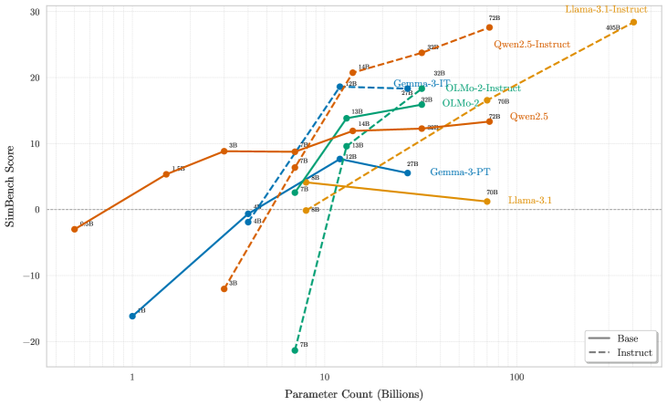
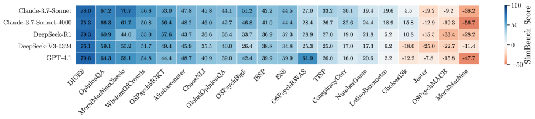
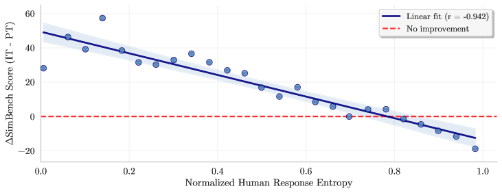
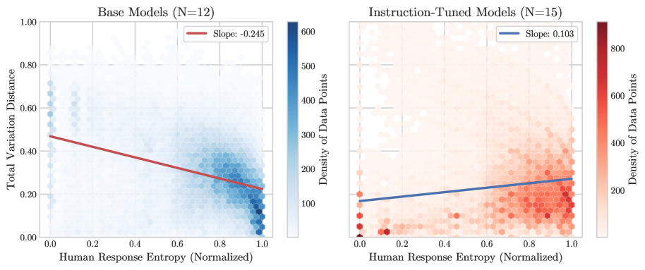
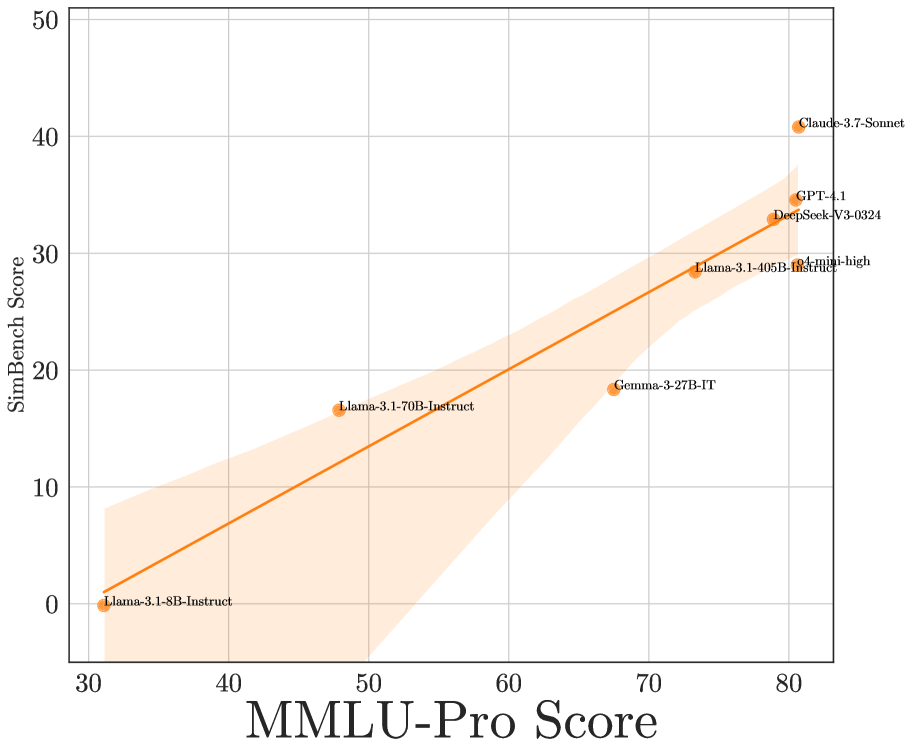
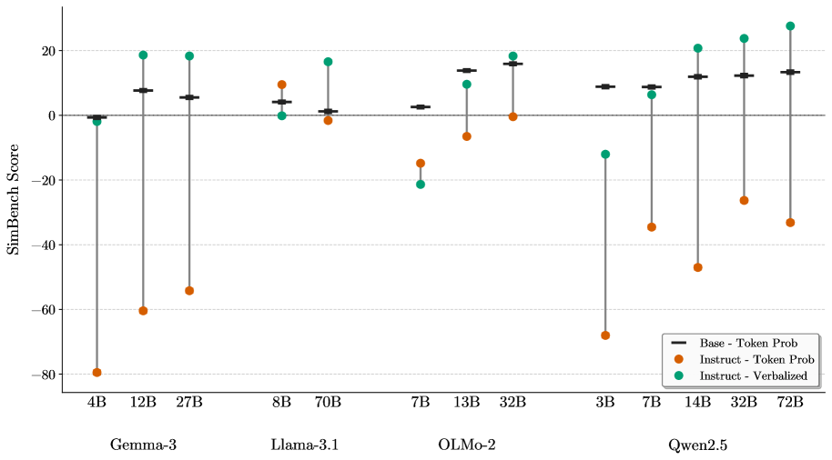

# SimBench: Benchmarking the Ability of Large Language Models to Simulate Human Behaviors

**Authors:** Tiancheng Hu (Cambridge), Joachim Baumann (Zurich), Lorenzo Lupo (Bocconi), Nigel Collier (Cambridge), Dirk Hovy (Bocconi), Paul Röttger (Bocconi)
**Date:** October 23, 2025 (v1)
**Paper:** [PDF](https://arxiv.org/abs/2510.17516)
**Code:** [GitHub](https://github.com/pitehu/SimBench_release/)
**Data:** [HuggingFace](https://huggingface.co/datasets/pitehu/SimBench)
**Website:** [simbench.tiancheng.hu](http://simbench.tiancheng.hu/)

---

## TL;DR

SimBench is the first large-scale, standardized benchmark for evaluating how well LLMs simulate human behavior. It unifies 20 diverse datasets spanning moral decisions, economic choices, psychological assessments, and social surveys across 130+ countries into a single framework with a standardized metric. The headline findings: even the best LLM (Claude-3.7-Sonnet) scores only 40.80/100; simulation ability scales log-linearly with model size; increased test-time compute does NOT help; and there's a fundamental **alignment-simulation tradeoff** where instruction-tuning improves performance on consensus questions but *degrades* it on diverse/contested ones. This paper provides the rigorous evaluation framework that the entire LLM-simulation field has been lacking.

---

## Key Figures

### Figure 1: Simulation Ability Scales Log-Linearly with Model Size

The most important scaling result. SimBench score vs. parameter count across 6 model families (Llama-3.1, Qwen2.5, OLMo-2, Gemma-3), each showing both base (solid) and instruct-tuned (dashed) variants. Clear log-linear relationship: bigger models simulate better. For >10B parameters, instruct-tuned models outperform base; below ~10B, the relationship inverts (base sometimes beats instruct). The steeper instruct slope suggests alignment amplifies scaling benefits for simulation.

### Figure 2: Performance Varies Dramatically Across Datasets

Heatmap of SimBench scores across all 45 models and 20 datasets. Several datasets yield negative scores (Jester, MoralMachine) for most models -- meaning LLMs perform *worse* than a uniform baseline. Other datasets (OSPsychRWAS) see scores above 60 for top models. This variation highlights that "can LLMs simulate humans?" has no single answer -- it depends entirely on *which* human behaviors you're asking about.

### Figure 3: The Alignment-Simulation Tradeoff

The paper's most novel finding. X-axis: normalized entropy of human response distribution (0 = perfect consensus, 1 = maximum disagreement). Y-axis: ΔS (improvement of instruction-tuned over base model). The near-perfect negative linear relationship (r = -0.942) shows that instruction-tuning *helps* on low-entropy consensus questions but *hurts* on high-entropy pluralistic ones. The crossover point is around entropy ≈ 0.8. This is a fundamental tension: alignment optimizes for a single "best" answer, but faithful simulation requires capturing the full spectrum of human disagreement.

### Figure 4: Why the Tradeoff Exists -- Base vs. Instruct TVD Patterns

The mechanism behind the alignment-simulation tradeoff. Left: base models show *negative* slope -- they get *better* (lower TVD) as human responses become more diverse (higher entropy). Right: instruct-tuned models show *positive* slope -- they get *worse* as responses become more diverse. Base models naturally spread probability mass (mass-covering KL), while RLHF-aligned models concentrate on single modes (mode-seeking KL), systematically discarding pluralistic distributions.

### Figure 5: Simulation Correlates Most with Deep Reasoning (MMLU-Pro)

SimBench score vs. MMLU-Pro score for 8 top models. The correlation is remarkably strong: r = 0.939. This means simulation ability is best predicted by deep, knowledge-intensive reasoning -- not by instruction-following (IF-Eval, r = 0.79), chat ability (Arena ELO, r = 0.71), or narrow math skills (AIME, r = 0.48). Simulating human behavior requires broad world knowledge and sophisticated reasoning, not just fluency.

### Figure 6: Instruction-Tuning Effect by Model Family

Base vs. instruct comparison within each model family. For larger models (Qwen2.5, Llama-3.1 at 70B+), instruction-tuning clearly helps. For smaller models (OLMo-2 at 7B/13B, Gemma-3 at small sizes), instruction-tuning can *hurt*. This interaction between model size and alignment is practically important: if you're using a small model for simulation, you may be better off with the base version.

---

## Key Novel Ideas

### 1. Standardized Benchmark Across 20 Diverse Datasets

SimBench unifies 20 datasets into a single evaluation framework:

**Task types:**
- **Decision-making** (Choices13k, MoralMachine): "What would you do?"
- **Self-assessment** (OpinionQA, OSPsychBig5): "How would you describe yourself?"
- **Judgment** (ChaosNLI, Jester): "How would you label this?"
- **Problem-solving** (WisdomOfCrowds): "What's the correct answer?"

**Participant diversity:** 130+ countries across 6 continents, from US crowdworkers to representative global surveys (AfroBarometer, LatinoBarometro, ESS).

**Format harmonization:** All items standardized to multiple-choice. Continuous scales (e.g., Likert) mapped to discrete bins. Maximum 26 choices per question.

**Two evaluation splits:**
- **SimBenchPop** (7,167 test cases): One target per question (aggregate population)
- **SimBenchGrouped** (6,343 test cases): Multiple targets per question, conditioned on demographics

### 2. The SimBench Score Metric

$$S(P, Q) = 100\left(1 - \frac{TVD(P, Q)}{TVD(P, U)}\right) = 100\left(1 - \frac{\sum_i |P_i - Q_i|}{\sum_i |P_i - U_i|}\right)$$

where $P$ = human ground-truth distribution, $Q$ = LLM predicted distribution, $U$ = uniform distribution.

**Interpretation:**
- **S = 100**: Perfect alignment with humans
- **S = 0**: No better than uniform guessing
- **S < 0**: Worse than uniform (actively wrong)

**Why this works:** It measures how much closer the LLM is to the human distribution compared to a naive uniform baseline. It uses Total Variation Distance (TVD) which is symmetric, bounded, and robust to zero probabilities (unlike KL divergence).

**Group-level, not individual:** SimBench evaluates whether the LLM's output *distribution* matches the *distribution* of human responses, not whether it matches any individual human. This is the right level of analysis for simulation -- you want to replicate population-level patterns, not any single person's choices.

### 3. The Alignment-Simulation Tradeoff

The paper's most important theoretical contribution. Instruction-tuning (RLHF/DPO) systematically improves simulation of consensus views but degrades simulation of diverse opinions.

**Theoretical explanation via KL divergence:**

Pre-training minimizes **mass-covering** KL: $D_{KL}(p \| q)$
- Model $q$ places probability everywhere the data $p$ has mass
- Naturally represents the full diversity of human responses
- Good at capturing multi-modal, pluralistic distributions

RLHF alignment minimizes **mode-seeking** KL: $D_{KL}(q \| \sigma)$
- Model $q$ concentrates on the single highest-reward mode
- Ignores other valid modes
- **Systematically discards pluralistic distributions**

**Quantified via causal mediation:**
- **Direct effect** of instruction-tuning: +6.46 (improved instruction-following)
- **Indirect effect** via reduced output entropy: -1.74 (harmful entropy compression)
- **Net**: Positive for consensus questions, negative for diverse questions

**Practical implication:** The most faithful future simulators will need to combine the instruction-following benefits of alignment with the distributional diversity of base models. Neither pure approach is sufficient.

### 4. Test-Time Compute Does NOT Help Simulation

A striking negative result. Across four experiments:
- **o4-mini** (low → high reasoning effort): 28.20 → 29.54 (+1.34)
- **Claude-3.7-Sonnet** (no thinking → 4K budget): 40.51 → 39.46 (-1.05)
- **GPT-4.1** (zero-shot → CoT): 34.90 → 33.11 (-1.79)
- **DeepSeek-V3** (zero-shot → CoT): 33.14 → 33.16 (+0.02)

**Why:** Chain-of-thought enforces explicit, step-by-step reasoning. But many human decisions rely on fast, intuitive heuristics (System 1 thinking). Forcing deliberate reasoning *overrides* the intuitive patterns that make the model's outputs human-like. This directly contrasts with math/coding tasks where more thinking always helps.

### 5. Demographic Group Simulation is Harder

When asked to simulate specific demographic groups (e.g., "respond as a 65-year-old conservative Christian"), all models perform worse than when simulating the general population.

**Most challenging to condition on:**
- Religiosity/practice: ΔS = -9.91
- Political ideology: ΔS = -4.97
- Religious affiliation: ΔS = -4.83

**Least challenging:**
- Gender: ΔS = -1.24
- Age: ΔS = -1.50

**Why this matters:** Applications like SimAB and Agent A/B rely on demographic conditioning to produce subgroup-specific insights. SimBench shows that the *exactly the groups where subgroup analysis matters most* (politically divided, religiously diverse) are the hardest for LLMs to simulate accurately.

---

## Key Results

### Top Model Performance (SimBenchPop)

| Model | SimBench Score |
|---|---|
| Claude-3.7-Sonnet | **40.80** |
| Claude-3.7-Sonnet (4K thinking) | 39.46 |
| GPT-4.1 | 34.55 |
| DeepSeek-R1 | 34.52 |
| DeepSeek-V3-0324 | 33.24 |
| Llama-3.1-405B-Instruct | 28.40 |
| Qwen2.5-72B-Instruct | 23.55 |
| Majority of 45 models | < 20 |
| 9 models | < 0 (worse than uniform) |

### Scaling with Model Size (Llama-3.1 Family)

| Model | Size | SimBench Score |
|---|---|---|
| Llama-3.1 (base) | 8B | -2.53 |
| Llama-3.1 (base) | 70B | -2.81 |
| Llama-3.1-Instruct | 8B | 3.77 |
| Llama-3.1-Instruct | 70B | 18.26 |
| Llama-3.1-Instruct | 405B | 28.40 |

### Correlation with Other Benchmarks

| Benchmark | Correlation (r) |
|---|---|
| **MMLU-Pro** (deep reasoning) | **0.939** |
| GPQA Diamond (grad-level QA) | 0.860 |
| IF-Eval (instruction following) | 0.790 |
| Chatbot Arena ELO | 0.710 |
| OTIS AIME (math competition) | 0.480 |

---

## Key Takeaways

1. **Even the best LLM scores only 40.80/100 at simulating human behavior.** This means current predictions are still closer to uniform guessing than to matching real human distributions. The field is far from reliable simulation.

2. **Simulation ability scales log-linearly with model size.** Bigger models simulate better, consistently across model families. This suggests that future, larger models may eventually reach high-fidelity simulation -- but we're not there yet.

3. **Test-time compute (CoT, thinking tokens) does NOT improve simulation.** This is the opposite of math/coding where more thinking always helps. Human behavior is often intuitive (System 1), and forcing deliberate reasoning overrides these intuitive patterns. The "Rethinking Thinking Tokens" PDR approach likely wouldn't help simulation either.

4. **The alignment-simulation tradeoff is fundamental.** Instruction-tuning helps on consensus questions (+40 points for lowest-entropy) but hurts on diverse questions (-10+ points for highest-entropy). RLHF's mode-seeking objective systematically discards the pluralistic distributions that faithful simulation requires. The correlation is r = -0.942 -- nearly perfect.

5. **Base models are better at capturing human disagreement.** Pre-training's mass-covering KL objective naturally represents multi-modal distributions. For high-entropy questions where humans genuinely disagree, base models outperform instruction-tuned ones. This has direct implications for choosing models in simulation applications.

6. **Simulation performance varies enormously by task.** Some datasets yield 60+ scores (personality assessments), others consistently negative scores (humor, moral dilemmas). There's no single answer to "can LLMs simulate humans?" -- it depends entirely on what behavior you're asking about.

7. **Demographic group simulation is harder, especially for contentious attributes.** Religiosity and political ideology conditioning causes the largest performance drops (-5 to -10 points). Gender and age are easier. This undermines the premise of demographic-conditioned simulation tools that rely on subgroup accuracy.

8. **Simulation ability is best predicted by deep reasoning, not chat fluency.** The r = 0.939 correlation with MMLU-Pro (knowledge-intensive reasoning) dwarfs the correlation with Arena ELO (r = 0.71) or math (r = 0.48). Simulating humans requires broad world knowledge, not narrow expertise.

9. **This benchmark is fully open and reproducible.** All 20 datasets, both evaluation splits, code, and prompts are publicly available. This makes SimBench the gold standard for evaluating simulation claims.

10. **The results contextualize the entire LLM-simulation literature.** Papers like Agent A/B, SimAB, and UXAgent claim their agents produce "meaningful" or "directional" behavioral signals. SimBench quantifies exactly how limited current simulation fidelity is (40.80 best case) and identifies the fundamental barriers (alignment tradeoff, demographic conditioning challenges).

---

## What's Open-Sourced

- **Benchmark dataset:** [HuggingFace](https://huggingface.co/datasets/pitehu/SimBench) -- all 20 processed datasets with SimBenchPop and SimBenchGrouped splits
- **Code:** [GitHub](https://github.com/pitehu/SimBench_release/) -- evaluation code, prompts, and analysis scripts
- **Website:** [simbench.tiancheng.hu](http://simbench.tiancheng.hu/) -- interactive results explorer
- **Data cards:** Detailed documentation for each of the 20 constituent datasets
- **Prompts:** Exact prompts for both base and instruction-tuned model elicitation (Appendix D)
- **Licensing:** CC-BY-NC-SA 4.0 for SimBench framework; individual dataset licenses documented
- **No raw individual-level data:** Only aggregated group-level distributions (privacy-preserving)
