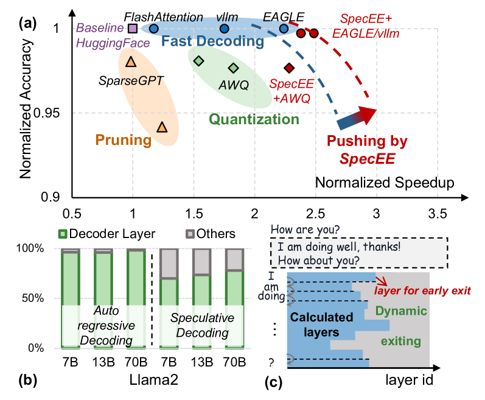
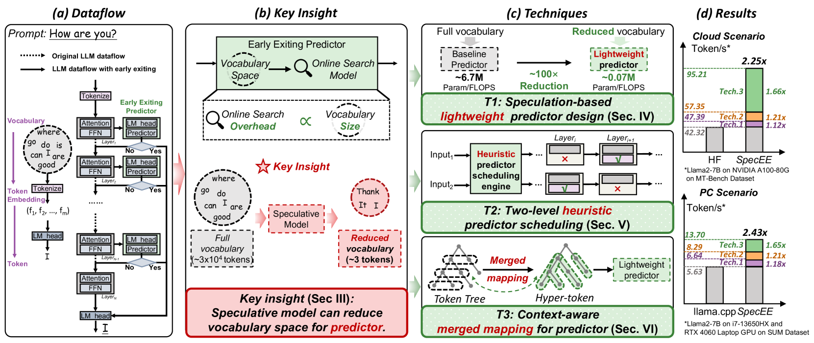
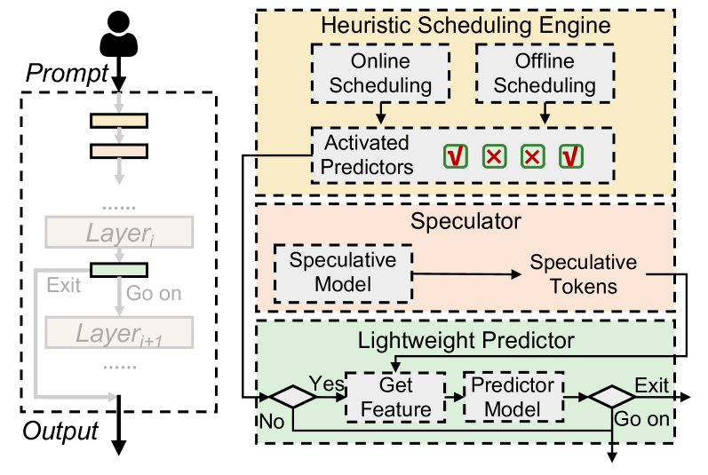
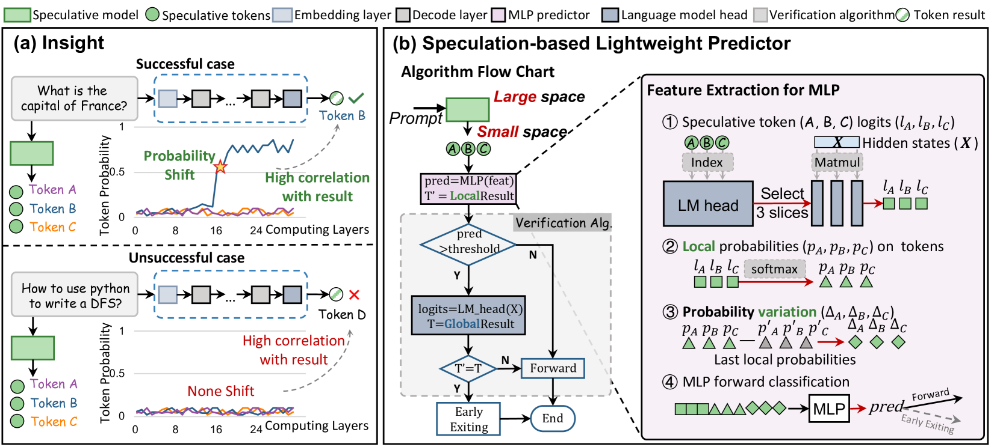
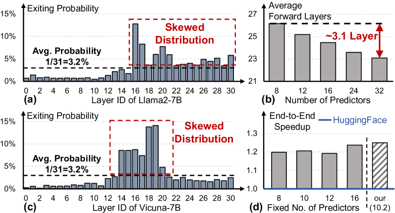
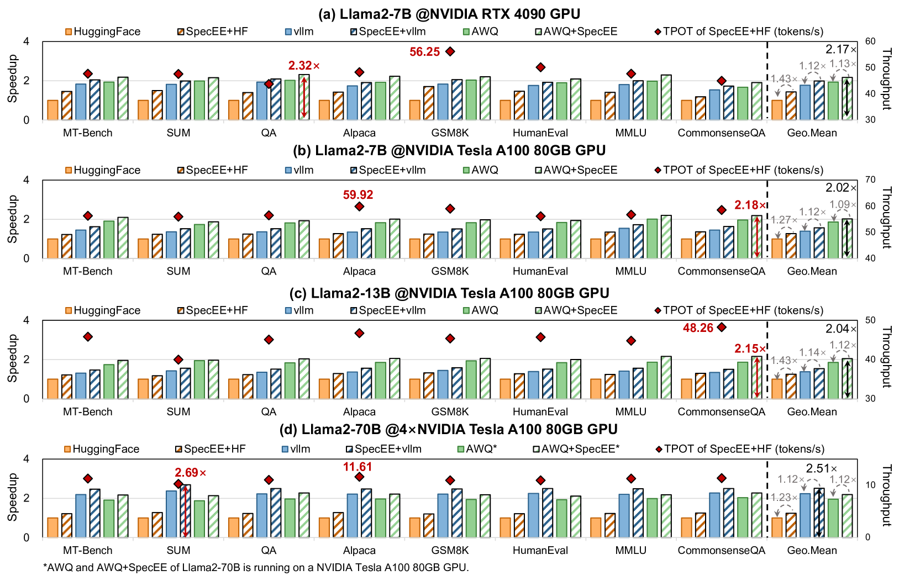
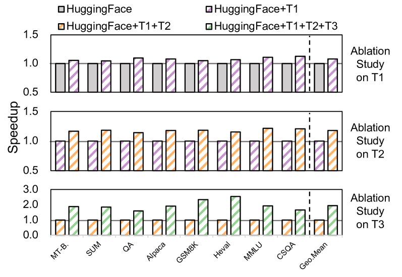

# SpecEE: Accelerating Large Language Model Inference with Speculative Early Exiting

**Authors:** Jiaming Xu, Jiayi Pan, Yongkang Zhou, Siming Chen, Jinhao Li, Yaoxiu Lian, Junyi Wu, Guohao Dai

**Date:** April 11, 2025

**Link:** [https://arxiv.org/abs/2504.08850](https://arxiv.org/abs/2504.08850)

---

## TL;DR

SpecEE is an LLM inference engine that uses a speculative draft model to shrink the vocabulary search space for early exiting predictors by 10,000x. It combines three techniques -- a lightweight MLP predictor exploiting probability shift, a two-level heuristic scheduling engine that only activates predictors at layers likely to exit, and a context-aware merged mapping that turns exponential tree-decoding complexity into linear -- to achieve 2.25x speedup on Llama2-7B (cloud) and 2.43x on PC with negligible accuracy loss (<1%).

---

## Key Figures

### Figure 1: Pareto Frontier and Motivation


**(a)** Shows the accuracy vs. speedup tradeoff for various LLM acceleration techniques. SpecEE (combined with EAGLE/vllm) pushes the Pareto frontier to ~2.5-3.5x speedup while maintaining near-1.0 normalized accuracy. Pruning and quantization sacrifice accuracy for speed. Fast decoding (FlashAttention, vllm, EAGLE) preserves accuracy but with limited speedup. SpecEE sits uniquely at the frontier. **(b)** Decoder layers consume 70-95% of end-to-end inference time across Llama2-7B/13B/70B for both autoregressive and speculative decoding -- the primary bottleneck. **(c)** Different tokens need different numbers of forward layers, motivating dynamic early exiting.

### Figure 2: SpecEE Overview


End-to-end overview of the SpecEE approach. **(a)** Dataflow showing original LLM inference vs. early exiting path. **(b)** Key insight: a speculative model reduces the full vocabulary (~30K tokens) to a handful of candidate tokens, shrinking predictor search space by ~10,000x. **(c)** The three techniques (T1: lightweight predictor, T2: heuristic scheduling, T3: merged mapping). **(d)** Combined results: 2.25x cloud speedup, 2.43x PC speedup.

### Figure 3: SpecEE Architecture


The system has three components: (1) a **Heuristic Scheduling Engine** (online + offline) that decides which layer-predictors to activate, (2) a **Speculator** that generates speculative tokens via a draft language model (DLM), and (3) a **Lightweight Predictor** at activated layers that extracts features, runs the MLP, and decides exit vs. continue.

### Figure 4: Probability Shift and Predictor Design


**(a)** The "probability shift" insight: when the correct result is among speculative tokens, one token's probability spikes sharply at some layer while others stay flat. When the correct token is NOT among speculative tokens, all probabilities remain low and stable. This is the signal the predictor learns to detect. **(b)** The algorithm flowchart showing feature extraction (speculative token logits, local probabilities, probability variation) feeding into the MLP predictor, followed by a verification step using the full LM head.

### Figure 5: Skewed Distribution and Scheduling


**(a, c)** Exit probability is heavily skewed across layers for both Llama2-7B and Vicuna-7B. About 50% of layers have exit probability below the average (3.2%), meaning predictors at those layers are rarely useful. **(b)** Blindly reducing the number of predictors with random positions increases average forward layers by ~3.1. **(d)** SpecEE's dynamic predictor selection (~10.2 layers) achieves the highest speedup compared to any fixed number.

### Figure 6: Cloud Autoregressive Speedup Results


Comprehensive speedup and throughput results across Llama2-7B/13B/70B on RTX 4090 and A100 GPUs. SpecEE+HF achieves up to 2.32x speedup (GSM8K on 4090). The geometric mean speedup is 2.17x (7B, 4090), 2.02x (7B, A100), 2.04x (13B, A100), and 2.51x (70B, 4xA100). Throughput (tokens/s) improves proportionally. SpecEE stacks on top of vllm and AWQ, pushing both further.

### Figure 7: Ablation Study


Incremental contribution of each technique on Llama2-7B (A100). T1 alone (speculation-based predictor) gives ~1.08x. Adding T2 (scheduling) reaches ~1.27x. Adding T3 (merged mapping for speculative decoding) reaches the full ~2.25x. The jump from T2 to T3 is the largest because speculative decoding itself provides a major throughput gain, and T3 enables early exiting to work efficiently within it.

---

## Key Novel Ideas

### 1. Vocabulary as Search Space -- The Core Insight

The paper's foundational observation: in early exiting, the LLM vocabulary IS the predictor's search space. The LM Head (a `hidden_dim x vocabulary_size` matrix, e.g., 4096 x 32000 in Llama2) must be traversed at every layer to check if the token prediction has converged. This traversal alone costs ~20% of total inference latency.

**The fix:** Use a speculative draft language model (DLM, e.g., EAGLE) to generate a small set of candidate tokens (4 tokens). Instead of multiplying hidden states by the full LM Head, multiply by only the columns corresponding to these 4 tokens. This is a `hidden_dim x 4` operation -- a **10,000x reduction** in search space.

### 2. Probability Shift as Prediction Signal

Rather than feeding raw high-dimensional hidden states (5000+ dims) into the predictor, the paper identifies a clean low-dimensional signal called **probability shift**:

- If the correct output token is among the speculative tokens, its local probability (softmax over only speculative tokens) **spikes sharply** at some layer.
- If the correct token is NOT among speculative tokens, all local probabilities remain **flat and low**.

Three features are extracted per layer (total dimension = 12 for 4 speculative tokens):

1. **Speculative token logits**: `hidden_states @ speculative_lm_head` (shape: 1 x hidden_dim x 4). Raw confidence scores.
2. **Local probabilities**: `softmax(speculative_token_logits)`. Likelihood within the reduced space.
3. **Probability variation**: `local_prob[layer_i] - local_prob[layer_{i-1}]`. Captures the "shift" across layers.

All three are needed because any two alone create ambiguous cases (Figure 6 in the paper demonstrates specific failure modes).

### 3. Lightweight MLP Predictor

The predictor is a 2-layer MLP with hidden dim 512:

```
Input (12-dim) -> Linear(12, 512) -> ReLU -> Linear(512, 1) -> Sigmoid -> threshold at 0.5
```

This replaces SVMs used in prior work (AdaInfer). Key advantages:
- **~100x fewer parameters and FLOPs** than prior predictors (which needed to handle 5000+ dim inputs).
- **GPU-friendly**: MLPs map naturally to Tensor Cores; SVMs do not.
- **Total predictor memory**: only 416KB for all 32 predictors in Llama2-7B: `(12*512 + 512*1) * 32 layers * 4 bytes / 1024`.

A **verification step** follows: after the MLP says "exit," the full LM Head is computed once to check if the argmax token matches a speculative token. If not, inference continues.

### 4. Two-Level Heuristic Predictor Scheduling

Not all layers need predictors. The paper identifies two properties:

**Skewed distribution (offline):** ~50% of layers have exit probability below average (3.2%). These layers are nearly useless for prediction. Offline profiling ranks layers by exit frequency and prunes the bottom half.

**Context similarity (online):** The exit layer of the current token has ~80% probability of being within +/-2 layers of the exit layers of the last 5 tokens. This is far higher than the ~31.8% expected by chance.

The scheduling approach:
- **Offline:** Run extensive inference to compute per-layer exit frequency histograms. Select the top-frequency layers. This is model-specific, done once.
- **Online:** Maintain a circular queue of length 5 (last 5 exit positions). Activate predictors at those positions +/-2 layers.
- **Final set:** Union of offline-selected layers and online-predicted layers. Results in ~10.2 active predictors (vs. 32 total) -- a 68% reduction.

### 5. Context-Aware Merged Mapping for Speculative Decoding

In speculative decoding, the DLM generates a tree of tokens (e.g., top-3 at each level). Naively, each token in the tree needs its own early-exiting predictor, giving **exponential** mapping complexity.

Key insight: tokens along a tree path share contextual relationships, so their exit layers are clustered (by context similarity). The paper merges each root-to-leaf path into a single **hyper-token**. This reduces:
- Exponential mapping complexity -> **linear** complexity (one predictor per path, not per node).
- The exit position for a hyper-token is the maximum exit layer among its constituent tokens (Cannikin law / bottleneck principle).

**GPU implementation:** Custom group-GEMM kernel built on CUTLASS and MegaBlocks. Each hyper-token needs its own speculative_lm_head slice (different speculative tokens per path), so a block-wise GEMM computes all hyper-token features in parallel.

---

## Architecture Details

SpecEE wraps around any existing LLM without modifying its parameters. The data flow:

1. **Input prompt** enters the system.
2. **Heuristic Scheduling Engine** determines which layers have active predictors (offline config + online context queue).
3. **Speculative Model** (EAGLE DLM, ~3% memory/compute overhead) generates 4 speculative tokens.
4. **For each decoder layer i:**
   - Compute layer i normally (attention + FFN).
   - If predictor is active at layer i:
     - Extract 3 features from hidden states using the speculative_lm_head (a 4-column slice of the full LM Head).
     - Feed 12-dim features into MLP predictor.
     - If MLP output > 0.5: run verification (full LM Head argmax check).
       - If verified: **exit early**, output token.
       - If not verified: continue to layer i+1.
   - If predictor is not active: continue to layer i+1.
5. If no early exit by final layer: output token normally.

For **speculative decoding** mode:
- DLM generates a tree of draft tokens.
- Tree paths are merged into hyper-tokens.
- Each hyper-token is processed as if it were a single token in autoregressive early exiting.
- Custom group-GEMM kernel handles variable-length speculative_lm_head slices per hyper-token.

---

## Training Pipeline

SpecEE requires minimal training, and the original LLM parameters are never modified:

### Speculative Model (DLM)
- Uses EAGLE's open-source draft model.
- ~3% memory and inference overhead of the original LLM.
- Training: ~24 hours on a single RTX 3090 (for Llama2-7B). Pre-trained models available.

### Predictor Training
1. **Data collection (~1 hour on A100):** Run inference on MT-Bench prompts. At each intermediate layer (0-30 for Llama2-7B), extract the 12-dim features. Label = True if early-exit token matches the full-model token, False otherwise.
2. **Training (~10 minutes total):** Train each layer's MLP on ~16K samples. Only ~2% of training data (~320 samples) is needed for good performance (Figure 18).
3. **Total parameters per predictor:** `12*512 + 512*1 = 6,656` parameters. Negligible.

### Offline Scheduling
- Run inference with all 32 predictors active using diverse prompts.
- Record exit frequency per layer.
- Rank and select top layers. Stored as a model config parameter. One-time cost.

---

## Key Results

### Accuracy (Table 4)

| Model | Method | MMLU | CommonsenseQA | SST2 | GSM8K | SUM (PPL) | MT-Bench (PPL) | Alpaca (PPL) | Avg Layers |
|-------|--------|------|---------------|------|-------|-----------|----------------|-------------|------------|
| **Llama2-7B (32L)** | Dense | 45.30 | 61.43 | 86.24 | 20.62 | 10.09 | 6.49 | 6.86 | 32 |
| | AdaInfer | 43.73 | 53.00 | - | 0.00 | - | - | - | 28.91 |
| | **SpecEE** | **44.64** | **61.26** | **85.69** | **20.00** | **10.69** | **8.44** | **6.32** | **23.16** |
| | AWQ+SpecEE | 44.45 | 59.05 | 84.98 | 22.11 | 8.08 | 5.34 | 5.38 | 23.27 |
| **Llama2-13B (40L)** | Dense | 53.58 | 67.57 | 93.00 | 33.87 | 8.76 | 6.64 | 4.93 | 40 |
| | **SpecEE** | **53.37** | **67.16** | **92.78** | **33.58** | **7.23** | **7.76** | **4.82** | **24.93** |
| **Llama2-70B (80L)** | Dense | 60.74 | 76.82 | 94.27 | 55.79 | 5.88 | 4.25 | 2.44 | 80 |
| | **SpecEE** | **60.54** | **76.74** | **94.04** | **55.79** | **6.07** | **3.85** | **1.94** | **53.25** |

SpecEE achieves <1% accuracy loss across all tasks while using only ~72% of layers (23/32 for 7B, 25/40 for 13B, 53/80 for 70B). AdaInfer degrades badly (0% GSM8K, -8 pts CSQA).

### Speedup (Cloud -- Autoregressive Decoding)

| Model | GPU | vs. HuggingFace | vs. vllm | vs. AWQ |
|-------|-----|-----------------|----------|---------|
| Llama2-7B | RTX 4090 | 1.43x | 1.12x | 1.13x |
| Llama2-7B | A100 | 1.27x | 1.12x | 1.09x |
| Llama2-13B | A100 | 1.43x | 1.14x | 1.12x |
| Llama2-70B | 4xA100 | 1.23x | 1.12x | 1.12x |

### Speedup (Cloud -- With Speculative Decoding)

| Model | GPU | vs. EAGLE |
|-------|-----|-----------|
| Llama2-7B | A100 | 1.05x |
| Llama2-13B | A100 | 1.06x |

### Overall Speedup (Stacking All Techniques)

| Model | Scenario | vs. Baseline | Baseline |
|-------|----------|-------------|----------|
| Llama2-7B | Cloud (RTX 4090) | **2.17x** | HuggingFace |
| Llama2-7B | Cloud (A100) | **2.25x** | HuggingFace |
| Llama2-13B | Cloud (A100) | **2.04x** | HuggingFace |
| Llama2-70B | Cloud (4xA100) | **2.51x** | HuggingFace |
| Llama2-7B | PC (Lenovo) | **2.43x** | llama.cpp |

### PC Scenario

| Baseline | Speedup |
|----------|---------|
| llama.cpp | 1.25x |
| PowerInfer | 1.15x |

### Hardware Efficiency
- **Power reduction:** 201W -> 182W on A100 (~10% reduction, ~1.57x energy efficiency).
- **Memory overhead:** +0.9GB (7B) and +1.4GB (13B), dominated by the DLM. Predictors themselves total only 416KB.
- **Predictor runtime overhead:** 0.0009 s/token = 5.6% of inference latency.

### Ablation Study (Llama2-7B, A100)

| Technique | Incremental Speedup | Geo. Mean Speedup |
|-----------|--------------------|--------------------|
| T1: Speculation-based predictor | +8% | 1.08x |
| T1+T2: + Heuristic scheduling | +19% | 1.27x |
| T1+T2+T3: + Merged mapping (speculative decoding) | +98% | 2.25x |

---

## Key Takeaways

1. **Vocabulary IS the search space.** The LM Head traversal for early-exiting prediction costs ~20% of inference. Using a speculative model to pre-select 4 candidate tokens reduces this 10,000x -- a clean, powerful insight.

2. **Probability shift is a strong, low-dimensional signal.** Instead of feeding 5000+ dim hidden states into the predictor, monitoring how local probabilities change across layers (12-dim features) captures nearly all the information needed for exit decisions.

3. **Not all layers need predictors.** Exit probability is heavily skewed: ~50% of layers account for <20% of exits. Offline profiling + online context tracking reduces active predictors by 68% (from 32 to ~10.2 layers) while maintaining exit accuracy.

4. **Context similarity is real and exploitable.** The exit layer of token N has ~80% probability of being within +/-2 layers of the previous 5 tokens' exit layers. This enables efficient online scheduling without any learning.

5. **Speculative decoding + early exiting compose well.** The hyper-token abstraction (merging tree paths into single units) is elegant: it reduces exponential mapping complexity to linear while exploiting the same context similarity property.

6. **Training cost is negligible.** The full SpecEE pipeline (DLM + predictors + offline scheduling) requires ~25 hours on a single RTX 3090. The predictor alone takes ~10 minutes. No modification to the original LLM.

7. **Orthogonal to existing techniques.** SpecEE stacks cleanly on top of FlashAttention/vllm (fast decoding), AWQ (quantization), PowerInfer (sparsification), and EAGLE (speculative decoding). It consistently adds value on top of each.

8. **Significant real-world speedup.** 2.25x on cloud, 2.43x on PC -- with <1% accuracy loss. These numbers compound with other techniques to push the Pareto frontier.

9. **Energy efficiency matters.** SpecEE reduces A100 power by ~10% (201W to 182W) because predictors are memory-bound operations that underutilize compute. The authors suggest big-little core GPU designs could amplify this.

10. **Scales across model sizes.** Results hold for 7B, 13B, and 70B models. The 70B model actually benefits most (2.51x) because deeper models have more layers that can be skipped, and each skipped layer saves more absolute time.

---

## What's Open-Sourced

The paper does not mention an official code release. The speculative model uses EAGLE's open-source draft models. The implementation details describe PyTorch + C++/CUDA for cloud and C++ (llama.cpp-based) for PC, with custom CUTLASS/MegaBlocks-based kernels for group GEMM.
