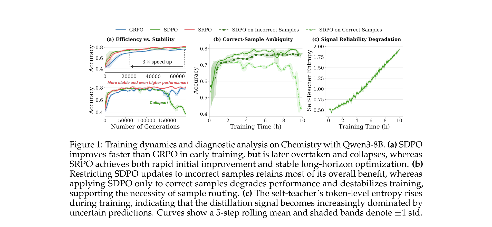
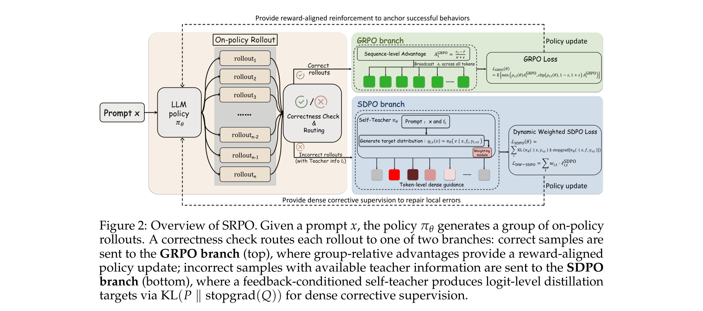
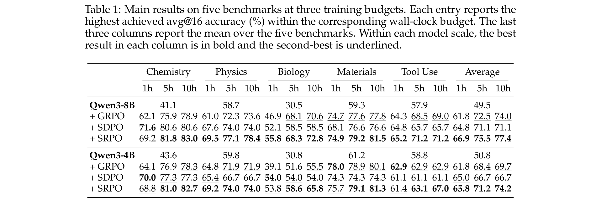
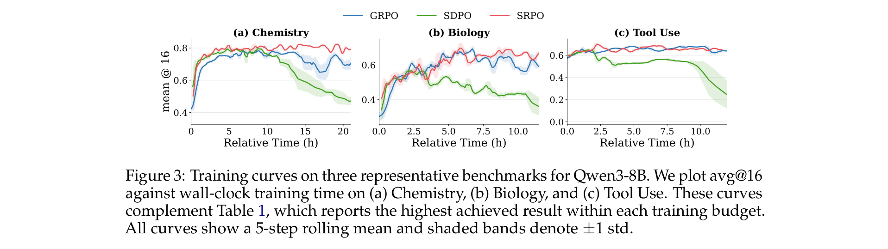
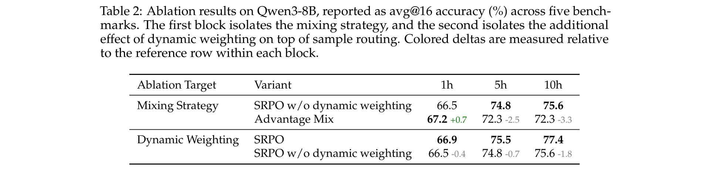
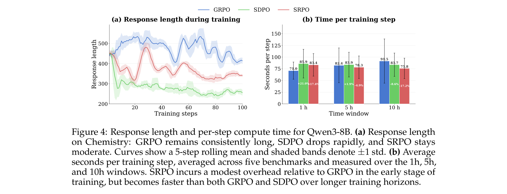

# Unifying Group-Relative and Self-Distillation Policy Optimization via Sample Routing (SRPO)

**Authors:** Gengsheng Li, Tianyu Yang, Junfeng Fang, Mingyang Song, Mao Zheng, Haiyun Guo, Dan Zhang, Jinqiao Wang, Tat-Seng Chua
**Affiliations:** Chinese Academy of Sciences, National University of Singapore, Tencent, Wuhan AI Research
**Date:** April 2, 2026
**Paper:** [PDF](https://arxiv.org/pdf/2604.02288)
**Status:** Working in Progress

---

## TL;DR

GRPO (reward-based RL) is stable but coarse — it gives every token the same credit. SDPO (self-distillation) gives dense token-level guidance but collapses after early gains. SRPO routes each sample to the right method: correct rollouts go to GRPO (stable reinforcement), failed rollouts go to SDPO (dense error correction). An entropy-aware weighting mechanism further suppresses noisy self-teacher predictions. On Qwen3-8B across five benchmarks, SRPO beats GRPO by 3.4% and SDPO by 6.3% at 10 hours of training, while being 17.2% faster per step at that point.

---

## Key Figures

### Figure 1: Why SDPO Fails — Three Diagnostic Panels

Three panels that motivate the entire paper. **(a)** SDPO (green) starts faster than GRPO (blue) but then collapses; SRPO (red) gets the best of both. **(b)** Applying SDPO only to incorrect samples keeps most of its benefit; applying it only to correct samples degrades and destabilizes training. This proves sample routing is necessary. **(c)** The self-teacher's token-level entropy rises during training — its predictions become less reliable over time, causing the late-stage collapse.

### Figure 2: SRPO Architecture

The routing mechanism. After on-policy rollout, a correctness check splits samples into two branches. Correct rollouts go to the **GRPO branch** (top) — they get the standard sequence-level advantage and reward-aligned reinforcement. Incorrect rollouts (with available teacher info) go to the **SDPO branch** (bottom) — a feedback-conditioned self-teacher provides dense token-level logit guidance, with dynamic weighting to suppress unreliable predictions.

### Table 1: Main Results

SRPO consistently achieves the highest peak accuracy across both model scales and all training budgets. On Qwen3-8B at 10h: SRPO averages 77.4 vs. GRPO's 74.0 and SDPO's 71.1. On Qwen3-4B at 10h: SRPO averages 74.2 vs. GRPO's 69.7 and SDPO's 66.7. SDPO's 5h and 10h scores are often identical — it saturates early and then stalls.

### Figure 3: Training Curves

Three representative benchmarks on Qwen3-8B. **(a) Chemistry:** SDPO leads early but SRPO overtakes by 5h and reaches 83.0 at 10h (vs. 80.6 SDPO, 78.9 GRPO). **(b) Biology:** SDPO stalls at 58.5 while SRPO climbs to 72.8. **(c) Tool Use:** SDPO degrades over time; SRPO stays stable and tracks/exceeds GRPO. Pattern: when self-distillation helps, SRPO exploits it; when it hurts, SRPO's GRPO branch prevents drift.

### Table 2: Ablation Results

Two key findings. **(1) Routing > Mixing:** An "Advantage Mix" that blends GRPO and SDPO signals at the advantage level gets +0.7 at 1h but falls behind by -3.3 at 10h. Sample routing stays strong. **(2) Dynamic weighting adds late-stage gains:** +0.4 at 1h growing to +1.8 at 10h, precisely when the self-teacher becomes noisier.

### Figure 4: Response Length and Compute Cost

**(a)** GRPO produces the longest responses (verbose), SDPO the shortest (suppresses epistemic reasoning), SRPO lands in between — moderate length with better quality. **(b)** Per-step compute cost: SRPO starts 17.4% slower than GRPO (extra teacher forward passes) but becomes 17.2% faster by 10h, because as the model improves, fewer samples are routed to the expensive SDPO branch.

---

## Key Novel Ideas

### 1. Two Intrinsic Failure Modes of Self-Distillation (SDPO)

The paper identifies *why* SDPO collapses after initial gains — not just that it does:

**Failure mode 1: Optimization ambiguity on correct samples.** In SDPO, the self-teacher is conditioned on a successful sibling rollout. When applied to an *already-correct* rollout, this forces the model to match a different but equally valid reasoning path. There's no reason rollout A should look like rollout B when both reach the same correct answer. This imposes arbitrary preferences between equivalent solutions, creating conflicting gradients.

Evidence: Figure 1(b) shows that restricting SDPO to only incorrect samples retains most of its benefit, while applying it only to correct samples *degrades* performance.

**Failure mode 2: Self-teacher signal degradation.** The self-teacher and student share parameters (they're the same model). As training progresses, the gap between teacher and student shrinks, so the teacher's "corrections" become less informative. Worse, Figure 1(c) shows the self-teacher's token-level entropy *rises* — its predictions become increasingly uncertain. Dense guidance from an uncertain teacher is noise, not signal.

### 2. Sample-Level Routing: The Right Signal for Each Sample

SRPO's core mechanism is simple: route each sample to the optimization signal best suited to its status.

For each rollout $y_i$, define:
- $c_i = \mathbb{1}[y_i \text{ is correct}]$ — correctness flag
- $m_i = \mathbb{1}[\text{teacher info available for } y_i]$ — teacher availability flag

The routing masks are:
$$z_i^\text{SDPO} = (1 - c_i) \cdot m_i, \qquad z_i^\text{GRPO} = 1 - z_i^\text{SDPO}$$

In words: only incorrect rollouts *with available teacher information* go to the SDPO branch. Everything else — correct rollouts, and incorrect rollouts without teacher info — goes to the GRPO branch.

Why this works:
- **Correct rollouts** → GRPO. The sequence-level reward is sufficient; dense correction would introduce ambiguity between equivalent valid solutions.
- **Incorrect rollouts** → SDPO. The token-level teacher guidance can pinpoint exactly where the reasoning went wrong, providing the fine-grained error correction that GRPO's uniform penalty can't.

The routing naturally adapts over training: early on, when many rollouts fail, SDPO handles a large fraction of samples, driving rapid improvement. Later, as the model improves, more rollouts succeed and shift to GRPO, stabilizing optimization.

### 3. Entropy-Aware Dynamic Weighting (DW-SDPO)

Even within the SDPO branch, not all tokens receive equally reliable teacher guidance. The self-teacher is more confident about some tokens than others.

For each token position $t$ in rollout $i$ on the SDPO branch, let $q_{i,t}(v) = \pi_\theta(v \mid x, f_i, y_{i,<t})$ be the self-teacher distribution and $H_{i,t} = -\sum_v q_{i,t}(v) \log q_{i,t}(v)$ its entropy. The unnormalized weight is:

$$\tilde{w}_{i,t} = \exp(-\beta H_{i,t})$$

where $\beta > 0$ (default: 1) controls sensitivity to entropy. This is then normalized across all valid SDPO tokens to preserve the overall loss scale:

$$w_{i,t} = \frac{\tilde{w}_{i,t}}{\frac{1}{|\Omega_\text{sdpo}|} \sum_{(j,s) \in \Omega_\text{sdpo}} \tilde{w}_{j,s}}$$

Low entropy → confident teacher → high weight → strong correction. High entropy → uncertain teacher → low weight → suppressed noise.

The weighted SDPO loss is: $\ell_{i,t}^\text{DW-SDPO} = w_{i,t} \cdot \ell_{i,t}^\text{SDPO}$

This becomes increasingly important as training progresses and the teacher's average entropy rises (Figure 1(c)): it automatically emphasizes the remaining confident signals while filtering out noise.

### 4. Unified Objective with Natural Mixing

The final loss simply aggregates the routed losses, weighted by token count:

$$\mathcal{L}_\text{final} = \frac{\sum_{i,t} z_i^\text{GRPO} \ell_{i,t}^\text{GRPO} + \sum_{i,t} z_i^\text{SDPO} \ell_{i,t}^\text{DW-SDPO}}{\sum_{i,t} z_i^\text{GRPO} + \sum_{i,t} z_i^\text{SDPO}}$$

The denominator normalizes by total routed tokens, so each branch contributes proportionally to the number of tokens it handles. No mixing hyperparameter is needed — the balance between GRPO and SDPO naturally shifts as the model improves:
- **Early training** (many failures): SDPO handles more tokens → dense correction dominates
- **Late training** (more successes): GRPO handles more tokens → reward-anchored optimization dominates

This is cleaner than advantage-level mixing (which requires a $\lambda$ hyperparameter and propagates SDPO noise into correct samples).

---

## Key Results

### Main Results — Peak avg@16 Accuracy (%)

| | Chemistry | Physics | Biology | Materials | Tool Use | **Average** |
|---|---|---|---|---|---|---|
| **Qwen3-8B** | | | | | | |
| GRPO (10h) | 78.9 | 61.0 | 68.1 | 77.8 | 69.0 | 74.0 |
| SDPO (10h) | 80.6 | 74.0 | 58.5 | 76.6 | 65.7 | 71.1 |
| **SRPO (10h)** | **83.0** | **77.1** | **68.3** | **79.2** | **71.2** | **77.4** |
| **Qwen3-4B** | | | | | | |
| GRPO (10h) | 82.7 | 69.2 | 65.8 | 79.1 | 67.0 | 74.2* |
| SDPO (10h) | 77.3 | 65.4 | 54.0 | 74.3 | 61.1 | 66.7 |
| **SRPO (10h)** | **81.0** | **74.0** | **58.6** | **75.7** | **63.1** | **74.2** |

*SRPO improves the 5-benchmark average on Qwen3-8B by +3.4 over GRPO and +6.3 over SDPO.*

### Compute Efficiency (Qwen3-8B, seconds per training step)

| | 1h | 5h | 10h |
|---|---|---|---|
| GRPO | 71.0 | 82.4 | 91.5 |
| SDPO | 83.4 | 83.9 | 83.7 |
| **SRPO** | 83.4 | **78.3** | **75.8** |
| SRPO vs GRPO | +17.4% | -4.9% | **-17.2%** |

SRPO starts slower but becomes the fastest method by 10h, because fewer samples need the expensive SDPO branch as the model improves.

---

## Key Takeaways

1. **SDPO's failure is sample-dependent, not global.** Self-distillation is excellent for correcting *failed* rollouts (where the teacher can pinpoint errors) but harmful for *correct* rollouts (where it imposes arbitrary preferences between valid solutions). Sample routing exploits this asymmetry.

2. **The self-teacher degrades over training.** As the student improves, the teacher-student gap shrinks, and the teacher's entropy rises. Late-stage SDPO is dominated by noise from uncertain teacher predictions. Entropy-aware weighting counters this.

3. **Sample routing > advantage mixing.** Mixing GRPO and SDPO losses at the advantage level (+0.7 at 1h, -3.3 at 10h) fails long-term because SDPO noise on correct samples still enters the gradient. Sample routing confines SDPO to failed samples only, preventing interference.

4. **The mix naturally adapts.** No mixing hyperparameter is needed. Early training: many failures → SDPO dominates. Late training: more successes → GRPO dominates. The transition happens automatically.

5. **SRPO gets faster over time.** As the model improves, fewer rollouts are routed to the expensive SDPO branch (which requires an extra teacher forward pass). By 10h, SRPO is 17.2% faster per step than GRPO despite using both methods.

6. **Response length is informative.** GRPO produces verbose responses (waste), SDPO produces excessively short responses (suppresses reasoning — linked to degraded epistemic verbalization), SRPO lands in between. This moderate length correlates with better reasoning quality.

7. **Dynamic weighting adds growing value.** The entropy-aware weighting contributes +0.4 at 1h but +1.8 at 10h — exactly when the self-teacher becomes noisier. It's a late-stage stabilizer.

8. **The framework is general.** SRPO uses no new losses or models — just routing and reweighting. The GRPO and SDPO branches each use their original loss formulations and hyperparameters. The only new hyperparameter is $\beta$ (dynamic weighting temperature), set to 1.

9. **Connection to RLSD:** This paper is complementary to Self-Distilled RLVR (RLSD, Yang et al. 2026). Both identify the failure of pure self-distillation and propose separating direction from magnitude. RLSD uses the teacher signal for per-token credit assignment within GRPO's framework. SRPO routes entire samples to different loss functions. Both arrive at similar conclusions from different angles.

---

## What's Open-Sourced

- **No code or models released** yet (paper marked "Working in Progress")
- Implementation is based on the ver1 library with PyTorch FSDP2 and SGLang for rollout generation
- The authors state they plan to release implementation details for reproduction
- Training data comes from publicly available SciKnowEval and ToolAlpaca benchmarks
