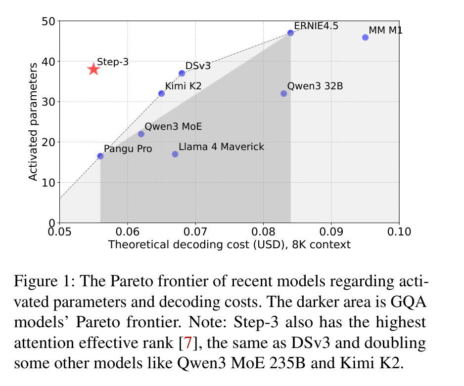
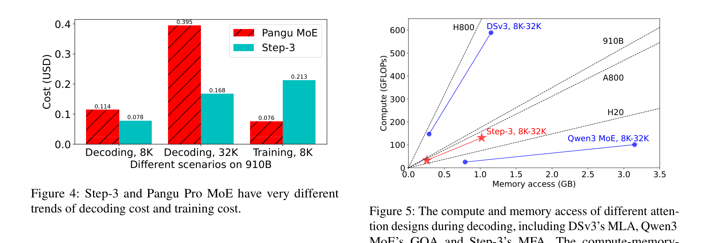
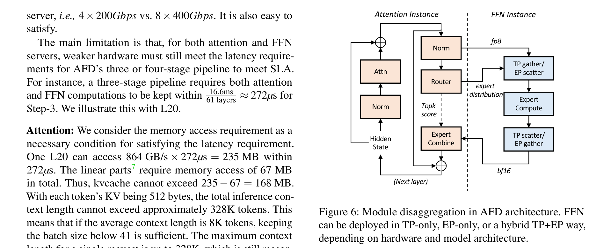
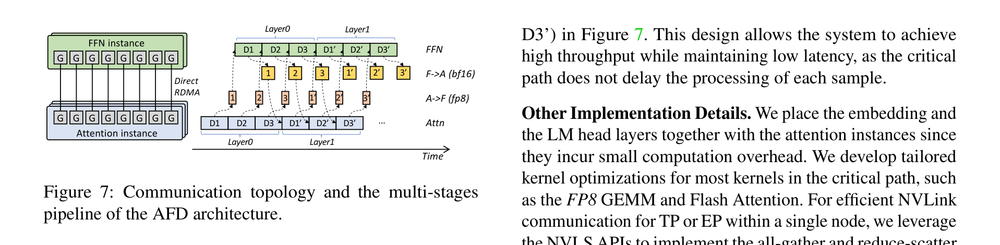
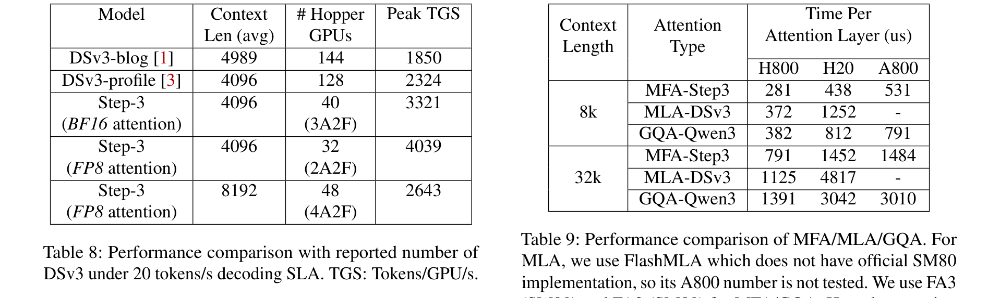
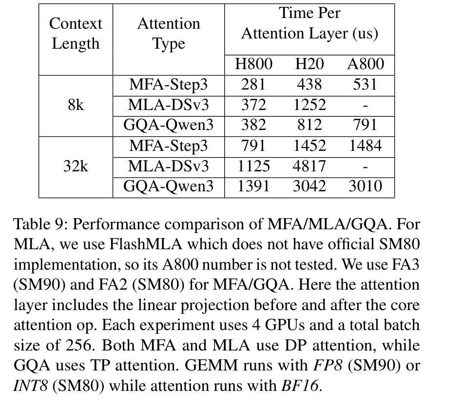

# Step-3 is Large yet Affordable: Model-System Co-design for Cost-Effective Decoding

**Authors:** StepFun Inc. (Bin Wang, Bojun Wang, Changyi Wan, Guanzhe Huang, Hanpeng Hu, Haonan Jia, Hao Nie, Mingliang Li, Nuo Chen, Siyu Chen, and others)
**Institution:** StepFun Inc.
**Date:** July 25, 2025
**Paper:** [PDF](https://arxiv.org/abs/2507.19427)

---

## TL;DR

Step-3 is a 321B-parameter VLM (38B active per token) designed from the ground up to minimize decoding cost. Two co-designed innovations make this work: (1) Multi-Matrix Factorization Attention (MFA), which achieves an arithmetic intensity of 128 — a sweet spot that runs efficiently on both expensive GPUs (H800) and cheap ones (H20, A800) — and (2) Attention-FFN Disaggregation (AFD), a serving system that puts attention and FFN on separate GPU pools so each runs at near-peak efficiency. The result: Step-3 achieves 4,039 tokens/s/GPU on Hopper GPUs (74% higher than DeepSeek-V3's 2,324) and ~40% lower theoretical decoding cost than both DSv3 and Qwen3-MoE at 8K context, with the gap widening at longer contexts.

---

## Key Figures

### Figure 1: Pareto Frontier of Activated Parameters vs. Decoding Cost

Step-3 sits at the new Pareto frontier: it has the *most* activated parameters (38B) yet the *lowest* decoding cost. This breaks the intuition that fewer active parameters = cheaper decoding. The key insight is that decoding cost is dominated by attention design and hardware efficiency, not parameter count.

### Figures 4-5: Attention Cost Analysis and Roofline Model

Left: Decoding cost breakdown for Step-3 vs. Pangu Pro MoE (which has only 16.5B active params but higher decoding cost). Right: The roofline model showing why MFA works — its arithmetic intensity (128) sits between H20 (74) and H800 (591), making it efficient on all hardware. DSv3's MLA (512) is compute-bound on everything except H800. Qwen3's GQA (32) is memory-bound on everything except H20.

### Figure 6: AFD Architecture

The AFD system splits each transformer layer: the attention instance handles normalization, attention, and routing; then sends FP8 tokens over the network to the FFN instance which handles expert computation and sends BF16 activations back. This separation lets each side run with optimal batch size and parallelism independently.

### Figure 7: Multi-Stage Pipeline

The 3-stage pipeline: Attention → Network (A→F) → FFN → Network (F→A). Three micro-batches (D1, D2, D3) flow through simultaneously, hiding all network communication latency. The target is 50ms TPOT, which means each stage gets 16.6ms across all 61 layers (~272μs per layer).

### Table 8: End-to-End Performance

The headline result: Step-3 with FP8 attention achieves 4,039 peak TGS (tokens/GPU/second) on just 32 Hopper GPUs, vs. DSv3's 2,324 on 128 GPUs. Even with BF16 attention on 40 GPUs, Step-3 still hits 3,321 TGS.

### Table 9: MFA vs. MLA vs. GQA Latency

MFA is fastest on all hardware at all context lengths. The gap is dramatic on cheaper hardware: at 32K context on H20, MFA takes 1,452μs vs. MLA's 4,817μs (3.3x faster). On A800, MFA takes 1,484μs vs. GQA's 3,010μs (2x faster).

---

## Key Novel Ideas

### 1. Multi-Matrix Factorization Attention (MFA)

The core architectural innovation. MFA uses low-rank matrix factorization in the Query-Key circuit:
- 64 query heads, each with dimension 256
- Query dimension is down-projected from hidden dim 7168 to a low-rank of 2048, normalized, then up-projected to 64×256
- Key and Value share a single head with dimension 256

The critical property is **arithmetic intensity** — the ratio of compute FLOPs to bytes of KV accessed from memory. Each attention design has an inherent arithmetic intensity that doesn't change with batch size or context length:

| Attention Type | Arithmetic Intensity | Best Hardware Match |
|---|---|---|
| MLA (DSv3) | 512 | H800 only (roofline 591) |
| MFA (Step-3) | 128 | A800 (156), 910B (175), decent on H20 (74) and H800 |
| GQA (Qwen3) | 32 | H20 only (roofline 74) |

MFA hits the sweet spot: low enough to run efficiently on cheap hardware, high enough to not waste compute on expensive hardware. Meanwhile, MFA's effective attention rank is 16,384 — the same as DSv3's MLA and 2x Qwen3's — so it doesn't sacrifice expressiveness.

The arithmetic intensity is deliberately set slightly below most hardware rooflines to leave room for future optimizations (KV quantization, MTP) that would increase it.

### 2. Attention-FFN Disaggregation (AFD)

Instead of running attention and FFN layers together on the same GPUs, AFD puts them on separate GPU pools connected by high-speed network:

- **Attention instances**: Handle attention computation + KV cache management. Use local data parallelism (each GPU handles independent batches).
- **FFN instances**: Handle MoE expert computation. Can use TP, EP, or hybrid TP+EP.
- **3-stage pipeline**: Attention → Network → FFN, with three micro-batches flowing simultaneously to hide all communication latency.

Why this matters:
1. **Independent batch sizes**: FFN needs large batches for high MFU (especially with sparse MoE). Attention needs small batches per GPU to fit KV cache. AFD decouples these constraints.
2. **Independent scaling**: For longer contexts, just add more attention instances. FFN stays the same.
3. **Independent hardware**: Attention can run on memory-bandwidth-heavy GPUs, FFN on compute-heavy ones.
4. **Smaller deployment scale**: Step-3 uses 32 GPUs total (2 attention + 2 FFN instances) vs. DSv3's 320 GPUs for DeepEP.

### 3. Hardware-Aware MoE Sparsity

The paper derives the minimum MoE sparsity that hardware can support while achieving high MFU:

$$S \geq \frac{H \times \text{FLOPs} \times L}{\text{Net} \times \text{Bandwidth} \times 11.1\text{ms}}$$

where S is sparsity (fraction of experts activated), H is hidden dimension, L is number of layers, Net is network bandwidth, and Bandwidth is memory bandwidth.

| Hardware | Minimum Sparsity S |
|---|---|
| H800 | 0.058 |
| H20 | 0.007 |
| A800 | 0.031 |
| 910B | 0.034 |

Step-3 chooses S ≈ 0.08 — above the H800 minimum. DSv3's sparsity (8/256 ≈ 0.031) means it needs workarounds (large EP with 320+ GPUs, routing restrictions) to run efficiently on H800. Models like Kimi K2 and Llama 4 Maverick are even sparser, making them even less hardware-friendly.

The lesson: designing a sparser model to reduce "activated parameters" can backfire if the sparsity doesn't match hardware constraints. You end up needing more GPUs to compensate.

### 4. Attention Cost Dominates — Not Parameter Count

The paper's most counterintuitive finding: total parameters, or even activated parameters, are poor predictors of decoding cost. Examples:

- **Qwen3-32B** has far fewer parameters than DSv3 or Step-3, but the *highest* decoding cost among all models tested — because its GQA attention is expensive on non-H20 hardware.
- **Pangu Pro MoE** has only 16.5B active parameters (less than half of Step-3's 38B) but much higher decoding cost — because it was optimized for *training*, not *decoding*.
- **Step-3** has the most active parameters (38B) yet the lowest decoding cost — because MFA's arithmetic intensity matches hardware rooflines.

At 8K context, attention already costs 2-10x more than FFN. At 32K, the gap grows further. This is why attention design is the critical variable.

---

## Architecture Details

| Property | Value |
|---|---|
| Total Parameters (LLM) | 316B |
| Total Parameters (VLM) | 321B |
| Activated Params/Token | 38B |
| Layers | 61 |
| Hidden Dimension | 7168 |
| Attention | MFA |
| Low-rank Query Dimension | 2048 |
| Query Heads | 64 |
| Head Dimension | 256 |
| KV Heads | 1 (shared) |
| Attention Arithmetic Intensity | 128 (FP8 KV) |
| Attention Effective Rank | 16,384 |
| MoE Sparsity | ~0.08 (including shared expert) |
| Shared Experts | 1 |
| MoE Layers | All except first 4 and last |
| Quantization | Full FP8 (no accuracy loss) |

---

## Key Results

### Theoretical Decoding Cost (USD per 1M tokens, best hardware for each model)

| Model | Active Params | 8K Context | 32K Context |
|---|---|---|---|
| **Step-3** | 38B | **$0.055** | **$0.129** |
| DSv3 | 37B | $0.068 | $0.211 |
| Qwen3-MoE | 22B | $0.062 | $0.193 |
| Qwen3-32B | 32B | $0.107 | $0.286 |
| Kimi K2 | 32B | $0.065 | $0.208 |
| Llama 4 Maverick | 17B | $0.067 | $0.144 |
| MiniMax M1 | ~45B | $0.094 | $0.176 |

### End-to-End Throughput (Hopper GPUs, 50ms TPOT SLA)

| Setup | Context | GPUs | Peak TGS |
|---|---|---|---|
| Step-3 (FP8 attn) | 4K | 32 (2A2F) | **4,039** |
| Step-3 (BF16 attn) | 4K | 40 (3A2F) | 3,321 |
| Step-3 (FP8 attn) | 8K | 48 (4A2F) | 2,643 |
| DSv3 (profiling) | 4K | 128 | 2,324 |
| DSv3 (blog) | ~5K | 144 | 1,850 |

### MFA vs. MLA vs. GQA Per-Layer Latency (μs)

| Context | Type | H800 | H20 | A800 |
|---|---|---|---|---|
| 8K | MFA (Step-3) | **281** | **438** | **531** |
| 8K | MLA (DSv3) | 372 | 1,252 | — |
| 8K | GQA (Qwen3) | 382 | 812 | 791 |
| 32K | MFA (Step-3) | **791** | **1,452** | **1,484** |
| 32K | MLA (DSv3) | 1,125 | 4,817 | — |
| 32K | GQA (Qwen3) | 1,391 | 3,042 | 3,010 |

---

## Key Takeaways

1. **Activated parameter count is a misleading cost metric.** Step-3 activates the most parameters (38B) yet has the lowest decoding cost. Qwen3-32B activates fewer but costs 2x more. The attention design's arithmetic intensity and hardware match dominate actual cost.

2. **Attention cost dominates decoding, not FFN.** At 8K context, attention is already 2-10x more expensive than FFN. At 32K, the gap widens further. This means attention design choices have far more impact on decoding cost than MoE sparsity or parameter count.

3. **MFA's arithmetic intensity of 128 is the sweet spot.** DSv3's MLA at 512 is too compute-heavy for anything except H800. Qwen3's GQA at 32 is too memory-heavy for anything except H20. MFA at 128 runs reasonably well on *all* hardware, and still leaves room for future optimizations (KV quantization, MTP).

4. **Over-sparse MoE hurts decoding efficiency.** DSv3's sparsity (S≈0.031) requires 320+ GPU deployments with routing restrictions to run efficiently on H800. Step-3's S≈0.08 works cleanly with just 32 GPUs and no routing hacks.

5. **AFD enables divide-and-conquer design.** By separating attention and FFN onto different GPU pools, each can be independently optimized for batch size, parallelism, hardware, and scaling. This is what makes the theoretical cost advantages actually achievable in practice.

6. **32 GPUs vs. 320 GPUs.** Step-3's AFD deployment uses 32 Hopper GPUs for 4K context. DSv3's DeepEP requires 128-320 GPUs. Smaller scale means fewer network congestion issues, better reliability, and less expert imbalance.

7. **Hybrid attention models have hidden costs.** Models like MiniMax M1 and Llama 4 Maverick use mostly linear attention + a few full attention layers. But those few full attention layers can still have larger KV cache than Step-3's *entire* model, and create pipeline imbalance in distributed inference.

8. **"Hardware-optimized" for training ≠ hardware-optimized for decoding.** Pangu Pro MoE was designed for Huawei 910B training efficiency, but its decoding cost on 910B is much higher than Step-3. Training cost scales with activated parameters; decoding cost requires attention-hardware co-design.

9. **FP8 attention quantization gives 18% throughput gain.** Step-3 achieves full FP8 quantization (including attention) without accuracy loss, going from 3,321 TGS (BF16 attention) to 4,039 TGS (FP8 attention). DSv3's high arithmetic intensity means similar quantization wouldn't help it much.

10. **Step-3 can scale to 600B+ with modest cost increase.** Doubling the MoE FFN to ~600B (similar to DSv3) requires "4F" instead of "2F" instances, yielding 3,291 TGS — still 42% higher than DSv3's 2,324 TGS, despite double the parameters.

---

## What's Open-Sourced

- **StepMesh**: The AFD communication library is open-sourced at [github.com/stepfun-ai/StepMesh](https://github.com/stepfun-ai/StepMesh)
- **Model weights**: Not released (as of the paper)
- **No training code or data released**
