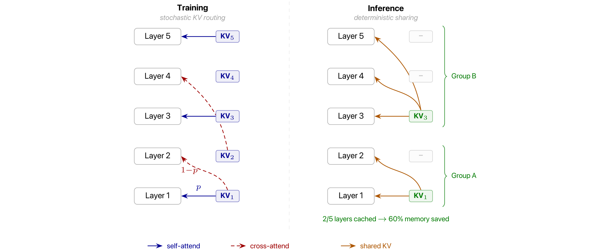
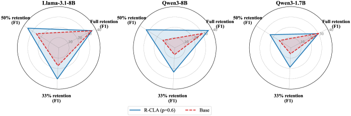
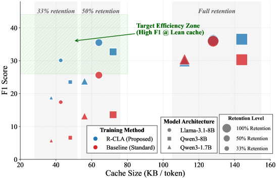
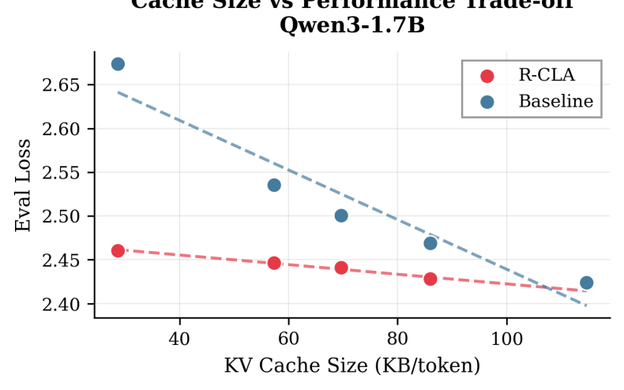
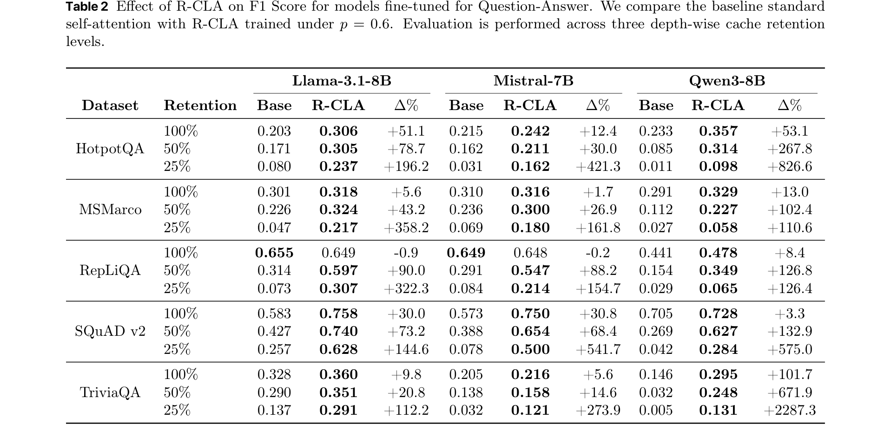
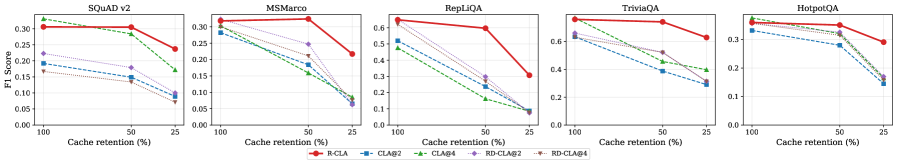

# Stochastic KV Routing: Enabling Adaptive Depth-Wise Cache Sharing

**Authors:** (arxiv 2604.22782 — institution details not specified in paper metadata)
**Date:** April 28, 2026
**Paper:** [PDF](https://arxiv.org/abs/2604.22782)

---

## TL;DR

KV caches in transformer inference store separate key-value states for every layer, but most of that per-layer cache is redundant. This paper proposes Random Cross-Layer Attention (R-CLA): during training, each layer randomly decides whether to use its own KV states or borrow them from a preceding layer. This trains the model to be robust to arbitrary depth-wise cache sharing at inference time. A single R-CLA-trained model can be deployed with 100%, 50%, or 25% of its KV cache layers retained, adapting to different hardware constraints without retraining. Across three model families (Llama-3.1-8B, Mistral-7B, Qwen3-8B) on five QA benchmarks, R-CLA at 50% retention roughly matches or exceeds the base model at full retention, and the stochastic training itself acts as a regularizer that often *improves* full-cache performance.

---

## Key Figures

### Figure 4: R-CLA Method — Training vs Inference

During **training** (left), each layer flips a coin: with probability p it uses its own KV states (self-attend, blue arrows), and with probability 1-p it borrows from a random earlier layer (cross-attend, red dashed arrows). During **inference** (right), a fixed deterministic sharing scheme is applied — here, layers 1-2 form Group A sharing KV₁, and layers 3-5 form Group B sharing KV₃. Only 2 of 5 layers need their own cache, saving 60% memory. The key insight: random training produces a model robust to *any* deterministic sharing scheme at test time.

### Figure 2: Performance Under Varying Cache Retention

Radar plots comparing R-CLA (blue solid) vs base models (red dashed) on QA F1 scores at full, 50%, and 33% cache retention. R-CLA models maintain near-full performance even at 50% retention, while base models collapse. Notably, R-CLA often *improves* the full-retention score compared to the base model — the stochastic training has a regularization effect.

### Figure 3: Pareto Frontier — Cache Size vs F1 Performance

R-CLA dominates standard self-attention in the Pareto sense across all five QA datasets. For any given cache budget, R-CLA achieves equal or better F1. The curves show a smooth degradation under R-CLA versus a sharp cliff for base models.

### Figure 5: Deep + Shared Cache vs Shallow + Full Cache

A critical experiment: given a fixed KV cache budget, is it better to have a 28-layer model with shared cache (R-CLA, red) or a shallower model with full per-layer cache (baseline, blue)? The R-CLA model consistently achieves lower eval loss at every cache size. This proves that **depth with sharing beats shallowness with full cache** — the model's extra layers still contribute useful computation even when they don't have their own KV states.

### Table 2: Main Fine-Tuning Results

R-CLA improves over base models in nearly every cell. At 100% retention, gains range from -0.9% (RepLiQA on Llama, already near ceiling) to +101.7% (TriviaQA on Qwen3-8B). At 25% retention, the base models collapse catastrophically while R-CLA retains substantial capability — e.g., Llama-3.1-8B on SQuAD v2 goes from 0.257 (base) to 0.628 (R-CLA), a 144.6% improvement.

### Figure 8: Ablation — R-CLA vs Deterministic CLA@k

This ablation disentangles the value of *randomness* from *sharing*. Deterministic CLA@k (sharing every k-th layer, dashed lines) works well at its specific trained retention level but collapses elsewhere. R-CLA (red solid) is the only method that maintains competitive performance across *all* retention levels from a single training run.

---

## Key Novel Ideas

### 1. Random Cross-Layer Attention (R-CLA)

The core idea: instead of training a model with a fixed KV cache sharing pattern (which overfits it to that specific pattern), introduce stochasticity during training so the model learns to cope with *any* sharing pattern at inference time.

**How it works.** During each forward pass, for every layer $l$:

- Sample $d \sim \text{Bernoulli}(p)$
- If $d = 1$: standard self-attention — use this layer's own $(K_l, V_l)$
- If $d = 0$: cross-layer attention — sample $l'$ uniformly from $\{1, \dots, l-1\}$ and use $(K_{l'}, V_{l'})$

The probability $p$ controls how often a layer uses its own cache vs borrowing. The paper uses $p = 0.6$ as default (meaning 40% of the time, a layer borrows from a random earlier layer).

**Why it works.** By exposing the query projection $Q_l$ to KV states from diverse earlier layers during training, the model learns to extract information from *generic* semantic representations rather than requiring the specific feature alignment of its own layer. This is analogous to how dropout forces neurons to be useful independently — R-CLA forces layers to be useful even when they can't access their own KV cache.

**At inference time**, a fixed deterministic cache sharing strategy $\mathcal{S}$ is chosen. For any layer $l$ not in $\mathcal{S}$, it uses the nearest cached predecessor:

$$\mu(l) = \max\{j \in \mathcal{S} \mid j < l\}$$

Because the model was trained against random sharing patterns, it tolerates any deterministic scheme chosen at deployment.

### 2. Depth-Wise Optimization as an Orthogonal Axis

Most KV cache reduction work operates on the *temporal* axis — deciding which tokens to keep or evict from the cache. This paper argues the *depth* axis (which layers need their own cache) is orthogonal and underexplored.

The argument is compelling: temporal eviction is query-dependent (a token unimportant now might become important later), requiring dynamic re-computation. Depth-wise sharing is static — you decide once at deployment which layers share, and it never changes. This makes it simpler to implement, doesn't require per-query decisions, and composes cleanly with temporal methods and quantization.

The data expansion argument is striking: a single token in Llama-2-7B occupies 2-4 bytes as an integer but expands to ~512 KB of KV cache across layers (a 100,000x expansion). Even "efficient" models like Qwen3-8B still expand to ~144 KB/token. Caching a book-length context can exceed the memory of the model weights themselves.

### 3. Single Model, Multiple Deployment Profiles

A key practical advantage: R-CLA produces **one model** that can be deployed at different KV cache budgets without retraining.

- On a high-end GPU cluster: use 100% cache retention for maximum quality
- On a mid-range setup: use 50% retention for 2x memory savings with minimal quality loss
- On an edge device: use 25% retention for 4x memory savings, accepting some degradation

This is particularly valuable because modern LLM serving involves diverse hardware — different GPUs, different memory capacities, different batch sizes. Instead of training separate models for each scenario, a single R-CLA model covers all of them.

### 4. Regularization-Like Effect from Stochastic Training

An unexpected finding: R-CLA often **improves** performance at full cache retention (100%), not just at reduced retention. Examples:

- Llama-3.1-8B on HotpotQA: 0.203 (base) → 0.306 (R-CLA), +51.1%
- Qwen3-8B on TriviaQA: 0.146 (base) → 0.295 (R-CLA), +101.7%
- Llama-3.1-8B on SQuAD v2: 0.583 (base) → 0.758 (R-CLA), +30.0%

The paper's fine-tuning training dynamics (Appendix B) show that R-CLA slows learning and delays overfitting — a classic regularization signature. For Llama-3.1-8B, the base model overfits while R-CLA maintains better generalization. This makes R-CLA a "free lunch" in data-constrained fine-tuning: you get cache flexibility *and* better accuracy.

---

## Architecture Details

| Parameter | Value |
|---|---|
| Models tested (fine-tuning) | Llama-3.1-8B, Mistral-7B, Qwen3-8B |
| Model tested (pre-training) | Qwen3-1.7B-style (28 layers, trained from scratch) |
| R-CLA probability p | 0.6 (default), ablated at 0.25, 0.5, 0.75 |
| Cache sharing strategy | Every k-th layer retains cache; others use nearest cached predecessor |
| Orthogonal to | GQA, MQA, KV quantization, temporal eviction |

### Inference Efficiency (Qwen3-8B-scale, 36 layers, single 80GB GPU)

| Input Length | Group Size | KV Cache (MB) | Peak Memory (MB) | TTFT (ms) | Throughput (tok/s) |
|---|---|---|---|---|---|
| 8,192 | 1 (baseline) | 1,170 | 19,319 | 297 | 34.0 |
| 8,192 | 4 (shared) | 293 | 18,455 | 286 | 41.6 |
| 32,768 | 1 (baseline) | 4,626 | 30,305 | 1,903 | 22.8 |
| 32,768 | 4 (shared) | 1,157 | 26,849 | 1,868 | 26.1 |

At batch size 16 with 8K context: baseline OOMs, but group-size-4 sharing completes successfully at 60,306 MB peak memory and 8.0 tok/s.

---

## Training Pipeline

### Pre-training (Qwen3-1.7B from scratch)
- **Data:** Subset of OpenWeb corpus
- **Token budget:** 34B tokens (Chinchilla-optimal for 1.7B params)
- **Context length:** 2,048
- **Optimizer:** AdamW (β₁=0.9, β₂=0.99), weight decay 0.1, gradient clipping 0.1
- **LR schedule:** Linear warmup to 1e-4 over 5% steps, cosine decay
- **R-CLA p values tested:** 0.25, 0.5, 0.6, 0.75
- **Hardware:** NVIDIA H100 GPUs
- **Result:** Eval loss increases by less than 2% even at p=0.75 (no instability)

### Fine-tuning (Llama-3.1-8B, Mistral-7B, Qwen3-8B)
- **Data:** Merged from HotpotQA, SQuAD v2, MSMarco, TriviaQA, RepLiQA
- **Steps:** 50,000 with batch size 128
- **Max input length:** 8,192 tokens
- **Optimizer:** AdamW (β₁=0.9, β₂=0.95), weight decay 0.1
- **LR schedule:** Linear warmup to 5e-6 over 1.5% steps, linear decay to 0
- **Data augmentation:** Random question/context ordering (50%/50%), HotpotQA passage permutation (3 variations per example)
- **R-CLA probability:** p=0.6

---

## Key Results

### Pre-training Stability (Table 1)

| R-CLA p | Eval Loss | Δ from baseline |
|---|---|---|
| 0.00 (baseline) | 2.424 | — |
| 0.25 | 2.428 | +0.2% |
| 0.50 | 2.441 | +0.7% |
| 0.60 | 2.446 | +0.9% |
| 0.75 | 2.461 | +1.5% |

### Fine-tuning: R-CLA vs Base (selected highlights from Table 2)

**At 100% retention (full cache) — R-CLA as regularizer:**

| Model | Dataset | Base F1 | R-CLA F1 | Δ% |
|---|---|---|---|---|
| Llama-3.1-8B | HotpotQA | 0.203 | 0.306 | +51.1% |
| Llama-3.1-8B | SQuAD v2 | 0.583 | 0.758 | +30.0% |
| Qwen3-8B | TriviaQA | 0.146 | 0.295 | +101.7% |

**At 50% retention — practical deployment sweet spot:**

| Model | Dataset | Base F1 | R-CLA F1 | Δ% |
|---|---|---|---|---|
| Llama-3.1-8B | RepLiQA | 0.314 | 0.597 | +90.0% |
| Llama-3.1-8B | SQuAD v2 | 0.427 | 0.740 | +73.2% |
| Qwen3-8B | TriviaQA | 0.032 | 0.248 | +671.9% |

**At 25% retention — extreme compression:**

| Model | Dataset | Base F1 | R-CLA F1 | Δ% |
|---|---|---|---|---|
| Llama-3.1-8B | SQuAD v2 | 0.257 | 0.628 | +144.6% |
| Mistral-7B | TriviaQA | 0.032 | 0.121 | +273.9% |
| Qwen3-8B | TriviaQA | 0.005 | 0.131 | +2287.3% |

### Ablation: Why Randomness Matters (Table 3, Llama-3.1-8B)

| Method | 100% retention | 50% retention | 25% retention |
|---|---|---|---|
| R-CLA | Best across all tasks | Best across all tasks | Best across all tasks |
| CLA@2 (deterministic) | Often matches R-CLA | Sharp degradation | Severe collapse |
| CLA@4 (deterministic) | Sometimes beats R-CLA | Moderate degradation | Severe collapse |
| RD-CLA@2 (randomized deterministic) | Competitive | Better than CLA@2 | Better than CLA@2 |

The randomness is most important for robustness across retention levels. At full retention, fixed CLA@k can match R-CLA — but at reduced retention, only R-CLA maintains competitive performance.

---

## Key Takeaways

1. **Depth-wise cache sharing is an overlooked optimization axis.** Most KV cache work focuses on temporal eviction (which tokens to keep). Sharing KV states *across layers* is orthogonal, simpler (static decision, no per-query overhead), and composes with other methods like GQA and quantization.

2. **Random training produces deployment flexibility.** A single R-CLA model adapts to any cache sharing strategy at inference — from 100% retention on high-end hardware to 25% retention on edge devices. Deterministic CLA@k methods only work well at their specific trained retention level.

3. **Stochastic KV routing acts as a regularizer.** In data-constrained fine-tuning (the common case), R-CLA frequently *improves* full-cache performance. Llama-3.1-8B on SQuAD v2 goes from 0.583 to 0.758 (+30%) even without any cache sharing at inference. This makes R-CLA essentially free — you get cache flexibility as a bonus.

4. **Deep + shared beats shallow + full cache.** Given a fixed KV cache budget, a 28-layer R-CLA model with shared cache consistently outperforms a shallower model with full per-layer cache (Figure 5). The extra depth provides computational value even when layers share KV states.

5. **Pre-training with R-CLA is stable.** At p=0.75 (75% of attention operations redirected), eval loss increases by only 1.5% from baseline. No training instabilities observed. R-CLA can be introduced from the start if cache sharing is desired downstream.

6. **Base models collapse catastrophically under cache sharing.** Without R-CLA, dropping to 25% cache retention causes near-zero performance on most tasks. This confirms that standard self-attention creates rigid layer-specific KV dependencies that can't be broken post-hoc.

7. **The implementation is efficient.** At inference, non-leader layers skip their K,V projections entirely and reuse the leader's cached states. At 8K context with group size 4: KV cache drops from 1170 MB to 293 MB (4x reduction), throughput improves from 34.0 to 41.6 tok/s (+22%), and batch size 16 becomes feasible where baseline OOMs.

8. **p=0.6 is a robust default.** The paper uses p=0.6 (each layer uses its own KV 60% of the time) across all fine-tuning experiments. The pre-training ablation shows the method is not sensitive to the exact value of p.

9. **The 100,000x data expansion problem frames the motivation well.** A token is 2-4 bytes as an integer but becomes ~512KB of KV cache in Llama-2-7B. Caching Alice in Wonderland requires 1.4x the model's weight memory. This framing makes the case that aggressive cache reduction is necessary, not optional.

10. **The method is mechanically distinct from layer dropout.** Structured dropout (Fan et al., 2019) skips entire layers during training. R-CLA keeps all layers computing — only the *source* of KV states is randomized. Every layer does its full forward pass, just sometimes with borrowed keys and values.

---

## Limitations

- Requires access to training resources (fine-tuning or pre-training); no post-hoc application.
- Evaluated only on QA tasks for fine-tuning; broader task evaluation needed.
- Not tested on Mixture-of-Experts (MoE) architectures (though it should work since it only modifies attention KV sources).
- Composition with temporal eviction and KV quantization left to future work.
- Overtraining regimes not explored.

---

## What's Open-Sourced

The paper does not mention releasing code, model checkpoints, or datasets. No GitHub repository is linked. The method is straightforward to implement given the description (a few lines of modification to the attention forward pass during training).
