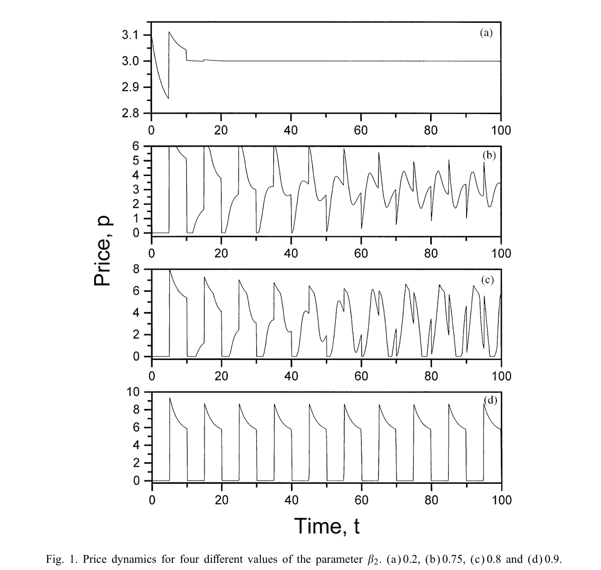
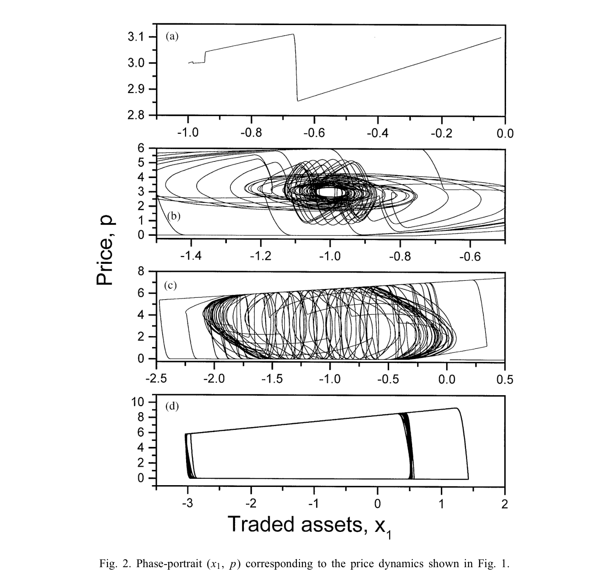
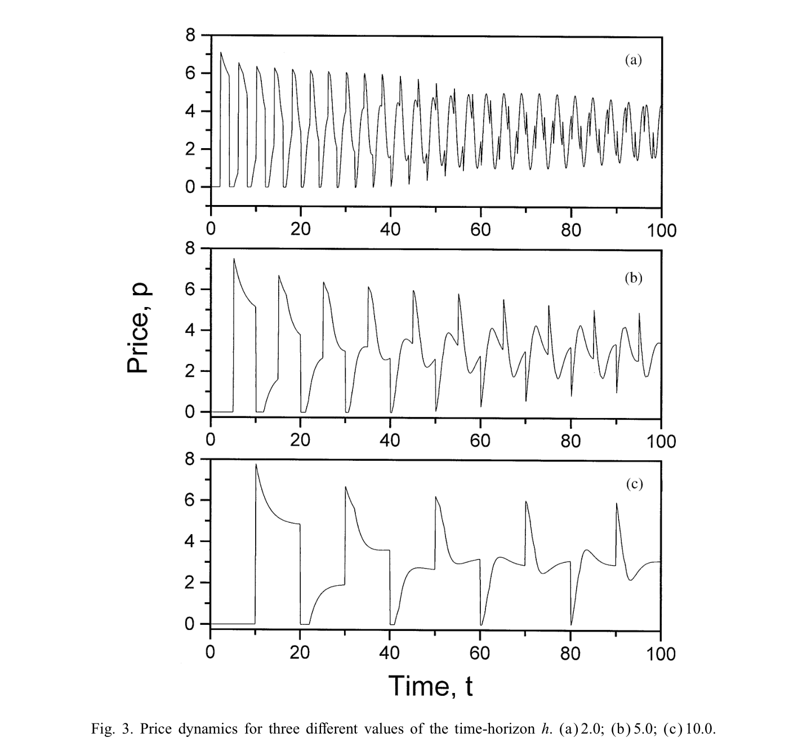
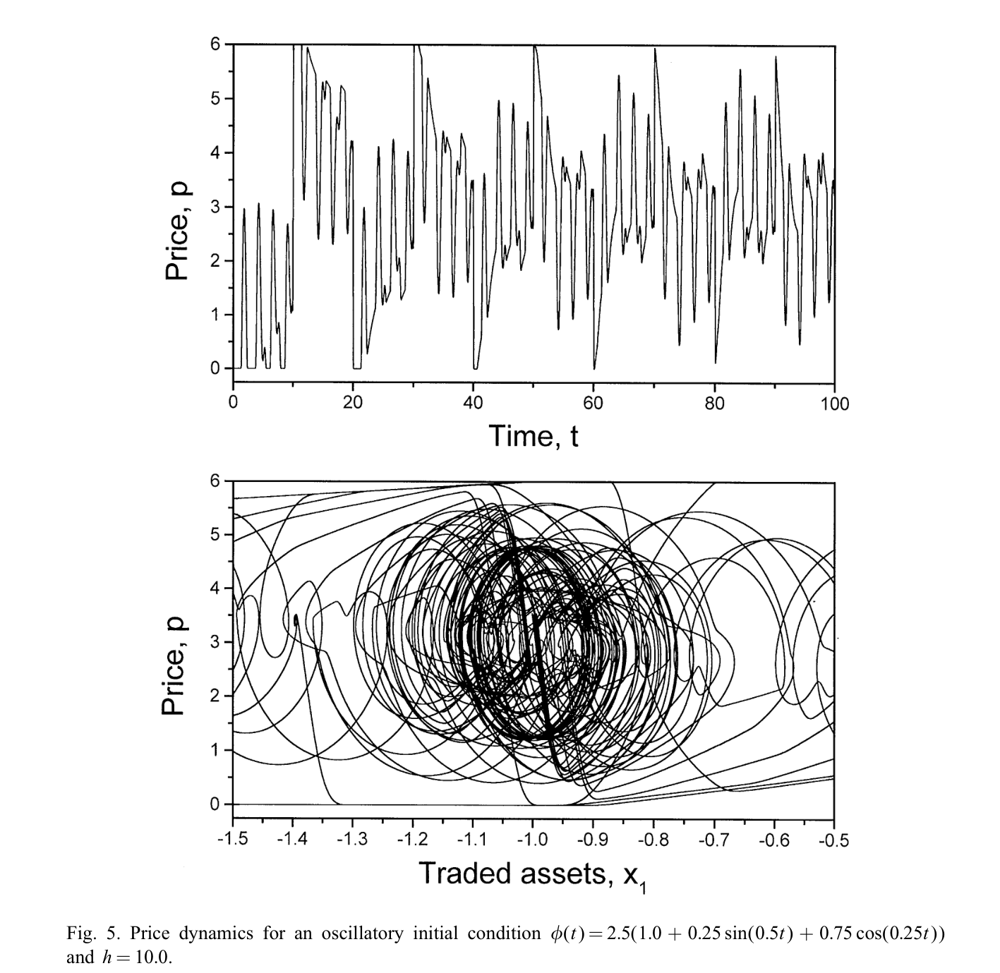
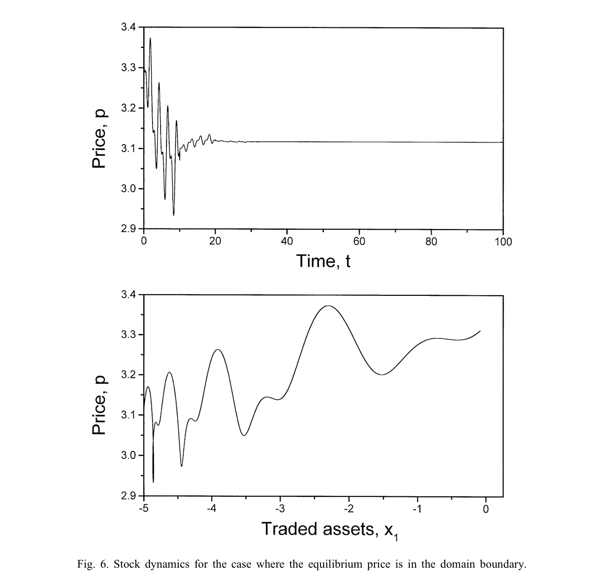

# Modeling Stock Market Dynamics Based on Conservation Principles

**Authors:** Jose Alvarez-Ramirez, Carlos Ibarra-Valdez
**Affiliation:** Departamento de Matematicas, Universidad Autonoma Metropolitana-Iztapalapa, Mexico
**Date:** Received February 12, 2001; Published in Physica A 301 (2001) 493–511
**Paper:** [PDF](paper.pdf)

---

## TL;DR

This paper builds a deterministic model of stock prices using a simple physics-style idea: **assets are conserved** (what one trader buys, another must sell). By writing down differential equations for how two types of traders — "fundamental traders" who bet on a fair price and "positive feedback traders" who chase trends — exchange assets, the authors show that the resulting price equation is a *neutral differential equation* (one involving time-delayed terms). Remarkably, this simple 2-trader model can produce price behavior ranging from stable convergence to wild oscillations to seemingly-random erratic dynamics, depending on how aggressively the feedback traders respond to price changes.

---

## Key Figures

### Fig. 1: Price Dynamics Under Increasing Feedback-Trader Aggressiveness (β̃₂)

This is the paper's central result. As the parameter β̃₂ (which measures how strongly positive-feedback traders react to past price changes) increases from 0.2 to 0.9, the price behavior transitions through four regimes: (a) stable convergence to equilibrium at p≈3.0, (b) complex oscillations with discontinuities at β̃₂=0.75, (c) a strange-attractor-like erratic pattern at β̃₂=0.8, and (d) pure high-amplitude periodic behavior at β̃₂=0.9. All four panels come from the same model with the same parameters except β̃₂ — the transition from stability to apparent chaos is driven by a single bifurcation parameter.

### Fig. 2: Phase Portraits (x₁, p) Corresponding to Fig. 1

The phase-space view of the same four cases. Panel (a) shows a simple spiral into the equilibrium. Panel (b) shows a complex attractor. Panel (c) is the most striking — at β̃₂=0.8, the system traces what appears to be a *strange attractor* with fractal-like structure in the (traded assets, price) plane. Panel (d) shows a limit cycle. The transition from (a) to (c) is a bifurcation from point-attractor to strange attractor driven purely by feedback-trader aggressiveness.

### Fig. 3: Effect of Time-Horizon h on Price Dynamics

For fixed β̃₂=0.75, the time-horizon h (how far back feedback traders look at price history) changes the oscillation frequency but not the qualitative oscillatory behavior. Larger h produces lower-frequency oscillations: the past price signal (p − p_h)/h brings large, older price swings into the present when h is large. Smaller h yields higher-frequency noise-like behavior because traders react to very recent changes only. The practical implication: better information technology (smaller h) does not eliminate oscillations; it makes them faster and smaller.

### Fig. 5: Oscillatory Initial Condition Inheritance

When the initial price history φ(t) is itself oscillatory (φ(t) = 2.5(1.0 + 0.25 sin(0.5t) + 0.75 cos(0.25t))), the stock dynamics inherits those oscillations *on top of* the intrinsic oscillations generated by the model. The resulting time-series (top) and phase portrait (bottom) are notably more complex. This demonstrates that the neutral differential equation preserves and amplifies structure from initial conditions — history matters, permanently.

### Fig. 6: Boundary Equilibrium — One Trader Class Eliminated

When the equilibrium is a *boundary* point (one class of traders is pushed entirely out of the market), the price still oscillates initially but converges. Here x₁,eq = −z₁(0) = −5, meaning Class 1 (fundamental traders) sell all their shares. The price stabilizes at p_eq = 3.1176 — but with damped oscillations that take roughly t=40 time units to settle. The smooth spiral in the phase portrait contrasts sharply with the strange attractors of the interior-equilibrium cases.

---

## Key Novel Ideas

### 1. Asset Conservation as a Modeling Axiom

The paper starts from a physical conservation law: in a stock market, the total number of shares doesn't change (unless the company issues new stock, which is assumed away). If there are n investor classes holding z_i(t) shares each, and the total is M(t), then:

$$\sum_{j=1}^{n} z_i(t) = M(t) \quad \text{(asset conservation)}$$

Define x_i(t) = z_i(t) − z_i(0) as the net shares *traded* by class i. Then conservation gives the core constraint:

$$\sum_{j=1}^{n} x_i(t) = 0 \quad \text{(trading conservation)}$$

In words: what one class buys, the other classes collectively sell. This is a zero-sum constraint on trading, not on wealth. It directly parallels conservation of mass, momentum, or charge in physics — and it provides a structural constraint that all price dynamics must satisfy.

**Why this matters:** Most stock-price models in 2001 (and many today) start from stochastic processes or statistical properties of returns. This paper starts from *mechanics*: what must be true about how assets move between traders, regardless of psychology. The conservation constraint reduces the degrees of freedom by one (if you know n−1 trades, the n-th is determined), and it directly links price dynamics to trading dynamics through an implicit "price equation."

### 2. Price as an Implicit Output of Trading Dynamics

Rather than postulating a stochastic process for p(t), the paper derives price from trading. Each trader class i has a trading rate ẋ_i(t) governed by their strategy T_i. The trading conservation constraint, differentiated in time, yields:

$$\sum_{j=1}^{n} T_j(x(t), p(t), \mathcal{P}(t), p_j^*(t)) = 0 \quad \text{(price equation)}$$

This is a nonlinear implicit equation for p(t): the price at time t is whatever value makes total net trading zero (supply equals demand, in continuous time). If the Implicit Function Theorem applies, you can solve for p(t) = Φ(x(t), p_i*(t)) — price is a function of trading positions and expectations.

**Why this matters:** The price isn't assumed; it *emerges* from the interaction of trader strategies subject to conservation. This is a market-clearing condition written as a differential-algebraic system, connecting the paper to systems theory and control theory rather than to stochastic finance.

### 3. The Two-Trader Model as a Neutral Differential Equation

The paper's main concrete result is for n=2 (two trader classes), following the De Long et al. [15] typology:

- **Class 1 (Fundamental traders):** Trade proportionally to the gap between their subjective fair price p₁* and the current price: x₁*(p) = N₁α₁(p₁* − p). The parameter α₁ represents trading aggressiveness, derived from mean-variance utility with risk aversion γ.

- **Class 2 (Positive-feedback traders):** Trade proportionally to both the level gap (α₂(p₂* − p)) and the *rate of past price change* (β₂(p − p_h)/h, where p_h is the price h time-units ago). These are "momentum" or "trend-following" traders.

With a first-order relaxation model (each class exponentially adjusts toward its desired position), and trading conservation (x₂ = −x₁), the dynamics reduce to:

$$a_1 \dot{p} + a_2 \dot{p}_h + a_3 p + a_4 p_h = \delta$$

This is a **neutral differential equation** — it involves the time-derivative of the delayed variable (ẋ(t−h)), not just its value. Neutral equations are qualitatively harder than retarded equations (which have only x(t−h), no ẋ(t−h)): they can exhibit discontinuities at t = kh, and solutions depend on past price *dynamics*, not just past prices.

**Why this matters:** The appearance of a neutral equation is not postulated — it falls out of the conservation constraint plus two economically-motivated trading strategies. The paper connects the economic structure of the problem to a well-studied class of functional-differential equations with known, rich bifurcation behavior.

### 4. Equilibrium Price as a Weighted Mean of Expectations

The equilibrium price has a clean closed-form expression:

$$p_{eq} = \frac{N_1 \alpha_1 p_1^* + N_2 \alpha_2 p_2^*}{N_1 \alpha_1 + N_2 \alpha_2}$$

This is just the **weighted average of the two classes' expected prices**, weighted by (number of traders × aggressiveness). The equilibrium is always between p₁* and p₂*: if both classes agree on the price, the market is in equilibrium. If they disagree, the equilibrium is pulled toward whichever class has more traders or trades more aggressively.

The stability of this equilibrium, however, depends on a ratio involving the feedback parameter β̃₂: the equilibrium becomes unstable when the positive-feedback traders' reaction is too strong relative to the fundamental traders' stabilizing force. The critical condition is:

$$\tau_1 |\tilde{\beta}_2| / |\tau_1(\tilde{\beta}_2 - \tilde{\alpha}_2) - \tau_2 \tilde{\alpha}_1| < 1$$

Quick reaction by fundamental traders (small τ₁) is *necessary* for stability. Slow fundamentalists + aggressive momentum traders = instability.

### 5. Bifurcation Parameter β̃₂ and the Route to Complexity

The parameter β̃₂ = N₂β₂/h measures the *effective strength of positive-feedback trading* (number of feedback traders × their aggressiveness × inverse look-back time). The simulations show:

- **0 < β̃₂ ≲ 0.72:** stable — price converges exponentially to p_eq = 3.0
- **β̃₂ ≈ 0.72:** Hopf-like bifurcation — oscillations appear
- **β̃₂ = 0.75:** complex oscillations with discontinuities at t = kh (a signature of neutral equations)
- **β̃₂ = 0.8:** apparent strange attractor — erratic, bounded, seemingly-random price dynamics
- **β̃₂ = 0.9:** high-amplitude periodic oscillations (high-gain regime)

The economic interpretation: when momentum traders' influence exceeds a critical threshold, prices oscillate. Beyond that, they become unpredictable even though the model is completely deterministic. A simple deterministic model with two trader types can *look* random — offering an alternative to the random-walk hypothesis without invoking stochastic processes.

---

## Model Architecture

| Component | Specification |
|---|---|
| Assets | Single infinitely-divisible asset with price p(t) |
| Trader classes | n classes with N_i traders each; paper develops n=2 case |
| Conservation | Σ z_i(t) = M(t) (asset), Σ x_i(t) = 0 (trading) |
| Trading dynamics | ẋ_i = τ_i⁻¹(x_i*(·) − x_i), first-order relaxation to target |
| Class 1 strategy | x₁* = N₁α₁(p₁* − p), fundamental/mean-reversion |
| Class 2 strategy | x₂* = N₂[α₂(p₂* − p) + β₂(p − p_h)/h], momentum |
| Price determination | Implicitly from Σ T_j = 0 (market clearing) |
| Price equation type | Neutral differential equation with delay h |
| Equilibrium | p_eq = (N₁α₁p₁* + N₂α₂p₂*) / (N₁α₁ + N₂α₂) |
| Stability condition | τ₁|β̃₂| / |τ₁(β̃₂ − α̃₂) − τ₂α̃₁| < 1 |
| Bifurcation parameter | β̃₂ = N₂β₂/h |

---

## Simulation Parameters

All numerical simulations use the following base case:

| Parameter | Value | Meaning |
|---|---|---|
| α̃₁ = N₁α₁ | 1.0 | Fundamental traders' aggregate aggressiveness |
| α̃₂ = N₂α₂ | 1.0 | Feedback traders' aggregate level-sensitivity |
| τ₁ | 4.0 | Fundamental traders' time-constant (slow) |
| τ₂ | 2.0 | Feedback traders' time-constant (faster) |
| p₁* | 2.0 | Fundamental traders' expected price |
| p₂* | 4.0 | Feedback traders' expected price |
| M | 10.0 | Total asset supply |
| z₁(0) | 5.0 | Initial Class 1 holdings |
| φ(t) | 2.5, t ∈ [−h, 0] | Initial price history (uniform) |
| Bifurcation params | β̃₂ ∈ {0.2, 0.75, 0.8, 0.9}, h ∈ {2, 5, 10} | Varied |

---

## Key Results

### Stability transitions as β̃₂ increases (h = 5.0)

| β̃₂ | Behavior | Attractor type | Economic regime |
|---|---|---|---|
| 0.2 | Exponential convergence to p_eq = 3.0 | Stable fixed point | Fundamentals dominate |
| 0.72 | Onset of oscillations | Bifurcation boundary | Critical threshold |
| 0.75 | Complex oscillations with discontinuities at t = kh | Limit cycle / quasi-periodic | Feedback traders destabilize |
| 0.8 | Erratic, bounded, seemingly random | Strange attractor | Deterministic chaos analog |
| 0.9 | Large-amplitude periodic sawtooth | Limit cycle | High-gain feedback dominance |

### Effect of time-horizon h (β̃₂ = 0.75)

| h | Oscillation frequency | Amplitude | Behavior |
|---|---|---|---|
| 2.0 | High (many oscillations per unit time) | Moderate | Noise-like |
| 5.0 | Medium | Moderate-large | Complex oscillations |
| 10.0 | Low | Large | Slow, wide swings |

### Stability in asymptotic limits

| Limit | Equation type | Stability |
|---|---|---|
| h → 0 (perfect information) | First-order ODE: (a₁+a₂)ṗ + (a₃+a₄)p = δ | **Unconditionally stable** (if ṗ known) |
| h → ∞ (ancient history only) | First-order ODE: a₁ṗ + a₃p = δ | **Unconditionally unstable** for τ₁ ≈ τ₂ |
| h small, |a₂/a₁| < 1 | Retarded-like neutral equation | **Asymptotically stable** |

---

## Key Takeaways

1. **Conservation laws produce structure for free.** Requiring that total shares be conserved (a trivially true physical constraint) immediately gives a zero-sum condition on trading, which couples all traders' strategies into a single implicit price equation. This is the paper's deepest idea: start from *what must be true* rather than from *what might be true*.

2. **Price is emergent, not assumed.** The market price falls out of supply-demand balance under the conservation constraint. This is conceptually closer to how real markets work (prices are set by limit-order matching) than stochastic-process models where p(t) is the primitive.

3. **Two trader types suffice for complex behavior.** A market with just fundamental traders (stabilizing) and momentum traders (destabilizing) produces the full range from stable convergence through complex oscillations to apparent chaos. You do not need many agent types to get realistic-looking price dynamics.

4. **The neutral differential equation is the natural mathematical form.** The delayed rate-of-change term ẋ(t−h) arises because momentum traders react to *past price velocity*, not just past price level. This promotes the equation from "retarded" to "neutral" type, which is responsible for the discontinuities and richer dynamics.

5. **Fundamental traders are a necessary stabilizing force.** The stability condition requires fast-reacting fundamental traders (small τ₁) relative to feedback-trader intensity. If fundamentalists are slow or few, the equilibrium destabilizes. Economic interpretation: markets with more value investors are more stable; markets dominated by momentum traders oscillate.

6. **β̃₂ is the single bifurcation control.** The effective feedback strength β̃₂ = N₂β₂/h acts as a single knob controlling the qualitative behavior. This means stability can be lost three ways: more feedback traders (N₂ ↑), more aggressive feedback trading (β₂ ↑), or shorter look-back horizons (h ↓, since β̃₂ ∝ 1/h).

7. **Better technology (smaller h) doesn't eliminate oscillations — it changes their character.** Traders with faster information (smaller h) don't produce a calmer market; they produce faster, smaller oscillations. The amplitude decreases but the frequency increases. This is consistent with the empirical observation that high-frequency trading increases market microstructure noise.

8. **The "random" appearance of prices can be purely deterministic.** The strange-attractor-like dynamics at β̃₂ = 0.8 produce time-series that look indistinguishable from random walks at first glance — yet they come from a fully deterministic, 2-class model. This paper is an early (2001) example of the econophysics argument that apparent randomness in markets may be low-dimensional deterministic chaos rather than genuine stochasticity.

9. **Boundary equilibria have economic meaning.** When the equilibrium is at the boundary of the feasible set (Σ), one trader class is eliminated from the market entirely. This is a structural prediction: if feedback trading dominates sufficiently, fundamental traders get pushed out, and the market converges to a different (possibly less efficient) equilibrium.

10. **Initial conditions matter permanently in neutral equations.** Unlike retarded delay equations where initial conditions are eventually "forgotten," neutral equations propagate the initial price history φ(t) into the long-run dynamics. Past market conditions leave permanent imprints on future price behavior — a deterministic analog of long memory in financial time series.

---

## What's Open-Sourced

Nothing. This is a 2001 Physica A paper; no code or data was released. The model is simple enough to reimplement: the core equation (26) is a scalar neutral differential equation with constant coefficients that can be solved with standard delay-DE solvers (e.g., `dde23` in MATLAB, `ddeint` in Python).
